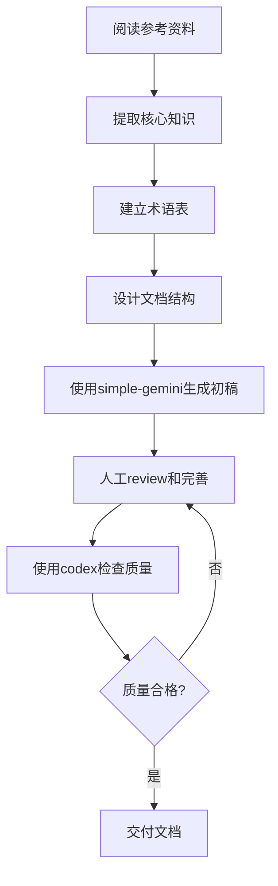
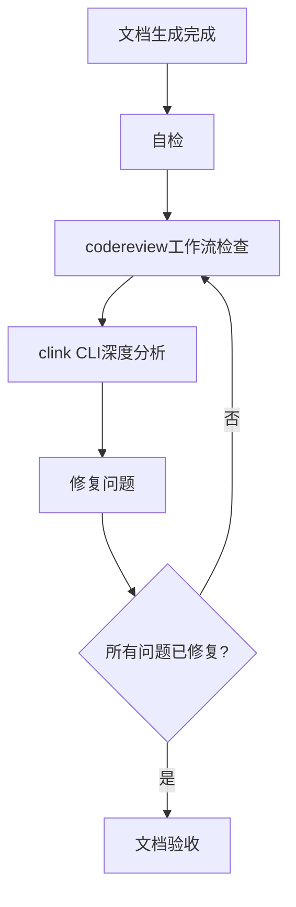
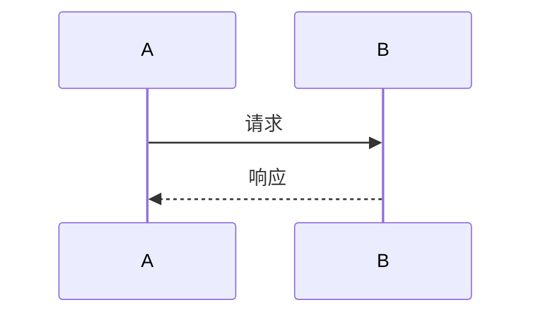
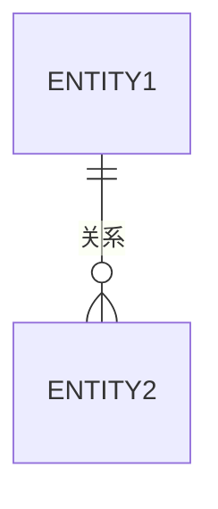
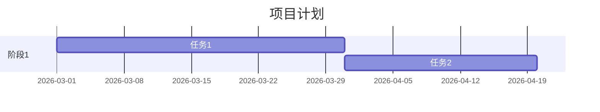

# 工具使用模式（Tool Patterns）

> 本文件记录项目中使用的工具、技能和最佳实践。

---

## 1. Claude Code 工具使用

### 1.1 文件操作工具
- **Read**：读取文件内容
- **Write**：创建新文件（首次写入前50行）
- **Edit**：编辑现有文件（追加或修改）
- **Glob**：文件搜索
- **Grep**：内容搜索

### 1.2 执行工具
- **Bash**：执行shell命令
- **Agent**：启动子代理（Explore、Plan等）

### 1.3 管理工具
- **TodoWrite**：任务清单管理
- **AskUserQuestion**：向用户提问

---

## 2. Skills 使用模式

### 2.1 simple-gemini skill
**用途**：生成标准文档和测试代码

**使用场景**：
- 生成PRD、Roadmap、README等产品文档
- 生成测试文件

**调用模式**：
```
使用 simple-gemini skill 生成 {文档类型}
- 提供详细的章节结构
- 提供核心内容要点
- 指定输出文件路径
```

**注意事项**：
- 生成后需要review和完善
- 确保符合项目术语标准
- 检查Mermaid图表语法

### 2.2 codex-code-reviewer skill
**用途**：代码和文档质量检查

**使用场景**：
- 文档生成后的质量检查
- 项目结束前的最终验证

**调用模式**：
```
使用 codex-code-reviewer skill 检查 {文件路径}
- 检查逻辑完整性
- 检查术语一致性
- 检查格式规范性
- 检查可读性
```

**注意事项**：
- 必须进行至少两轮验证
- 第一轮：codereview工作流
- 第二轮：clink CLI深度分析

### 2.3 plan-down skill
**用途**：智能规划与任务分解

**使用场景**：
- 项目启动时制定plan.md
- 复杂任务的分解

**调用模式**：
```
使用 plan-down skill 制定计划
- 描述项目目标
- 提供参考资料
- 指定输出路径
```

---

## 3. 文档生成工作流

### 3.1 标准流程


### 3.2 质量检查流程


---

## 4. Mermaid 图表使用

### 4.1 常用图表类型

**流程图（flowchart）**：


**时序图（sequenceDiagram）**：


**实体关系图（erDiagram）**：


**甘特图（gantt）**：


### 4.2 图表设计原则
- 保持简洁，避免过度复杂
- 使用中文标签，便于理解
- 节点命名清晰，避免歧义
- 关系线标注明确

---

## 5. 项目特定配置

### 5.1 文件路径约定
- **产出目录**：`C:\Users\laiyi\OneDrive\桌面\作业票\产出`
- **参考资料**：`C:\Users\laiyi\OneDrive\桌面\作业票\分析内容`
- **项目根目录**：`C:\Users\laiyi\OneDrive\桌面\作业票`
- **Memory Bank**：`C:\Users\laiyi\OneDrive\桌面\作业票\.claude\memory`

### 5.2 文件命名约定
- **产品文档**：使用小写字母和连字符（如：`PRD.md`、`roadmap.md`）
- **知识库文档**：使用大写字母（如：`PROJECTWIKI.md`、`CHANGELOG.md`）
- **Memory文件**：使用小写字母和连字符（如：`context.md`、`lessons-learned.md`）

---

## 6. 最佳实践

### 6.1 文档编写
- 使用Markdown格式
- UTF-8无BOM编码
- 简体中文
- 清晰的章节层次
- 大量使用Mermaid图表

### 6.2 任务管理
- 使用TodoWrite跟踪进度
- 及时更新任务状态
- 一次只有一个任务in_progress

### 6.3 知识管理
- 关键决策记录到ADR
- 经验教训记录到lessons-learned.md
- 错误记录到error-knowledge.md
- 工作状态记录到context.md

---

## 7. 工具链集成

### 7.1 当前工具链
- **主工具**：Claude Code (Opus 4.6)
- **文档生成**：simple-gemini skill
- **质量检查**：codex-code-reviewer skill
- **规划工具**：plan-down skill
- **版本控制**：Git（如需要）

### 7.2 未来可能集成
- **协作工具**：Notion、Confluence
- **项目管理**：Jira、Trello
- **设计工具**：Figma、Sketch
- **原型工具**：Axure、墨刀

---

**文档创建时间**：2026-03-09
**最后更新时间**：2026-03-09
