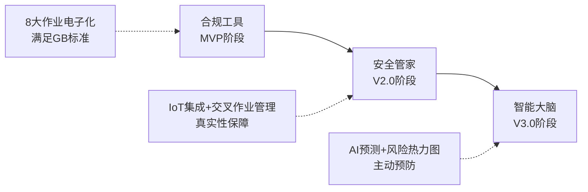

# 危险化学品企业特殊作业许可（PTW）管理系统 - 产品需求文档（PRD）

> **文档版本**：V1.0
> **创建日期**：2026-03-09
> **文档状态**：草案
> **产品经理**：Claude Code (Opus 4.6)
> **监管依据**：GB 30871-2022《危险化学品企业特殊作业安全规范》
> **产品架构**："1+8"模式（1个通用底座 + 8个作业票模块）

---

## 📋 文档摘要

本文档是危险化学品企业特殊作业许可（PTW, Permit to Work）管理系统的产品需求文档，旨在为危险化学品企业提供一套**全覆盖、强合规、高智能**的特殊作业管理平台。

系统采用**"1+8"架构模式**，通过1个通用底座支撑8个作业票模块，实现GB 30871-2022规定的8大特殊作业（动火、受限空间、盲板抽堵、高处、吊装、临时用电、动土、断路）的全生命周期数字化管理。

**核心价值**：
- ✅ **100%合规**：完整覆盖GB 30871-2022的8大特殊作业
- ✅ **交叉作业管理**：自动识别作业冲突，基于地理位置的空间隔离带管理
- ✅ **数据共享**：气体分析、人员资质、监护记录一次录入多处调用
- ✅ **智能管控**：从"被动合规"到"主动风险预防"

---

## 📑 目录

1. [产品概述](#1-产品概述)
2. [业务背景与问题分析](#2-业务背景与问题分析)
3. [产品目标与成功指标](#3-产品目标与成功指标)
4. [系统架构设计](#4-系统架构设计)
5. [通用底座功能需求](#5-通用底座功能需求)
6. [8大作业票模块需求](#6-8大作业票模块需求)
7. [交叉作业管理](#7-交叉作业管理)
8. [非功能需求](#8-非功能需求)
9. [用户体验设计](#9-用户体验设计)
10. [技术架构概述](#10-技术架构概述)
11. [风险与约束](#11-风险与约束)
12. [实施建议](#12-实施建议)
13. [附录](#13-附录)

---

## 1. 产品概述

### 1.1 产品定位与愿景

**产品定位**：
危险化学品企业特殊作业许可（PTW）管理系统是一款面向危险化学品企业的**全覆盖、强合规、高智能**的安全生产管理平台。系统以GB 30871-2022国家标准为核心，采用"1+8"架构模式，实现8大特殊作业的全生命周期数字化管理，并通过物联网、生物识别、地理空间计算与AI技术，实现交叉作业冲突规避和主动风险预防。

**产品愿景**：
- **短期（1年）**：成为危化企业特殊作业管理的数字化基础设施，实现100%电子化审批
- **中期（3年）**：演进为企业安全生产的"数字化大脑"，通过数据驱动实现风险预测与主动预防
- **长期（5年）**：建立行业安全管理标准，推动危化行业整体安全水平提升

**战略定位**：
从"合规工具"→"安全管家"→"智能大脑"的三级演进路径

### 1.2 产品核心优势

#### 优势1：100%合规，无懈可击
- **全覆盖**：覆盖GB 30871-2022规定的8大特殊作业，不留死角
- **强制性逻辑**：系统内置标准规则，不符合标准无法提交
- **证据链完整**：电子签名、全程留痕、自动归档，应对政府监管无压力

#### 优势2：交叉作业管理，行业独有
- **自动识别**：系统自动识别交叉作业场景（如受限空间内动火）
- **强制关联**：交叉作业必须同时办理多张作业票，系统强制关联
- **空间冲突检测**：基于地理位置的实时冲突检测，防止作业叠加风险
- **动态隔离带**：动火点周围15米内禁止可燃液体排放，系统自动管控

#### 优势3：数据共享，一次录入多处调用
- **气体分析共享**：受限空间和动火作业的气体分析数据自动共享
- **人员资质复用**：同一人员的资质证书一站式核验，无需重复录入
- **监护记录复用**：交叉作业时，监护人的在岗记录可共享

#### 优势4："1+8"架构，灵活可扩展
- **通用底座**：人员库、JSA库、IoT接口、定位引擎、审批引擎统一管理
- **模块化设计**：8个作业票模块独立开发、独立部署、独立升级
- **灵活配置**：企业可根据实际需求选择上线的作业模块

### 1.3 GB 30871-2022 八大特殊作业概览

| 作业类型 | 定义 | 典型场景 | 主要风险 |
|---------|------|---------|---------|
| **动火作业** | 在禁火区内从事可能产生火焰、火花或炽热表面的非常规作业 | 电焊、气焊、喷灯、砂轮、喷砂 | 火灾、爆炸 |
| **受限空间作业** | 在进出口受限、通风不良的封闭或半封闭空间内进行的作业 | 罐体内部、管道内部、地下室、污水池 | 中毒、窒息、爆炸 |
| **盲板抽堵作业** | 在压力管道或设备上安装或拆除盲板的作业 | 管道隔离、设备检修 | 泄漏、中毒、灼伤 |
| **高处作业** | 在坠落高度基准面2米以上（含2米）有可能坠落的高处进行的作业 | 脚手架作业、登高检修、高空安装 | 坠落、物体打击 |
| **吊装作业** | 使用起重机械进行的作业 | 设备吊装、大件运输 | 物体打击、起重伤害 |
| **临时用电作业** | 在正式运行的电源上接临时用电设备的作业 | 临时照明、临时动力 | 触电、火灾 |
| **动土作业** | 在地面进行挖掘、钻孔、打桩等可能损坏地下设施的作业 | 管线开挖、基础施工 | 管线损坏、中毒、窒息 |
| **断路作业** | 在生产、输送、使用、储存危险化学品的装置、罐区或场所的道路上进行的作业 | 道路维修、管线铺设 | 交通事故、作业冲突 |

**交叉作业常见组合**：
- 受限空间内动火（动火 + 受限空间）
- 高处动火（动火 + 高处）
- 罐区吊装（吊装 + 动火 + 高处）
- 地下管线开挖（动土 + 受限空间）

### 1.4 目标用户画像

系统服务于危险化学品企业内的五类核心用户：

#### 用户1：作业申请人
- **角色定义**：需要进行特殊作业的一线操作人员或班组长
- **典型场景**：设备维修、管道焊接、罐体清洗、高空检修等
- **核心诉求**：
  - 快速完成申请，系统自动判定作业类型和等级
  - 清晰了解审批进度和安全要求
  - 交叉作业时，系统自动关联多张作业票
- **痛点**：
  - 不清楚需要办理哪些作业票
  - 多张票证需要重复填写相同信息
  - 审批流程不透明
- **使用频率**：高频（每周2-10次）
- **技术水平**：中低（需要极简操作界面）

#### 用户2：现场监护人
- **角色定义**：特殊作业现场的安全监护人员，负责全程监督
- **典型场景**：现场监护、气体检测、应急处置
- **核心诉求**：
  - 实时了解作业状态
  - 快速响应异常情况
  - 明确自己的责任边界
- **痛点**：
  - 交叉作业时，不清楚需要监护哪些风险
  - 无法证明自己全程在岗
  - 异常情况无法及时上报
- **使用频率**：高频（每天多次）
- **技术水平**：中低（需要防呆设计）

#### 用户3：审批人（多层级）
- **角色定义**：企业负责人/总工程师、车间主任、安全员等不同层级的审批人
- **典型场景**：审批作业申请、现场核查、应急决策
- **核心诉求**：
  - 快速了解作业风险（包括交叉作业风险）
  - 便捷完成审批（支持移动端）
  - 明确自己的审批责任
- **痛点**：
  - 交叉作业时，不清楚其他作业的风险
  - 无法远程审批，影响效率
  - 审批责任不清晰
- **使用频率**：中高频（每天1-20次，视层级而定）
- **技术水平**：中高（熟悉移动办公）

#### 用户4：安全管理员
- **角色定义**：企业安全管理部门人员，负责监督和统计
- **典型场景**：票证审核、数据统计、违章处理、应急响应、交叉作业协调
- **核心诉求**：
  - 实时掌握全厂特殊作业情况（8大作业）
  - 快速发现违章行为和作业冲突
  - 生成统计报表和分析报告
- **痛点**：
  - 无法实时监控交叉作业情况
  - 无法识别空间冲突风险
  - 事故调查缺少证据链
- **使用频率**：高频（每天持续使用）
- **技术水平**：高（需要数据分析能力）

#### 用户5：系统管理员
- **角色定义**：IT部门人员，负责系统配置和维护
- **典型场景**：用户管理、权限配置、系统维护、数据备份、模块配置
- **核心诉求**：
  - 系统稳定可靠
  - 配置灵活便捷（可选择上线的作业模块）
  - 故障快速定位
- **痛点**：
  - 系统复杂，维护困难
  - 缺少监控和告警
  - 数据安全责任重大
- **使用频率**：中频（每周多次）
- **技术水平**：高（专业IT人员）

### 1.5 核心价值主张

**对企业的价值**：
1. **100%合规，无懈可击**：覆盖8大特殊作业，应对政府监管无压力
2. **降低事故风险**：交叉作业冲突规避，空间隔离带管理，从源头杜绝违章
3. **提升管理效率**：数据共享，一次录入多处调用，审批时间缩短70%
4. **积累安全数据**：建立企业安全数据资产，支撑风险分析和决策优化

**对作业人员的价值**：
1. **操作更简单**：系统自动判定作业类型，自动关联交叉作业票
2. **责任更清晰**：电子签名、全程留痕，保护自己也保护他人
3. **安全更有保障**：实时监控、智能提醒、空间冲突预警

**对管理人员的价值**：
1. **决策更科学**：数据驾驶舱、风险热力图、交叉作业可视化
2. **监管更有力**：实时监控、违章告警、空间冲突检测
3. **考核更公正**：客观数据支撑，避免人为干扰

---

## 2. 业务背景与问题分析

### 2.1 行业背景

危险化学品企业因其生产、储存、运输的物质具有易燃、易爆、有毒、腐蚀等特性，一直是安全生产监管的重点领域。特殊作业作为危化企业最常见的高风险作业，因其潜在的火灾、爆炸、中毒、窒息、坠落等风险，始终被列为安全管控的核心。

**监管演进**：
- **2014年前**：企业自主管理，标准不统一
- **2014-2022年**：GB 30871-2014实施，初步规范
- **2022年至今**：GB 30871-2022正式颁布，要求全生命周期精细化治理，**统一规范8大特殊作业**

**数字化转型背景**：
- 国家"工业互联网+安全生产"战略部署
- 电子签名法赋予电子票证法律效力
- 物联网、AI技术成熟，具备落地条件
- 应急管理部鼓励建设"智能化管控平台"

### 2.2 单一作业系统的严重缺陷

#### 缺陷1：法律合规的刚性缺失
**问题描述**：
如果仅做单一作业系统（如只做动火作业），会导致：
- GB 30871-2022统一规范8大特殊作业，监管部门审计时会核查所有票证
- 单一系统导致电子票与纸质票混用，管理混乱
- 监管部门在进行安全审计或事故调查时，会认为企业管理不规范

**根因**：
- GB 30871-2022是国家强制性标准，具有同等法律效力
- 标准明确要求8大作业都必须办理审批手续

**影响**：
- 政府检查不合格，面临处罚
- 事故调查时，证据链不完整
- 企业安全生产标准化评级降低

#### 缺陷2：交叉作业管理缺失
**问题描述**：
化工现场的"坑"往往出在交叉作业上：
- **受限空间内动火**：需要同时办理《动火作业票》和《受限空间作业票》
- **高处动火**：需要同时办理《动火作业票》和《高处作业票》
- **罐区吊装**：需要同时办理《吊装作业票》、《动火作业票》、《高处作业票》

单一系统无法：
- 自动识别交叉作业场景
- 强制关联多张作业票
- 共享气体分析和监护数据
- 检测空间冲突

**根因**：
- GB 30871-2022明确要求"一票多办"：同一作业涉及两种或两种以上特殊作业时，应同时办理各自的作业审批手续
- 交叉作业的风险是叠加的，需要综合管控

**影响**：
- 作业人员不清楚需要办理哪些票证
- 审批人无法全面了解作业风险
- 监护人不清楚需要监护哪些风险
- 事故风险大幅增加

#### 缺陷3：数据孤岛问题
**问题描述**：
单一系统导致核心数据无法共享：
- **气体分析数据**：受限空间作业需要分析氧含量、可燃气体和有毒气体；动火作业也需要分析可燃气体。单一系统无法共享数据，需要重复分析
- **人员资质**：同一个作业人员可能既有焊工证（涉及动火、临时用电），又有高处作业证。单一系统需要重复录入和验证
- **监护记录**：交叉作业时，监护人的在岗记录无法复用

**根因**：
- 缺少统一的数据共享层
- 各作业系统独立建设，数据不互通

**影响**：
- 重复录入，效率低下
- 数据不一致，容易出错
- 无法实现"一次录入、多处调用"

#### 缺陷4：空间冲突无法规避
**问题描述**：
化工现场的空间冲突是重大安全隐患：
- **动态隔离带**：动火作业要求周边15米内不应排放可燃液体，30米内不应排放可燃气体
- **垂直空间冲突**：动火点下方进行喷漆作业或可燃粉尘清扫，火花坠落引发事故
- **水平空间冲突**：相邻区域同时进行动火和受限空间作业，可燃气体扩散引发事故

单一系统无法：
- 实时掌握全厂作业动态
- 基于地理位置检测空间冲突
- 自动阻断有冲突的审批流

**根因**：
- 缺少统一的定位引擎和空间管理能力
- 各作业系统独立运行，无法全局协调

**影响**：
- 空间冲突无法提前发现
- 作业叠加风险无法规避
- 事故风险大幅增加

### 2.3 行业事故案例与根因分析

#### 案例1：某石化企业罐区交叉作业爆炸事故
**事故经过**：
2023年某月，某石化企业在罐区进行管道焊接作业（动火）时，罐体内部同时进行清洗作业（受限空间）。由于两张作业票未关联，监护人不知道罐体内有人作业，焊接火花引燃罐体内的可燃气体，造成3人死亡、5人受伤。

**根因分析**：
1. **交叉作业未识别**：动火作业票和受限空间作业票分别办理，未关联
2. **气体分析数据未共享**：受限空间作业的气体分析数据未共享给动火作业
3. **监护人信息不互通**：动火监护人不知道罐体内有人作业

**如果有完整PTW系统**：
- 系统自动识别交叉作业，强制关联两张作业票
- 气体分析数据自动共享，动火作业可实时查看罐体内气体浓度
- 监护人信息互通，动火监护人可实时了解罐体内作业情况

#### 案例2：某化工厂高处动火作业坠落事故
**事故经过**：
2022年某月，某化工厂在高处进行管道焊接作业时，作业人员坠落，造成1人死亡。

**根因分析**：
1. **交叉作业未识别**：只办理了《动火作业票》，未办理《高处作业票》
2. **安全措施不全**：未佩戴安全带，未设置安全网
3. **监护人职责不清**：动火监护人不清楚需要监护高处作业风险

**如果有完整PTW系统**：
- 系统自动识别高处动火，强制关联《动火作业票》和《高处作业票》
- 系统自动推送高处作业安全措施清单（安全带、安全网等）
- 监护人职责清单包含高处作业监护要求

### 2.4 完整PTW系统的必要性

#### 必要性1：国家政策强制要求
- GB 30871-2022明确规范8大特殊作业，具有同等法律效力
- 应急管理部推动"工业互联网+安全生产"，鼓励建设智能化管控平台
- 地方政府将特殊作业电子审批系统纳入安全生产标准化考核

#### 必要性2：企业本质安全需求
- 交叉作业是化工现场的常态，必须综合管控
- 空间冲突是重大安全隐患，必须提前规避
- 数据共享是提升效率的关键，必须统一管理

#### 必要性3：技术成熟度支撑
- 物联网设备成本大幅降低，具备规模化应用条件
- 生物识别技术成熟，可防范活体攻击
- 云计算、大数据、AI技术为智能化提供支撑
- 地理信息系统（GIS）技术成熟，可实现空间冲突检测

#### 必要性4：行业竞争压力
- 先进企业已开始建设完整PTW系统，形成竞争优势
- 落后企业面临监管压力和事故风险
- 完整PTW系统是企业可持续发展的必然选择

---

*（文档继续，下一部分将详细阐述产品目标、系统架构和功能需求）*