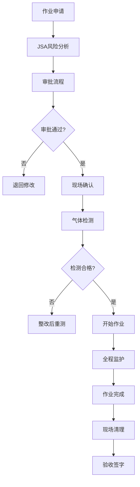
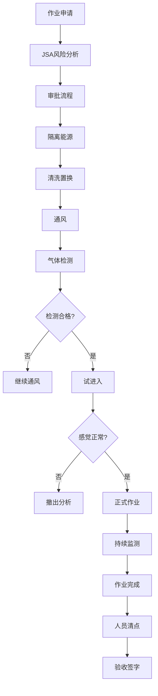
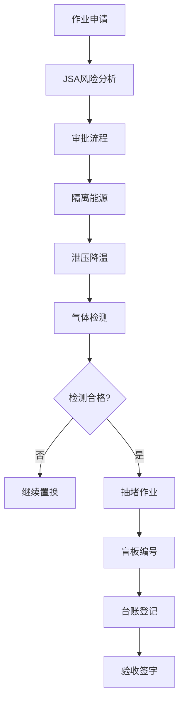

# 06 - 8大作业票模块需求

## 6.1 动火作业

详见：[分析内容/参考3.txt](../分析内容/参考3.txt)、[PROJECTWIKI.md §5.1](../PROJECTWIKI.md)

### 6.1.1 作业定义与分级

**定义：**
在禁火区域内使用电焊、气焊（割）、喷灯、砂轮等进行可能产生火焰、火花和炽热表面的临时性作业。

**分级标准：**

| 级别 | 定义 | 典型场景 | 审批要求 |
|------|------|---------|---------|
| **特级** | 在生产运行的易燃易爆生产装置、罐区等高危区域动火 | 储罐区焊接、反应釜维修 | 厂级领导审批 |
| **一级** | 在易燃易爆场所进行的动火作业 | 装置区管道焊接 | 安全科+车间主任审批 |
| **二级** | 除特级、一级以外的动火作业 | 办公区维修焊接 | 车间主任审批 |

### 6.1.2 作业流程



### 6.1.3 核心功能

**作业申请：**
- 动火位置选择（地图标注）
- 动火方式选择（电焊、气焊、气割、其他）
- 动火时间段设置
- 动火人员选择（需持证）
- 监护人指定（需持证）
- 现场照片上传（至少3张）

**安全措施确认：**
- ✅ 办理动火作业票
- ✅ 进行JSA风险分析
- ✅ 清理动火现场可燃物
- ✅ 配备灭火器材（2具以上）
- ✅ 设置安全警戒区域
- ✅ 进行气体检测（可燃气体<20%LEL，氧气18-23%）
- ✅ 配备监护人（全程在岗）
- ✅ 动火人持证上岗

**气体检测：**
- 检测项目：可燃气体、氧气、有毒气体
- 检测频率：作业前、作业中每2小时
- 检测标准：可燃气体<20%LEL，氧气18-23%
- 检测记录：自动采集IoT设备数据
- 超标处理：自动告警，停止作业

**实时监控：**
- 监护人在岗状态（定位追踪）
- 气体浓度实时监测
- 视频监控（AI识别违章行为）
- 作业时间超时提醒

### 6.1.4 数据模型

```json
{
  "ticketType": "hotWork",
  "level": "special|level1|level2",
  "location": {
    "areaId": "string",
    "coordinates": [x, y],
    "description": "string"
  },
  "workMethod": "electricWelding|gasWelding|gasCutting|other",
  "workTime": {
    "startTime": "datetime",
    "endTime": "datetime"
  },
  "workers": ["userId1", "userId2"],
  "supervisor": "userId",
  "safetyMeasures": {
    "fireExtinguishers": 2,
    "gasDetection": true,
    "warningArea": true,
    "combustibleCleared": true
  },
  "gasDetectionRecords": [
    {
      "time": "datetime",
      "combustibleGas": 5.2,
      "oxygen": 20.8,
      "toxicGas": 0
    }
  ]
}
```

## 6.2 受限空间作业

详见：[PROJECTWIKI.md §5.2](../PROJECTWIKI.md)

### 6.2.1 作业定义与分级

**定义：**
进入或探入储罐、容器、管道、烟道、锅炉、炉膛、下水道、沟、坑、井、池、涵洞、船舱、地下仓库、密闭车间等封闭、半封闭设施及场所进行的作业。

**分级标准：**

| 级别 | 定义 | 典型场景 |
|------|------|---------|
| **一级** | 存在中毒、窒息、爆炸等危险的受限空间 | 储罐清洗、反应釜检修 |
| **二级** | 一般受限空间 | 地下管廊巡检 |

### 6.2.2 作业流程



### 6.2.3 核心功能

**作业申请：**
- 受限空间选择（设备台账）
- 作业内容描述
- 作业时间段
- 作业人员（需持证）
- 监护人（需持证，不得进入）
- 应急救援人员

**安全措施确认：**
- ✅ 办理受限空间作业票
- ✅ 进行JSA风险分析
- ✅ 隔离能源（电、气、水、蒸汽）
- ✅ 清洗置换（至少3次）
- ✅ 强制通风（至少30分钟）
- ✅ 气体检测合格
- ✅ 配备应急救援设备（呼吸器、安全绳、三脚架）
- ✅ 配备监护人（不得进入受限空间）
- ✅ 配备通讯设备

**气体检测：**
- 检测项目：氧气、可燃气体、硫化氢、一氧化碳
- 检测标准：
  - 氧气：19.5-23.5%
  - 可燃气体：<10%LEL
  - 硫化氢：<10ppm
  - 一氧化碳：<24ppm
- 检测频率：作业前、作业中每30分钟
- 连续监测：IoT设备实时上传

**实时监控：**
- 作业人员定位（UWB精确定位）
- 监护人在岗状态
- 气体浓度实时监测
- 视频监控
- 通讯状态监测
- 作业时间超时提醒

### 6.2.4 应急响应

**异常情况处理：**
- 气体超标 → 立即撤离，强制通风
- 人员不适 → 立即撤离，医疗救治
- 通讯中断 → 监护人呼叫，准备救援
- 监护人脱岗 → 自动告警，停止作业

**救援原则：**
- 禁止盲目施救
- 佩戴呼吸器后救援
- 使用安全绳牵引
- 及时报警求助

## 6.3 盲板抽堵作业

详见：[PROJECTWIKI.md §5.3](../PROJECTWIKI.md)

### 6.3.1 作业定义

**定义：**
在压力管道或设备上安装或拆除盲板的作业。

**风险特点：**
- 介质泄漏（有毒、易燃、腐蚀）
- 高温烫伤
- 高压喷射
- 窒息中毒

### 6.3.2 作业流程



### 6.3.3 核心功能

**作业申请：**
- 管道/设备选择
- 盲板位置标注
- 作业类型（抽盲板/堵盲板）
- 介质信息（名称、温度、压力）
- 作业人员（需持证）
- 监护人

**安全措施确认：**
- ✅ 办理盲板抽堵作业票
- ✅ 进行JSA风险分析
- ✅ 隔离能源（关闭阀门、断电）
- ✅ 泄压降温（压力<0.1MPa，温度<60℃）
- ✅ 清洗置换
- ✅ 气体检测合格
- ✅ 配备防护用品（防毒面具、防护服）
- ✅ 配备应急器材（洗眼器、急救箱）

**盲板管理：**
- 盲板编号（唯一标识）
- 盲板台账（位置、规格、材质、安装时间）
- 盲板状态（已安装/已拆除）
- 盲板照片（安装前后对比）
- 盲板清单导出

## 6.4 高处作业

详见：[PROJECTWIKI.md §5.4](../PROJECTWIKI.md)

### 6.4.1 作业定义与分级

**定义：**
在坠落高度基准面2米及以上有可能坠落的高处进行的作业。

**分级标准：**

| 级别 | 高度范围 | 典型场景 |
|------|---------|---------|
| **一级** | 2-5米 | 梯子作业、低层脚手架 |
| **二级** | 5-15米 | 中层脚手架、平台检修 |
| **三级** | 15-30米 | 高层脚手架、塔器检修 |
| **特级** | >30米 | 烟囱、塔顶作业 |

### 6.4.2 核心功能

**作业申请：**
- 作业位置（高度、区域）
- 作业内容
- 作业平台（脚手架、吊篮、梯子）
- 作业人员（需持证）
- 监护人

**安全措施确认：**
- ✅ 办理高处作业票
- ✅ 进行JSA风险分析
- ✅ 搭设作业平台（脚手架验收合格）
- ✅ 设置安全网、防护栏
- ✅ 配备安全带、安全绳
- ✅ 设置警戒区域（下方禁止通行）
- ✅ 检查天气条件（风力<5级，无雨雪）
- ✅ 配备工具袋（防止坠物）

**实时监控：**
- 作业人员定位（高度监测）
- 下方区域人员检测（AI视觉识别）
- 天气条件监测（风速、降雨）
- 安全带佩戴检测（AI视觉识别）

## 6.5 吊装作业

详见：[PROJECTWIKI.md §5.5](../PROJECTWIKI.md)

### 6.5.1 作业定义与分级

**定义：**
使用起重机械进行的作业。

**分级标准：**

| 级别 | 定义 | 典型场景 |
|------|------|---------|
| **一级** | 大型设备吊装（>40吨）、危险区域吊装 | 反应釜吊装、储罐吊装 |
| **二级** | 一般设备吊装（10-40吨） | 泵、电机吊装 |
| **三级** | 小型设备吊装（<10吨） | 管道、阀门吊装 |

### 6.5.2 核心功能

**作业申请：**
- 吊装位置（起吊点、落点）
- 吊装物信息（名称、重量、尺寸）
- 起重设备（吊车型号、额定载荷）
- 吊装方案（吊装方法、吊点选择）
- 作业人员（司机、指挥、挂钩工需持证）

**安全措施确认：**
- ✅ 办理吊装作业票
- ✅ 编制吊装方案
- ✅ 进行JSA风险分析
- ✅ 检查起重设备（合格证、定期检验）
- ✅ 检查吊具索具（无损伤、在有效期内）
- ✅ 设置警戒区域（吊装半径+10米）
- ✅ 检查作业环境（地面承载力、架空线距离）
- ✅ 配备指挥人员（持证、穿反光衣）

**实时监控：**
- 吊车位置定位
- 吊装半径内人员检测
- 吊装重量监测（防超载）
- 吊装高度监测
- 视频监控（AI识别违章）

## 6.6 临时用电作业

详见：[PROJECTWIKI.md §5.6](../PROJECTWIKI.md)

### 6.6.1 作业定义

**定义：**
在正式运行的生产系统、装置以外的非永久性用电作业。

**风险特点：**
- 触电伤害
- 电气火灾
- 电弧灼伤
- 短路爆炸

### 6.6.2 核心功能

**作业申请：**
- 用电位置
- 用电设备（名称、功率、电压）
- 用电时间段
- 电源接入点
- 作业人员（电工需持证）

**安全措施确认：**
- ✅ 办理临时用电作业票
- ✅ 进行JSA风险分析
- ✅ 编制临时用电方案
- ✅ 选择合格电源（电压、容量匹配）
- ✅ 安装漏电保护器
- ✅ 电缆敷设规范（架空或埋地）
- ✅ 设置接地保护
- ✅ 配备绝缘防护用品
- ✅ 设置警示标识

**实时监控：**
- 电流、电压监测
- 漏电检测
- 温度监测（防过热）
- 用电时间超时提醒

## 6.7 动土作业

详见：[PROJECTWIKI.md §5.7](../PROJECTWIKI.md)

### 6.7.1 作业定义

**定义：**
在企业内进行的挖掘、钻孔、打桩等可能损坏地下设施的作业。

**风险特点：**
- 损坏地下管线（燃气、电缆、给排水）
- 土方坍塌
- 触及危险物质

### 6.7.2 核心功能

**作业申请：**
- 动土位置（地图标注）
- 动土范围（长×宽×深）
- 动土目的
- 作业人员
- 监护人

**安全措施确认：**
- ✅ 办理动土作业票
- ✅ 进行JSA风险分析
- ✅ 查明地下设施（管线图纸）
- ✅ 标识地下设施位置
- ✅ 制定保护措施
- ✅ 设置警戒区域
- ✅ 配备探测设备
- ✅ 通知相关部门（燃气、电力、给排水）

**实时监控：**
- 动土深度监测
- 地下管线距离预警
- 视频监控

## 6.8 断路作业

详见：[PROJECTWIKI.md §5.8](../PROJECTWIKI.md)

### 6.8.1 作业定义

**定义：**
在企业内部道路上进行的可能影响车辆通行的作业。

**风险特点：**
- 车辆碰撞
- 交通拥堵
- 应急通道阻塞

### 6.8.2 核心功能

**作业申请：**
- 断路位置
- 断路时间段
- 断路原因
- 绕行方案
- 作业人员

**安全措施确认：**
- ✅ 办理断路作业票
- ✅ 进行JSA风险分析
- ✅ 制定交通组织方案
- ✅ 设置警示标志（提前100米）
- ✅ 设置隔离设施（锥形筒、护栏）
- ✅ 配备交通指挥人员
- ✅ 通知相关部门
- ✅ 确保应急通道畅通

**实时监控：**
- 交通流量监测
- 视频监控

## 6.9 相关文档

- [05-通用底座功能需求](./05-通用底座功能需求.md)
- [07-交叉作业管理](./07-交叉作业管理.md)
- [PROJECTWIKI.md 第5章](../PROJECTWIKI.md)
- [分析内容/参考3.txt](../分析内容/参考3.txt)

---

**文档版本**：v1.0
**最后更新**：2026-03-10
**维护人**：产品团队
