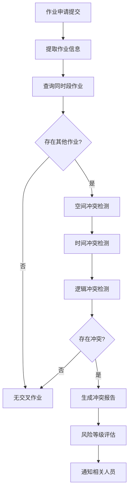
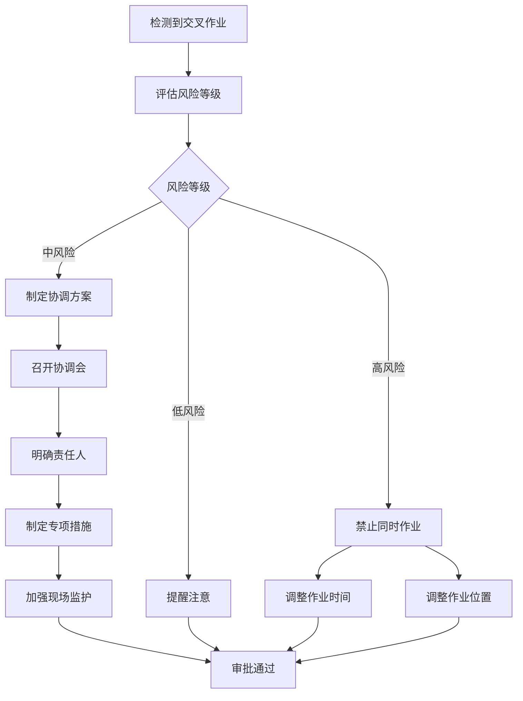

# 07 - 交叉作业管理

## 7.1 交叉作业定义

### 7.1.1 什么是交叉作业（SIMOPs）

**定义：**
SIMOPs（Simultaneous Operations，同时作业）是指在同一时间、同一区域或相邻区域内，同时进行两项或多项特殊作业，可能产生相互影响或叠加风险的情况。

**典型场景：**
- 动火作业时，相邻区域正在进行受限空间作业
- 高处作业下方有地面作业人员
- 临时用电与动火作业在同一区域
- 吊装作业范围内有其他作业

### 7.1.2 交叉作业风险

**风险类型：**

| 风险类型 | 说明 | 典型案例 |
|---------|------|---------|
| **空间冲突** | 作业区域重叠或过近 | 高处作业下方有人员通行 |
| **时间冲突** | 作业时间段重叠 | 两项动火作业同时进行 |
| **逻辑冲突** | 作业之间存在因果关系 | 动火作业+受限空间作业（可燃气体泄漏） |
| **资源冲突** | 共用监护人、设备 | 一个监护人同时监护多项作业 |

**事故案例：**
- 某企业动火作业时，相邻储罐正在清洗（受限空间作业），可燃气体泄漏引发爆炸，造成5人死亡
- 某企业高处作业时，下方正在进行设备吊装，坠落物砸中吊装人员，造成1人重伤

## 7.2 交叉作业识别

### 7.2.1 自动识别机制

**识别流程：**



**识别维度：**
1. **空间维度**：基于作业区域坐标、半径计算空间距离
2. **时间维度**：基于作业开始/结束时间判断时间重叠
3. **逻辑维度**：基于作业类型、风险库匹配逻辑冲突规则

### 7.2.2 冲突检测算法

详见：[docs/architecture/simops-algorithm.md](../docs/architecture/simops-algorithm.md)

**空间冲突检测：**
```
算法：R-Tree空间索引
输入：作业区域多边形 A、B
输出：冲突类型（完全重叠/部分重叠/距离过近/无冲突）

步骤：
1. 计算区域A、B的最小外接矩形（MBR）
2. 判断MBR是否相交
3. 如相交，计算精确重叠面积
4. 如不相交，计算最短距离
5. 根据安全距离标准判断冲突等级
```

**时间冲突检测：**
```
算法：区间重叠判断
输入：作业时间段 [T1_start, T1_end]、[T2_start, T2_end]
输出：冲突类型（完全重叠/部分重叠/相邻/无冲突）

判断逻辑：
- 完全重叠：T1_start == T2_start && T1_end == T2_end
- 部分重叠：max(T1_start, T2_start) < min(T1_end, T2_end)
- 相邻：|T1_end - T2_start| < 1小时 或 |T2_end - T1_start| < 1小时
- 无冲突：其他情况
```

**逻辑冲突检测：**
```
算法：规则引擎匹配
输入：作业类型组合、区域关系
输出：冲突规则列表

规则库示例：
IF 作业A=动火 AND 作业B=受限空间 AND 距离<30米
THEN 风险=高 原因=可燃气体泄漏可能引燃

IF 作业A=高处 AND 作业B=地面 AND 垂直重叠
THEN 风险=高 原因=坠物伤人
```

## 7.3 空间冲突检测

### 7.3.1 安全距离标准

| 作业类型 | 安全距离 | 依据 |
|---------|---------|------|
| **动火作业** | 30米 | GB 30871-2022 |
| **受限空间作业** | 10米 | 企业标准 |
| **高处作业（垂直）** | 5米 | GB 30871-2022 |
| **高处作业（水平）** | 10米 | GB 30871-2022 |
| **吊装作业** | 吊装半径+10米 | GB 30871-2022 |
| **动土作业** | 5米 | 企业标准 |

### 7.3.2 冲突等级划分

| 冲突等级 | 定义 | 处理方式 |
|---------|------|---------|
| **高风险** | 区域完全重叠或距离<安全距离50% | 禁止同时作业，需调整时间或位置 |
| **中风险** | 距离在安全距离50%-100%之间 | 需制定专项协调方案，加强监护 |
| **低风险** | 距离在安全距离100%-150%之间 | 提醒注意，正常审批 |
| **无风险** | 距离>安全距离150% | 无需特殊处理 |

### 7.3.3 可视化展示

**地图标注：**
- 作业区域用不同颜色标注（动火=红色、受限空间=蓝色、高处=黄色等）
- 安全距离用虚线圆圈标注
- 冲突区域用阴影高亮显示
- 支持3D视图（显示高度信息）

## 7.4 数据共享机制

### 7.4.1 作业信息共享

**共享内容：**
- 作业票基本信息（类型、位置、时间、人员）
- 作业状态（申请中、审批中、进行中、已完成）
- 风险信息（JSA分析结果、安全措施）
- 实时数据（气体检测、人员定位、视频监控）

**共享方式：**
- 实时推送：作业状态变更时推送给相关人员
- 主动查询：通过地图、列表查询当前所有作业
- 订阅通知：订阅特定区域的作业动态

### 7.4.2 监护人共享

**问题：**
企业监护人资源有限，可能出现一人监护多项作业的情况。

**解决方案：**
- 监护人负荷检测：系统自动计算监护人当前负责的作业数量
- 监护人推荐：优先推荐负荷较低的监护人
- 监护人冲突预警：同一监护人同时监护多项作业时告警
- 监护人调配：支持临时调整监护人

### 7.4.3 设备资源共享

**共享设备：**
- 气体检测仪
- 视频监控设备
- 应急救援设备
- 通讯设备

**管理功能：**
- 设备借用申请
- 设备使用状态跟踪
- 设备归还提醒
- 设备维护记录

## 7.5 协调管理

### 7.5.1 协调流程



### 7.5.2 协调方案要素

**必备内容：**
1. **风险分析**：列出所有可能的交叉风险
2. **责任划分**：明确各作业负责人、监护人职责
3. **沟通机制**：建立作业间的沟通渠道（对讲机、微信群）
4. **应急预案**：制定交叉作业应急预案
5. **监护加强**：增加监护人数量或频次
6. **隔离措施**：设置物理隔离（围挡、警戒线）

### 7.5.3 协调会议

**触发条件：**
- 高风险交叉作业
- 涉及3项及以上作业
- 涉及特级作业

**参与人员：**
- 各作业负责人
- 安全管理人员
- 区域负责人
- HSE经理（必要时）

**会议内容：**
- 通报各作业情况
- 分析交叉风险
- 制定协调方案
- 明确责任分工
- 签署协调协议

## 7.6 实时监控

### 7.6.1 监控大屏

**展示内容：**
- 全厂作业分布地图
- 当前进行中的作业数量
- 交叉作业数量及风险等级
- 实时告警信息
- 关键指标（气体浓度、人员位置）

**交互功能：**
- 点击作业查看详情
- 筛选特定类型作业
- 回放历史作业
- 导出作业报表

### 7.6.2 移动端监控

**功能：**
- 查看附近作业
- 接收交叉作业通知
- 查看协调方案
- 上报异常情况

### 7.6.3 告警机制

**告警类型：**

| 告警类型 | 触发条件 | 通知对象 |
|---------|---------|---------|
| **高风险冲突** | 检测到高风险交叉作业 | 安全管理员、区域负责人 |
| **监护人冲突** | 同一监护人同时监护3项以上作业 | 监护人、作业负责人 |
| **区域超载** | 同一区域同时进行5项以上作业 | 安全管理员 |
| **时间超时** | 作业时间超过计划时间 | 作业负责人、审批人 |
| **异常状态** | 气体超标、人员脱岗等 | 监护人、应急人员 |

## 7.7 统计分析

### 7.7.1 交叉作业统计

**统计维度：**
- 交叉作业数量趋势（按日/周/月）
- 交叉作业类型分布
- 高风险交叉作业占比
- 交叉作业区域热力图

**分析指标：**
- 交叉作业发生率 = 交叉作业次数 / 总作业次数
- 高风险交叉作业率 = 高风险交叉作业次数 / 交叉作业次数
- 交叉作业事故率 = 交叉作业事故次数 / 交叉作业次数

### 7.7.2 风险趋势分析

**分析内容：**
- 识别高频交叉作业组合
- 分析交叉作业时间规律
- 评估协调方案有效性
- 预测未来交叉作业风险

**改进建议：**
- 优化作业计划（错峰作业）
- 调整区域划分
- 增加监护人配置
- 完善协调流程

## 7.8 案例库

### 7.8.1 典型案例

**案例1：动火+受限空间**
- **场景**：储罐区动火焊接，相邻储罐正在清洗
- **风险**：受限空间可能泄漏可燃气体，遇明火爆炸
- **措施**：
  - 增加气体检测频次（每15分钟）
  - 设置专人监护受限空间出口
  - 配备应急灭火器材
  - 建立对讲机联络

**案例2：高处+地面**
- **场景**：脚手架上进行设备检修，下方有管道焊接
- **风险**：工具、零件坠落伤人
- **措施**：
  - 设置安全网
  - 下方设置警戒区域
  - 高处作业使用工具袋
  - 错峰作业（优先完成高处作业）

**案例3：吊装+动火**
- **场景**：吊装设备，吊装范围内有动火作业
- **风险**：吊装物坠落砸中动火人员
- **措施**：
  - 调整作业顺序（先完成吊装）
  - 如必须同时进行，动火点远离吊装路径
  - 增加指挥人员协调

### 7.8.2 经验教训

**教训1：监护人不足**
- 问题：一人监护3项作业，无法兼顾
- 后果：受限空间作业人员中毒，监护人未及时发现
- 改进：限制监护人最多同时监护2项作业

**教训2：沟通不畅**
- 问题：两项作业负责人未建立联络
- 后果：动火作业未通知受限空间作业，差点引发事故
- 改进：强制建立微信群，实时沟通

**教训3：协调方案流于形式**
- 问题：协调方案制定后未执行
- 后果：现场监护未加强，存在隐患
- 改进：协调方案执行情况纳入考核

## 7.9 相关文档

- [05-通用底座功能需求](./05-通用底座功能需求.md)
- [06-8大作业票模块需求](./06-8大作业票模块需求.md)
- [SIMOPs算法](../docs/architecture/simops-algorithm.md)

---

**文档版本**：v1.0
**最后更新**：2026-03-10
**维护人**：产品团队
