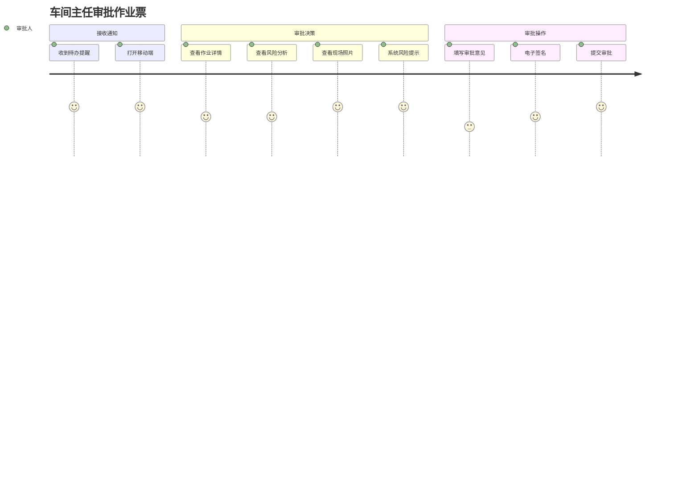
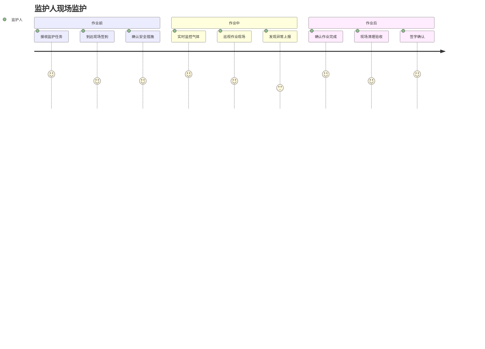

# 09 - 用户体验设计

## 9.1 角色与权限

### 9.1.1 用户角色定义

| 角色 | 职责 | 权限范围 | 典型用户 |
|------|------|---------|---------|
| **超级管理员** | 系统配置、用户管理 | 全部功能 | IT管理员 |
| **HSE经理** | 安全政策制定、风险管控 | 全部作业查看、配置管理 | 安全总监 |
| **安全管理员** | 作业监督、统计分析 | 全部作业查看、报表导出 | 安全科长 |
| **审批人** | 作业票审批 | 本级作业审批、历史查询 | 车间主任、分管领导 |
| **作业负责人** | 组织作业实施 | 作业申请、方案制定 | 班组长 |
| **作业人** | 执行作业 | 作业申请、状态查看 | 维修工、操作工 |
| **监护人** | 现场监护 | 作业监护、异常上报 | 专职监护人 |
| **审计员** | 数据审计 | 只读权限、日志查询 | 内审员 |

### 9.1.2 权限矩阵

| 功能模块 | 超管 | HSE | 安全员 | 审批人 | 负责人 | 作业人 | 监护人 |
|---------|------|-----|--------|--------|--------|--------|--------|
| **作业申请** | ✓ | ✓ | ✓ | ✓ | ✓ | ✓ | - |
| **作业审批** | ✓ | ✓ | ✓ | ✓ | - | - | - |
| **作业监护** | ✓ | ✓ | ✓ | - | - | - | ✓ |
| **作业查询** | ✓ | ✓ | ✓ | ✓ | ✓ | ✓ | ✓ |
| **统计报表** | ✓ | ✓ | ✓ | ✓ | - | - | - |
| **系统配置** | ✓ | ✓ | - | - | - | - | - |
| **用户管理** | ✓ | - | - | - | - | - | - |
| **审计日志** | ✓ | ✓ | - | - | - | - | - |

### 9.1.3 数据权限

**权限范围：**
- **全部**：查看所有数据
- **本部门**：仅查看本部门数据
- **本人**：仅查看本人相关数据

**示例：**
- 超级管理员：全部
- HSE经理：全部
- 安全管理员：全部
- 车间主任：本部门
- 班组长：本部门
- 作业人：本人

## 9.2 核心用户旅程

### 9.2.1 作业申请旅程


**关键触点：**
1. **进入页面**：首页显示"新建作业"按钮，醒目易找
2. **选择类型**：8大作业类型卡片展示，图标+文字
3. **填写信息**：智能表单，必填项标红，支持语音输入
4. **风险分析**：系统自动推荐风险，可手动添加
5. **上传照片**：支持拍照、相册选择，最多9张
6. **提交申请**：一键提交，实时反馈

### 9.2.2 审批旅程



**关键触点：**
1. **通知提醒**：微信/短信/APP推送，点击直达
2. **作业详情**：关键信息突出显示，支持地图查看
3. **风险提示**：SIMOPs冲突、资质过期等自动提示
4. **审批意见**：常用意见快捷选择，支持自定义
5. **电子签名**：手写签名或CA证书签名
6. **提交反馈**：审批成功后自动通知申请人

### 9.2.3 监护旅程



**关键触点：**
1. **任务通知**：提前1小时提醒，显示作业位置
2. **现场签到**：扫码或定位签到，防止脱岗
3. **实时监控**：气体浓度、作业时间实时显示
4. **异常上报**：一键拍照上报，自动定位
5. **完成验收**：检查清单逐项确认

## 9.3 UI/UX设计原则

### 9.3.1 设计原则

**1. 简洁高效**
- 减少操作步骤，常用功能≤3次点击
- 去除冗余信息，突出核心内容
- 使用图标+文字，提高识别效率

**2. 一致性**
- 统一的交互模式（按钮位置、颜色、文案）
- 统一的视觉风格（字体、间距、圆角）
- 统一的反馈机制（成功/失败提示）

**3. 容错性**
- 重要操作二次确认（删除、提交）
- 支持撤销操作（草稿保存）
- 友好的错误提示（告知原因+解决方案）

**4. 可访问性**
- 支持大字体模式
- 颜色对比度符合WCAG 2.0标准
- 支持语音输入/输出

### 9.3.2 移动端设计

**适配原则：**
- 优先竖屏设计
- 按钮高度≥44px（符合手指点击区域）
- 重要操作放在拇指热区
- 支持手势操作（下拉刷新、左滑删除）

**交互优化：**
- 减少键盘输入，多用选择器
- 支持扫码输入（设备编号、人员工号）
- 支持拍照上传（压缩后上传，节省流量）
- 支持离线缓存（弱网环境可用）

### 9.3.3 Web端设计

**布局：**
- 左侧导航栏（可折叠）
- 顶部面包屑导航
- 主内容区（自适应宽度）
- 右侧信息面板（可选）

**交互：**
- 支持快捷键
- 支持批量操作
- 支持表格排序、筛选、导出
- 支持拖拽排序

## 9.4 关键页面设计

### 9.4.1 首页（移动端）

**布局：**
```
┌─────────────────────┐
│  [头像] 张三  [消息] │
├─────────────────────┤
│  待办事项 (5)        │
│  ┌─────┐ ┌─────┐   │
│  │待审批│ │待监护│   │
│  │  3  │ │  2  │   │
│  └─────┘ └─────┘   │
├─────────────────────┤
│  快速入口            │
│  [动火] [受限空间]   │
│  [高处] [吊装]       │
├─────────────────────┤
│  我的作业            │
│  ┌─────────────────┐│
│  │动火作业 #001     ││
│  │审批中 | 2小时前  ││
│  └─────────────────┘│
└─────────────────────┘
```

**功能：**
- 待办事项：待审批、待监护、待验收
- 快速入口：8大作业类型
- 我的作业：最近10条作业记录
- 消息通知：红点提示未读消息

### 9.4.2 作业申请页面

**表单设计：**
- 分步填写（基本信息→风险分析→安全措施→提交）
- 进度条显示当前步骤
- 必填项标红星号
- 实时校验（失焦校验）
- 智能推荐（监护人、风险点）

**字段示例：**
```
作业类型：[动火作业] (不可修改)
作业位置：[选择区域▼] [地图标注]
作业时间：[2026-03-10 08:00] 至 [2026-03-10 18:00]
作业内容：[文本框，支持语音输入]
作业人员：[张三 ✓] [+ 添加]
监护人：  [李四 ✓] (系统推荐)
现场照片：[📷 拍照] [🖼️ 相册] (已上传3张)
```

### 9.4.3 审批页面

**信息展示：**
- 作业票基本信息（卡片展示）
- 风险分析结果（高亮显示高风险）
- 现场照片（轮播图）
- 审批历史（时间轴）
- 系统风险提示（红色警告框）

**审批操作：**
```
┌─────────────────────┐
│ 审批意见：           │
│ [同意 ✓] [不同意]   │
│ [文本框]             │
│ 常用意见：           │
│ [符合要求] [需补充]  │
├─────────────────────┤
│ 电子签名：           │
│ [手写签名] [CA签名]  │
├─────────────────────┤
│ [提交审批]           │
└─────────────────────┘
```

### 9.4.4 监控大屏

**布局：**
```
┌──────────────────────────────────────┐
│ 危险化学品企业特殊作业监控大屏        │
├──────────┬───────────┬───────────────┤
│ 今日作业  │ 进行中    │ SIMOPs冲突    │
│   128    │    45     │      3        │
├──────────┴───────────┴───────────────┤
│                                       │
│         [作业分布地图]                │
│                                       │
├───────────────────────────────────────┤
│ 作业类型分布 │ 风险等级分布 │ 实时告警 │
└───────────────────────────────────────┘
```

**功能：**
- 实时数据刷新（10秒）
- 地图标注（不同颜色代表不同作业类型）
- 告警滚动播报
- 支持点击查看详情

## 9.5 交互设计

### 9.5.1 反馈机制

**操作反馈：**
- 按钮点击：视觉反馈（颜色变化）+ 触觉反馈（震动）
- 加载状态：Loading动画 + 文字提示
- 成功提示：绿色Toast，2秒后自动消失
- 失败提示：红色Toast，显示错误原因

**状态反馈：**
- 作业状态：颜色标签（草稿=灰、审批中=橙、进行中=蓝、已完成=绿）
- 审批状态：图标+文字（待审批=⏳、已通过=✓、已拒绝=✗）
- 风险等级：颜色标识（高=红、中=橙、低=黄）

### 9.5.2 异常处理

**网络异常：**
- 显示"网络连接失败"提示
- 提供"重试"按钮
- 启用离线模式（如支持）

**数据异常：**
- 显示"数据加载失败"提示
- 提供"刷新"按钮
- 记录错误日志

**权限异常：**
- 显示"无权限访问"提示
- 引导联系管理员

### 9.5.3 引导设计

**新手引导：**
- 首次登录：功能介绍（3-5页）
- 首次使用：操作引导（蒙层+箭头）
- 新功能：气泡提示

**帮助入口：**
- 页面右上角"?"图标
- 点击显示操作说明
- 支持跳转到帮助文档

## 9.6 多端适配

### 9.6.1 响应式设计

**断点设置：**
- 手机：<768px
- 平板：768px-1024px
- PC：>1024px

**适配策略：**
- 手机：单列布局，隐藏次要信息
- 平板：双列布局，显示部分次要信息
- PC：多列布局，显示全部信息

### 9.6.2 小程序设计

**特点：**
- 轻量化：去除复杂功能，保留核心流程
- 快速启动：首屏加载<2秒
- 原生体验：使用小程序原生组件

**功能范围：**
- ✓ 作业申请
- ✓ 作业审批
- ✓ 作业监护
- ✓ 消息通知
- ✗ 系统配置
- ✗ 统计报表

## 9.7 相关文档

- [01-产品概述](./01-产品概述.md)
- [05-通用底座功能需求](./05-通用底座功能需求.md)
- [06-8大作业票模块需求](./06-8大作业票模块需求.md)

---

**文档版本**：v1.0
**最后更新**：2026-03-10
**维护人**：产品团队
