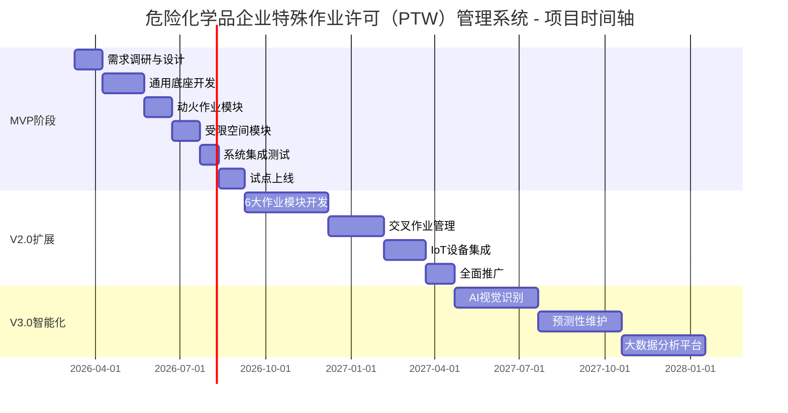

# 11 - 项目实施计划

## 11.1 项目总体规划

### 11.1.1 项目周期

**总体时间线：**
- **MVP阶段（V1.0）**：6个月
- **扩展阶段（V2.0）**：12个月
- **智能化阶段（V3.0）**：18个月

**里程碑时间轴：**

### 11.1.2 团队配置

**核心团队（15人）：**

| 角色 | 人数 | 职责 |
|------|------|------|
| **项目经理** | 1 | 项目整体管理、进度把控、风险管理 |
| **产品经理** | 1 | 需求分析、产品设计、用户验收 |
| **架构师** | 1 | 技术架构设计、技术选型、难点攻关 |
| **后端开发** | 4 | 业务逻辑开发、API开发、数据库设计 |
| **前端开发** | 3 | Web端、移动端、小程序开发 |
| **测试工程师** | 2 | 测试用例设计、自动化测试、性能测试 |
| **UI/UX设计师** | 1 | 界面设计、交互设计、视觉规范 |
| **运维工程师** | 1 | 环境搭建、部署发布、监控运维 |
| **安全工程师** | 1 | 安全审计、渗透测试、合规检查 |

**外部协作（按需）：**
- HSE专家顾问（2人）：业务规则验证、安全标准审核
- IoT集成工程师（2人）：设备对接、协议适配
- 实施顾问（3人）：现场培训、上线支持

## 11.2 MVP阶段（V1.0）

### 11.2.1 范围定义

**核心功能：**
- ✅ 通用底座（基础信息、人员资质、JSA风险库、审批引擎）
- ✅ 动火作业模块（完整流程）
- ✅ 受限空间作业模块（完整流程）
- ✅ 基础SIMOPs检测（空间+时间冲突）
- ✅ 移动端（微信小程序）
- ✅ Web管理后台

**不在范围：**
- ❌ 其他6大作业模块
- ❌ IoT设备集成
- ❌ AI视觉识别
- ❌ 高级数据分析

### 11.2.2 详细计划

**第1阶段：需求调研与设计（30天）**

**Week 1-2：需求调研**
- 走访3-5家危化企业
- 访谈HSE管理人员、作业人员、审批人员
- 收集现有纸质作业票样本
- 梳理业务流程与痛点

**Week 3-4：产品设计**
- 完成PRD文档
- 设计原型图（Figma）
- 评审与确认
- 输出：PRD v1.0、原型图、数据库设计

**第2阶段：通用底座开发（45天）**

**Sprint 1（15天）：基础框架**
- 项目脚手架搭建
- 用户认证与权限（RBAC）
- 组织架构管理
- 区域位置管理

**Sprint 2（15天）：核心能力**
- 人员资质管理
- JSA风险库
- 审批引擎
- 电子签名集成

**Sprint 3（15天）：数据共享**
- RESTful API
- 数据导入导出
- 日志审计
- 单元测试（覆盖率≥85%）

**第3阶段：动火作业模块（30天）**

**Sprint 4（15天）：核心流程**
- 作业申请
- JSA风险分析
- 审批流程
- 气体检测记录

**Sprint 5（15天）：监护与验收**
- 现场监护
- 实时监控
- 作业验收
- 集成测试

**第4阶段：受限空间模块（30天）**

**Sprint 6（15天）：核心流程**
- 作业申请
- 隔离能源
- 清洗置换
- 气体检测

**Sprint 7（15天）：监护与应急**
- 人员定位
- 实时监控
- 应急响应
- 集成测试

**第5阶段：系统集成测试（20天）**

**Week 1：功能测试**
- 完整业务流程测试
- 边界条件测试
- 异常场景测试

**Week 2：性能测试**
- 并发测试（5000用户）
- 压力测试
- 稳定性测试

**Week 3：安全测试**
- 渗透测试
- 漏洞扫描
- 合规检查

**第6阶段：试点上线（28天）**

**Week 1：环境准备**
- 生产环境部署
- 数据迁移
- 权限配置

**Week 2：用户培训**
- 管理员培训（4小时）
- 作业人员培训（2小时）
- 审批人员培训（2小时）

**Week 3-4：试点运行**
- 选择1-2个车间试点
- 并行运行（纸质+电子）
- 收集反馈
- 快速迭代

### 11.2.3 交付物清单

**文档类：**
- [ ] PRD文档
- [ ] 系统架构设计文档
- [ ] 数据库设计文档
- [ ] API接口文档
- [ ] 用户操作手册
- [ ] 管理员手册
- [ ] 培训材料

**代码类：**
- [ ] 后端代码（含单元测试）
- [ ] 前端代码（Web + 小程序）
- [ ] 数据库脚本
- [ ] 部署脚本

**测试类：**
- [ ] 测试用例
- [ ] 测试报告
- [ ] 性能测试报告
- [ ] 安全测试报告

## 11.3 扩展阶段（V2.0）

### 11.3.1 范围定义

**新增功能：**
- ✅ 6大作业模块（盲板抽堵、高处、吊装、临时用电、动土、断路）
- ✅ 完整SIMOPs管理（逻辑冲突检测、协调方案）
- ✅ IoT设备集成（气体检测仪、视频监控、定位设备）
- ✅ 数据大屏（实时监控、统计分析）
- ✅ 移动端优化（离线模式、语音输入）

### 11.3.2 详细计划

**第1阶段：6大作业模块（90天）**

**并行开发策略：**
- 团队A：盲板抽堵 + 高处作业（45天）
- 团队B：吊装 + 临时用电（45天）
- 团队C：动土 + 断路（45天）

**每个模块开发周期（15天）：**
- Week 1：核心流程开发
- Week 2：测试与优化
- Week 3：集成与验收

**第2阶段：交叉作业管理（60天）**

**Sprint 1（20天）：冲突检测**
- 空间冲突算法优化（R-Tree）
- 逻辑冲突规则引擎
- 实时冲突检测

**Sprint 2（20天）：协调管理**
- 协调方案制定
- 协调会议管理
- 监护人调配

**Sprint 3（20天）：可视化**
- 地图标注
- 冲突高亮
- 实时告警

**第3阶段：IoT设备集成（45天）**

**Sprint 1（15天）：设备接入**
- MQTT Broker搭建
- 设备注册与认证
- 数据采集

**Sprint 2（15天）：数据处理**
- InfluxDB集成
- 数据清洗与转换
- 告警规则配置

**Sprint 3（15天）：应用集成**
- 实时数据展示
- 历史数据查询
- 告警推送

**第4阶段：全面推广（30天）**

**Week 1-2：培训与准备**
- 全员培训
- 数据迁移
- 环境优化

**Week 3-4：分批上线**
- 第1批：3个车间
- 第2批：5个车间
- 第3批：全厂推广

### 11.3.3 交付物清单

**新增文档：**
- [ ] 6大作业模块操作手册
- [ ] IoT设备接入指南
- [ ] SIMOPs管理规范
- [ ] 数据大屏使用说明

**新增代码：**
- [ ] 6大作业模块代码
- [ ] IoT接入层代码
- [ ] SIMOPs检测算法
- [ ] 数据大屏前端

## 11.4 智能化阶段（V3.0）

### 11.4.1 范围定义

**智能化功能：**
- ✅ AI视觉识别（违章行为检测、PPE佩戴检测）
- ✅ 预测性维护（设备故障预测、风险预警）
- ✅ 大数据分析（趋势分析、智能推荐）
- ✅ 知识图谱（风险关联、案例推荐）

### 11.4.2 详细计划

**第1阶段：AI视觉识别（90天）**

**Sprint 1（30天）：模型训练**
- 收集训练数据（10000+张图片）
- 标注数据（违章行为、PPE）
- 训练YOLO模型
- 模型优化

**Sprint 2（30天）：边缘部署**
- 边缘计算节点部署
- 模型推理优化
- 实时识别

**Sprint 3（30天）：应用集成**
- 告警推送
- 违章记录
- 统计分析

**第2阶段：预测性维护（90天）**

**Sprint 1（30天）：数据准备**
- 历史数据清洗
- 特征工程
- 数据标注

**Sprint 2（30天）：模型开发**
- 时间序列预测模型
- 异常检测模型
- 模型评估

**Sprint 3（30天）：应用部署**
- 预测服务部署
- 预警规则配置
- 可视化展示

**第3阶段：大数据分析平台（90天）**

**Sprint 1（30天）：数据仓库**
- 数据仓库设计
- ETL流程开发
- 数据质量监控

**Sprint 2（30天）：分析引擎**
- 多维分析
- 趋势预测
- 智能推荐

**Sprint 3（30天）：可视化**
- BI报表
- 自定义看板
- 移动端展示

## 11.5 资源预算

### 11.5.1 人力成本

**MVP阶段（6个月）：**
- 核心团队15人 × 6个月 = 90人月
- 外部协作5人 × 3个月 = 15人月
- **合计：105人月**

**V2.0阶段（12个月）：**
- 核心团队15人 × 12个月 = 180人月
- 外部协作8人 × 6个月 = 48人月
- **合计：228人月**

**V3.0阶段（18个月）：**
- 核心团队18人 × 18个月 = 324人月
- AI专家3人 × 12个月 = 36人月
- **合计：360人月**

### 11.5.2 硬件成本

**开发环境：**
- 开发服务器：2台 × ¥20,000 = ¥40,000
- 测试服务器：2台 × ¥15,000 = ¥30,000
- 开发电脑：15台 × ¥8,000 = ¥120,000
- **小计：¥190,000**

**生产环境（云服务，按年）：**
- 应用服务器：4核8G × 3台 × ¥500/月 × 12 = ¥18,000
- 数据库服务器：8核16G × 2台 × ¥1,000/月 × 12 = ¥24,000
- Redis集群：4核8G × 2台 × ¥400/月 × 12 = ¥9,600
- 对象存储：10TB × ¥0.12/GB/月 × 12 = ¥14,400
- CDN流量：100TB × ¥0.18/GB = ¥18,000
- **小计：¥84,000/年**

**IoT设备（V2.0）：**
- 气体检测仪：50台 × ¥5,000 = ¥250,000
- 视频监控：30套 × ¥3,000 = ¥90,000
- 定位设备：200个 × ¥500 = ¥100,000
- **小计：¥440,000**

### 11.5.3 软件成本

**开发工具：**
- JetBrains全家桶：15人 × ¥1,500/年 = ¥22,500
- Figma团队版：¥5,000/年
- Postman团队版：¥3,000/年
- **小计：¥30,500/年**

**第三方服务：**
- CA证书服务：¥50,000/年
- 短信服务：10万条 × ¥0.05 = ¥5,000/年
- 地图服务：¥10,000/年
- **小计：¥65,000/年**

### 11.5.4 总预算

**MVP阶段（6个月）：**
- 人力成本：105人月 × ¥20,000 = ¥2,100,000
- 硬件成本：¥190,000 + ¥42,000 = ¥232,000
- 软件成本：¥47,750
- **合计：约¥240万**

**V2.0阶段（12个月）：**
- 人力成本：228人月 × ¥20,000 = ¥4,560,000
- 硬件成本：¥84,000 + ¥440,000 = ¥524,000
- 软件成本：¥95,500
- **合计：约¥520万**

**V3.0阶段（18个月）：**
- 人力成本：360人月 × ¥22,000 = ¥7,920,000
- 硬件成本：¥126,000
- 软件成本：¥143,250
- AI训练成本：¥200,000
- **合计：约¥840万**

**总预算：约¥1600万**

## 11.6 风险管理

### 11.6.1 风险识别

| 风险类型 | 风险描述 | 概率 | 影响 | 优先级 |
|---------|---------|------|------|--------|
| **技术风险** | IoT设备协议不兼容 | 中 | 高 | P1 |
| **技术风险** | 性能无法满足5000并发 | 低 | 高 | P2 |
| **业务风险** | 用户接受度低 | 中 | 高 | P1 |
| **业务风险** | 业务流程理解偏差 | 中 | 中 | P2 |
| **合规风险** | 不符合GB 30871-2022 | 低 | 高 | P1 |
| **合规风险** | 等保三级认证失败 | 低 | 中 | P2 |
| **项目风险** | 关键人员离职 | 低 | 高 | P2 |
| **项目风险** | 需求频繁变更 | 高 | 中 | P1 |

### 11.6.2 应对策略

**技术风险应对：**
- IoT协议不兼容 → 提前进行设备选型与POC验证
- 性能问题 → 架构设计阶段引入性能测试，提前优化

**业务风险应对：**
- 用户接受度低 → 试点阶段充分收集反馈，快速迭代
- 业务理解偏差 → 引入HSE专家顾问，定期评审

**合规风险应对：**
- 不符合国标 → 对标GB 30871-2022逐条检查
- 等保认证 → 提前进行安全加固，聘请专业机构

**项目风险应对：**
- 人员离职 → 知识沉淀、文档完善、交叉培训
- 需求变更 → 敏捷开发、版本管理、变更评审

## 11.7 质量保证

### 11.7.1 质量标准

**代码质量：**
- 测试覆盖率：≥85%
- 代码复杂度：≤10
- 代码重复率：≤5%
- 代码规范：0个严重违规

**性能标准：**
- API响应时间（P95）：≤200ms
- 页面加载时间：≤2秒
- 并发用户数：≥5000
- 系统可用性：≥99.5%

**安全标准：**
- 无高危漏洞
- 通过渗透测试
- 符合等保三级要求
- 通过安全审计

### 11.7.2 质量活动

**代码评审：**
- 每个PR必须经过至少1人评审
- 关键模块需架构师评审
- 评审清单：功能、性能、安全、可维护性

**测试活动：**
- 单元测试：开发阶段，覆盖率≥85%
- 集成测试：Sprint结束时
- 系统测试：版本发布前
- 回归测试：每次变更后

**安全审计：**
- 代码静态扫描：每周1次
- 依赖漏洞扫描：每周1次
- 渗透测试：每季度1次
- 安全加固：持续进行

## 11.8 相关文档

- [03-产品目标与成功指标](./03-产品目标与成功指标.md)
- [10-技术实现建议](./10-技术实现建议.md)
- [roadmap.md](../roadmap.md)

---

**文档版本**：v1.0
**最后更新**：2026-03-10
**维护人**：项目团队
