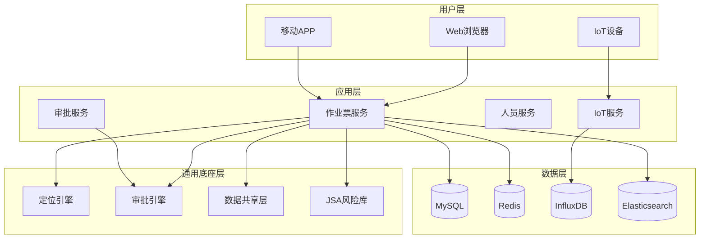

# 1. 产品概述

## 1.1 产品定位

**动火作业票电子审批系统**是一款面向危险化学品企业的**安全生产管理平台**，专注于解决特殊作业（动火、受限空间、盲板抽堵、高处、吊装、临时用电、动土、断路）全生命周期的数字化管理问题。

### 产品愿景

从"合规工具"进化为"安全大脑"，通过数字化、智能化手段，构建"事前预防、事中管控、事后追溯"的闭环安全管理体系，助力企业实现**零事故**目标。

### 核心价值主张

| 维度 | 传统纸质票证 | 本系统 |
|------|-------------|--------|
| **合规性** | 人工填写，易遗漏 | 强制字段校验，100%符合GB 30871-2022 |
| **真实性** | 数据可造假，监护缺位 | IoT设备自动采集，生物识别防作弊 |
| **时效性** | 审批滞后，流程不透明 | 移动端实时审批，流程可视化 |
| **可追溯性** | 纸质归档，查询困难 | 全流程电子化，秒级检索 |
| **智能化** | 无风险预警 | AI视觉分析，主动预防 |

---

## 1.2 目标用户画像

### 1.2.1 作业申请人

**典型角色**：焊工、电工、设备维修工、承包商作业人员

**核心诉求**：
- 快速填写作业票，减少重复劳动
- 实时查看审批进度
- 移动端操作，随时随地申请

**痛点**：
- 纸质表单填写繁琐，字段多易遗漏
- 审批流程不透明，不知道卡在哪个环节
- 需要多次往返办公室提交/补充材料

**使用场景**：
- 在作业现场通过手机APP申请作业票
- 上传现场照片和设备检验报告
- 实时接收审批结果通知

---

### 1.2.2 监护人

**典型角色**：安全员、班组长、专职监护人

**核心诉求**：
- 明确监护职责和安全措施
- 便捷的签到和在岗证明
- 异常情况快速上报

**痛点**：
- 纸质票证无法证明全程在岗
- 发现异常后上报流程复杂
- 监护记录难以追溯

**使用场景**：
- 通过人脸识别或定位签到
- 实时查看气体浓度等安全数据
- 一键上报异常情况

---

### 1.2.3 审批人

**典型角色**：车间主任、安全主管、企业负责人

**核心诉求**：
- 快速审批，提高工作效率
- 全面掌握作业风险
- 移动端审批，不受时间地点限制

**痛点**：
- 纸质票证审批需要当面签字，效率低
- 无法实时掌握作业现场情况
- 审批依据不足，难以判断风险

**使用场景**：
- 通过手机APP审批作业票
- 查看作业现场照片和气体分析数据
- 电子签名，具备法律效力

---

### 1.2.4 安全管理员

**典型角色**：HSE经理、安全总监

**核心诉求**：
- 全局掌握作业态势
- 数据统计分析，发现安全隐患
- 合规性审计，应对监管检查

**痛点**：
- 纸质票证分散存储，统计困难
- 无法实时掌握作业现场情况
- 事故调查时难以追溯原因

**使用场景**：
- 通过数据驾驶舱查看作业态势
- 生成合规性报告
- 事故调查时快速检索相关票证

---

### 1.2.5 系统管理员

**典型角色**：IT运维人员

**核心诉求**：
- 系统稳定运行，故障快速定位
- 灵活配置审批流程和业务规则
- 数据安全和备份

**痛点**：
- 系统故障影响生产安全
- 业务规则变更需要开发支持
- 数据丢失风险

**使用场景**：
- 配置审批流程和权限
- 监控系统运行状态
- 数据备份和恢复

---

## 1.3 产品边界

### 1.3.1 功能范围（In-Scope）

**核心功能**：
- 8类特殊作业票的全生命周期管理（申请→审批→监护→验收→归档）
- 动态审批流引擎（支持串行、并行、条件分支）
- IoT设备集成（气体检测仪、定位设备、视频监控）
- 生物识别（人脸识别、指纹识别）
- 电子签名（基于CA数字证书）
- 地理围栏和空间冲突检测
- 数据统计分析和审计报表

**支持的作业类型**：
1. 动火作业（特级/一级/二级）
2. 受限空间作业（一级/二级）
3. 盲板抽堵作业（一级/二级）
4. 高处作业（一级/二级/三级/四级）
5. 吊装作业（一级/二级）
6. 临时用电作业（一级/二级）
7. 动土作业（一级/二级）
8. 断路作业（一级/二级）

**支持的终端**：
- Web端（PC浏览器）
- 移动端（Android/iOS APP）
- IoT设备（气体检测仪、定位设备、视频监控）

---

### 1.3.2 非功能范围（Out-of-Scope）

**不包含的功能**：
- 企业ERP系统集成（如SAP、Oracle）
- 财务管理功能（成本核算、预算管理）
- 人力资源管理功能（考勤、薪酬）
- 设备全生命周期管理（采购、维修、报废）
- 应急救援指挥调度（专业应急系统）

**不支持的作业类型**：
- 非GB 30871-2022规定的特殊作业类型
- 企业自定义的其他作业类型（可通过二期扩展）

**不支持的终端**：
- 功能机（仅支持智能手机）
- 智能手表/手环（可通过二期扩展）

---

## 1.4 产品架构概览

### 1.4.1 系统分层架构

### 1.4.2 核心模块说明

| 模块 | 职责 | 关键技术 |
|------|------|---------|
| **作业票服务** | 作业票申请、审批、监护、验收 | Spring Boot, MyBatis Plus |
| **审批服务** | 动态审批流、电子签名、CA认证 | Flowable, Sa-Token |
| **人员服务** | 人员信息、资质管理、人脸识别 | 百度AI SDK |
| **IoT服务** | 设备接入、数据采集、告警推送 | EMQX, InfluxDB |
| **定位引擎** | 地理围栏、空间冲突检测、轨迹追踪 | GIS算法, UWB/北斗 |
| **审批引擎** | 工作流编排、权限管理、超时提醒 | Flowable, Drools |
| **数据共享层** | 气体分析、监护记录、安全措施共享 | RabbitMQ, Redis |
| **JSA风险库** | 标准风险库、自定义风险、风险评估 | Drools规则引擎 |

---

## 1.5 关键术语表

| 术语 | 英文 | 定义 |
|------|------|------|
| **动火作业** | Hot Work | 在易燃易爆场所进行的焊接、切割、打磨等可能产生火花的作业 |
| **受限空间** | Confined Space | 进出口受限、通风不良、可能存在有毒有害气体的封闭或半封闭空间 |
| **盲板抽堵** | Blind Plate Removal | 在管道或设备上安装或拆除盲板（隔离板）的作业 |
| **JSA** | Job Safety Analysis | 作业安全分析，一种系统化的风险识别方法 |
| **LEL** | Lower Explosive Limit | 爆炸下限，可燃气体在空气中能引起爆炸的最低浓度 |
| **CA认证** | Certificate Authority | 数字证书认证机构，用于颁发和管理数字证书 |
| **地理围栏** | Geo-fencing | 基于地理位置的虚拟边界，用于监控人员或设备是否进入/离开特定区域 |
| **UWB** | Ultra-Wideband | 超宽带定位技术，精度可达厘米级 |
| **MQTT** | Message Queuing Telemetry Transport | 轻量级物联网通信协议 |
| **GB 30871-2022** | - | 《危险化学品企业特殊作业安全规范》国家标准 |

---

**本章节完成时间**: 2026-03-10
**文档维护者**: Claude Code (Opus 4.6)
