# 4. 系统架构设计

## 4.1 "1+8"架构模式概述

### 架构理念

危险化学品企业特殊作业许可(PTW)管理系统采用**"1+8"架构模式**:
- **"1"**: 通用底座(Universal Base Platform) - 提供共享能力和基础设施
- **"8"**: 8个作业票模块(Operation Modules) - 独立开发、独立部署、独立升级

**核心优势**:
- ✅ **代码复用**: 通用能力统一管理,避免重复开发
- ✅ **数据共享**: 气体分析、人员资质、监护记录一次录入多处调用
- ✅ **灵活配置**: 企业可根据实际需求选择上线的作业模块
- ✅ **独立演进**: 各模块独立迭代,互不影响
- ✅ **易于扩展**: 新增作业类型只需开发新模块,无需改动底座

### 架构全景图

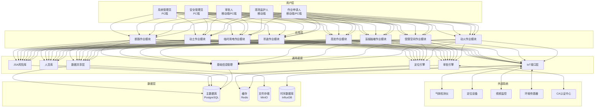

---

## 4.2 通用底座(Universal Base Platform)

### 4.2.1 基础信息管理

**职责**:
- 企业组织架构管理
- 区域划分管理
- 设备台账管理
- 系统配置管理

**核心功能**:
- 组织架构树(支持多级部门)
- 区域地理信息(经纬度、边界、层级)
- 设备分类与编码
- 系统参数配置(审批流程、时效规则等)

**数据模型**:
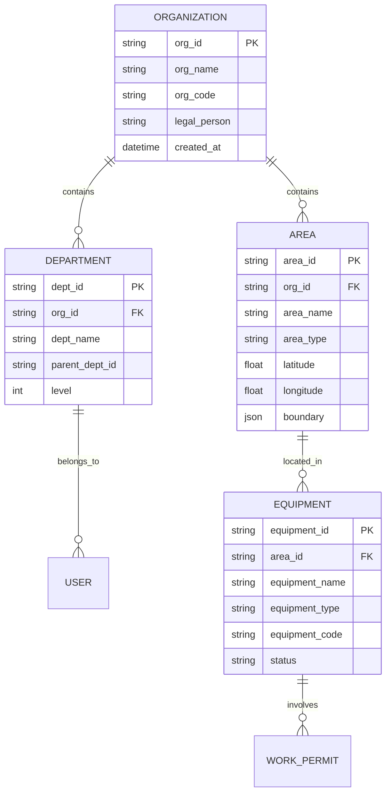

### 4.2.2 人员库

**职责**:
- 人员基本信息管理
- 资质证书管理
- 培训记录管理
- 健康档案管理

**核心功能**:
- 人员信息CRUD
- 资质证书有效期管理(自动提醒到期)
- 培训记录关联(与作业类型匹配)
- 健康状态检查(体检报告、职业禁忌症)
- 人脸特征向量存储(用于生物识别)

**数据模型**:
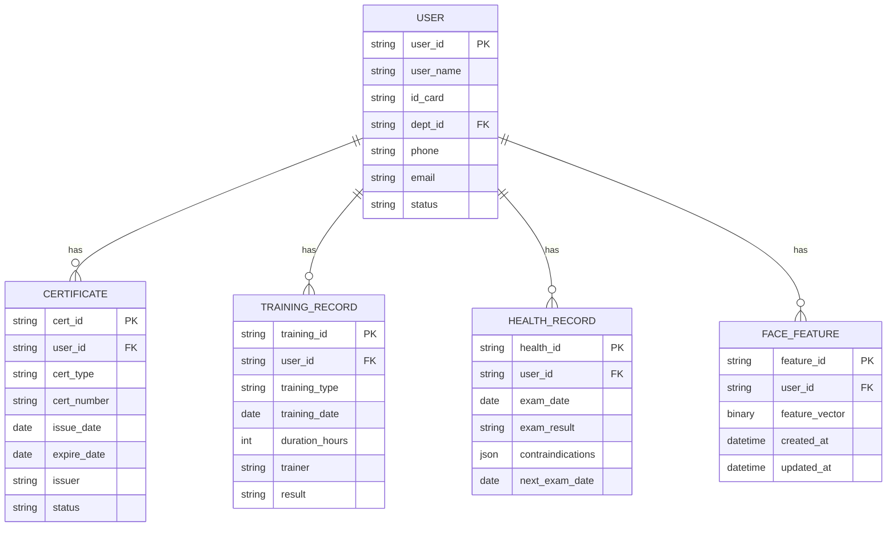

### 4.2.3 JSA风险库

**职责**:
- 标准风险库管理(基于GB 30871-2022)
- 企业自定义风险库管理
- 风险与作业类型关联
- 安全措施库管理

**核心功能**:
- 8类作业的标准风险库(预置)
- 企业自定义风险添加
- 风险等级评估(L×E×C模型)
- 安全措施推荐引擎
- 风险库版本管理

**数据模型**:
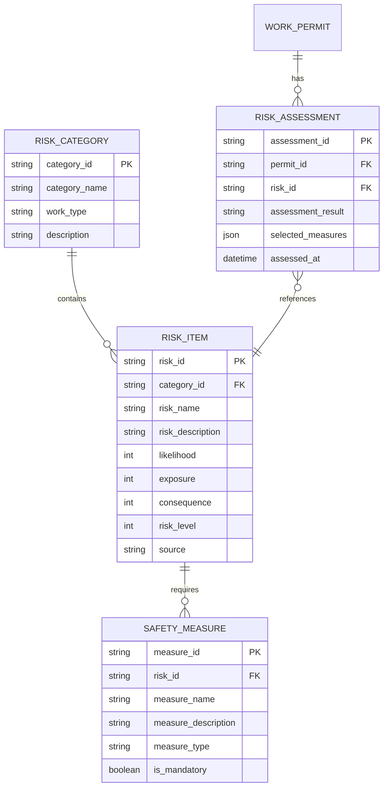

### 4.2.4 IoT接口层

**职责**:
- 气体检测仪集成
- 定位设备集成
- 视频监控集成
- 环境传感器集成

**核心功能**:
- 设备注册与认证
- 数据采集与解析(支持多种协议: MQTT, HTTP, WebSocket)
- 数据清洗与校验
- 异常数据告警
- 设备状态监控

**技术架构**:
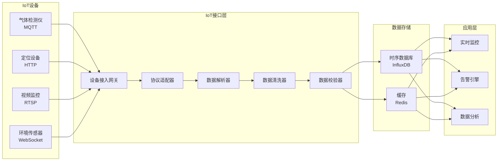

### 4.2.5 定位引擎

**职责**:
- 地理围栏管理
- 空间冲突检测
- 动态隔离带管理
- 人员定位追踪

**核心功能**:
- 地理围栏创建与管理(支持多边形、圆形)
- 实时位置监控(基于UWB或北斗)
- 空间冲突检测算法(基于GIS)
- 动态隔离带计算(如动火点周围15米)
- 人员进出围栏告警

**空间冲突检测算法**:
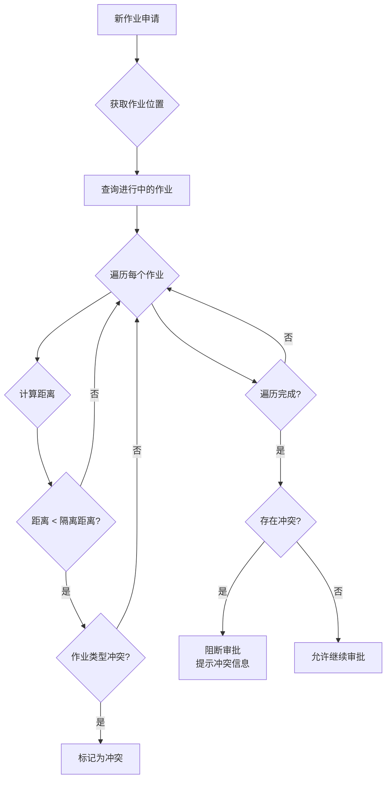

**冲突规则示例**:
| 作业类型A | 作业类型B | 最小隔离距离 | 冲突原因 |
|----------|----------|------------|---------|
| 动火作业 | 受限空间作业 | 15米 | 火花可能引燃可燃气体 |
| 动火作业 | 动火作业 | 30米 | 火源叠加风险 |
| 动火作业 | 喷漆作业 | 50米 | 可燃蒸汽扩散 |
| 吊装作业 | 高处作业 | 20米 | 物体打击风险 |

### 4.2.6 审批引擎

**职责**:
- 工作流引擎
- 权限管理
- 电子签名
- CA认证集成

**核心功能**:
- 动态审批流配置(基于作业等级)
- 条件分支审批(如特级动火需总工程师审批)
- 审批权限漂移(审批人不在岗时自动上浮)
- 电子签名集成(调用CA数字证书)
- 审批超时提醒
- 审批记录全程留痕

**审批流程示例(动火作业)**:
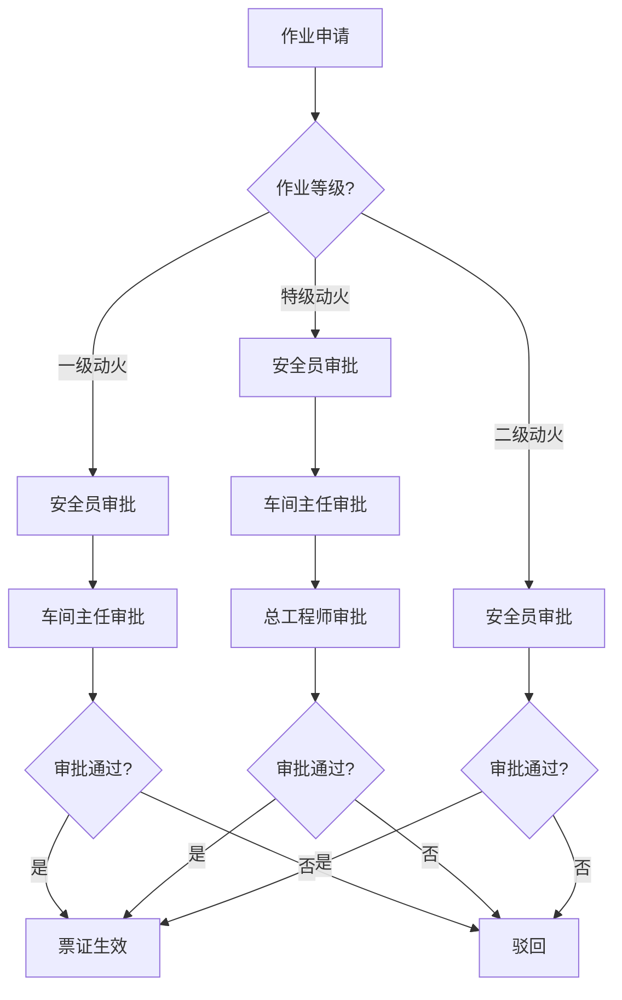

### 4.2.7 数据共享层

**职责**:
- 气体分析数据共享
- 监护记录共享
- 安全措施共享
- 应急预案共享

**核心功能**:
- 数据订阅与发布(基于事件驱动)
- 数据版本管理
- 数据权限控制
- 数据同步状态监控

**数据共享流程**:
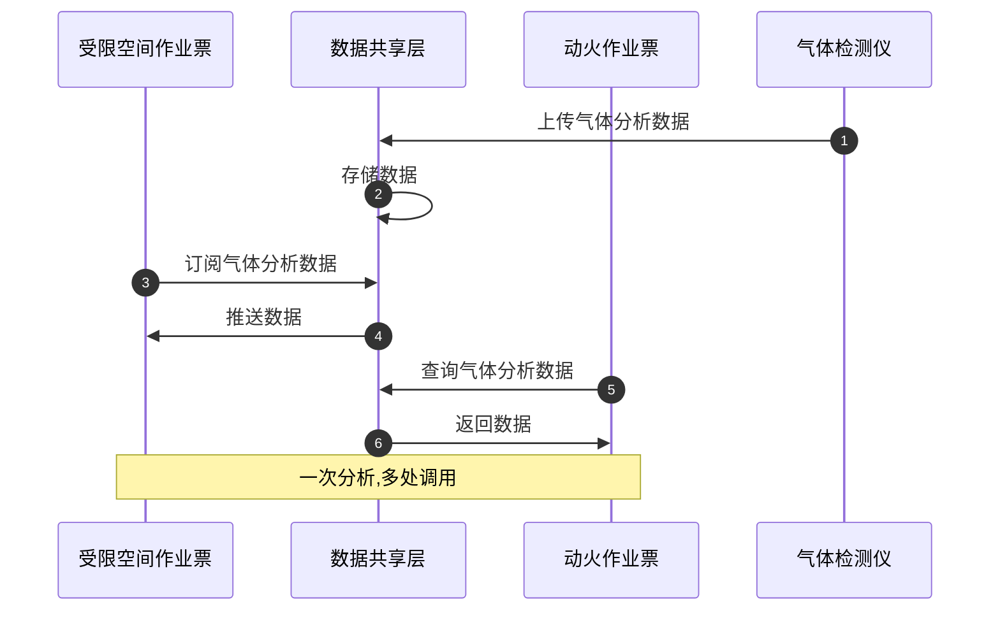

---

## 4.3 8大作业票模块

### 4.3.1 模块通用结构

每个作业票模块包含以下标准组件:

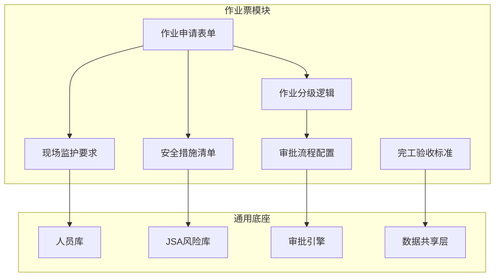

### 4.3.2 模块列表与核心差异

| 模块名称 | 作业分级 | 特殊要求 | 关键风险点 |
|---------|---------|---------|-----------|
| **动火作业** | 特级/一级/二级 | 气体分析(可燃气体、氧含量) 动态隔离带(15米/30米) | 火灾、爆炸 |
| **受限空间作业** | 一级/二级 | 气体分析(氧含量、有毒气体、可燃气体) 通风措施 应急救援预案 | 中毒、窒息、爆炸 |
| **盲板抽堵作业** | 一级/二级 | 压力泄放 介质确认 盲板编号管理 | 泄漏、中毒、灼伤 |
| **高处作业** | 一级/二级/三级/四级 | 高度分级(2-5米/5-15米/15-30米/>30米) 防坠落措施 安全带检查 | 坠落、物体打击 |
| **吊装作业** | 一级/二级 | 吊装重量 吊装高度 吊装方案 | 物体打击、起重伤害 |
| **临时用电作业** | 一级/二级 | 电源隔离 接地保护 漏电保护 | 触电、火灾 |
| **动土作业** | 一级/二级 | 地下管线探测 开挖深度 支护方案 | 管线损坏、中毒、窒息 |
| **断路作业** | 一级/二级 | 交通管制 警示标识 应急通道 | 交通事故、作业冲突 |

### 4.3.3 模块间交叉作业关联

**交叉作业自动识别规则**:
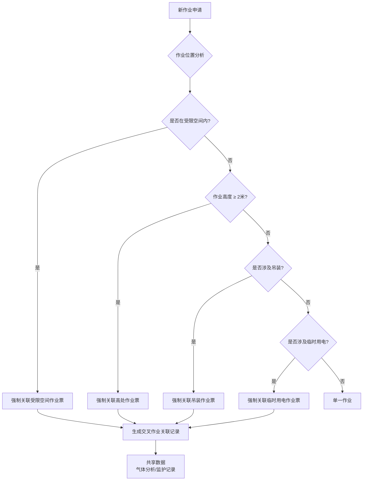

---

## 4.4 技术架构

### 4.4.1 总体技术架构

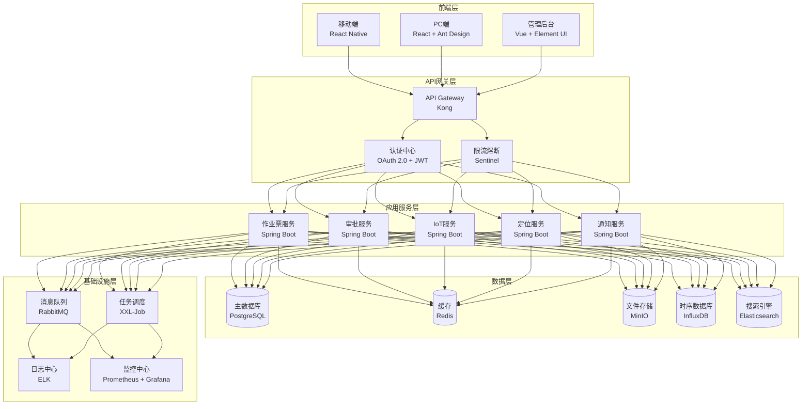

### 4.4.2 核心技术栈选型

| 技术分类 | 技术选型 | 选型理由 |
|---------|---------|---------|
| **前端框架** | React Native (移动端) React (PC端) | 跨平台、生态成熟、性能优秀 |
| **后端框架** | Spring Boot | 企业级、生态完善、易于维护 |
| **API网关** | Kong | 高性能、插件丰富、易于扩展 |
| **主数据库** | PostgreSQL | 开源、支持GIS扩展(PostGIS)、事务性强 |
| **缓存** | Redis | 高性能、支持多种数据结构、持久化 |
| **文件存储** | MinIO | 开源、S3兼容、易于部署 |
| **时序数据库** | InfluxDB | 专为时序数据设计、高性能写入 |
| **搜索引擎** | Elasticsearch | 全文检索、日志分析、实时搜索 |
| **消息队列** | RabbitMQ | 可靠性高、支持多种消息模式 |
| **任务调度** | XXL-Job | 分布式、易于管理、支持动态调度 |
| **监控** | Prometheus + Grafana | 开源、生态完善、可视化强 |

### 4.4.3 部署架构

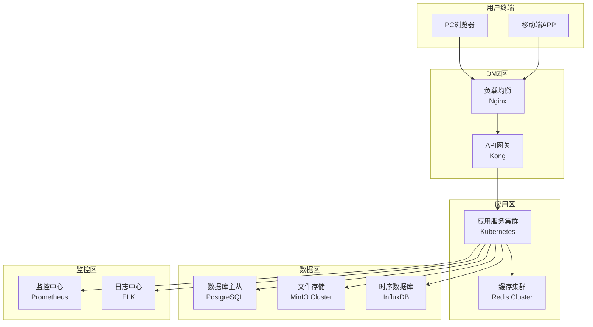

---

**本章节完成时间**: 2026-03-09
**文档维护者**: Claude Code (Opus 4.6)
