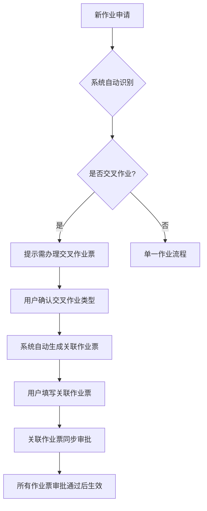
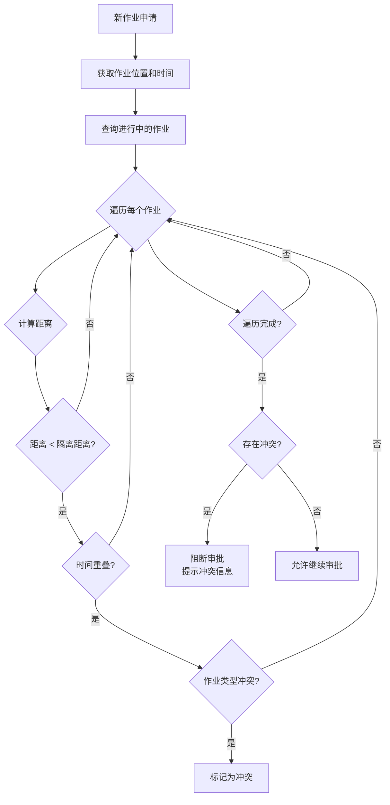

# 6. 8大作业票模块需求(下篇)

## 6.5 吊装作业模块

### 6.5.1 作业分级逻辑

**分级标准**:

| 等级 | 定义 | 典型场景 | 审批权限 | 有效期 |
|------|------|---------|---------|--------|
| **一级吊装** | 1. 吊装重量≥40吨 2. 跨越运行中的生产装置、输送管道 3. 在易燃易爆场所吊装 | 大型设备吊装 跨越管道吊装 罐区吊装 | 车间主任 | ≤8小时 |
| **二级吊装** | 除一级吊装以外的吊装作业 | 常规设备吊装 材料吊装 | 安全员 | ≤8小时 |

**自动判定规则**:
- 系统根据吊装重量自动判定等级
- 系统根据吊装地点(是否跨越管道、是否在易燃易爆场所)自动判定等级

### 6.5.2 申请表单

**必填字段**:
- 作业申请人
- 作业地点(吊装位置、吊装路径)
- 作业时间
- 吊装物品(名称、重量、尺寸)
- 吊装高度
- 吊装设备(起重机型号、额定载荷)
- 作业人员(司机、指挥、挂钩工,自动校验资质)
- 监护人

**自动判定字段**:
- 作业等级(根据重量、地点自动判定)
- 审批流程
- 交叉作业类型(如吊装+高处+动火)

**附件上传**:
- 吊装方案(含吊装路径图)
- 吊装设备检验报告
- 现场照片

### 6.5.3 吊装方案要求

**方案内容**:
- 吊装物品信息(重量、尺寸、重心位置)
- 吊装设备选型(起重机型号、额定载荷、工作半径)
- 吊装路径规划(起吊点、落点、路径)
- 吊装方法(单机吊装、双机抬吊)
- 安全措施(警戒线、防护措施)
- 应急预案

**方案审批**:
- 吊装方案需技术负责人审批
- 一级吊装方案需专家评审

### 6.5.4 吊装设备检查

**检查内容**:
- 起重机检验报告是否在有效期内
- 钢丝绳是否有断丝、锈蚀
- 吊钩是否有裂纹、变形
- 制动器是否灵敏可靠
- 限位器是否正常

**检查流程**:
- 作业前检查(司机检查)
- 监护人复查
- 检查结果拍照上传

**检查记录**:
- 检查不合格禁止使用
- 检查记录需保存至少1年

### 6.5.5 安全措施清单

**强制性措施**:
- 设置警戒线和警示标识(吊装半径外)
- 配备指挥人员(持证上岗)
- 配备通讯设备(对讲机)
- 吊装路径下方禁止站人
- 吊装物品需绑扎牢固

**可选措施**:
- 设置防护网(防止物品坠落)
- 配备应急救援设备
- 配备照明设备(夜间作业)

**措施执行证明**:
- 每项措施需拍照上传
- 绑扎方式需符合规范

### 6.5.6 现场监护要求

**监护人职责**:
- 监督吊装路径下方无人
- 监督吊装物品绑扎牢固
- 监督指挥信号正确
- 发现异常立即制止作业

**在岗验证**:
- 生物识别强制签到
- 地理围栏监控
- 视频监控(一级吊装必须全程视频监控)

---

## 6.6 临时用电作业模块

### 6.6.1 作业分级逻辑

**分级标准**:

| 等级 | 定义 | 典型场景 | 审批权限 | 有效期 |
|------|------|---------|---------|--------|
| **一级临时用电** | 1. 在易燃易爆场所临时用电 2. 潮湿环境临时用电 3. 金属容器内临时用电 | 罐区临时照明 地下室临时用电 受限空间内临时用电 | 车间主任 | ≤8小时 |
| **二级临时用电** | 除一级临时用电以外的临时用电作业 | 办公区临时用电 室外临时用电 | 安全员 | ≤72小时 |

**自动判定规则**:
- 系统根据用电地点(是否为易燃易爆场所、潮湿环境、金属容器内)自动判定等级

### 6.6.2 申请表单

**必填字段**:
- 作业申请人
- 作业地点(用电位置)
- 作业时间
- 用电设备(名称、功率、电压)
- 用电方式(接电源位置、线路长度)
- 作业人员(电工,自动校验资质)
- 监护人

**自动判定字段**:
- 作业等级(根据地点自动判定)
- 审批流程
- 交叉作业类型(如临时用电+动火)

**附件上传**:
- 用电方案
- 电源位置照片
- 线路布置照片

### 6.6.3 电源隔离要求

**隔离措施**:
- 关闭上游开关
- 悬挂"禁止合闸"警示牌
- 加装机械锁
- 拍照上传隔离状态

**验电要求**:
- 使用验电器验电
- 确认无电后方可接线
- 拍照上传验电过程

### 6.6.4 接地保护要求

**接地措施**:
- 临时用电设备必须接地
- 接地电阻≤4Ω
- 接地线截面积≥16mm²
- 拍照上传接地状态

**接地检测**:
- 使用接地电阻测试仪检测
- 检测结果需上传系统
- 检测不合格禁止用电

### 6.6.5 漏电保护要求

**保护措施**:
- 配备漏电保护器(动作电流≤30mA,动作时间≤0.1s)
- 漏电保护器需定期测试
- 拍照上传漏电保护器状态

**测试要求**:
- 作业前测试漏电保护器
- 测试不合格禁止用电
- 测试记录需上传系统

### 6.6.6 安全措施清单

**强制性措施**:
- 电源隔离
- 接地保护
- 漏电保护
- 线路绝缘良好
- 线路架空或穿管保护
- 设置警示标识

**可选措施**:
- 配备绝缘手套
- 配备绝缘鞋
- 配备灭火器

**措施执行证明**:
- 每项措施需拍照上传

---

## 6.7 动土作业模块

### 6.7.1 作业分级逻辑

**分级标准**:

| 等级 | 定义 | 典型场景 | 审批权限 | 有效期 |
|------|------|---------|---------|--------|
| **一级动土** | 1. 在易燃易爆场所动土 2. 可能损坏地下管线的动土 3. 开挖深度≥2米 | 管线开挖 基础施工 深基坑开挖 | 车间主任 | ≤8小时 |
| **二级动土** | 除一级动土以外的动土作业 | 绿化带开挖 浅层开挖 | 安全员 | ≤72小时 |

**自动判定规则**:
- 系统根据动土地点(是否为易燃易爆场所)、开挖深度自动判定等级

### 6.7.2 申请表单

**必填字段**:
- 作业申请人
- 作业地点(动土位置)
- 作业时间
- 动土范围(长×宽×深)
- 动土目的
- 作业人员
- 监护人

**自动判定字段**:
- 作业等级(根据地点、深度自动判定)
- 审批流程
- 交叉作业类型(如动土+受限空间)

**附件上传**:
- 动土方案
- 地下管线图
- 现场照片

### 6.7.3 地下管线探测要求

**探测流程**:
- 查阅地下管线图纸
- 使用管线探测仪探测
- 标注管线位置(喷漆或插旗)
- 拍照上传管线位置

**探测记录**:
- 管线类型(电缆、水管、燃气管等)
- 管线位置(距离动土点距离)
- 管线深度
- 管线状态(运行、停用)

**安全距离**:
- 动土点距离管线≥0.5米
- 如需在管线附近动土,需人工开挖

### 6.7.4 开挖深度管理

**深度分级**:
- 浅层开挖: 深度 < 1米
- 中层开挖: 1米 ≤ 深度 < 2米
- 深层开挖: 深度 ≥ 2米

**深度控制**:
- 开挖前需测量深度
- 开挖过程中需定期测量深度
- 深度超过计划需重新审批

**深度记录**:
- 测量结果需拍照上传
- 测量工具需校准

### 6.7.5 支护方案要求

**支护条件**:
- 开挖深度≥1.5米需支护
- 土质松软需支护
- 地下水位高需支护

**支护方案**:
- 支护类型(钢板桩、钢支撑、土钉墙等)
- 支护参数(间距、深度、材料)
- 支护验收标准

**支护验收**:
- 支护完成后需验收
- 验收合格后方可继续开挖
- 验收记录需上传系统

### 6.7.6 安全措施清单

**强制性措施**:
- 设置警戒线和警示标识
- 配备通风设备(深基坑)
- 配备照明设备
- 配备应急救援设备(安全绳、梯子)
- 配备气体检测仪(深基坑)

**可选措施**:
- 配备排水设备
- 配备防护栏杆
- 配备安全网

**措施执行证明**:
- 每项措施需拍照上传

---

## 6.8 断路作业模块

### 6.8.1 作业分级逻辑

**分级标准**:

| 等级 | 定义 | 典型场景 | 审批权限 | 有效期 |
|------|------|---------|---------|--------|
| **一级断路** | 1. 在生产装置区道路断路 2. 在罐区道路断路 3. 影响消防通道的断路 | 装置区管线铺设 罐区道路维修 消防通道施工 | 车间主任 | ≤8小时 |
| **二级断路** | 除一级断路以外的断路作业 | 办公区道路维修 厂区道路维修 | 安全员 | ≤72小时 |

**自动判定规则**:
- 系统根据断路地点(是否为生产装置区、罐区、消防通道)自动判定等级

### 6.8.2 申请表单

**必填字段**:
- 作业申请人
- 作业地点(断路位置、断路范围)
- 作业时间
- 断路原因
- 绕行路线(如有)
- 作业人员
- 监护人

**自动判定字段**:
- 作业等级(根据地点自动判定)
- 审批流程
- 交叉作业类型(如断路+动土)

**附件上传**:
- 断路方案
- 绕行路线图
- 现场照片

### 6.8.3 交通管制要求

**管制措施**:
- 设置路障(锥形筒、水马)
- 设置警示标识(禁止通行、绕行指示)
- 配备交通指挥人员(高峰时段)
- 设置夜间警示灯(夜间作业)

**管制范围**:
- 断路点前后各50米设置警示标识
- 断路点前后各20米设置路障

**管制时间**:
- 管制开始时间需提前通知相关部门
- 管制结束时间需及时通知相关部门

### 6.8.4 警示标识要求

**标识类型**:
- 禁止通行标识
- 绕行指示标识
- 施工警示标识
- 限速标识(绕行路线)

**标识设置**:
- 标识需清晰可见
- 标识需牢固固定
- 标识需定期检查

**标识拍照**:
- 标识设置完成后需拍照上传
- 标识损坏需及时更换并拍照上传

### 6.8.5 应急通道要求

**通道设置**:
- 断路期间需保留应急通道
- 应急通道宽度≥3.5米(消防车通行)
- 应急通道需保持畅通

**通道标识**:
- 应急通道需设置明显标识
- 应急通道禁止堆放物品

**通道检查**:
- 应急通道需定期检查
- 检查记录需上传系统

### 6.8.6 安全措施清单

**强制性措施**:
- 设置路障和警示标识
- 配备交通指挥人员(高峰时段)
- 保留应急通道
- 设置夜间警示灯(夜间作业)

**可选措施**:
- 配备对讲机
- 配备应急照明
- 配备反光背心

**措施执行证明**:
- 每项措施需拍照上传

---

## 6.9 交叉作业自动识别与关联

### 6.9.1 交叉作业识别规则

**识别维度**:
- **空间维度**: 作业地点是否重叠或邻近
- **时间维度**: 作业时间是否重叠
- **作业内容维度**: 作业内容是否存在冲突

**常见交叉作业组合**:

| 主作业 | 交叉作业 | 识别条件 | 强制关联 |
|-------|---------|---------|---------|
| 动火作业 | 受限空间作业 | 动火点在受限空间内 | 是 |
| 动火作业 | 高处作业 | 动火点高度≥2米 | 是 |
| 动火作业 | 临时用电作业 | 动火使用电焊机 | 是 |
| 吊装作业 | 高处作业 | 吊装高度≥2米 | 是 |
| 吊装作业 | 动火作业 | 吊装物品需焊接固定 | 是 |
| 动土作业 | 受限空间作业 | 开挖深度≥2米 | 是 |
| 断路作业 | 动土作业 | 断路原因为管线开挖 | 是 |

### 6.9.2 交叉作业强制关联

**关联流程**:

**关联规则**:
- 交叉作业票必须同时办理
- 交叉作业票审批流程并行
- 所有作业票审批通过后才能生效
- 任一作业票被驳回,其他作业票自动失效

### 6.9.3 交叉作业数据共享

**共享数据类型**:
- 气体分析数据
- 人员资质信息
- 监护记录
- 安全措施执行记录
- 应急预案

**共享机制**:
- 数据发布(事件驱动)
- 数据订阅(自动订阅关联作业票)
- 数据同步(实时同步)
- 数据版本管理(保留历史版本)

**共享示例**:
- 受限空间内动火: 气体分析数据自动共享给动火作业票
- 高处动火: 高处作业的安全带检查记录自动共享给动火作业票
- 罐区吊装: 吊装作业的监护记录自动共享给动火作业票和高处作业票

### 6.9.4 交叉作业冲突检测

**冲突类型**:
- **空间冲突**: 作业地点距离过近
- **时间冲突**: 作业时间重叠
- **资源冲突**: 监护人、设备等资源冲突

**冲突检测算法**:

**冲突处理**:
- 存在冲突时阻断审批
- 提示冲突信息(冲突作业票号、冲突原因、冲突位置)
- 用户可选择调整作业时间或作业地点
- 用户可选择申请特殊审批(需更高级别审批人批准)

---

**本章节完成时间**: 2026-03-09
**文档维护者**: Claude Code (Opus 4.6)
