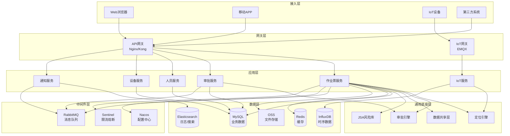

# 8. 技术架构设计

## 8.1 总体架构

### 8.1.1 架构图



### 8.1.2 架构说明

**分层架构**:
- **接入层**: 支持多种客户端接入(Web、移动APP、IoT设备、第三方系统)
- **网关层**: 统一入口,负责路由、鉴权、限流、日志
- **应用层**: 微服务架构,按业务领域拆分服务
- **通用底座层**: 提供通用能力(定位、审批、数据共享、风险库)
- **数据层**: 多种数据存储(关系型、缓存、时序、搜索、文件)
- **中间件层**: 提供基础设施能力(消息、配置、限流)

**架构特点**:
- 微服务架构: 服务独立部署、独立扩展
- 事件驱动: 服务间通过消息队列异步通信
- 读写分离: 主库写、从库读
- 缓存优先: 热点数据缓存
- 弹性伸缩: 支持自动扩缩容

---

## 8.2 技术选型

### 8.2.1 后端技术栈

| 技术类别 | 技术选型 | 版本 | 说明 |
|---------|---------|------|------|
| **开发语言** | Java | 17 LTS | 主流企业级开发语言 |
| **开发框架** | Spring Boot | 3.2.x | 简化Spring开发 |
| **微服务框架** | Spring Cloud Alibaba | 2023.x | 微服务全家桶 |
| **ORM框架** | MyBatis Plus | 3.5.x | 增强MyBatis |
| **API文档** | Knife4j | 4.x | Swagger增强版 |
| **权限框架** | Sa-Token | 1.37.x | 轻量级权限框架 |
| **工作流引擎** | Flowable | 7.x | BPMN 2.0工作流 |
| **规则引擎** | Drools | 8.x | 业务规则引擎 |
| **定时任务** | XXL-Job | 2.4.x | 分布式任务调度 |
| **日志框架** | Logback | 1.4.x | 日志记录 |
| **工具类库** | Hutool | 5.8.x | Java工具类库 |

### 8.2.2 前端技术栈

| 技术类别 | 技术选型 | 版本 | 说明 |
|---------|---------|------|------|
| **开发语言** | TypeScript | 5.x | JavaScript超集 |
| **前端框架** | Vue.js | 3.x | 渐进式框架 |
| **UI组件库** | Element Plus | 2.x | Vue 3组件库 |
| **状态管理** | Pinia | 2.x | Vue 3状态管理 |
| **路由管理** | Vue Router | 4.x | Vue 3路由 |
| **HTTP客户端** | Axios | 1.x | HTTP请求库 |
| **构建工具** | Vite | 5.x | 下一代前端构建工具 |
| **地图组件** | Leaflet | 1.9.x | 开源地图库 |
| **图表组件** | ECharts | 5.x | 数据可视化 |
| **富文本编辑器** | TinyMCE | 6.x | 富文本编辑器 |

### 8.2.3 移动端技术栈

| 技术类别 | 技术选型 | 版本 | 说明 |
|---------|---------|------|------|
| **开发框架** | uni-app | 3.x | 跨平台开发框架 |
| **UI组件库** | uView UI | 3.x | uni-app组件库 |
| **状态管理** | Vuex | 4.x | 状态管理 |
| **HTTP客户端** | uni.request | - | uni-app内置 |
| **地图组件** | 高德地图 | - | 原生地图插件 |
| **人脸识别** | 百度AI | - | 人脸识别SDK |
| **扫码识别** | uni.scanCode | - | uni-app内置 |

### 8.2.4 数据库技术栈

| 技术类别 | 技术选型 | 版本 | 说明 |
|---------|---------|------|------|
| **关系型数据库** | MySQL | 8.0.x | 主流开源数据库 |
| **缓存数据库** | Redis | 7.x | 内存数据库 |
| **时序数据库** | InfluxDB | 2.x | IoT数据存储 |
| **搜索引擎** | Elasticsearch | 8.x | 全文检索 |
| **对象存储** | MinIO | RELEASE.2024-x | 开源对象存储 |
| **数据库连接池** | HikariCP | 5.x | 高性能连接池 |
| **数据库版本管理** | Flyway | 10.x | 数据库迁移工具 |

### 8.2.5 中间件技术栈

| 技术类别 | 技术选型 | 版本 | 说明 |
|---------|---------|------|------|
| **消息队列** | RabbitMQ | 3.13.x | 消息中间件 |
| **配置中心** | Nacos | 2.3.x | 配置管理 |
| **服务注册** | Nacos | 2.3.x | 服务发现 |
| **API网关** | Spring Cloud Gateway | 4.x | 微服务网关 |
| **限流熔断** | Sentinel | 1.8.x | 流量控制 |
| **链路追踪** | SkyWalking | 9.x | APM监控 |
| **IoT网关** | EMQX | 5.x | MQTT Broker |

### 8.2.6 DevOps技术栈

| 技术类别 | 技术选型 | 版本 | 说明 |
|---------|---------|------|------|
| **容器化** | Docker | 24.x | 容器引擎 |
| **容器编排** | Kubernetes | 1.28.x | 容器编排 |
| **CI/CD** | Jenkins | 2.x | 持续集成 |
| **代码仓库** | GitLab | 16.x | 代码托管 |
| **制品仓库** | Harbor | 2.x | 镜像仓库 |
| **监控告警** | Prometheus + Grafana | 2.x + 10.x | 监控可视化 |
| **日志收集** | ELK Stack | 8.x | 日志分析 |

---

## 8.3 数据库设计

### 8.3.1 数据库分库策略

**分库原则**:
- 按企业ID分库(支持多租户)
- 每个企业独立数据库
- 公共数据(字典、模板)存储在公共库

**分库示例**:
```
work_permit_common    # 公共库
work_permit_tenant_001 # 企业1数据库
work_permit_tenant_002 # 企业2数据库
...
```

### 8.3.2 数据库分表策略

**分表原则**:
- 按时间分表(作业票、审批记录、日志)
- 按月分表或按年分表
- 历史数据归档

**分表示例**:
```
work_permit_202601  # 2026年1月作业票
work_permit_202602  # 2026年2月作业票
work_permit_202603  # 2026年3月作业票
...
```

### 8.3.3 核心表设计

**作业票主表**(work_permit):
```sql
CREATE TABLE work_permit (
    id BIGINT PRIMARY KEY AUTO_INCREMENT COMMENT '主键',
    permit_no VARCHAR(50) NOT NULL UNIQUE COMMENT '作业票编号',
    permit_type VARCHAR(20) NOT NULL COMMENT '作业类型',
    permit_level VARCHAR(20) NOT NULL COMMENT '作业等级',
    applicant_id BIGINT NOT NULL COMMENT '申请人ID',
    applicant_dept_id BIGINT NOT NULL COMMENT '申请部门ID',
    work_location VARCHAR(200) NOT NULL COMMENT '作业地点',
    work_content TEXT NOT NULL COMMENT '作业内容',
    work_start_time DATETIME NOT NULL COMMENT '作业开始时间',
    work_end_time DATETIME NOT NULL COMMENT '作业结束时间',
    status VARCHAR(20) NOT NULL COMMENT '状态',
    create_time DATETIME NOT NULL DEFAULT CURRENT_TIMESTAMP COMMENT '创建时间',
    update_time DATETIME NOT NULL DEFAULT CURRENT_TIMESTAMP ON UPDATE CURRENT_TIMESTAMP COMMENT '更新时间',
    INDEX idx_permit_no (permit_no),
    INDEX idx_applicant_id (applicant_id),
    INDEX idx_status (status),
    INDEX idx_create_time (create_time)
) ENGINE=InnoDB DEFAULT CHARSET=utf8mb4 COMMENT='作业票主表';
```

**审批记录表**(approval_record):
```sql
CREATE TABLE approval_record (
    id BIGINT PRIMARY KEY AUTO_INCREMENT COMMENT '主键',
    permit_id BIGINT NOT NULL COMMENT '作业票ID',
    node_id VARCHAR(50) NOT NULL COMMENT '审批节点ID',
    node_name VARCHAR(100) NOT NULL COMMENT '审批节点名称',
    approver_id BIGINT NOT NULL COMMENT '审批人ID',
    approval_result VARCHAR(20) NOT NULL COMMENT '审批结果',
    approval_opinion TEXT COMMENT '审批意见',
    approval_time DATETIME NOT NULL COMMENT '审批时间',
    signature TEXT COMMENT '电子签名',
    create_time DATETIME NOT NULL DEFAULT CURRENT_TIMESTAMP COMMENT '创建时间',
    INDEX idx_permit_id (permit_id),
    INDEX idx_approver_id (approver_id),
    INDEX idx_approval_time (approval_time)
) ENGINE=InnoDB DEFAULT CHARSET=utf8mb4 COMMENT='审批记录表';
```

**气体分析记录表**(gas_analysis_record):
```sql
CREATE TABLE gas_analysis_record (
    id BIGINT PRIMARY KEY AUTO_INCREMENT COMMENT '主键',
    permit_id BIGINT NOT NULL COMMENT '作业票ID',
    analysis_time DATETIME NOT NULL COMMENT '分析时间',
    analysis_location VARCHAR(200) NOT NULL COMMENT '分析地点',
    oxygen_content DECIMAL(5,2) COMMENT '氧含量(%)',
    combustible_gas DECIMAL(5,2) COMMENT '可燃气体(%LEL)',
    toxic_gas DECIMAL(5,2) COMMENT '有毒气体(ppm)',
    analyzer_id BIGINT NOT NULL COMMENT '分析人ID',
    device_id VARCHAR(50) COMMENT '设备ID',
    is_qualified TINYINT NOT NULL COMMENT '是否合格',
    create_time DATETIME NOT NULL DEFAULT CURRENT_TIMESTAMP COMMENT '创建时间',
    INDEX idx_permit_id (permit_id),
    INDEX idx_analysis_time (analysis_time),
    INDEX idx_device_id (device_id)
) ENGINE=InnoDB DEFAULT CHARSET=utf8mb4 COMMENT='气体分析记录表';
```

**监护记录表**(guardian_record):
```sql
CREATE TABLE guardian_record (
    id BIGINT PRIMARY KEY AUTO_INCREMENT COMMENT '主键',
    permit_id BIGINT NOT NULL COMMENT '作业票ID',
    guardian_id BIGINT NOT NULL COMMENT '监护人ID',
    check_in_time DATETIME NOT NULL COMMENT '签到时间',
    check_in_type VARCHAR(20) NOT NULL COMMENT '签到类型',
    check_in_location VARCHAR(200) COMMENT '签到位置',
    check_in_photo VARCHAR(500) COMMENT '签到照片',
    is_on_duty TINYINT NOT NULL COMMENT '是否在岗',
    create_time DATETIME NOT NULL DEFAULT CURRENT_TIMESTAMP COMMENT '创建时间',
    INDEX idx_permit_id (permit_id),
    INDEX idx_guardian_id (guardian_id),
    INDEX idx_check_in_time (check_in_time)
) ENGINE=InnoDB DEFAULT CHARSET=utf8mb4 COMMENT='监护记录表';
```

### 8.3.4 索引设计

**索引原则**:
- 主键索引(自增ID)
- 唯一索引(业务唯一字段)
- 普通索引(高频查询字段)
- 联合索引(多字段组合查询)

**索引优化**:
- 避免过多索引(影响写入性能)
- 定期分析索引使用情况
- 删除无用索引

---

## 8.4 接口设计

### 8.4.1 RESTful API规范

**URL设计**:
```
GET    /api/v1/work-permits          # 查询作业票列表
GET    /api/v1/work-permits/{id}     # 查询作业票详情
POST   /api/v1/work-permits          # 创建作业票
PUT    /api/v1/work-permits/{id}     # 更新作业票
DELETE /api/v1/work-permits/{id}     # 删除作业票
POST   /api/v1/work-permits/{id}/submit    # 提交作业票
POST   /api/v1/work-permits/{id}/approve   # 审批作业票
POST   /api/v1/work-permits/{id}/reject    # 驳回作业票
POST   /api/v1/work-permits/{id}/close     # 关闭作业票
```

**请求格式**:
```json
{
  "permitType": "动火作业",
  "permitLevel": "特级动火",
  "workLocation": "A区反应釜",
  "workContent": "反应釜焊接维修",
  "workStartTime": "2026-03-09T08:00:00",
  "workEndTime": "2026-03-09T18:00:00",
  "workers": [
    {"userId": 1001, "role": "焊工"},
    {"userId": 1002, "role": "监护人"}
  ]
}
```

**响应格式**:
```json
{
  "code": 200,
  "message": "success",
  "data": {
    "id": 12345,
    "permitNo": "WP20260309001",
    "permitType": "动火作业",
    "permitLevel": "特级动火",
    "status": "待审批",
    "createTime": "2026-03-09T07:30:00"
  },
  "timestamp": "2026-03-09T07:30:00"
}
```

### 8.4.2 WebSocket接口

**连接地址**:
```
ws://domain/ws/notifications?token=xxx
```

**消息格式**:
```json
{
  "type": "APPROVAL_NOTIFICATION",
  "data": {
    "permitId": 12345,
    "permitNo": "WP20260309001",
    "message": "您有一条作业票待审批"
  },
  "timestamp": "2026-03-09T08:00:00"
}
```

### 8.4.3 IoT设备接口

**MQTT主题**:
```
device/{deviceId}/data      # 设备数据上报
device/{deviceId}/command   # 设备指令下发
device/{deviceId}/status    # 设备状态上报
device/{deviceId}/alarm     # 设备告警上报
```

**数据格式**:
```json
{
  "deviceId": "GAS001",
  "deviceType": "气体检测仪",
  "timestamp": "2026-03-09T08:00:00",
  "data": {
    "oxygenContent": 20.5,
    "combustibleGas": 0.1,
    "toxicGas": 0
  }
}
```

---

**本章节完成时间**: 2026-03-09
**文档维护者**: Claude Code (Opus 4.6)
