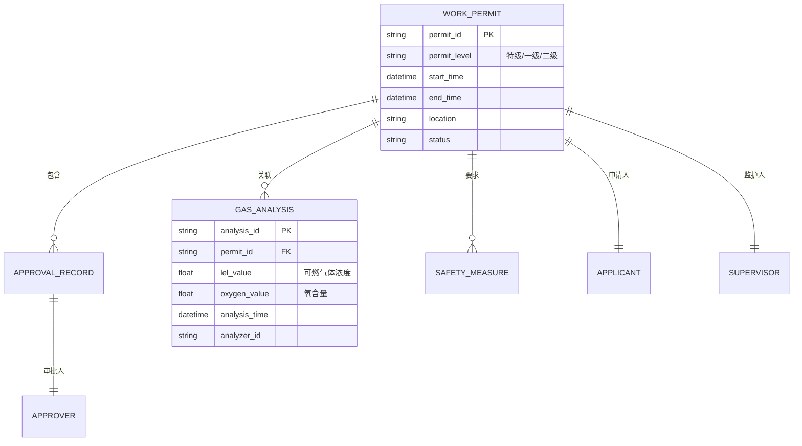
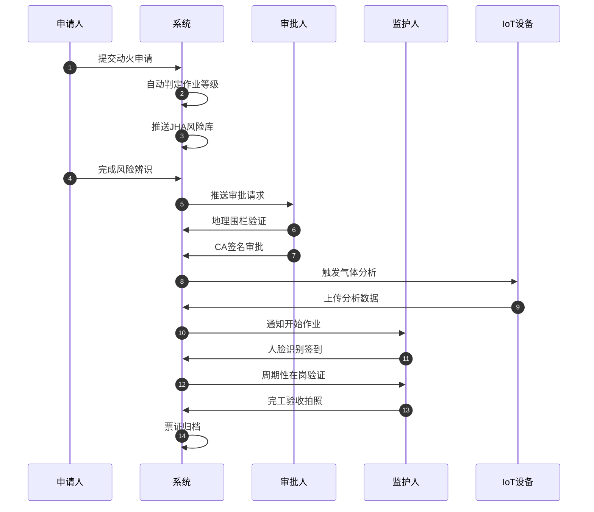

# 动火作业票电子审批系统 - 项目知识库

> 本文档是动火作业票电子审批系统产品策划项目的核心知识库，记录了系统设计的关键业务知识、技术决策和实施路径。

## 1. 项目概述

### 1.1 项目定位
- **项目类型**：产品策划项目（非代码开发）
- **目标**：为危险化学品企业动火作业票电子审批系统产出完整的产品文档体系
- **视角**：世界级资深产品经理
- **行业**：危险化学品企业安全管理

### 1.2 业务背景
- **核心问题**：传统纸质动火作业票存在审批滞后、数据造假、监护缺位等严重安全隐患
- **监管依据**：GB 30871-2022《危险化学品企业特殊作业安全规范》
- **系统定位**：高并发、高可靠性、强合规驱动的动态工作流系统

### 1.3 项目目标
产出以下产品经理核心文档：
1. PRD.md - 产品需求文档
2. roadmap.md - 产品路线图
3. 其他必要的产品文档

### 1.4 参考资料
- `分析内容/动火作业电子审批系统设计.txt` - 行业深度研究报告（约14,000字）
- `分析内容/参考1.txt` - 资深全栈产品经理实施路径
- `分析内容/规范GB+30871-2022 (1).pdf` - 国家标准文档
- `产品资料/` - 14张现有产品UI截图参考

---

## 2. 架构设计

### 2.1 核心业务逻辑
动火作业的核心逻辑闭环：

### 2.2 系统架构概述
- **表单引擎**：支持拖拽式配置，适应不同行业需求
- **状态机引擎**：处理复杂审批流（特级/一级/二级动火）
- **合规规则引擎**：自动校验合规性（气体检测时效、审批人资质等）

---

## 3. 架构决策记录（ADR）

### ADR-001: 采用产品策划而非代码开发模式
- **日期**：2026-03-09
- **状态**：已接受
- **背景**：项目目标是产出产品文档，而非实际系统开发
- **决策**：聚焦于PRD、Roadmap等产品文档的高质量产出
- **影响**：不涉及代码编写，但需要深入理解技术实现细节以支撑产品设计

---

## 4. 设计决策 & 技术债务

### 4.1 动火作业分级模型（核心业务规则）

根据GB 30871-2022标准，动火作业分为三个等级，每个等级对应不同的风险程度、审批权限和有效期：

| 等级 | 定义与典型场景 | 审批权限 | 有效期上限 |
|------|---------------|---------|-----------|
| **特级动火** | 1. 运行中的易燃易爆生产装置、罐区等部位 2. 受限空间内部 3. 异常生产情况下的动火 | 企业负责人或总工程师（或其书面授权人） | 8小时以内 |
| **一级动火** | 易燃易爆场所内除特级动火以外的动火作业 | 基层单位负责人（如车间主任） | 8小时以内 |
| **二级动火** | 1. 禁火区内除特级、一级动火以外的动火作业 2. 装置经清洗隔离合格后的停车检修作业 | 基层单位安全管理人员或安全员 | 72小时以内 |

**关键业务逻辑**：
- **停车检修自动降级**：当生产装置或系统全部停车，并经清洗、置换、分析合格及采取安全隔离措施后，经企业生产或安全负责人批准，系统可允许将动火作业按二级管理
- **证据链闭环**：降级必须有清洗合格报告、盲板抽堵记录等证据支撑
- **审批权限漂移**：如果审批人不能实施现场审批，审批权限应自动向上漂移，由上一级或再上一级人员接替，而非简单下放权限

### 4.2 气体分析合规要求（强制性标准）

气体分析是动火作业中判定环境是否安全的最客观标准，GB 30871-2022对此有严格要求：

| 分析类别 | 指标要求 | 系统强制控制点 |
|---------|---------|---------------|
| **可燃气体 (LEL < 4%)** | 检测浓度应 < 0.2% (V/V) | 分析合格后30分钟内必须开工，否则失效 |
| **可燃气体 (LEL ≥ 4%)** | 检测浓度应 < 0.5% (V/V) | 作业中断超过30分钟应强制重新分析 |
| **氧含量监测** | 19.5% ~ 21.0% (V/V) | 系统应能直接抓取防爆移动检测仪的数据 |
| **持续监测要求** | 特级动火必须全程连续监测 | 监测数值超出设定阈值需在APP端实时报警 |

**技术实现要点**：
- **IoT数据链路**：智能防爆检测仪通过蓝牙或4G/5G网络与审批系统连接，实现气体分析数据的自动上传、时间戳绑定及地理位置校验
- **防数据造假**：禁止人工录入数据，分析人员需在作业点位的上、中、下不同高度采集样本，并拍摄带有地理位置水印的采样照片上传系统
- **代表性验证**：系统验证分析点位的代表性，确保不是"办公室化验员"

### 4.3 行业特有风险点与技术规避方案

#### 风险点1：虚假监护与"影子监护人"
**行业现状**：作业现场监护人往往挂名而不现身，或在作业期间擅自离开。监护人是动火作业现场的最后一道防火墙，必须具备应急处置能力并全程在场。

**系统避坑方案**：
- **生物识别强制签到**：在动火期间，系统每隔30分钟或1小时向监护人手机发送随机的人脸识别指令。如果监护人未在规定时间内完成核验，系统立即通过短信和语音推送给审批人及现场主管，并视作违章
- **地理围栏（Geo-fencing）**：利用高精度定位技术（如UWB或北斗），将监护人的活动范围限制在动火点方圆10-15米内。一旦监护人手机离开该围栏，系统自动发出警告并要求停止动火
- **特级动火视频联动**：特级动火必须实施全程视频监控。电子审批系统应能调用现场的布控球或移动摄像头画面，利用AI算法自动识别监护人是否在岗、是否佩戴袖标以及是否携带了合格的监测仪器

#### 风险点2：安全措施的"云确认"与照片作假
**行业现状**：作业人员在系统中勾选安全措施时，并不实际去现场检查灭火器、防火毯、下水井封堵等落实情况，而是直接在办公室一次性勾选。

**系统避坑方案**：
- **强制拍照上传**：针对每一项核心安全措施（如"动火点周围15米内无易燃物"、"气瓶间距大于5米"），系统应要求拍摄实时照片
- **防翻拍技术**：系统相机应具备AI识别功能，防止用户对着电脑屏幕或旧照片进行二次拍摄。所有照片必须强制包含不可修改的时间、地点及经纬度水印
- **交叉验证机制**：安全员和监护人需分别独立对措施进行核查并签名，通过多重确认机制降低单人造假的概率

#### 风险点3：动火时间管理的弹性漏洞
**行业现状**：GB 30871-2022明确规定特级、一级动火有效期不超过8小时。但在生产实践中，由于吃饭、午休等原因，实际作业往往是断续的。

**系统避坑方案**：
- **作业激活与挂起机制**：当作业人员离开现场（如中午吃饭），监护人应在系统中点击"挂起"，此时系统停止计时但保持票证有效。重新开工前，系统强制触发一次"微型JHA"和气体分析复核，确认环境无变化后方可重新激活
- **总有效期强制控制**：如果总有效期（包含挂起时间）超过8小时，系统应强制关闭该票并要求重新办理，从而严格遵守国家标准的刚性要求

### 4.4 生物识别与电子签名的合规性要求

#### 人脸识别技术标准
根据GA/T和金融级的识别要求，动火作业审批系统应能有效防范照片、视频及硅胶面具的攻击：

| 技术指标 | 规范要求 | 设计含义 |
|---------|---------|---------|
| **响应时间** | 人脸验证总时间 ≤ 2000ms | 确保现场操作流畅，不因技术延迟影响作业进度 |
| **活体检测率** | 当LDAFAR为0.1%时，LPFRR应≤2% | 在极低误识率的前提下，保证真实用户能被顺畅识别 |
| **环境适应性** | -25℃ ~ 70℃（室外型）；湿度≤93% | 必须适应化工企业露天、高温或严寒的极端环境 |
| **分辨率** | 人脸全景图不低于640*480像素 | 确保后端审计时图片清晰可见，五官特征明显 |

#### 个人隐私保护与合规存储
在中华人民共和国境内应用人脸识别技术，必须遵循"非强制原则"，且需在采集前单独告知用户目的、方式及保存期限：

- **数据脱敏处理**：人脸信息在采集后应立即进行加密、去标识化处理。系统数据库中不应存储原始人脸图片，而应存储特征向量（Feature Vector）
- **定期清理机制**：对于外来承包商人员的人脸信息，系统应在作业合同到期或票证归档后设定自动删除或匿名化机制，除非满足特定备案要求的10万人级存储门槛
- **CA数字证书集成**：每一个审批节点在人脸识别通过后，应自动调用个人CA数字证书进行电子签名。这不仅是防抵赖的技术手段，更是符合《电子签名法》的法律保障

### 4.5 复杂环境下的通信与硬件适配策略

#### 信号盲区的离线处理机制
石化生产装置区通常伴随着大量的金属设备塔群，对4G/5G信号屏蔽严重：

- **离线填报模式**：审批APP应支持在无信号环境下录入信息、采集照片和进行人脸对比（基于本地模型）。数据应在加密分区暂存，一旦检测到信号（如回到巡检室或主控室），系统自动触发同步机制
- **时间戳防伪**：离线模式下，必须调用手机硬件底层的时间源，防止用户通过修改系统时间来伪造气体分析时间或审批时间

#### 硬件终端的防爆安全性
在火灾爆炸危险场所使用的手持终端必须具备相应的防爆等级：

- **设备准入审核**：审批系统应当能够在设备层面进行检测：如果用户使用的终端未经过企业的"安全准入审核"或防爆证书已过期，APP应限制其在危险区域内开启
- **MDM能力**：系统需具备移动设备管理（MDM）能力，统一管理防爆终端

### 4.6 完工验收与票证归档的闭环管理

#### 现场恢复与工器具核销
GB 30871-2022要求作业完毕后应及时恢复作业时拆移的盖板、箅子板、扶手等安全设施，并清理现场：

- **完工照片墙**：系统应设计"完工照片墙"，要求监护人拍摄清理后的现场全景图，并由基层单位接收人进行线上核销
- **多工种交叉作业检查**：如果现场涉及多工种交叉作业，系统应能自动识别并提示相关方检查是否有遗留火种

#### 数字化审计与数据回溯
电子票证的价值不仅在于审批，更在于事后的风险分析：

- **数据存储时限**：已签发的电子票证及相关原始记录（如气体分析记录、监控视频、人脸比对日志）应至少保存一年，以便应对政府安监部门的随机审计
- **自动统计报表**：系统应能自动分析各车间的动火作业频率、常见违章项、各级审批人的响应时效等指标，为企业的安全绩效考核提供数据支撑

---

## 5. 模块文档

### 5.1 智能申请与风险识别模块
- **职责**：自动判定动火等级、集成JSA风险数据库
- **关键功能**：作业分级自研、风险点自动匹配

### 5.2 动态审批流模块
- **职责**：多端联动审批、CA认证签名、地理围栏验证
- **关键功能**：条件分支审批、防远程审批

### 5.3 气体分析与IoT集成模块
- **职责**：实时气体检测数据采集、周期性提醒
- **关键功能**：蓝牙/4G连接探测器、防数据篡改

### 5.4 现场监控模块
- **职责**：AI视觉分析、违章行为识别
- **关键功能**：烟火识别、安全帽检测、监护人脱岗告警

### 5.5 完工验收模块
- **职责**：现场清理验证、票证关闭
- **关键功能**：拍照上传、多方核销

---

## 6. API 手册

（本项目为产品策划，API设计将在PRD中详述）

---

## 7. 数据模型

### 7.1 核心实体关系

---

## 8. 核心流程

### 8.1 动火作业全生命周期流程

---

## 9. 依赖图谱

### 9.1 外部依赖
- **GB 30871-2022**：国家标准，强制合规
- **电子签名法**：电子签名法律效力依据
- **IoT设备**：气体探测器、防爆手持终端
- **生物识别技术**：人脸识别、活体检测

### 9.2 技术依赖
- **微服务架构**：高可用性、解耦
- **分布式事务**：数据一致性保障
- **离线缓存技术**：弱信号环境支持
- **Event Sourcing**：审计日志

---

## 10. 维护建议

### 10.1 文档维护
- 每次产品文档更新后，同步更新本知识库
- 关键决策记录到ADR章节
- 术语表持续补充

### 10.2 质量保障
- 所有Mermaid图表需可正常渲染
- 术语使用保持一致性
- 文档间交叉引用保持准确

---

## 11. 八大特殊作业业务知识补充

> 本章节补充动火作业之外的其他7大特殊作业类型的核心业务规则，支撑"1+8"架构的完整产品设计。

### 11.1 受限空间作业

#### 11.1.1 作业定义与典型场景

**定义**：进入或探入受限空间进行的作业。

**受限空间特征**：
- 进出口受限
- 通风不良
- 可能存在有毒有害、易燃易爆物质或缺氧
- 不适合人员长时间停留

**典型场景**：反应器、塔、釜、槽、罐、炉膛、锅筒、管道、地下室、窨井、坑池、下水道、船舱等。

#### 11.1.2 核心业务规则

| 规则类别 | 具体要求 | 系统强制控制点 |
|---------|---------|---------------|
| 有效期 | ≤24小时 | 超期自动失效 |
| 作业原则 | 先通风、再检测、后作业 | 三步骤强制顺序校验 |
| 气体检测 | 氧含量19.5%-23.5%，有毒气体<MAC，可燃气体<10%LEL | 检测数据IoT自动上传 |
| 持续监测 | 作业全程连续监测 | 监测中断>5分钟强制撤离 |
| 监护要求 | 监护人必须在受限空间外全程监护 | 监护人位置GPS校验 |
| 应急准备 | 现场配备应急救援装备（呼吸器、安全绳等） | 装备清单拍照上传 |

#### 11.1.3 关键风险点

**风险1：盲目施救导致伤亡扩大**
- 历史教训：受限空间事故中，约60%的死亡者是盲目施救人员
- 系统规避：强制要求监护人不得擅自进入施救，必须呼叫专业救援队

**风险2：通风不充分**
- 技术方案：系统记录通风时长（≥30分钟），并要求多点位气体检测

### 11.2 高处作业

#### 11.2.1 作业分级

| 级别 | 高度范围 | 审批人 | 有效期 |
|------|---------|--------|--------|
| I级 | 2m ≤ h < 5m | 所在基层单位 | ≤7天 |
| II级 | 5m ≤ h < 15m | 安全管理部门 | ≤7天 |
| III级 | 15m ≤ h < 30m | 安全管理部门 | ≤7天 |
| IV级 | h ≥ 30m | 主管厂长或总工程师 | ≤7天 |

#### 11.2.2 核心业务规则

| 规则类别 | 具体要求 | 系统强制控制点 |
|---------|---------|---------------|
| 人员资质 | 持有高处作业操作证 | 证书有效期自动校验 |
| 身体条件 | 无高血压、心脏病、恐高症等 | 健康档案关联检查 |
| 安全防护 | 必须佩戴安全带和安全绳 | 现场照片AI识别 |
| 作业平台 | 检查脚手架、吊篮等设施合格 | 设施检验报告上传 |
| 地面警戒 | 设置警戒区域，防止物体坠落伤人 | 警戒范围地理围栏 |
| 恶劣天气 | 六级以上大风、暴雨、雷电禁止作业 | 天气API自动预警 |

### 11.3 吊装作业

#### 11.3.1 作业分级

| 级别 | 吊装重量 | 审批人 | 特殊要求 |
|------|---------|--------|---------|
| 一级 | >100吨 | 主管厂长或总工程师 | 编制吊装方案 |
| 二级 | 40-100吨 | 安全管理部门 | 编制吊装方案 |
| 三级 | <40吨 | 所在基层单位 | - |

#### 11.3.2 核心业务规则

| 规则类别 | 具体要求 | 系统强制控制点 |
|---------|---------|---------------|
| 吊装方案 | 一、二级吊装必须编制专项方案 | 方案文档强制上传 |
| 机具检验 | 起重机、吊具必须在检验有效期内 | 设备台账关联校验 |
| 人员资质 | 司机、司索工持证上岗 | 证书有效期自动校验 |
| 试吊要求 | 吊离地面10-20cm悬停检查 | 试吊照片上传 |
| 警戒范围 | 吊装半径内设置警戒 | 地理围栏 + 人员定位 |
| 统一指挥 | 只能有一名指挥人员 | 指挥人员唯一性校验 |

### 11.4 盲板抽堵作业

#### 11.4.1 作业定义

在压力管道上安装或拆除盲板（隔离板）的作业，用于设备检修时的安全隔离。

#### 11.4.2 核心业务规则

| 规则类别 | 具体要求 | 系统强制控制点 |
|---------|---------|---------------|
| 有效期 | ≤8小时 | 超期自动失效 |
| 隔离确认 | 必须确认介质已排空、压力已泄放 | 压力表读数拍照上传 |
| 盲板编号 | 每个盲板必须有唯一编号和台账 | 盲板二维码扫码登记 |
| 抽堵记录 | 记录盲板位置、规格、抽堵时间 | 系统自动生成台账 |
| 交接确认 | 检修完成后必须确认盲板已拆除 | 拆除照片 + 双人确认 |
| 防遗留 | 开车前必须核对盲板台账，确保全部拆除 | 系统强制核对流程 |

**关键风险点**：盲板遗留在管道内，开车后可能导致超压爆炸。

### 11.5 临时用电作业

#### 11.5.1 核心业务规则

| 规则类别 | 具体要求 | 系统强制控制点 |
|---------|---------|---------------|
| 有效期 | ≤7天 | 超期自动失效 |
| 人员资质 | 电工持证上岗 | 证书有效期自动校验 |
| 线路检查 | 检查电缆绝缘、接地保护 | 检查清单拍照上传 |
| 防爆要求 | 易燃易爆场所使用防爆电气 | 设备防爆证书校验 |
| 漏电保护 | 必须安装漏电保护器 | 保护器照片上传 |
| 安全距离 | 与动火点、易燃物保持安全距离 | 地理围栏冲突检测 |

### 11.6 动土作业

#### 11.6.1 作业定义

在地面进行开挖、钻孔、打桩等可能损坏地下设施的作业。

#### 11.6.2 核心业务规则

| 规则类别 | 具体要求 | 系统强制控制点 |
|---------|---------|---------------|
| 有效期 | ≤7天 | 超期自动失效 |
| 地下管线探测 | 作业前必须探明地下管线位置 | 管线图纸上传 + 现场标识照片 |
| 安全距离 | 距地下管线≥0.5m | 开挖深度与管线距离校验 |
| 监护要求 | 管线单位派人现场监护 | 监护人签到 + GPS定位 |
| 应急准备 | 配备管线抢修器材 | 器材清单拍照上传 |
| 回填要求 | 作业完成后及时回填 | 回填照片上传 |

**关键风险点**：误挖地下管线（燃气、电缆、给排水）导致泄漏、爆炸、停电等事故。

### 11.7 断路作业

#### 11.7.1 作业定义

在道路、通道上进行施工，影响车辆、人员通行的作业。

#### 11.7.2 核心业务规则

| 规则类别 | 具体要求 | 系统强制控制点 |
|---------|---------|---------------|
| 有效期 | ≤7天 | 超期自动失效 |
| 交通组织 | 制定交通疏导方案 | 方案文档上传 |
| 警示标识 | 设置警示牌、隔离栏、警示灯 | 现场照片上传 |
| 应急通道 | 保留消防车、救护车通道 | 通道宽度≥4m校验 |
| 夜间作业 | 夜间作业必须有充足照明 | 照明设施照片上传 |
| 恢复要求 | 作业完成后及时恢复交通 | 恢复照片上传 |

---

## 12. 术语表和缩写

### 11.1 核心术语

| 术语 | 英文 | 定义 |
|------|------|------|
| 动火作业 | Hot Work | 在禁火区内从事可能产生火焰、火花或炽热表面的非常规作业 |
| 特级动火 | Special-Grade Hot Work | 运行中的易燃易爆生产装置、罐区等部位的动火作业 |
| 一级动火 | First-Grade Hot Work | 易燃易爆场所内除特级动火以外的动火作业 |
| 二级动火 | Second-Grade Hot Work | 禁火区内除特级、一级动火以外的动火作业 |
| JHA | Job Hazard Analysis | 作业危害分析 |
| LEL | Lower Explosive Limit | 爆炸下限 |
| CA认证 | Certificate Authority | 数字证书认证 |
| 地理围栏 | Geo-fencing | 基于地理位置的虚拟边界 |
| 盲板抽堵 | Blind Plate Installation/Removal | 安全隔离措施 |
| 受限空间 | Confined Space | 进出口受限、通风不良的封闭或半封闭空间 |
| IoT | Internet of Things | 物联网 |
| AI视觉 | AI Vision | 人工智能视觉识别技术 |
| MVP | Minimum Viable Product | 最小可行产品 |

### 11.2 缩写对照

| 缩写 | 全称 |
|------|------|
| PRD | Product Requirements Document（产品需求文档） |
| GB | 国家标准（Guobiao） |
| V/V | 体积百分比（Volume/Volume） |
| P95 | 95th Percentile（95分位数） |
| E2E | End-to-End（端到端） |
| MDM | Mobile Device Management（移动设备管理） |
| UWB | Ultra-Wideband（超宽带） |

---

## 12. 变更日志

参见 [CHANGELOG.md](CHANGELOG.md)

---

**文档创建时间**：2026-03-09
**最后更新时间**：2026-03-09
**文档维护者**：Claude Code (Opus 4.6)
