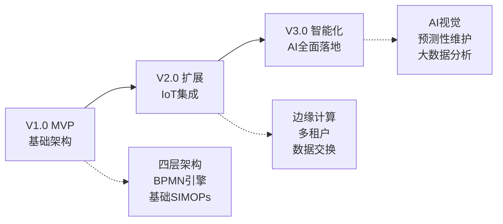
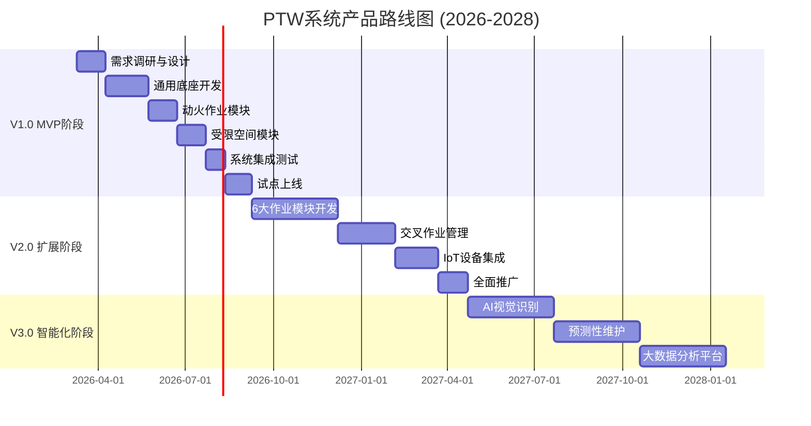

# 危险化学品企业特殊作业许可(PTW)管理系统 - 产品路线图

**文档版本**: v1.0
**最后更新**: 2026-03-10
**文档状态**: 已发布
**维护人**: 产品团队

---

## 1. 产品愿景与战略定位

### 1.1 产品愿景

**愿景(3-5年)**:
成为危险化学品行业特殊作业安全管理的**数字化标准制定者**,通过AI智能体、边缘计算和工业互联网技术,构建覆盖全国1000+企业、50万+作业人员的安全管理生态,将特殊作业事故率降低80%以上。

**使命**:
用技术守护生命,让每一次特殊作业都在可控范围内安全完成。

### 1.2 市场定位

**目标市场**:
- **一级市场**: 危险化学品生产企业(石化、化工、煤化工)
- **二级市场**: 制药、新能源、精细化工企业
- **三级市场**: 工业园区安全监管平台

**竞争优势**:
1. **合规驱动**: 100%符合GB 30871-2022 + AQ 3064系列标准
2. **技术创新**: AI Agent智能体 + SIMOPs算法 + 边缘计算
3. **"1+8"架构**: 通用底座 + 8大作业模块,数据共享,一次录入多处调用
4. **工业互联网对齐**: 符合AQ 3064.1标准,无缝对接园区平台
5. **全生命周期管理**: 从风险识别到完工验收的闭环管理

### 1.3 技术战略

**核心技术栈**:
- **四层解耦架构**: 表现层 / 业务能力层 / 领域核心层 / 基础设施层
- **AI Agent智能体引擎**: 规程合规审计 / 时空一致性 / 数据交换
- **边缘计算**: 低延迟定位验证(≤1s) + 离线作业支持
- **多租户SaaS**: 租户级知识库隔离 + 弹性扩展

**技术演进路径**:

---

## 2. 版本规划总览

### 2.1 时间轴甘特图

### 2.2 版本里程碑

| 版本 | 时间周期 | 核心目标 | 关键交付物 | 成功标准 |
|------|---------|---------|-----------|---------|
| **V1.0 MVP** | 6个月 (2026.03-2026.09) | 核心作业验证 | 动火+受限空间模块 移动端+Web管理端 基础SIMOPs | 10家试点企业 5000+作业票 客户满意度≥4.5 |
| **V2.0 扩展** | 12个月 (2026.09-2027.04) | 8大作业全覆盖 | 6大作业模块 IoT设备集成 数据大屏 | 50家企业 50000+作业票 冲突检测准确率≥95% |
| **V3.0 智能化** | 18个月 (2027.04-2028.01) | AI能力全面落地 | AI视觉识别 预测性维护 大数据分析 | 200家企业 年营收≥5000万 NPS≥50 |

---

## 3. MVP阶段(V1.0)详细规划

### 3.1 核心功能范围

**✅ 在范围内**:
- **通用底座**:
  - 基础信息管理(组织架构/区域划分/设备台账)
  - 人员资质管理(证书/培训/健康档案)
  - JSA风险库(标准风险库+企业自定义)
  - 审批引擎(BPMN 2.0工作流)
  - 电子签名(CA认证)

- **动火作业模块**:
  - 作业分级(特级/一级/二级)
  - 风险辨识(JSA)
  - 动态审批流
  - 气体分析记录
  - 现场监护
  - 完工验收

- **受限空间作业模块**:
  - 作业申请
  - 隔离能源
  - 清洗置换
  - 气体检测(持续监测)
  - 人员定位
  - 应急响应

- **基础SIMOPs**:
  - 空间冲突检测(地理围栏)
  - 时间冲突检测
  - 自动预警

- **移动端**:
  - 微信小程序/原生App
  - 作业申请
  - 审批签字
  - 现场拍照
  - 离线缓存

- **Web管理端**:
  - 作业台账
  - 审批管理
  - 统计报表
  - 系统配置

**❌ 不在范围内**:
- 其他6大作业模块(盲板抽堵/高处/吊装/临时用电/动土/断路)
- IoT设备集成(气体检测仪/视频监控/定位设备)
- AI视觉识别
- 高级数据分析
- 园区数据上报

### 3.2 技术架构(MVP)

**架构重点**:
- 四层解耦架构基础搭建
- BPMN 2.0流程引擎集成
- 基础规则引擎(Drools)
- PostGIS地理围栏
- Redis缓存 + MySQL主库

**性能目标**:
- 接口响应时间(P95): ≤200ms
- 并发用户数: ≥1000
- 系统可用性: ≥99%

### 3.3 商业目标(MVP)

| 指标类别 | 指标名称 | 目标值 |
|---------|---------|--------|
| **用户规模** | 试点企业数 | 10家 |
| **用户规模** | 活跃用户数 | 500人 |
| **业务量** | 作业票处理量 | 5000张 |
| **用户满意** | 客户满意度 | ≥4.5/5 |
| **用户满意** | NPS净推荐值 | ≥40 |
| **续约** | 续约意向率 | ≥80% |

---

## 4. 扩展阶段(V2.0)详细规划

### 4.1 核心功能扩展

**新增功能**:
- **6大作业模块**:
  - 盲板抽堵作业(盲板台账/抽堵记录/防遗留检查)
  - 高处作业(作业分级I-IV级/安全带检查/天气预警)
  - 吊装作业(吊装方案/机具检验/试吊要求)
  - 临时用电作业(电工资质/线路检查/漏电保护)
  - 动土作业(地下管线探测/安全距离/回填验收)
  - 断路作业(交通组织/警示标识/应急通道)

- **完整SIMOPs管理**:
  - 逻辑冲突检测(作业类型互斥规则)
  - 协调方案制定
  - 协调会议管理
  - 监护人调配
  - 地图可视化(冲突高亮)

- **IoT设备集成**:
  - 气体检测仪接入(MQTT/蓝牙)
  - 视频监控接入(RTSP/ONVIF)
  - 人员定位设备(UWB/蓝牙/惯导融合)
  - 环境传感器(温湿度/气压)
  - 边缘网关(协议适配+边缘计算)

- **数据大屏**:
  - 实时作业监控
  - SIMOPs冲突地图
  - 统计分析看板
  - 告警中心

- **移动端优化**:
  - 离线模式增强
  - 语音输入
  - 智能推荐(监护人/安全措施)

### 4.2 技术架构演进(V2.0)

**新增技术能力**:
- **边缘计算**:
  - 边缘网关部署
  - 本地推理(时空验证)
  - 离线缓存同步

- **多租户架构**:
  - TenantContext透传
  - PostgreSQL RLS行级安全
  - 知识库租户隔离(Milvus partition)

- **数据交换网关**:
  - AQ 3064.1格式封装
  - CGCS 2000坐标转换
  - 园区平台推送

- **AI Agent引擎(初步)**:
  - 规程合规审计智能体(RAG)
  - 时空一致性智能体(围栏判断)
  - 数据交换智能体(格式转换)

**性能目标**:
- 接口响应时间(P95): ≤200ms
- 并发用户数: ≥5000
- 系统可用性: ≥99.5%
- IoT消息延迟: ≤5s

### 4.3 商业目标(V2.0)

| 指标类别 | 指标名称 | 目标值 |
|---------|---------|--------|
| **用户规模** | 服务企业数 | 50家 |
| **用户规模** | 活跃用户数 | 5000人 |
| **业务量** | 作业票处理量 | 50000张 |
| **营收** | 年营收 | ≥2000万元 |
| **用户满意** | 客户满意度 | ≥4.5/5 |
| **用户满意** | NPS净推荐值 | ≥50 |
| **续约** | 续约率 | ≥80% |

---

## 5. 智能化阶段(V3.0)详细规划

### 5.1 AI能力全面落地

**智能化功能**:
- **AI视觉识别**:
  - 违章行为检测(未佩戴安全帽/未穿防护服/吸烟)
  - PPE佩戴检测(安全帽/安全带/防护眼镜/防毒面具)
  - 烟火识别(明火/烟雾)
  - 监护人脱岗告警
  - 边缘部署(YOLO模型优化)

- **预测性维护**:
  - 设备故障预测(基于历史数据)
  - 风险预警(基于作业频率/违章记录)
  - 异常检测(气体浓度/温度/压力)
  - 时间序列预测模型

- **大数据分析平台**:
  - 数据仓库(ETL流程)
  - 多维分析(作业类型/时间/区域/人员)
  - 趋势预测(事故率/违章率)
  - 智能推荐(安全措施/监护人/作业时间)
  - 跨企业对标分析

- **知识图谱**:
  - 风险关联分析
  - 案例推荐
  - 专家知识库

### 5.2 技术架构演进(V3.0)

**新增技术能力**:
- **AI训练平台**:
  - 模型训练(GPU集群)
  - 数据标注平台
  - 模型版本管理
  - A/B测试

- **大数据平台**:
  - 数据湖(Hadoop/Spark)
  - 实时计算(Flink)
  - BI报表(Superset)

- **知识图谱**:
  - Neo4j图数据库
  - 关系抽取
  - 推理引擎

**性能目标**:
- 接口响应时间(P95): ≤200ms
- 并发用户数: ≥10000
- 系统可用性: ≥99.9%
- AI推理延迟: ≤3s
- 视频识别帧率: ≥10fps

### 5.3 商业目标(V3.0)

| 指标类别 | 指标名称 | 目标值 |
|---------|---------|--------|
| **用户规模** | 服务企业数 | 200家 |
| **用户规模** | 活跃用户数 | 20000人 |
| **业务量** | 作业票处理量 | 200000张 |
| **营收** | 年营收 | ≥5000万元 |
| **用户满意** | 客户满意度 | ≥4.5/5 |
| **用户满意** | NPS净推荐值 | ≥60 |
| **续约** | 续约率 | ≥85% |
| **市场地位** | 市场占有率 | Top 3 |

---

