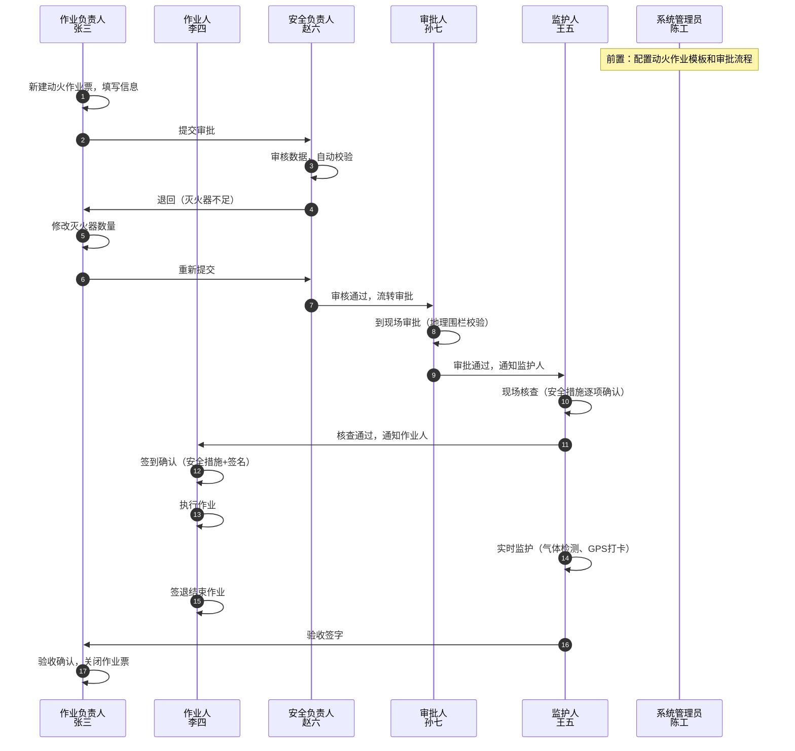

# 01 - Demo 概述与范围

> **文档版本**: v2.0 | **创建日期**: 2026-03-11
> **旧版存档**: `demo/Vue3-MVP-Demo设计方案_v1.0_archived_20260311.md`
> **关联PRD**: [`产出/PRD章节/01-产品概述.md`](../../产出/PRD章节/01-产品概述.md)

---

## 1. 项目背景

基于作业票系统完整 PRD（"1+8"架构的智能化作业安全管理平台），设计一个 Vue 3 的 MVP Demo，用于与设计师和程序员沟通产品需求。Demo 将展示核心用户流程和关键功能，使用 Mock 数据，不需要真实后端。

**与 v1.0 的关键变化**：
- 角色从 3 个扩展到 **6 个**（覆盖作业票全生命周期所有参与者）
- **统一 UI + 权限驱动**：所有角色共享同一套界面，通过元数据控制字段可见性和可编辑性（DOB NOW 理念）
- 新增**权限矩阵**驱动的元数据表单控制（角色 × 状态 × 字段三维矩阵）
- 新增 **PC 端**响应式适配（安全负责人效率模式、系统管理员后台）
- 状态机从简单5态升级为包含 Verify、Emergency 的**完整状态机**
- **动作块模式**：页面底部操作区根据角色 + 状态动态渲染可用操作

## 2. 核心目标

1. **可视化展示**：通过可交互的原型展示系统核心功能
2. **用户流程验证**：验证 6 个角色的完整操作流程
3. **沟通工具**：作为与设计师、程序员沟通的可视化工具
4. **快速迭代**：支持快速调整和演示
5. **权限验证**：验证元数据驱动的角色×状态权限控制模型

## 3. Demo 范围界定

### 3.1 包含功能（In-Scope）

**6 个角色完整流程**：

| # | 角色 | 核心流程 | 终端 |
|---|------|---------|------|
| 1 | 作业负责人 | 创建票据 → 填写信息 → 提交审批 → 查看进度 → 验收签字 | 手机/PC |
| 2 | 作业人 | 查看作业 → 确认措施 → 签到 → 执行作业 → 签退 | 手机 |
| 3 | 监护人 | 现场核查 → 实时监护 → 气体检测 → 紧急叫停 → 验收签字 | 手机 |
| 4 | 安全负责人 | 批量审核 → 数据校验 → 通过/退回 → 数据看板 | PC/手机 |
| 5 | 审批人 | 现场审批/远程审批 → 紧急审批 → 统计看板 | 手机/PC |
| 6 | 系统管理员 | 模板配置 → 工作流设计 → 权限管理 → 数据分析 → 审计日志 | PC |

**关键功能**：
- ✅ 动火作业完整流程（8大作业类型中选动火作为主演示）
- ✅ 元数据驱动表单（Schema/Layout/Instance 三层分离）
- ✅ 角色×状态权限矩阵控制
- ✅ 电子签名、照片上传、气体检测录入
- ✅ 紧急叫停与紧急审批绿色通道
- ✅ 分级审批机制（现场审批 vs 远程审批）
- ✅ **作业表依赖引擎**（前置依赖检查、SIMOPS冲突检测、条件性依赖评估、执行顺序计算）
- ✅ **依赖关系可视化**（Mermaid依赖图、执行顺序甘特图）
- ✅ 拖拽式模板配置器（系统管理员）
- ✅ 可视化工作流状态机设计器（系统管理员）
- ✅ 角色快速切换（6角色下拉菜单，无需重新登录）

### 3.2 不包含功能（Out-of-Scope）

- ❌ 真实后端 API 调用（全部使用 Mock 数据）
- ❌ 数据库持久化
- ❌ 完整的 8 大作业类型流程（仅动火作业完整，其他类型仅展示选择入口）
- ❌ IoT 设备真实集成（气体检测用模拟数据）
- ❌ 真实地理围栏（GPS 定位用模拟数据，SIMOPS冲突检测使用简化算法）
- ❌ 真实推送通知（用 Toast/弹窗模拟）
- ❌ 数据持久化保存（刷新后恢复初始 Mock 数据）

### 3.3 Demo 简化策略

| 完整产品功能 | Demo 简化方式 |
|-------------|-------------|
| 8大作业类型 | 仅动火作业完整流程，其他类型在选择页展示图标 |
| GPS地理围栏 | 模拟定位数据，可手动切换"在场/不在场" |
| IoT气体检测 | 手动录入 + 模拟自动采集按钮 |
| 推送通知 | Toast 提示 + 消息列表页 |
| 数据看板 | 静态 Mock 数据，不实时统计 |
| 模板配置器 | 展示拖拽交互，不实现真实保存到后端 |
| 工作流设计器 | 展示可视化编辑，不实现真实发布 |
| **依赖引擎** | **前端算法完整实现（DAG、拓扑排序），SIMOPS冲突检测简化（直线距离代替真实地理围栏）** |
| **依赖可视化** | **Mermaid图完整实现，SIMOPS地图用列表展示** |

## 4. 与完整 PRD 的引用关系

| Demo 章节 | 对应 PRD 章节 |
|----------|-------------|
| 01-Demo概述与范围 | [`01-产品概述.md`](../../产出/PRD章节/01-产品概述.md) |
| 02-角色体系与权限矩阵 | [`09-用户体验设计.md`](../../产出/PRD章节/09-用户体验设计.md) |
| 03-统一界面设计 | [`05-通用底座功能需求.md`](../../产出/PRD章节/05-通用底座功能需求.md) / [`06-8大作业票模块需求.md`](../../产出/PRD章节/06-8大作业票模块需求.md) / [`DOB NOW 集成设计`](../../docs/architecture/dob-now-integration.md) |
| 04-角色权限视图差异 | [`09-用户体验设计.md`](../../产出/PRD章节/09-用户体验设计.md) |
| 05-完整演示流程 | 综合各章节 |
| 06-技术架构与Mock数据 | [`04-系统架构设计.md`](../../产出/PRD章节/04-系统架构设计.md) / [`10-技术实现建议.md`](../../产出/PRD章节/10-技术实现建议.md) |
| 07-UI设计规范 | [`09-用户体验设计.md`](../../产出/PRD章节/09-用户体验设计.md) |
| 08-实施计划与验收标准 | [`11-项目实施计划.md`](../../产出/PRD章节/11-项目实施计划.md) |

## 5. Demo 演示场景

**一个完整的动火作业从申请到关闭的 6 角色协作场景**：

## 6. 文档结构

本 Demo PRD 采用**按页面/流程维度**组织（而非按角色拆分），体现"统一 UI + 权限驱动"的设计理念：

| 序号 | 文件 | 内容 |
|------|------|------|
| 01 | 本文件 | Demo 概述、范围、演示场景 |
| 02 | [02-角色体系与权限矩阵.md](./02-角色体系与权限矩阵.md) | 6角色总览、状态流转、权限矩阵 |
| 03 | [03-统一界面设计.md](./03-统一界面设计.md) | 统一 UI 页面设计（首页、详情页、管理后台） |
| 04 | [04-角色权限视图差异.md](./04-角色权限视图差异.md) | 字段级/操作级/页面级三层权限矩阵 |
| 05 | [05-完整演示流程.md](./05-完整演示流程.md) | 6角色协作演示脚本（统一UI视角） |
| 06 | [06-技术架构与Mock数据.md](./06-技术架构与Mock数据.md) | 技术栈、项目结构、Mock数据 |
| 07 | [07-UI设计规范.md](./07-UI设计规范.md) | 颜色、字体、组件库规范 |
| 08 | [08-实施计划与验收标准.md](./08-实施计划与验收标准.md) | 开发阶段、验收标准、风险 |
| — | [`页面/`](./页面/) 目录（10 个文件） | 每个页面的独立详细设计（线框图、角色差异、状态驱动 UI、Mock 接口） |
| — | [`组件/`](./组件/) 目录（14 个文件） | 每个组件的独立详细设计（Props/Events、视觉规格、交互行为、使用场景） |

> 旧版按角色拆分的文件（03~08）已归档至 `archived/` 子目录。
