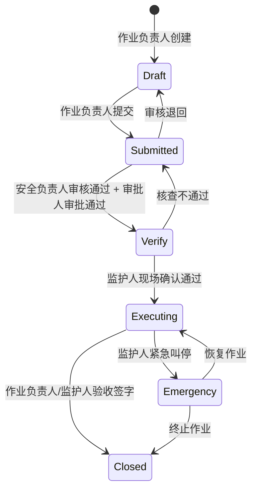

# 02 - 角色体系与权限矩阵

> **设计理念**: 本文档定义的角色和权限矩阵是统一 UI 的权限控制层。所有角色共享同一套界面，权限矩阵决定每个角色在每个状态下看到什么、能操作什么。
> **关联PRD**: [`09-用户体验设计.md`](../../产出/PRD章节/09-用户体验设计.md)
> **数据来源**: [`角色视角/00-总览与权限矩阵.md`](../../分析内容/八大作业人员与工作流程/角色视角/00-总览与权限矩阵.md)
> **界面设计**: [03-统一界面设计.md](./03-统一界面设计.md) / **权限详情**: [04-角色权限视图差异.md](./04-角色权限视图差异.md)

---

## 1. 六类角色总览

| # | 角色 | 一句话定位 | 核心动作 | 典型终端 |
|---|------|----------|---------|---------|
| 1 | **作业负责人（申请人）** | 票据发起者与全程协调者 | 创建票据、填写信息、提交审批 | 手机/PC |
| 2 | **作业人** | 持证上岗的一线执行者 | 确认措施、签到签退、执行作业 | 手机/PDA |
| 3 | **监护人** | 全程在场的安全守门人 | 现场核查、实时监护、紧急叫停 | 手机（常驻） |
| 4 | **安全负责人（审核人）** | 数据驱动的风险把关者 | 审核数据、验证合规、初审签字 | PC/手机 |
| 5 | **审批人（终审人）** | 到场确认的最终决策者 | 现场审批、终审签字、风险决策 | 手机（现场） |
| 6 | **系统管理员** | 平台配置与运维管理者 | 模板配置、流程设计、数据分析 | PC（后台） |

### Demo 中的角色人设

| 角色 | 姓名 | 职位 | 使用终端 | 演示重点 |
|------|------|------|---------|---------|
| 作业负责人 | 张三 | 施工班组长 | 手机 | 创建动火作业票完整流程 |
| 作业人 | 李四 | 电焊工 | 手机 | 签到确认 → 执行 → 签退 |
| 监护人 | 王五 | 专职监护人 | 手机 | 现场核查 → 实时监护 → 紧急叫停 |
| 安全负责人 | 赵六 | 安全科专员 | PC + 手机 | 批量审核 → 数据校验 → 退回/通过 |
| 审批人 | 孙七 | 车间主任 | 手机 + PC | 现场审批 → 远程审批 → 紧急审批 |
| 系统管理员 | 陈工 | 信息科工程师 | PC | 模板配置 → 工作流设计 → 权限管理 |

## 2. 作业票状态流转



**状态说明**：

| 状态 | 英文 | 颜色 | 说明 |
|------|------|------|------|
| 草稿 | Draft | ⚪ 灰色 | 作业负责人创建，可编辑 |
| 已提交 | Submitted | 🟡 黄色 | 等待安全审核 + 领导审批 |
| 核查中 | Verify | 🔵 蓝色 | 审批通过，监护人现场核查 |
| 执行中 | Executing | 🟢 绿色 | 核查通过，作业进行中 |
| 已关闭 | Closed | ⚫ 深灰 | 作业完成，验收签字 |
| 紧急中断 | Emergency | 🔴 红色 | 监护人叫停，等待处理 |
| 已退回 | (Draft) | 🔴 红色 | 审核/核查退回，需修改 |

## 3. 角色×状态权限矩阵

| 角色 | Draft | Submitted | Verify | Executing | Closed |
|------|-------|-----------|--------|-----------|--------|
| **作业负责人** | ✅ 创建/编辑 | ✅ 查看/撤回 | ✅ 查看/补充 | ✅ 查看 | ✅ 查看/验收 |
| **作业人** | ❌ 不可见 | ✅ 查看 | ✅ 确认措施 | ✅ 签到/签退 | ✅ 查看 |
| **监护人** | ❌ 不可见 | ✅ 查看 | ✅ 现场核查 | ✅ 实时监护/叫停 | ✅ 查看/验收 |
| **安全负责人** | ❌ 不可见 | ✅ 审核 | ✅ 数据验证 | ✅ 查看 | ✅ 查看 |
| **审批人** | ❌ 不可见 | ✅ 审批 | ✅ 现场审批 | ✅ 查看 | ✅ 查看 |
| **系统管理员** | ✅ 全部 | ✅ 全部 | ✅ 全部 | ✅ 全部 | ✅ 全部 |

## 4. 角色×数据字段权限矩阵

| 数据类型 | 作业负责人 | 作业人 | 监护人 | 安全负责人 | 审批人 | 系统管理员 |
|---------|----------|-------|-------|-----------|-------|----------|
| **基础信息** | 读写 | 只读 | 只读 | 只读 | 只读 | 读写 |
| **人员信息** | 读写 | 只读 | 只读 | 只读 | 只读 | 读写 |
| **安全措施清单** | 读写 | 确认（勾选） | 核查（勾选+拍照） | 审核（通过/退回） | 只读 | 读写 |
| **JSA风险分析** | 读写 | 只读 | 只读 | 审核 | 只读 | 读写 |
| **气体检测记录** | 只读 | 只读 | 录入 | 审核 | 只读 | 读写 |
| **现场照片** | 上传 | 查看 | 上传 | 查看 | 查看 | 读写 |
| **审批意见** | 只读 | 只读 | 只读 | 录入 | 录入 | 读写 |
| **监护日志** | 只读 | 只读 | 自动录入 | 只读 | 只读 | 读写 |
| **电子签名** | 本人签 | 本人签 | 本人签 | 本人签 | 本人签 | 查看 |

## 5. 角色切换机制（Demo 专用）

**设计思路**：
- 首页右上角显示当前角色（头像 + 姓名 + 角色标签）
- 点击头像弹出下拉菜单，列出 6 个角色
- 点击即可切换，自动刷新进入对应角色首页
- 切换无需返回登录页

```
┌─────────────────────────────────────┐
│ 作业票系统    [🔔3]  [👷 张三 ▼]   │
└─────────────────────────────────────┘
                        ↓
                ┌─────────────────────┐
                │ 当前: 张三           │
                │ 作业负责人           │
                ├─────────────────────┤
                │ 切换角色:            │
                │ → 李四（作业人）     │
                │ → 王五（监护人）     │
                │ → 赵六（安全负责人） │
                │ → 孙七（审批人）     │
                │ → 陈工（系统管理员） │
                ├─────────────────────┤
                │ 退出登录             │
                └─────────────────────┘
```

**切换后的状态变化**：

| 切换到 | 首页内容 | 终端适配 |
|--------|---------|---------|
| 张三（作业负责人） | 我的作业票列表 + 新建入口 | 手机 |
| 李四（作业人） | 今日待办 + 签到入口 | 手机 |
| 王五（监护人） | 当前监护任务 + 紧急叫停 | 手机 |
| 赵六（安全负责人） | 审核工作台 + 待办统计 | PC |
| 孙七（审批人） | 审批中心 + 待办统计 | 手机 |
| 陈工（系统管理员） | 系统概览仪表盘 | PC |

## 6. 八大作业差异化配置（参考）

Demo 仅展示动火作业完整流程，但角色体系适用于全部 8 种作业类型：

| 作业类型 | 特殊角色要求 | 额外人员 | 持证要求 |
|---------|------------|---------|---------|
| **动火** | 监护人需持动火监护证 | 分析人员（气体检测） | 动火人+监护人均需持证 |
| **受限空间** | 监护人禁止进入受限空间 | 应急救援人员（≥2人） | 作业人+监护人+救援人员均需持证 |
| **高处** | 监护人需在地面监护 | — | 作业人需持高处作业证 |
| **吊装** | 需指挥人员（持证） | 起重机操作员+挂钩工 | 司机+指挥+挂钩工均需持证 |
| **临时用电** | 电工必须持证 | — | 电工需持有效电工证 |
| **动土** | 需通知相关管线部门 | 管线探测人员 | — |
| **断路** | 需交通引导人员 | 交通管理部门审批 | — |
| **盲板抽堵** | 需记录盲板编号台账 | — | — |

## 7. 元数据权限控制模型（技术参考）

角色权限通过元数据 JSON 定义，在渲染引擎层面控制字段的可见性和可编辑性：

```json
{
  "field_key": "gas_detection_records",
  "permissions": {
    "applicant":  { "visible": true,  "editable": false },
    "worker":     { "visible": true,  "editable": false },
    "supervisor": { "visible": true,  "editable": true  },
    "reviewer":   { "visible": true,  "editable": false, "can_approve": true },
    "approver":   { "visible": true,  "editable": false },
    "admin":      { "visible": true,  "editable": true  }
  },
  "state_override": {
    "Draft":     { "supervisor": { "visible": false } },
    "Verify":    { "supervisor": { "editable": true } },
    "Executing": { "supervisor": { "editable": true } },
    "Closed":    { "ALL": { "editable": false } }
  }
}
```

**核心设计原则**：
- **角色 × 状态 = 实际权限**：字段的最终权限由角色基础权限和当前状态叠加决定
- **状态覆盖优先**：`state_override` 中的配置优先于 `permissions` 中的基础配置
- **Closed 状态一刀切**：所有角色在 Closed 状态下均为只读
