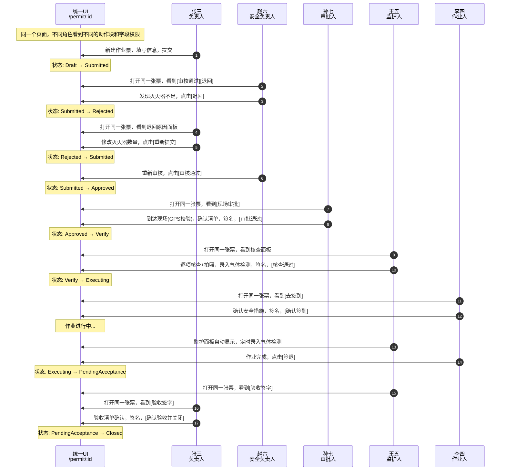

# 05 - 完整演示流程

> **视角**: 从统一 UI 出发，描述一张动火作业票从创建到关闭的 6 角色协作全流程。
> **关键**: 所有角色操作的是同一个页面（`/permit/:id`），区别仅在于权限和动作块。

---

## 1. 演示场景

一张一级动火作业票（1号储罐区焊接修复）的完整生命周期，涉及 6 个角色在统一 UI 上的协作。

**预置人员**:

| 角色 | 姓名 | 工号 |
| ---- | ---- | ---- |
| 作业负责人 | 张三 | 001234 |
| 作业人 | 李四 | 001235 |
| 监护人 | 王五 | 002345 |
| 安全负责人 | 赵六 | 003456 |
| 审批人 | 孙七 | 004567 |
| 系统管理员 | 陈工 | 005678 |

---

## 2. 全流程时序图

---

## 3. 分步演示脚本

### Step 1: 负责人创建作业票

- 角色切换到: **张三（负责人）**
- 页面: 首页 → 点击 [+ 新建作业票]
- 操作: 选择动火 → 填写基础信息 → 选择人员 → 确认安全措施 → [提交审批]
- 演示重点: 分步表单、证书自动校验（李四⚠️即将过期）、照片拍摄水印

### Step 2: 安全负责人审核（退回）

- 角色切换到: **赵六（安全负责人）**
- 页面: 首页待办 → 点击作业票卡片 → 进入详情页
- 看到的差异: 自动校验报告（🔴灭火器不足）、审核操作面板
- 操作: 填写审核意见 → 勾选退回标注字段 → [退回修改]
- 演示重点: PC端左右分栏、异常自动标红、精确退回标注

### Step 3: 负责人修改重新提交

- 角色切换到: **张三（负责人）**
- 页面: 首页待办（🔴已退回）→ 进入详情页
- 看到的差异: 退回原因面板、[修改并重新提交] 按钮
- 操作: 点击 [修改并重新提交] → 自动跳转到灭火器数量字段 → 修改为4具 → [重新提交]
- 演示重点: 退回原因精确定位、字段自动聚焦

### Step 4: 安全负责人审核（通过）

- 角色切换到: **赵六（安全负责人）**
- 操作: 自动校验全部通过 → [审核通过]
- 演示重点: 快速通过（无异常时一键操作）

### Step 5: 审批人现场审批

- 角色切换到: **孙七（审批人）**
- 页面: 首页待办 → 进入详情页
- 看到的差异: 风险摘要卡片置顶、[现场审批] 按钮、地理围栏提示
- 操作: 模拟到达现场(GPS校验通过) → 逐项确认 → 语音输入意见 → 签名 → [审批通过]
- 演示重点: 风险前置、地理围栏、语音输入、按序确认

### Step 6: 监护人现场核查

- 角色切换到: **王五（监护人）**
- 页面: 首页待办 → 进入详情页
- 看到的差异: 核查面板（安全措施逐项+拍照、气体检测录入）
- 操作: GPS定位校验 → 安全措施逐项核查+拍照 → 气体检测录入 → 签名 → [核查通过]
- 演示重点: 逐项拍照确认、气体检测数值校验（超标自动报警）

### Step 7: 作业人签到执行

- 角色切换到: **李四（作业人）**
- 页面: 首页待办 → 进入详情页
- 看到的差异: 极简模式（大字大按钮）、[去签到] 按钮
- 操作: 逐项确认安全措施 → 横屏签名 → [确认签到]
- 演示重点: 大字大按钮、引导式操作、横屏签名

### Step 8: 监护人实时监护

- 角色切换到: **王五（监护人）**
- 页面: 详情页自动显示监护面板
- 看到的差异: 作业进度条、人员状态、气体检测倒计时、🔴紧急叫停按钮
- 操作: 演示气体检测定时弹窗 → 录入数据 → GPS自动打卡
- 演示重点: 常驻叫停按钮、定时提醒、低功耗设计

### Step 9: 作业人签退 + 验收关闭

- 角色切换到: **李四（作业人）** → [签退]
- 角色切换到: **王五（监护人）** → 验收签字
- 角色切换到: **张三（负责人）** → 验收清单确认 → 签名 → [确认验收并关闭]
- 演示重点: 多角色协作验收、作业票最终关闭

---

## 4. 紧急叫停演示（可选分支）

在 Step 8 监护阶段，可演示紧急叫停流程：

1. 监护人长按 🔴 紧急叫停按钮（2秒）
2. 弹出叫停确认：选择原因 + 拍照
3. 系统自动通知所有相关人员
4. 作业票状态锁定为 Emergency
5. 切换到其他角色查看：所有人看到紧急中断状态，所有操作被锁定

---

## 5. 通知与消息汇总

| 步骤 | 触发事件 | 通知对象 | 通知方式 |
| ---- | ---- | ---- | ---- |
| 1 | 提交审批 | 安全负责人 | 推送 |
| 2 | 退回修改 | 负责人 | 推送 + 短信 |
| 3 | 重新提交 | 安全负责人 | 推送 |
| 4 | 审核通过 | 审批人 | 推送 |
| 5 | 审批通过 | 监护人、负责人 | 推送 + 短信 |
| 6 | 核查通过 | 作业人 | 推送 |
| 7 | 签到成功 | 监护人 | 推送 |
| 8 | 气体检测到期 | 监护人 | 弹窗 + 震动 |
| 9 | 验收关闭 | 所有相关人 | 推送 |
| 可选 | 紧急叫停 | 所有相关人 | 推送 + 短信 + 电话 |
