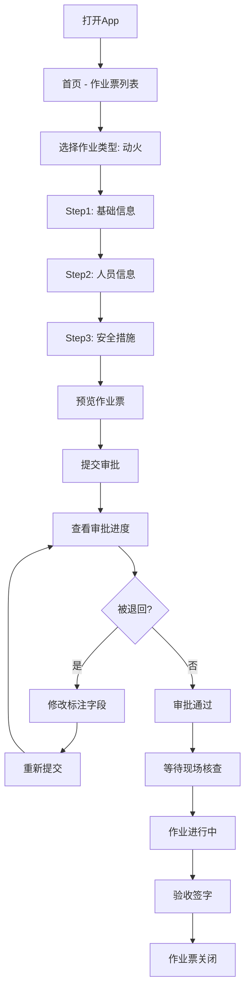

# 03 - 作业负责人（申请人）

> **PRD 章节** | Vue3 MVP Demo
> **角色视角资料**: [01-作业负责人.md](../../分析内容/八大作业人员与工作流程/角色视角/01-作业负责人.md)

---

## 1. 角色画像

### 1.1 角色定位

票据发起者与全程协调者。负责从作业票创建、人员组织、安全措施确认到最终验收的全流程管理。

### 1.2 典型用户

- 施工班组长
- 项目负责人
- 维修主管

### 1.3 主要终端

手机 + PC（手机为主，PC 用于复杂表单填写）

### 1.4 职责清单

| 序号 | 职责 | 说明 |
|------|------|------|
| 1 | 办理作业票 | 填写基础信息，选择作业类型 |
| 2 | 选择人员确认资质 | 指定作业人员、监护人，系统自动校验证书有效期 |
| 3 | 现场核实安全措施 | 确认安全措施落实情况 |
| 4 | 技术交底 | 对作业人员进行安全技术交底 |
| 5 | 全程协调 | 作业期间处理异常情况 |
| 6 | 组织验收 | 作业完成后组织验收签字 |

### 1.5 使用场景

| 场景 | 频率 | 终端 | 时长 |
|------|------|------|------|
| 新建作业票 | 每天 1-5 次 | PC / 手机 | 10-20 分钟 |
| 查看审批进度 | 每天多次 | 手机 | 1-2 分钟 |
| 补充材料（被退回） | 偶尔 | PC / 手机 | 5-10 分钟 |
| 查看作业状态 | 作业期间 | 手机 | 1 分钟 |
| 验收签字 | 每票 1 次 | 手机（现场） | 3-5 分钟 |

### 1.6 痛点与诉求

| 痛点 | 诉求 | MVP 方案 |
|------|------|----------|
| 填表耗时长 | 快速填写 | 模板预填 + 历史复用 |
| 人员资质查不到 | 自动校验 | 证书有效期自动校验（绿/黄/红三色） |
| 审批进度不透明 | 实时掌握 | 推送通知 + 进度时间轴 |
| 被退回不知改哪 | 精确定位 | 退回原因标注 + 字段高亮跳转 |

---

## 2. 界面设计（8 个核心页面）

### 2.1 首页 - 作业票列表

```
┌─────────────────────────────────────────┐
│  我的作业票                    [+ 新建]  │
├─────────────────────────────────────────┤
│  [全部] [草稿] [审批中] [进行中] [已完成]│
├─────────────────────────────────────────┤
│  ┌───────────────────────────────────┐  │
│  │ 🔥 动火作业 - 储罐区焊接          │  │
│  │ HW-2026-0311-001                  │  │
│  │ 🟡 待审批 · 1号储罐区             │  │
│  │ 2026-03-11 08:00 ~ 17:00          │  │
│  └───────────────────────────────────┘  │
│  ┌───────────────────────────────────┐  │
│  │ 🏗️ 高处作业 - 塔器检修            │  │
│  │ HA-2026-0310-005                  │  │
│  │ 🟢 作业中 · T-101塔顶             │  │
│  │ 2026-03-10 09:00 ~ 18:00          │  │
│  └───────────────────────────────────┘  │
│  ┌───────────────────────────────────┐  │
│  │ ⚡ 临时用电 - 2号车间              │  │
│  │ TE-2026-0309-003                  │  │
│  │ ⚪ 草稿 · 2号车间配电室            │  │
│  │ 未提交                             │  │
│  └───────────────────────────────────┘  │
└─────────────────────────────────────────┘
```

**状态颜色**:

| 状态 | 颜色 | 图标 |
|------|------|------|
| 草稿 | 灰色 | ⚪ |
| 审批中 | 黄色 | 🟡 |
| 核查中 | 蓝色 | 🔵 |
| 作业中 | 绿色 | 🟢 |
| 已关闭 | 深灰 | ⚫ |
| 已退回 | 红色 | 🔴 |

**交互说明**:
- 点击卡片 → 进入详情页
- 左滑卡片 → 快捷操作（删除草稿 / 撤回 / 复制新建）
- 下拉刷新 → 更新列表状态
- 右上角 [+ 新建] → 进入选择类型页

### 2.2 新建作业票 - Step 1: 选择类型

```
┌─────────────────────────────────────────┐
│  ← 新建作业票                            │
├─────────────────────────────────────────┤
│                                          │
│  选择作业类型                            │
│                                          │
│  ┌─────────┐  ┌─────────┐  ┌─────────┐ │
│  │   🔥    │  │   🚧    │  │   🏗️    │ │
│  │  动火   │  │ 受限空间│  │  高处   │ │
│  └─────────┘  └─────────┘  └─────────┘ │
│  ┌─────────┐  ┌─────────┐  ┌─────────┐ │
│  │   🏗️    │  │   ⚡    │  │   🔌    │ │
│  │  吊装   │  │ 临时用电│  │  动土   │ │
│  └─────────┘  └─────────┘  └─────────┘ │
│  ┌─────────┐  ┌─────────┐              │
│  │   🚦    │  │   🔧    │              │
│  │  断路   │  │ 盲板抽堵│              │
│  └─────────┘  └─────────┘              │
│                                          │
│  ─── 或从历史复制 ───                    │
│  [最近使用的模板 ▼]                      │
│                                          │
└─────────────────────────────────────────┘
```

**交互说明**:
- 8 大作业类型以卡片网格展示，点击选中后进入 Step 2
- 底部"从历史复制"入口，展开最近 5 条已完成的作业票供快速复用

### 2.3 新建作业票 - Step 2: 基础信息（以动火为例）

```
┌─────────────────────────────────────────┐
│  ← 动火作业票                            │
│  ● 基础信息 → ○ 人员 → ○ 安全措施       │
├─────────────────────────────────────────┤
│                                          │
│  作业区域 *          [1号储罐区 ▼]       │
│                                          │
│  作业地点 *          [📍 地图标注]       │
│  ┌─────────────────────────────────────┐│
│  │         [地图组件]                  ││
│  │    📍 1号储罐东侧 (121.47, 31.23)  ││
│  └─────────────────────────────────────┘│
│                                          │
│  作业等级 *                              │
│  ┌──────┐ ┌──────┐ ┌──────┐            │
│  │ 特级 │ │● 一级│ │ 二级 │            │
│  └──────┘ └──────┘ └──────┘            │
│  ⓘ 一级: 易燃易爆场所动火,需安全科+     │
│     车间主任审批                         │
│                                          │
│  动火方式 *                              │
│  ☑ 电焊  ☐ 气焊  ☐ 气割  ☐ 其他       │
│                                          │
│  计划时间 *                              │
│  开始 [2026-03-11 08:00]                │
│  结束 [2026-03-11 17:00]                │
│  ⓘ 动火作业单次不超过8小时              │
│                                          │
│  作业内容 *                              │
│  ┌─────────────────────────────────────┐│
│  │储罐法兰焊接修复                     ││
│  └─────────────────────────────────────┘│
│                                          │
│  现场照片 * (至少3张,仅限拍照)          │
│  ┌────┐ ┌────┐ ┌────┐ ┌────┐          │
│  │ 📷 │ │ 📷 │ │ 📷 │ │ +  │          │
│  │全景 │ │特写 │ │环境 │ │    │          │
│  └────┘ └────┘ └────┘ └────┘          │
│  照片自动附带: 时间+GPS+操作人水印       │
│                                          │
│  [保存草稿]                [下一步 →]   │
└─────────────────────────────────────────┘
```

**校验规则**:
- 作业时间 ≤ 8 小时（动火作业限制）
- 作业时间不早于当前时间
- 现场照片 ≥ 3 张，强制 `camera_only`（禁止从相册选取）
- 选择"特级"时弹出提示："特级动火需厂级领导审批，审批流程将延长"

### 2.4 新建作业票 - Step 3: 人员信息

```
┌─────────────────────────────────────────┐
│  ← 动火作业票                            │
│  ✅ 基础信息 → ● 人员 → ○ 安全措施      │
├─────────────────────────────────────────┤
│                                          │
│  ┌─ 动火人员 * (需持证) ──────────────┐ │
│  │                                     │ │
│  │  👤 张三  工号001234               │ │
│  │  电焊工操作证 · 2026-12-31 ✅      │ │
│  │                                     │ │
│  │  👤 李四  工号001235               │ │
│  │  气焊工操作证 · 2025-06-30 ⚠️     │ │
│  │  ⚠️ 证书将于90天内过期             │ │
│  │                                     │ │
│  │  [+ 添加人员]                       │ │
│  └─────────────────────────────────────┘ │
│                                          │
│  ┌─ 监护人 * (需持证) ────────────────┐ │
│  │  👤 王五  工号002345               │ │
│  │  动火监护人证 · 2027-03-15 ✅      │ │
│  │  📱 138****5678                    │ │
│  │  [更换]                             │ │
│  └─────────────────────────────────────┘ │
│                                          │
│  ┌─ 审核/审批人 (自动关联) ───────────┐ │
│  │  安全负责人: 赵六 (安全科)          │ │
│  │  审批人: 孙七 (车间主任)            │ │
│  │  ⓘ 根据作业区域和等级自动匹配      │ │
│  └─────────────────────────────────────┘ │
│                                          │
│  [← 上一步]  [保存草稿]  [下一步 →]    │
└─────────────────────────────────────────┘
```

**证书校验逻辑**:

| 状态 | 条件 | 显示 | 行为 |
|------|------|------|------|
| ✅ 有效 | 有效期 > 90 天 | 绿色 | 正常通过 |
| ⚠️ 即将过期 | 有效期 ≤ 90 天 | 黄色警告 | 可继续，提示续证 |
| ❌ 已过期 | 已过期 | 红色 | 阻断提交 |

**约束**: 监护人不能同时是作业人（系统自动校验，冲突时弹出提示）

### 2.5 新建作业票 - Step 4: 安全措施

```
┌─────────────────────────────────────────┐
│  ← 动火作业票                            │
│  ✅ 基础信息 → ✅ 人员 → ● 安全措施     │
├─────────────────────────────────────────┤
│                                          │
│  ┌─ 安全措施确认 ─────────────────────┐ │
│  │ ☑ 办理动火作业票                    │ │
│  │ ☑ 进行JSA风险分析                   │ │
│  │ ☑ 清理动火现场可燃物                │ │
│  │ ☑ 配备灭火器材  数量: [2] 具       │ │
│  │ ☑ 设置安全警戒区域  半径: [10] m   │ │
│  │ ☐ 气体检测 (现场核查阶段由监护人填) │ │
│  │ ☑ 配备监护人(全程在岗)             │ │
│  │ ☑ 动火人持证上岗                    │ │
│  └─────────────────────────────────────┘ │
│                                          │
│  ┌─ JSA风险分析 * ────────────────────┐ │
│  │                                     │ │
│  │  🔴 高 | 可燃气体泄漏               │ │
│  │  措施: 气体检测、强制通风            │ │
│  │                                     │ │
│  │  🟡 中 | 火花引燃周边可燃物          │ │
│  │  措施: 清理可燃物、配备灭火器        │ │
│  │                                     │ │
│  │  [+ 添加风险点]                     │ │
│  └─────────────────────────────────────┘ │
│                                          │
│  ┌─ 应急预案 * ───────────────────────┐ │
│  │ 1. 发现火情立即停止作业             │ │
│  │ 2. 使用灭火器扑救                   │ │
│  │ 3. 拨打119报警                      │ │
│  │ 4. 疏散周边人员                     │ │
│  │ [使用标准模板] [自定义编辑]         │ │
│  └─────────────────────────────────────┘ │
│                                          │
│  [← 上一步]  [保存草稿]  [提交审批 →]  │
└─────────────────────────────────────────┘
```

**提交前自动校验**:
- ✅ 所有 `*` 必填项已填写
- ✅ 所有人员证书在有效期内
- ✅ 至少识别 1 个风险点
- ✅ 现场照片 ≥ 3 张
- ✅ 灭火器数量 ≥ 2
- 校验不通过 → 高亮缺失项，阻断提交

### 2.6 详情页 - 审批中状态

```
┌─────────────────────────────────────────┐
│  ← 动火作业票  HW-2026-0311-001        │
│  🟡 审批中                               │
├─────────────────────────────────────────┤
│  ┌─ 审批进度 ─────────────────────────┐ │
│  │ ✅ 提交  03-11 07:30               │ │
│  │ ⏳ 安全审核  赵六 · 待处理          │ │
│  │ ⚪ 领导审批  孙七                   │ │
│  │ ⚪ 现场核查                         │ │
│  │ ⚪ 开始作业                         │ │
│  └─────────────────────────────────────┘ │
│                                          │
│  ┌─ 基础信息 (折叠) ▼ ───────────────┐ │
│  │ 作业区域: 1号储罐区                 │ │
│  │ 作业等级: 一级                      │ │
│  │ 动火方式: 电焊                      │ │
│  │ 计划时间: 03-11 08:00 ~ 17:00      │ │
│  └─────────────────────────────────────┘ │
│                                          │
│  [撤回申请]  [催办]                     │
└─────────────────────────────────────────┘
```

**操作说明**:
- [撤回申请]: 审批未开始时可撤回，已开始审核则需审核人同意
- [催办]: 向当前待处理人发送催办通知（每 4 小时限 1 次）

### 2.7 详情页 - 被退回状态

```
┌─────────────────────────────────────────┐
│  ← 动火作业票  HW-2026-0311-001        │
│  🔴 已退回                               │
├─────────────────────────────────────────┤
│  ┌─ 退回原因 ─────────────────────────┐ │
│  │ 退回人: 赵六 (安全科)               │ │
│  │ 退回时间: 2026-03-11 08:15          │ │
│  │ 原因: 灭火器数量不足,一级动火需     │ │
│  │ 配备4具以上灭火器                   │ │
│  │                                     │ │
│  │ 🔴 需修改字段: 灭火器数量           │ │
│  └─────────────────────────────────────┘ │
│                                          │
│  [修改并重新提交]                        │
└─────────────────────────────────────────┘
```

**交互说明**:
- 点击 [修改并重新提交] → 直接跳转到被标注的字段（灭火器数量输入框自动聚焦）
- 修改完成后一键重新提交，无需重走全部步骤
- 退回历史记录保留，可查看多次退回原因

### 2.8 验收签字页

```
┌─────────────────────────────────────────┐
│  ← 动火作业票  HW-2026-0311-001        │
│  🟢 作业完成 · 待验收                    │
├─────────────────────────────────────────┤
│  ┌─ 验收清单 ─────────────────────────┐ │
│  │ ☐ 现场已清理,无火种遗留            │ │
│  │ ☐ 灭火器材已归还                    │ │
│  │ ☐ 警戒区域已撤除                    │ │
│  │ ☐ 作业人员已全部撤离                │ │
│  └─────────────────────────────────────┘ │
│                                          │
│  验收照片 * (至少2张)                   │
│  ┌────┐ ┌────┐ ┌────┐                  │
│  │ 📷 │ │ 📷 │ │ +  │                  │
│  └────┘ └────┘ └────┘                  │
│                                          │
│  ┌─ 电子签名 ─────────────────────────┐ │
│  │  [签名区域]                         │ │
│  └─────────────────────────────────────┘ │
│                                          │
│  [确认验收并关闭]                        │
└─────────────────────────────────────────┘
```

**操作说明**:
- 验收清单全部勾选 + 照片 ≥ 2 张 + 电子签名完成后，[确认验收并关闭] 按钮激活
- 验收完成后作业票状态变为"已关闭"，不可再修改

---

## 3. 完整用户流程



---

## 4. 通知与消息

| 事件 | 通知方式 | 内容示例 |
|------|---------|----------|
| 审核通过 | 推送 + 短信 | "您的动火作业票已通过安全审核，等待领导审批" |
| 审批通过 | 推送 + 短信 | "您的动火作业票已审批通过，请安排现场核查" |
| 被退回 | 推送 + 短信 | "您的动火作业票被退回，原因: xxx"（含退回原因摘要） |
| 作业即将到期 | 推送 | "动火作业票将于 1 小时后到期，请及时完工" |
| 监护人叫停 | 推送 + 短信 + 电话 | "紧急: 动火作业被叫停，请立即联系监护人" |

---

## 5. 元数据权限配置（技术参考）

```json
{
  "role": "applicant",
  "display_name": "作业负责人（申请人）",
  "state_permissions": {
    "Draft": {
      "basic_info": "readwrite",
      "personnel": "readwrite",
      "safety_measures": "readwrite",
      "jsa_analysis": "readwrite",
      "gas_detection": "hidden",
      "photos": "upload",
      "approval_comments": "hidden",
      "actions": ["save_draft", "submit", "delete"]
    },
    "Submitted": {
      "basic_info": "readonly",
      "personnel": "readonly",
      "safety_measures": "readonly",
      "approval_comments": "readonly",
      "actions": ["withdraw", "urge"]
    },
    "Rejected": {
      "basic_info": "readwrite",
      "personnel": "readwrite",
      "safety_measures": "readwrite",
      "jsa_analysis": "readwrite",
      "photos": "upload",
      "rejection_reason": "readonly",
      "actions": ["edit_and_resubmit"]
    },
    "Verify": {
      "basic_info": "readonly",
      "photos": "upload",
      "actions": ["supplement"]
    },
    "Executing": {
      "ALL": "readonly",
      "actions": ["view"]
    },
    "PendingAcceptance": {
      "acceptance_checklist": "readwrite",
      "acceptance_photos": "upload",
      "signature": "readwrite",
      "actions": ["accept_and_close"]
    },
    "Closed": {
      "ALL": "readonly",
      "actions": ["view", "export_pdf", "copy_new"]
    }
  }
}
```