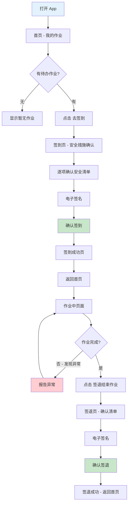

# 04 - 作业人

> 角色详细分析参见：[作业人角色视角](../../分析内容/八大作业人员与工作流程/角色视角/02-作业人.md)

---

## 1. 角色画像

### 1.1 角色定位

持证上岗的一线执行者，直接在危险区域完成具体作业操作。

### 1.2 典型用户

电焊工、气焊工、起重机操作员、电工等特种作业人员。

### 1.3 主要终端

手机 / PDA（现场使用，可能戴手套操作）

### 1.4 职责清单

1. 查看分配给自己的作业票
2. 确认安全措施已落实
3. 签到，开始作业
4. 按规程执行作业
5. 签退，结束作业

### 1.5 使用场景

| 场景 | 频率 | 终端 | 耗时 |
|------|------|------|------|
| 查看今日作业 | 每天 1-2 次 | 手机 | 1-2 分钟 |
| 确认安全措施 + 签到 | 每票 1 次 | 手机（现场） | 3-5 分钟 |
| 签退 | 每票 1 次 | 手机（现场） | 1-2 分钟 |

### 1.6 痛点与诉求

| 痛点 | 诉求 | 设计对策 |
|------|------|----------|
| 现场操作不方便（戴手套） | 少点击、大触控区 | 大按钮、简洁界面 |
| 不想看太多信息 | 只显示"我需要做什么" | 极简信息架构 |
| 怕漏签 | 强提醒 | 引导式操作 + 推送通知 |

### 1.7 设计原则

- **极简**：只展示与当前作业人相关的信息
- **大字大按钮**：适配现场戴手套操作
- **引导式**：一步一步走，不让用户迷路

---

## 2. 界面设计

### 2.1 首页 — 我的作业

```
┌─────────────────────────────────────────┐
│  我的作业                    👤 李四     │
├─────────────────────────────────────────┤
│  ┌─ 今日待办 ─────────────────────────┐ │
│  │  🔥 动火作业 · 1号储罐区            │ │
│  │  08:00 ~ 17:00                      │ │
│  │  监护人: 王五                       │ │
│  │  ┌─────────────────────────────┐   │ │
│  │  │        [ 去签到 ]           │   │ │
│  │  └─────────────────────────────┘   │ │
│  └─────────────────────────────────────┘ │
│  ┌─ 进行中 ───────────────────────────┐ │
│  │  (暂无)                             │ │
│  └─────────────────────────────────────┘ │
│  ┌─ 历史记录 ▼ ───────────────────────┐ │
│  │  🏗️ 高处作业 · T-101  昨天 ✅      │ │
│  └─────────────────────────────────────┘ │
└─────────────────────────────────────────┘
```

**设计要点：**

- 今日待办置顶，使用最大卡片样式
- "去签到"按钮醒目突出（主色、大尺寸、高对比度）
- 历史记录默认折叠，点击展开
- 无待办时显示"今日暂无作业，注意休息"

### 2.2 签到页 — 安全措施确认

强制按序确认清单（前项未确认，后项置灰不可点击）：

```text
☑ 我已持有有效操作证          ← 自动带入证书信息，仅需确认
☑ 我已了解作业内容和风险      ← 展示 JSA 风险点摘要
☑ 我已佩戴安全防护用品
☑ 我已确认灭火器材到位
☑ 我已确认监护人在岗
☑ 我已确认气体检测合格
☐ 我承诺严格遵守安全操作规程  ← 最后一项，确认后激活签名区

┌─────────────────────────────────────────┐
│           电子签名区域                   │
│     （横屏全屏书写，适配手套）           │
└─────────────────────────────────────────┘

全部勾选 + 签名完成 → [ 确认签到 ] 按钮激活
```

**设计要点：**

- 清单逐项解锁，防止跳过
- 操作证信息自动带入，减少手动输入
- 签名区域支持横屏全屏，笔迹粗度适配手套触控
- 未完成全部确认时，"确认签到"按钮保持禁用状态

### 2.3 签到成功页

```text
┌─────────────────────────────────────────┐
│              ✅ 签到成功                 │
├─────────────────────────────────────────┤
│  作业开始：08:00                        │
│  预计结束：17:00                        │
│  剩余时间：8小时52分                    │
├─────────────────────────────────────────┤
│  ⚠️ 安全提醒                            │
│  · 全程佩戴安全防护用品                 │
│  · 监护人离岗时立即停止作业             │
│  · 发现异常情况立即报告                 │
│  · 作业完成后及时签退                   │
├─────────────────────────────────────────┤
│  📞 紧急联系                            │
│  监护人 王五：138-xxxx-xxxx  [拨打]     │
│  安全科：    010-xxxx-xxxx   [拨打]     │
├─────────────────────────────────────────┤
│           [ 返回首页 ]                   │
└─────────────────────────────────────────┘
```

**设计要点：**

- 成功状态醒目展示，给予正向反馈
- 安全提醒精简为 4 条核心要点
- 紧急联系支持一键拨打

### 2.4 作业中页面

```text
┌─────────────────────────────────────────┐
│  🟢 作业中                              │
├─────────────────────────────────────────┤
│  🔥 动火作业 · 1号储罐区                │
│  已持续：3小时08分                      │
│  剩余：  5小时52分                      │
│  ████████████░░░░░░░░░  35%             │
├─────────────────────────────────────────┤
│  👁️ 监护人状态                          │
│  王五 · 🟢 在岗                         │
│  📞 138-xxxx-xxxx          [拨打]       │
├─────────────────────────────────────────┤
│  ┌──────────────┐  ┌──────────────┐    │
│  │ 📞 联系监护人 │  │ ⚠️ 报告异常  │    │
│  └──────────────┘  └──────────────┘    │
├─────────────────────────────────────────┤
│         [ 签退结束作业 ]                 │
└─────────────────────────────────────────┘
```

**设计要点：**

- 作业状态用进度条直观展示
- 监护人在岗/脱岗状态实时显示（脱岗时红色警告）
- 快捷操作区：联系监护人、报告异常均为大按钮
- 签退按钮始终可见，位于底部

### 2.5 签退页

签退确认清单（同样逐项确认）：

```text
☐ 我已完成全部作业内容
☐ 我已清理作业现场
☐ 我已归还工具和防护用品
☐ 我已确认无火种遗留

┌─────────────────────────────────────────┐
│           电子签名区域                   │
│     （横屏全屏书写，适配手套）           │
└─────────────────────────────────────────┘

全部勾选 + 签名完成 → [ 确认签退 ] 按钮激活
```

**设计要点：**

- 签退清单比签到更简短（4 项）
- 签名区域复用签到页组件
- 签退成功后自动跳转首页，显示"作业已完成 ✅"

---

## 3. 完整用户流程



---

## 4. 通知与消息

| 通知类型 | 触发时机 | 渠道 | 优先级 |
| ---------- | ---------- | ------ | -------- |
| 被分配作业 | 作业票审批通过后 | App 推送 | 普通 |
| 作业即将开始 | 开始前 30 分钟 | App 推送 | 高 |
| 监护人叫停 | 监护人发起叫停 | App 推送 + 短信 | 紧急 |
| 作业即将到期 | 结束前 30 分钟 | App 推送 | 高 |

---

## 5. 元数据权限配置（技术参考）

```json
{
  "role": "operator",
  "label": "作业人",
  "state_permissions": {
    "pending_assign": {
      "view": false,
      "actions": []
    },
    "assigned": {
      "view": true,
      "actions": ["sign_in"]
    },
    "in_progress": {
      "view": true,
      "actions": ["report_issue", "contact_guardian", "sign_out"]
    },
    "completed": {
      "view": true,
      "actions": []
    },
    "cancelled": {
      "view": true,
      "actions": []
    }
  },
  "data_scope": "self_only",
  "ui_config": {
    "font_size": "large",
    "button_size": "xl",
    "simplified_view": true
  }
}
```
