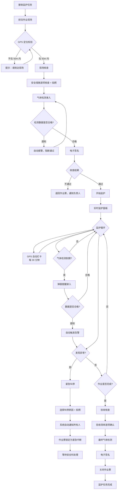

# 05 - 监护人

> 角色详细分析参见：[03-监护人（角色视角）](../../分析内容/八大作业人员与工作流程/角色视角/03-监护人.md)

---

## 1. 角色画像

### 1.1 角色定位

全程在场的安全守门人 —— 从作业开始到结束，监护人必须始终在场，是现场安全的最后一道防线。

### 1.2 典型用户

- 持监护人证的安全员
- 班组安全骨干

### 1.3 主要终端

手机（常驻现场，不离手）

### 1.4 职责清单

| # | 职责 |
|---|------|
| 1 | 全程在场不脱岗 |
| 2 | 检查作业票与实际现场相符 |
| 3 | 录入气体检测数据 |
| 4 | 实时监控作业人员状态 |
| 5 | 发现异常立即叫停 |
| 6 | 作业完成参与验收 |

### 1.5 使用场景

| 场景 | 频率 | 终端 | 耗时 |
|------|------|------|------|
| 现场核查（Verify） | 每票 1 次 | 手机 | 10-20 分钟 |
| 气体检测录入 | 每 2 小时 1 次 | 手机 | 2-3 分钟 |
| 实时监护常驻 | 全程 | 手机 | 数小时 |
| 紧急叫停 | 极少 | 手机 | 即时 |
| 验收签字 | 每票 1 次 | 手机 | 3-5 分钟 |

### 1.6 痛点与设计对策

| 痛点 | 设计对策 |
|------|----------|
| 长时间现场手机耗电 | 轻量低功耗界面，减少动画和后台刷新 |
| 快速录入检测数据 | 数字键盘优先，IoT 蓝牙自动采集 |
| 紧急叫停需即时响应 | 叫停按钮常驻底部，无需翻页 |
| 被查岗需证明在场 | GPS 轨迹自动记录，30 分钟打卡 |

### 1.7 设计原则

- 常驻监护面板，信息一屏可见
- 一键叫停永远可见（红色大按钮 fixed 底部）
- 自动记录 GPS / 在岗时间，无需手动操作
- 定时提醒气体检测（弹窗 + 震动）

---

## 2. 界面设计

### 2.1 首页 - 我的监护任务

```
┌─────────────────────────────┐
│  🛡️ 我的监护任务             │
├─────────────────────────────┤
│                             │
│  ┌─ 当前监护 ─────────────┐ │
│  │ 🔴 受限空间作业 #2024-089│
│  │ 位置：3号储罐           │
│  │ 作业人：张三、李四       │
│  │ 时间：08:00 - 16:00     │
│  │                         │
│  │  ┌───────────────────┐  │
│  │  │   开始现场核查 ▶   │  │
│  │  └───────────────────┘  │
│  └─────────────────────────┘ │
│                             │
│  ┌─ 待接收（明天）────────┐ │
│  │ ○ 高处作业 #2024-090   │ │
│  │   明天 08:00 - 12:00   │ │
│  │              [接收任务] │ │
│  └─────────────────────────┘ │
│                             │
│  ▶ 历史监护（折叠）         │
│                             │
└─────────────────────────────┘
```

### 2.2 现场核查页（Verify 阶段）

```
┌─────────────────────────────┐
│  ← 现场核查                  │
├─────────────────────────────┤
│                             │
│  📍 定位校验                 │
│  ┌─────────────────────────┐│
│  │ ✅ 已确认在 50m 范围内   ││
│  │ 当前距离：12m            ││
│  └─────────────────────────┘│
│                             │
│  🔍 安全措施核查（逐项）     │
│  ┌─────────────────────────┐│
│  │ ☑ 可燃物清理    [📷已拍] ││
│  │ ☑ 灭火器材到位  [📷已拍] ││
│  │ ☐ 警戒区域设置  [📷拍照] ││
│  │ ☐ 气体检测合格  [📷拍照] ││
│  │ ☐ 防护用品穿戴  [📷拍照] ││
│  └─────────────────────────┘│
│                             │
│  🧪 气体检测记录             │
│  ┌─────────────────────────┐│
│  │ 可燃气体  [    ] %LEL   ││
│  │           标准 < 20%    ││
│  │ 氧气浓度  [    ] %      ││
│  │           标准 18%~23%  ││
│  │ 有毒气体  [    ] ppm    ││
│  │           标准 < 10ppm  ││
│  │                         ││
│  │ [🔗 IoT蓝牙采集]        ││
│  │ [✏️ 手动录入]            ││
│  └─────────────────────────┘│
│                             │
│  ✍️ 电子签名                 │
│  ┌─────────────────────────┐│
│  │                         ││
│  │    （签名区域）          ││
│  │                         ││
│  └─────────────────────────┘│
│                             │
│  ┌──────────┐ ┌──────────┐ │
│  │ 核查不通过│ │ 核查通过 │ │
│  │ （退回） │ │ 开始作业 │ │
│  └──────────┘ └──────────┘ │
└─────────────────────────────┘
```

**交互规则：**

- 地理围栏校验：不在 50m 范围内时阻断操作，提示"请到达作业现场后再核查"
- 每项安全措施核查必须拍照确认，未拍照不可勾选
- 气体检测数值超标时自动报警，阻断"核查通过"按钮

### 2.3 监护面板（Executing 阶段）

> 核心页面 —— 监护人在作业期间的主工作台

```
┌─────────────────────────────┐
│  🛡️ 监护面板                 │
├─────────────────────────────┤
│                             │
│  🟢 作业中                   │
│  已持续：02:35:00            │
│  ████████████░░░░  65%      │
│  剩余：01:25:00              │
│                             │
├─────────────────────────────┤
│  👷 作业人员状态              │
│  ┌─────────────────────────┐│
│  │ 张三  🟢 在岗            ││
│  │ 李四  🟢 在岗            ││
│  └─────────────────────────┘│
│                             │
│  🧪 气体检测                 │
│  ┌─────────────────────────┐│
│  │ 上次检测：10:00          ││
│  │ 可燃 5.2%  氧气 20.8%   ││
│  │ 有毒 0 ppm              ││
│  │                         ││
│  │ ⏰ 下次检测倒计时：       ││
│  │    01:25:00              ││
│  │         [立即录入]       ││
│  └─────────────────────────┘│
│                             │
│  📋 监护日志                 │
│  ┌─────────────────────────┐│
│  │ 10:30 📍 GPS确认在岗     ││
│  │ 10:00 🧪 气体检测录入     ││
│  │ 08:15 ✅ 现场核查通过     ││
│  │ 08:00 📍 GPS确认到达现场  ││
│  └─────────────────────────┘│
│                             │
│  ┌────────┐┌────────┐       │
│  │录入检测││拍照记录│       │
│  └────────┘└────────┘       │
│  ┌────────────────────────┐ │
│  │      结束作业           │ │
│  └────────────────────────┘ │
│                             │
│ ┌─────────────────────────┐ │
│ │  🔴 紧 急 叫 停          │ │
│ │     （长按 2 秒触发）    │ │
│ └─────────────────────────┘ │
└─────────────────────────────┘
```

**设计要点：**

- 🔴 叫停按钮：常驻底部 `position: fixed`，任何滚动位置可见
- 气体检测到期：自动弹窗提醒 + 震动
- GPS 打卡：每 30 分钟自动记录一次，无需手动操作
- 监护日志：系统自动生成，不可篡改，作为合规证据

### 2.4 紧急叫停确认

```
┌─────────────────────────────┐
│                             │
│  ⚠️  紧急叫停确认            │
│                             │
│  叫停原因（单选）：          │
│  ┌─────────────────────────┐│
│  │ ○ 气体检测超标           ││
│  │ ○ 人员违章操作           ││
│  │ ○ 设备异常               ││
│  │ ○ 天气突变               ││
│  │ ○ 其他                   ││
│  └─────────────────────────┘│
│                             │
│  📷 拍照记录（可选）         │
│  ┌──────┐                   │
│  │ + 拍照│                   │
│  └──────┘                   │
│                             │
│  ┌─────────────────────────┐│
│  │    🔴 确认叫停            ││
│  └─────────────────────────┘│
│                             │
│  叫停后系统自动执行：        │
│  • 通知所有作业人员停止作业  │
│  • 通知负责人和安全科        │
│  • 锁定作业票为"紧急中断"   │
│                             │
└─────────────────────────────┘
```

### 2.5 气体检测录入（定时弹窗）

```
┌─────────────────────────────┐
│                             │
│  ⏰ 气体检测提醒              │
│  距上次检测已过 2 小时        │
│                             │
│  检测时间：12:00（自动）     │
│  检测位置：3号储罐（自动GPS）│
│                             │
│  ┌─────────────────────────┐│
│  │ 可燃气体                 ││
│  │ [        ] %LEL          ││
│  │ 标准 < 20%  上次: 5.2%  ││
│  ├─────────────────────────┤│
│  │ 氧气浓度                 ││
│  │ [        ] %             ││
│  │ 标准 18%~23% 上次: 20.8%││
│  ├─────────────────────────┤│
│  │ 有毒气体                 ││
│  │ [        ] ppm           ││
│  │ 标准 < 10ppm 上次: 0    ││
│  └─────────────────────────┘│
│                             │
│  ┌───────────┐┌───────────┐ │
│  │IoT蓝牙采集││ 手动录入  │ │
│  └───────────┘└───────────┘ │
│                             │
│  ┌─────────────────────────┐│
│  │    提交检测记录           ││
│  └─────────────────────────┘│
│                             │
│  ⚠️ 任一数值超标将自动触发告警│
│                             │
└─────────────────────────────┘
```

### 2.6 验收签字页

```
┌─────────────────────────────┐
│  ← 验收签字                  │
├─────────────────────────────┤
│                             │
│  ✅ 验收核查清单              │
│  ┌─────────────────────────┐│
│  │ ☐ 现场清理，无残留火种   ││
│  │ ☐ 灭火器材已归还         ││
│  │ ☐ 警戒区域已撤除         ││
│  │ ☐ 作业人员全部签退       ││
│  │ ☐ 30 分钟内无复燃迹象    ││
│  └─────────────────────────┘│
│                             │
│  🧪 最终气体检测              │
│  ┌─────────────────────────┐│
│  │ 可燃气体  [    ] %LEL   ││
│  │ 氧气浓度  [    ] %      ││
│  └─────────────────────────┘│
│                             │
│  ✍️ 电子签名                 │
│  ┌─────────────────────────┐│
│  │                         ││
│  │    （签名区域）          ││
│  │                         ││
│  └─────────────────────────┘│
│                             │
│  ┌─────────────────────────┐│
│  │  验收通过，关闭作业票     ││
│  └─────────────────────────┘│
│                             │
└─────────────────────────────┘
```

---

## 3. 完整用户流程



---

## 4. 通知与消息

| 通知事件 | 通知方式 | 优先级 |
|----------|----------|--------|
| 被指定为监护人 | 推送 + 短信 | 高 |
| 作业票审批通过，可开始核查 | 推送 | 中 |
| 气体检测到期提醒 | 弹窗 + 震动 | 紧急 |
| 作业即将到期（剩余 30 分钟） | 推送 + 震动 | 高 |
| GPS 偏离告警（离开 50m 范围） | 弹窗 + 震动 | 紧急 |

---

## 5. 元数据权限配置（技术参考）

```json
{
  "role": "guardian",
  "display_name": "监护人",
  "state_permissions": {
    "Draft": [],
    "Approving": [],
    "Approved": ["read"],
    "Verify": ["read", "verify", "upload_photo", "gas_detection", "sign", "reject"],
    "Executing": ["read", "monitor", "gas_detection", "upload_photo", "emergency_stop", "end_work"],
    "Acceptance": ["read", "acceptance_check", "gas_detection", "sign"],
    "Closed": ["read"],
    "Suspended": ["read"]
  },
  "constraints": {
    "geo_fencing": {
      "enabled": true,
      "radius_meters": 50,
      "block_on_violation": true,
      "description": "核查和监护阶段必须在作业点 50m 范围内"
    },
    "gps_auto_log": {
      "enabled": true,
      "interval_minutes": 30,
      "description": "每 30 分钟自动记录 GPS 位置，作为在岗证据"
    },
    "detection_reminder": {
      "enabled": true,
      "interval_hours": 2,
      "alert_type": "popup_vibration",
      "description": "每 2 小时弹窗提醒气体检测录入"
    }
  }
}
```