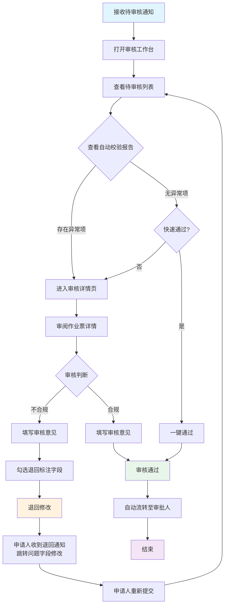

# 06 - 安全负责人（审核人）

> **文档版本**: v1.0 | **创建日期**: 2026-03-11
> **角色分析来源**: [`04-安全负责人.md`](../../分析内容/八大作业人员与工作流程/角色视角/04-安全负责人.md)
> **关联PRD**: [`02-角色体系与权限矩阵.md`](./02-角色体系与权限矩阵.md)

---

## 1. 角色画像

### 1.1 角色定位

**数据驱动的风险把关者** — 通过系统化的自动校验与人工研判相结合，确保每张作业票的安全措施完备、人员资质合规、风险分析充分。

| 属性 | 说明 |
|------|------|
| 典型用户 | 车间安全员、安全科专员 |
| Demo 人设 | 赵六（安全科专员） |
| 主要终端 | PC（办公室审核）+ 手机（现场抽查） |

### 1.2 职责清单

- 审核作业票的安全措施是否完备
- 验证气体检测数据是否合规
- 核实人员资质是否有效
- 评估风险分析（JSA）是否充分
- 出具审核意见（通过 / 退回）

### 1.3 使用场景

| 场景 | 频率 | 终端 | 时长 |
|------|------|------|------|
| 批量审核作业票 | 每天 5-20 次 | PC | 5-10 分钟/票 |
| 查看数据看板 | 每天 1-2 次 | PC | 5 分钟 |
| 现场抽查 | 每周数次 | 手机 | 10-20 分钟 |
| 处理退回/异常 | 偶尔 | PC/手机 | 5-10 分钟 |

### 1.4 痛点与设计对策

| 痛点 | 设计对策 |
|------|---------|
| 每天审核量大 | 批量处理、快速定位问题 |
| 数据合规性判断复杂 | 自动对比标准值，高亮异常 |
| 退回后反复沟通 | 精确标注退回原因和修改建议 |
| 需要全局视角 | 数据看板、统计报表 |

### 1.5 设计原则

- **效率优先**: 批量操作、快捷键、自动校验，减少重复劳动
- **异常高亮**: 不合规项自动标红，合规项自动标绿，一目了然
- **精准退回**: 退回时精确标注问题字段，申请人收到后直接跳转修改

---

## 2. 界面设计

### 2.1 审核工作台（PC 端）

安全负责人的主工作界面，集中展示待办事项与快捷操作入口。

```
┌──────────────────────────────────────────────────────────────┐
│  安全审核工作台                              👤 赵六 (安全科)│
├──────────────────────────────────────────────────────────────┤
│                                                              │
│  ┌─ 待办统计 ────────────────────────────────────────────┐  │
│  │  🔴 待审核: 8    🟡 已退回待修改: 3    🟢 今日已审: 12│  │
│  └───────────────────────────────────────────────────────┘  │
│                                                              │
│  ┌─ 待审核列表 ──────────────────────────────────────────┐  │
│  │                                                        │  │
│  │  筛选: [全部类型▼] [全部区域▼] [全部等级▼] [搜索...]  │  │
│  │                                                        │  │
│  │  ┌────────────────────────────────────────────────┐   │  │
│  │  │ 🔴 HW-2026-0311-001  动火·一级  1号储罐区     │   │  │
│  │  │ 申请人: 张三  提交: 07:30  等待: 45分钟        │   │  │
│  │  │ ⚠️ 灭火器数量: 2具 (一级标准: ≥4具)           │   │  │
│  │  │ [审核] [快速退回]                              │   │  │
│  │  └────────────────────────────────────────────────┘   │  │
│  │                                                        │  │
│  │  ┌────────────────────────────────────────────────┐   │  │
│  │  │ 🟡 CS-2026-0311-002  受限空间·一级  反应釜     │   │  │
│  │  │ 申请人: 周八  提交: 07:45  等待: 30分钟        │   │  │
│  │  │ ✅ 自动校验通过，无异常项                      │   │  │
│  │  │ [审核] [快速通过]                              │   │  │
│  │  └────────────────────────────────────────────────┘   │  │
│  │                                                        │  │
│  │  ┌────────────────────────────────────────────────┐   │  │
│  │  │ 🟡 HA-2026-0311-003  高处·二级  T-101塔顶     │   │  │
│  │  │ 申请人: 钱九  提交: 08:00  等待: 15分钟        │   │  │
│  │  │ ✅ 自动校验通过，无异常项                      │   │  │
│  │  │ [审核] [快速通过]                              │   │  │
│  │  └────────────────────────────────────────────────┘   │  │
│  │                                                        │  │
│  └───────────────────────────────────────────────────────┘  │
│                                                              │
└──────────────────────────────────────────────────────────────┘
```

**设计要点**:

| 特性 | 说明 |
|------|------|
| 自动预校验 | 系统自动对比标准值，在列表中直接标注异常项 |
| 快速通过 | 无异常项的作业票可一键通过（无需进入详情页） |
| 快速退回 | 有异常项的作业票可一键退回（自动附带异常原因） |
| 等待时长 | 显示申请人等待时间，避免审核积压 |
| 筛选排序 | 支持按类型、区域、等级筛选，按等待时长排序 |

### 2.2 审核详情页（PC 端）

左右分栏布局：左侧查看作业票详情，右侧填写审核意见与操作。

```text
┌──────────────────────────────────────────────────────────────┐
│  ← 审核  HW-2026-0311-001  动火作业·一级                    │
├──────────────────────────────────────────────────────────────┤
│                                                              │
│  ┌─ 自动校验报告 ────────────────────────────────────────┐  │
│  │  ✅ 人员资质: 全部有效                                 │  │
│  │  ✅ 作业时间: 8小时，符合规定                          │  │
│  │  ✅ 现场照片: 3张，符合要求                            │  │
│  │  🔴 灭火器数量: 2具 → 一级动火标准 ≥ 4具             │  │
│  │  ✅ JSA风险分析: 已识别2个风险点                       │  │
│  │  ✅ 应急预案: 已填写                                   │  │
│  │  ⚪ 气体检测: 待现场核查阶段录入                       │  │
│  └───────────────────────────────────────────────────────┘  │
│                                                              │
│  ┌─ 左侧: 作业票详情 ──────┐ ┌─ 右侧: 审核操作 ────────┐  │
│  │                          │ │                          │  │
│  │  基础信息 ▼              │ │  审核意见 *              │  │
│  │  作业区域: 1号储罐区     │ │  ┌──────────────────┐   │  │
│  │  作业等级: 一级          │ │  │灭火器数量不足，   │   │  │
│  │  动火方式: 电焊          │ │  │一级动火需≥4具    │   │  │
│  │  时间: 08:00~17:00       │ │  └──────────────────┘   │  │
│  │                          │ │                          │  │
│  │  人员信息 ▼              │ │  退回标注字段:           │  │
│  │  动火人: 张三 ✅ 李四 ✅ │ │  ☑ 灭火器数量            │  │
│  │  监护人: 王五 ✅         │ │  ☐ 其他: [        ]     │  │
│  │                          │ │                          │  │
│  │  安全措施 ▼              │ │  ┌──────────────────┐   │  │
│  │  灭火器: 2具 🔴          │ │  │   [ 退回修改 ]   │   │  │
│  │  警戒区域: 10m ✅        │ │  └──────────────────┘   │  │
│  │                          │ │                          │  │
│  │  JSA风险分析 ▼           │ │  ┌──────────────────┐   │  │
│  │  🔴高: 可燃气体泄漏      │ │  │   [ 审核通过 ]   │   │  │
│  │  🟡中: 火花引燃          │ │  └──────────────────┘   │  │
│  │                          │ │                          │  │
│  │  现场照片 ▼              │ │                          │  │
│  │  [照片1] [照片2] [照片3] │ │                          │  │
│  │                          │ │                          │  │
│  └──────────────────────────┘ └──────────────────────────┘  │
│                                                              │
└──────────────────────────────────────────────────────────────┘
```

**交互逻辑**:

| 交互 | 说明 |
| ---- | ---- |
| 左右分栏 | 左侧查看详情，右侧填写审核意见，无需切换页面 |
| 异常项自动标红 | 🔴 灭火器数量不足等不合规项自动高亮 |
| 退回精确标注 | 勾选需要修改的字段，申请人收到后直接跳转到该字段 |
| 审核通过 | 通过后自动流转到审批人（终审人） |
| 折叠展示 | 各信息区块支持折叠/展开，聚焦关键信息 |

### 2.3 数据看板（PC 端）

安全负责人的全局视角，展示审核统计、作业分布与风险态势。

```text
┌──────────────────────────────────────────────────────────────┐
│  安全数据看板                                    [本周▼]     │
├──────────────────────────────────────────────────────────────┤
│                                                              │
│  ┌──────────┐ ┌──────────┐ ┌──────────┐ ┌──────────┐      │
│  │ 本周总票  │ │ 审核通过  │ │ 退回率   │ │ 平均审核  │      │
│  │   45     │ │   38     │ │  15.6%   │ │  12分钟  │      │
│  └──────────┘ └──────────┘ └──────────┘ └──────────┘      │
│                                                              │
│  ┌─ 作业类型分布 ─────────┐ ┌─ 退回原因TOP5 ────────────┐  │
│  │  动火: 15 (33%)        │ │  1. 灭火器数量不足 (5次)  │  │
│  │  高处: 12 (27%)        │ │  2. 人员证书过期 (3次)    │  │
│  │  受限空间: 8 (18%)     │ │  3. 照片不足 (2次)        │  │
│  │  吊装: 5 (11%)         │ │  4. JSA分析不充分 (1次)   │  │
│  │  其他: 5 (11%)         │ │  5. 时间超限 (1次)        │  │
│  └────────────────────────┘ └────────────────────────────┘  │
│                                                              │
│  ┌─ 区域风险热力图 ───────────────────────────────────────┐  │
│  │  [地图热力图: 按区域显示作业密度和风险等级]             │  │
│  └───────────────────────────────────────────────────────┘  │
│                                                              │
└──────────────────────────────────────────────────────────────┘
```

**看板组件说明**:

| 组件 | 数据来源 | 交互 |
| ---- | ---- | ---- |
| 统计卡片 | 实时聚合 | 点击跳转对应列表 |
| 作业类型分布 | 饼图/环形图 | 点击扇区筛选该类型 |
| 退回原因 TOP5 | 柱状图 | 点击查看具体退回票据 |
| 区域风险热力图 | 地图叠加 | 点击区域查看该区域作业票 |

### 2.4 手机端 — 快速审核

面向现场抽查场景，极简交互，支持滑动手势快速处理。

```text
┌─────────────────────────────────────────┐
│  待审核 (8)                  👤 赵六    │
├─────────────────────────────────────────┤
│                                          │
│  ┌───────────────────────────────────┐  │
│  │ 🔴 HW-001 动火·一级 1号储罐区    │  │
│  │ ⚠️ 灭火器不足                     │  │
│  │ 等待: 45分钟                      │  │
│  │ ← 左滑退回  右滑通过 →           │  │
│  └───────────────────────────────────┘  │
│                                          │
│  ┌───────────────────────────────────┐  │
│  │ ✅ CS-002 受限空间·一级 反应釜    │  │
│  │ 自动校验通过                      │  │
│  │ 等待: 30分钟                      │  │
│  │ ← 左滑退回  右滑通过 →           │  │
│  └───────────────────────────────────┘  │
│                                          │
│  ┌───────────────────────────────────┐  │
│  │ ✅ HA-003 高处·二级 T-101塔顶    │  │
│  │ 自动校验通过                      │  │
│  │ 等待: 15分钟                      │  │
│  │ ← 左滑退回  右滑通过 →           │  │
│  └───────────────────────────────────┘  │
│                                          │
│  ┌───────────────────────────────────┐  │
│  │  [审核工作台]  [数据看板]  [我的]  │  │
│  └───────────────────────────────────┘  │
└─────────────────────────────────────────┘
```

**手机端交互**:

| 手势/操作 | 效果 |
| ---- | ---- |
| 右滑 | 快速通过（类似 Tinder 交互） |
| 左滑 | 快速退回（弹出退回原因选择） |
| 点击卡片 | 进入简化版审核详情 |
| 下拉 | 刷新待审核列表 |

---

## 3. 完整用户流程



---

## 4. 通知与消息

| 事件 | 通知方式 | 内容示例 | 优先级 |
| ---- | ---- | ---- | ---- |
| 新作业票待审核 | 推送 | "新动火作业票待审核（1号储罐区）" | 普通 |
| 审核积压预警 | 推送 | "您有5张作业票等待超过1小时，请及时处理" | 高 |
| 紧急叫停通知 | 推送 + 短信 | "紧急：1号储罐区动火作业被叫停" | 紧急 |
| 气体检测超标 | 推送 + 短信 | "告警：1号储罐区可燃气体超标" | 紧急 |
| 退回票据已修改 | 推送 | "张三已修改退回的动火作业票，请重新审核" | 普通 |

---

## 5. 元数据权限配置（技术参考）

```json
{
  "role": "reviewer",
  "display_name": "安全负责人（审核人）",
  "state_permissions": {
    "Draft": {
      "ALL": "hidden",
      "actions": []
    },
    "Submitted": {
      "ALL": "readonly",
      "review_comments": "readwrite",
      "actions": ["approve", "reject", "add_comment"]
    },
    "Verify": {
      "gas_detection": "readonly_with_validation",
      "actions": ["validate_data", "view"]
    },
    "Executing": {
      "ALL": "readonly",
      "actions": ["view", "view_dashboard"]
    },
    "Closed": {
      "ALL": "readonly",
      "actions": ["view", "export", "statistics"]
    }
  },
  "auto_validation_rules": {
    "fire_extinguishers": {
      "special": ">=6",
      "level1": ">=4",
      "level2": ">=2"
    },
    "gas_detection": {
      "combustibleGas": "< 20",
      "oxygen": ">= 18 && <= 23",
      "toxicGas": "< threshold_by_type"
    },
    "worker_certificates": "not_expired",
    "photos_count": ">= 3",
    "jsa_risk_items": ">= 1",
    "emergency_plan": "required"
  }
}
```
