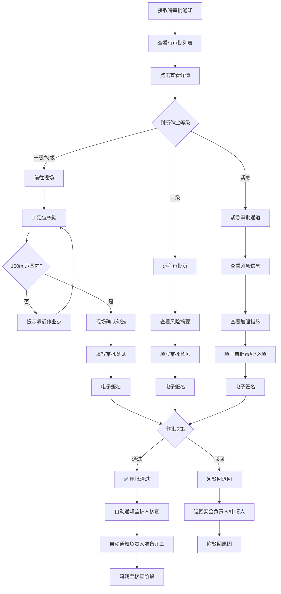

# 07 - 审批人（终审人）

> **角色视角参考**: [../../分析内容/八大作业人员与工作流程/角色视角/05-审批人.md](../../分析内容/八大作业人员与工作流程/角色视角/05-审批人.md)

---

## 1. 角色画像

### 1.1 角色定位

到场确认的最终决策者 —— 在安全负责人审核通过后，对作业票进行终审批准，一级及以上作业必须到现场确认。

### 1.2 典型用户

- 车间主任
- 分管副厂长
- 生产部长

### 1.3 主要终端

- **手机**（现场审批为主）
- **PC**（查看统计报表）

### 1.4 职责清单

| # | 职责 |
|---|------|
| 1 | 审阅安全负责人审核意见 |
| 2 | 评估风险等级与应对措施 |
| 3 | 到现场确认作业条件（一级及以上） |
| 4 | 签署最终审批意见 |
| 5 | 紧急情况快速决策 |

### 1.5 使用场景

| 场景 | 频率 | 终端 | 单次耗时 |
|------|------|------|----------|
| 现场审批一级及以上 | 每天 3-8 次 | 手机（现场） | 5-10 分钟/票 |
| 远程审批二级 | 每天 2-5 次 | 手机 | 2-3 分钟/票 |
| 查看审批统计 | 每周 1-2 次 | PC | 5-10 分钟 |
| 紧急审批 | 偶尔 | 手机 | 1-3 分钟 |

### 1.6 痛点与解法

| 痛点 | 设计解法 |
|------|----------|
| 一级必须到现场，来回跑 | 地理围栏约束 + GPS 定位校验 |
| 审批量大，信息过载 | 风险摘要卡片，一眼看重点 |
| 审核意见需快速了解 | 结论前置，通过/不通过最先展示 |
| 紧急需快速响应 | 绿色通道，简化流程 |

### 1.7 设计原则

| 原则 | 说明 |
|------|------|
| 风险前置 | 风险等级和审核结论最先展示 |
| 现场约束 | 一级及以上强制到场（地理围栏） |
| 快速决策 | 信息精炼、减少翻页、支持语音 |
| 分级处理 | 二级可远程，一级/特级必须到场 |

---

## 2. 界面设计

### 2.1 首页 - 待审批列表（手机端）

```
┌─────────────────────────────────┐
│  ← 审批工作台            🔔 ⚙️  │
├─────────────────────────────────┤
│                                 │
│  🔴 待审批    🟢 今日已批       │
│     5           8               │
│  ⚡ 紧急      📊 本周          │
│     1           32              │
│                                 │
├─────────────────────────────────┤
│  类型 ▼ │ 等级 ▼ │ 🔍 搜索     │
├─────────────────────────────────┤
│                                 │
│  ⚡紧急  HW-008                │
│  动火 · 特级    主装置区        │
│  ─────────────────────────────  │
│  安全审核 ✅ 通过               │
│  风险 🔴 高 · 需现场审批        │
│  ⏱ 等待 1h20m                  │
│  ┌─────────────────────────┐   │
│  │      现场审批            │   │
│  └─────────────────────────┘   │
│                                 │
│  HW-001                        │
│  动火 · 一级    1号储罐区       │
│  ─────────────────────────────  │
│  安全审核 ✅ 通过               │
│  风险 🟡 中 · 需现场审批        │
│  ┌─────────────────────────┐   │
│  │      现场审批            │   │
│  └─────────────────────────┘   │
│                                 │
│  HA-003                        │
│  高处 · 二级    T-101          │
│  ─────────────────────────────  │
│  安全审核 ✅ 通过               │
│  风险 🟢 低 · 可远程审批        │
│  ┌────────────┐┌───────────┐   │
│  │  远程审批   ││ 现场审批   │   │
│  └────────────┘└───────────┘   │
│                                 │
└─────────────────────────────────┘
```

**交互说明**:
- 紧急作业票置顶，红色标签高亮
- 一级及以上仅显示「现场审批」按钮
- 二级同时显示「远程审批」和「现场审批」
- 等待时间超过 15 分钟变为橙色，超过 30 分钟变为红色

### 2.2 审批详情页（手机端）

```text
┌─────────────────────────────────┐
│  ← 审批详情         HW-001     │
├─────────────────────────────────┤
│ ┌─────────────────────────────┐ │
│ │  ⚠️ 风险摘要（置顶）        │ │
│ │                             │ │
│ │  风险等级  🟡 中            │ │
│ │  安全审核  ✅ 通过          │ │
│ │  审核人    赵六  08:15      │ │
│ │  审核意见  安全措施到位，   │ │
│ │           建议加强监护      │ │
│ │  自动校验  6/6 通过         │ │
│ │  JSA风险点 🔴高×1 🟡中×1   │ │
│ └─────────────────────────────┘ │
│                                 │
│  📋 关键信息速览               │
│  申请人: 张三    时间: 08:00   │
│  动火人: 李四    证书: ✅      │
│  监护人: 王五    资质: ✅      │
│  灭火器: 4具    警戒: 已设置   │
│                                 │
│  📊 JSA 风险分析          ▶展开 │
│  📷 现场照片（3张）       ▶展开 │
│  🚨 应急预案              ▶展开 │
│                                 │
│  ┌─────────────────────────────┐│
│  │ ⚠️ 一级动火：需到现场审批  ││
│  │                             ││
│  │   [ 前往现场审批 → ]        ││
│  └─────────────────────────────┘│
└─────────────────────────────────┘
```

**交互说明**:

- 风险摘要卡片始终置顶，不随页面滚动
- JSA 风险分析、现场照片、应急预案默认折叠，点击展开
- 一级及以上底部固定「前往现场审批」引导条
- 二级作业直接显示审批操作按钮

### 2.3 现场审批页（手机端 - 核心页面）

```text
┌─────────────────────────────────┐
│  ← 现场审批         HW-001     │
├─────────────────────────────────┤
│                                 │
│  📍 定位校验                    │
│  ┌─────────────────────────────┐│
│  │ 当前位置: 1号储罐区东侧     ││
│  │ 距作业点: 45m               ││
│  │ 100m 范围内 ✅              ││
│  │ ┌─────────────────────┐    ││
│  │ │    [地图缩略图]      │    ││
│  │ │     📍← 45m →🔴     │    ││
│  │ └─────────────────────┘    ││
│  └─────────────────────────────┘│
│                                 │
│  ✅ 现场确认（强制按序勾选）    │
│  ┌─────────────────────────────┐│
│  │ ☑ 1. 已到达作业现场         ││
│  │ ☑ 2. 已确认安全措施到位     ││
│  │ ☐ 3. 已确认人员资质合格     ││
│  │ ☐ 4. 已确认监护人在岗  🔒  ││
│  │ ☐ 5. 已评估风险可控    🔒  ││
│  └─────────────────────────────┘│
│                                 │
│  💬 审批意见                    │
│  ┌─────────────────────────┐   │
│  │                         │🎤 │
│  │  请输入审批意见...      │   │
│  └─────────────────────────┘   │
│                                 │
│  📷 现场照片（可选）  [+拍照]   │
│                                 │
│  ✍️ 电子签名                   │
│  ┌─────────────────────────────┐│
│  │                             ││
│  │      请在此处签名           ││
│  │                             ││
│  └─────────────────────────────┘│
│                                 │
│  ┌──────────┐  ┌──────────┐    │
│  │ 驳回退回  │  │ 审批通过  │    │
│  └──────────┘  └──────────┘    │
└─────────────────────────────────┘
```

**交互说明**:

- 不在 100m 范围内时，「审批通过」按钮禁用（灰色），提示"请靠近作业点"
- 确认项强制按序勾选，未完成上一项时下一项显示锁定图标
- 🎤 语音输入按钮，长按录音，自动转文字
- 签名区域支持横屏模式
- 审批通过后自动触发：通知监护人前往核查 → 通知负责人准备开工 → 流转至核查阶段

### 2.4 远程审批页（手机端 - 二级作业）

```text
┌─────────────────────────────────┐
│  ← 远程审批         HA-003     │
├─────────────────────────────────┤
│                                 │
│  ⚠️ 风险摘要                   │
│  ┌─────────────────────────────┐│
│  │ 风险等级  🟢 低             ││
│  │ 安全审核  ✅ 通过           ││
│  │ 自动校验  全部通过          ││
│  └─────────────────────────────┘│
│                                 │
│  📋 关键信息                    │
│  作业人: 李四    资质: ✅       │
│  监护人: 王五    资质: ✅       │
│  安全措施: 安全带/安全网/警示   │
│                                 │
│  💬 审批意见                    │
│  ┌─────────────────────────┐   │
│  │                         │🎤 │
│  │  请输入审批意见...      │   │
│  └─────────────────────────┘   │
│                                 │
│  ✍️ 电子签名                   │
│  ┌─────────────────────────────┐│
│  │      请在此处签名           ││
│  └─────────────────────────────┘│
│                                 │
│  ┌──────────┐  ┌──────────┐    │
│  │ 驳回退回  │  │ 审批通过  │    │
│  └──────────┘  └──────────┘    │
└─────────────────────────────────┘
```

**设计要点**:

- 无地理围栏约束，可在任意位置审批
- 界面更精简，省略现场确认勾选和定位校验
- 仍保留语音输入和电子签名

### 2.5 紧急审批通道（手机端）

```text
┌─────────────────────────────────┐
│  ← ⚡ 紧急审批      HW-008     │
├─────────────────────────────────┤
│                                 │
│  ┌─────────────────────────────┐│
│  │ ⚠️ 此作业票已标记为紧急     ││
│  │ 原因: 装置紧急抢修          ││
│  └─────────────────────────────┘│
│                                 │
│  ⚠️ 风险摘要                   │
│  ┌─────────────────────────────┐│
│  │ 🔥 动火 · 特级              ││
│  │ 风险等级  🔴 高             ││
│  │ 安全审核  ✅ 通过           ││
│  └─────────────────────────────┘│
│                                 │
│  🛡️ 加强措施                   │
│  ┌─────────────────────────────┐│
│  │ · 灭火器 6 具               ││
│  │ · 消防车待命                ││
│  │ · 双监护人                  ││
│  │ · 应急救援队待命            ││
│  └─────────────────────────────┘│
│                                 │
│  💬 审批意见 *（必填）          │
│  ┌─────────────────────────┐   │
│  │                         │🎤 │
│  │  请输入审批意见...      │   │
│  └─────────────────────────┘   │
│                                 │
│  ✍️ 电子签名                   │
│  ┌─────────────────────────────┐│
│  │      请在此处签名           ││
│  └─────────────────────────────┘│
│                                 │
│  ┌──────────┐  ┌──────────┐    │
│  │ 驳回退回  │  │⚡紧急审批 │    │
│  └──────────┘  └──────────┘    │
│                                 │
│  ⚠️ 紧急审批将记录完整审计日志  │
└─────────────────────────────────┘
```

**规则说明**:

- 无地理围栏约束，但仍记录 GPS 位置
- 审批意见为必填项，不可留空
- 完整审计日志：记录审批时间、GPS、意见全文
- 审批通过后仍需监护人核查环节，不可跳过

### 2.6 审批统计看板（PC 端）

```text
┌──────────────────────────────────────────────────────────┐
│  审批统计看板                          本周 ▼  导出 📥   │
├──────────────────────────────────────────────────────────┤
│                                                          │
│  ┌────────────┐┌────────────┐┌────────────┐┌──────────┐ │
│  │ 本周审批    ││ 通过率     ││ 平均耗时    ││ 紧急审批  │ │
│  │    32      ││   93.8%    ││   8 分钟    ││    2 次   │ │
│  └────────────┘└────────────┘└────────────┘└──────────┘ │
│                                                          │
│  📈 审批趋势（近 30 天）                                 │
│  ┌──────────────────────────────────────────────────┐   │
│  │  12│        *                                    │   │
│  │  10│  *    * *        *                          │   │
│  │   8│ * *  *   *  *   * *  *                      │   │
│  │   6│*   **     ** * *   ** *  *                   │   │
│  │   4│                        ** *                  │   │
│  │   2│                           *                  │   │
│  │   0└──────────────────────────────────            │   │
│  │    3/1  3/5  3/10  3/15  3/20  3/25  3/30        │   │
│  └──────────────────────────────────────────────────┘   │
│                                                          │
│  ┌────────────────────────┐┌────────────────────────┐   │
│  │ 作业类型分布            ││ 驳回原因分析            │   │
│  │ ■ 动火  45%            ││ ■ 安全措施不足  40%    │   │
│  │ ■ 高处  25%            ││ ■ 人员资质问题  25%    │   │
│  │ ■ 受限  15%            ││ ■ 风险评估不足  20%    │   │
│  │ ■ 其他  15%            ││ ■ 其他          15%    │   │
│  └────────────────────────┘└────────────────────────┘   │
│                                                          │
│  📊 审批效率                                             │
│  ┌──────────────────────────────────────────────────┐   │
│  │ 平均响应   8 分钟   目标 ≤15 分钟   ✅           │   │
│  │ 最长等待   45 分钟                               │   │
│  │ 超时率     3.1%     目标 ≤5%        ✅           │   │
│  └──────────────────────────────────────────────────┘   │
│                                                          │
└──────────────────────────────────────────────────────────┘
```

---

## 3. 完整用户流程



---

## 4. 通知与消息

| 通知场景 | 通知方式 | 优先级 | 说明 |
| ---------- | ---------- | -------- | ------ |
| 新作业票待审批 | 推送 | 普通 | 含作业类型、等级、申请人 |
| 紧急审批请求 | 推送 + 短信 + 电话 | 紧急 | 三通道并发确保触达 |
| 审批积压提醒 | 推送 | 普通 | 待审批 > 5 张时触发 |
| 作业异常/叫停 | 推送 + 短信 | 高 | 已审批作业发生异常 |
| 审批到期提醒 | 推送 | 普通 | 距超时 5 分钟时提醒 |

---

## 5. 元数据权限配置（技术参考）

```json
{
  "role": "approver",
  "state_permissions": {
    "pending_approval": ["view", "approve", "reject"],
    "approved": ["view"],
    "rejected": ["view"],
    "in_progress": ["view", "emergency_stop"],
    "completed": ["view"]
  },
  "approval_rules": {
    "level_special": {
      "geo_fencing": true,
      "geo_radius_meters": 100,
      "requires_on_site": true,
      "requires_checklist": true,
      "opinion_required": false
    },
    "level_1": {
      "geo_fencing": true,
      "geo_radius_meters": 100,
      "requires_on_site": true,
      "requires_checklist": true,
      "opinion_required": false
    },
    "level_2": {
      "geo_fencing": false,
      "requires_on_site": false,
      "requires_checklist": false,
      "opinion_required": false
    }
  },
  "emergency_approval": {
    "geo_fencing": false,
    "requires_on_site": false,
    "opinion_required": true,
    "audit_log": true,
    "record_gps": true,
    "notification_channels": ["push", "sms", "phone"]
  }
}
```
