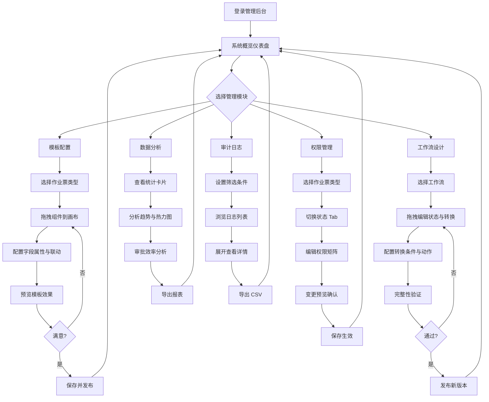

# 08 - 系统管理员

> **PRD 章节** | Vue3 MVP Demo
> **角色视角资料**: [06-系统管理员.md](../../分析内容/八大作业人员与工作流程/角色视角/06-系统管理员.md)

---

## 1. 角色画像

### 1.1 角色定位

平台配置与运维管理者。负责系统底层配置、模板维护、权限管理、数据分析与审计追溯，确保作业票系统稳定高效运行。

### 1.2 典型用户

- 信息化部门工程师
- 安全管理系统管理员

### 1.3 主要终端

PC（后台管理系统）

### 1.4 职责清单

| 序号 | 职责 | 说明 |
|------|------|------|
| 1 | 配置维护作业票模板 | 拖拽式设计八大作业票表单模板 |
| 2 | 设计调整审批工作流 | 可视化状态机编辑审批流程 |
| 3 | 管理角色权限矩阵 | 按状态×角色×字段配置读写权限 |
| 4 | 维护人员信息和证书库 | 管理人员档案、证书有效期 |
| 5 | 查看系统运行数据 | 多维度统计报表与数据看板 |
| 6 | 审计日志查询导出 | 所有操作留痕，支持追溯与导出 |
| 7 | 系统参数配置 | 地理围栏、检测周期等全局参数 |

### 1.5 使用场景

| 场景 | 频率 | 终端 | 时长 |
|------|------|------|------|
| 模板配置调整 | 每月数次 | PC | 30-60 分钟 |
| 权限调整 | 每月数次 | PC | 10-20 分钟 |
| 数据看板 | 每天 1-2 次 | PC | 5-10 分钟 |
| 审计日志 | 每周数次 | PC | 10-30 分钟 |
| 人员证书维护 | 每周数次 | PC | 10-20 分钟 |
| 工作流调整 | 极少 | PC | 30-60 分钟 |

### 1.6 痛点与设计对策

| 痛点 | 设计对策 |
|------|---------|
| 模板配置复杂，需开发介入 | 可视化拖拽设计器，所见即所得 |
| 权限管理混乱，容易遗漏 | 矩阵式编辑器，按状态×角色×字段一目了然 |
| 流程变更风险高，怕改错 | 可视化状态机 + 变更预览 + 版本回滚 |
| 缺乏数据洞察，靠人工统计 | 多维度分析看板，自动生成报表 |
| 问题追溯困难，无据可查 | 完整审计日志，所有操作留痕 |

### 1.7 设计原则

- **可视化配置**: 拖拽式所见即所得，降低配置门槛
- **安全变更**: 预览 + 确认 + 回滚，杜绝误操作
- **数据驱动**: 多维度统计分析，辅助管理决策
- **完整审计**: 所有操作留痕，支持追溯与合规

---

## 2. 界面设计

### 2.1 管理后台首页 — 系统概览仪表盘（PC 端）

```
┌──────────────────────────────────────────────────────────────────────┐
│  🏠 首页 │ 模板管理 │ 工作流 │ 权限管理 │ 人员 │ 数据 │ 审计       │
│                                                    👤 管理员 (信息科)│
├──────────────────────────────────────────────────────────────────────┤
│                                                                      │
│  ┌─ 统计卡片 ────────────────────────────────────────────────────┐  │
│  │  📋 今日作业票: 28   🔄 进行中: 12   👥 在线用户: 156        │  │
│  │  🔔 系统告警: 0 ✅                                           │  │
│  └───────────────────────────────────────────────────────────────┘  │
│                                                                      │
│  ┌─ 作业分布（实时地图）──────┐  ┌─ 本周趋势（折线图）────────┐  │
│  │                             │  │                              │  │
│  │   🔴 动火  🔵 受限  🟢 高处│  │  ╱╲    各类型作业量         │  │
│  │   [地图: 各区域当前作业     │  │ ╱  ╲  ╱╲   7天趋势        │  │
│  │    分布, 颜色标注类型]      │  │╱    ╲╱  ╲                  │  │
│  │                             │  │  一 二 三 四 五 六 日       │  │
│  └─────────────────────────────┘  └──────────────────────────────┘  │
│                                                                      │
│  ┌─ 快捷操作 ────────────────────────────────────────────────────┐  │
│  │  [📝 模板管理] [🔀 工作流配置] [🔐 权限管理]                 │  │
│  │  [👥 人员管理] [📊 数据导出]   [📜 审计日志]                 │  │
│  └───────────────────────────────────────────────────────────────┘  │
│                                                                      │
│  ┌─ 系统健康 ────────────────────────────────────────────────────┐  │
│  │  API 响应: 120ms ✅  │  数据库: 正常 ✅                      │  │
│  │  存储: 62% 🟡         │  证书即将过期: 8人 ⚠️                │  │
│  └───────────────────────────────────────────────────────────────┘  │
│                                                                      │
└──────────────────────────────────────────────────────────────────────┘
```

**设计要点**:

| 特性 | 说明 |
|------|------|
| 统计卡片 | 实时展示核心运营指标，异常时变色告警 |
| 作业分布地图 | 按区域展示当前作业，颜色区分类型 |
| 本周趋势 | 7 天各类型作业量折线图，发现异常波动 |
| 快捷操作 | 6 个核心管理入口，一键直达 |
| 系统健康 | API/数据库/存储/证书四维监控 |

### 2.2 作业票模板配置器（PC 端 — 核心页面）

三栏布局：左侧组件面板 + 中间拖拽画布 + 右侧属性面板。

```text
┌──────────────────────────────────────────────────────────────────────────────┐
│  模板管理 > 动火作业票模板 (编辑中)                    [预览] [保存] [发布]  │
├────────────┬───────────────────────────────────┬─────────────────────────────┤
│ 📦 组件面板 │         拖拽画布（所见即所得）     │  ⚙️ 属性面板               │
│            │                                   │                             │
│ ─ 基础组件 ─│  ┌─ 基础信息区 ───────────────┐  │  选中: [作业区域]           │
│ 📝 单行文本 │  │ 作业区域 [下拉]            │  │                             │
│ 📄 多行文本 │  │ 作业地点 [文本]            │  │  字段标识: work_area        │
│ 🔢 数字输入 │  │ 作业等级 [单选]            │  │  显示名称: 作业区域         │
│ 📋 下拉选择 │  │ 作业方式 [下拉]            │  │  是否必填: ☑               │
│ ⭕ 单选/多选│  │ 作业时间 [日期范围]        │  │  选项列表:                  │
│ 📅 日期时间 │  │ 作业内容 [多行文本]        │  │    1号储罐区                │
│ 📎 附件上传 │  │ 现场照片 [附件上传]        │  │    2号装置区                │
│            │  └────────────────────────────┘  │    3号罐区                  │
│ ─ 业务组件 ─│                                   │    ...                      │
│ 👤 人员选择 │  ┌─ 人员信息区 ───────────────┐  │                             │
│ 📜 证书校验 │  │ 作业负责人 [人员选择器]    │  │  联动规则:                  │
│ 📍 地图标注 │  │ 作业人     [人员选择器]    │  │    当等级=一级时            │
│ 🔬 气体检测 │  │ 监护人     [人员选择器]    │  │    → 审批人必须为厂级       │
│ ⚠️ JSA分析  │  │ 审核人     [人员选择器]    │  │                             │
│ ✍️ 电子签名 │  │ 审批人     [人员选择器]    │  │  权限配置:                  │
│ ✅ 安全措施 │  └────────────────────────────┘  │    Draft:  申请人可编辑      │
│ 🆘 应急预案 │                                   │    Verify: 审核人只读        │
│            │  ┌─ 安全措施区 ───────────────┐  │    Exec:   所有人只读        │
│ ─ 布局组件 ─│  │ 安全措施清单 [安全措施]    │  │                             │
│ 📐 分组容器 │  │ JSA风险分析 [JSA分析]      │  │                             │
│ 🗂️ 标签页  │  │ 应急预案     [应急预案]    │  │                             │
│ ── 分割线  │  └────────────────────────────┘  │                             │
├────────────┴───────────────────────────────────┴─────────────────────────────┤
│  组件数: 15  │  最后保存: 10:32  │  版本: v2.3 (草稿)                        │
└──────────────────────────────────────────────────────────────────────────────┘
```

**设计要点**:

| 特性 | 说明 |
|------|------|
| 拖拽式设计 | 左侧组件拖入画布，所见即所得 |
| 业务组件预置 | 人员选择器、证书校验、气体检测等开箱即用 |
| 联动规则配置 | 可视化配置字段间联动逻辑 |
| 字段级权限 | 每个字段可单独配置不同角色在不同状态下的权限 |
| 版本管理 | 草稿/已发布状态，支持版本回溯 |

### 2.3 工作流状态机设计器（PC 端）

可视化编辑审批流程，拖拽节点和连线，点击连线配置转换条件。

```text
┌──────────────────────────────────────────────────────────────────────────────┐
│  工作流管理 > 动火作业审批流程 (编辑中)           [验证] [预览] [发布 v2.1]  │
├──────────────────────────────────────────────────────────────────────────────┤
│                                                                              │
│  ┌─ 可视化流程图（可拖拽编辑）─────────────────────────────────────────┐    │
│  │                                                                      │    │
│  │   ┌───────┐  提交   ┌───────────┐  审核通过  ┌────────┐            │    │
│  │   │ Draft │───────→│ Submitted │──────────→│ Verify │            │    │
│  │   └───────┘         └───────────┘            └────────┘            │    │
│  │       ↑                  │                      │    │             │    │
│  │       │              退回 │                  通过 │    │ 退回       │    │
│  │       │                  ↓                      ↓    │             │    │
│  │       │            ┌──────────┐           ┌───────────┐           │    │
│  │       └────────────│ Rejected │           │ Executing │           │    │
│  │                    └──────────┘           └───────────┘           │    │
│  │                                                │                  │    │
│  │   ┌───────────┐                           完成 │                  │    │
│  │   │ Emergency │←── 紧急终止（任意状态）        ↓                  │    │
│  │   └───────────┘                          ┌────────┐              │    │
│  │                                          │ Closed │              │    │
│  │                                          └────────┘              │    │
│  └──────────────────────────────────────────────────────────────────┘    │
│                                                                              │
│  ┌─ 选中转换配置面板 ──────────────────────────────────────────────────┐    │
│  │  转换名称: [审核通过]                                               │    │
│  │  触发角色: [安全负责人 ▼]                                           │    │
│  │  前置条件: ☑ 安全措施已确认  ☑ 气体检测合格  ☑ 人员资质有效        │    │
│  │  触发动作: ☑ 发送通知给审批人  ☑ 记录审核意见  ☐ 自动分配          │    │
│  │  自定义条件: [一级作业需厂级审批]                                    │    │
│  └─────────────────────────────────────────────────────────────────────┘    │
│                                                                              │
│  [+ 添加状态]  [+ 添加转换]  [自动布局]                                     │
└──────────────────────────────────────────────────────────────────────────────┘
```

**设计要点**:

| 特性 | 说明 |
|------|------|
| 拖拽编辑 | 拖拽节点调整位置，拖拽连线建立转换关系 |
| 转换配置 | 点击连线弹出配置面板，设置角色/条件/动作 |
| 完整性检查 | 发布前自动验证：无孤立节点、所有状态可达、终态存在 |
| 版本管理 | 每次发布生成新版本，支持回滚到历史版本 |
| 紧急通道 | Emergency 状态可从任意节点触发 |

### 2.4 权限矩阵编辑器（PC 端）

按「状态 × 角色 × 字段」三维配置权限，点击单元格循环切换权限类型。

```text
┌──────────────────────────────────────────────────────────────────────────────┐
│  权限管理 > 动火作业票                                    [变更预览] [保存]  │
├──────────────────────────────────────────────────────────────────────────────┤
│                                                                              │
│  状态筛选: [● 全部] [Draft] [Submitted] [Verify] [Executing] [Closed]       │
│                                                                              │
│  当前状态: Draft                                                             │
│  ┌──────────┬────────┬────────┬────────┬────────┬────────┬────────┐         │
│  │ 字段 ╲角色│ 申请人 │ 作业人 │ 监护人 │ 审核人 │ 审批人 │ 管理员 │         │
│  ├──────────┼────────┼────────┼────────┼────────┼────────┼────────┤         │
│  │ 基础信息  │  ✏️    │  🚫    │  🚫    │  🚫    │  🚫    │  ✏️    │         │
│  │ 人员信息  │  ✏️    │  🚫    │  🚫    │  🚫    │  🚫    │  ✏️    │         │
│  │ 安全措施  │  ✏️    │  🚫    │  🚫    │  🚫    │  🚫    │  ✏️    │         │
│  │ JSA 分析  │  ✏️    │  🚫    │  🚫    │  🚫    │  🚫    │  👁️    │         │
│  │ 气体检测  │  🚫    │  🚫    │  🚫    │  🚫    │  🚫    │  👁️    │         │
│  │ 现场照片  │  📤    │  🚫    │  🚫    │  🚫    │  🚫    │  👁️    │         │
│  │ 审批意见  │  🚫    │  🚫    │  🚫    │  🚫    │  🚫    │  👁️    │         │
│  │ 电子签名  │  ✍️    │  🚫    │  🚫    │  🚫    │  🚫    │  👁️    │         │
│  └──────────┴────────┴────────┴────────┴────────┴────────┴────────┘         │
│                                                                              │
│  图例: ✏️ 读写  👁️ 只读  🚫 隐藏  📤 上传  ✅ 确认  ✍️ 签名               │
│  操作: 点击单元格循环切换权限类型                                            │
│                                                                              │
│  ┌─ 变更预览（保存前展示）─────────────────────────────────────────────┐    │
│  │  本次变更 3 项:                                                      │    │
│  │  · Draft > 作业人 > 安全措施: 🚫隐藏 → 👁️只读                      │    │
│  │  · Verify > 审核人 > JSA分析: 👁️只读 → ✏️读写                      │    │
│  │  · Executing > 监护人 > 气体检测: 👁️只读 → 📤上传                   │    │
│  └─────────────────────────────────────────────────────────────────────┘    │
│                                                                              │
│  批量操作: [选中整行] [选中整列] [批量设置为 ▼]                             │
└──────────────────────────────────────────────────────────────────────────────┘
```

**设计要点**:

| 特性 | 说明 |
|------|------|
| 三维矩阵 | 状态 Tab 切换 + 角色列 + 字段行，直观展示权限全貌 |
| 点击切换 | 单击单元格循环切换权限类型，操作高效 |
| 变更预览 | 保存前展示所有变更项，防止误操作 |
| 批量操作 | 选中整行/整列批量设置，适合初始化配置 |
| 图例说明 | 6 种权限类型图标一目了然 |

### 2.5 数据分析看板（PC 端）

```text
┌──────────────────────────────────────────────────────────────────────────────┐
│  数据分析                                    时间范围: [本月 ▼] [导出报表]  │
├──────────────────────────────────────────────────────────────────────────────┤
│                                                                              │
│  ┌─ 统计卡片 ────────────────────────────────────────────────────────────┐  │
│  │  📋 本月总票: 186   ✅ 完成率: 94.6%   ⏱️ 平均周期: 6.2h            │  │
│  │  🛡️ 安全事故: 0 ✅                                                   │  │
│  └───────────────────────────────────────────────────────────────────────┘  │
│                                                                              │
│  ┌─ 作业类型趋势（近6月堆叠柱状图）──┐  ┌─ 区域热力图 ────────────────┐  │
│  │  ██                                │  │                              │  │
│  │  ██ ██                             │  │  [地图热力图:                │  │
│  │  ██ ██ ██    动火/受限/高处/       │  │   各区域作业密度             │  │
│  │  ██ ██ ██ ██ 吊装/动土/断路/      │  │   红=高频 蓝=低频]          │  │
│  │  ██ ██ ██ ██ 盲板/临时用电        │  │                              │  │
│  │  10 11 12  1  2  3                 │  │                              │  │
│  └────────────────────────────────────┘  └──────────────────────────────┘  │
│                                                                              │
│  ┌─ 审批效率分析 ────────────────────────────────────────────────────────┐  │
│  │  平均审核: 12min  │  平均审批: 8min  │  平均核查: 15min              │  │
│  │  总周期: 6.2h     │  超时率: 4.3%    │  退回率: 8.1%                 │  │
│  └───────────────────────────────────────────────────────────────────────┘  │
│                                                                              │
│  ┌─ 人员统计 ──────────────────────┐  ┌─ 证书预警 ─────────────────────┐  │
│  │  活跃作业人: 89                  │  │  🔴 已过期: 2人               │  │
│  │  活跃监护人: 23                  │  │  🟡 30天内到期: 5人           │  │
│  │  月均作业: 4.2次/人              │  │  🟡 90天内到期: 8人           │  │
│  └──────────────────────────────────┘  └────────────────────────────────┘  │
│                                                                              │
└──────────────────────────────────────────────────────────────────────────────┘
```

**设计要点**:

| 特性 | 说明 |
|------|------|
| 核心指标 | 总票数、完成率、平均周期、安全事故四大卡片 |
| 类型趋势 | 近 6 月堆叠柱状图，按八大作业类型分色 |
| 区域热力图 | 地图叠加热力层，直观展示作业密度分布 |
| 审批效率 | 各环节耗时 + 超时率 + 退回率，发现瓶颈 |
| 证书预警 | 按紧急程度分级，提前预警过期风险 |

### 2.6 审计日志查询（PC 端）

```text
┌──────────────────────────────────────────────────────────────────────────────┐
│  审计日志                                                      [导出 CSV]   │
├──────────────────────────────────────────────────────────────────────────────┤
│                                                                              │
│  筛选: [时间范围 ▼] [操作人 ▼] [操作类型 ▼] [🔍 搜索作业票号...]          │
│                                                                              │
│  ┌────────────┬──────────┬──────────┬──────────────────────────────────┐    │
│  │ 时间        │ 操作人    │ 类型      │ 详情                            │    │
│  ├────────────┼──────────┼──────────┼──────────────────────────────────┤    │
│  │ 09:15:32   │ 张三      │ 提交作业票│ HW-2026-0311-001 动火·一级      │    │
│  │ 09:18:45   │ 赵六      │ 审核通过  │ HW-2026-0311-001 审核意见:合规  │    │
│  │ 09:22:10   │ 钱七      │ 审批通过  │ HW-2026-0311-001 审批意见:同意  │    │
│  │ 09:30:00   │ 李四      │ 签到      │ HW-2026-0311-001 GPS:31.2,121.5│    │
│  │ 08:45:12   │ 管理员    │ 模板修改  │ 动火作业票模板 v2.3→v2.4        │    │
│  │ 08:30:00   │ 管理员    │ 权限变更  │ 监护人+气体检测上传权限          │    │
│  └────────────┴──────────┴──────────┴──────────────────────────────────┘    │
│                                                                              │
│  ┌─ 日志详情（点击展开）───────────────────────────────────────────────┐    │
│  │  操作 ID:  LOG-2026-0311-09153200                                    │    │
│  │  操作人:   张三 (作业负责人)  IP: 192.168.1.100                      │    │
│  │  时间:     2026-03-11 09:15:32                                       │    │
│  │  类型:     提交作业票                                                │    │
│  │  作业票:   HW-2026-0311-001 (动火作业·一级)                          │    │
│  │  GPS 位置: 31.2345, 121.4567 (1号储罐区)                             │    │
│  │  审核意见: 安全措施已确认，人员资质有效                              │    │
│  │  状态变更: Draft → Submitted                                         │    │
│  └─────────────────────────────────────────────────────────────────────┘    │
│                                                                              │
│  共 1,247 条  │  < 1 2 3 ... 63 >                                           │
└──────────────────────────────────────────────────────────────────────────────┘
```

**设计要点**:

| 特性 | 说明 |
|------|------|
| 多维筛选 | 时间/操作人/类型/票号组合筛选 |
| 展开详情 | 点击行展开完整日志，含 IP、GPS、状态变更 |
| 导出功能 | 支持 CSV 导出，满足合规审计需求 |
| 分页浏览 | 大数据量分页加载，保持流畅 |

---

## 3. 完整用户流程



---

## 4. 通知与消息

| 事件 | 通知方式 | 说明 |
|------|---------|------|
| 证书即将过期 | 系统告警 | 提前 30/90 天预警，仪表盘 + 站内消息 |
| 系统异常 | 邮件 + 短信 | API 超时、数据库异常等立即通知 |
| 配置变更 | 系统日志 | 模板/权限/参数变更自动记录审计日志 |
| 权限变更 | 邮件 | 角色权限调整后通知受影响用户 |
| 流程发布 | 邮件 | 工作流新版本发布后通知相关角色 |

---

## 5. 元数据权限配置（技术参考）

```json
{
  "role": "system_admin",
  "state_permissions": {
    "Draft": "readwrite",
    "Submitted": "readwrite",
    "Verify": "readwrite",
    "Executing": "readwrite",
    "Closed": "readwrite"
  },
  "system_permissions": {
    "template_management": true,
    "workflow_management": true,
    "permission_management": true,
    "user_management": true,
    "analytics_dashboard": true,
    "audit_log": true,
    "system_config": true,
    "backup_restore": true
  },
  "admin_constraints": {
    "force_override_requires_reason": true,
    "all_operations_audited": true,
    "config_change_requires_confirmation": true,
    "workflow_publish_requires_validation": true
  }
}
```

---

## 6. Demo 简化说明

| 功能模块 | Demo 范围 | 简化说明 |
|---------|----------|---------|
| 模板配置器 | 展示拖拽交互 UI | 不实现真实保存到后端，拖拽效果用前端模拟 |
| 工作流设计器 | 展示可视化编辑 | 不实现真实发布，节点拖拽和连线用前端模拟 |
| 权限矩阵 | 展示编辑交互 | 不实现真实生效，点击切换权限用本地状态 |
| 数据分析 | 静态 Mock 数据 | 不实时统计，图表使用预置数据渲染 |
| 审计日志 | 预置 Mock 日志 | 不记录真实操作，展示筛选和展开交互 |
| 系统健康 | 静态展示 | 不实时监控，展示 UI 布局和告警样式 |
