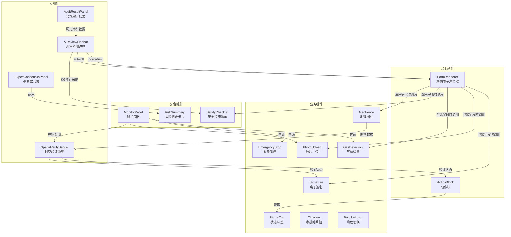

# 00 - 组件总览

> **定位**: 组件清单与依赖关系图，程序员据此搭建 `src/components/` 目录。
> **关联**: [06-技术架构与Mock数据.md](../06-技术架构与Mock数据.md) §2, §5

---

## 1. 组件清单

| 序号 | 组件名 | 路径 | 用途 | 使用页面 |
|------|--------|------|------|---------|
| 01 | FormRenderer | `components/FormRenderer/` | 动态表单渲染（元数据驱动） | 详情页、新建页 |
| 02 | ActionBlock | `components/ActionBlock/` | 动作块（按角色+状态渲染操作按钮） | 详情页、首页 |
| 03 | Signature | `components/Signature/` | 电子签名（Canvas 手写） | 签名页 |
| 04 | PhotoUpload | `components/PhotoUpload/` | 照片上传（拍照+水印） | 新建页、详情页 |
| 05 | GasDetection | `components/GasDetection/` | 气体检测录入 | 详情页 |
| 06 | EmergencyStop | `components/EmergencyStop/` | 紧急叫停按钮 | 详情页 |
| 07 | StatusTag | `components/StatusTag/` | 状态标签（颜色编码） | 详情页、首页 |
| 08 | Timeline | `components/Timeline/` | 审批时间轴 | 详情页 |
| 09 | GeoFence | `components/GeoFence/` | 地理围栏模拟 | 详情页 |
| 10 | RoleSwitcher | `components/RoleSwitcher/` | 角色切换下拉菜单 | 全局（顶部导航） |
| 11 | MonitorPanel | `components/MonitorPanel/` | 监护面板（条件渲染） | 详情页 |
| 12 | SafetyChecklist | `components/SafetyChecklist/` | 安全措施确认清单 | 详情页、新建页 |
| 13 | RiskSummary | `components/RiskSummary/` | 风险摘要卡片 | 详情页 |
| 14 | AIReviewSidebar | `components/ai/AIReviewSidebar/` | 🤖 AI 审查侧边栏（PC右侧/移动端底部抽屉） | 新建页 |
| 15 | AuditResultPanel | `components/ai/AuditResultPanel/` | 🤖 合规审计结果面板 | 详情页 |
| 16 | ExpertConsensusPanel | `components/ai/ExpertConsensusPanel/` | 🤖 多专家共识面板 | 详情页 |
| 17 | SpatialVerifyBadge | `components/ai/SpatialVerifyBadge/` | 🤖 时空验证徽章 | 详情页、签名页 |
| 18 | **DependencyEngine** | `components/DependencyEngine/` | **🔗 作业表依赖引擎（前置依赖、SIMOPS冲突、执行顺序）** | **新建页、详情页、管理后台** |

## 2. 组件依赖关系图

## 3. 组件与页面映射

| 页面 | 使用的组件 |
|------|-----------|
| 首页-待办中心 | StatusTag, ActionBlock, RoleSwitcher |
| 新建作业票 | FormRenderer, PhotoUpload, SafetyChecklist, **AIReviewSidebar** |
| 作业票详情页 | FormRenderer, ActionBlock, StatusTag, Timeline, Signature, MonitorPanel, GeoFence, EmergencyStop, RiskSummary, SafetyChecklist, GasDetection, PhotoUpload, **AuditResultPanel**, **ExpertConsensusPanel**, **SpatialVerifyBadge** |
| 电子签名页 | Signature, **SpatialVerifyBadge** |
| 管理后台 | —（使用 Element Plus 原生组件） |

## 4. 组件文件索引

| 序号 | 文件 | 内容 |
|------|------|------|
| 00 | 本文件 | 组件清单、依赖关系、页面映射 |
| 01 | [01-FormRenderer.md](./01-FormRenderer-动态表单渲染器.md) | 核心：元数据驱动表单渲染 |
| 02 | [02-ActionBlock.md](./02-ActionBlock-动作块.md) | 核心：角色+状态动态操作按钮 |
| 03 | [03-Signature.md](./03-Signature-电子签名.md) | Canvas 手写签名 |
| 04 | [04-PhotoUpload.md](./04-PhotoUpload-照片上传.md) | 拍照+水印+约束卡点 |
| 05 | [05-GasDetection.md](./05-GasDetection-气体检测.md) | 气体检测数值录入 |
| 06 | [06-EmergencyStop.md](./06-EmergencyStop-紧急叫停.md) | 紧急叫停按钮 |
| 07 | [07-StatusTag.md](./07-StatusTag-状态标签.md) | 状态颜色标签 |
| 08 | [08-Timeline.md](./08-Timeline-审批时间轴.md) | 审批流程时间轴 |
| 09 | [09-GeoFence.md](./09-GeoFence-地理围栏.md) | 地理围栏模拟 |
| 10 | [10-RoleSwitcher.md](./10-RoleSwitcher-角色切换.md) | 角色切换下拉 |
| 11 | [11-MonitorPanel.md](./11-MonitorPanel-监护面板.md) | 监护人专属面板 |
| 12 | [12-SafetyChecklist.md](./12-SafetyChecklist-安全措施清单.md) | 安全措施确认清单 |
| 13 | [13-RiskSummary.md](./13-RiskSummary-风险摘要卡片.md) | 审批人风险摘要 |
| 14 | [14-AIReviewSidebar.md](./14-AIReviewSidebar-AI审查侧边栏.md) | 🤖 AI 审查侧边栏 |
| 15 | [15-AuditResultPanel.md](./15-AuditResultPanel-合规审计结果面板.md) | 🤖 合规审计结果面板 |
| 16 | [16-ExpertConsensusPanel.md](./16-ExpertConsensusPanel-多专家共识面板.md) | 🤖 多专家共识面板 |
| 17 | [17-SpatialVerifyBadge.md](./17-SpatialVerifyBadge-时空验证徽章.md) | 🤖 时空验证徽章 |
| 18 | [18-DependencyEngine.md](./18-DependencyEngine-作业表依赖引擎.md) | **🔗 作业表依赖引擎** |
