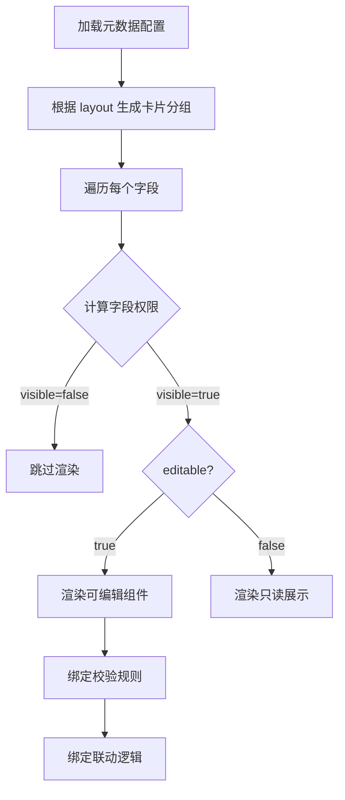

# 01 - FormRenderer 动态表单渲染器

> **组件路径**: `components/FormRenderer/` | **使用页面**: 详情页、新建页 | **技术要点**: 元数据驱动 + 权限控制 + 字段联动
> **关联**: [06-技术架构与Mock数据.md](../06-技术架构与Mock数据.md) §4 / 参考文档 §7.3

---

## 1. 组件定位

整个系统的核心渲染引擎。根据元数据配置（formSchema + layoutConfig + constraintRules + roleViewConfig），动态生成表单 UI，并根据当前角色和状态计算字段权限。

## 2. Props / Events 接口

```typescript
// Props
interface FormRendererProps {
  schema: FieldConfig[]           // 字段定义（元数据）
  layout: LayoutConfig            // 布局配置（卡片分组）
  constraints: ConstraintRules    // 约束规则（联动逻辑）
  roleViewConfig: RoleViewConfig  // 角色视图配置
  currentRole: string             // 当前角色
  currentStatus: PermitStatus     // 当前状态
  formData: Record<string, any>   // 表单数据（v-model）
  readonly?: boolean              // 全局只读模式
}

// Events
interface FormRendererEvents {
  'update:formData': (data: Record<string, any>) => void  // 数据变更
  'field-change': (key: string, value: any) => void        // 单字段变更
  'validate': (errors: ValidationError[]) => void          // 校验结果
  'action': (actionType: string, payload: any) => void     // 字段内操作（如拍照、签名）
}
```

## 3. 视觉规格

- 卡片容器：Element Plus `el-card`（PC）/ Vant `van-cell-group`（移动）
- 字段间距：16px
- 必填标记：红色 `*` 前缀
- 只读字段：灰色背景 + 禁用态
- 隐藏字段：`v-if="false"` 完全不渲染

## 4. 交互行为

### 4.1 渲染流程



### 4.2 权限计算

```typescript
function getFieldPermission(
  fieldKey: string,
  role: string,
  status: PermitStatus,
  fieldConfig: FieldConfig
): FieldPermission {
  // 1. 获取角色基础权限
  const base = fieldConfig.permissions[role] ?? { visible: false, editable: false }
  // 2. 应用状态覆盖
  const override = fieldConfig.stateOverride?.[status]?.[role]
  // 3. Closed 状态一刀切
  if (status === 'Closed') return { ...base, ...override, editable: false }
  return { ...base, ...override }
}
```

### 4.3 字段联动

```typescript
const isFieldVisible = (fieldKey: string) => {
  const rule = constraintRules[fieldKey]?.visibleIf
  if (!rule) return true
  return new Function('data', `return ${rule}`)(formData)
}
```

## 5. 使用场景

| 页面 | 模式 | 说明 |
|------|------|------|
| 新建作业票 | 编辑模式 | 所有字段可编辑（负责人权限） |
| 作业票详情页 | 混合模式 | 根据角色+状态动态计算每个字段的权限 |
| 模板配置器预览 | 预览模式 | 只读展示，用于模板设计器的实时预览 |

## 6. 与其他组件的关系

| 关联组件 | 关系 |
|---------|------|
| Signature | 当字段类型为 `signature` 时，渲染 Signature 组件 |
| PhotoUpload | 当字段类型为 `imageupload` 时，渲染 PhotoUpload 组件 |
| GasDetection | 当字段类型为 `gasdetection` 时，渲染 GasDetection 组件 |
| SafetyChecklist | 当字段类型为 `safetychecklist` 时，渲染 SafetyChecklist 组件 |
| GeoFence | 当约束规则包含地理围栏时，渲染 GeoFence 组件 |

## 7. Demo 简化说明

- 仅实现动火作业的完整元数据配置
- 联动逻辑使用 `new Function` 简单实现，不做沙箱隔离
- 校验规则仅实现必填、最小/最大值、长度限制
