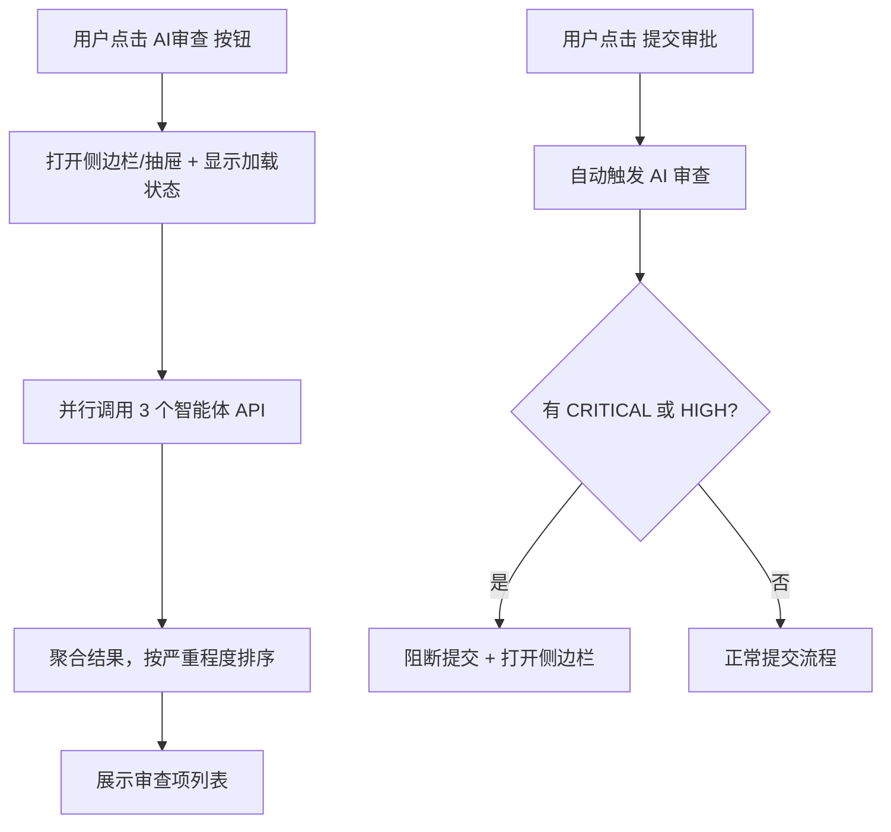

# 14 - AIReviewSidebar AI 审查侧边栏

> **组件路径**: `components/ai/AIReviewSidebar/` | **使用页面**: 新建作业票 | **技术要点**: PC 右侧侧边栏 + 移动端底部抽屉, 字段定位滚动, 一键填入
> **关联**: [02-新建作业票-分步表单.md](../页面/02-新建作业票-分步表单.md) / [ai-agent-engine.md](../../../docs/architecture/ai-agent-engine.md)

---

## 1. 组件定位

新建作业票页面的 AI 审查侧边栏。聚合三个智能体的审查结果（合规审计 + SIMOPs 冲突检测 + 知识图谱推荐），以统一列表形式展示问题和建议。每个审查项支持**定位到对应表单字段**和**一键填入 AI 推荐值**。

**数据来源**:
| 智能体 | 审查内容 | 示例 |
|--------|---------|------|
| Auditor Agent（合规审计） | 法规合规性检查 | 灭火器数量不足、气体检测标准偏低 |
| SIMOPs（冲突检测） | 时空冲突检测 | 与相邻受限空间作业时间重叠 |
| KG Agent（知识图谱） | 安全措施完整性 | 缺少防爆工具配备、建议增加连续气体监测 |

## 2. Props / Events 接口

```typescript
interface AIReviewItem {
  id: string
  source: 'audit' | 'simops' | 'kg'
  severity: 'CRITICAL' | 'HIGH' | 'MEDIUM' | 'LOW'
  field_key?: string              // 关联的表单字段 key（用于定位）
  field_label?: string            // 字段中文名
  description: string             // 问题描述（原因）
  suggestion: string              // 修改建议
  auto_fix_value?: any            // AI 推荐值（有值时显示"一键填入"按钮）
  regulation_ref?: string         // 法规引用（如 GB 30871-2022 §5.3.1）
  status: 'open' | 'fixed' | 'dismissed'
}

interface AIReviewSidebarProps {
  visible: boolean                // v-model 控制显示/隐藏
  items: AIReviewItem[]           // 审查项列表
  complianceScore?: number        // 合规总分 0-100
  loading?: boolean               // 加载状态
}

interface AIReviewSidebarEvents {
  'update:visible': (val: boolean) => void
  'locate-field': (fieldKey: string) => void
  'auto-fill': (fieldKey: string, value: any) => void
  'item-dismiss': (itemId: string) => void
  'retry': () => void             // 重新审查
}
```

## 3. 视觉规格

### 3.1 严重程度标签

| 级别 | 颜色 | 标签 | 含义 | 是否阻断提交 |
|------|------|------|------|-------------|
| CRITICAL | `#F56C6C` 红色 | 🔴 严重 | 违反强制性法规 | ✅ 阻断 |
| HIGH | `#E6A23C` 橙色 | 🟠 高危 | 存在安全隐患或时空冲突 | ✅ 阻断 |
| MEDIUM | `#F2C037` 黄色 | 🟡 建议 | 不符合最佳实践 | ❌ 不阻断 |
| LOW | `#409EFF` 蓝色 | 🔵 提示 | 信息补充建议 | ❌ 不阻断 |

### 3.2 审查项卡片

```text
┌─ [严重程度Tag] ─────────────────────────┐
│ 问题标题（加粗）                         │
│ 问题描述文字，说明原因和影响...          │
│ 📖 GB 30871-2022 §5.3.1  ← 法规引用    │
│                                          │
│ 💡 建议: 修改建议文字...                │
│                                          │
│ [📍 定位]  [✨ 一键填入: 推荐值]        │
└──────────────────────────────────────────┘
```

- 已修复项: 灰色背景 + 删除线 + ✅ 已修复标记
- 已忽略项: 灰色背景 + 折叠，底部显示"已忽略 N 项"

## 4. 线框图

### 4.1 PC 端（右侧侧边栏，宽度 360px）

```text
┌─ 表单内容区域 ──────────────────┐ ┌─ 🤖 AI 审查报告 ──── [×] ─┐
│                                  │ │                             │
│  安全措施确认                    │ │  合规分数: 72/100 ⚠️       │
│  ☑ 办理动火作业票               │ │  🔴 1  🟠 1  🟡 1          │
│  ☑ 进行JSA风险分析              │ │  已修复: 0/3                │
│  ☑ 清理动火现场可燃物           │ │                             │
│  ☑ 配备灭火器材  数量: [2]      │ │ ┌─ 🔴 严重 ──────────────┐│
│     ← 高亮闪烁（定位效果）      │ │ │ 灭火器数量不足          ││
│  ☑ 设置安全警戒区域             │ │ │ 一级动火需≥4具，当前2具 ││
│                                  │ │ │ 📖 GB 30871-2022 §5.3.1││
│  JSA 风险分析                    │ │ │ 💡 调整为4具以上         ││
│  🔴 高 | 可燃气体泄漏            │ │ │ [📍 定位] [✨ 填入: 4]  ││
│  🟡 中 | 火花引燃周边可燃物      │ │ └──────────────────────────┘│
│                                  │ │                             │
│                                  │ │ ┌─ 🟠 高危 ──────────────┐│
│                                  │ │ │ 与受限空间作业时空冲突  ││
│                                  │ │ │ CS-003 距本作业点 6.8m  ││
│                                  │ │ │ 时间重叠 08:00~12:00    ││
│                                  │ │ │ 💡 错开时间或增加监护   ││
│                                  │ │ │ [📍 定位: 计划时间]     ││
│                                  │ │ └──────────────────────────┘│
│                                  │ │                             │
│                                  │ │ ┌─ 🟡 建议 ──────────────┐│
│                                  │ │ │ 建议增加防爆工具配备    ││
│                                  │ │ │ 储罐区历史事故60%涉及   ││
│                                  │ │ │ 工具打火                ││
│                                  │ │ │ 💡 在安全措施中增加     ││
│                                  │ │ │ [📍 定位] [✨ 一键填入] ││
│                                  │ │ └──────────────────────────┘│
│                                  │ │                             │
│  [← 上一步] [草稿] [提交审批→]  │ │  [🔄 重新审查]             │
└──────────────────────────────────┘ └─────────────────────────────┘
```

### 4.2 移动端（底部抽屉，半屏）

```text
┌─────────────────────────────────────────┐
│  ← 动火作业票                            │
│  ✅ 基础信息 → ✅ 人员 → ● 安全措施     │
├─────────────────────────────────────────┤
│                                          │
│  安全措施确认                            │
│  (表单内容，上半部分可见)                │
│                                          │
│                                          │
├─ ━━━━━━━━━━━━━━━━━━━━━━━━━━━━━━━━━━━━ ─┤ ← 拖拽手柄（可上滑全屏）
│  🤖 AI 审查  72分  🔴1 🟠1 🟡1          │
│                                          │
│  ┌─ 🔴 严重 ──────────────────────────┐ │
│  │ 灭火器数量不足                      │ │
│  │ 一级动火需≥4具，当前2具             │ │
│  │ [📍 定位] [✨ 填入: 4]             │ │
│  └─────────────────────────────────────┘ │
│                                          │
│  ┌─ 🟠 高危 ──────────────────────────┐ │
│  │ 与受限空间作业时空冲突              │ │
│  │ (点击展开详情...)                   │ │
│  └─────────────────────────────────────┘ │
│                                          │
│  [🔄 重新审查]                           │
└─────────────────────────────────────────┘
```

### 4.3 加载状态

```text
┌─ 🤖 AI 审查中... ─────────────┐
│                                 │
│  ████████████░░░░░░  60%       │
│                                 │
│  ✅ 合规审计完成                │
│  🔄 冲突检测中...              │
│  ⏳ 知识图谱推荐等待中         │
│                                 │
│  预计 2-3 秒                   │
└─────────────────────────────────┘
```

## 5. 交互行为

### 5.1 触发流程



### 5.2 定位交互

1. 用户点击 [📍 定位] 按钮
2. 移动端: 收起底部抽屉
3. 页面平滑滚动到目标字段
4. 目标字段边框高亮闪烁 3 次（蓝色 `#409EFF`，动画 1.5 秒）
5. 字段获得焦点（可编辑状态）

### 5.3 一键填入交互

1. 用户点击 [✨ 一键填入: 推荐值] 按钮
2. 目标字段值更新为 AI 推荐值
3. 字段边框短暂变绿（成功反馈，0.5 秒）
4. 该审查项状态变为 `fixed`，卡片变灰 + ✅ 标记
5. 顶部"已修复"计数 +1

### 5.4 忽略交互

1. 审查项卡片支持左滑（移动端）或右键菜单（PC端）显示"忽略"选项
2. 忽略后卡片折叠到底部"已忽略"区域
3. 可展开已忽略区域恢复

## 6. 使用场景

| 页面 | 触发条件 | 展示方式 |
|------|---------|---------|
| 新建作业票 Step 4 | 点击 [AI审查] 按钮 | PC: 右侧侧边栏 / 移动端: 底部抽屉 |
| 新建作业票 提交时 | 点击 [提交审批] 自动触发 | 有阻断问题时自动打开 |

## 7. 与其他组件的关系

| 组件 | 关系 |
|------|------|
| FormRenderer | 通过 `locate-field` 事件触发字段滚动和高亮 |
| FormRenderer | 通过 `auto-fill` 事件更新表单数据 |
| SafetyChecklist | KG 推荐的安全措施通过 `auto-fill` 写入 |

## 8. Mock 数据接口

```typescript
// AI 综合审查（聚合 3 个智能体）
POST /api/ai/review
Body: {
  permit_data: Partial<WorkPermit>
}
Response: {
  compliance_score: number,       // 0-100
  items: AIReviewItem[],
  processing_time_ms: number
}

// Mock 实现:
// - 延迟 1200ms 模拟 AI 处理
// - 根据 work_type + work_zone + work_level 返回不同预置审查项
// - 动火 + 1号储罐区 + 一级: 返回 3 个问题（灭火器不足、时空冲突、防爆工具）
// - 动火 + 其他区域 + 二级: 返回 1 个问题（仅建议类）
```

## 9. Demo 简化说明

| 完整产品功能 | Demo 简化方式 |
|-------------|-------------|
| 3 个智能体并行调用 | 单一 Mock 接口返回聚合结果 |
| 实时合规审计 | 仅手动触发，延迟 1200ms 模拟 |
| SIMOPs 三维空间冲突检测 | 预置 1 个冲突场景（与 CS-003 受限空间作业） |
| KG 知识图谱推理 | 预置 2-3 个推荐项，不实现真实图遍历 |
| 字段定位滚动 | 使用 `scrollIntoView({ behavior: 'smooth' })` + CSS 动画 |
| 一键填入 | 直接更新 FormRenderer 的 formData |
