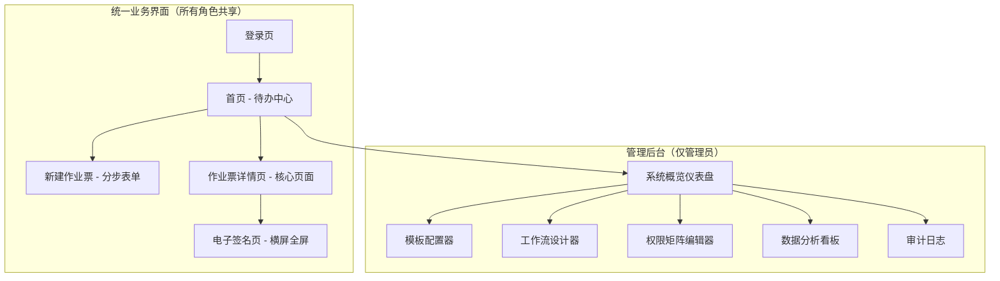
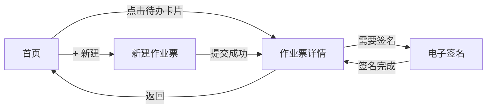
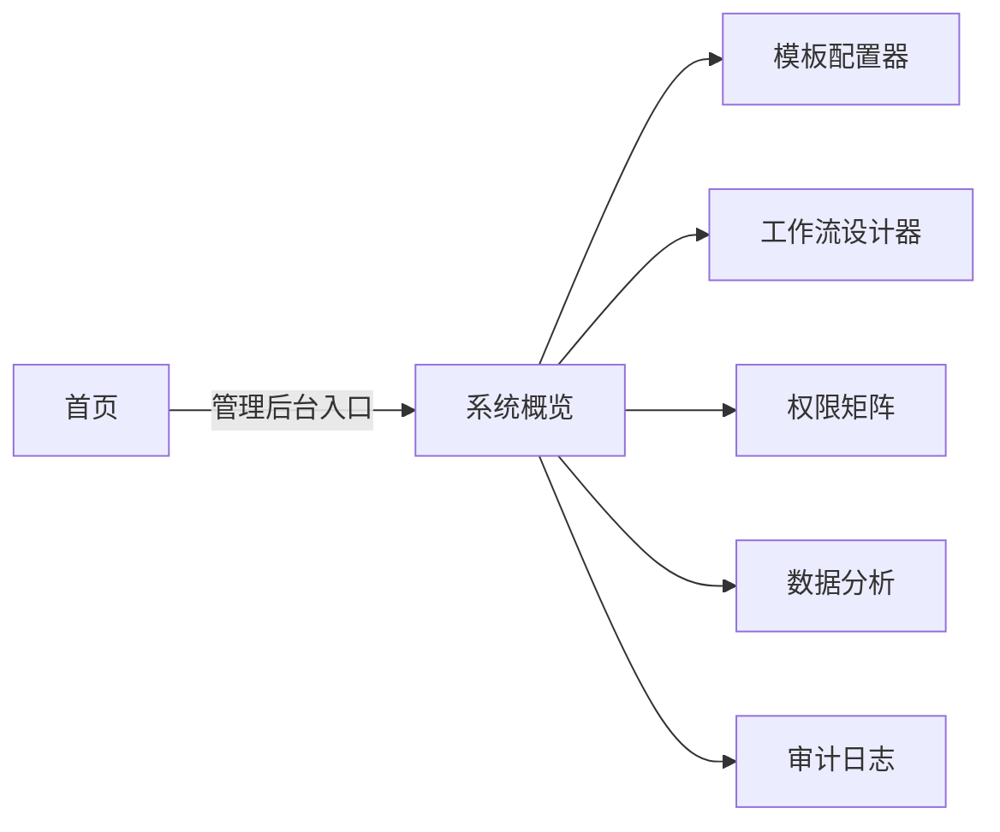

# 00 - 页面总览与导航

> **定位**: 页面架构全景图，程序员据此搭建路由和导航框架。
> **关联**: [03-统一界面设计.md](../03-统一界面设计.md) / [06-技术架构与Mock数据.md](../06-技术架构与Mock数据.md)

---

## 1. 页面架构图



## 2. 路由表

| 路由 | 页面 | 组件文件 | 可见角色 | 说明 |
|------|------|---------|---------|------|
| `/login` | 登录页 | `Login.vue` | 所有 | 角色选择（Demo 简化） |
| `/` | 首页 - 待办中心 | `Home.vue` | 所有角色 | 按角色过滤待办数据 |
| `/permit/new` | 新建作业票 | `permit/Create/` | 负责人、管理员 | 分步表单 |
| `/permit/:id` | 作业票详情 | `permit/Detail.vue` | 所有角色 | 核心页面，权限驱动 |
| `/permit/:id/sign` | 电子签名 | `permit/Sign.vue` | 需签名角色 | 横屏全屏模式 |
| `/admin` | 管理后台 | `admin/` | 仅管理员 | 独立功能模块 |
| `/admin/` | 系统概览 | `admin/Overview.vue` | 仅管理员 | 仪表盘 |
| `/admin/template` | 模板配置器 | `admin/TemplateEditor.vue` | 仅管理员 | 三栏拖拽布局 |
| `/admin/workflow` | 工作流设计器 | `admin/WorkflowDesigner.vue` | 仅管理员 | 可视化状态机 |
| `/admin/permission` | 权限矩阵 | `admin/PermissionMatrix.vue` | 仅管理员 | 三维矩阵编辑 |
| `/admin/analytics` | 数据分析 | `admin/Analytics.vue` | 仅管理员 | 统计图表 |
| `/admin/audit` | 审计日志 | `admin/AuditLog.vue` | 仅管理员 | 操作日志查询 |

## 3. 路由配置代码

```typescript
const routes = [
  { path: '/login', component: Login },
  { path: '/', component: Home },
  { path: '/permit/new', component: Create, meta: { roles: ['applicant', 'admin'] } },
  { path: '/permit/:id', component: Detail },
  { path: '/permit/:id/sign', component: Sign },
  {
    path: '/admin',
    component: AdminLayout,
    meta: { role: 'admin' },
    children: [
      { path: '', component: AdminOverview },
      { path: 'template', component: TemplateEditor },
      { path: 'workflow', component: WorkflowDesigner },
      { path: 'permission', component: PermissionMatrix },
      { path: 'analytics', component: Analytics },
      { path: 'audit', component: AuditLog },
    ]
  },
]
```

## 4. 导航流程

### 4.1 业务操作流程（所有角色）



### 4.2 管理后台流程（仅管理员）



## 5. 页面可见性矩阵

| 页面 | 负责人 | 作业人 | 监护人 | 安全负责人 | 审批人 | 管理员 |
|------|--------|--------|--------|-----------|--------|--------|
| 首页(待办中心) | ✅ | ✅ | ✅ | ✅ | ✅ | ✅ |
| 新建作业票 | ✅ | ❌ | ❌ | ❌ | ❌ | ✅ |
| 作业票详情 | ✅ | ✅ | ✅ | ✅ | ✅ | ✅ |
| 电子签名 | ✅ | ✅ | ✅ | ❌ | ✅ | ✅ |
| 管理后台(全部) | ❌ | ❌ | ❌ | ❌ | ❌ | ✅ |
| 数据分析看板 | ❌ | ❌ | ❌ | ✅(审核) | ✅(审批) | ✅(全局) |

## 6. 页面文件索引

| 序号 | 文件 | 内容 |
|------|------|------|
| 00 | 本文件 | 页面架构、路由表、导航流程 |
| 01 | [01-首页-待办中心.md](./01-首页-待办中心.md) | 待办统计、待办列表、角色差异 |
| 02 | [02-新建作业票-分步表单.md](./02-新建作业票-分步表单.md) | 4步分步表单 |
| 03 | [03-作业票详情页.md](./03-作业票详情页.md) | 核心页面，权限驱动 |
| 04 | [04-电子签名页.md](./04-电子签名页.md) | 横屏全屏签名 |
| 05 | [05-管理后台-系统概览.md](./05-管理后台-系统概览.md) | 仪表盘 |
| 06 | [06-管理后台-模板配置器.md](./06-管理后台-模板配置器.md) | 三栏拖拽设计器 |
| 07 | [07-管理后台-工作流设计器.md](./07-管理后台-工作流设计器.md) | 可视化状态机 |
| 08 | [08-管理后台-权限矩阵编辑器.md](./08-管理后台-权限矩阵编辑器.md) | 三维权限配置 |
| 09 | [09-管理后台-数据分析与审计.md](./09-管理后台-数据分析与审计.md) | 统计看板 + 审计日志 |
