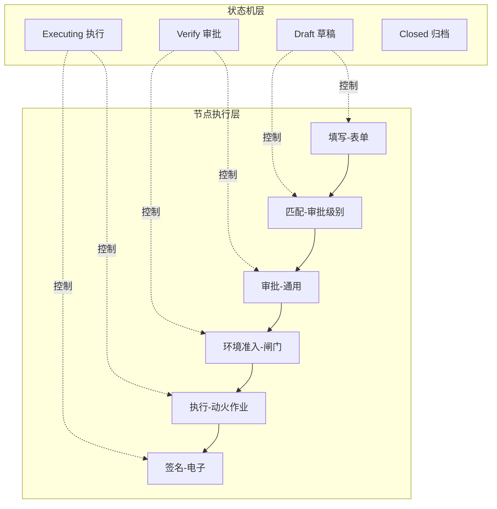

# 06 - 状态机融合机制

## 6.1 核心设计理念

**节点驱动架构与状态机是互补关系，而非替代关系：**

- **状态机（State Machine）**：控制**业务生命周期**和**权限边界**
- **节点图（Node Graph）**：定义**执行流程**和**业务逻辑**



## 6.2 状态与节点的映射关系

### 6.2.1 状态 → 节点阶段映射

| 状态 | 允许执行的节点 | 业务含义 |
|------|--------------|---------|
| **Draft** | 填写-表单<br/>匹配-审批级别<br/>上传-附件 | 申请人填写作业票 |
| **Verify** | 审批-通用<br/>环境准入-闸门<br/>验证-资质证书<br/>签名-电子（审批人） | 审批人审核并签字 |
| **Executing** | 执行-动火作业<br/>签名-电子（作业负责人/监护人） | 现场作业执行 |
| **Closed** | （无可执行节点） | 作业完成归档 |

### 6.2.2 节点配置中的状态约束

在 `nodeLibrary.json` 中为每个节点添加 `allowedStates` 字段：

```json
{
  "id": "填写-表单",
  "type": "FormFieldNode",
  "allowedStates": ["Draft"],
  "config": {
    "formSchemaRef": "hot_work_metadata.json#formSchema"
  }
}
```

```json
{
  "id": "审批-通用",
  "type": "ApprovalNode",
  "allowedStates": ["Verify"],
  "config": {
    "approvalLevelRef": "context.approval_level"
  }
}
```

## 6.3 状态转换触发机制

### 6.3.1 节点完成 → 状态转换

```typescript
// 在 NodeExecutor 中监听节点完成事件
executor.on('nodeComplete', async (nodeId, result) => {
  const currentState = workflowStore.state;

  // Draft 阶段所有节点完成 → 转换到 Verify
  if (currentState === 'Draft' && isPhaseComplete('Draft')) {
    await workflowStore.transitionTo('Verify');
  }

  // Verify 阶段所有节点完成 → 转换到 Executing
  if (currentState === 'Verify' && isPhaseComplete('Verify')) {
    await workflowStore.transitionTo('Executing');
  }

  // Executing 阶段所有节点完成 → 转换到 Closed
  if (currentState === 'Executing' && isPhaseComplete('Executing')) {
    await workflowStore.transitionTo('Closed');
  }
});
```

### 6.3.2 状态约束检查

```typescript
// NodeExecutor.executeNode 前置检查
async executeNode(nodeId: string): Promise<boolean> {
  const node = this.getNode(nodeId);
  const currentState = this.context.state;

  // 检查节点是否允许在当前状态执行
  if (!node.allowedStates.includes(currentState)) {
    throw new Error(
      `节点 ${nodeId} 不允许在状态 ${currentState} 下执行`
    );
  }

  // 继续执行...
}
```

## 6.4 字段级权限控制

### 6.4.1 stateConstraints.json 控制字段可编辑性

节点执行时，从 `stateConstraints.json` 读取当前状态的字段约束：

```typescript
// FormFieldNode 执行时应用状态约束
async executeFormFieldNode(node: any): Promise<boolean> {
  const currentState = this.context.state;
  const constraints = stateConstraints[currentState];

  // 应用只读字段约束
  constraints.readonlyFields.forEach(field => {
    formSchema[field].readonly = true;
  });

  // 应用可编辑字段约束
  constraints.editableFields.forEach(field => {
    formSchema[field].readonly = false;
  });

  return true;
}
```

### 6.4.2 示例：Draft 状态下的字段控制

```typescript
// Draft 状态
{
  "readonlyFields": ["apply_time"],  // 申请时间自动生成，不可编辑
  "editableFields": ["work_zone", "work_level", ...],  // 申请人可填写
  "hiddenFields": ["gas_detection_records", "approver_signature", ...]  // 隐藏审批相关字段
}
```

对应节点执行时：
- `填写-表单` 节点：只渲染 `editableFields` 中的字段
- `匹配-审批级别` 节点：根据 `work_level` 自动计算，无需用户输入

## 6.5 完整工作流示例

### 6.5.1 用户填写作业票（Draft 状态）

```typescript
// 1. 初始状态
workflowStore.state = 'Draft';
workflowStore.currentNodeId = 'n1';

// 2. 执行节点：填写-表单
await executor.executeNode('n1');  // FormFieldNode
// - 应用 Draft 状态的字段约束
// - 用户填写 work_zone, work_level 等字段

// 3. 执行节点：匹配-审批级别
await executor.executeNode('n2');  // RuleNode
// - 根据 work_level 自动匹配审批级别
// - 结果：special → 3级审批

// 4. Draft 阶段完成，自动转换状态
workflowStore.transitionTo('Verify');
```

### 6.5.2 审批人审核（Verify 状态）

```typescript
// 1. 状态已转换
workflowStore.state = 'Verify';
workflowStore.currentNodeId = 'n3';

// 2. 执行节点：审批-通用
await executor.executeNode('n3');  // ApprovalNode
// - 应用 Verify 状态的字段约束
// - 原填写内容变为只读
// - 审批人填写 gas_detection_records, approver_signature

// 3. 执行节点：环境准入-闸门（气体检测+人员核验+安全措施+准入决策）
await executor.executeNode('n6');  // EnvironmentGateNode

// 4. Verify 阶段完成，自动转换状态
workflowStore.transitionTo('Executing');
```

### 6.5.3 现场作业执行（Executing 状态）

```typescript
// 1. 状态已转换
workflowStore.state = 'Executing';
workflowStore.currentNodeId = 'n5';

// 2. 执行节点：执行-动火作业
await executor.executeNode('n5');  // WorkExecutionNode
// - 应用 Executing 状态的字段约束
// - 所有前序内容变为只读
// - 作业负责人和监护人签字

// 3. Executing 阶段完成，自动转换状态
workflowStore.transitionTo('Closed');
```

## 6.6 实现要点

### 6.6.1 Workflow Store 增强

```typescript
// src/stores/workflow.ts
export const useWorkflowStore = defineStore('workflow', {
  state: () => ({
    state: 'Draft',  // 当前状态
    currentNodeId: 'n1',
    executionHistory: [],
    formData: {}
  }),

  actions: {
    async transitionTo(newState: string) {
      // 状态转换前验证
      if (!this.canTransitionTo(newState)) {
        throw new Error(`无法从 ${this.state} 转换到 ${newState}`);
      }

      this.state = newState;
      this.currentNodeId = this.getFirstNodeOfState(newState);
    },

    canTransitionTo(newState: string): boolean {
      const transitions = {
        'Draft': ['Verify'],
        'Verify': ['Executing', 'Draft'],
        'Executing': ['Closed'],
        'Closed': []
      };
      return transitions[this.state].includes(newState);
    }
  }
});
```

### 6.6.2 NodeExecutor 状态感知

```typescript
// src/engine/NodeExecutor.ts
async executeNode(nodeId: string): Promise<boolean> {
  const node = this.getNode(nodeId);
  const currentState = this.context.state;

  // 前置检查：节点是否允许在当前状态执行
  if (node.allowedStates && !node.allowedStates.includes(currentState)) {
    throw new Error(`节点 ${nodeId} 不允许在状态 ${currentState} 下执行`);
  }

  // 加载状态约束
  const constraints = await this.loadStateConstraints(currentState);
  this.context.stateConstraints = constraints;

  // 执行节点
  return await this.executeByType(node);
}
```

### 6.6.3 配置文件更新

在 `nodeLibrary.json` 中为每个节点添加 `allowedStates`：

```json
{
  "nodeLibrary": {
    "layer1_universal": {
      "nodes": [
        {
          "id": "填写-表单",
          "type": "FormFieldNode",
          "allowedStates": ["Draft"],
          "config": {...}
        },
        {
          "id": "审批-通用",
          "type": "ApprovalNode",
          "allowedStates": ["Verify"],
          "config": {...}
        }
      ]
    }
  }
}
```

## 6.7 关键优势

### 6.7.1 职责分离

- **状态机**：管理业务生命周期和权限边界（谁能做什么）
- **节点图**：管理执行流程和业务逻辑（怎么做）

### 6.7.2 灵活性

- 同一状态下可以有多个节点执行
- 节点可以根据条件动态注入（插件机制）
- 状态转换由节点完成情况自动触发

### 6.7.3 向后兼容

- 保留现有 `stateConstraints.json` 配置
- 保留现有状态机逻辑
- 节点驱动架构作为增强层叠加

## 6.8 总结

节点驱动架构与状态机的融合机制：

1. **状态机控制生命周期**：Draft → Verify → Executing → Closed
2. **节点图定义执行流程**：每个状态下允许执行的节点序列
3. **状态约束控制权限**：`stateConstraints.json` 控制字段可编辑性
4. **节点完成触发状态转换**：当前状态的所有节点完成后自动转换
5. **双向验证**：节点执行前检查状态，状态转换前检查节点完成情况
