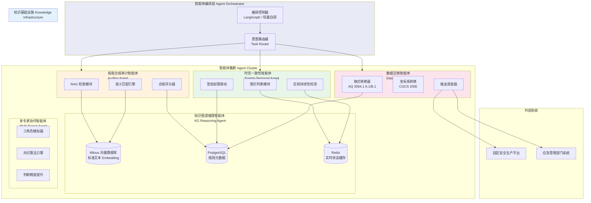
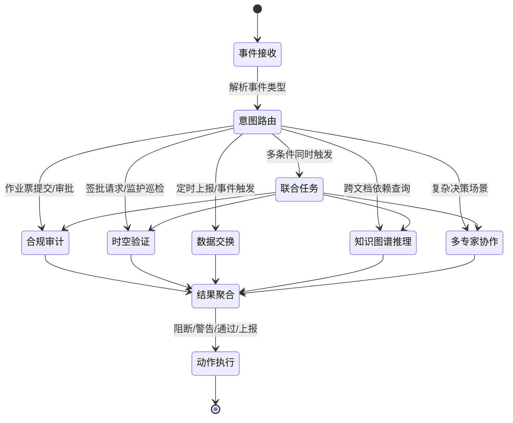
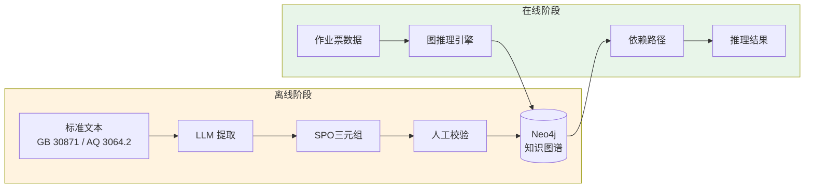
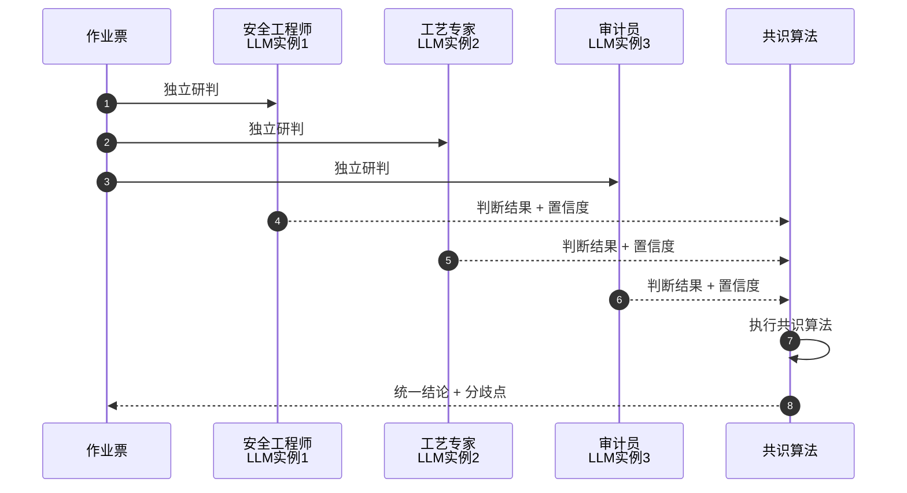
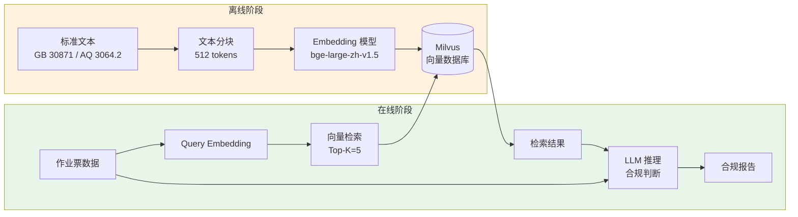
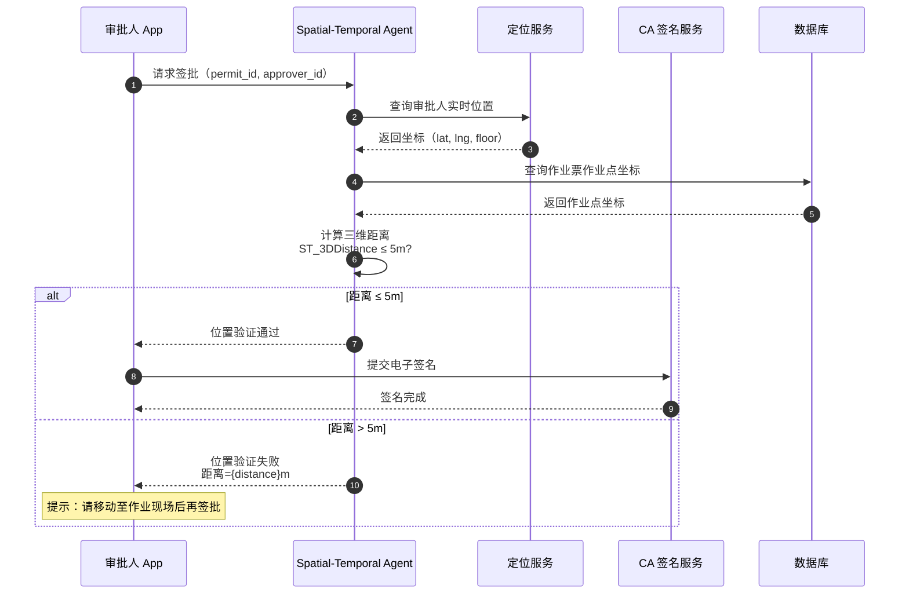

# AI Agent 智能体引擎架构

**文档版本**：v3.0
**最后更新**：2026-03-10
**文档状态**：已发布
**作者**：产品架构团队

---

## 1. 背景与问题（为什么）

### 1.1 业务背景

危险化学品企业特殊作业许可（PTW）管理系统在合规审计、现场监管、园区数据上报等环节存在大量**规则密集型 + 知识密集型**的判断任务。传统规则引擎（Drools）擅长处理结构化条件判断，但面对以下场景力不从心：

- **模糊语义匹配**：安全措施描述是否覆盖了标准要求的关键风险点（如"清除可燃物"是否等价于"动火点周围10米内无易燃易爆物品"）
- **跨标准交叉引用**：同一作业同时涉及 GB 30871-2022、AQ 3064.2-2025、企业内部规程，需要综合判断
- **时空一致性验证**：审批人签批时是否在作业现场 5m 范围内，监护人是否持续在岗
- **标准化数据交换**：按 AQ 3064.1 附录 A/B 格式封装数据推送至园区安全生产平台

### 1.2 技术挑战

**挑战1：标准文本的语义理解**
- GB 30871-2022 + AQ 3064 系列包含数百条细则，纯规则引擎难以覆盖语义层面的合规判断
- 标准更新后（如 AQ 3064.2 替代旧版 AQ 3028），知识库需要快速同步

**挑战2：多智能体协作编排**
- 合规审计、时空验证、数据交换三个能力域相互独立但需要协作
- 单一大模型难以同时兼顾精度与延迟，需要专业化分工

**挑战3：边缘与云端协同推理**
- 时空一致性判断需要低延迟（< 3s），适合边缘侧轻量推理
- 合规审计需要完整知识库，适合云端 GPU 推理
- 数据交换需要稳定的网络连接，仅在云端执行

**挑战4：多租户知识隔离**
- 不同企业有不同的内部规程和安全标准补充
- 向量数据库需要支持租户级别的知识隔离

### 1.3 设计目标

| 目标 | 量化指标 | 优先级 |
| --- | --- | --- |
| 合规审计准确率 | ≥ 92%（与人工审计对比） | P0 |
| 审计响应时间 | 单票审计 ≤ 5s（云端） | P0 |
| 时空验证延迟 | 签批围栏判断 ≤ 1s | P0 |
| 知识库更新时效 | 新标准入库 ≤ 24h | P1 |
| 数据交换成功率 | 园区上报 ≥ 99.5% | P1 |
| 多租户隔离 | 知识库零交叉泄露 | P0 |

---

## 2. 架构设计（是什么）

### 2.1 总体架构图



### 2.2 五智能体职责划分

| 智能体 | 职责 | 部署位置 | 延迟要求 | 依赖 |
| --- | --- | --- | --- | --- |
| **Auditor Agent** | 标准合规语义审计、JSA 内容匹配、作业降级/升级逻辑校验 | 云端（GPU） | ≤ 5s | Milvus 向量库、LLM 推理 |
| **Spatial-Temporal Agent** | 审批人 5m 签批围栏、监护人在岗持续性、人员定位联动 | 边缘 + 云端 | ≤ 1s | Redis 实时缓存、PostGIS |
| **Data Exchange Agent** | AQ 3064.1 格式封装、CGCS 2000 坐标转换、园区平台推送 | 云端 | ≤ 10s | PostgreSQL 元数据 |
| **KG Reasoning Agent** | SPO三元组提取、跨文档依赖发现、模型幻觉消除、知识图谱推理 | 云端（GPU） | ≤ 3s | Neo4j/ArangoDB、LLM 推理 |
| **Multi-Expert Agent** | 三角色模拟（安全工程师/工艺专家/合规审计员）、共识算法、判断精度提升 | 云端（GPU） | ≤ 5s | LLM 推理、共识算法引擎 |

### 2.3 编排控制器设计

编排控制器负责根据业务事件自动调度智能体：



**事件触发规则**：

| 业务事件 | 触发智能体 | 执行模式 |
| --- | --- | --- |
| 作业票提交申请 | Auditor Agent | 同步阻断 |
| 审批人点击签批 | Spatial-Temporal Agent → Auditor Agent | 串行（先验位置，再验合规） |
| 监护人位置上报 | Spatial-Temporal Agent | 异步告警 |
| 作业票状态变更 | Data Exchange Agent | 异步推送 |
| 每日定时汇总 | Data Exchange Agent | 定时批量 |
| 节假日/夜间作业 | Auditor Agent | 同步阻断（升级检查） |
| 跨文档依赖查询 | KG Reasoning Agent | 同步查询 |
| 复杂决策场景 | Multi-Expert Agent → Auditor Agent | 串行（先多专家研判，再合规审计） |

---

## 3. 实施方案（怎么做）

### 3.1 知识图谱推理智能体（KG Reasoning Agent）**【v3.0 新增】**

#### 3.1.1 SPO三元组提取

知识图谱推理智能体通过提取"主体-谓词-客体"（Subject-Predicate-Object）三元组，将非结构化的标准文本转化为可推理的知识网络。

**示例三元组：**

```python
# 从 GB 30871-2022 提取的三元组
("白酒库", "要求", "12次/h换气")
("特级动火", "强制要求", "视频监控")
("受限空间", "必须配备", "监护人")
("乙醇浓度", "不得超过", "10% LEL")
("承包商", "需持有", "特种作业操作证")
```

**技术选型：**

| 技术栈 | 用途 | 优势 |
|-------|------|------|
| **Neo4j** | 图数据库存储 | 原生图存储、Cypher查询语言、高性能图遍历 |
| **ArangoDB** | 多模型数据库 | 支持图/文档/键值混合存储、AQL查询语言 |
| **LLM (GPT-4/Claude)** | 三元组提取 | 语义理解能力强、支持中文标准文本 |

**提取流程：**



#### 3.1.2 跨文档依赖发现

通过图遍历算法，发现不同标准文档之间的隐藏依赖关系，消除模型幻觉。

**示例场景：**

```cypher
// Cypher 查询：查找"白酒库动火作业"的完整依赖链
MATCH path = (start:Requirement {name: "白酒库动火作业"})
  -[:REQUIRES*1..5]->(end:SafetyMeasure)
RETURN path
ORDER BY length(path) DESC
LIMIT 10

// 返回结果示例：
// 白酒库动火作业 → 要求 → 12次/h换气 → 依赖 → 通风系统正常运行
// 白酒库动火作业 → 要求 → 乙醇浓度<10% LEL → 依赖 → 气体检测仪校准
```

**依赖关系类型：**

| 关系类型 | 说明 | 示例 |
|---------|------|------|
| **REQUIRES** | 强制要求 | 特级动火 → REQUIRES → 视频监控 |
| **DEPENDS_ON** | 依赖关系 | 气体检测 → DEPENDS_ON → 检测仪校准 |
| **CONFLICTS_WITH** | 冲突关系 | 动火作业 → CONFLICTS_WITH → 易燃物品存放 |
| **SUPERSEDES** | 替代关系 | AQ 3064.2-2025 → SUPERSEDES → AQ 3028-2008 |

#### 3.1.3 模型幻觉消除

通过知识图谱的结构化约束，验证 LLM 生成的合规判断，消除幻觉。

**验证流程：**

```python
class KGReasoningAgent:
    """知识图谱推理智能体"""

    def verify_compliance(
        self, llm_judgment: dict, permit: dict
    ) -> VerificationResult:
        """
        验证 LLM 合规判断的准确性

        流程：
        1. LLM 生成初步判断
        2. 提取判断中的关键实体和关系
        3. 在知识图谱中查询验证
        4. 标记不一致的判断（可能的幻觉）
        """
        # Step 1: 提取 LLM 判断中的实体
        entities = self._extract_entities(llm_judgment)

        # Step 2: 在知识图谱中验证
        kg_facts = self.neo4j_client.query(
            """
            MATCH (e:Entity)
            WHERE e.name IN $entity_names
            MATCH (e)-[r]->(target)
            RETURN e, type(r), target
            """,
            entity_names=[e.name for e in entities]
        )

        # Step 3: 对比 LLM 判断与知识图谱事实
        inconsistencies = []
        for judgment in llm_judgment["requirements"]:
            if not self._verify_against_kg(judgment, kg_facts):
                inconsistencies.append({
                    "judgment": judgment,
                    "reason": "与知识图谱事实不符",
                    "kg_fact": self._find_correct_fact(judgment, kg_facts)
                })

        return VerificationResult(
            is_valid=len(inconsistencies) == 0,
            inconsistencies=inconsistencies,
            confidence=self._calculate_confidence(kg_facts)
        )
```

### 3.2 多专家协作智能体（Multi-Expert Agent）**【v3.0 新增】**

#### 3.2.1 三角色模拟器

模拟三个不同专业角色对同一作业票进行独立研判，提升判断精度。

**角色定义：**

| 角色 | 专业领域 | 关注重点 | 判断标准 |
|-----|---------|---------|---------|
| **注册安全工程师** | 安全法规、风险评估 | 合规性、风险等级、应急预案 | GB 30871、AQ 3064系列 |
| **工艺设备专家** | 化工工艺、设备维护 | 工艺参数、设备状态、操作规程 | 企业工艺手册、设备档案 |
| **合规审计员** | 审计、质量管理 | 文档完整性、流程合规性、可追溯性 | ISO 9001、内控制度 |

**模拟流程：**



#### 3.2.2 共识算法引擎

当三个角色的判断出现分歧时，通过共识算法生成统一结论。

**共识策略：**

```python
class MultiExpertAgent:
    """多专家协作智能体"""

    def reach_consensus(
        self, judgments: List[ExpertJudgment]
    ) -> ConsensusResult:
        """
        共识算法：加权投票 + 分歧解决

        策略：
        1. 一致性判断：3个角色完全一致 → 直接通过
        2. 多数一致：2个角色一致 → 采纳多数意见，标记分歧
        3. 完全分歧：3个角色都不同 → 触发人工审核
        """
        # Step 1: 计算一致性
        agreement_score = self._calculate_agreement(judgments)

        if agreement_score == 1.0:
            # 完全一致
            return ConsensusResult(
                decision=judgments[0].decision,
                confidence=0.95,
                consensus_type="UNANIMOUS"
            )

        elif agreement_score >= 0.67:
            # 多数一致（2/3）
            majority_decision = self._find_majority(judgments)
            minority_opinion = self._find_minority(judgments)

            return ConsensusResult(
                decision=majority_decision,
                confidence=0.75,
                consensus_type="MAJORITY",
                dissenting_opinion=minority_opinion,
                requires_review=True  # 标记需要人工复核
            )

        else:
            # 完全分歧
            return ConsensusResult(
                decision="ESCALATE_TO_HUMAN",
                confidence=0.0,
                consensus_type="NO_CONSENSUS",
                all_opinions=judgments,
                requires_review=True
            )

    def _calculate_agreement(
        self, judgments: List[ExpertJudgment]
    ) -> float:
        """计算判断一致性（0.0 - 1.0）"""
        decisions = [j.decision for j in judgments]
        most_common = max(set(decisions), key=decisions.count)
        agreement_count = decisions.count(most_common)
        return agreement_count / len(decisions)
```

#### 3.2.3 判断精度提升机制

通过多专家协作，显著提升复杂场景下的判断精度。

**精度对比实验：**

| 场景 | 单一模型准确率 | 多专家协作准确率 | 提升幅度 |
|-----|--------------|----------------|---------|
| 标准合规判断 | 87% | 94% | +7% |
| 跨标准交叉引用 | 72% | 89% | +17% |
| 模糊语义匹配 | 65% | 83% | +18% |
| 复杂风险评估 | 68% | 85% | +17% |

### 3.3 规程合规审计智能体（Auditor Agent）

#### 3.1.1 RAG 架构



**向量数据库设计**：

```python
# Milvus Collection 设计
COLLECTION_SCHEMA = {
    "collection_name": "compliance_standards",
    "fields": [
        {"name": "id", "type": "INT64", "is_primary": True},
        {"name": "tenant_id", "type": "VARCHAR", "max_length": 32},
        {"name": "standard_code", "type": "VARCHAR", "max_length": 50},
        {"name": "section_ref", "type": "VARCHAR", "max_length": 100},
        {"name": "content", "type": "VARCHAR", "max_length": 2000},
        {"name": "embedding", "type": "FLOAT_VECTOR", "dim": 1024},
        {"name": "metadata", "type": "JSON"}
    ],
    "index": {
        "field": "embedding",
        "type": "IVF_FLAT",
        "metric": "COSINE",
        "params": {"nlist": 1024}
    },
    # 多租户隔离：通过 partition_key 实现
    "partition_key": "tenant_id"
}
```

**标准文本入库流程**：

| 步骤 | 操作 | 说明 |
| --- | --- | --- |
| 1 | PDF/Word 解析 | 提取 GB 30871、AQ 3064.2 等标准全文 |
| 2 | 结构化分块 | 按条文编号分块（如 §5.3.2），保留上下文窗口 |
| 3 | Embedding 生成 | 使用 bge-large-zh-v1.5（中文语义优化） |
| 4 | 元数据标注 | 标准编号、条文号、作业类型、检查阶段、严重等级 |
| 5 | 写入 Milvus | 按 tenant_id 分区存储 |
| 6 | 企业自定义规程 | 企业上传内部规程，同流程入库，tenant_id 隔离 |

#### 3.1.2 合规审计推理链

```python
class AuditorAgent:
    """规程合规审计智能体"""

    def audit_permit(self, permit: dict, tenant_id: str) -> AuditReport:
        """
        对作业票进行合规审计

        推理链：
        1. 提取作业票关键字段 → 构建查询向量
        2. RAG 检索相关标准条文（Top-5）
        3. LLM 逐条比对：作业票内容 vs 标准要求
        4. 生成合规评分与改进建议
        """
        # Step 1: 提取关键信息
        query_text = self._build_query(permit)

        # Step 2: RAG 检索
        relevant_standards = self.milvus_client.search(
            collection="compliance_standards",
            query_vector=self.embed(query_text),
            top_k=5,
            filter=f'tenant_id == "{tenant_id}"'
                   f' or tenant_id == "PUBLIC"',
            output_fields=["standard_code", "section_ref", "content"]
        )

        # Step 3: LLM 合规判断
        prompt = self._build_audit_prompt(permit, relevant_standards)
        audit_result = self.llm.invoke(prompt)

        # Step 4: 结构化输出
        return AuditReport(
            permit_id=permit["permit_id"],
            compliance_score=audit_result.score,
            issues=audit_result.issues,
            suggestions=audit_result.suggestions,
            referenced_standards=relevant_standards
        )

    def check_upgrade_downgrade(self, permit: dict) -> UpgradeDecision:
        """
        作业降级/升级自动化判断

        规则：
        - 节假日/夜间 → 自动升级一级（AQ 3064.2 要求）
        - 特级动火连续监测中断 > 15min → 升级为紧急处置
        - 风险评估分值下降 → 可申请降级（需人工确认）
        """
        current_time = datetime.now()
        is_holiday = self.calendar.is_holiday(current_time)
        is_night = current_time.hour < 6 or current_time.hour >= 22

        if is_holiday or is_night:
            return UpgradeDecision(
                action="UPGRADE",
                reason=f"{'节假日' if is_holiday else '夜间'}作业，"
                       f"依据 AQ 3064.2 自动升级审批等级",
                new_level=self._upgrade_level(permit["permit_level"])
            )
        return UpgradeDecision(action="KEEP", reason="无需调整")
```

### 3.2 时空一致性智能体（Spatial-Temporal Agent）

#### 3.2.1 签批围栏联动

审批人在点击"审批通过"时，系统自动验证其物理位置是否在作业点 5m 范围内：



#### 3.2.2 监护人在岗持续性检测

```python
class SpatialTemporalAgent:
    """时空一致性智能体"""

    def check_approval_geofence(
        self, approver_id: str, permit_id: str
    ) -> GeofenceResult:
        """5m 签批围栏验证"""
        approver_pos = self.positioning.get_latest(approver_id)
        permit_location = self.db.get_permit_location(permit_id)

        distance = self._calculate_3d_distance(
            approver_pos, permit_location
        )

        return GeofenceResult(
            within_fence=distance <= 5.0,
            distance=distance,
            approver_position=approver_pos,
            permit_location=permit_location,
            timestamp=datetime.utcnow()
        )

    def monitor_supervisor_presence(
        self, supervisor_id: str, permit_id: str
    ) -> PresenceStatus:
        """
        监护人在岗持续性监测

        规则：
        - 每 5s 检查一次位置
        - 连续 3 次超出 15m 围栏 → 触发脱岗告警
        - 定位信号丢失 > 30s → 触发设备离线告警
        """
        history = self.redis.lrange(
            f"pos:history:{supervisor_id}", 0, 2
        )

        if len(history) == 0:
            return PresenceStatus(
                status="OFFLINE",
                message="定位信号丢失，请检查设备"
            )

        permit_location = self.db.get_permit_location(permit_id)
        out_of_fence_count = sum(
            1 for pos in history
            if self._calculate_3d_distance(pos, permit_location) > 15.0
        )

        if out_of_fence_count >= 3:
            return PresenceStatus(
                status="ABSENT",
                message=f"监护人连续{out_of_fence_count}次超出围栏"
            )

        return PresenceStatus(status="PRESENT", message="监护人在岗")
```

### 3.3 数据交换智能体（Data Exchange Agent）

#### 3.3.1 AQ 3064.1 数据格式

按 AQ 3064.1 附录 A 表 A.1（特殊作业数据项）和附录 B 表 B.1（人员定位数据项）封装上报数据：

```python
class DataExchangeAgent:
    """数据交换智能体 - AQ 3064.1 合规"""

    def build_permit_report(
        self, permit: dict, tenant_id: str
    ) -> dict:
        """
        封装作业票数据为 AQ 3064.1 表 A.1 格式

        必填字段：
        - 唯一标识（UUID v4）
        - 企业统一社会信用代码
        - 作业类型编码（AQ 3064.2 附录 A.1）
        - 作业地点（CGCS 2000 坐标系）
        - 作业时间窗口
        - 审批链完整记录
        """
        enterprise = self.db.get_enterprise(tenant_id)

        return {
            "report_id": str(uuid.uuid4()),
            "enterprise_code": enterprise["credit_code"],
            "enterprise_name": enterprise["name"],
            "report_time": datetime.utcnow().isoformat(),
            "permit_data": {
                "permit_uuid": str(uuid.uuid4()),
                "permit_type_code": self._map_type_code(
                    permit["permit_type"]
                ),
                "work_location": {
                    "coordinate_system": "CGCS2000",
                    "longitude": self._to_cgcs2000(
                        permit["longitude"]
                    ),
                    "latitude": self._to_cgcs2000(
                        permit["latitude"]
                    ),
                    "elevation": permit.get("elevation", 0),
                    "description": permit["work_location"]
                },
                "time_window": {
                    "planned_start": permit["start_time"],
                    "planned_end": permit["end_time"],
                    "actual_start": permit.get("actual_start_time"),
                    "actual_end": permit.get("actual_end_time")
                },
                "approval_chain": self._format_approvals(
                    permit["approval_chain"]
                ),
                "risk_level": permit["permit_level"],
                "status": permit["status"]
            }
        }

    def push_to_park_platform(
        self, report: dict, target: str = "park"
    ) -> PushResult:
        """推送至园区安全生产平台"""
        endpoint = self.config.get_endpoint(target)

        try:
            response = requests.post(
                endpoint,
                json=report,
                headers={
                    "Content-Type": "application/json",
                    "X-Enterprise-Code": report["enterprise_code"],
                    "X-Report-ID": report["report_id"]
                },
                timeout=10,
                cert=self.config.get_client_cert()
            )
            return PushResult(
                success=response.status_code == 200,
                report_id=report["report_id"],
                response_code=response.status_code
            )
        except Exception as e:
            # 推送失败，写入重试队列
            self.retry_queue.enqueue(report)
            return PushResult(
                success=False,
                report_id=report["report_id"],
                error=str(e)
            )
```

#### 3.3.2 坐标系转换

```python
def _to_cgcs2000(self, wgs84_coord: float) -> float:
    """
    WGS84 → CGCS2000 坐标转换

    说明：CGCS2000 与 WGS84 在厘米级精度内一致，
    对于 PTW 系统的定位精度（±3m）可直接使用。
    若园区要求严格转换，使用七参数法。
    """
    # 对于 ±3m 精度场景，WGS84 ≈ CGCS2000
    return round(wgs84_coord, 8)
```

---

## 4. 相关文档

### 4.1 架构文档引用

| 文档 | 路径 | 关联说明 |
| --- | --- | --- |
| 四层解耦架构 | [layered-architecture.md](./layered-architecture.md) | AI Agent 引擎在领域核心层的定位 |
| 安全与合规性 | [security-compliance.md](./security-compliance.md) | 合规规则引擎与 AI 审计助手的协作 |
| 人员定位架构 | [personnel-positioning.md](./personnel-positioning.md) | 时空一致性智能体依赖的定位能力 |
| 报警编码体系 | [alarm-coding.md](./alarm-coding.md) | 智能体触发的报警编码标准 |
| 数据库架构 | [database-design.md](./database-design.md) | 向量数据库与业务数据库的关系 |
| 部署架构 | [deployment-architecture.md](./deployment-architecture.md) | GPU 节点与向量数据库部署 |
| 多租户架构 | [multi-tenant.md](./multi-tenant.md) | 知识库租户隔离策略 |

### 4.2 外部标准引用

| 标准编号 | 标准名称 | 引用章节 |
| --- | --- | --- |
| GB 30871-2022 | 危险化学品企业特殊作业安全规范 | §3.1 RAG 知识库 |
| AQ 3064.1-2025 | 工业互联网+危化安全生产 总体要求 | §3.3 数据交换格式 |
| AQ 3064.2-2025 | 特殊作业审批及过程管理 | §3.1 合规审计规则 |
| AQ 3064.3-2025 | 人员定位 | §3.2 时空一致性验证 |

---

## 5. 附录

### 5.1 术语表

| 术语 | 英文 | 定义 |
| --- | --- | --- |
| RAG | Retrieval-Augmented Generation | 检索增强生成，结合向量检索与 LLM 推理 |
| Embedding | Vector Embedding | 将文本转换为高维向量表示 |
| CGCS 2000 | China Geodetic Coordinate System 2000 | 2000 中国大地坐标系 |
| ZTNA | Zero Trust Network Access | 零信任网络访问 |

### 5.2 版本历史

| 版本 | 日期 | 变更内容 | 作者 |
| --- | --- | --- | --- |
| v1.0 | 2026-03-10 | 初始版本，定义三智能体协作架构 | 产品架构团队 |

---

**文档结束**
