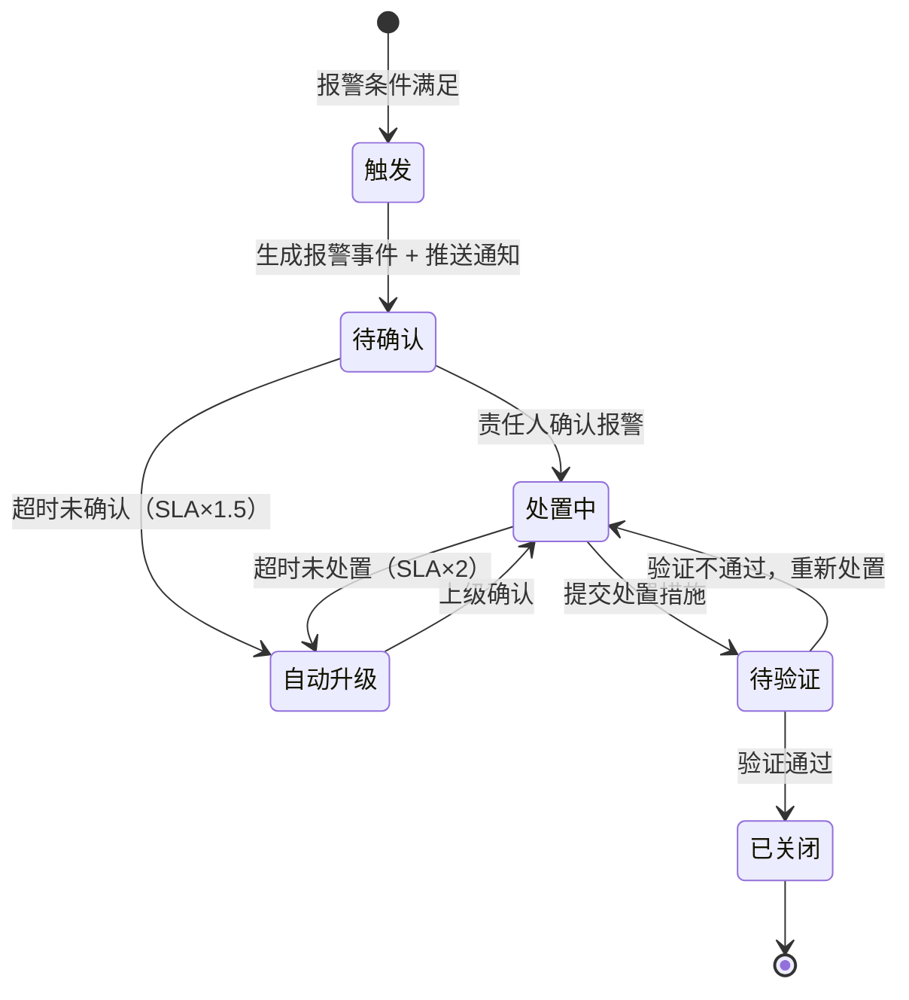
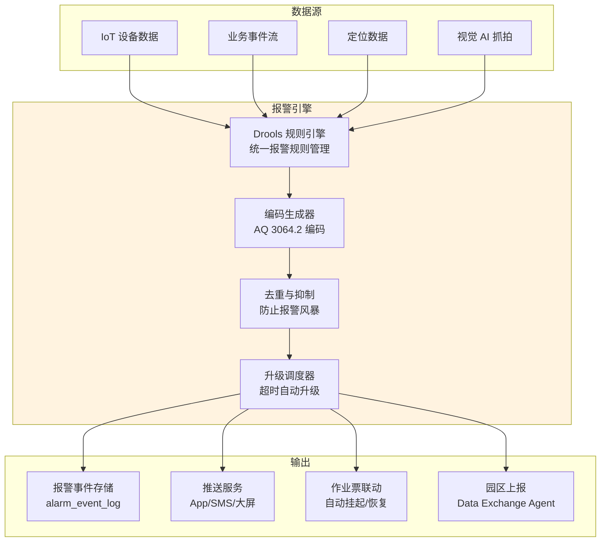

# 报警编码体系架构

**文档版本**：v1.0
**最后更新**：2026-03-10
**文档状态**：已发布
**作者**：产品架构团队

---

## 1. 背景与问题（为什么）

### 1.1 业务背景

现有 PTW 系统采用简单阈值报警（LEL/O2/H2S/CO 四级），缺乏标准化编码体系。AQ 3064.2-2025 附录 A.4 要求建立统一的报警编码规范，覆盖设备报警和业务报警两大类，实现报警的标准化管理、闭环处置和统计分析。

### 1.2 现状差距

| 维度 | 现有能力 | AQ 3064.2 要求 | 差距 |
| --- | --- | --- | --- |
| 报警编码 | 无编码，仅文本描述 | 类型码(2位)+子类码(2位)+严重等级(1位) | 缺失 |
| 报警类型 | 仅 IoT 设备报警（4类） | 设备报警 + 业务报警（6+类） | 缺少业务报警 |
| 报警闭环 | push/sms 推送后无跟踪 | 报警→确认→处置→反馈→关闭 | 缺少闭环 |
| 统计分析 | 无 | 按编码维度统计趋势 | 缺失 |
| 视觉 AI | 无 | 未办票作业检测（P1） | 缺失 |

### 1.3 设计目标

| 目标 | 量化指标 | 优先级 |
| --- | --- | --- |
| 编码覆盖率 | 100% 报警事件有标准编码 | P0 |
| 报警闭环率 | ≥ 95% 报警在 SLA 内闭环 | P0 |
| 报警响应时效 | 极高级 ≤ 10s，高级 ≤ 30s | P0 |
| 误报率 | 设备报警 < 5%，业务报警 < 10% | P1 |

---

## 2. 架构设计（是什么）

### 2.1 报警编码规范（AQ 3064.2 附录 A.4）

编码格式：`{类型码2位}-{子类码2位}-{严重等级1位}`

示例：`01-01-4` = 气体报警-LEL超标-极高级

#### 2.1.1 类型码定义

| 类型码 | 类型名称 | 说明 |
| --- | --- | --- |
| 01 | 气体报警 | LEL/O2/H2S/CO 等气体浓度异常 |
| 10 | 超时报警 | 作业超时、审批超时、气体分析过期 |
| 20 | 设备报警 | IoT 设备离线、电量低、校准过期 |
| 31 | 人员报警 | 监护人脱岗、人员越界、资质过期 |
| 40 | 合规报警 | 节假日未升级、安全措施不完整、未办票作业 |
| 60 | 系统报警 | 服务异常、数据同步失败、存储告警 |

#### 2.1.2 子类码定义（核心类型展开）

**01 气体报警**：

| 子类码 | 名称 | 触发条件 |
| --- | --- | --- |
| 01-01 | LEL 超标 | 可燃气体浓度 > 阈值 |
| 01-02 | O2 异常 | 氧含量 < 19.5% 或 > 21.0% |
| 01-03 | H2S 超标 | 硫化氢浓度 > 阈值 |
| 01-04 | CO 超标 | 一氧化碳浓度 > 阈值 |
| 01-05 | 乙醇蒸气超标 | 白酒行业：乙醇蒸气浓度 > 阈值（AQ 7006） |

**10 超时报警**：

| 子类码 | 名称 | 触发条件 |
| --- | --- | --- |
| 10-01 | 作业超时 | 实际作业时长 > 计划时长 |
| 10-02 | 审批超时 | 待审批时间 > SLA（默认 1h） |
| 10-03 | 气体分析过期 | 距上次分析 > 30min（动火作业） |
| 10-04 | 作业票到期 | 作业票有效期即将到期（提前 30min） |

**31 人员报警**：

| 子类码 | 名称 | 触发条件 |
| --- | --- | --- |
| 31-01 | 监护人脱岗 | 连续 3 次超出 15m 围栏 |
| 31-02 | 人员越界 | 进入未授权区域 |
| 31-03 | 资质过期 | 特种作业证书已过期 |
| 31-04 | 签批位置异常 | 审批人不在 5m 签批围栏内 |

**40 合规报警**：

| 子类码 | 名称 | 触发条件 |
| --- | --- | --- |
| 40-01 | 节假日未升级 | 节假日/夜间作业未升级审批等级 |
| 40-02 | 安全措施不完整 | AI 审计判定安全措施覆盖率 < 80% |
| 40-03 | 未办票作业 | 视觉 AI 检测到未持票作业行为 |
| 40-04 | 交叉作业未审批 | SIMOPs 检测到冲突但未联合审批 |

#### 2.1.3 严重等级定义

| 等级码 | 等级名称 | 响应时效 | 自动动作 | 通知范围 |
| --- | --- | --- | --- | --- |
| 4 | 极高 | ≤ 10s | 立即挂起作业票 + 触发疏散 | 全员 + 应急指挥 |
| 3 | 高 | ≤ 30s | 挂起作业票 + 现场警报 | 监护人 + 车间主任 |
| 2 | 中 | ≤ 60s | 发送警告通知 | 监护人 + 作业人员 |
| 1 | 低 | ≤ 5min | 记录日志 + 运维通知 | 运维人员 |

### 2.2 报警闭环流程



### 2.3 报警引擎架构



---

## 3. 实施方案（怎么做）

### 3.1 报警编码注册表

```sql
-- 报警编码注册表（PostgreSQL）
CREATE TABLE alarm_code_registry (
    alarm_code      VARCHAR(10) PRIMARY KEY
                    COMMENT '报警编码（如 01-01-4）',
    type_code       CHAR(2) NOT NULL,
    sub_type_code   CHAR(2) NOT NULL,
    severity_level  SMALLINT NOT NULL CHECK (severity_level BETWEEN 1 AND 4),
    alarm_name      VARCHAR(100) NOT NULL,
    description     TEXT,
    -- 响应配置
    response_sla_seconds INT NOT NULL,
    auto_actions    JSONB,
    notify_targets  JSONB,
    -- 关联标准
    standard_ref    VARCHAR(100),
    -- 状态
    is_active       BOOLEAN DEFAULT TRUE,
    created_at      TIMESTAMPTZ DEFAULT NOW(),
    updated_at      TIMESTAMPTZ DEFAULT NOW(),

    UNIQUE (type_code, sub_type_code, severity_level)
);

-- 报警事件记录表
CREATE TABLE alarm_event_log (
    event_id        VARCHAR(32) PRIMARY KEY,
    tenant_id       VARCHAR(32) NOT NULL,
    alarm_code      VARCHAR(10) NOT NULL REFERENCES alarm_code_registry(alarm_code),
    -- 关联信息
    permit_id       VARCHAR(32),
    device_id       VARCHAR(32),
    person_id       VARCHAR(32),
    -- 报警详情
    trigger_value   JSONB NOT NULL,
    trigger_time    TIMESTAMPTZ NOT NULL,
    location        GEOMETRY(POINTZ, 4326),
    -- 闭环状态
    status          VARCHAR(20) NOT NULL DEFAULT 'TRIGGERED'
                    CHECK (status IN (
                        'TRIGGERED', 'PENDING_ACK',
                        'ACKNOWLEDGED', 'IN_PROGRESS',
                        'PENDING_VERIFY', 'CLOSED',
                        'ESCALATED', 'SUPPRESSED'
                    )),
    acknowledged_by VARCHAR(32),
    acknowledged_at TIMESTAMPTZ,
    resolved_by     VARCHAR(32),
    resolved_at     TIMESTAMPTZ,
    resolution_note TEXT,
    -- 升级记录
    escalation_count SMALLINT DEFAULT 0,
    escalated_to    VARCHAR(32),
    -- 审计
    created_at      TIMESTAMPTZ DEFAULT NOW(),

    CONSTRAINT fk_alarm_tenant FOREIGN KEY (tenant_id)
        REFERENCES tenant(tenant_id)
);

CREATE INDEX idx_alarm_event_tenant ON alarm_event_log(tenant_id);
CREATE INDEX idx_alarm_event_status ON alarm_event_log(status);
CREATE INDEX idx_alarm_event_time ON alarm_event_log(trigger_time);
CREATE INDEX idx_alarm_event_permit ON alarm_event_log(permit_id);
CREATE INDEX idx_alarm_event_code ON alarm_event_log(alarm_code);
```

### 3.2 Drools 统一报警规则

```java
// 报警规则示例（Drools DRL）
rule "LEL超标-极高级"
    salience 100
    when
        $data : IoTData(
            sensorType == "LEL",
            value >= 0.5
        )
    then
        AlarmEvent alarm = new AlarmEvent();
        alarm.setAlarmCode("01-01-4");
        alarm.setTriggerValue($data.getValue());
        alarm.setDeviceId($data.getDeviceId());
        alarm.setPermitId($data.getPermitId());
        insert(alarm);
end

rule "监护人脱岗-高级"
    salience 90
    when
        $pos : PositionEvent(
            personRole == "SUPERVISOR",
            consecutiveOutOfFence >= 3
        )
    then
        AlarmEvent alarm = new AlarmEvent();
        alarm.setAlarmCode("31-01-3");
        alarm.setPersonId($pos.getPersonId());
        alarm.setPermitId($pos.getPermitId());
        insert(alarm);
end

rule "节假日未升级-中级"
    salience 80
    when
        $permit : PermitEvent(
            isHolidayOrNight == true,
            upgradeApplied == false
        )
    then
        AlarmEvent alarm = new AlarmEvent();
        alarm.setAlarmCode("40-01-2");
        alarm.setPermitId($permit.getPermitId());
        insert(alarm);
end
```

### 3.3 视觉 AI 未办票作业检测（P1）

边缘网关部署 YOLOv8-nano 模型，检测未持票作业行为：

| 检测项 | 模型 | 部署位置 | 精度目标 |
| --- | --- | --- | --- |
| 动火作业（焊接火花） | YOLOv8-nano | 边缘网关 | mAP ≥ 0.85 |
| 受限空间进入 | YOLOv8-nano | 边缘网关 | mAP ≥ 0.80 |
| 高处作业（安全带） | YOLOv8-nano | 边缘网关 | mAP ≥ 0.75 |

检测到疑似未办票作业时，触发 `40-03` 报警编码，同时抓拍证据图片上传至 MinIO。

---

## 4. 相关文档

### 4.1 架构文档引用

| 文档 | 路径 | 关联说明 |
| --- | --- | --- |
| 四层解耦架构 | [layered-architecture.md](./layered-architecture.md) | 报警引擎在业务能力层的定位 |
| AI Agent 引擎 | [ai-agent-engine.md](./ai-agent-engine.md) | 合规报警由 Auditor Agent 触发 |
| IoT 边缘接入 | [iot-integration.md](./iot-integration.md) | 设备报警数据源 |
| 人员定位 | [personnel-positioning.md](./personnel-positioning.md) | 人员报警数据源 |
| 安全与合规性 | [security-compliance.md](./security-compliance.md) | 报警响应机制集成 |
| 数据库架构 | [database-design.md](./database-design.md) | 报警表结构定义 |

### 4.2 外部标准引用

| 标准编号 | 标准名称 | 引用章节 |
| --- | --- | --- |
| AQ 3064.2-2025 | 特殊作业审批及过程管理 附录 A.4 | §2.1 报警编码规范 |
| AQ 7006-2025 | 白酒生产安全 | §2.1.2 乙醇蒸气子类码 |
| GB 30871-2022 | 特殊作业安全规范 | §2.1.2 气体报警阈值 |

### 5.1 版本历史

| 版本 | 日期 | 变更内容 | 作者 |
| --- | --- | --- | --- |
| v1.0 | 2026-03-10 | 初始版本，定义报警编码体系 | 产品架构团队 |

---

**文档结束**
