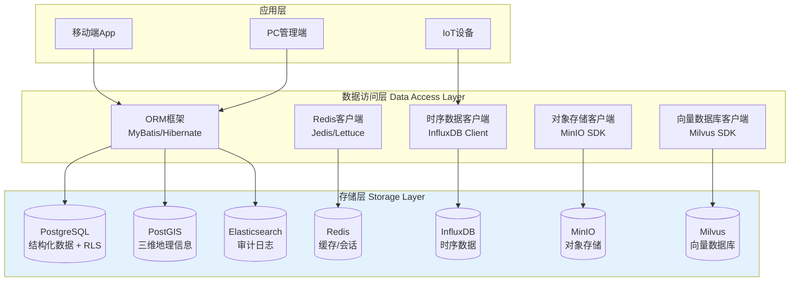

# 数据库架构设计

**文档版本**：v2.0
**最后更新**：2026-03-10
**文档状态**：已发布
**作者**：产品架构团队

---

## 1. 背景与问题（为什么）

### 1.1 业务背景

危险化学品企业特殊作业许可（PTW）管理系统需要管理8大特殊作业类型的全生命周期数据，包括：

- **结构化数据**：作业票基础信息、人员资质、审批流程
- **半结构化数据**：气体分析记录、安全措施清单、风险评估表
- **时序数据**：IoT设备实时监测数据（气体浓度、温度、湿度）
- **非结构化数据**：现场照片、视频、电子签名
- **审计数据**：全程操作日志、状态变更记录

### 1.2 技术挑战

**挑战1：数据异构性**
- 8大作业类型共性属性（作业地点、时间、人员）需统一存储
- 差异化属性（动火的气体分析、受限空间的氧含量）需灵活扩展
- 传统单表设计会导致大量NULL字段或表结构频繁变更

**挑战2：查询性能要求**
- 实时查询：作业票状态查询 < 200ms（P95）
- 复杂查询：交叉作业冲突检测 < 500ms（涉及空间计算）
- 统计分析：月度台账报表生成 < 3s（百万级数据）

**挑战3：合规性要求**
- GB 30871-2022要求数据不可篡改、全程留痕
- 审计日志需保存至少1年，支持快速检索
- 电子签名需符合《电子签名法》，关联CA证书

**挑战4：数据增长速度**
- 单个企业年均作业票：5,000-20,000张
- IoT设备数据：每秒100-1,000条（特级动火连续监测）
- 审计日志：每张作业票产生50-200条操作记录

**挑战5：多租户数据隔离**
- SaaS 化部署要求不同企业数据严格隔离
- 需要支持池化模型（共享数据库，行级安全）和孤岛模型（独立 Schema）
- 租户级数据主权：数据导出、删除、加密密钥独立管理

**挑战6：三维空间数据**
- 化工厂多层结构需要三维定位（经度、纬度、高程）
- 二维围栏无法区分不同楼层的作业
- 需要 PostGIS POINTZ 类型支持三维空间计算

### 1.3 设计目标

1. **灵活扩展**：支持8大作业类型的差异化属性，无需频繁修改表结构
2. **高性能**：核心查询 < 200ms，复杂查询 < 500ms
3. **数据合规**：不可篡改、全程留痕、支持审计
4. **混合存储**：根据数据特性选择最优存储方案
5. **多租户隔离**：支持 PostgreSQL RLS 行级安全，租户数据零交叉
6. **三维空间**：支持 POINTZ 三维坐标与三维围栏计算

---

## 2. 架构设计（是什么）

### 2.1 总体架构图



### 2.2 混合存储策略

| 数据类型 | 存储方案 | 选型理由 | 典型场景 |
|---------|---------|---------|---------|
| **结构化数据** | PostgreSQL | ACID事务、原生RLS多租户隔离、JSONB高性能查询 | 作业票主表、人员资质、审批流程 |
| **半结构化数据** | PostgreSQL JSONB | 灵活扩展、GIN索引加速、无需修改表结构 | 安全措施清单、风险评估表 |
| **缓存数据** | Redis | 高性能读写、支持分布式锁 | 会话管理、状态缓存、分布式锁 |
| **时序数据** | InfluxDB | 高效压缩、时间范围查询 | 气体浓度、温度、湿度监测 |
| **非结构化数据** | MinIO | 对象存储、S3兼容、成本低 | 现场照片、视频、电子签名 |
| **地理信息** | PostGIS | 空间索引、三维围栏计算（POINTZ） | 作业点坐标、三维围栏、人员定位 |
| **审计日志** | Elasticsearch | 全文检索、日志分析 | 操作日志、状态变更记录 |
| **向量数据** | Milvus | 高维向量检索、租户分区隔离 | AI Agent RAG 标准文本 Embedding |

### 2.3 核心设计模式："主表 + 属性JSONB + 专项表"

**设计理念**：
- **主表**：存储8大作业的共性属性（作业票ID、作业类型、作业地点、时间、人员、状态），所有表包含 `tenant_id` 实现多租户隔离
- **属性JSONB**：存储差异化属性（动火的气体分析、受限空间的氧含量），使用 PostgreSQL JSONB 字段（支持 GIN 索引）
- **专项表**：存储高频查询或复杂关联的专项数据（气体分析记录、审批流程、报警事件、三维围栏）

**优势**：
- 避免大量NULL字段
- 无需频繁修改表结构
- JSONB 支持 GIN 索引，查询性能优于 MySQL JSON
- PostgreSQL 原生 RLS（Row-Level Security）实现租户数据隔离
- PostGIS 扩展原生支持 POINTZ 三维空间计算

### 2.4 MySQL → PostgreSQL 迁移说明

| 维度 | MySQL | PostgreSQL | 迁移影响 |
| --- | --- | --- | --- |
| JSON 支持 | JSON 类型，虚拟列索引 | JSONB 类型，GIN 索引（性能更优） | JSON → JSONB，查询语法微调 |
| 多租户隔离 | 应用层 WHERE 过滤 | 原生 RLS 行级安全策略 | 新增 RLS Policy，应用层透传 tenant_id |
| 空间数据 | SPATIAL INDEX（二维） | PostGIS GIST 索引（原生三维） | POINT → GEOMETRY(POINTZ, 4326) |
| ENUM 类型 | 原生 ENUM | VARCHAR + CHECK 约束 | ENUM → CHECK 约束 |
| 自增主键 | AUTO_INCREMENT | SERIAL / GENERATED ALWAYS | 语法替换 |
| 时间类型 | DATETIME | TIMESTAMPTZ（带时区） | DATETIME → TIMESTAMPTZ |
| 布尔类型 | TINYINT(1) | BOOLEAN | TINYINT → BOOLEAN |
| 字符集 | utf8mb4 | UTF-8（默认） | 无需显式指定 |

---

## 3. 实施方案（怎么做）

### 3.1 PostgreSQL 核心表结构

#### 3.1.0 多租户基础表（tenant）

```sql
-- 租户表（多租户基础）
CREATE TABLE tenant (
    tenant_id       VARCHAR(32) PRIMARY KEY,
    tenant_name     VARCHAR(200) NOT NULL,
    credit_code     VARCHAR(18) NOT NULL UNIQUE
                    COMMENT '统一社会信用代码',
    tenant_type     VARCHAR(20) NOT NULL DEFAULT 'POOLED'
                    CHECK (tenant_type IN ('POOLED', 'SILO')),
    -- 配置
    config          JSONB DEFAULT '{}',
    -- 状态
    status          VARCHAR(10) NOT NULL DEFAULT 'ACTIVE'
                    CHECK (status IN ('ACTIVE', 'SUSPENDED', 'ARCHIVED')),
    created_at      TIMESTAMPTZ DEFAULT NOW(),
    updated_at      TIMESTAMPTZ DEFAULT NOW()
);
```

#### 3.1.1 作业票主表（work_permit_main）

```sql
CREATE TABLE work_permit_main (
    -- 主键与基础信息
    permit_id       VARCHAR(32) PRIMARY KEY,
    tenant_id       VARCHAR(32) NOT NULL,
    permit_type     VARCHAR(20) NOT NULL
                    CHECK (permit_type IN (
                        '动火','受限空间','盲板抽堵','高处',
                        '吊装','临时用电','动土','断路'
                    )),
    permit_level    VARCHAR(10)
                    CHECK (permit_level IN ('特级','一级','二级','普通')),

    -- 作业信息
    work_location   VARCHAR(200) NOT NULL,
    work_location_gis GEOMETRY(POINTZ, 4326),
    work_content    TEXT NOT NULL,
    start_time      TIMESTAMPTZ NOT NULL,
    end_time        TIMESTAMPTZ NOT NULL,
    actual_start_time TIMESTAMPTZ,
    actual_end_time TIMESTAMPTZ,

    -- 人员信息
    applicant_id    VARCHAR(32) NOT NULL,
    applicant_name  VARCHAR(50) NOT NULL,
    supervisor_id   VARCHAR(32) NOT NULL,
    supervisor_name VARCHAR(50) NOT NULL,
    worker_ids      JSONB,

    -- 状态管理
    status          VARCHAR(20) NOT NULL DEFAULT '草稿'
                    CHECK (status IN (
                        '草稿','待审批','审批中','已批准',
                        '进行中','已挂起','已完成','已驳回','已取消'
                    )),
    status_updated_at TIMESTAMPTZ NOT NULL DEFAULT NOW(),

    -- 差异化属性（JSONB 字段）
    specific_attributes JSONB,
    safety_measures JSONB,
    risk_assessment JSONB,

    -- 审批信息
    approval_chain  JSONB,
    current_approver_id VARCHAR(32),

    -- 审计字段
    created_at      TIMESTAMPTZ NOT NULL DEFAULT NOW(),
    created_by      VARCHAR(32) NOT NULL,
    updated_at      TIMESTAMPTZ NOT NULL DEFAULT NOW(),
    updated_by      VARCHAR(32),
    version         INT NOT NULL DEFAULT 1,
    is_deleted      BOOLEAN NOT NULL DEFAULT FALSE,

    -- 外键
    CONSTRAINT fk_permit_tenant FOREIGN KEY (tenant_id)
        REFERENCES tenant(tenant_id)
);

-- 索引
CREATE INDEX idx_permit_tenant ON work_permit_main(tenant_id);
CREATE INDEX idx_permit_type ON work_permit_main(permit_type);
CREATE INDEX idx_permit_status ON work_permit_main(status);
CREATE INDEX idx_permit_start_time ON work_permit_main(start_time);
CREATE INDEX idx_permit_applicant ON work_permit_main(applicant_id);
CREATE INDEX idx_permit_supervisor ON work_permit_main(supervisor_id);
CREATE INDEX idx_permit_location ON work_permit_main
    USING GIST(work_location_gis);

-- RLS 策略（多租户行级安全）
ALTER TABLE work_permit_main ENABLE ROW LEVEL SECURITY;
CREATE POLICY tenant_isolation ON work_permit_main
    USING (tenant_id = current_setting('app.current_tenant')::VARCHAR);
```

**JSON字段示例**：

```json
// specific_attributes 示例（动火作业）
{
  "fire_level": "特级",
  "fire_method": "电焊",
  "gas_analysis_required": true,
  "continuous_monitoring": true,
  "video_surveillance": true
}

// safety_measures 示例
[
  {
    "measure_id": "SM001",
    "measure_name": "动火点周围10米内易燃物清理",
    "is_completed": true,
    "completed_by": "张三",
    "completed_at": "2026-03-10 09:30:00",
    "photo_url": "minio://bucket/photos/SM001.jpg"
  },
  {
    "measure_id": "SM002",
    "measure_name": "配备2具8kg干粉灭火器",
    "is_completed": true,
    "completed_by": "李四",
    "completed_at": "2026-03-10 09:35:00",
    "photo_url": "minio://bucket/photos/SM002.jpg"
  }
]

// approval_chain 示例
[
  {
    "step": 1,
    "approver_id": "U001",
    "approver_name": "王五",
    "approver_role": "车间主任",
    "action": "approved",
    "comment": "同意",
    "approved_at": "2026-03-10 10:00:00",
    "signature_url": "minio://bucket/signatures/U001.png"
  },
  {
    "step": 2,
    "approver_id": "U002",
    "approver_name": "赵六",
    "approver_role": "安全总监",
    "action": "pending",
    "comment": null,
    "approved_at": null,
    "signature_url": null
  }
]
```

#### 3.1.2 气体分析记录表（gas_analysis_log）

```sql
CREATE TABLE gas_analysis_log (
    analysis_id     VARCHAR(32) PRIMARY KEY,
    tenant_id       VARCHAR(32) NOT NULL,
    permit_id       VARCHAR(32) NOT NULL,

    -- 分析信息
    analysis_time   TIMESTAMPTZ NOT NULL,
    analysis_location VARCHAR(200) NOT NULL,
    analysis_location_gis GEOMETRY(POINTZ, 4326),
    analyzer_id     VARCHAR(32) NOT NULL,
    analyzer_name   VARCHAR(50) NOT NULL,

    -- 分析结果
    lel_value       DECIMAL(5,2),
    oxygen_value    DECIMAL(5,2),
    h2s_value       DECIMAL(5,2),
    co_value        DECIMAL(5,2),
    other_gases     JSONB,

    -- 合规判定
    is_qualified    BOOLEAN NOT NULL,
    qualification_reason TEXT,

    -- 设备信息
    device_id       VARCHAR(32),
    device_model    VARCHAR(50),
    device_calibration_date DATE,

    -- 审计字段
    created_at      TIMESTAMPTZ NOT NULL DEFAULT NOW(),

    CONSTRAINT fk_gas_tenant FOREIGN KEY (tenant_id)
        REFERENCES tenant(tenant_id),
    CONSTRAINT fk_gas_permit FOREIGN KEY (permit_id)
        REFERENCES work_permit_main(permit_id)
);

CREATE INDEX idx_gas_tenant ON gas_analysis_log(tenant_id);
CREATE INDEX idx_gas_permit ON gas_analysis_log(permit_id);
CREATE INDEX idx_gas_time ON gas_analysis_log(analysis_time);

ALTER TABLE gas_analysis_log ENABLE ROW LEVEL SECURITY;
CREATE POLICY tenant_isolation ON gas_analysis_log
    USING (tenant_id = current_setting('app.current_tenant')::VARCHAR);
```

#### 3.1.3 人员资质表（personnel_certification）

```sql
CREATE TABLE personnel_certification (
    cert_id         VARCHAR(32) PRIMARY KEY,
    tenant_id       VARCHAR(32) NOT NULL,
    person_id       VARCHAR(32) NOT NULL,
    person_name     VARCHAR(50) NOT NULL,

    -- 资质信息
    cert_type       VARCHAR(20) NOT NULL
                    CHECK (cert_type IN (
                        '特种作业操作证','安全管理人员证',
                        '监护人资格证','其他'
                    )),
    cert_number     VARCHAR(50) NOT NULL,
    cert_name       VARCHAR(100) NOT NULL,
    issue_date      DATE NOT NULL,
    expiry_date     DATE NOT NULL,
    issuing_authority VARCHAR(100),

    -- 适用范围
    applicable_work_types JSONB,

    -- 状态管理
    status          VARCHAR(10) NOT NULL DEFAULT '有效'
                    CHECK (status IN ('有效','即将过期','已过期','已吊销')),

    -- 附件
    cert_photo_url  VARCHAR(200),

    -- 审计字段
    created_at      TIMESTAMPTZ NOT NULL DEFAULT NOW(),
    updated_at      TIMESTAMPTZ NOT NULL DEFAULT NOW(),

    CONSTRAINT fk_cert_tenant FOREIGN KEY (tenant_id)
        REFERENCES tenant(tenant_id)
);

CREATE INDEX idx_cert_tenant ON personnel_certification(tenant_id);
CREATE INDEX idx_cert_person ON personnel_certification(person_id);
CREATE INDEX idx_cert_expiry ON personnel_certification(expiry_date);
CREATE INDEX idx_cert_status ON personnel_certification(status);

ALTER TABLE personnel_certification ENABLE ROW LEVEL SECURITY;
CREATE POLICY tenant_isolation ON personnel_certification
    USING (tenant_id = current_setting('app.current_tenant')::VARCHAR);
```

#### 3.1.4 三维围栏表（geofence_3d）

```sql
-- 三维围栏定义表（详见 personnel-positioning.md §2.3）
CREATE TABLE geofence_3d (
    fence_id        VARCHAR(32) PRIMARY KEY,
    tenant_id       VARCHAR(32) NOT NULL,
    fence_name      VARCHAR(200) NOT NULL,
    fence_type      VARCHAR(20) NOT NULL
                    CHECK (fence_type IN (
                        'APPROVAL_5M',
                        'SUPERVISOR_15M',
                        'WORK_AREA',
                        'RESTRICTED_ZONE',
                        'EVACUATION_ZONE'
                    )),
    -- 三维中心点（经度, 纬度, 高程）
    center_point    GEOMETRY(POINTZ, 4326) NOT NULL,
    -- 水平半径（米）
    horizontal_radius DECIMAL(8,2) NOT NULL,
    -- Z 轴范围（米）
    z_min           DECIMAL(8,2) NOT NULL DEFAULT -5.0,
    z_max           DECIMAL(8,2) NOT NULL DEFAULT 50.0,
    -- 关联信息
    permit_id       VARCHAR(32),
    -- 生效时间窗口
    valid_from      TIMESTAMPTZ,
    valid_to        TIMESTAMPTZ,
    -- 审计字段
    created_at      TIMESTAMPTZ DEFAULT NOW(),
    created_by      VARCHAR(32) NOT NULL,
    status          VARCHAR(10) DEFAULT 'ACTIVE',

    CONSTRAINT fk_fence_tenant FOREIGN KEY (tenant_id)
        REFERENCES tenant(tenant_id)
);

CREATE INDEX idx_fence_tenant ON geofence_3d(tenant_id);
CREATE INDEX idx_fence_permit ON geofence_3d(permit_id);
CREATE INDEX idx_fence_center ON geofence_3d USING GIST(center_point);

ALTER TABLE geofence_3d ENABLE ROW LEVEL SECURITY;
CREATE POLICY tenant_isolation ON geofence_3d
    USING (tenant_id = current_setting('app.current_tenant')::VARCHAR);
```

#### 3.1.5 定位校准记录表（positioning_calibration）

```sql
-- 定位精度校准记录（详见 personnel-positioning.md §3.3）
CREATE TABLE positioning_calibration (
    calibration_id  VARCHAR(32) PRIMARY KEY,
    tenant_id       VARCHAR(32) NOT NULL,
    calibration_date DATE NOT NULL,
    calibration_type VARCHAR(20) NOT NULL
                    CHECK (calibration_type IN (
                        'ANNUAL', 'QUARTERLY', 'AD_HOC'
                    )),
    -- 静态测试结果
    static_sample_count INT NOT NULL,
    static_mean_error   DECIMAL(5,2) NOT NULL,
    static_max_error    DECIMAL(5,2) NOT NULL,
    static_p95_error    DECIMAL(5,2) NOT NULL,
    static_pass         BOOLEAN NOT NULL,
    -- 动态测试结果
    dynamic_path_length DECIMAL(8,2),
    dynamic_mean_error  DECIMAL(5,2),
    dynamic_max_error   DECIMAL(5,2),
    dynamic_p95_error   DECIMAL(5,2),
    dynamic_pass        BOOLEAN,
    -- 综合结论
    overall_pass        BOOLEAN NOT NULL,
    report_url          VARCHAR(500),
    calibrator_name     VARCHAR(50) NOT NULL,
    calibrator_cert     VARCHAR(50),
    notes               TEXT,
    created_at          TIMESTAMPTZ DEFAULT NOW(),

    CONSTRAINT fk_cal_tenant FOREIGN KEY (tenant_id)
        REFERENCES tenant(tenant_id)
);

ALTER TABLE positioning_calibration ENABLE ROW LEVEL SECURITY;
CREATE POLICY tenant_isolation ON positioning_calibration
    USING (tenant_id = current_setting('app.current_tenant')::VARCHAR);
```

#### 3.1.6 报警编码注册表（alarm_code_registry）

```sql
-- 报警编码注册表（详见 alarm-coding.md §3.1）
CREATE TABLE alarm_code_registry (
    alarm_code      VARCHAR(10) PRIMARY KEY,
    type_code       CHAR(2) NOT NULL,
    sub_type_code   CHAR(2) NOT NULL,
    severity_level  SMALLINT NOT NULL CHECK (severity_level BETWEEN 1 AND 4),
    alarm_name      VARCHAR(100) NOT NULL,
    description     TEXT,
    -- 响应配置
    response_sla_seconds INT NOT NULL,
    auto_actions    JSONB,
    notify_targets  JSONB,
    -- 关联标准
    standard_ref    VARCHAR(100),
    -- 状态
    is_active       BOOLEAN DEFAULT TRUE,
    created_at      TIMESTAMPTZ DEFAULT NOW(),
    updated_at      TIMESTAMPTZ DEFAULT NOW(),

    UNIQUE (type_code, sub_type_code, severity_level)
);
```

#### 3.1.7 报警事件记录表（alarm_event_log）

```sql
-- 报警事件记录表（详见 alarm-coding.md §3.1）
CREATE TABLE alarm_event_log (
    event_id        VARCHAR(32) PRIMARY KEY,
    tenant_id       VARCHAR(32) NOT NULL,
    alarm_code      VARCHAR(10) NOT NULL
                    REFERENCES alarm_code_registry(alarm_code),
    -- 关联信息
    permit_id       VARCHAR(32),
    device_id       VARCHAR(32),
    person_id       VARCHAR(32),
    -- 报警详情
    trigger_value   JSONB NOT NULL,
    trigger_time    TIMESTAMPTZ NOT NULL,
    location        GEOMETRY(POINTZ, 4326),
    -- 闭环状态
    status          VARCHAR(20) NOT NULL DEFAULT 'TRIGGERED'
                    CHECK (status IN (
                        'TRIGGERED', 'PENDING_ACK',
                        'ACKNOWLEDGED', 'IN_PROGRESS',
                        'PENDING_VERIFY', 'CLOSED',
                        'ESCALATED', 'SUPPRESSED'
                    )),
    acknowledged_by VARCHAR(32),
    acknowledged_at TIMESTAMPTZ,
    resolved_by     VARCHAR(32),
    resolved_at     TIMESTAMPTZ,
    resolution_note TEXT,
    -- 升级记录
    escalation_count SMALLINT DEFAULT 0,
    escalated_to    VARCHAR(32),
    -- 审计
    created_at      TIMESTAMPTZ DEFAULT NOW(),

    CONSTRAINT fk_alarm_tenant FOREIGN KEY (tenant_id)
        REFERENCES tenant(tenant_id)
);

CREATE INDEX idx_alarm_tenant ON alarm_event_log(tenant_id);
CREATE INDEX idx_alarm_status ON alarm_event_log(status);
CREATE INDEX idx_alarm_time ON alarm_event_log(trigger_time);
CREATE INDEX idx_alarm_permit ON alarm_event_log(permit_id);
CREATE INDEX idx_alarm_code ON alarm_event_log(alarm_code);

ALTER TABLE alarm_event_log ENABLE ROW LEVEL SECURITY;
CREATE POLICY tenant_isolation ON alarm_event_log
    USING (tenant_id = current_setting('app.current_tenant')::VARCHAR);
```

#### 3.1.8 增量同步变更日志表（change_log）

```sql
-- Delta Sync 增量同步变更日志（详见 iot-integration.md §3.3）
CREATE TABLE change_log (
    log_id          BIGINT GENERATED ALWAYS AS IDENTITY PRIMARY KEY,
    tenant_id       VARCHAR(32) NOT NULL,
    -- 变更目标
    table_name      VARCHAR(100) NOT NULL,
    record_id       VARCHAR(32) NOT NULL,
    -- 变更内容
    operation       VARCHAR(10) NOT NULL
                    CHECK (operation IN ('INSERT', 'UPDATE', 'DELETE')),
    changed_fields  JSONB,
    old_values      JSONB,
    new_values      JSONB,
    -- 来源
    source_node     VARCHAR(50) NOT NULL DEFAULT 'CLOUD',
    -- 同步状态
    is_synced       BOOLEAN NOT NULL DEFAULT FALSE,
    synced_at       TIMESTAMPTZ,
    -- 时间戳
    created_at      TIMESTAMPTZ NOT NULL DEFAULT NOW(),

    CONSTRAINT fk_changelog_tenant FOREIGN KEY (tenant_id)
        REFERENCES tenant(tenant_id)
);

CREATE INDEX idx_changelog_tenant ON change_log(tenant_id);
CREATE INDEX idx_changelog_sync ON change_log(is_synced, created_at);
CREATE INDEX idx_changelog_table ON change_log(table_name, record_id);

ALTER TABLE change_log ENABLE ROW LEVEL SECURITY;
CREATE POLICY tenant_isolation ON change_log
    USING (tenant_id = current_setting('app.current_tenant')::VARCHAR);
```

### 3.2 Redis缓存策略

#### 3.2.1 缓存数据类型

所有 Redis Key 统一增加租户前缀 `{tenant_id}:` 实现多租户隔离：

| 缓存类型 | Redis数据结构 | Key命名规范 | TTL | 用途 |
|---------|--------------|------------|-----|------|
| **作业票状态** | String | `{tenant_id}:permit:status:{permit_id}` | 1小时 | 高频查询优化 |
| **用户会话** | Hash | `{tenant_id}:session:{user_id}` | 30分钟 | 登录态管理 |
| **分布式锁** | String | `{tenant_id}:lock:permit:{permit_id}` | 30秒 | 防止并发修改 |
| **审批队列** | List | `{tenant_id}:approval:queue:{approver_id}` | 永久 | 待审批任务列表 |
| **实时监控** | Sorted Set | `{tenant_id}:monitoring:{permit_id}` | 8小时 | 特级动火实时数据 |
| **人员定位** | Hash | `{tenant_id}:pos:latest:{person_id}` | 30秒 | 最新定位坐标 |
| **定位历史** | List | `{tenant_id}:pos:history:{person_id}` | 5分钟 | 最近N次定位记录 |
| **报警状态** | Hash | `{tenant_id}:alarm:active:{event_id}` | 24小时 | 活跃报警事件 |

#### 3.2.2 缓存更新策略

**Cache-Aside模式**：
1. 读取时：先查Redis，未命中则查PostgreSQL，并写入Redis
2. 更新时：先更新PostgreSQL，再删除Redis缓存（避免缓存不一致）

**示例代码**（伪代码）：
```python
def get_permit_status(tenant_id: str, permit_id: str):
    # 1. 尝试从Redis读取（带租户前缀）
    cache_key = f"{tenant_id}:permit:status:{permit_id}"
    status = redis.get(cache_key)

    if status:
        return status

    # 2. 未命中，查询PostgreSQL（RLS 自动过滤租户）
    status = pg.query(
        "SELECT status FROM work_permit_main WHERE permit_id = %s",
        permit_id
    )

    # 3. 写入Redis
    redis.setex(cache_key, 3600, status)  # TTL=1小时

    return status

def update_permit_status(tenant_id: str, permit_id: str, new_status: str):
    # 1. 更新PostgreSQL（RLS 自动过滤租户）
    pg.execute(
        "UPDATE work_permit_main SET status = %s WHERE permit_id = %s",
        new_status, permit_id
    )

    # 2. 删除Redis缓存
    cache_key = f"{tenant_id}:permit:status:{permit_id}"
    redis.delete(cache_key)
```

### 3.3 InfluxDB时序数据存储

#### 3.3.1 数据模型

**Measurement（测量）**：`iot_monitoring`

**Tags（标签，用于索引）**：
- `tenant_id`：租户ID（多租户隔离必需，置于首位以优化分片）
- `permit_id`：作业票ID
- `device_id`：设备ID
- `sensor_type`：传感器类型（LEL/O2/H2S/CO/温度/湿度/乙醇蒸气/粉尘）

**Fields（字段，实际数值）**：
- `value`：测量值
- `unit`：单位
- `threshold_min`：阈值下限
- `threshold_max`：阈值上限
- `is_alarm`：是否报警
- `alarm_code`：报警编码（关联 alarm_code_registry，可选）
- `location_x`：采集点经度（可选）
- `location_y`：采集点纬度（可选）
- `location_z`：采集点高程（可选）

**Timestamp（时间戳）**：自动生成

**Retention Policy（保留策略）**：

| 策略名称 | 保留时长 | 适用场景 |
|---------|---------|---------|
| `rp_realtime` | 7天 | 实时监测原始数据（1-5s 采样） |
| `rp_hourly` | 90天 | 小时级聚合数据 |
| `rp_daily` | 1年 | 日级聚合数据（合规审计） |

**Continuous Query（连续查询）**：
```sql
-- 小时级聚合
CREATE CONTINUOUS QUERY cq_hourly ON ptw_iot
BEGIN
  SELECT mean("value") AS avg_value, max("value") AS max_value,
         min("value") AS min_value, count("value") AS sample_count
  INTO "rp_hourly"."iot_monitoring_hourly"
  FROM "rp_realtime"."iot_monitoring"
  GROUP BY time(1h), "tenant_id", "permit_id", "device_id", "sensor_type"
END
```

**示例数据**：
```
iot_monitoring,tenant_id=T001,permit_id=20260310-动火-001,device_id=DEV001,sensor_type=LEL value=0.15,unit="%",threshold_min=0,threshold_max=0.5,is_alarm=false 1710057600000000000
iot_monitoring,tenant_id=T001,permit_id=20260310-动火-001,device_id=DEV001,sensor_type=O2 value=20.8,unit="%",threshold_min=19.5,threshold_max=21.0,is_alarm=false 1710057600000000000
```

#### 3.3.2 Measurement：人员定位时序

**Measurement（测量）**：`personnel_position`

**Tags（标签）**：
- `tenant_id`：租户ID
- `person_id`：人员ID
- `device_type`：定位设备类型（UWB/BLE/GNSS/FUSED）

**Fields（字段）**：
- `x`：经度
- `y`：纬度
- `z`：高程（米）
- `accuracy`：定位精度（米）
- `speed`：移动速度（m/s）
- `in_geofence`：是否在围栏内
- `fence_id`：关联围栏ID

**采样频率**：常规 5s，签批场景 1s

#### 3.3.3 查询示例

**查询最近1小时的气体浓度（含租户隔离）**：
```sql
SELECT mean("value") AS avg_lel
FROM "iot_monitoring"
WHERE "tenant_id" = 'T001'
  AND "permit_id" = '20260310-动火-001'
  AND "sensor_type" = 'LEL'
  AND time > now() - 1h
GROUP BY time(1m)
```

**查询报警记录**：
```sql
SELECT *
FROM "iot_monitoring"
WHERE "tenant_id" = 'T001'
  AND "permit_id" = '20260310-动火-001'
  AND "is_alarm" = true
  AND time > now() - 8h
```

**查询人员定位轨迹**：
```sql
SELECT "x", "y", "z", "accuracy"
FROM "personnel_position"
WHERE "tenant_id" = 'T001'
  AND "person_id" = 'P001'
  AND time > now() - 30m
ORDER BY time ASC
```

### 3.4 MinIO对象存储

#### 3.4.1 Bucket（桶）设计

**多租户隔离策略**：每个租户使用独立的路径前缀 `{tenant_id}/`，通过 MinIO Bucket Policy 实现访问隔离。

| Bucket名称 | 用途 | 访问权限 | 生命周期策略 |
|-----------|------|---------|-------------|
| `permit-photos` | 现场照片 | 私有（租户隔离） | 保留1年后归档 |
| `permit-videos` | 现场视频 | 私有（租户隔离） | 保留1年后归档 |
| `signatures` | 电子签名 | 私有（租户隔离） | 永久保留 |
| `certificates` | 人员证书照片 | 私有（租户隔离） | 永久保留 |
| `reports` | 导出报表 | 私有（租户隔离） | 保留3个月后删除 |
| `calibration-reports` | 定位校准报告 | 私有（租户隔离） | 保留3年（合规要求） |
| `alarm-snapshots` | 报警抓拍截图 | 私有（租户隔离） | 保留1年后归档 |

#### 3.4.2 文件命名规范

**格式**：`{tenant_id}/{permit_id}/{category}/{timestamp}_{filename}`

**示例**：
- 现场照片：`T001/20260310-动火-001/photos/20260310093000_safety_measure_01.jpg`
- 电子签名：`T001/20260310-动火-001/signatures/20260310100000_approver_U001.png`
- 视频监控：`T001/20260310-动火-001/videos/20260310100000_20260310110000.mp4`
- 校准报告：`T001/calibration/20260310_annual_report.pdf`
- 报警抓拍：`T001/alarms/EVT20260310001_snapshot.jpg`

### 3.5 PostGIS三维地理信息存储

#### 3.5.1 空间索引

**作业点坐标**：使用 `GEOMETRY(POINTZ, 4326)` 类型存储三维坐标（经度、纬度、高程），创建 GiST 空间索引。

```sql
-- 创建三维空间索引（GiST）
CREATE INDEX idx_permit_location_gis ON work_permit_main USING GIST(work_location_gis);
CREATE INDEX idx_geofence_center ON geofence_3d USING GIST(center_point);
CREATE INDEX idx_alarm_location ON alarm_event_log USING GIST(location);

-- 查询方圆500米内的作业票（二维水平距离）
SELECT permit_id, work_location,
       ST_Distance(
         work_location_gis::geography,
         ST_SetSRID(ST_MakePoint(120.123, 30.456, 15.0), 4326)::geography
       ) AS distance_m
FROM work_permit_main
WHERE tenant_id = 'T001'
  AND ST_DWithin(
    work_location_gis::geography,
    ST_SetSRID(ST_MakePoint(120.123, 30.456, 15.0), 4326)::geography,
    500
  )
  AND status IN ('已批准', '进行中')
ORDER BY distance_m;
```

#### 3.5.2 三维地理围栏

**签批围栏校验（5m 围栏 + Z 轴范围）**：
```sql
-- 判断审批人是否在作业点 5m 签批围栏内（含高程校验）
SELECT
    f.fence_id,
    f.fence_type,
    ST_Distance(
      f.center_point::geography,
      ST_SetSRID(ST_MakePoint(:person_x, :person_y, :person_z), 4326)::geography
    ) AS horizontal_distance_m,
    ST_Z(f.center_point) AS fence_z,
    :person_z AS person_z,
    CASE
        WHEN ST_Distance(
               f.center_point::geography,
               ST_SetSRID(ST_MakePoint(:person_x, :person_y, :person_z), 4326)::geography
             ) <= f.horizontal_radius
             AND :person_z BETWEEN f.z_min AND f.z_max
        THEN '围栏内'
        ELSE '围栏外'
    END AS position_status
FROM geofence_3d f
WHERE f.tenant_id = :tenant_id
  AND f.permit_id = :permit_id
  AND f.fence_type = 'APPROVAL'
  AND NOW() BETWEEN f.valid_from AND f.valid_to;
```

**监护人在岗校验（15m 围栏）**：
```sql
-- 判断监护人是否在作业点方圆15米内（含高程校验）
SELECT
    w.permit_id,
    ST_Distance(
      w.work_location_gis::geography,
      ST_SetSRID(ST_MakePoint(:supervisor_x, :supervisor_y, :supervisor_z), 4326)::geography
    ) AS distance_m,
    CASE
        WHEN ST_Distance(
               w.work_location_gis::geography,
               ST_SetSRID(ST_MakePoint(:supervisor_x, :supervisor_y, :supervisor_z), 4326)::geography
             ) <= 15
        THEN '在岗'
        ELSE '脱岗'
    END AS supervisor_status
FROM work_permit_main w
WHERE w.tenant_id = :tenant_id
  AND w.permit_id = :permit_id;
```

### 3.6 Elasticsearch审计日志

#### 3.6.1 索引设计

**索引名称**：`audit_log_{tenant_id}_{YYYY-MM}`（按租户+月份分片，实现租户级数据隔离与生命周期管理）

**Mapping（映射）**：
```json
{
  "mappings": {
    "properties": {
      "log_id": { "type": "keyword" },
      "tenant_id": { "type": "keyword" },
      "permit_id": { "type": "keyword" },
      "user_id": { "type": "keyword" },
      "user_name": { "type": "text" },
      "action": { "type": "keyword" },
      "action_desc": { "type": "text" },
      "old_value": { "type": "text" },
      "new_value": { "type": "text" },
      "ip_address": { "type": "ip" },
      "user_agent": { "type": "text" },
      "location": { "type": "geo_point" },
      "alarm_code": { "type": "keyword" },
      "timestamp": { "type": "date" }
    }
  }
}
```

**Index Template（索引模板）**：
```json
PUT _index_template/audit_log_template
{
  "index_patterns": ["audit_log_*"],
  "template": {
    "settings": {
      "number_of_shards": 2,
      "number_of_replicas": 1,
      "index.lifecycle.name": "audit_log_policy"
    }
  }
}
```

**ILM Policy（索引生命周期管理）**：
```json
PUT _ilm/policy/audit_log_policy
{
  "policy": {
    "phases": {
      "hot":  { "actions": { "rollover": { "max_size": "10gb", "max_age": "30d" } } },
      "warm": { "min_age": "30d", "actions": { "shrink": { "number_of_shards": 1 } } },
      "cold": { "min_age": "90d", "actions": { "freeze": {} } },
      "delete": { "min_age": "365d", "actions": { "delete": {} } }
    }
  }
}
```

#### 3.6.2 查询示例

**查询某张作业票的所有操作记录（含租户隔离）**：
```json
GET /audit_log_T001_2026-03/_search
{
  "query": {
    "bool": {
      "must": [
        { "term": { "tenant_id": "T001" } },
        { "term": { "permit_id": "20260310-动火-001" } }
      ]
    }
  },
  "sort": [
    { "timestamp": "asc" }
  ]
}
```

**全文检索**：
```json
GET /audit_log_T001_2026-03/_search
{
  "query": {
    "bool": {
      "must": [
        { "term": { "tenant_id": "T001" } },
        { "match": { "action_desc": "审批通过" } }
      ]
    }
  }
}
```

**按报警编码聚合统计**：
```json
GET /audit_log_T001_2026-03/_search
{
  "size": 0,
  "query": {
    "bool": {
      "must": [
        { "term": { "tenant_id": "T001" } },
        { "exists": { "field": "alarm_code" } }
      ]
    }
  },
  "aggs": {
    "by_alarm_code": {
      "terms": { "field": "alarm_code", "size": 20 }
    }
  }
}
```

### 3.7 数据一致性保障

#### 3.7.1 分布式事务（Seata）

**场景**：作业票审批通过后，需要同时更新 PostgreSQL（作业票状态）和 Elasticsearch（审计日志）

**方案**：使用 Seata AT 模式实现分布式事务

```java
@GlobalTransactional
public void approvePermit(String tenantId, String permitId, String approverId) {
    // 0. 设置租户上下文（RLS 依赖此设置）
    jdbcTemplate.execute("SET app.current_tenant = '" + tenantId + "'");

    // 1. 更新 PostgreSQL 作业票状态
    permitMapper.updateStatus(permitId, "已批准");

    // 2. 记录审计日志到 Elasticsearch（含租户隔离索引）
    String indexName = String.format("audit_log_%s_%s", tenantId, YearMonth.now());
    auditLogService.log(indexName, permitId, approverId, "审批通过");

    // 3. 删除 Redis 缓存（含租户前缀）
    redisTemplate.delete(tenantId + ":permit:status:" + permitId);
}
```

#### 3.7.2 最终一致性（消息队列）

**场景**：作业票创建后，需要异步生成 PDF 文件并上传到 MinIO

**方案**：使用 Kafka 消息队列实现最终一致性

```java
// 生产者：作业票创建后发送消息
public void createPermit(String tenantId, WorkPermit permit) {
    // 0. 设置租户上下文
    jdbcTemplate.execute("SET app.current_tenant = '" + tenantId + "'");

    // 1. 保存到 PostgreSQL
    permitMapper.insert(permit);

    // 2. 发送消息到 Kafka（携带租户ID）
    kafkaTemplate.send("permit-created",
        new PermitEvent(tenantId, permit.getPermitId()));
}

// 消费者：异步生成 PDF 并上传 MinIO
@KafkaListener(topics = "permit-created")
public void handlePermitCreated(PermitEvent event) {
    String tenantId = event.getTenantId();
    String permitId = event.getPermitId();

    // 0. 设置租户上下文
    jdbcTemplate.execute("SET app.current_tenant = '" + tenantId + "'");

    // 1. 查询作业票详情（RLS 自动过滤租户数据）
    WorkPermit permit = permitMapper.selectById(permitId);

    // 2. 生成 PDF
    byte[] pdfBytes = pdfGenerator.generate(permit);

    // 3. 上传到 MinIO（租户隔离路径）
    String objectPath = tenantId + "/" + permitId + ".pdf";
    minioClient.putObject("permit-pdfs", objectPath, pdfBytes);
}
```

#### 3.7.3 变更日志同步（Delta Sync）

**场景**：移动端离线操作后，需要增量同步到服务端

**方案**：基于 `change_log` 表实现增量同步，替代全量扫描

```java
// 服务端：拉取未同步的变更记录
public List<ChangeLog> pullChanges(String tenantId, String sourceNode,
                                    Instant lastSyncTime) {
    jdbcTemplate.execute("SET app.current_tenant = '" + tenantId + "'");
    return changeLogMapper.selectUnsyncedAfter(lastSyncTime, sourceNode);
}

// 服务端：接收客户端推送的变更
@Transactional
public void pushChanges(String tenantId, List<ChangeLog> clientChanges) {
    jdbcTemplate.execute("SET app.current_tenant = '" + tenantId + "'");
    for (ChangeLog change : clientChanges) {
        // 冲突检测：比较服务端同一记录的最新版本
        ChangeLog serverLatest = changeLogMapper
            .selectLatestByRecord(change.getTableName(), change.getRecordId());
        if (serverLatest != null
            && serverLatest.getCreatedAt().isAfter(change.getCreatedAt())) {
            // 冲突：服务端优先，记录冲突日志
            conflictLogService.record(change, serverLatest);
        } else {
            // 无冲突：应用变更
            changeLogMapper.applyChange(change);
        }
    }
}
```

### 3.8 数据备份与恢复

#### 3.8.1 备份策略

| 数据库 | 备份方式 | 备份频率 | 保留周期 |
|-------|---------|---------|---------|
| **PostgreSQL** | pg_basebackup 全量 + WAL 归档增量 | 全量：每天凌晨2点<br/>WAL：实时归档 | 全量：30天<br/>WAL：7天 |
| **Redis** | RDB快照 + AOF日志 | RDB：每6小时<br/>AOF：实时 | RDB：7天<br/>AOF：3天 |
| **InfluxDB** | 全量备份 | 每天凌晨3点 | 30天 |
| **MinIO** | 对象版本控制 + 跨区域复制 | 实时 | 永久 |
| **Elasticsearch** | 快照备份 | 每天凌晨4点 | 30天（hot）+ 365天（cold） |
| **Milvus** | Collection 快照 | 每天凌晨5点 | 30天 |

**多租户备份隔离**：
- **池化模型**：统一备份整个数据库，恢复时通过 RLS 策略自动隔离
- **孤岛模型**：按 Schema/实例独立备份，支持单租户粒度恢复
- **租户数据导出**：提供按 `tenant_id` 过滤的逻辑备份（`pg_dump --table` + WHERE 条件）

#### 3.8.2 恢复演练

**频率**：每季度进行一次恢复演练

**步骤**：
1. 从备份恢复 PostgreSQL 数据到测试环境（含 PostGIS 扩展验证）
2. 验证数据完整性（记录数、关键字段、空间数据精度）
3. 验证 RLS 策略生效（切换不同 tenant_id 验证数据隔离）
4. 验证业务功能（作业票查询、审批流程、三维围栏校验）
5. 验证向量数据库恢复（Milvus Collection 完整性、RAG 查询准确性）
6. 记录恢复时间（RTO）和数据丢失量（RPO）

**恢复目标**：

| 指标 | 目标值 | 说明 |
|-----|-------|------|
| RTO | ≤ 4小时 | 从灾难发生到业务恢复 |
| RPO | ≤ 1小时 | 最大可接受数据丢失窗口 |
| 单租户恢复 | ≤ 2小时 | 孤岛模型下单租户独立恢复 |

---

## 4. 相关文档

### 4.1 上游文档
- [ADR-002: 产品范围从单一动火系统升级为完整PTW系统](../adr/20260309-upgrade-to-ptw-system.md)
- [四层解耦架构设计](./layered-architecture.md)
- [PROJECTWIKI.md - 项目知识库](../../archive/PROJECTWIKI.md)

### 4.2 下游文档
- [IoT边缘接入架构](./iot-integration.md)
- [SIMOPs冲突检测算法](./simops-algorithm.md)
- [安全与合规性架构](./security-compliance.md)
- [部署架构设计](./deployment-architecture.md)

### 4.3 v2.0 新增关联文档
- [AI Agent 智能体引擎架构](./ai-agent-engine.md) — 三智能体协作、RAG 向量存储（Milvus）
- [人员定位深度设计](./personnel-positioning.md) — AQ 3064.3 对齐、三维围栏、多传感器融合
- [报警编码体系](./alarm-coding.md) — AQ 3064.2 附录 A.4 标准化编码、Drools 规则引擎
- [多租户 SaaS 架构](./multi-tenant.md)（待生成） — 池化/孤岛模型、TenantContext 中间件

### 4.4 产品文档
- [PRD.md - 产品需求文档](../../产出/PRD.md)（待生成）
- [roadmap.md - 产品路线图](../../产出/roadmap.md)（待生成）

### 4.5 标准引用
- GB 30871-2022《危险化学品企业特殊作业安全规范》
- AQ 3064.1-2025《工业互联网+危化安全生产 总体架构》
- AQ 3064.2-2025《工业互联网+危化安全生产 特殊作业审批及过程管理》
- AQ 3064.3-2025《工业互联网+危化安全生产 人员定位》
- AQ 7006-2025《白酒生产企业安全管理规范》

---

## 5. 附录

### 5.1 术语表

| 术语 | 英文 | 定义 |
|-----|------|------|
| ACID | Atomicity, Consistency, Isolation, Durability | 原子性、一致性、隔离性、持久性 |
| LEL | Lower Explosive Limit | 爆炸下限 |
| RTO | Recovery Time Objective | 恢复时间目标 |
| RPO | Recovery Point Objective | 恢复点目标 |
| ORM | Object-Relational Mapping | 对象关系映射 |
| TTL | Time To Live | 生存时间 |
| RLS | Row-Level Security | 行级安全策略，PostgreSQL 原生多租户隔离机制 |
| POINTZ | PostGIS 3D Point | 三维点类型（经度、纬度、高程） |
| SRID | Spatial Reference System Identifier | 空间参考系统标识符，4326 = WGS 84 |
| CGCS 2000 | China Geodetic Coordinate System 2000 | 2000国家大地坐标系 |
| WAL | Write-Ahead Logging | 预写式日志，PostgreSQL 增量备份基础 |
| JSONB | Binary JSON | PostgreSQL 二进制 JSON 类型，支持 GIN 索引 |
| GiST | Generalized Search Tree | 通用搜索树索引，PostGIS 空间索引类型 |
| GIN | Generalized Inverted Index | 通用倒排索引，JSONB 查询加速 |
| RAG | Retrieval-Augmented Generation | 检索增强生成，AI Agent 知识库查询模式 |
| Delta Sync | Incremental Synchronization | 增量同步，基于 change_log 的离线数据同步 |
| CRDT | Conflict-free Replicated Data Type | 无冲突复制数据类型，分布式冲突解决 |
| ILM | Index Lifecycle Management | 索引生命周期管理（Elasticsearch） |
| UWB | Ultra-Wideband | 超宽带定位技术，精度 ±0.1-0.3m |
| BLE | Bluetooth Low Energy | 低功耗蓝牙定位技术 |
| IMU | Inertial Measurement Unit | 惯性测量单元 |

### 5.2 版本历史

| 版本 | 日期 | 变更内容 | 作者 |
|-----|------|---------|------|
| v1.0 | 2026-03-10 | 初始版本，定义混合存储架构 | 产品架构团队 |
| v2.0 | 2026-03-10 | 多租户 RLS 隔离、MySQL→PostgreSQL 迁移、POINTZ 三维空间、新增 geofence_3d/positioning_calibration/alarm_code_registry/alarm_event_log/change_log 表、InfluxDB 人员定位时序、Milvus 向量数据库层、Delta Sync 增量同步、AQ 3064 标准对齐 | 产品架构团队 |

---

**文档结束**
