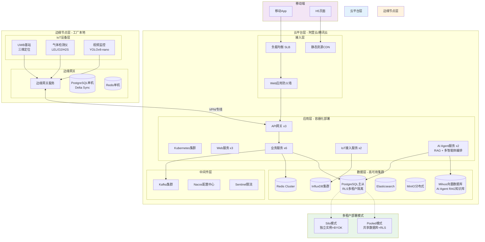
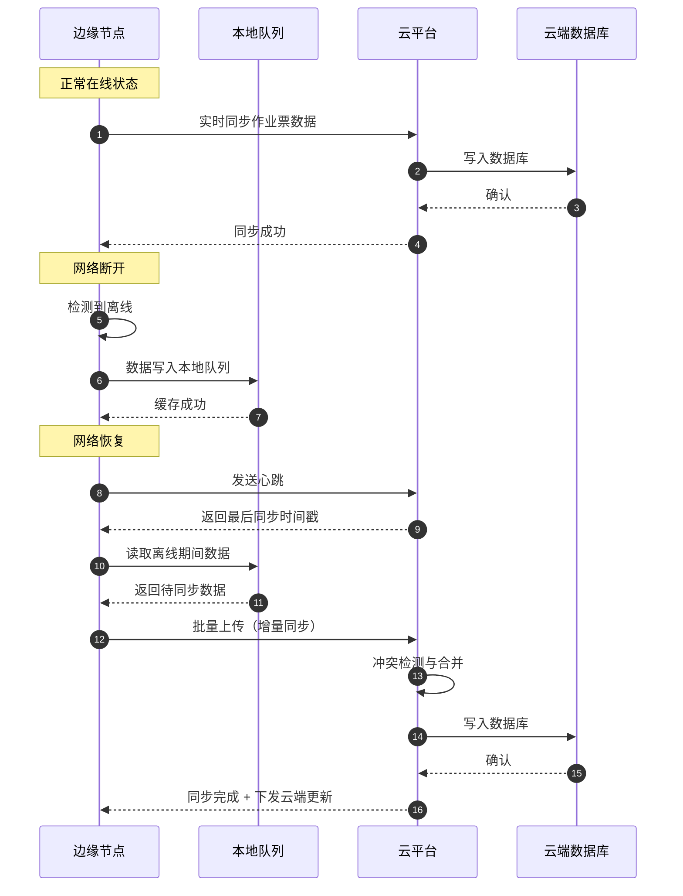
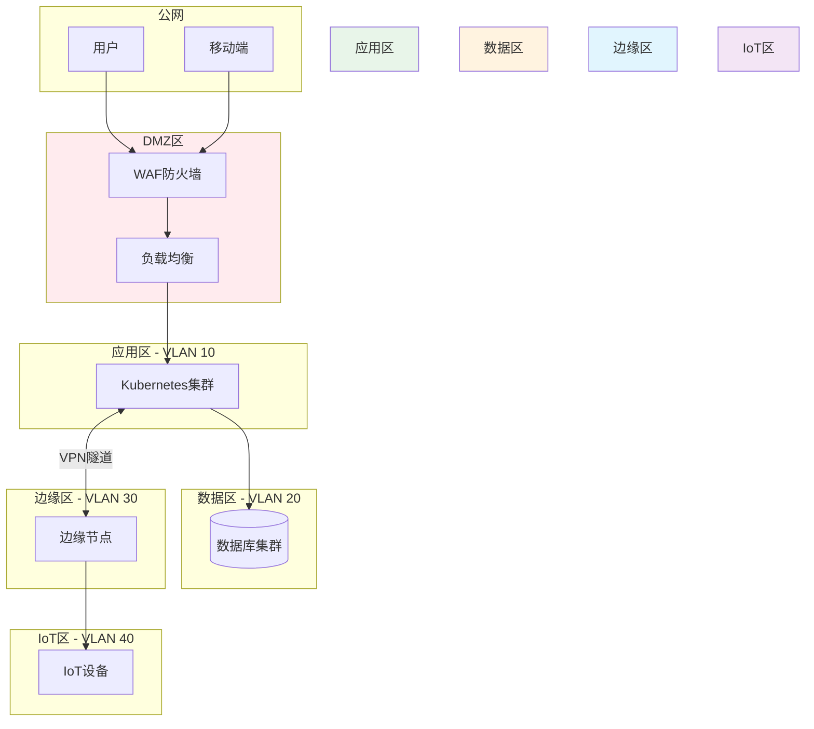
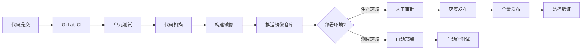
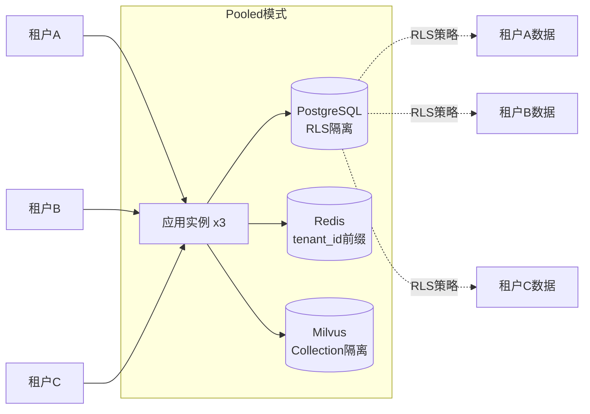
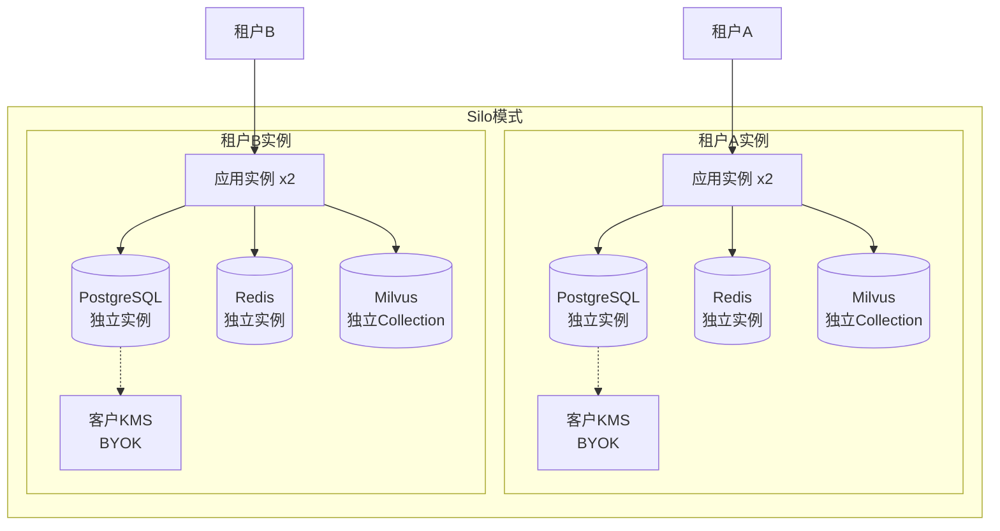
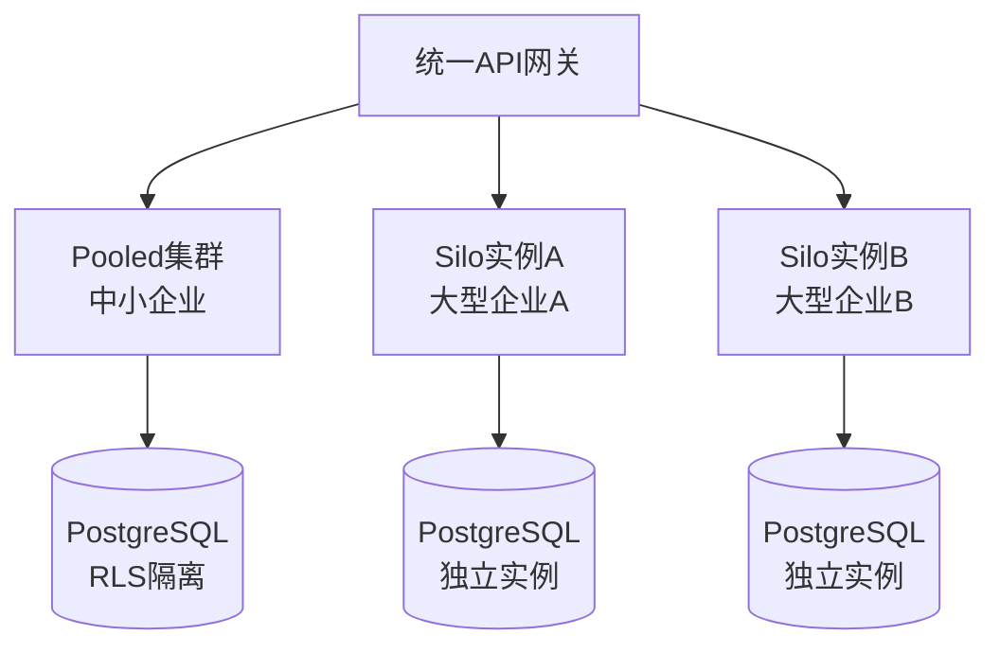

# 部署架构设计

**文档版本**：v2.0
**最后更新**：2026-03-10
**文档状态**：已发布
**作者**：产品架构团队

---

## 1. 背景与问题（为什么）

### 1.1 业务背景

危险化学品企业特殊作业许可（PTW）管理系统需要支持**云边协同**的部署模式，以应对化工企业的复杂场景：

**典型部署场景**：

| 场景类型 | 企业规模 | 部署需求 | 典型案例 |
|---------|---------|---------|---------|
| 集团化部署 | 10+ 分公司 | 集团云平台 + 各分公司边缘节点 | 中石化、中石油 |
| 单体企业 | 1个生产基地 | 私有云 + 车间边缘网关 | 地方化工园区 |
| 混合部署 | 3-5个工厂 | 公有云 + 专线 + 边缘节点 | 跨区域化工集团 |
| 离线场景 | 偏远工厂 | 边缘节点独立运行 + 定期同步 | 西部油田、海上平台 |

**核心挑战**：

1. **网络不稳定**：化工厂区网络环境复杂，存在弱网、断网场景
2. **数据敏感性**：作业票数据涉及企业安全机密，不能完全上云
3. **实时性要求**：IoT设备报警需要边缘侧快速响应（< 3秒）
4. **高可用要求**：系统故障可能导致作业停滞，影响生产安全
5. **合规性约束**：数据存储需符合《网络安全法》《数据安全法》要求

### 1.2 技术挑战

**挑战1：云边数据一致性**
- 边缘节点离线期间产生的数据如何与云端同步？
- 同一作业票在云端和边缘同时修改时的冲突解决
- 审批流程跨云边节点时的状态一致性

**挑战2：边缘节点资源受限**
- 边缘服务器通常配置较低（4核8G），无法运行完整微服务
- 需要精简的边缘版本，同时保证核心功能可用
- 边缘节点的自动化运维与远程升级

**挑战3：高可用架构设计**
- 云平台需要支持多可用区容灾
- 边缘节点单点故障时的降级策略
- 数据库主从切换、消息队列集群的高可用保障

**挑战4：安全隔离与访问控制**
- 云边通信链路的加密与认证
- 边缘节点与生产网络的隔离
- **多租户场景下的数据隔离**（Pooled 模式 vs Silo 模式）

**挑战5：AI Agent 向量数据库部署**
- Milvus/Qdrant 向量数据库的高可用部署
- 向量索引的内存占用与查询性能平衡
- 多租户向量数据隔离策略

**挑战6：PostgreSQL 迁移与 RLS 性能**
- 从 MySQL 迁移到 PostgreSQL 的数据迁移策略
- 行级安全策略（RLS）对查询性能的影响
- PostGIS 三维空间索引的性能优化

### 1.3 设计目标

| 目标 | 量化指标 | 优先级 |
|------|---------|-------|
| 系统可用性 | 云平台 ≥ 99.9%，边缘节点 ≥ 99.5% | P0 |
| 边缘离线容忍 | 支持72小时离线运行 + 自动同步 | P0 |
| 云边同步延迟 | 正常网络 < 5秒，弱网 < 30秒 | P1 |
| 故障恢复时间 | RTO ≤ 15分钟，RPO ≤ 5分钟 | P0 |
| 边缘资源占用 | CPU < 60%，内存 < 70%，磁盘 < 80% | P1 |
| 部署自动化 | 新节点上线 < 30分钟 | P1 |

---

## 2. 架构设计（是什么）

### 2.1 总体部署架构



### 2.2 云平台部署架构

#### 2.2.1 Kubernetes集群规划

**集群配置**：

| 节点类型 | 规格 | 数量 | 用途 |
|---------|------|------|------|
| Master节点 | 4核8G | 3 | 集群管理（高可用） |
| Worker节点 | 8核16G | 6+ | 运行业务Pod |
| GPU节点 | 8核32G + T4 | 2 | AI审计助手（可选） |

**命名空间划分**：

```yaml
# Kubernetes命名空间规划
namespaces:
  - ptw-prod:        # 生产环境
      resource_quota:
        cpu: "48"
        memory: "96Gi"
      network_policy: "strict"

  - ptw-staging:     # 预发布环境
      resource_quota:
        cpu: "16"
        memory: "32Gi"

  - ptw-monitoring:  # 监控组件
      components:
        - prometheus
        - grafana
        - alertmanager

  - ptw-middleware:  # 中间件
      components:
        - kafka
        - redis-cluster
        - nacos
```

#### 2.2.2 微服务部署清单

| 服务名称 | 副本数 | 资源配额 | 健康检查 | 自动扩缩容 |
|---------|-------|---------|---------|-----------|
| api-gateway | 3 | 2核4G | HTTP /health | CPU > 70% 扩容 |
| permit-service | 3 | 2核4G | gRPC健康检查 | QPS > 1000 扩容 |
| approval-service | 2 | 1核2G | HTTP /health | 固定副本 |
| iot-service | 2 | 2核4G | TCP连接检查 | 连接数 > 5000 扩容 |
| simops-service | 2 | 2核4G | HTTP /health | 固定副本 |
| notification-service | 2 | 1核2G | HTTP /health | 消息队列长度 > 1000 扩容 |
| **ai-agent-service** | **2** | **4核8G** | **HTTP /health** | **QPS > 500 扩容** |

#### 2.2.3 PostgreSQL 高可用部署

**部署架构**：主从复制 + Patroni 自动故障转移

**配置规格**：
- **主节点**：16核32G，SSD 1TB（IOPS 10000）
- **从节点**：16核32G，SSD 1TB（IOPS 10000）
- **备份节点**：8核16G，HDD 2TB（冷备份）

**关键配置**：
```yaml
# PostgreSQL 主从复制配置
postgresql:
  version: 15
  max_connections: 500
  shared_buffers: 8GB
  effective_cache_size: 24GB
  work_mem: 16MB
  maintenance_work_mem: 2GB

  # RLS 性能优化
  row_security: on
  enable_partition_pruning: on

  # PostGIS 三维空间索引优化
  postgis_version: 3.4
  max_parallel_workers_per_gather: 4

  # 复制配置
  wal_level: replica
  max_wal_senders: 10
  wal_keep_size: 1GB
  hot_standby: on
```

**Patroni 自动故障转移**：
```yaml
# Patroni 配置
patroni:
  scope: ptw-postgres-cluster
  name: postgres-node-1

  bootstrap:
    dcs:
      ttl: 30
      loop_wait: 10
      retry_timeout: 10
      maximum_lag_on_failover: 1048576  # 1MB

  postgresql:
    use_pg_rewind: true
    use_slots: true
    parameters:
      max_connections: 500
      shared_buffers: 8GB
```

#### 2.2.4 Milvus 向量数据库部署

**部署架构**：分布式集群（Coordinator + Worker + Storage）

**配置规格**：
- **Coordinator 节点**：4核8G x 2（高可用）
- **Query 节点**：8核16G x 3（查询负载均衡）
- **Data 节点**：8核16G x 2（数据写入）
- **Index 节点**：8核32G x 2（向量索引构建）
- **MinIO 存储**：对象存储（向量数据持久化）
- **etcd 集群**：元数据存储（3节点）

**关键配置**：
```yaml
# Milvus 集群配置
milvus:
  version: 2.3

  # 多租户隔离策略
  common:
    security:
      authorizationEnabled: true
      tlsMode: 1

  # 向量索引配置
  indexCoord:
    minSegmentNumRowsToEnableIndex: 1024

  # 查询性能优化
  queryNode:
    gracefulTime: 1000
    stats:
      publishInterval: 1000
    dataSync:
      flowGraph:
        maxQueueLength: 1024

  # 存储配置
  minio:
    bucketName: milvus-bucket
    rootPath: file
    useIAM: false

  # 租户隔离
  proxy:
    maxNameLength: 255
    maxFieldNum: 256
    maxDimension: 32768
```

**多租户向量数据隔离**：
```python
# Milvus 多租户 Collection 命名规范
collection_name_pattern = "tenant_{tenant_id}_knowledge_base"

# 示例：
# - tenant_abc123_knowledge_base
# - tenant_xyz789_knowledge_base

# 每个租户独立的 Collection，避免数据混淆
```

### 2.3 边缘节点部署架构

#### 2.3.1 边缘节点硬件配置

**最低配置**：

| 组件 | 规格 | 说明 |
|------|------|------|
| CPU | 4核 @ 2.0GHz | 支持虚拟化（Intel VT-x / AMD-V） |
| 内存 | 8GB DDR4 | 建议16GB以支持更多IoT设备 |
| 存储 | 256GB SSD | 用于本地数据缓存与日志 |
| 网络 | 千兆网卡 x2 | 一个连接生产网，一个连接IoT网 |
| 操作系统 | Ubuntu 22.04 LTS | 或CentOS 8 Stream |

#### 2.3.2 边缘服务精简版

边缘节点运行**轻量化版本**的核心服务：

```yaml
# 边缘节点Docker Compose配置
version: '3.8'
services:
  edge-gateway:
    image: ptw-edge-gateway:v1.0
    container_name: edge-gateway
    restart: always
    ports:
      - "8080:8080"   # HTTP API
      - "1883:1883"   # MQTT
    volumes:
      - ./data:/data
      - ./logs:/logs
    environment:
      - CLOUD_API_URL=https://cloud.ptw.com
      - OFFLINE_MODE=auto
      - SYNC_INTERVAL=60s
    deploy:
      resources:
        limits:
          cpus: '2'
          memory: 4G

  edge-db:
    image: sqlite:latest
    volumes:
      - ./db:/db

  edge-redis:
    image: redis:7-alpine
    command: redis-server --maxmemory 1gb --maxmemory-policy allkeys-lru
    ports:
      - "6379:6379"
```

**边缘服务功能对比**：

| 功能模块 | 云平台版 | 边缘精简版 | 说明 |
|---------|---------|-----------|------|
| 作业票申请 | ✅ 完整功能 | ✅ 完整功能 | 边缘可独立完成 |
| 审批流程 | ✅ 多级审批 | ✅ 本地审批 | 离线时仅支持本地审批人 |
| IoT数据接入 | ✅ 全协议 | ✅ MQTT/HTTP | 边缘侧主要协议 |
| SIMOPs检测 | ✅ 全局检测 | ⚠️ 本节点检测 | 离线时无法跨节点检测 |
| 统计报表 | ✅ 全量数据 | ❌ 不支持 | 需同步到云端后生成 |
| AI审计助手 | ✅ GPU加速 | ❌ 不支持 | 边缘无GPU资源 |

### 2.4 云边数据同步机制



**冲突解决策略**：

| 冲突类型 | 解决策略 | 示例 |
|---------|---------|------|
| 同一字段不同值 | 云端优先（审批相关） | 云端已审批，边缘修改作业内容 → 保留云端审批状态 |
| 状态机冲突 | 状态机规则校验 | 边缘"已完成"，云端"已挂起" → 保留"已挂起" |
| 新增记录无冲突 | 直接合并 | 边缘新增气体分析记录 → 直接上传 |
| 删除操作冲突 | 软删除标记 | 边缘删除附件，云端已引用 → 标记删除但保留 |

---

## 3. 实施方案（怎么做）

### 3.1 高可用架构实施

#### 3.1.1 数据库高可用

**MySQL主从架构 + MHA自动切换**：

```yaml
# MySQL高可用配置
mysql_ha:
  topology: "1主2从"
  replication: "半同步复制"
  failover_tool: "MHA (Master High Availability)"
  failover_time: "< 30秒"

  master:
    host: mysql-master.ptw.com
    port: 3306
    binlog_format: ROW
    sync_binlog: 1
    innodb_flush_log_at_trx_commit: 1

  slaves:
    - host: mysql-slave1.ptw.com
      lag_threshold: "< 1秒"
      read_only: true
    - host: mysql-slave2.ptw.com
      lag_threshold: "< 1秒"
      read_only: true

  mha_manager:
    monitor_interval: 3s
    master_ip_failover_script: "/usr/local/bin/master_ip_failover"
    vip: "10.0.1.100"  # 虚拟IP，应用连接此IP
```

**Redis Cluster高可用**：

```bash
# Redis Cluster配置（3主3从）
redis-cli --cluster create \
  10.0.1.11:6379 10.0.1.12:6379 10.0.1.13:6379 \
  10.0.1.14:6379 10.0.1.15:6379 10.0.1.16:6379 \
  --cluster-replicas 1

# 配置参数
cluster-enabled yes
cluster-node-timeout 5000
cluster-require-full-coverage no  # 部分节点故障时仍可用
```

#### 3.1.2 应用层高可用

**Kubernetes Pod反亲和性**：

```yaml
# 确保同一服务的Pod分散在不同节点
apiVersion: apps/v1
kind: Deployment
metadata:
  name: permit-service
spec:
  replicas: 3
  template:
    spec:
      affinity:
        podAntiAffinity:
          requiredDuringSchedulingIgnoredDuringExecution:
          - labelSelector:
              matchExpressions:
              - key: app
                operator: In
                values:
                - permit-service
            topologyKey: "kubernetes.io/hostname"
```

**健康检查与自动重启**：

```yaml
livenessProbe:
  httpGet:
    path: /health
    port: 8080
  initialDelaySeconds: 30
  periodSeconds: 10
  failureThreshold: 3

readinessProbe:
  httpGet:
    path: /ready
    port: 8080
  initialDelaySeconds: 10
  periodSeconds: 5
  failureThreshold: 2
```

### 3.2 网络安全与隔离

#### 3.2.1 网络拓扑



**防火墙规则**：

| 源 | 目标 | 端口 | 协议 | 说明 |
|----|------|------|------|------|
| 公网 | DMZ | 443 | HTTPS | 用户访问 |
| DMZ | 应用区 | 8080 | HTTP | 内部转发 |
| 应用区 | 数据区 | 3306 | MySQL | 数据库访问 |
| 应用区 | 边缘区 | 8443 | HTTPS | 云边同步 |
| 边缘区 | IoT区 | 1883 | MQTT | IoT数据采集 |
| 其他 | 其他 | * | * | **默认拒绝** |

#### 3.2.2 VPN隧道配置

云边通信采用 **IPsec VPN** 或 **WireGuard** 加密隧道：

```bash
# WireGuard配置示例（边缘节点）
[Interface]
PrivateKey = <edge_private_key>
Address = 10.10.1.2/24
ListenPort = 51820

[Peer]
PublicKey = <cloud_public_key>
Endpoint = cloud.ptw.com:51820
AllowedIPs = 10.10.1.0/24
PersistentKeepalive = 25
```

### 3.3 监控与告警体系

#### 3.3.1 监控指标

**基础设施监控**：

| 监控对象 | 关键指标 | 告警阈值 | 采集频率 |
|---------|---------|---------|---------|
| 服务器 | CPU使用率 | > 80% | 30秒 |
| 服务器 | 内存使用率 | > 85% | 30秒 |
| 服务器 | 磁盘使用率 | > 80% | 5分钟 |
| 网络 | 带宽使用率 | > 70% | 1分钟 |
| 数据库 | 主从延迟 | > 5秒 | 10秒 |
| Redis | 内存使用率 | > 80% | 1分钟 |

**应用监控**：

| 监控对象 | 关键指标 | 告警阈值 | 采集频率 |
|---------|---------|---------|---------|
| API网关 | QPS | > 10000 | 实时 |
| API网关 | P95延迟 | > 500ms | 实时 |
| API网关 | 错误率 | > 1% | 实时 |
| 业务服务 | 接口成功率 | < 99% | 1分钟 |
| 消息队列 | 消息堆积 | > 10000 | 1分钟 |
| 边缘节点 | 离线时长 | > 10分钟 | 1分钟 |

#### 3.3.2 告警通知

```yaml
# Prometheus告警规则示例
groups:
- name: ptw_alerts
  interval: 30s
  rules:
  - alert: HighCPUUsage
    expr: node_cpu_usage > 80
    for: 5m
    labels:
      severity: warning
    annotations:
      summary: "服务器CPU使用率过高"
      description: "{{ $labels.instance }} CPU使用率 {{ $value }}%"

  - alert: EdgeNodeOffline
    expr: edge_node_online == 0
    for: 10m
    labels:
      severity: critical
    annotations:
      summary: "边缘节点离线"
      description: "边缘节点 {{ $labels.node_id }} 已离线超过10分钟"

  - alert: PermitApprovalDelay
    expr: permit_approval_pending_time > 3600
    for: 30m
    labels:
      severity: warning
    annotations:
      summary: "作业票审批超时"
      description: "作业票 {{ $labels.permit_id }} 待审批超过1小时"
```

### 3.4 部署自动化

#### 3.4.1 CI/CD流水线



**GitLab CI配置示例**：

```yaml
# .gitlab-ci.yml
stages:
  - test
  - build
  - deploy

test:
  stage: test
  script:
    - mvn test
    - sonar-scanner  # 代码质量扫描

build:
  stage: build
  script:
    - docker build -t ptw-permit-service:$CI_COMMIT_SHA .
    - docker push registry.ptw.com/ptw-permit-service:$CI_COMMIT_SHA

deploy_staging:
  stage: deploy
  script:
    - kubectl set image deployment/permit-service \
        permit-service=registry.ptw.com/ptw-permit-service:$CI_COMMIT_SHA \
        -n ptw-staging
  only:
    - develop

deploy_prod:
  stage: deploy
  script:
    - kubectl set image deployment/permit-service \
        permit-service=registry.ptw.com/ptw-permit-service:$CI_COMMIT_SHA \
        -n ptw-prod
  when: manual  # 需要人工触发
  only:
    - main
```

#### 3.4.2 边缘节点自动化部署

```bash
#!/bin/bash
# 边缘节点一键部署脚本

set -e

echo "=== PTW边缘节点部署脚本 v1.0 ==="

# 1. 环境检查
check_requirements() {
    echo "[1/6] 检查系统环境..."
    command -v docker >/dev/null 2>&1 || { echo "Docker未安装"; exit 1; }
    command -v docker-compose >/dev/null 2>&1 || { echo "Docker Compose未安装"; exit 1; }
}

# 2. 下载配置文件
download_config() {
    echo "[2/6] 下载配置文件..."
    curl -o docker-compose.yml https://deploy.ptw.com/edge/docker-compose.yml
    curl -o .env https://deploy.ptw.com/edge/.env.template
}

# 3. 配置节点信息
configure_node() {
    echo "[3/6] 配置节点信息..."
    read -p "请输入节点ID: " NODE_ID
    read -p "请输入云平台地址: " CLOUD_URL
    sed -i "s/NODE_ID=.*/NODE_ID=$NODE_ID/" .env
    sed -i "s|CLOUD_API_URL=.*|CLOUD_API_URL=$CLOUD_URL|" .env
}

# 4. 启动服务
start_services() {
    echo "[4/6] 启动边缘服务..."
    docker-compose up -d
}

# 5. 健康检查
health_check() {
    echo "[5/6] 健康检查..."
    sleep 10
    curl -f http://localhost:8080/health || { echo "服务启动失败"; exit 1; }
}

# 6. 注册到云平台
register_to_cloud() {
    echo "[6/6] 注册到云平台..."
    curl -X POST $CLOUD_URL/api/edge/register \
        -H "Content-Type: application/json" \
        -d "{\"node_id\": \"$NODE_ID\", \"version\": \"1.0\"}"
}

# 执行部署
check_requirements
download_config
configure_node
start_services
health_check
register_to_cloud

echo "=== 部署完成！==="
```

---

## 4. 多租户部署模式（NEW）

### 4.1 Pooled 模式（共享数据库 + RLS）

**适用场景**：中小型企业、SaaS 标准版、成本敏感型客户

**架构特点**：
- 所有租户共享同一套应用实例和数据库
- 通过 PostgreSQL RLS（Row-Level Security）实现数据隔离
- 租户通过 `tenant_id` 字段区分
- 成本最低，资源利用率最高

**部署架构**：


**关键配置**：
```yaml
# Pooled 模式配置
deployment:
  mode: pooled
  tenant_isolation:
    method: rls  # Row-Level Security
    context_variable: app.current_tenant

  database:
    type: postgresql
    rls_enabled: true
    shared_schema: true

  cache:
    type: redis
    key_prefix: "tenant_{tenant_id}:"

  vector_db:
    type: milvus
    collection_pattern: "tenant_{tenant_id}_knowledge_base"
```

**优势**：
- ✅ 成本最低（共享资源）
- ✅ 运维简单（单一集群）
- ✅ 快速上线（无需独立部署）

**劣势**：
- ❌ 性能隔离弱（租户间相互影响）
- ❌ 安全性较低（共享数据库）
- ❌ 不支持 BYOK（Bring Your Own Key）

### 4.2 Silo 模式（独立实例 + BYOK）

**适用场景**：大型企业、高安全要求、合规性要求（如金融、军工）

**架构特点**：
- 每个租户独立的应用实例和数据库
- 支持 BYOK（客户自带加密密钥）
- 完全物理隔离，无数据泄露风险
- 成本最高，资源利用率最低

**部署架构**：


**关键配置**：
```yaml
# Silo 模式配置
deployment:
  mode: silo
  tenant_isolation:
    method: physical  # 物理隔离
    dedicated_instance: true

  database:
    type: postgresql
    instance_per_tenant: true
    encryption:
      byok_enabled: true
      kms_provider: customer  # 客户自带 KMS

  cache:
    type: redis
    instance_per_tenant: true

  vector_db:
    type: milvus
    instance_per_tenant: true
```

**优势**：
- ✅ 性能隔离强（独立资源）
- ✅ 安全性最高（物理隔离 + BYOK）
- ✅ 合规性强（满足金融、军工要求）

**劣势**：
- ❌ 成本最高（独立资源）
- ❌ 运维复杂（多集群管理）
- ❌ 上线周期长（需独立部署）

### 4.3 混合模式（Pooled + Silo）

**适用场景**：SaaS 平台同时服务中小企业和大型企业

**架构特点**：
- 中小企业使用 Pooled 模式（成本优先）
- 大型企业使用 Silo 模式（安全优先）
- 统一 API 网关，透明路由

**部署架构**：


**路由策略**：
```python
# 租户路由策略
def route_tenant_request(tenant_id):
    tenant_config = get_tenant_config(tenant_id)

    if tenant_config.deployment_mode == "silo":
        # 路由到独立实例
        return route_to_silo_instance(tenant_id)
    else:
        # 路由到共享集群
        return route_to_pooled_cluster(tenant_id)
```

---

## 5. 相关文档

### 5.1 架构文档引用

| 文档 | 路径 | 关联说明 |
| --- | --- | --- |
| 四层解耦架构 | [layered-architecture.md](./layered-architecture.md) | 微服务拆分与部署单元 |
| 数据库架构 | [database-design.md](./database-design.md) | PostgreSQL/Milvus 集群部署方案 |
| IoT边缘接入 | [iot-integration.md](./iot-integration.md) | 边缘网关部署架构 |
| SIMOPs冲突检测 | [simops-algorithm.md](./simops-algorithm.md) | 云边协同检测机制 |
| 安全与合规性 | [security-compliance.md](./security-compliance.md) | 网络安全、VPN配置、ZTNA 架构 |
| **AI Agent 引擎** | **[ai-agent-engine.md](./ai-agent-engine.md)** | **Milvus 向量数据库部署** |
| **多租户架构** | **[multi-tenant.md](./multi-tenant.md)** | **Pooled/Silo 模式详细设计** |

### 5.2 项目文档引用

| 文档 | 路径 | 关联说明 |
| --- | --- | --- |
| 项目知识库 | [PROJECTWIKI.md](../../PROJECTWIKI.md) | §10 维护建议（运维、监控） |
| 变更日志 | [CHANGELOG.md](../../CHANGELOG.md) | 部署相关变更记录 |
| ADR-002 | [docs/adr/20260309-upgrade-to-ptw-system.md](../adr/20260309-upgrade-to-ptw-system.md) | "1+8"架构部署策略 |

### 5.3 运维手册引用

| 手册 | 说明 |
| --- | --- |
| 《Kubernetes运维手册》 | Pod扩缩容、故障排查 |
| 《边缘节点运维手册》 | 离线恢复、数据同步 |
| 《PostgreSQL运维手册》 | 主从切换、备份恢复、RLS 性能优化 |
| 《Milvus运维手册》 | 向量索引优化、多租户管理 |
| 《监控告警手册》 | Prometheus规则配置 |

---

## 6. 附录

### 6.1 术语表

| 术语 | 英文 | 定义 |
|-----|------|------|
| RTO | Recovery Time Objective | 恢复时间目标（系统故障后恢复所需时间） |
| RPO | Recovery Point Objective | 恢复点目标（数据丢失的最大容忍时间） |
| RLS | Row-Level Security | PostgreSQL 行级安全策略（多租户隔离） |
| BYOK | Bring Your Own Key | 客户自带加密密钥 |
| Pooled | Pooled Model | 共享资源多租户模式 |
| Silo | Silo Model | 独立资源多租户模式 |
| Patroni | Patroni | PostgreSQL 高可用管理工具 |
| Milvus | Milvus | 开源向量数据库（AI Agent RAG） |
| PostGIS | PostGIS | PostgreSQL 地理信息系统扩展 |
| Delta Sync | Delta Sync | 增量同步（边缘离线场景） |

### 6.2 版本历史

| 版本 | 日期 | 变更内容 | 作者 |
|-----|------|---------|------|
| v1.0 | 2026-03-10 | 初始版本，定义云边协同部署架构 | 产品架构团队 |
| v2.0 | 2026-03-10 | **重大升级**：<br/>1. 数据库从 MySQL 迁移到 PostgreSQL<br/>2. 添加 Milvus 向量数据库部署方案<br/>3. 添加 AI Agent 服务部署<br/>4. 添加多租户部署模式（Pooled/Silo/混合）<br/>5. 边缘节点数据库从 SQLite 升级到 PostgreSQL<br/>6. 添加 Patroni 自动故障转移配置<br/>7. 更新 IoT 设备层（UWB 基站、YOLOv8-nano）<br/>8. 更新术语表（新增 RLS、BYOK、Milvus、Delta Sync） | 产品架构团队 |

---

**文档结束**
