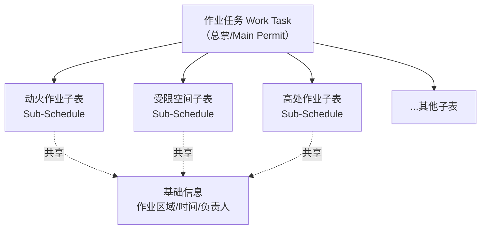
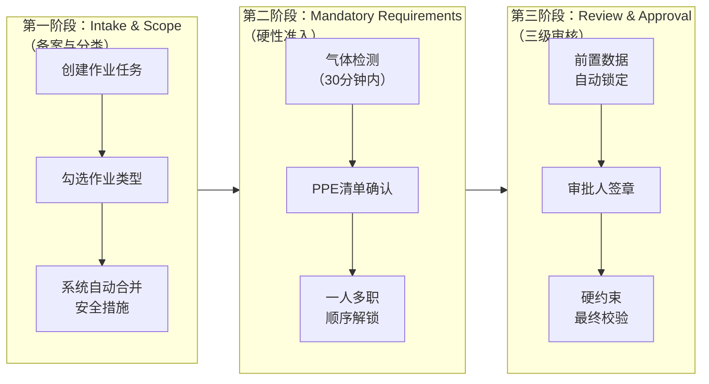
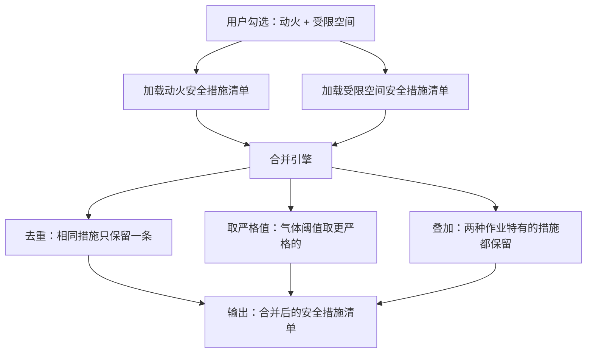
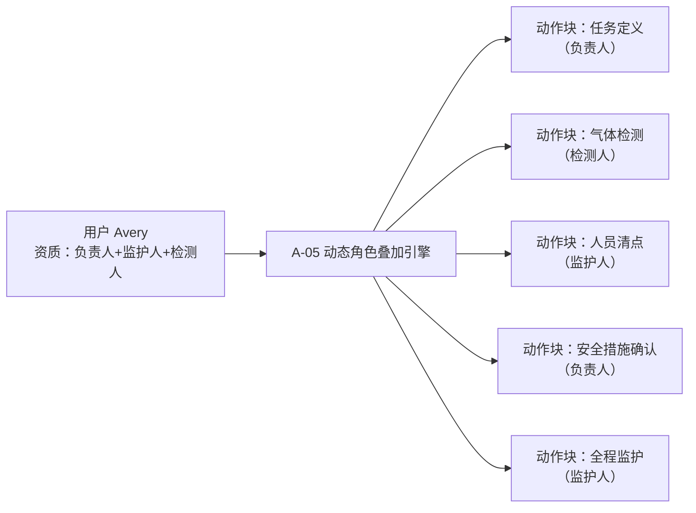
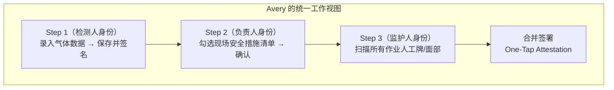
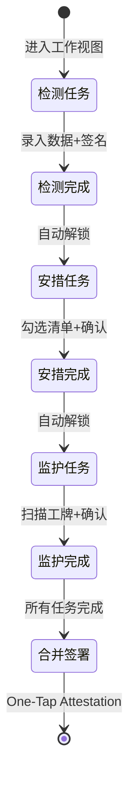

# DOB NOW 理念集成设计

**文档版本**：v1.0
**最后更新**：2026-03-11
**文档状态**：已发布
**作者**：产品架构团队

> 本文档定义如何将 DOB NOW（纽约市建筑局 DOB NOW 系统）的核心理念融入现有 PTW 系统架构。
> 采用**方案 A：渐进式融合**策略，在现有"1+8"架构和三层积木体系上做增量扩展。

---

## 1. 背景与动机

### 1.1 DOB NOW 系统简介

DOB NOW 是纽约市建筑局的在线许可管理系统，其核心设计理念：

- **一张总票（Main Permit）+ 多个子表（Sub-Schedules）**：一个工程案号，根据勾选的子项动态加载模块
- **角色权限动态叠加**：根据登录人资质自动点亮可操作的"动作块"
- **一人多角色工作流合并**：时间轴任务链模式，统一视图完成多角色任务
- **硬性硬约束（System Hard-Rules）**：不可绕过的系统级强制规则

### 1.2 适配目标

将 DOB NOW 理念适配到中国化工/工业企业"八大特种作业"场景，核心转变：

| 维度 | 当前模式 | DOB NOW 模式 |
| --- | --- | --- |
| 票据结构 | 8种独立作业票 + 关联票机制 | 一张作业任务（总票）+ 动态子表 |
| 角色权限 | 静态角色分配，固定菜单 | 资质驱动，动态点亮动作块 |
| 工作流 | 按角色分离，多页面切换 | 时间轴任务链，统一视图 |
| 约束执行 | 规则引擎 + 可忽略的警告 | 硬约束引擎，不可绕过 |

### 1.3 设计原则

1. **增量扩展**：保留现有架构，通过新增组件实现 DOB NOW 理念
2. **配置驱动**：所有 DOB NOW 能力通过配置开关控制，支持渐进式启用
3. **向后兼容**：现有8种独立作业票模式继续可用，DOB NOW 模式作为增强选项
4. **合规优先**：所有变更必须符合 GB 30871、AQ 3064.2、AQ 3064.3 标准

---

## 2. 一张总票 + 动态子表（Main Permit + Sub-Schedules）

### 2.1 概念模型



**与现有架构的关系**：

- `Work Task`（总票）= 新增概念，对应 `work_permit_main` 表的 `is_main_permit=TRUE` 记录
- `Sub-Schedule`（子表）= 现有 `work_permit_main` 表的 `is_main_permit=FALSE` 记录
- 通过 `parent_permit_id` 字段建立父子关系
- 现有 `permit_association` 表的 `relationship_mode=PARENT_CHILD` 记录对应此关系

### 2.2 数据模型扩展

在 `work_permit_main` 表新增字段：

```sql
ALTER TABLE work_permit_main ADD COLUMN parent_permit_id VARCHAR(32)
    REFERENCES work_permit_main(permit_id);
ALTER TABLE work_permit_main ADD COLUMN is_main_permit BOOLEAN NOT NULL DEFAULT TRUE;
ALTER TABLE work_permit_main ADD COLUMN task_sequence INT DEFAULT 0;
ALTER TABLE work_permit_main ADD COLUMN role_stack JSONB DEFAULT '[]';

CREATE INDEX idx_permit_parent ON work_permit_main(parent_permit_id);
CREATE INDEX idx_permit_main_flag ON work_permit_main(is_main_permit);
```

在 `permit_association` 表新增字段：

```sql
ALTER TABLE permit_association ADD COLUMN relationship_mode VARCHAR(20)
    NOT NULL DEFAULT 'PEER'
    CHECK (relationship_mode IN ('PEER','PARENT_CHILD'));
ALTER TABLE permit_association ADD COLUMN task_order INT DEFAULT 0;
ALTER TABLE permit_association ADD COLUMN auto_created BOOLEAN NOT NULL DEFAULT FALSE;
```

### 2.3 DOB 风格操作流（三阶段）



**第一阶段 Intake & Scope**：
- 用户创建"作业任务"（总票），填写基础信息（区域、时间、负责人）
- 勾选涉及的作业类型（如"受限空间"+"动火"）
- 系统自动合并两种作业的安全措施清单（去重 + 取严格值）
- 如果申请人同时是负责人，系统自动合并"任务定义"与"资源组织"界面

**第二阶段 Mandatory Requirements**：
- 气体检测必须在"开工前30分钟"内完成录入（硬约束）
- 系统弹出对应的 PPE 清单（受限空间需长管呼吸器，高处需安全带）
- 一人多职时，系统强制要求先完成检测并保存，才能解锁"开工"按钮

**第三阶段 Review & Approval**：
- 审批人进入后，所有前置数据（检测值、交底记录）自动锁定为 Read-Only
- 电子签章即代表对所有前置模块的终审
- 硬约束引擎在签章前做最终校验（关联票完整性、资质有效性等）

### 2.4 前端交互设计

**申请入口变更**：

```
旧模式：选择作业类型 → 进入对应表单
新模式：创建作业任务 → 勾选涉及的作业类型 → 动态展开对应子表
```

**SubTaskPanel 组件**：

```
┌──────────────────────────────────────────┐
│ 作业任务 #WT-2026-0001                    │
│ 区域：3号罐区  时间：2026-03-11 08:00-17:00│
├──────────────────────────────────────────┤
│ 涉及的作业类型：                          │
│ ☑ 动火作业（特级）     [展开/折叠]        │
│ ☑ 受限空间作业         [展开/折叠]        │
│ ☐ 高处作业             [+ 添加]           │
│ ☐ 吊装作业             [+ 添加]           │
│ ☐ ...                                    │
├──────────────────────────────────────────┤
│ ▼ 动火作业（特级）子表                    │
│   动火方式：电焊                          │
│   动火等级：特级                          │
│   可燃气体阈值：< 20% LEL                │
│   ...                                    │
├──────────────────────────────────────────┤
│ ▼ 受限空间作业子表                        │
│   空间名称：3号储罐                       │
│   能源隔离：已确认                        │
│   气体检测：O₂/H₂S/CO/LEL               │
│   ...                                    │
└──────────────────────────────────────────┘
```

### 2.5 安全措施自动合并逻辑

当一个作业任务包含多种作业类型时，系统自动合并安全措施：



---

## 3. 角色权限动态叠加（Role-Based Dynamic UI）

### 3.1 概念模型



### 3.2 数据模型

新增 `role_action_mapping` 表：

```sql
CREATE TABLE role_action_mapping (
    mapping_id      VARCHAR(32) PRIMARY KEY,
    tenant_id       VARCHAR(32) NOT NULL,
    permit_type     VARCHAR(20) NOT NULL,
    permit_stage    VARCHAR(20) NOT NULL
        CHECK (permit_stage IN ('申请','审批','安措','作业','验收')),
    role_code       VARCHAR(30) NOT NULL,
    action_code     VARCHAR(50) NOT NULL,
    is_stackable    BOOLEAN NOT NULL DEFAULT FALSE,
    stack_with      JSONB DEFAULT '[]',
    priority        INT NOT NULL DEFAULT 0,
    constraint_expr TEXT,
    created_at      TIMESTAMPTZ NOT NULL DEFAULT NOW(),
    CONSTRAINT fk_ram_tenant FOREIGN KEY (tenant_id) REFERENCES tenant(tenant_id)
);
```

### 3.3 角色叠加规则

| 角色组合 | 叠加策略 | 约束条件 |
| --- | --- | --- |
| 申请人 + 负责人 | 合并"任务定义"与"资源组织"界面 | 无 |
| 负责人 + 监护人 | 合并"安全措施确认"与"全程监护"界面 | 同一作业区域 |
| 审批人 + 气体检测人 | 合并"审批"与"气体检测"界面 | 审批人必须先完成检测 |
| 审批人 + 作业人/监护人 | **禁止叠加**（互斥逻辑硬约束） | Approver ≠ Worker/Supervisor |

### 3.4 前端 RoleStackIndicator 组件

```
┌──────────────────────────────────────────┐
│ 👤 Avery                                 │
│ 当前身份：[负责人●] [监护人○] [检测人○]   │
│                                          │
│ ● = 当前激活角色                          │
│ ○ = 可切换角色                            │
│ ✕ = 不可用角色（约束冲突）                │
└──────────────────────────────────────────┘
```

---

## 4. 一人多角色工作流合并（Unified Workflow）

### 4.1 时间轴任务链模式

当用户持有多个角色时，系统自动生成"时间轴任务链"：



### 4.2 合并签署（One-Tap Attestation）

在所有动作完成后，底部弹出统一签署框：

```
"本人 [姓名] 承诺：
已完成环境检测（数据合格）、
已落实安全措施、
已确认人员资质，
并将在作业期间履行全程监护职责。"

[电子签名] [GPS定位锁定] [时间戳]
```

**后端逻辑**：
- 一次签署生成多条签名记录（每个角色一条）
- 每条记录关联到对应的审批节点
- GPS 定位在签署时锁定，确保在现场

### 4.3 顺序解锁机制

一人多职时，系统强制按顺序完成任务：



---

## 5. 硬性硬约束（System Hard-Rules）

> 详细设计见 [hard-rules-engine.md](./hard-rules-engine.md)

### 5.1 四大硬约束概览

| 编号 | 约束项 | 详细逻辑 | 触发点 | 违反后果 |
| --- | --- | --- | --- | --- |
| HR-01 | 互斥逻辑 | Approver_ID ≠ Worker_ID 且 ≠ Supervisor_ID | 角色分配时 | 拒绝分配 |
| HR-02 | 时效失效 | 气体检测超过30分钟未开工 → 自动作废 | 激活作业时 | 强制重新检测 |
| HR-03 | 位置漂移 | 监护人离开作业点10米外 | 作业进行中（实时） | 自动报警+暂停作业票 |
| HR-04 | 资质强制 | 特种作业操作证必须在有效期内 | 人员分配时 | 拒绝分配 |

### 5.2 与现有系统的关系

- HR-01 → 扩展 A-04 角色权限引擎的校验逻辑
- HR-02 → 扩展 CB-11 气体分析共享的时效校验
- HR-03 → 扩展 CB-05 监护人管理的围栏检测
- HR-04 → 扩展 A-01 人员资质管理的实时校验

---

## 6. 配置包扩展

在现有配置包结构基础上新增 DOB NOW 相关配置：

```json
{
  "form_schema": "...(保留)",
  "jsa_template": "...(保留)",
  "approval_flow": "...(保留)",
  "checklist_items": "...(保留)",
  "role_config": "...(保留)",
  "constraint_rules": "...(保留)",
  "association_rules": "...(保留，第8章)",

  "dob_now_config": {
    "sub_task_config": {
      "enabled": true,
      "auto_detect_rules": ["AR-01","AR-02","AR-06","AR-07"],
      "max_sub_tasks": 5,
      "lifecycle_sync": true,
      "safety_measure_merge": true
    },
    "role_stacking_config": {
      "enabled": true,
      "stackable_pairs": [
        {"role_a": "applicant", "role_b": "supervisor", "stages": ["申请","作业"]},
        {"role_a": "supervisor", "role_b": "guardian", "stages": ["作业"]},
        {"role_a": "approver", "role_b": "gas_analyst", "stages": ["审批","安措"]}
      ],
      "forbidden_pairs": [
        {"role_a": "approver", "role_b": "worker"},
        {"role_a": "approver", "role_b": "supervisor"}
      ]
    },
    "workflow_merge_config": {
      "enabled": true,
      "one_tap_attestation": true,
      "sequential_unlock": true
    },
    "hard_constraints": {
      "role_exclusion": {"type": "BLOCK", "trigger": "ASSIGN", "bypass": false},
      "gas_expiration_minutes": 30,
      "supervisor_fence_meters": 10,
      "license_realtime_check": true
    }
  }
}
```

---

## 7. 积木架构调整

### 7.1 新增原子积木

| 编号 | 名称 | 域 | 职责 | 输入 | 输出 |
| --- | --- | --- | --- | --- | --- |
| A-05 | 动态角色叠加引擎 | 身份与权限 | 检测用户持有的多个角色，计算叠加权限集，支持角色切换 | userId + permitId + stage | `RoleStack{roles[], mergedPermissions[], activeRole}` |
| C-05 | 硬约束执行引擎 | 流程与审批 | 从配置加载硬约束规则，在指定触发点强制执行，不可绕过 | triggerPoint + permitData | `ConstraintResult{pass/block, reason, alarmCode}` |

### 7.2 扩展组合积木

| 编号 | 变更 | 新增的原子积木 | 变更说明 |
| --- | --- | --- | --- |
| CB-01 | 扩展 | +A-05（角色叠加） | 申请时检测用户角色栈，支持一人多角色填写 |
| CB-02 | 扩展 | +A-05 + C-05 | 审批时支持角色叠加签批，硬约束强制拦截 |
| CB-06 | 扩展 | +C-05 | 冲突检测结果为"禁止同时"时，升级为硬约束 |

---

## 8. MVP 范围（V1.0 新增）

| DOB NOW 能力 | MVP 范围 | V2.0 范围 |
| --- | --- | --- |
| 一张总票 + 动态子表 | ✅ 完整实现 | 优化体验 |
| 硬约束引擎（四大硬约束） | ✅ 完整实现 | 扩展更多规则 |
| 角色动态叠加 | ⚠️ 简化版（2-3个常见组合） | 完整版（所有组合） |
| 一人多角色工作流合并 | ⚠️ 基础版（顺序解锁） | 完整版（One-Tap Attestation） |

---

## 9. 相关文档

- [八层解耦架构设计](./layered-architecture.md)
- [硬约束引擎详细设计](./hard-rules-engine.md)
- [SIMOPs冲突检测算法](./simops-algorithm.md)
- [数据库架构设计](./database-design.md)
- [ADR：采用 DOB NOW 模块化作业票模式](../adr/20260311-adopt-dob-now-model.md)

---

## 10. 版本历史

| 版本 | 日期 | 变更内容 | 作者 |
| --- | --- | --- | --- |
| v1.0 | 2026-03-11 | 初始版本，定义 DOB NOW 四大核心理念的集成方案 | 产品架构团队 |

---

**文档结束**
