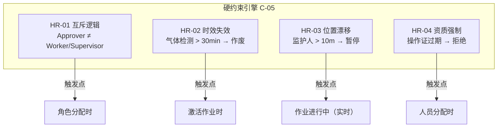
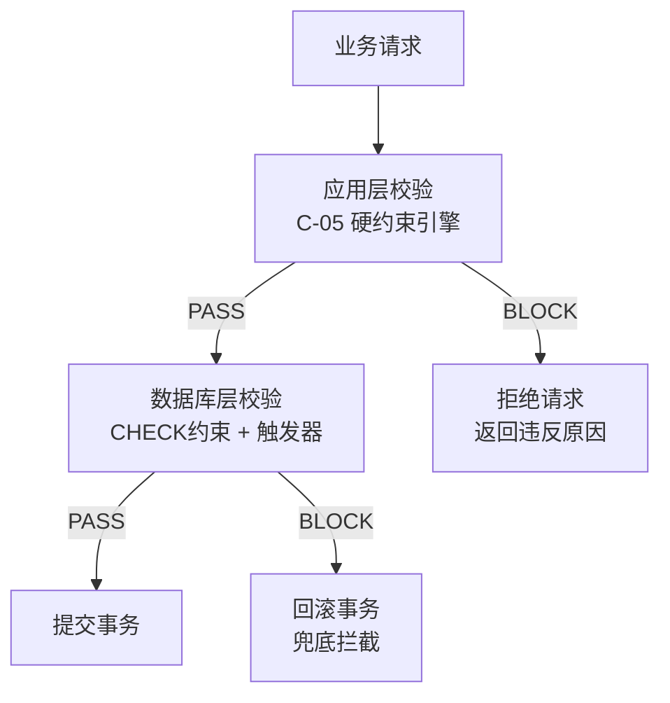
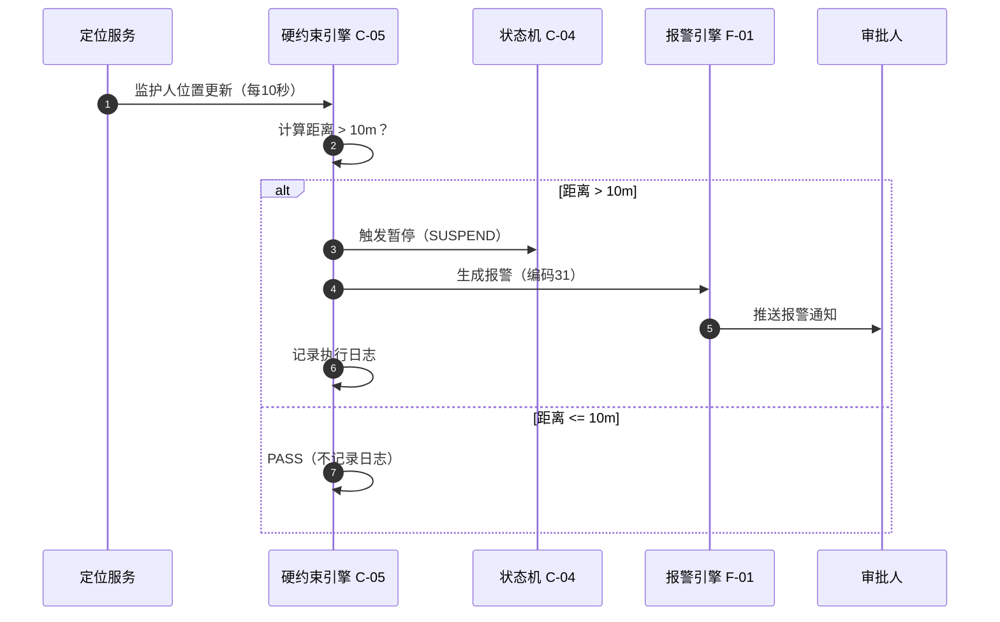

# 硬约束引擎详细设计（Hard-Rules Engine）

**文档版本**：v1.0
**最后更新**：2026-03-11
**文档状态**：已发布
**作者**：产品架构团队

> 本文档定义"硬约束引擎"（C-05 原子积木）的详细设计，确保系统级强制规则不可被人工绕过。
> 核心理念：防止电子系统变成"电子走形式"。

---

## 1. 设计目标

### 1.1 问题陈述

当前系统的合规规则引擎（E-04 Drools）支持规则配置和报警触发，但存在关键缺陷：

- 报警可被审批人"忽略"或"确认后继续"
- 缺少数据库层兜底约束
- 时效性规则（如气体检测30分钟过期）依赖人工判断
- 位置漂移检测仅报警，不自动暂停作业票

### 1.2 设计原则

1. **不可绕过**：硬约束触发时，系统强制拦截，不提供"忽略"选项
2. **双层执行**：应用层 + 数据库层双重校验，防止绕过应用层直接操作数据库
3. **实时响应**：位置漂移、气体超标等实时约束必须在秒级响应
4. **可审计**：所有硬约束触发事件记录到审计日志，不可篡改

---

## 2. 硬约束规则定义

### 2.1 四大核心硬约束



### 2.2 规则详细定义

#### HR-01 互斥逻辑（Role Exclusion）

| 属性 | 值 |
| --- | --- |
| 规则编号 | HR-01 |
| 规则名称 | 审批人与作业人/监护人互斥 |
| 约束类型 | BLOCK（不可绕过） |
| 触发点 | 角色分配时（ASSIGN） |
| 条件表达式 | `approver.userId == worker.userId \|\| approver.userId == supervisor.userId` |
| 违反后果 | 拒绝分配，提示"审批人不得同时担任作业人或监护人" |
| 报警编码 | 无（前置拦截，不产生报警） |
| 规范依据 | GB 30871 §4.3 审批人员不得为作业人员 |
| 数据库约束 | CHECK 约束 + 触发器 |

#### HR-02 时效失效（Gas Expiration）

| 属性 | 值 |
| --- | --- |
| 规则编号 | HR-02 |
| 规则名称 | 气体检测时效校验 |
| 约束类型 | BLOCK（不可绕过） |
| 触发点 | 激活作业时（ACTIVATE）+ 定时扫描（每5分钟） |
| 条件表达式 | `NOW() - gasReading.timestamp > INTERVAL '30 minutes'` |
| 违反后果 | 自动作废当前气体检测记录，强制重新检测 |
| 报警编码 | 42（气体检测超时） |
| 规范依据 | GB 30871 §5.3.5 动火分析合格后30分钟内未开工需重新分析 |
| 数据库约束 | 定时任务 + 状态机联动 |

#### HR-03 位置漂移（Geo-Fencing）

| 属性 | 值 |
| --- | --- |
| 规则编号 | HR-03 |
| 规则名称 | 监护人在岗围栏检测 |
| 约束类型 | BLOCK（不可绕过） |
| 触发点 | 作业进行中（实时，每10秒检测） |
| 条件表达式 | `ST_Distance(supervisor.position, worksite.center) > 10` |
| 违反后果 | 自动推送报警给审批人 + 暂停作业票（状态→已挂起） |
| 报警编码 | 31（监护人脱岗） |
| 规范依据 | GB 30871 §4.4 监护人应在现场 |
| 数据库约束 | PostGIS 空间查询 + 事件驱动 |

#### HR-04 资质强制（License Validation）

| 属性 | 值 |
| --- | --- |
| 规则编号 | HR-04 |
| 规则名称 | 特种作业操作证实时校验 |
| 约束类型 | BLOCK（不可绕过） |
| 触发点 | 人员分配时（ASSIGN）+ 作业激活时（ACTIVATE） |
| 条件表达式 | `license.expiryDate < NOW() \|\| license.status != 'VALID'` |
| 违反后果 | 拒绝分配/激活，提示"操作证已过期或无效" |
| 报警编码 | 50（资质不符） |
| 规范依据 | AQ 3064.2 §5.3.1 人员资质校验 |
| 数据库约束 | 外键约束 + 触发器 |

---

## 3. 数据模型

### 3.1 硬约束配置表

```sql
CREATE TABLE hard_constraint_config (
    constraint_id   VARCHAR(32) PRIMARY KEY,
    tenant_id       VARCHAR(32) NOT NULL,
    constraint_code VARCHAR(10) NOT NULL UNIQUE,
    constraint_name VARCHAR(100) NOT NULL,
    constraint_type VARCHAR(20) NOT NULL
        CHECK (constraint_type IN ('BLOCK','WARN_THEN_BLOCK','ESCALATE')),
    trigger_point   VARCHAR(30) NOT NULL
        CHECK (trigger_point IN ('ASSIGN','SUBMIT','APPROVE','ACTIVATE','RUNTIME','CLOSE')),
    condition_expr  TEXT NOT NULL,
    action_on_fail  VARCHAR(20) NOT NULL
        CHECK (action_on_fail IN ('REJECT','SUSPEND','ALARM','ESCALATE')),
    bypass_allowed  BOOLEAN NOT NULL DEFAULT FALSE,
    alarm_code      VARCHAR(10),
    regulation_ref  VARCHAR(200),
    is_active       BOOLEAN NOT NULL DEFAULT TRUE,
    created_at      TIMESTAMPTZ NOT NULL DEFAULT NOW(),
    CONSTRAINT fk_hcc_tenant FOREIGN KEY (tenant_id) REFERENCES tenant(tenant_id)
);
```

### 3.2 硬约束执行日志表

```sql
CREATE TABLE hard_constraint_log (
    log_id          VARCHAR(32) PRIMARY KEY,
    tenant_id       VARCHAR(32) NOT NULL,
    constraint_id   VARCHAR(32) NOT NULL,
    permit_id       VARCHAR(32) NOT NULL,
    user_id         VARCHAR(32),
    trigger_point   VARCHAR(30) NOT NULL,
    result          VARCHAR(10) NOT NULL CHECK (result IN ('PASS','BLOCK')),
    violation_detail JSONB,
    alarm_event_id  VARCHAR(32),
    created_at      TIMESTAMPTZ NOT NULL DEFAULT NOW(),
    CONSTRAINT fk_hcl_constraint FOREIGN KEY (constraint_id)
        REFERENCES hard_constraint_config(constraint_id)
);

CREATE INDEX idx_hcl_permit ON hard_constraint_log(permit_id);
CREATE INDEX idx_hcl_time ON hard_constraint_log(created_at);
```

---

## 4. 执行架构

### 4.1 双层执行模型



### 4.2 实时约束执行流



---

## 5. 与现有系统的集成

### 5.1 与 E-04 合规规则引擎的关系

| 维度 | E-04 合规规则引擎 | C-05 硬约束引擎 |
| --- | --- | --- |
| 定位 | 业务规则判定 | 系统级强制约束 |
| 可绕过性 | 可以（审批人确认后继续） | 不可以（系统强制拦截） |
| 执行层 | 应用层（Drools） | 应用层 + 数据库层 |
| 规则来源 | Drools DRL 文件 | hard_constraint_config 表 |
| 适用场景 | 合规判定、风险评估、阈值判断 | 角色互斥、时效失效、位置漂移、资质强制 |

### 5.2 与报警编码体系的关系

硬约束触发时复用现有报警编码：

| 硬约束 | 报警编码 | 报警名称 |
| --- | --- | --- |
| HR-02 时效失效 | 42 | 气体检测超时 |
| HR-03 位置漂移 | 31 | 监护人脱岗 |
| HR-04 资质强制 | 50 | 资质不符 |
| HR-01 互斥逻辑 | 无 | 前置拦截，不产生报警 |

---

## 6. 前端交互

### 6.1 HardConstraintDialog 组件

硬约束触发时弹出不可关闭的弹窗：

```
┌──────────────────────────────────────────┐
│ ⛔ 系统硬约束拦截                         │
│                                          │
│ 违反规则：HR-02 气体检测时效校验          │
│ 规范依据：GB 30871 §5.3.5                │
│                                          │
│ 详细信息：                                │
│ 气体检测时间：2026-03-11 08:00            │
│ 当前时间：    2026-03-11 08:35            │
│ 超时：35分钟（阈值30分钟）                │
│                                          │
│ 处理方式：                                │
│ 当前气体检测记录已自动作废。              │
│ 请重新进行气体检测后再激活作业。          │
│                                          │
│ [重新检测]  [返回作业列表]                │
│                                          │
│ ⚠️ 此约束不可绕过                         │
└──────────────────────────────────────────┘
```

---

## 7. 扩展性设计

### 7.1 自定义硬约束

企业可以通过配置新增自定义硬约束：

```json
{
  "constraint_code": "HR-C01",
  "constraint_name": "夜间作业升级审批",
  "constraint_type": "ESCALATE",
  "trigger_point": "SUBMIT",
  "condition_expr": "permit.plannedStart.hour >= 22 || permit.plannedStart.hour <= 6",
  "action_on_fail": "ESCALATE",
  "bypass_allowed": false,
  "regulation_ref": "企业内控标准 §3.2"
}
```

### 7.2 未来扩展方向

| 阶段 | 新增硬约束 | 说明 |
| --- | --- | --- |
| V2.0 | 天气条件约束 | 风力>5级禁止高处作业 |
| V2.0 | 疲劳检测约束 | 连续作业>4小时强制休息 |
| V3.0 | AI 异常行为约束 | 视频识别违章行为自动暂停 |

---

## 8. 相关文档

- [DOB NOW 理念集成设计](./dob-now-integration.md)
- [八层解耦架构设计](./layered-architecture.md)
- [标准化报警编码](./alarm-coding.md)
- [安全与合规性架构](./security-compliance.md)

---

## 9. 版本历史

| 版本 | 日期 | 变更内容 | 作者 |
| --- | --- | --- | --- |
| v1.0 | 2026-03-11 | 初始版本，定义四大核心硬约束及执行架构 | 产品架构团队 |

---

**文档结束**