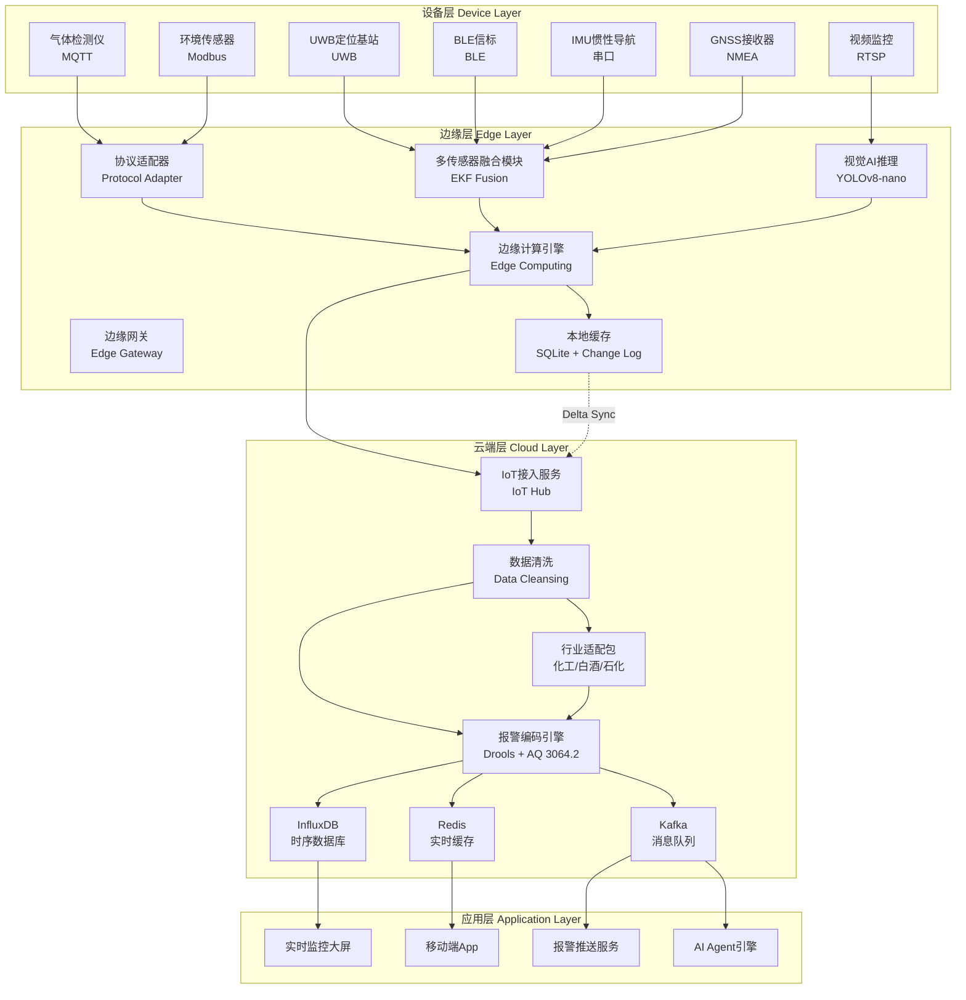

# IoT边缘接入架构

**文档版本**：v2.0
**最后更新**：2026-03-10
**文档状态**：已发布
**作者**：产品架构团队

---

## 1. 背景与问题（为什么）

### 1.1 业务背景

危险化学品企业特殊作业许可（PTW）管理系统需要实时监测作业现场的环境参数，确保作业安全。根据GB 30871-2022标准，特级动火作业必须进行**连续气体监测**，受限空间作业需要**实时氧含量监测**，这些都依赖于IoT设备的数据采集与传输。

**核心监测指标**：
- **可燃气体浓度（LEL）**：爆炸下限百分比，特级动火要求连续监测
- **氧含量（O₂）**：受限空间作业要求19.5%-21.0%
- **有毒气体（H₂S、CO等）**：硫化氢、一氧化碳浓度监测
- **环境参数**：温度、湿度、气压
- **人员定位**：监护人地理围栏、作业人员位置追踪

### 1.2 技术挑战

**挑战1：设备异构性**
- 不同厂商的气体检测仪通信协议不统一（MQTT、Modbus、HTTP等）
- 数据格式差异大（JSON、XML、二进制）
- 设备能力参差不齐（有的支持边缘计算，有的仅能上报原始数据）

**挑战2：网络环境复杂**
- 化工现场信号屏蔽严重（金属设备、塔群）
- 4G/5G信号不稳定，存在信号盲区
- 防爆区域对无线设备有严格限制

**挑战3：实时性要求高**
- 气体浓度超标需在**3秒内**触发报警
- 监护人脱岗需在**10秒内**通知审批人
- 数据延迟超过**30秒**视为设备离线

**挑战4：数据量大**
- 单个企业可能部署100+个IoT设备
- 特级动火连续监测：每秒产生10-100条数据
- 年数据量可达**数亿条**，需要高效存储与查询

**挑战5：多传感器融合定位**
- 化工厂多层结构需要三维定位（经度、纬度、高程）
- 单一定位技术（UWB/BLE/GNSS）各有盲区，需多传感器融合
- AQ 3064.3-2025 要求静态误差 ±3m、漏报率 <10%、误报率 <15%
- 签批场景需 1-5s 高频上报，常规场景 5-30s

**挑战6：行业适配扩展**
- AQ 7006-2025 白酒行业需监测乙醇蒸气浓度、静电消除状态、粉尘浓度
- 不同行业的监测指标、阈值、报警规则差异大
- 需要可插拔的行业适配包机制

### 1.3 设计目标

1. **协议适配**：支持MQTT、HTTP、Modbus等主流协议，屏蔽设备差异
2. **边缘计算**：在边缘侧完成阈值判断，减少云端压力
3. **离线容错**：网络中断时本地缓存数据，恢复后**增量同步**（Delta Sync）
4. **实时报警**：气体浓度超标3秒内触发报警，报警编码符合 AQ 3064.2 附录 A.4
5. **高效存储**：时序数据库（InfluxDB）存储，支持快速查询，含租户隔离
6. **多传感器融合**：UWB + BLE + IMU + GNSS 扩展卡尔曼滤波，满足 AQ 3064.3 ±3m 精度
7. **行业适配**：可插拔行业适配包（化工基础包 + 白酒行业包 AQ 7006）

---

## 2. 架构设计（是什么）

### 2.1 总体架构图



### 2.2 三层架构说明

#### 设备层（Device Layer）

**职责**：数据采集与上报

| 设备类型 | 通信协议 | 数据频率 | 典型厂商 |
|---------|---------|---------|---------|
| **气体检测仪** | MQTT/HTTP | 1-10秒/次 | 霍尼韦尔、梅思安 |
| **UWB定位基站** | UWB | 1-5秒/次（签批）、5-30秒/次（常规） | 清研讯科、全迹科技 |
| **BLE信标** | BLE 5.0 | 1-5秒/次 | 苹果iBeacon、Nordic |
| **IMU惯性导航** | 串口/SPI | 100Hz（内部融合后降频） | 博世BMI270、InvenSense |
| **GNSS接收器** | NMEA 0183 | 1秒/次 | 北斗、u-blox |
| **环境传感器** | Modbus/MQTT | 30-60秒/次 | 施耐德、西门子 |
| **视频监控** | RTSP/ONVIF | 实时流 | 海康威视、大华 |
| **乙醇蒸气检测仪**（白酒） | MQTT | 5-10秒/次 | 汉威科技 |
| **静电消除器**（白酒） | Modbus | 10秒/次 | 基恩士 |
| **粉尘浓度检测仪**（白酒） | MQTT | 10-30秒/次 | 梅思安 |

**设备能力分级**：
- **L1（基础型）**：仅上报原始数据，无边缘计算能力
- **L2（智能型）**：支持本地阈值判断，超标时主动上报
- **L3（高级型）**：支持边缘AI，可进行异常模式识别

#### 边缘层（Edge Layer）

**职责**：协议转换、边缘计算、多传感器融合、离线缓存

**核心组件**：

1. **边缘网关（Edge Gateway）**
   - 硬件：工业级网关（如研华ARK系列），防爆认证（Ex ia IIC T4）
   - 操作系统：Linux（Ubuntu/CentOS）
   - 容器化：Docker部署边缘服务

2. **协议适配器（Protocol Adapter）**
   - MQTT Broker：Mosquitto/EMQX
   - HTTP Server：Nginx + FastAPI
   - Modbus Gateway：pymodbus
   - UWB/BLE：厂商SDK适配层

3. **边缘计算引擎（Edge Computing）**
   - 阈值判断：气体浓度超标检测（含行业适配阈值）
   - 数据聚合：多设备数据融合
   - 异常检测：基于规则的异常识别
   - 报警编码生成：按 AQ 3064.2 附录 A.4 编码格式

4. **多传感器融合模块（EKF Fusion）**
   - 算法：扩展卡尔曼滤波（Extended Kalman Filter）
   - 输入源：UWB（权重0.6）+ BLE（权重0.25）+ IMU（权重0.1）+ GNSS（权重0.05）
   - 输出：融合后三维坐标（x, y, z）+ 精度估计
   - 盲区补偿：IMU 惯性导航在 UWB/BLE 信号丢失时持续推算
   - 详细设计：参见 [人员定位深度设计](./personnel-positioning.md)

5. **本地缓存（Local Cache）**
   - SQLite：离线数据缓存 + change_log 增量记录
   - Redis：实时数据缓存
   - 同步策略：Delta Sync 增量同步替代全量扫描

6. **视觉AI推理（P1 阶段）**
   - 模型：YOLOv8-nano（边缘优化版）
   - 检测目标：焊接火花、受限空间进入、高处作业安全带
   - 触发：检测到未办票作业时生成报警编码 60-01-3
   - 详细设计：参见 [报警编码体系](./alarm-coding.md) §3.3

#### 云端层（Cloud Layer）

**职责**：数据存储、报警编码引擎、行业适配、报警推送

**核心组件**：

1. **IoT接入服务（IoT Hub）**
   - 协议：MQTT over TLS、HTTP/HTTPS
   - 认证：设备证书、Token认证
   - 负载均衡：Nginx + Keepalived
   - 租户隔离：MQTT Topic 含 tenant_id 前缀

2. **数据清洗（Data Cleansing）**
   - 去重：基于设备ID + 时间戳 + tenant_id
   - 异常值过滤：3σ原则
   - 数据补全：线性插值

3. **报警编码引擎（Drools + AQ 3064.2）**
   - 规则管理：Drools 统一管理（替代 Redis 简单规则配置）
   - 编码格式：{类型码2位}-{子类码2位}-{严重等级1位}
   - 报警闭环：触发 → 确认 → 处置 → 反馈 → 归档
   - 自动升级：超时未处置自动升级严重等级
   - 详细设计：参见 [报警编码体系](./alarm-coding.md)

4. **行业适配包（Industry Adapter）**
   - 基础包（GB 30871）：8大作业类型通用监测指标
   - 化工包（AQ 3064）：LEL/O2/H2S/CO 标准阈值
   - 白酒包（AQ 7006）：乙醇蒸气浓度（≤25% LEL）、静电消除联锁、粉尘浓度（≤10 mg/m³）
   - 石化包（预留）：可扩展

5. **时序数据库（InfluxDB）**
   - 数据保留策略：原始数据保留7天，小时聚合90天，日聚合1年
   - 降采样：1分钟/1小时/1天连续查询
   - 索引：tenant_id + 设备ID + 时间戳
   - 人员定位时序：personnel_position measurement

---

## 3. 实施方案（怎么做）

### 3.1 协议适配层设计

#### 3.1.1 MQTT协议适配

**设备上报格式**（JSON）：

```json
{
  "device_id": "GAS-001",
  "timestamp": 1710057600000,
  "data": {
    "lel": 0.15,
    "o2": 20.8,
    "h2s": 0.5,
    "co": 10,
    "temperature": 25.3,
    "humidity": 60
  },
  "location": {
    "latitude": 30.456,
    "longitude": 120.123
  }
}
```

**MQTT Topic设计**：

```
iot/{enterprise_id}/{device_type}/{device_id}/data
iot/{enterprise_id}/{device_type}/{device_id}/alarm
iot/{enterprise_id}/{device_type}/{device_id}/status
```

**示例**：
- 数据上报：`iot/ENT001/gas/GAS-001/data`
- 报警上报：`iot/ENT001/gas/GAS-001/alarm`
- 设备状态：`iot/ENT001/gas/GAS-001/status`

**边缘网关订阅**：

```python
import paho.mqtt.client as mqtt

def on_message(client, userdata, msg):
    topic = msg.topic
    payload = json.loads(msg.payload)

    # 解析设备ID
    device_id = topic.split('/')[-2]

    # 边缘计算：阈值判断
    if payload['data']['lel'] > 0.5:
        trigger_alarm(device_id, 'LEL超标', payload['data']['lel'])

    # 上报云端
    send_to_cloud(payload)

client = mqtt.Client()
client.on_message = on_message
client.connect("localhost", 1883, 60)
client.subscribe("iot/+/+/+/data")
client.loop_forever()
```

#### 3.1.2 HTTP协议适配

**设备上报接口**：

```
POST /api/iot/data
Content-Type: application/json
Authorization: Bearer {device_token}

{
  "device_id": "LOC-001",
  "timestamp": 1710057600000,
  "data": {
    "latitude": 30.456,
    "longitude": 120.123,
    "accuracy": 5
  }
}
```

**边缘网关接收**（FastAPI）：

```python
from fastapi import FastAPI, Header
from pydantic import BaseModel

app = FastAPI()

class IoTData(BaseModel):
    device_id: str
    timestamp: int
    data: dict

@app.post("/api/iot/data")
async def receive_data(data: IoTData, authorization: str = Header(None)):
    # 验证Token
    if not verify_token(authorization):
        return {"error": "Unauthorized"}

    # 边缘计算：地理围栏判断
    if not in_geofence(data.data['latitude'], data.data['longitude']):
        trigger_alarm(data.device_id, '监护人脱岗', data.data)

    # 上报云端
    send_to_cloud(data.dict())

    return {"status": "ok"}
```

### 3.2 边缘计算引擎

#### 3.2.1 阈值判断逻辑

**气体浓度阈值表**（存储在边缘网关）：

```json
{
  "lel": {
    "warning": 0.2,
    "danger": 0.5,
    "critical": 1.0
  },
  "o2": {
    "min": 19.5,
    "max": 21.0
  },
  "h2s": {
    "warning": 5,
    "danger": 10
  },
  "co": {
    "warning": 20,
    "danger": 50
  }
}
```

**边缘计算代码**：

```python
def edge_computing(device_id, data):
    thresholds = load_thresholds()
    alarms = []

    # LEL判断
    if data['lel'] > thresholds['lel']['critical']:
        alarms.append({
            'level': 'critical',
            'type': 'LEL超标',
            'value': data['lel'],
            'threshold': thresholds['lel']['critical']
        })
    elif data['lel'] > thresholds['lel']['danger']:
        alarms.append({
            'level': 'danger',
            'type': 'LEL超标',
            'value': data['lel'],
            'threshold': thresholds['lel']['danger']
        })

    # 氧含量判断
    if data['o2'] < thresholds['o2']['min'] or data['o2'] > thresholds['o2']['max']:
        alarms.append({
            'level': 'critical',
            'type': '氧含量异常',
            'value': data['o2'],
            'threshold': f"{thresholds['o2']['min']}-{thresholds['o2']['max']}"
        })

    # 触发报警
    if alarms:
        for alarm in alarms:
            trigger_alarm(device_id, alarm)

    return alarms
```

#### 3.2.2 数据聚合与降噪

**滑动窗口平均**（避免瞬时波动）：

```python
from collections import deque

class SlidingWindow:
    def __init__(self, window_size=3):
        self.window = deque(maxlen=window_size)

    def add(self, value):
        self.window.append(value)

    def average(self):
        if len(self.window) == 0:
            return None
        return sum(self.window) / len(self.window)

# 使用示例
lel_window = SlidingWindow(window_size=3)

def process_data(data):
    lel_window.add(data['lel'])
    avg_lel = lel_window.average()

    # 使用平均值判断
    if avg_lel > 0.5:
        trigger_alarm('LEL超标', avg_lel)
```

### 3.3 离线缓存与 Delta Sync 增量同步

#### 3.3.1 本地缓存设计

**SQLite表结构**（含 change_log 增量记录）：

```sql
-- 离线数据缓存表
CREATE TABLE iot_data_cache (
    id INTEGER PRIMARY KEY AUTOINCREMENT,
    tenant_id VARCHAR(32) NOT NULL,
    device_id VARCHAR(32) NOT NULL,
    timestamp BIGINT NOT NULL,
    data TEXT NOT NULL,  -- JSON格式
    synced INTEGER DEFAULT 0,  -- 0=未同步, 1=已同步
    created_at DATETIME DEFAULT CURRENT_TIMESTAMP
);

CREATE INDEX idx_synced ON iot_data_cache(synced);
CREATE INDEX idx_timestamp ON iot_data_cache(timestamp);
CREATE INDEX idx_tenant ON iot_data_cache(tenant_id);

-- 变更日志表（Delta Sync 核心）
CREATE TABLE change_log (
    log_id INTEGER PRIMARY KEY AUTOINCREMENT,
    tenant_id VARCHAR(32) NOT NULL,
    table_name VARCHAR(64) NOT NULL,
    record_id VARCHAR(64) NOT NULL,
    operation VARCHAR(10) NOT NULL,  -- INSERT/UPDATE/DELETE
    changed_fields TEXT,  -- JSON: 变更字段列表
    old_values TEXT,      -- JSON: 变更前值
    new_values TEXT,      -- JSON: 变更后值
    source_node VARCHAR(32) NOT NULL,  -- 来源节点标识
    is_synced INTEGER DEFAULT 0,
    synced_at DATETIME,
    created_at DATETIME DEFAULT CURRENT_TIMESTAMP
);

CREATE INDEX idx_change_sync ON change_log(is_synced, created_at);
CREATE INDEX idx_change_tenant ON change_log(tenant_id);
```

**缓存写入**（含 change_log 记录）：

```python
import sqlite3
import json
import uuid

def cache_data(tenant_id, device_id, timestamp, data):
    conn = sqlite3.connect('/data/iot_cache.db')
    cursor = conn.cursor()

    # 写入数据缓存
    cursor.execute('''
        INSERT INTO iot_data_cache (tenant_id, device_id, timestamp, data)
        VALUES (?, ?, ?, ?)
    ''', (tenant_id, device_id, timestamp, json.dumps(data)))

    # 写入变更日志（Delta Sync）
    cursor.execute('''
        INSERT INTO change_log
        (tenant_id, table_name, record_id, operation, new_values, source_node)
        VALUES (?, ?, ?, ?, ?, ?)
    ''', (tenant_id, 'iot_data_cache', str(cursor.lastrowid),
          'INSERT', json.dumps(data), get_node_id()))

    conn.commit()
    conn.close()
```

#### 3.3.2 Delta Sync 增量同步机制

**同步策略**（替代全量扫描）：
- 网络正常：实时上报（不经过 change_log）
- 网络中断：本地缓存 + change_log 记录
- 网络恢复：基于 change_log 增量同步（仅同步变更记录）
- 冲突解决：服务端优先 + 冲突日志记录

**Delta Sync 同步代码**：

```python
import requests
from datetime import datetime

def delta_sync(tenant_id):
    """增量同步：仅同步 change_log 中未同步的变更"""
    conn = sqlite3.connect('/data/iot_cache.db')
    cursor = conn.cursor()

    # 1. 查询未同步的变更日志（替代全量扫描 iot_data_cache）
    cursor.execute('''
        SELECT log_id, table_name, record_id, operation,
               changed_fields, old_values, new_values, source_node
        FROM change_log
        WHERE tenant_id = ? AND is_synced = 0
        ORDER BY created_at
        LIMIT 500
    ''', (tenant_id,))

    changes = cursor.fetchall()
    if not changes:
        return

    # 2. 构建增量同步包
    sync_payload = {
        'tenant_id': tenant_id,
        'source_node': get_node_id(),
        'changes': [{
            'log_id': c[0],
            'table_name': c[1],
            'record_id': c[2],
            'operation': c[3],
            'changed_fields': json.loads(c[4]) if c[4] else None,
            'old_values': json.loads(c[5]) if c[5] else None,
            'new_values': json.loads(c[6]) if c[6] else None,
            'source_node': c[7]
        } for c in changes]
    }

    try:
        # 3. 推送增量变更到服务端
        response = requests.post(
            'https://cloud.example.com/api/sync/delta',
            json=sync_payload,
            headers={'X-Tenant-Id': tenant_id},
            timeout=15
        )

        if response.status_code == 200:
            result = response.json()
            synced_ids = result.get('synced_ids', [])
            conflicts = result.get('conflicts', [])

            # 4. 标记已同步
            if synced_ids:
                cursor.execute(f'''
                    UPDATE change_log
                    SET is_synced = 1, synced_at = ?
                    WHERE log_id IN ({','.join('?' * len(synced_ids))})
                ''', [datetime.now().isoformat()] + synced_ids)

            # 5. 记录冲突（服务端优先，保留冲突日志）
            for conflict in conflicts:
                print(f"冲突: {conflict['record_id']} - "
                      f"服务端版本优先，本地变更已记录")

            conn.commit()
    except Exception as e:
        print(f"Delta Sync 失败: {e}")
    finally:
        conn.close()

# 定时任务（每10秒执行一次）
import schedule
schedule.every(10).seconds.do(lambda: delta_sync(get_current_tenant()))
```

#### 3.3.3 终端边缘围栏判断

**移动端 App 内嵌轻量围栏模块**（离线场景下本地判断）：

```python
import math

def local_geofence_check(person_pos, fence_center, h_radius, z_min, z_max):
    """终端侧轻量围栏判断（无需网络）"""
    # 水平距离（Haversine 简化版，短距离近似）
    dx = (person_pos['x'] - fence_center['x']) * 111320 * math.cos(
        math.radians(fence_center['y']))
    dy = (person_pos['y'] - fence_center['y']) * 110540
    h_distance = math.sqrt(dx**2 + dy**2)

    # Z 轴范围
    z_ok = z_min <= person_pos['z'] <= z_max

    return h_distance <= h_radius and z_ok
```

### 3.4 云端数据处理

#### 3.4.1 数据清洗

**去重逻辑**：

```python
def deduplicate(data_list):
    seen = set()
    unique_data = []

    for data in data_list:
        key = f"{data['device_id']}_{data['timestamp']}"
        if key not in seen:
            seen.add(key)
            unique_data.append(data)

    return unique_data
```

**异常值过滤**（3σ原则）：

```python
import numpy as np

def filter_outliers(values):
    mean = np.mean(values)
    std = np.std(values)

    filtered = []
    for v in values:
        if abs(v - mean) <= 3 * std:
            filtered.append(v)

    return filtered
```

#### 3.4.2 写入InfluxDB

**数据写入**（含租户隔离 tag）：

```python
from influxdb_client import InfluxDBClient, Point
from influxdb_client.client.write_api import SYNCHRONOUS

client = InfluxDBClient(url="http://localhost:8086", token="my-token", org="my-org")
write_api = client.write_api(write_options=SYNCHRONOUS)

def write_to_influxdb(tenant_id, device_id, data, permit_id=None):
    point = Point("iot_monitoring") \
        .tag("tenant_id", tenant_id) \
        .tag("device_id", device_id) \
        .tag("sensor_type", "gas") \
        .tag("permit_id", permit_id or "unlinked") \
        .field("lel", data['lel']) \
        .field("o2", data['o2']) \
        .field("h2s", data['h2s']) \
        .field("co", data['co']) \
        .time(data['timestamp'], write_precision='ms')

    write_api.write(bucket="iot_data", record=point)

def write_position_to_influxdb(tenant_id, person_id, position, device_type="FUSED"):
    """写入人员定位时序数据"""
    point = Point("personnel_position") \
        .tag("tenant_id", tenant_id) \
        .tag("person_id", person_id) \
        .tag("device_type", device_type) \
        .field("x", position['x']) \
        .field("y", position['y']) \
        .field("z", position['z']) \
        .field("accuracy", position.get('accuracy', 3.0)) \
        .field("speed", position.get('speed', 0.0)) \
        .field("in_geofence", position.get('in_geofence', True))

    write_api.write(bucket="iot_data", record=point)
```

### 3.5 报警编码集成与推送

#### 3.5.1 报警编码引擎集成

**报警规则管理**（Drools 统一管理，替代 Redis 简单配置）：

报警编码格式遵循 AQ 3064.2 附录 A.4：`{类型码}-{子类码}-{严重等级}`

详细编码定义参见 [报警编码体系](./alarm-coding.md)。

**边缘侧报警生成**（含编码）：

```python
def generate_alarm_with_code(tenant_id, device_id, permit_id, data):
    """边缘侧生成带标准编码的报警"""
    alarms = []

    # LEL 超标检测
    if data.get('lel', 0) > 0.5:
        severity = 4 if data['lel'] > 1.0 else 3
        alarms.append({
            'alarm_code': f'01-01-{severity}',  # 气体-LEL超标-严重等级
            'tenant_id': tenant_id,
            'permit_id': permit_id,
            'device_id': device_id,
            'trigger_value': {'lel': data['lel']},
            'location': data.get('location')
        })

    # 氧含量异常
    o2 = data.get('o2', 20.9)
    if o2 < 19.5 or o2 > 21.0:
        alarms.append({
            'alarm_code': '01-02-4',  # 气体-氧含量异常-极高
            'tenant_id': tenant_id,
            'permit_id': permit_id,
            'device_id': device_id,
            'trigger_value': {'o2': o2}
        })

    # 白酒行业：乙醇蒸气超标（AQ 7006）
    ethanol = data.get('ethanol_vapor', 0)
    if ethanol > 0.25:  # 25% LEL
        alarms.append({
            'alarm_code': '01-05-3',  # 气体-乙醇蒸气-高
            'tenant_id': tenant_id,
            'permit_id': permit_id,
            'device_id': device_id,
            'trigger_value': {'ethanol_vapor': ethanol}
        })

    return alarms
```

#### 3.5.2 推送服务

**WebSocket推送**（实时监控大屏，含租户隔离）：

```python
from fastapi import WebSocket, Query

@app.websocket("/ws/monitor")
async def websocket_endpoint(
    websocket: WebSocket,
    tenant_id: str = Query(...)
):
    await websocket.accept()

    # 订阅租户专属频道
    pubsub = redis_client.pubsub()
    pubsub.subscribe(f'{tenant_id}:alarm_channel')

    for message in pubsub.listen():
        if message['type'] == 'message':
            alarm_data = json.loads(message['data'])
            # 附加报警编码描述
            alarm_data['alarm_name'] = get_alarm_name(alarm_data['alarm_code'])
            await websocket.send_json(alarm_data)
```

**移动端推送**（极光推送/Firebase）：

```python
import jpush

def send_push_notification(tenant_id, user_ids, alarm):
    push = jpush.JPush(app_key='your_app_key', master_secret='your_secret')

    # 构建报警消息（含编码）
    message = (f"【{alarm['alarm_code']}】"
               f"作业票{alarm['permit_id']}"
               f"{get_alarm_name(alarm['alarm_code'])}")

    push_payload = push.create_push()
    push_payload.audience = jpush.audience(
        jpush.alias(*[f"{tenant_id}_{uid}" for uid in user_ids])
    )
    push_payload.notification = jpush.notification(alert=message)
    push_payload.platform = jpush.all_

    push_payload.send()
```

---

## 4. 相关文档

### 4.1 上游文档

- [ADR-002: 产品范围从单一动火系统升级为完整PTW系统](../adr/20260309-upgrade-to-ptw-system.md)
- [四层解耦架构设计](./layered-architecture.md)
- [数据库架构设计](./database-design.md)

### 4.2 下游文档

- [SIMOPs冲突检测算法](./simops-algorithm.md)
- [安全与合规性架构](./security-compliance.md)
- [部署架构设计](./deployment-architecture.md)

### 4.3 v2.0 新增关联文档

- [AI Agent 智能体引擎架构](./ai-agent-engine.md) — 时空一致性智能体消费定位数据
- [人员定位深度设计](./personnel-positioning.md) — 多传感器融合算法详细设计
- [报警编码体系](./alarm-coding.md) — AQ 3064.2 报警编码定义与 Drools 规则
- [多租户 SaaS 架构](./multi-tenant.md)（待生成） — 租户隔离策略

### 4.4 标准引用

- GB 30871-2022《危险化学品企业特殊作业安全规范》
- AQ 3064.2-2025《工业互联网+危化安全生产 特殊作业审批及过程管理》
- AQ 3064.3-2025《工业互联网+危化安全生产 人员定位》
- AQ 7006-2025《白酒生产企业安全管理规范》

### 4.5 产品文档

- [PRD.md - 产品需求文档](../../产出/PRD.md)（待生成）
- [roadmap.md - 产品路线图](../../产出/roadmap.md)（待生成）

---

## 5. 附录

### 5.1 术语表

| 术语 | 英文 | 定义 |
|-----|------|------|
| IoT | Internet of Things | 物联网 |
| MQTT | Message Queuing Telemetry Transport | 消息队列遥测传输协议 |
| LEL | Lower Explosive Limit | 爆炸下限 |
| UWB | Ultra-Wideband | 超宽带定位技术，精度 ±0.1-0.3m |
| BLE | Bluetooth Low Energy | 低功耗蓝牙定位技术 |
| IMU | Inertial Measurement Unit | 惯性测量单元 |
| GNSS | Global Navigation Satellite System | 全球导航卫星系统 |
| EKF | Extended Kalman Filter | 扩展卡尔曼滤波，多传感器融合算法 |
| RTSP | Real Time Streaming Protocol | 实时流传输协议 |
| Delta Sync | Incremental Synchronization | 增量同步，基于 change_log 的离线数据同步 |
| Drools | JBoss Rules Engine | Java 规则引擎，用于报警编码管理 |
| 3σ原则 | Three-Sigma Rule | 统计学中的异常值检测方法 |

### 5.2 版本历史

| 版本 | 日期 | 变更内容 | 作者 |
|-----|------|---------|------|
| v1.0 | 2026-03-10 | 初始版本，定义IoT边缘接入架构 | 产品架构团队 |
| v2.0 | 2026-03-10 | 多传感器融合模块（EKF）、Delta Sync 增量同步、报警编码引擎（Drools + AQ 3064.2）、白酒行业适配包（AQ 7006）、视觉AI推理（YOLOv8-nano）、租户隔离、人员定位时序写入 | 产品架构团队 |

---

**文档结束**
