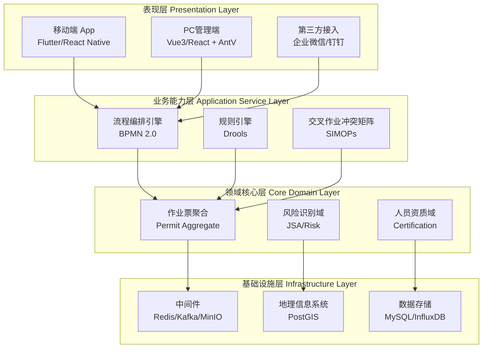
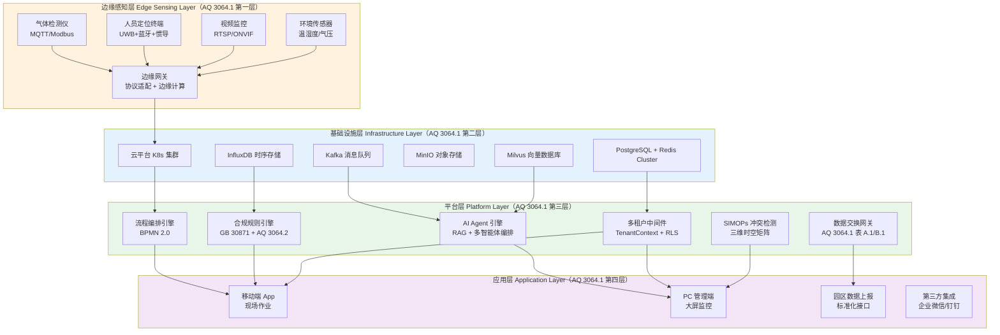
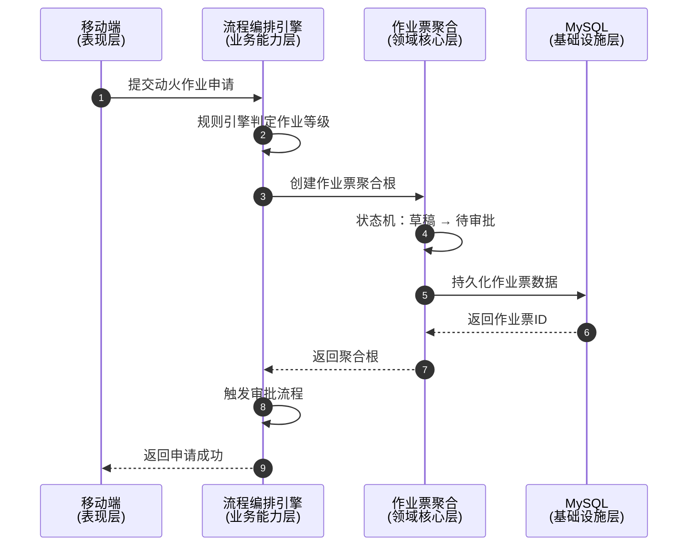

# 八层解耦架构设计

**文档版本**：v3.0
**最后更新**：2026-03-10
**文档状态**：已发布
**作者**：产品架构团队

---

## 1. 背景与问题（为什么）

### 1.1 业务背景

危险化学品企业特殊作业许可（PTW）管理系统需要支持8大特殊作业类型，每种作业都有独特的业务流程、审批逻辑和安全要求。系统必须在保证业务灵活性的同时，确保架构的可扩展性和可维护性。

### 1.2 技术挑战

**挑战1：业务复杂度高**
- 8大作业类型各有特色，但又存在共性
- 交叉作业场景需要多票联动
- 审批流程动态可配置

**挑战2：技术栈多样**
- 移动端（Flutter/React Native）
- PC端（Vue3/React）
- IoT设备接入（MQTT/HTTP）
- 多种数据存储（MySQL、Redis、InfluxDB、MinIO、Neo4j、Milvus）

**挑战3：合规性要求严格**
- GB 30871-2022强制性标准
- 电子签名法
- 数据不可篡改
- 全程留痕审计

**挑战4：AI决策可信度**
- 复杂安全逻辑需要跨文档依赖推理
- 模型幻觉可能导致误判
- AI决策需要可解释性与人机协同

**挑战5：大规模实时并发**
- 化工园区数千名作业人员 + 万级传感器点位
- 毫秒级异常检测与报警
- 边缘弱网环境下的离线自治

**挑战6：多租户SaaS公平性**
- 大客户复杂作业占用过多资源（Noisy Neighbor）
- 小客户安全实时性受影响
- 数据主权与隔离要求

### 1.3 设计目标

1. **业务抽象化**：将8大作业的共性抽象为通用底座，差异化部分模块化
2. **技术高可用**：支持微服务架构，确保单点故障不影响整体系统
3. **数据合规化**：数据存储、传输、访问全程符合国家标准和法律法规

---

## 2. 架构设计（是什么）

### 2.1 总体架构图



### 2.2 八层职责说明

#### 第一层：表现层（Presentation Layer）

**职责**：多端用户交互界面

| 端类型 | 技术栈 | 核心功能 |
|-------|--------|---------|
| **移动端** | Flutter/React Native | 现场作业申请、气体分析上传、人脸核身、离线缓存 |
| **PC管理端** | Vue3/React + AntV | 大屏监控、规则配置、台账报表、审批管理 |
| **第三方接入** | 企业微信/钉钉 SDK | 审批消息推送、待办提醒 |

**设计原则**：
- 双端一致性（移动端iOS/Android体验一致）
- 离线优先（弱信号环境下支持本地缓存）
- 响应式设计（PC端适配不同分辨率）

---

#### 第二层：业务能力层（Application Service Layer）

**职责**：业务流程编排与规则执行

**核心组件**：

1. **流程编排引擎（BPMN 2.0）**
   - 动态定义不同作业的审批流
   - 支持条件分支（如：特级动火需要企业负责人审批）
   - 支持权限漂移（审批人不在岗时自动向上漂移）

2. **规则引擎（Drools/Rule Engine）**
   - 核心合规判定
   - 示例规则：
     ```
     WHEN 作业等级 = 特级
     THEN 强制要求 "视频监控 + 气体连续监测"
     ```

3. **交叉作业冲突矩阵（SIMOPs）**
   - 计算空间重叠：$S_i \cap S_j$
   - 计算时间重叠：$T_i \cap T_j$
   - 自动触发预警

**设计原则**：
- 业务逻辑与技术实现分离
- 规则可配置、可追溯
- 支持A/B测试和灰度发布

---

#### 第三层：领域核心层（Core Domain Layer）

**职责**：核心业务领域模型

**领域划分**：

1. **作业票聚合（Permit Aggregate）**
   - 8大作业的通用属性抽象
   - 生命周期管理：申请 → 审核 → 现场确认 → 关闭
   - 状态机模式：
     ```mermaid
     stateDiagram-v2
         [*] --> 草稿
         草稿 --> 待审批: 提交申请
         待审批 --> 审批中: 开始审批
         审批中 --> 已批准: 审批通过
         审批中 --> 已驳回: 审批拒绝
         已批准 --> 进行中: 现场激活
         进行中 --> 已挂起: 临时中断
         已挂起 --> 进行中: 恢复作业
         进行中 --> 已完成: 作业完成
         已驳回 --> [*]
         已完成 --> [*]
     ```

2. **风险识别域（JSA/Risk）**
   - 标准风险数据库（8大作业的通用风险点）
   - 企业自定义风险库
   - 智能匹配：根据作业关键词自动匹配风险点

3. **人员资质域（Certification）**
   - 关联特种作业操作证系统
   - 实时核校验（证书有效期、培训记录）
   - 生物识别绑定（人脸识别、指纹识别）

**设计原则**：
- 领域驱动设计（DDD）
- 聚合根模式
- 事件溯源（Event Sourcing）

4. **AI Agent 引擎域（AI Agent Engine）**
   - 多智能体协作编排（规程合规审计 / 时空一致性 / 数据交换）
   - RAG 知识库（向量化存储 AQ 3064.2、GB 30871 等标准文本）
   - 详见 [AI Agent 智能体引擎架构](./ai-agent-engine.md)

---

#### 第四层：认知决策层（Cognitive Decision Layer）**【v3.0 新增】**

**职责**：AI驱动的智能决策与知识推理

**核心组件**：

1. **知识图谱引擎（Knowledge Graph Engine）**
   - 技术选型：Neo4j / ArangoDB
   - SPO三元组存储（主体-谓词-客体）
   - 示例："白酒库-要求-12次/h换气"
   - 跨文档依赖关系发现，消除模型幻觉

2. **多专家推理（Reasoning of Expert, RoE）**
   - 三角色模拟：注册安全工程师、工艺设备专家、合规审计员
   - 共识算法（Consensus Algorithm）
   - 独立判研后生成统一结论

3. **可解释AI（XAI）**
   - SHAP/LIME归因分析
   - 风险评分可视化（如：承包商资质40% + 气体波动30% + 维修记录15%）
   - 透明推理路径展示

**设计原则**：
- 知识驱动决策（Knowledge-Driven）
- 多模型协作验证
- 决策可解释、可追溯

---

#### 第五层：数据骨干网层（Data Backbone Layer）**【v3.0 新增】**

**职责**：高并发有状态流处理

**核心组件**：

1. **流处理引擎（Apache Flink）**
   - 毫秒级窗口聚合
   - 模式匹配（Pattern Matching）
   - Exactly-once交付保证

2. **消息队列（Kafka）**
   - 高频IoT消息（万级传感器点位）
   - 事件驱动架构
   - 分区并行处理

3. **实时异常检测**
   - 人员聚集预警（半径15m持续1min超过6人 → 5s内触发报警）
   - LEL（爆炸下限）监测
   - 状态持久化（Flink State Backend）

**设计原则**：
- 流批一体（Stream-Batch Unified）
- 状态管理（Stateful Processing）
- 容错与恢复（Fault Tolerance）

---

#### 第六层：边缘弹性层（Edge Resilience Layer）**【v3.0 新增】**

**职责**：云边协同与离线自治

**核心组件**：

1. **边缘智能网关（Edge Gateway）**
   - 技术选型：KubeEdge
   - 协议适配（MQTT/Modbus/OPC-UA）
   - 边缘计算能力

2. **边缘异常检测**
   - Gaussian/Bayesian算法
   - 正常工况下本地过滤，异常时上传全量数据
   - LEL数值漂移检测

3. **离线推理（Offline Inference）**
   - Small LLM部署（Phi/Llama蒸馏版）
   - 断网环境下语音应急响应
   - 本地IoT执行器联动（LEL > 10%自动切断酒泵电源）

**设计原则**：
- 离线优先（Offline-First）
- 边缘自闭环控制
- Delta增量同步

---

#### 第七层：微服务编排层（Microservices Orchestration Layer）**【v3.0 新增】**

**职责**：22个核心微服务的协调与治理

**核心组件**：

1. **服务网格（Service Mesh）**
   - 技术选型：Istio
   - 服务间通信（gRPC同步 + Kafka异步）
   - 流量管理与熔断

2. **多租户中间件（Multi-Tenant Middleware）**
   - TenantContext透传
   - Cell-based隔离（大租户独立Cell）
   - PostgreSQL RLS（小租户共享资源）

3. **微服务域划分**
   - 基础设施与多租户域（5个服务）
   - 特殊作业核心业务域（5个服务）
   - 感知与时空计算域（5个服务）
   - AI Agent认知引擎域（4个服务）
   - 数据治理与监管域（3个服务）
   - 详见 [微服务架构设计](./microservices-architecture.md)

**设计原则**：
- DDD领域驱动设计
- 数据自治（Database per Service）
- Saga分布式事务

---

#### 第八层：基础设施层（Infrastructure Layer）

**职责**：技术基础设施支撑

**核心组件**：

| 组件类型 | 技术选型 | 用途 |
|---------|---------|------|
| **缓存** | Redis | 状态缓存、会话管理、分布式锁 |
| **消息队列** | Kafka | 高频IoT消息、事件驱动 |
| **对象存储** | MinIO | 现场照片/视频存储 |
| **地理信息** | PostGIS | 厂区坐标系、作业电子围栏 |
| **关系数据库** | MySQL | 结构化业务数据 |
| **时序数据库** | InfluxDB | 气体浓度、温度等时序数据 |
| **知识图谱** | Neo4j/ArangoDB | SPO三元组、跨文档依赖 |
| **向量数据库** | Milvus | RAG知识库、语义检索 |
| **流处理状态** | Flink State Backend | 流计算状态持久化 |

**设计原则**：
- 混合存储（根据数据特性选择存储方案）
- 读写分离（主从复制）
- 数据备份与恢复

---

### 2.3 AQ 3064.1 工业互联网对齐视图

#### 2.3.1 双视图融合策略

本系统同时维护两套架构视图：

- **软件开发视图**（§2.1-§2.2）：面向开发团队，按职责分层组织代码与模块
- **工业互联网部署视图**（本节）：面向监管合规与园区对接，按 AQ 3064.1-2025 标准组织能力映射

两套视图描述的是**同一系统的不同切面**，通过下方映射表建立对应关系。

#### 2.3.2 AQ 3064.1 四层架构图



#### 2.3.3 双视图映射表

| AQ 3064.1 层级 | 对应软件开发层级 | 核心能力 | 关键组件 |
|---|---|---|---|
| **边缘感知层** | 基础设施层（IoT 子系统） | 设备接入、协议适配、边缘计算、离线缓存 | 边缘网关、MQTT Broker、协议适配器、SQLite 缓存 |
| **基础设施层** | 基础设施层（存储与中间件） | 计算资源、数据存储、消息传输、向量检索 | K8s、PostgreSQL、Redis、InfluxDB、MinIO、Kafka、Milvus |
| **平台层** | 业务能力层 + 领域核心层 | 流程编排、规则引擎、AI 智能体、多租户隔离、数据交换 | BPMN 引擎、Drools、AI Agent 引擎、TenantContext、SIMOPs |
| **应用层** | 表现层 | 多端交互、园区数据上报、第三方集成 | Flutter App、Vue3 管理端、数据交换网关 |

#### 2.3.4 AQ 3064.1 平台层能力扩展

相比原有软件分层，AQ 3064.1 平台层新增以下关键能力：

| 能力模块 | 标准依据 | 说明 | 详细设计 |
|---|---|---|---|
| AI Agent 引擎 | AQ 3064.2 合规审计要求 | 五智能体协作：规程合规审计、时空一致性、数据交换、知识图谱推理、多专家协作 | [ai-agent-engine.md](./ai-agent-engine.md) |
| 知识图谱引擎 | AI决策可信度要求 | Neo4j/ArangoDB SPO三元组存储，跨文档依赖发现，消除模型幻觉 | [ai-agent-engine.md §知识图谱集成](./ai-agent-engine.md) |
| 流处理引擎 | 大规模实时并发需求 | Apache Flink + Kafka，毫秒级窗口聚合，Exactly-once交付保证 | [database-design.md §流处理架构](./database-design.md) |
| 边缘智能网关 | 边缘弱网环境自治 | KubeEdge + Small LLM，Gaussian/Bayesian异常检测，离线推理 | [iot-integration.md §边缘智能闭环](./iot-integration.md) |
| 多租户中间件 | SaaS 化部署需求 | TenantContext 透传、Cell-based隔离、PostgreSQL RLS 行级安全 | [multi-tenant.md](./multi-tenant.md) |
| 数据交换网关 | AQ 3064.1 附录 A/B | UUID + 企业编号 + CGCS 2000 坐标系，标准化推送至园区平台 | [ai-agent-engine.md §数据交换智能体](./ai-agent-engine.md) |
| 标准化报警编码 | AQ 3064.2 附录 A.4 | 类型码(2位) + 子类码(2位) + 严重等级(1位)，边缘侧自闭环触发 | [alarm-coding.md](./alarm-coding.md) |
| 人员定位引擎 | AQ 3064.3 | 三维围栏、多传感器融合、±3m 精度、5m 签批围栏、离线推理 | [personnel-positioning.md](./personnel-positioning.md) |
| 可解释AI（XAI） | 安全治理要求 | SHAP/LIME归因分析、风险评分可视化、透明推理路径 | [security-compliance.md §AI审计溯源](./security-compliance.md) |
| AGENTSAFE治理框架 | 人机协同与审计溯源 | AI推理路径记录、WORM存储、后量子加密、不可篡改审计链 | [security-compliance.md §AI审计溯源](./security-compliance.md) |

---

## 3. 实施方案（怎么做）

### 3.1 分层通信机制

**通信规则**：
- 上层可以调用下层，下层不能调用上层
- 同层之间通过事件总线通信
- 跨层调用必须通过接口抽象

**示例：作业申请流程**



### 3.2 关键技术点

#### 3.2.1 离线支持（表现层）

**场景**：化工现场信号弱，需要支持离线填报

**技术方案**：
- 移动端集成 SQLite 本地数据库
- 离线时数据存储在本地
- 恢复网络后自动同步到服务端
- 冲突解决策略：服务端数据优先

#### 3.2.2 动态审批流（业务能力层）

**场景**：不同作业等级对应不同审批流程

**技术方案**：
- 使用 Activiti/Camunda 实现 BPMN 2.0
- 审批流程配置化（无需修改代码）
- 支持条件分支、并行审批、会签

#### 3.2.3 事件溯源（领域核心层）

**场景**：合规要求全程留痕，任何操作都可追溯

**技术方案**：
- 每个状态变更都记录为事件
- 事件存储在 Elasticsearch
- 支持事件回放（重建任意时刻的状态）

#### 3.2.4 地理围栏（基础设施层）

**场景**：监护人必须在作业点方圆10-15米内

**技术方案**：
- 使用 PostGIS 的空间索引
- 实时计算监护人与作业点的距离
- 超出范围自动报警

#### 3.2.5 知识图谱集成（认知决策层）**【v3.0 新增】**

**场景**：AI决策需要跨文档依赖推理，消除模型幻觉

**技术方案**：
- 使用 Neo4j/ArangoDB 存储 SPO 三元组
- 示例："白酒库-要求-12次/h换气"、"特级动火-强制要求-视频监控"
- 跨文档依赖关系发现（如：GB 30871 → AQ 3064.2 → 企业内控标准）
- 支持 Cypher/AQL 查询语言进行图遍历

#### 3.2.6 流处理架构（数据骨干网层）**【v3.0 新增】**

**场景**：万级传感器点位 + 数千名作业人员的实时并发处理

**技术方案**：
- Apache Flink 毫秒级窗口聚合（Tumbling/Sliding/Session Window）
- Kafka 分区并行处理（按租户ID/设备ID分区）
- 状态持久化（Flink State Backend：RocksDB）
- 模式匹配（CEP - Complex Event Processing）
- 示例：人员聚集预警（半径15m持续1min超过6人 → 5s内触发报警）

#### 3.2.7 边缘智能闭环（边缘弹性层）**【v3.0 新增】**

**场景**：弱网环境下的离线自治与毫秒级应急响应

**技术方案**：
- KubeEdge 云边协同（云端 K8s + 边缘 Kubelet）
- Gaussian/Bayesian 异常检测（正常工况本地过滤，异常时上传全量数据）
- Small LLM 离线推理（Phi/Llama 蒸馏版，断网环境下语音应急响应）
- 本地 IoT 执行器联动（LEL > 10% 自动切断酒泵电源，无需云端回执）
- Delta 增量同步（恢复网络后仅上传差异数据）

### 3.3 最佳实践

#### 实践1：API网关统一入口

**问题**：多端接入，如何统一鉴权、限流、日志？

**方案**：
- 使用 Kong/APISIX 作为 API 网关
- 统一处理 OAuth 2.0 鉴权
- 集成 Sentinel 进行流量控制
- 集成 ELK 进行日志收集

#### 实践2：微服务拆分原则

**问题**：如何合理拆分微服务？

**方案**：
- 按领域拆分（作业票服务、人员服务、审批服务）
- 每个服务独立数据库
- 通过事件总线实现最终一致性

#### 实践3：数据一致性保障

**问题**：分布式环境下如何保证数据一致性？

**方案**：
- 强一致性场景：使用分布式事务（Seata）
- 最终一致性场景：使用消息队列 + 补偿机制
- 幂等性设计：所有接口支持重复调用

---

## 4. 相关文档

### 4.1 上游文档
- [ADR-002: 产品范围从单一动火系统升级为完整PTW系统](../adr/20260309-upgrade-to-ptw-system.md)
- [PROJECTWIKI.md - 项目知识库](../../archive/PROJECTWIKI.md)

### 4.2 下游文档
- [数据库架构设计](./database-design.md)
- [IoT边缘接入架构](./iot-integration.md)
- [SIMOPs冲突检测算法](./simops-algorithm.md)
- [安全与合规性架构](./security-compliance.md)
- [部署架构设计](./deployment-architecture.md)

### 4.3 产品文档
- [PRD.md - 产品需求文档](../../产出/PRD.md)（待生成）
- [roadmap.md - 产品路线图](../../产出/roadmap.md)（待生成）

---

## 5. 附录

### 5.1 术语表

| 术语 | 英文 | 定义 |
|-----|------|------|
| PTW | Permit to Work | 特殊作业许可 |
| BPMN | Business Process Model and Notation | 业务流程建模与标注 |
| DDD | Domain-Driven Design | 领域驱动设计 |
| SIMOPs | Simultaneous Operations | 交叉作业/同时作业 |
| JSA | Job Safety Analysis | 工作安全分析 |
| KG | Knowledge Graph | 知识图谱 |
| RoE | Reasoning of Expert | 多专家推理 |
| Cell-based Architecture | - | 单元化架构（大租户独立Cell） |
| HITL | Human-in-the-Loop | 人在回路（人机协同决策） |
| XAI | Explainable AI | 可解释人工智能 |

### 5.2 版本历史

| 版本 | 日期 | 变更内容 | 作者 |
|-----|------|---------|------|
| v3.0 | 2026-03-10 | 整合5大优化方向：认知决策层、数据骨干网、边缘弹性、多租户SaaS、安全治理；架构从四层升级至八层 | 产品架构团队 |
| v1.0 | 2026-03-10 | 初始版本，定义四层解耦架构 | 产品架构团队 |

---

**文档结束**
