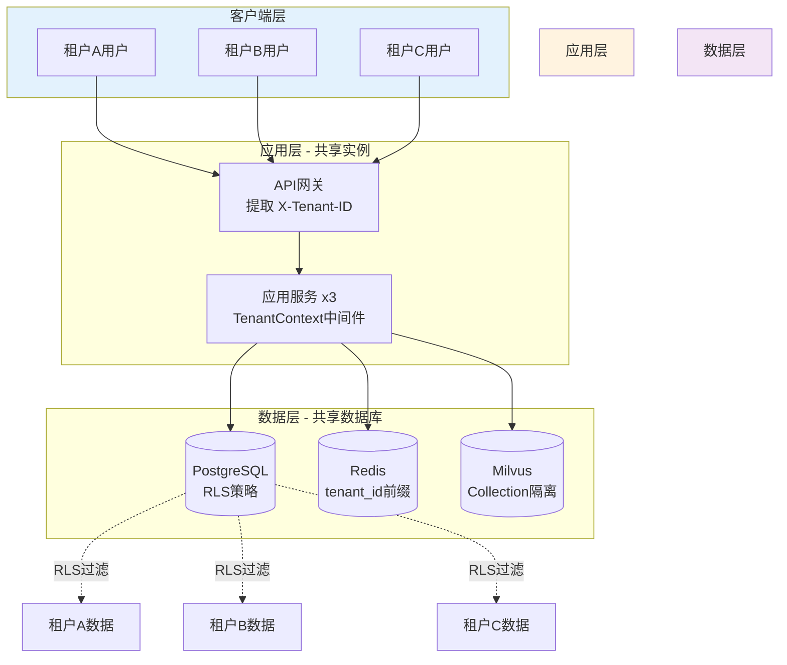
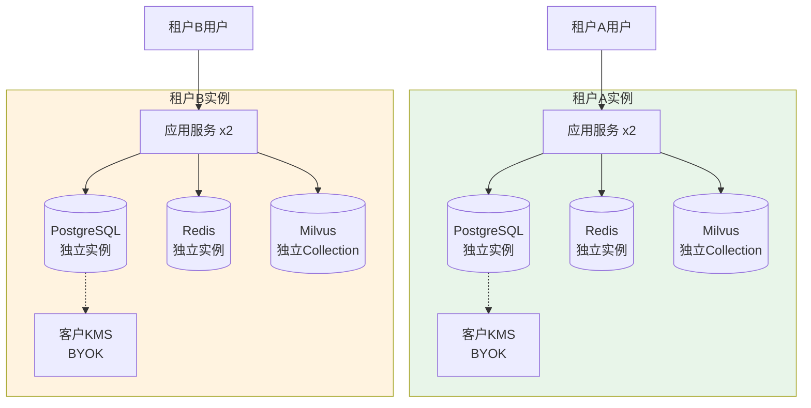
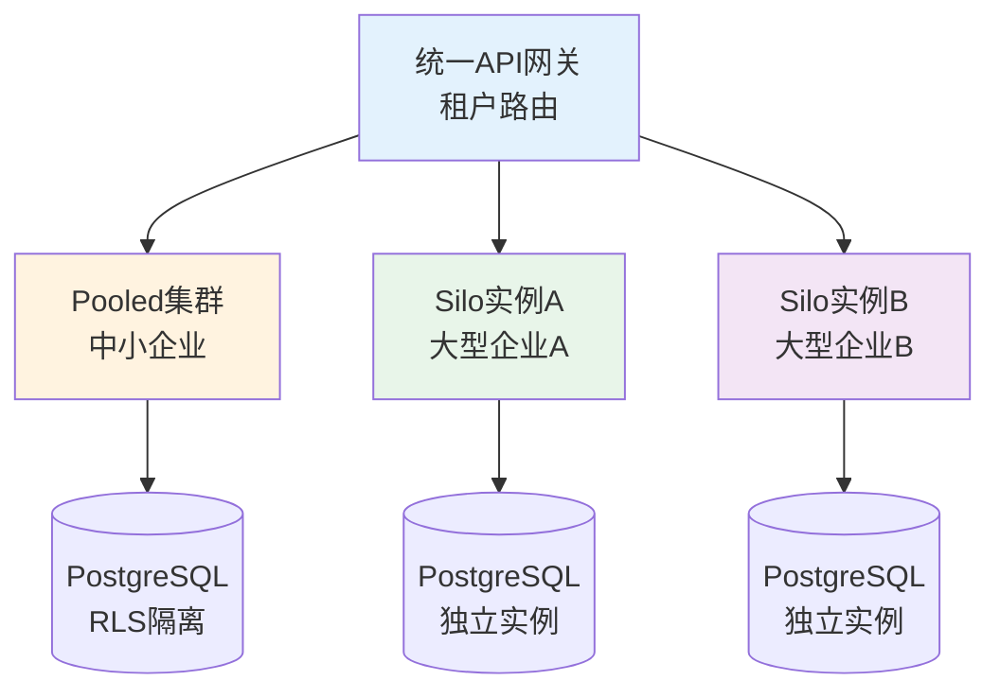

# 多租户架构设计

**文档版本**：v1.0
**最后更新**：2026-03-10
**文档状态**：已发布
**作者**：产品架构团队

---

## 1. 背景与问题（为什么）

### 1.1 业务背景

危险化学品企业特殊作业许可（PTW）管理系统需要支持 **SaaS 多租户部署模式**，以满足不同规模企业的需求：

**典型租户类型**：

| 租户类型 | 企业规模 | 安全要求 | 成本敏感度 | 推荐模式 |
|---------|---------|---------|-----------|---------|
| 中小型企业 | < 500人 | 标准 | 高 | Pooled 模式 |
| 大型企业 | 500-5000人 | 高 | 中 | Pooled 模式（独立 Schema） |
| 集团企业 | > 5000人 | 极高 | 低 | Silo 模式 |
| 金融/军工 | 任意规模 | 合规性要求 | 低 | Silo 模式 + BYOK |

**核心需求**：

1. **数据隔离**：租户间数据完全隔离，防止数据泄露
2. **性能隔离**：租户间资源隔离，避免相互影响
3. **成本优化**：中小企业共享资源，降低成本
4. **安全合规**：支持客户自带加密密钥（BYOK）
5. **灵活扩展**：支持租户从 Pooled 模式迁移到 Silo 模式

### 1.2 技术挑战

**挑战1：数据隔离策略选择**
- **Pooled 模式**：共享数据库，通过 RLS（Row-Level Security）隔离
- **Silo 模式**：独立数据库实例，物理隔离
- **Bridge 模式**：独立 Schema，逻辑隔离

**挑战2：租户上下文传递**
- HTTP 请求如何携带租户标识？
- 数据库连接如何设置租户上下文？
- 缓存、消息队列如何隔离租户数据？

**挑战3：跨租户查询限制**
- 如何防止恶意租户通过 SQL 注入访问其他租户数据？
- 如何确保 ORM 框架自动应用租户过滤条件？
- 如何处理系统管理员的跨租户查询需求？

**挑战4：性能与成本平衡**
- Pooled 模式下，如何防止单个租户占用过多资源？
- Silo 模式下，如何降低独立实例的运维成本？
- 如何实现租户从 Pooled 到 Silo 的平滑迁移？

### 1.3 设计目标

| 目标 | 量化指标 | 优先级 |
|------|---------|-------|
| 数据隔离 | 100% 租户数据隔离，零泄露 | P0 |
| 性能隔离 | 单租户故障不影响其他租户 | P0 |
| 成本优化 | Pooled 模式成本 < Silo 模式 50% | P1 |
| 安全合规 | 支持 BYOK、数据加密、审计日志 | P0 |
| 灵活扩展 | 支持租户迁移，停机时间 < 1小时 | P1 |

---

## 2. 架构设计（是什么）

### 2.1 多租户模式对比

| 维度 | Pooled 模式 | Bridge 模式 | Silo 模式 |
|------|-----------|-----------|----------|
| **数据隔离** | 逻辑隔离（RLS） | 逻辑隔离（Schema） | 物理隔离（独立实例） |
| **成本** | 低 | 中 | 高 |
| **性能隔离** | 弱 | 中 | 强 |
| **安全性** | 中 | 中 | 高 |
| **运维复杂度** | 低 | 中 | 高 |
| **扩展性** | 高（共享资源） | 中 | 低（独立资源） |
| **适用场景** | 中小企业 | 大型企业 | 集团企业、金融/军工 |

### 2.2 Pooled 模式架构

**核心思想**：所有租户共享同一套应用实例和数据库，通过 PostgreSQL RLS 实现数据隔离。



**关键技术**：

1. **PostgreSQL RLS（Row-Level Security）**：
   ```sql
   -- 启用 RLS
   ALTER TABLE work_permit_main ENABLE ROW LEVEL SECURITY;

   -- 创建租户隔离策略
   CREATE POLICY tenant_isolation_policy ON work_permit_main
       USING (tenant_id = current_setting('app.current_tenant')::VARCHAR);

   -- 应用层设置租户上下文
   SET app.current_tenant = 'tenant_abc123';
   ```

2. **TenantContext 中间件**：
   ```python
   from fastapi import Request, HTTPException
   import psycopg2

   async def tenant_context_middleware(request: Request, call_next):
       # 1. 从请求头提取租户ID
       tenant_id = request.headers.get("X-Tenant-ID")
       if not tenant_id:
           raise HTTPException(status_code=400, detail="Missing X-Tenant-ID header")

       # 2. 验证租户ID合法性
       if not is_valid_tenant(tenant_id):
           raise HTTPException(status_code=403, detail="Invalid tenant")

       # 3. 设置数据库租户上下文
       conn = get_db_connection()
       cursor = conn.cursor()
       cursor.execute("SET app.current_tenant = %s", (tenant_id,))

       # 4. 将租户ID注入请求上下文
       request.state.tenant_id = tenant_id

       # 5. 执行请求
       response = await call_next(request)

       return response
   ```

3. **Redis 租户隔离**：
   ```python
   def get_cache_key(tenant_id: str, key: str) -> str:
       return f"tenant:{tenant_id}:{key}"

   # 示例：缓存作业票数据
   redis_client.set(
       get_cache_key("tenant_abc123", "permit:20260310-001"),
       json.dumps(permit_data),
       ex=3600
   )
   ```

4. **Milvus Collection 隔离**：
   ```python
   def get_collection_name(tenant_id: str) -> str:
       return f"tenant_{tenant_id}_knowledge_base"

   # 示例：为租户创建独立 Collection
   from pymilvus import Collection, CollectionSchema, FieldSchema, DataType

   collection_name = get_collection_name("tenant_abc123")
   collection = Collection(name=collection_name, schema=schema)
   ```

### 2.3 Silo 模式架构

**核心思想**：每个租户独立的应用实例和数据库，完全物理隔离，支持 BYOK。



**关键技术**：

1. **独立数据库实例**：
   ```yaml
   # Kubernetes StatefulSet 配置
   apiVersion: apps/v1
   kind: StatefulSet
   metadata:
     name: postgres-tenant-abc123
   spec:
     serviceName: postgres-tenant-abc123
     replicas: 1
     template:
       spec:
         containers:
         - name: postgres
           image: postgres:15
           env:
           - name: POSTGRES_DB
             value: ptw_tenant_abc123
           - name: POSTGRES_USER
             valueFrom:
               secretKeyRef:
                 name: tenant-abc123-db-secret
                 key: username
           - name: POSTGRES_PASSWORD
             valueFrom:
               secretKeyRef:
                 name: tenant-abc123-db-secret
                 key: password
           volumeMounts:
           - name: data
             mountPath: /var/lib/postgresql/data
     volumeClaimTemplates:
     - metadata:
         name: data
       spec:
         accessModes: ["ReadWriteOnce"]
         resources:
           requests:
             storage: 100Gi
   ```

2. **BYOK（Bring Your Own Key）集成**：
   ```python
   from cryptography.fernet import Fernet
   import boto3

   def get_tenant_encryption_key(tenant_id: str) -> bytes:
       # 从客户的 KMS 获取加密密钥
       kms_client = boto3.client('kms', region_name='us-east-1')

       # 使用租户的 KMS Key ID
       tenant_kms_key_id = get_tenant_kms_key_id(tenant_id)

       response = kms_client.generate_data_key(
           KeyId=tenant_kms_key_id,
           KeySpec='AES_256'
       )

       return response['Plaintext']

   def encrypt_sensitive_data(tenant_id: str, data: str) -> str:
       key = get_tenant_encryption_key(tenant_id)
       f = Fernet(key)
       return f.encrypt(data.encode()).decode()
   ```

3. **租户路由配置**：
   ```python
   # 租户配置表
   tenant_config = {
       "tenant_abc123": {
           "deployment_mode": "silo",
           "database_host": "postgres-tenant-abc123.ptw.com",
           "database_port": 5432,
           "redis_host": "redis-tenant-abc123.ptw.com",
           "milvus_host": "milvus-tenant-abc123.ptw.com",
           "kms_provider": "aws",
           "kms_key_id": "arn:aws:kms:us-east-1:123456789012:key/abc123"
       },
       "tenant_xyz789": {
           "deployment_mode": "pooled",
           "database_host": "postgres-pooled.ptw.com",
           "database_port": 5432,
           "redis_host": "redis-pooled.ptw.com",
           "milvus_host": "milvus-pooled.ptw.com"
       }
   }

   def get_db_connection(tenant_id: str):
       config = tenant_config[tenant_id]
       return psycopg2.connect(
           host=config["database_host"],
           port=config["database_port"],
           database=f"ptw_{tenant_id}",
           user=get_tenant_db_user(tenant_id),
           password=get_tenant_db_password(tenant_id)
       )
   ```

### 2.4 混合模式架构

**核心思想**：统一 API 网关，根据租户配置路由到 Pooled 或 Silo 实例。



**路由策略**：
```python
from fastapi import FastAPI, Request, HTTPException
import httpx

app = FastAPI()

@app.middleware("http")
async def tenant_routing_middleware(request: Request, call_next):
    tenant_id = request.headers.get("X-Tenant-ID")
    if not tenant_id:
        raise HTTPException(status_code=400, detail="Missing X-Tenant-ID")

    # 查询租户配置
    tenant_config = get_tenant_config(tenant_id)

    if tenant_config["deployment_mode"] == "silo":
        # 路由到独立实例
        target_url = f"https://{tenant_config['app_host']}{request.url.path}"
        async with httpx.AsyncClient() as client:
            response = await client.request(
                method=request.method,
                url=target_url,
                headers=dict(request.headers),
                content=await request.body()
            )
            return response
    else:
        # 路由到共享集群
        return await call_next(request)
```

---

## 3. 实施方案（怎么做）

### 3.1 TenantContext 中间件实现

**完整实现**：

```python
from fastapi import FastAPI, Request, HTTPException
from starlette.middleware.base import BaseHTTPMiddleware
import psycopg2
from contextvars import ContextVar

# 全局租户上下文变量
tenant_context: ContextVar[str] = ContextVar('tenant_context', default=None)

class TenantContextMiddleware(BaseHTTPMiddleware):
    async def dispatch(self, request: Request, call_next):
        # 1. 提取租户ID
        tenant_id = request.headers.get("X-Tenant-ID")
        if not tenant_id:
            return JSONResponse(
                status_code=400,
                content={"error": "Missing X-Tenant-ID header"}
            )

        # 2. 验证租户ID
        if not self.is_valid_tenant(tenant_id):
            return JSONResponse(
                status_code=403,
                content={"error": "Invalid tenant"}
            )

        # 3. 设置上下文变量
        token = tenant_context.set(tenant_id)

        try:
            # 4. 设置数据库租户上下文
            conn = get_db_connection()
            cursor = conn.cursor()
            cursor.execute("SET app.current_tenant = %s", (tenant_id,))
            cursor.close()

            # 5. 注入请求状态
            request.state.tenant_id = tenant_id

            # 6. 执行请求
            response = await call_next(request)

            return response
        finally:
            # 7. 清理上下文
            tenant_context.reset(token)

    def is_valid_tenant(self, tenant_id: str) -> bool:
        # 从数据库或缓存验证租户ID
        conn = get_db_connection()
        cursor = conn.cursor()
        cursor.execute("SELECT 1 FROM tenants WHERE tenant_id = %s AND status = 'active'", (tenant_id,))
        result = cursor.fetchone()
        cursor.close()
        return result is not None

# 应用中间件
app = FastAPI()
app.add_middleware(TenantContextMiddleware)
```

### 3.2 数据库配置

**PostgreSQL RLS 配置**：

```sql
-- 1. 创建租户表
CREATE TABLE tenants (
    tenant_id VARCHAR(32) PRIMARY KEY,
    tenant_name VARCHAR(100) NOT NULL,
    deployment_mode VARCHAR(20) NOT NULL CHECK (deployment_mode IN ('pooled', 'silo')),
    status VARCHAR(20) NOT NULL DEFAULT 'active',
    created_at TIMESTAMPTZ NOT NULL DEFAULT CURRENT_TIMESTAMP,
    updated_at TIMESTAMPTZ NOT NULL DEFAULT CURRENT_TIMESTAMP
);

-- 2. 为所有业务表添加 tenant_id 列
ALTER TABLE work_permit_main ADD COLUMN tenant_id VARCHAR(32) NOT NULL;
ALTER TABLE work_permit_hot_work ADD COLUMN tenant_id VARCHAR(32) NOT NULL;
ALTER TABLE work_permit_confined_space ADD COLUMN tenant_id VARCHAR(32) NOT NULL;
-- ... 其他表

-- 3. 创建索引
CREATE INDEX idx_work_permit_main_tenant ON work_permit_main (tenant_id);
CREATE INDEX idx_work_permit_hot_work_tenant ON work_permit_hot_work (tenant_id);
-- ... 其他表

-- 4. 启用 RLS
ALTER TABLE work_permit_main ENABLE ROW LEVEL SECURITY;
ALTER TABLE work_permit_hot_work ENABLE ROW LEVEL SECURITY;
ALTER TABLE work_permit_confined_space ENABLE ROW LEVEL SECURITY;
-- ... 其他表

-- 5. 创建 RLS 策略
CREATE POLICY tenant_isolation_policy ON work_permit_main
    USING (tenant_id = current_setting('app.current_tenant')::VARCHAR);

CREATE POLICY tenant_isolation_policy ON work_permit_hot_work
    USING (tenant_id = current_setting('app.current_tenant')::VARCHAR);

CREATE POLICY tenant_isolation_policy ON work_permit_confined_space
    USING (tenant_id = current_setting('app.current_tenant')::VARCHAR);
-- ... 其他表

-- 6. 创建租户管理员角色（可跨租户查询）
CREATE ROLE tenant_admin;
GRANT ALL ON ALL TABLES IN SCHEMA public TO tenant_admin;

-- 为租户管理员创建绕过 RLS 的策略
CREATE POLICY tenant_admin_bypass_policy ON work_permit_main
    TO tenant_admin
    USING (true);
```

### 3.3 缓存策略

**Redis 租户隔离**：

```python
import redis
import json
from typing import Optional

class TenantAwareCache:
    def __init__(self, redis_client: redis.Redis):
        self.redis = redis_client

    def _get_key(self, tenant_id: str, key: str) -> str:
        return f"tenant:{tenant_id}:{key}"

    def get(self, tenant_id: str, key: str) -> Optional[dict]:
        cache_key = self._get_key(tenant_id, key)
        data = self.redis.get(cache_key)
        return json.loads(data) if data else None

    def set(self, tenant_id: str, key: str, value: dict, ttl: int = 3600):
        cache_key = self._get_key(tenant_id, key)
        self.redis.setex(cache_key, ttl, json.dumps(value))

    def delete(self, tenant_id: str, key: str):
        cache_key = self._get_key(tenant_id, key)
        self.redis.delete(cache_key)

    def clear_tenant_cache(self, tenant_id: str):
        pattern = f"tenant:{tenant_id}:*"
        keys = self.redis.keys(pattern)
        if keys:
            self.redis.delete(*keys)

# 使用示例
cache = TenantAwareCache(redis_client)

# 缓存作业票数据
cache.set("tenant_abc123", "permit:20260310-001", permit_data, ttl=3600)

# 读取缓存
permit = cache.get("tenant_abc123", "permit:20260310-001")

# 清空租户缓存
cache.clear_tenant_cache("tenant_abc123")
```

### 3.4 租户迁移策略

**从 Pooled 迁移到 Silo**：

```python
import psycopg2
from datetime import datetime

def migrate_tenant_to_silo(tenant_id: str):
    """
    将租户从 Pooled 模式迁移到 Silo 模式
    """
    print(f"[{datetime.now()}] 开始迁移租户 {tenant_id} 到 Silo 模式")

    # 1. 创建独立数据库实例
    print("Step 1: 创建独立数据库实例...")
    create_silo_database_instance(tenant_id)

    # 2. 导出租户数据
    print("Step 2: 从 Pooled 数据库导出租户数据...")
    export_tenant_data(tenant_id, f"/tmp/{tenant_id}_export.sql")

    # 3. 导入到 Silo 实例
    print("Step 3: 导入数据到 Silo 实例...")
    import_tenant_data(tenant_id, f"/tmp/{tenant_id}_export.sql")

    # 4. 验证数据一致性
    print("Step 4: 验证数据一致性...")
    if not verify_data_consistency(tenant_id):
        raise Exception("数据一致性验证失败")

    # 5. 更新租户配置
    print("Step 5: 更新租户配置...")
    update_tenant_config(tenant_id, deployment_mode="silo")

    # 6. 切换流量
    print("Step 6: 切换流量到 Silo 实例...")
    switch_traffic_to_silo(tenant_id)

    # 7. 清理 Pooled 数据
    print("Step 7: 清理 Pooled 数据库中的租户数据...")
    cleanup_pooled_data(tenant_id)

    print(f"[{datetime.now()}] 租户 {tenant_id} 迁移完成")

def export_tenant_data(tenant_id: str, output_file: str):
    conn = psycopg2.connect(host="postgres-pooled.ptw.com", database="ptw_pooled")
    cursor = conn.cursor()

    # 导出租户数据
    tables = [
        "work_permit_main",
        "work_permit_hot_work",
        "work_permit_confined_space",
        # ... 其他表
    ]

    with open(output_file, 'w') as f:
        for table in tables:
            cursor.execute(f"SELECT * FROM {table} WHERE tenant_id = %s", (tenant_id,))
            rows = cursor.fetchall()
            # 生成 INSERT 语句
            for row in rows:
                f.write(f"INSERT INTO {table} VALUES {row};\n")

    cursor.close()
    conn.close()
```

---

## 4. 相关文档

### 4.1 架构文档引用

| 文档 | 路径 | 关联说明 |
| --- | --- | --- |
| 四层解耦架构 | [layered-architecture.md](./layered-architecture.md) | 多租户隔离层设计 |
| 数据库架构 | [database-design.md](./database-design.md) | PostgreSQL RLS 配置 |
| 部署架构 | [deployment-architecture.md](./deployment-architecture.md) | Pooled/Silo 部署模式 |
| 安全与合规性 | [security-compliance.md](./security-compliance.md) | BYOK、数据加密、审计日志 |
| SIMOPs冲突检测 | [simops-algorithm.md](./simops-algorithm.md) | 租户隔离冲突矩阵 |

### 4.2 项目文档引用

| 文档 | 路径 | 关联说明 |
| --- | --- | --- |
| 项目知识库 | [PROJECTWIKI.md](../../PROJECTWIKI.md) | §2 架构设计（多租户架构） |
| 变更日志 | [CHANGELOG.md](../../CHANGELOG.md) | 多租户相关变更记录 |
| ADR-002 | [docs/adr/20260309-upgrade-to-ptw-system.md](../adr/20260309-upgrade-to-ptw-system.md) | 多租户 SaaS 部署策略 |

---

## 5. 附录

### 5.1 术语表

| 术语 | 英文 | 定义 |
|-----|------|------|
| 多租户 | Multi-Tenancy | 单一软件实例服务多个租户（客户）的架构模式 |
| Pooled 模式 | Pooled Model | 共享资源多租户模式，所有租户共享数据库和应用实例 |
| Silo 模式 | Silo Model | 独立资源多租户模式，每个租户独立数据库和应用实例 |
| Bridge 模式 | Bridge Model | 独立 Schema 多租户模式，共享数据库但独立 Schema |
| RLS | Row-Level Security | PostgreSQL 行级安全策略，用于多租户数据隔离 |
| BYOK | Bring Your Own Key | 客户自带加密密钥，用于 Silo 模式的数据加密 |
| TenantContext | Tenant Context | 租户上下文，用于在应用层传递租户标识 |

### 5.2 版本历史

| 版本 | 日期 | 变更内容 | 作者 |
|-----|------|---------|------|
| v1.0 | 2026-03-10 | 初始版本，定义 Pooled/Silo/混合多租户架构 | 产品架构团队 |

---

**文档结束**
