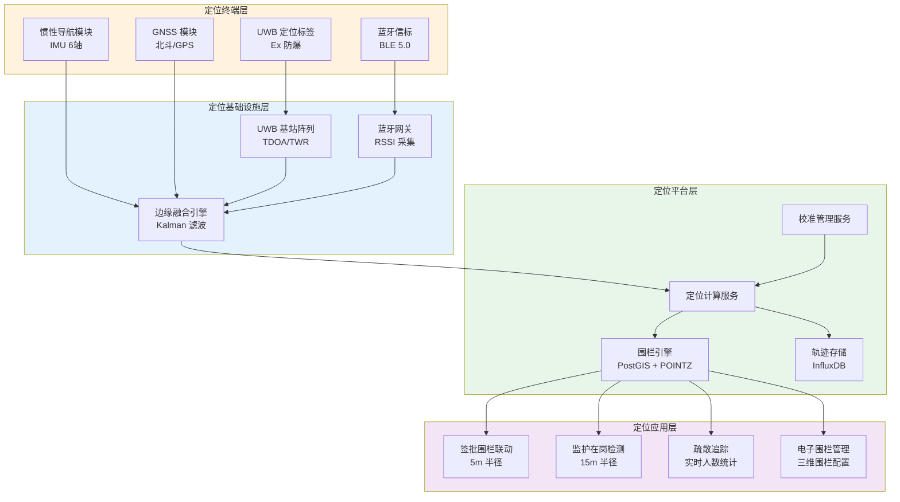
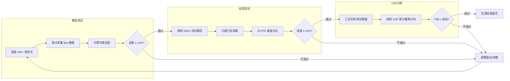

# 人员定位架构设计

**文档版本**：v1.0
**最后更新**：2026-03-10
**文档状态**：已发布
**作者**：产品架构团队

---

## 1. 背景与问题（为什么）

### 1.1 业务背景

危险化学品企业特殊作业许可（PTW）管理系统需要对作业现场人员进行精确定位，以满足以下核心需求：

- **监护人在岗监测**：GB 30871-2022 要求监护人全程在场，系统需实时验证监护人是否在作业点 10-15m 范围内
- **审批人签批围栏**：AQ 3064.2-2025 要求审批人在作业现场完成签批，系统需验证 5m 签批围栏
- **人员疏散追踪**：紧急情况下快速确认所有作业人员是否已撤离危险区域
- **承包商活动范围**：限制承包商人员仅在授权区域内活动

### 1.2 AQ 3064.3-2025 技术指标要求

| 指标项 | AQ 3064.3 要求 | 系统设计目标 | 说明 |
| --- | --- | --- | --- |
| 静态定位误差 | ≤ ±3m | ≤ ±2m | 300+ 采样点测试 |
| 动态定位误差 | ≤ ±5m | ≤ ±3m | 500m 路径动态测试 |
| 防爆认证 | Ex 防爆 | Ex ib IIC T4 Gb | 适用于 Zone 1 危险区域 |
| 漏报率 | < 10% | < 5% | 人员进出围栏检测 |
| 误报率 | < 15% | < 10% | 围栏告警准确性 |
| 定位频率 | ≥ 1次/5s | 1次/1-5s（可配置） | 签批场景 1s，常规 5s |
| 电池续航 | ≥ 8h | ≥ 12h | 覆盖一个完整作业周期 |
| 并发容量 | ≥ 200人/区域 | ≥ 500人/区域 | 大型化工园区 |

### 1.3 技术挑战

**挑战1：化工厂区环境复杂**
- 金属塔群、管廊密集，多径效应严重
- 防爆区域限制无线设备功率
- 室内外混合场景（车间内 + 罐区 + 管廊）

**挑战2：三维定位需求**
- 化工厂多层结构（地面层、管廊层、塔顶平台）
- 二维围栏无法区分不同楼层的作业
- 需要 Z 轴（高程）信息辅助判断

**挑战3：多传感器融合**
- 单一定位技术无法满足所有场景精度要求
- UWB 精度高但覆盖范围有限
- 蓝牙成本低但精度较差
- 惯性导航可补偿信号盲区但存在累积漂移

**挑战4：精度校准与持续保障**
- 定位精度随时间和环境变化会退化
- 需要定期校准机制确保持续满足 AQ 3064.3 指标
- 校准过程需标准化、可审计

### 1.4 设计目标

| 目标 | 量化指标 | 优先级 |
| --- | --- | --- |
| 三维定位精度 | 水平 ≤ ±2m，垂直 ≤ ±1m | P0 |
| 签批围栏响应 | 判断延迟 ≤ 1s | P0 |
| 监护围栏响应 | 判断延迟 ≤ 3s | P0 |
| 系统可用性 | ≥ 99.5% | P0 |
| 校准周期 | 年度校准 + 季度抽检 | P1 |
| 多租户支持 | 围栏配置租户隔离 | P1 |

---

## 2. 架构设计（是什么）

### 2.1 总体架构图



### 2.2 多传感器融合策略

| 定位技术 | 精度 | 覆盖范围 | 适用场景 | 权重（融合） |
| --- | --- | --- | --- | --- |
| **UWB** | ±0.1-0.3m | 50-100m/基站 | 室内高精度区域（签批围栏） | 高（0.6） |
| **蓝牙 BLE** | ±1-3m | 10-30m/信标 | 室内广覆盖（监护围栏） | 中（0.25） |
| **惯性导航 IMU** | 累积漂移 | 无限制 | 信号盲区过渡 | 低（0.1） |
| **GNSS 北斗** | ±2-5m | 室外 | 室外开阔区域 | 中（0.05，仅室外） |

### 2.3 三维围栏数据模型

```sql
-- 三维围栏定义表（PostgreSQL + PostGIS）
CREATE TABLE geofence_3d (
    fence_id        VARCHAR(32) PRIMARY KEY,
    tenant_id       VARCHAR(32) NOT NULL,
    fence_name      VARCHAR(200) NOT NULL,
    fence_type      VARCHAR(20) NOT NULL
                    CHECK (fence_type IN (
                        'APPROVAL_5M',
                        'SUPERVISOR_15M',
                        'WORK_AREA',
                        'RESTRICTED_ZONE',
                        'EVACUATION_ZONE'
                    )),
    -- 三维中心点（经度, 纬度, 高程）
    center_point    GEOMETRY(POINTZ, 4326) NOT NULL,
    -- 水平半径（米）
    horizontal_radius DECIMAL(8,2) NOT NULL,
    -- Z 轴范围（米）
    z_min           DECIMAL(8,2) NOT NULL DEFAULT -5.0,
    z_max           DECIMAL(8,2) NOT NULL DEFAULT 50.0,
    -- 关联信息
    permit_id       VARCHAR(32),
    -- 生效时间窗口
    valid_from      TIMESTAMPTZ,
    valid_to        TIMESTAMPTZ,
    -- 审计字段
    created_at      TIMESTAMPTZ DEFAULT NOW(),
    created_by      VARCHAR(32) NOT NULL,
    status          VARCHAR(10) DEFAULT 'ACTIVE',

    CONSTRAINT fk_tenant FOREIGN KEY (tenant_id)
        REFERENCES tenant(tenant_id)
);

CREATE INDEX idx_geofence_tenant ON geofence_3d(tenant_id);
CREATE INDEX idx_geofence_permit ON geofence_3d(permit_id);
CREATE INDEX idx_geofence_center ON geofence_3d
    USING GIST(center_point);
```

---

## 3. 实施方案（怎么做）

### 3.1 多传感器融合算法（Kalman 滤波）

```python
import numpy as np

class PositionFusionEngine:
    """多传感器融合定位引擎 - 扩展 Kalman 滤波"""

    def __init__(self):
        # 状态向量: [x, y, z, vx, vy, vz]
        self.state = np.zeros(6)
        # 状态协方差矩阵
        self.P = np.eye(6) * 10.0
        # 过程噪声
        self.Q = np.diag([0.1, 0.1, 0.05, 0.5, 0.5, 0.2])

    def predict(self, dt: float):
        """预测步骤（基于运动模型）"""
        F = np.eye(6)
        F[0, 3] = dt  # x += vx * dt
        F[1, 4] = dt  # y += vy * dt
        F[2, 5] = dt  # z += vz * dt

        self.state = F @ self.state
        self.P = F @ self.P @ F.T + self.Q

    def update_uwb(self, measurement: np.ndarray):
        """UWB 观测更新（高精度，权重高）"""
        H = np.zeros((3, 6))
        H[0, 0] = H[1, 1] = H[2, 2] = 1.0
        R = np.diag([0.09, 0.09, 0.25])  # ±0.3m, ±0.5m(Z)
        self._kalman_update(H, R, measurement)

    def update_ble(self, measurement: np.ndarray):
        """蓝牙观测更新（中精度）"""
        H = np.zeros((2, 6))
        H[0, 0] = H[1, 1] = 1.0
        R = np.diag([4.0, 4.0])  # ±2m
        self._kalman_update(H, R, measurement[:2])

    def update_imu(self, acceleration: np.ndarray, dt: float):
        """IMU 惯性导航更新（补偿信号盲区）"""
        self.state[3] += acceleration[0] * dt
        self.state[4] += acceleration[1] * dt
        self.state[5] += acceleration[2] * dt
        # 增加过程噪声（IMU 累积漂移）
        self.P += np.diag([0.01, 0.01, 0.005, 0.1, 0.1, 0.05]) * dt

    def _kalman_update(self, H, R, z):
        """标准 Kalman 更新"""
        y = z - H @ self.state
        S = H @ self.P @ H.T + R
        K = self.P @ H.T @ np.linalg.inv(S)
        self.state = self.state + K @ y
        self.P = (np.eye(6) - K @ H) @ self.P

    def get_position(self) -> dict:
        """获取融合后的三维坐标"""
        return {
            "x": self.state[0],
            "y": self.state[1],
            "z": self.state[2],
            "accuracy_h": np.sqrt(self.P[0, 0] + self.P[1, 1]),
            "accuracy_v": np.sqrt(self.P[2, 2])
        }
```

### 3.2 三维围栏判断

```python
def check_3d_geofence(
    person_position: dict,
    fence: dict
) -> GeofenceResult:
    """
    三维围栏判断

    Args:
        person_position: {"x": float, "y": float, "z": float}
        fence: {
            "center": {"x", "y", "z"},
            "horizontal_radius": float,
            "z_min": float, "z_max": float
        }
    """
    # 水平距离（2D）
    dx = person_position["x"] - fence["center"]["x"]
    dy = person_position["y"] - fence["center"]["y"]
    horizontal_dist = (dx**2 + dy**2) ** 0.5

    # Z 轴范围判断
    z = person_position["z"]
    z_in_range = fence["z_min"] <= z <= fence["z_max"]

    # 综合判断
    within = (
        horizontal_dist <= fence["horizontal_radius"]
        and z_in_range
    )

    return GeofenceResult(
        within_fence=within,
        horizontal_distance=horizontal_dist,
        vertical_position=z,
        fence_type=fence["fence_type"]
    )
```

对应的 PostGIS SQL 查询：

```sql
-- 三维围栏判断（PostGIS）
SELECT
    f.fence_id,
    f.fence_name,
    f.fence_type,
    ST_Distance(
        f.center_point::geography,
        ST_SetSRID(ST_MakePoint(:lng, :lat, :elev), 4326)::geography
    ) AS horizontal_distance_m,
    CASE
        WHEN ST_Distance(
            f.center_point::geography,
            ST_SetSRID(ST_MakePoint(:lng, :lat, :elev), 4326)::geography
        ) <= f.horizontal_radius
        AND :elev BETWEEN f.z_min AND f.z_max
        THEN TRUE
        ELSE FALSE
    END AS within_fence
FROM geofence_3d f
WHERE f.tenant_id = :tenant_id
  AND f.permit_id = :permit_id
  AND f.status = 'ACTIVE'
  AND (f.valid_from IS NULL OR f.valid_from <= NOW())
  AND (f.valid_to IS NULL OR f.valid_to >= NOW());
```

### 3.3 精度校准机制

#### 3.3.1 年度校准流程

按 AQ 3064.3-2025 要求，每年至少进行一次全面校准：



#### 3.3.2 校准记录表

```sql
CREATE TABLE positioning_calibration (
    calibration_id  VARCHAR(32) PRIMARY KEY,
    tenant_id       VARCHAR(32) NOT NULL,
    calibration_date DATE NOT NULL,
    calibration_type VARCHAR(20) NOT NULL
                    CHECK (calibration_type IN (
                        'ANNUAL', 'QUARTERLY', 'AD_HOC'
                    )),
    -- 静态测试结果
    static_sample_count INT NOT NULL,
    static_mean_error   DECIMAL(5,2) NOT NULL,
    static_max_error    DECIMAL(5,2) NOT NULL,
    static_p95_error    DECIMAL(5,2) NOT NULL,
    static_pass         BOOLEAN NOT NULL,
    -- 动态测试结果
    dynamic_path_length DECIMAL(8,2),
    dynamic_mean_error  DECIMAL(5,2),
    dynamic_max_error   DECIMAL(5,2),
    dynamic_p95_error   DECIMAL(5,2),
    dynamic_pass        BOOLEAN,
    -- 综合结论
    overall_pass        BOOLEAN NOT NULL,
    report_url          VARCHAR(500),
    calibrator_name     VARCHAR(50) NOT NULL,
    calibrator_cert     VARCHAR(50),
    notes               TEXT,
    created_at          TIMESTAMPTZ DEFAULT NOW(),

    CONSTRAINT fk_cal_tenant FOREIGN KEY (tenant_id)
        REFERENCES tenant(tenant_id)
);
```

---

## 4. 相关文档

### 4.1 架构文档引用

| 文档 | 路径 | 关联说明 |
| --- | --- | --- |
| 四层解耦架构 | [layered-architecture.md](./layered-architecture.md) | 定位能力在 AQ 3064.1 边缘感知层的定位 |
| AI Agent 引擎 | [ai-agent-engine.md](./ai-agent-engine.md) | 时空一致性智能体依赖本模块 |
| IoT 边缘接入 | [iot-integration.md](./iot-integration.md) | 定位终端作为 IoT 设备接入 |
| 数据库架构 | [database-design.md](./database-design.md) | POINTZ 数据模型、围栏表结构 |
| SIMOPs 冲突检测 | [simops-algorithm.md](./simops-algorithm.md) | 三维空间冲突检测依赖定位数据 |
| 安全与合规性 | [security-compliance.md](./security-compliance.md) | 签批围栏与 CA 电子签名联动 |

### 4.2 外部标准引用

| 标准编号 | 标准名称 | 引用章节 |
| --- | --- | --- |
| AQ 3064.3-2025 | 人员定位技术要求 | §1.2 技术指标、§3.3 校准机制 |
| GB 30871-2022 | 特殊作业安全规范 | §1.1 监护人在岗要求 |
| AQ 3064.2-2025 | 特殊作业审批管理 | §2.3 签批围栏联动 |

### 5.1 术语表

| 术语 | 英文 | 定义 |
| --- | --- | --- |
| UWB | Ultra-Wideband | 超宽带定位技术，精度 ±0.1-0.3m |
| TDOA | Time Difference of Arrival | 到达时间差定位算法 |
| TWR | Two-Way Ranging | 双向测距定位算法 |
| IMU | Inertial Measurement Unit | 惯性测量单元 |
| CDF | Cumulative Distribution Function | 累计分布函数 |
| CGCS 2000 | China Geodetic Coordinate System 2000 | 2000 中国大地坐标系 |
| RTK | Real-Time Kinematic | 实时动态差分定位 |

### 5.2 版本历史

| 版本 | 日期 | 变更内容 | 作者 |
| --- | --- | --- | --- |
| v1.0 | 2026-03-10 | 初始版本，定义人员定位架构 | 产品架构团队 |

---

**文档结束**
