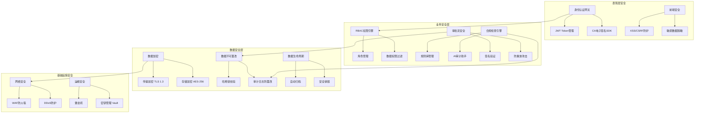
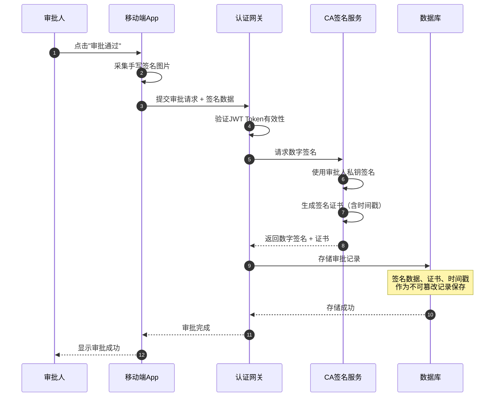
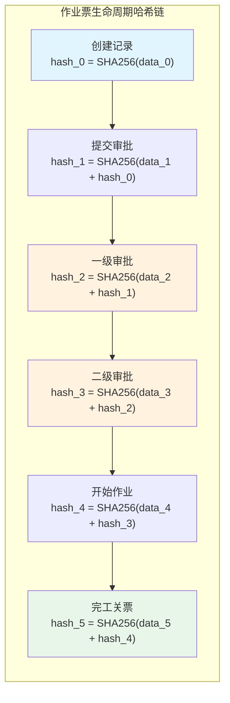
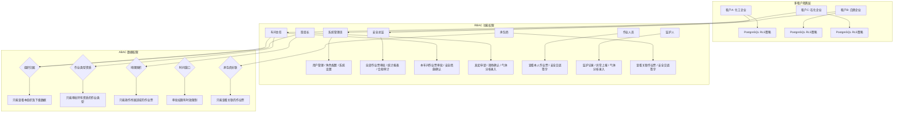
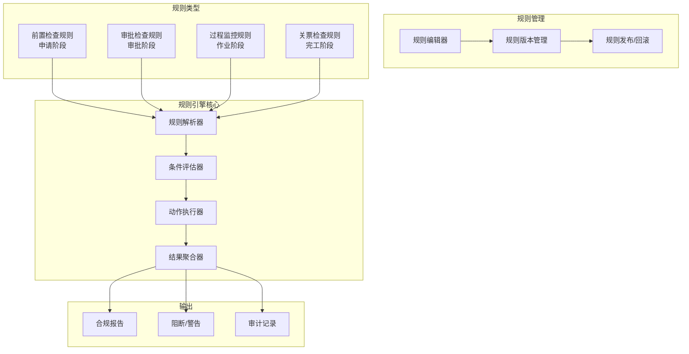
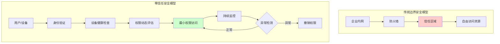
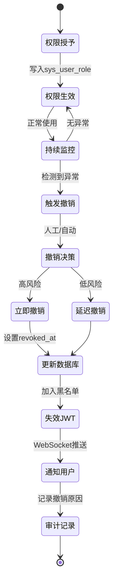
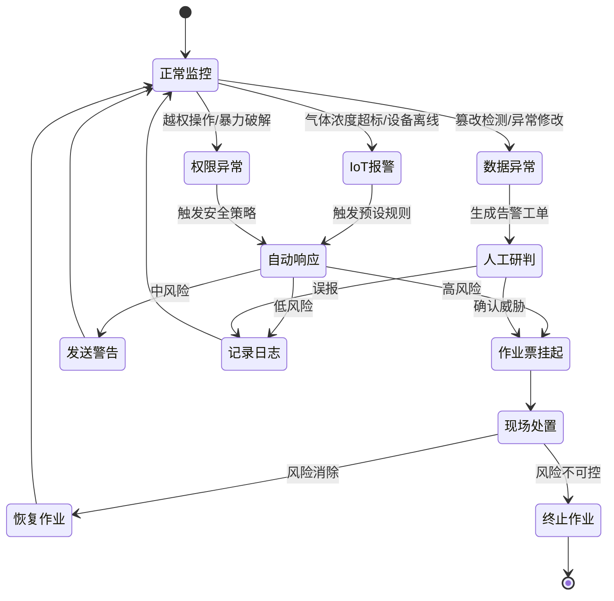

# 安全与合规性架构设计

**文档版本**：v1.0
**最后更新**：2026-03-10
**文档状态**：已发布
**作者**：产品架构团队

---

## 1. 背景与问题（为什么）

### 1.1 业务背景

危险化学品企业特殊作业许可（PTW）管理系统承载着**人命关天**的安全管理职责。系统中流转的每一张作业票，都直接关联现场作业人员的生命安全。因此，安全与合规性不是"锦上添花"的附加功能，而是系统的**核心基础设施**。

**合规性强制要求**：

- **GB 30871-2022**《危险化学品企业特殊作业安全规范》：国家强制性标准，规定了8大特殊作业的安全管理要求
- **AQ 3028-2008**《化学品生产单位受限空间作业安全规范》：行业标准补充
- **应急管理部令（第6号）**：工贸企业重大事故隐患判定标准
- **《安全生产法》（2021修正）**：明确企业安全生产主体责任与数据留存义务

**业务安全需求**：

| 需求维度 | 具体要求 | 合规依据 |
|---------|---------|---------|
| 身份认证 | 作业人员、审批人员身份真实可验证 | GB 30871-2022 §4.2 |
| 电子签名 | 审批签名具有法律效力，不可伪造 | 《电子签名法》 |
| 数据不可篡改 | 作业票一经审批，核心字段不可修改 | GB 30871-2022 §4.5 |
| 全程可追溯 | 从申请到关票的完整操作轨迹 | 《安全生产法》§36 |
| 实时监控 | 气体浓度等关键指标实时预警 | GB 30871-2022 §5.3 |
| 数据留存 | 作业记录保存不少于1年 | 《安全生产法》§38 |

### 1.2 技术挑战

**挑战1：电子签名的法律效力**
- 传统纸质签名具有天然的法律效力，电子签名需要通过CA证书体系保障
- 移动端签名需要兼顾便捷性与安全性
- 离线场景下的签名验证与同步

**挑战2：数据不可篡改性**
- 作业票审批后的核心字段必须"只读"
- 需要防范数据库层面的直接篡改
- 审计日志本身也需要防篡改保护

**挑战3：多层级权限管理**
- 集团 → 分公司 → 车间 → 班组的四级组织架构
- 8大作业类型各有不同的审批权限链
- 交叉作业场景下的联合审批权限

**挑战4：合规性自动化检查**
- GB 30871-2022包含数百条细则，人工逐条核查效率低下
- 不同作业类型的合规检查项差异大
- 法规更新后，系统规则需要快速同步

**挑战5：安全事件响应**
- IoT设备报警后的自动化响应链路
- 作业票紧急挂起/撤销的权限控制
- 安全事件的证据链完整保全

### 1.3 设计目标

| 目标 | 量化指标 | 优先级 |
|------|---------|-------|
| 身份认证可靠性 | 认证失败率 < 0.01% | P0 |
| 电子签名合规 | 通过CA认证机构审计 | P0 |
| 数据不可篡改 | 篡改检测率 100% | P0 |
| 审计日志完整性 | 操作覆盖率 100%，日志防篡改 | P0 |
| 合规检查自动化 | GB 30871-2022覆盖率 ≥ 95% | P1 |
| 权限控制粒度 | 支持字段级权限控制 | P1 |
| 安全响应时效 | 报警 → 响应 ≤ 30秒 | P0 |

---

## 2. 架构设计（是什么）

### 2.1 安全架构总览



### 2.2 身份认证与电子签名

#### 2.2.1 多因素认证体系

系统采用**分级认证策略**，根据操作风险等级选择不同的认证强度：

| 操作类型 | 风险等级 | 认证方式 | 示例场景 |
|---------|---------|---------|---------|
| 查看作业票 | 低 | 用户名 + 密码 | 浏览已完成的作业票 |
| 发起申请 | 中 | 密码 + 短信验证码 | 提交新的动火作业申请 |
| 审批签字 | 高 | CA证书 + 手写签名 | 安全负责人审批作业票 |
| 紧急操作 | 极高 | CA证书 + 生物识别 | 紧急挂起进行中的作业 |

#### 2.2.2 CA电子签名集成



**CA证书管理策略**：

```python
# CA电子签名服务接口设计（伪代码）
class CASignatureService:
    """CA电子签名服务 - 对接第三方CA认证机构"""

    def sign_document(self, signer_id: str, document_hash: str) -> SignatureResult:
        """
        对文档进行数字签名

        Args:
            signer_id: 签名人ID（关联CA证书）
            document_hash: 待签名文档的SHA-256哈希值

        Returns:
            SignatureResult: 包含数字签名、证书链、时间戳
        """
        # 1. 验证签名人证书有效性
        cert = self.cert_store.get_certificate(signer_id)
        if cert.is_expired() or cert.is_revoked():
            raise CertificateInvalidError(f"证书无效: {cert.status}")

        # 2. 使用私钥进行签名
        signature = self.crypto_engine.sign(
            private_key=cert.private_key,
            data=document_hash,
            algorithm="RSA-SHA256"
        )

        # 3. 获取可信时间戳（TSA）
        timestamp = self.tsa_client.get_timestamp(signature)

        # 4. 构建签名结果
        return SignatureResult(
            signature=signature,
            certificate_chain=cert.chain,
            timestamp=timestamp,
            signer_id=signer_id,
            document_hash=document_hash
        )

    def verify_signature(self, signature_result: SignatureResult) -> bool:
        """验证数字签名的有效性"""
        # 1. 验证证书链
        chain_valid = self.cert_store.verify_chain(
            signature_result.certificate_chain
        )
        # 2. 验证签名
        sig_valid = self.crypto_engine.verify(
            public_key=signature_result.certificate_chain[0].public_key,
            signature=signature_result.signature,
            data=signature_result.document_hash
        )
        # 3. 验证时间戳
        ts_valid = self.tsa_client.verify_timestamp(
            signature_result.timestamp
        )
        return chain_valid and sig_valid and ts_valid
```

### 2.3 数据不可篡改机制

#### 2.3.1 哈希链校验

作业票的核心字段一经审批，通过**哈希链**机制确保不可篡改：



**核心实现逻辑**：

```python
import hashlib
import json
from datetime import datetime

class PermitIntegrityService:
    """作业票数据完整性服务"""

    def calculate_hash(self, permit_data: dict, previous_hash: str = "") -> str:
        """
        计算作业票当前状态的哈希值

        核心字段（不可篡改）：
        - permit_id: 作业票编号
        - permit_type: 作业类型
        - work_location: 作业地点
        - risk_level: 风险等级
        - safety_measures: 安全措施清单
        - gas_analysis: 气体分析结果
        - approver_signatures: 审批签名
        """
        # 提取核心字段（排除可变字段如状态、更新时间）
        core_fields = {
            "permit_id": permit_data["permit_id"],
            "permit_type": permit_data["permit_type"],
            "work_location": permit_data["work_location"],
            "risk_level": permit_data["risk_level"],
            "safety_measures": sorted(permit_data.get("safety_measures", [])),
            "gas_analysis": permit_data.get("gas_analysis", {}),
            "approver_signatures": permit_data.get("approver_signatures", []),
            "previous_hash": previous_hash,
            "timestamp": datetime.utcnow().isoformat()
        }

        # 序列化并计算SHA-256
        data_str = json.dumps(core_fields, sort_keys=True, ensure_ascii=False)
        return hashlib.sha256(data_str.encode('utf-8')).hexdigest()

    def verify_chain(self, permit_id: str) -> IntegrityReport:
        """验证作业票的完整哈希链"""
        records = self.db.get_integrity_records(permit_id)

        for i, record in enumerate(records):
            expected_prev = records[i-1].hash_value if i > 0 else ""
            recalculated = self.calculate_hash(
                record.permit_data, expected_prev
            )
            if recalculated != record.hash_value:
                return IntegrityReport(
                    valid=False,
                    broken_at=record.operation,
                    message=f"哈希链在'{record.operation}'处断裂，疑似数据被篡改"
                )

        return IntegrityReport(valid=True, message="哈希链完整，数据未被篡改")
```

#### 2.3.2 审计日志防篡改

审计日志采用**追加写入 + 哈希链 + 异地备份**三重保护：

```python
class AuditLogService:
    """审计日志服务 - 防篡改设计"""

    def append_log(self, event: AuditEvent) -> str:
        """
        追加审计日志（只追加，不修改，不删除）

        日志存储策略：
        - 主存储：Elasticsearch（全文检索 + 聚合分析）
        - 备份存储：MinIO对象存储（不可变桶策略）
        - 哈希索引：Redis（快速校验）
        """
        # 1. 构建日志记录
        log_entry = {
            "event_id": generate_uuid(),
            "timestamp": datetime.utcnow().isoformat(),
            "operator_id": event.operator_id,
            "operator_name": event.operator_name,
            "action": event.action,           # CREATE/UPDATE/APPROVE/REJECT/...
            "resource_type": event.resource_type,  # PERMIT/GAS_ANALYSIS/SIGNATURE/...
            "resource_id": event.resource_id,
            "changes": event.changes,          # 变更前后对比（JSON Diff）
            "ip_address": event.ip_address,
            "device_info": event.device_info,
            "previous_log_hash": self.get_latest_hash(event.resource_id)
        }

        # 2. 计算当前日志哈希（链式）
        log_entry["log_hash"] = hashlib.sha256(
            json.dumps(log_entry, sort_keys=True).encode()
        ).hexdigest()

        # 3. 写入Elasticsearch（主存储）
        self.es_client.index(index="audit_logs", body=log_entry)

        # 4. 写入MinIO（不可变备份）
        self.minio_client.put_object(
            bucket="audit-logs-immutable",
            object_name=f"{event.resource_id}/{log_entry['event_id']}.json",
            data=json.dumps(log_entry).encode()
        )

        # 5. 更新Redis哈希索引
        self.redis.set(
            f"audit:latest_hash:{event.resource_id}",
            log_entry["log_hash"]
        )

        return log_entry["event_id"]
```

### 2.4 权限管理体系（RBAC + ABAC + 多租户隔离）

#### 2.4.1 混合权限模型

系统采用 **RBAC（基于角色）+ ABAC（基于属性）+ 多租户隔离** 的三层权限模型：

- **RBAC** 负责**粗粒度**的功能权限（谁能做什么）
- **ABAC** 负责**细粒度**的数据权限（谁能看到哪些数据）
- **多租户隔离** 负责**租户级**的数据隔离（PostgreSQL RLS + tenant_id）



#### 2.4.2 权限数据模型（PostgreSQL + RLS）

```sql
-- 角色表（支持多租户）
CREATE TABLE sys_role (
    role_id       BIGSERIAL PRIMARY KEY,
    tenant_id     VARCHAR(32) NOT NULL,
    role_code     VARCHAR(50) NOT NULL,
    role_name     VARCHAR(100) NOT NULL,
    org_scope     VARCHAR(20) DEFAULT 'TEAM' CHECK (org_scope IN ('ALL','COMPANY','WORKSHOP','TEAM')),
    permit_types  JSONB,  -- 可操作的作业类型列表
    description   VARCHAR(500),
    status        SMALLINT DEFAULT 1,
    created_at    TIMESTAMPTZ DEFAULT CURRENT_TIMESTAMP,
    CONSTRAINT uk_tenant_role_code UNIQUE (tenant_id, role_code)
);

CREATE INDEX idx_role_tenant ON sys_role(tenant_id);
CREATE INDEX idx_role_code ON sys_role(role_code);

-- 启用 RLS
ALTER TABLE sys_role ENABLE ROW LEVEL SECURITY;

-- RLS 策略：只能访问本租户数据
CREATE POLICY tenant_isolation_policy ON sys_role
    USING (tenant_id = current_setting('app.current_tenant')::VARCHAR);

-- 用户-角色关联表（支持权限时效和撤销）
CREATE TABLE sys_user_role (
    id            BIGSERIAL PRIMARY KEY,
    tenant_id     VARCHAR(32) NOT NULL,
    user_id       BIGINT NOT NULL,
    role_id       BIGINT NOT NULL,
    org_id        BIGINT NOT NULL,  -- 角色生效的组织ID
    valid_from    DATE,             -- 权限生效日期
    valid_to      DATE,             -- 权限失效日期
    granted_by    BIGINT NOT NULL,  -- 授权人
    revoked_at    TIMESTAMPTZ,      -- 权限撤销时间（零信任安全）
    revoked_by    BIGINT,           -- 撤销人
    revoke_reason VARCHAR(500),     -- 撤销原因
    created_at    TIMESTAMPTZ DEFAULT CURRENT_TIMESTAMP,
    CONSTRAINT uk_user_role_org UNIQUE (tenant_id, user_id, role_id, org_id)
);

CREATE INDEX idx_user_role_tenant ON sys_user_role(tenant_id);
CREATE INDEX idx_user_role_user ON sys_user_role(user_id);
CREATE INDEX idx_user_role_valid ON sys_user_role(valid_from, valid_to) WHERE revoked_at IS NULL;

-- 启用 RLS
ALTER TABLE sys_user_role ENABLE ROW LEVEL SECURITY;

CREATE POLICY tenant_isolation_policy ON sys_user_role
    USING (tenant_id = current_setting('app.current_tenant')::VARCHAR);

-- 权限策略表（ABAC属性规则 + 多租户）
CREATE TABLE sys_permission_policy (
    policy_id     BIGSERIAL PRIMARY KEY,
    tenant_id     VARCHAR(32) NOT NULL,
    policy_name   VARCHAR(200) NOT NULL,
    resource_type VARCHAR(50) NOT NULL,  -- PERMIT/GAS/SIGNATURE/CONTRACTOR
    conditions    JSONB NOT NULL,        -- ABAC条件表达式
    effect        VARCHAR(10) DEFAULT 'ALLOW' CHECK (effect IN ('ALLOW','DENY')),
    priority      INT DEFAULT 0,         -- 优先级（数值越大优先级越高）
    status        SMALLINT DEFAULT 1,
    created_at    TIMESTAMPTZ DEFAULT CURRENT_TIMESTAMP
);

CREATE INDEX idx_policy_tenant ON sys_permission_policy(tenant_id);
CREATE INDEX idx_policy_resource ON sys_permission_policy(resource_type);
CREATE INDEX idx_policy_conditions ON sys_permission_policy USING GIN (conditions);

-- 启用 RLS
ALTER TABLE sys_permission_policy ENABLE ROW LEVEL SECURITY;

CREATE POLICY tenant_isolation_policy ON sys_permission_policy
    USING (tenant_id = current_setting('app.current_tenant')::VARCHAR);

-- 承包商权限关联表（新增）
CREATE TABLE sys_contractor_permit_link (
    link_id       BIGSERIAL PRIMARY KEY,
    tenant_id     VARCHAR(32) NOT NULL,
    contractor_id BIGINT NOT NULL,       -- 承包商用户ID
    permit_id     VARCHAR(64) NOT NULL,  -- 关联的作业票ID
    access_level  VARCHAR(20) DEFAULT 'READ' CHECK (access_level IN ('READ','WRITE','SIGN')),
    valid_from    TIMESTAMPTZ NOT NULL,
    valid_to      TIMESTAMPTZ NOT NULL,
    granted_by    BIGINT NOT NULL,
    created_at    TIMESTAMPTZ DEFAULT CURRENT_TIMESTAMP
);

CREATE INDEX idx_contractor_link_tenant ON sys_contractor_permit_link(tenant_id);
CREATE INDEX idx_contractor_link_contractor ON sys_contractor_permit_link(contractor_id);
CREATE INDEX idx_contractor_link_permit ON sys_contractor_permit_link(permit_id);

-- 启用 RLS
ALTER TABLE sys_contractor_permit_link ENABLE ROW LEVEL SECURITY;

CREATE POLICY tenant_isolation_policy ON sys_contractor_permit_link
    USING (tenant_id = current_setting('app.current_tenant')::VARCHAR);
```

**ABAC条件表达式示例**：

```json
{
  "policy_name": "车间主任只能审批本车间的动火作业票",
  "conditions": {
    "AND": [
      { "field": "permit.org_id", "op": "IN", "value": "$user.managed_org_ids" },
      { "field": "permit.permit_type", "op": "IN", "value": "$user.qualified_permit_types" },
      { "field": "permit.status", "op": "EQ", "value": "待审批" }
    ]
  },
  "effect": "ALLOW"
}
```

### 2.5 合规检查引擎（集成 AQ 3064.2 告警编码）

#### 2.5.1 规则引擎架构

合规检查引擎负责将 **GB 30871-2022** 和 **AQ 3064.2-2025** 的条文转化为可执行的自动化规则，并与告警编码引擎联动：



#### 2.5.2 GB 30871-2022 + AQ 3064.2 规则映射（扩展至 63 条）

以动火作业为例，展示国标条文到系统规则的映射（集成 AQ 3064.2 告警编码）：

**动火作业规则（HW-001 ~ HW-015）**

| 国标条文 | 规则ID | 检查阶段 | 检查逻辑 | 告警编码 | 违规处理 |
| --- | --- | --- | --- | --- | --- |
| §5.3.2 动火分析应在动火前30min内完成 | HW-001 | 开始作业 | gas_analysis_time > now() - 30min | 01-01-5 | 阻断：不允许开始作业 |
| §5.3.3 特殊动火需连续监测 | HW-002 | 作业过程 | IoT设备在线且数据间隔 ≤ 5min | 01-01-4 | 警告 → 超时15min阻断 |
| §5.3.5 动火点周围10m内无可燃物 | HW-003 | 申请阶段 | safety_measures包含"清除可燃物" | 01-01-3 | 阻断：安全措施不完整 |
| §5.3.7 一级动火需安全部门审批 | HW-004 | 审批阶段 | approver_role包含"安全部门负责人" | 02-01-5 | 阻断：审批链不完整 |
| §5.3.9 动火证有效期不超过8h | HW-005 | 全程 | valid_duration ≤ 8h | 02-02-3 | 自动到期提醒 + 阻断 |
| §5.3.10 动火监护人必须持证上岗 | HW-006 | 申请阶段 | guardian.certificate_valid = true | 03-01-4 | 阻断：监护人资质不符 |
| §5.3.11 动火前需进行安全交底 | HW-007 | 开始作业 | safety_briefing_signed = true | 03-02-3 | 阻断：安全交底未完成 |
| §5.3.12 动火作业需配备灭火器材 | HW-008 | 申请阶段 | safety_measures包含"灭火器材" | 01-03-3 | 阻断：安全措施不完整 |
| §5.3.13 动火点周围需设置警戒区域 | HW-009 | 申请阶段 | geofence_radius ≥ 10m | 04-01-3 | 阻断：警戒区域未设置 |
| §5.3.14 动火作业需办理动火证 | HW-010 | 申请阶段 | permit_type = 'HOT_WORK' | 02-01-5 | 阻断：作业票类型错误 |
| §5.3.15 动火作业需进行风险评估 | HW-011 | 申请阶段 | risk_assessment_completed = true | 02-03-4 | 阻断：风险评估未完成 |
| §5.3.16 动火作业需制定应急预案 | HW-012 | 申请阶段 | emergency_plan_attached = true | 02-04-3 | 警告：应急预案缺失 |
| §5.3.17 动火作业需进行现场确认 | HW-013 | 开始作业 | site_confirmation_signed = true | 03-03-4 | 阻断：现场确认未完成 |
| §5.3.18 动火作业需监测可燃气体浓度 | HW-014 | 作业过程 | LEL < 25% | 01-01-4 | 警告 → 超标阻断 |
| §5.3.19 动火作业需监测氧气浓度 | HW-015 | 作业过程 | O2 ∈ [19.5%, 23.5%] | 01-02-4 | 警告 → 超标阻断 |

**受限空间作业规则（CS-001 ~ CS-015）**

| 国标条文 | 规则ID | 检查阶段 | 检查逻辑 | 告警编码 | 违规处理 |
| --- | --- | --- | --- | --- | --- |
| §6.3.2 受限空间作业需进行气体检测 | CS-001 | 开始作业 | gas_analysis_completed = true | 01-01-5 | 阻断：气体检测未完成 |
| §6.3.3 受限空间作业需配备通风设备 | CS-002 | 申请阶段 | safety_measures包含"通风设备" | 01-04-3 | 阻断：安全措施不完整 |
| §6.3.5 受限空间作业需设置监护人 | CS-003 | 申请阶段 | guardian_assigned = true | 03-01-4 | 阻断：监护人未指定 |
| §6.3.7 受限空间作业需配备救援设备 | CS-004 | 申请阶段 | safety_measures包含"救援设备" | 01-05-3 | 阻断：安全措施不完整 |
| §6.3.9 受限空间作业需进行安全交底 | CS-005 | 开始作业 | safety_briefing_signed = true | 03-02-3 | 阻断：安全交底未完成 |
| §6.3.10 受限空间作业需监测有毒气体 | CS-006 | 作业过程 | H2S < 10ppm, CO < 24ppm | 01-03-4 | 警告 → 超标阻断 |
| §6.3.11 受限空间作业需配备照明设备 | CS-007 | 申请阶段 | safety_measures包含"照明设备" | 01-06-2 | 警告：照明设备缺失 |
| §6.3.12 受限空间作业需配备通讯设备 | CS-008 | 申请阶段 | safety_measures包含"通讯设备" | 01-07-3 | 阻断：通讯设备缺失 |
| §6.3.13 受限空间作业需进行人员定位 | CS-009 | 作业过程 | personnel_position_tracked = true | 04-02-4 | 警告：定位设备离线 |
| §6.3.14 受限空间作业需限制作业时间 | CS-010 | 全程 | work_duration ≤ 4h | 02-02-3 | 自动到期提醒 + 阻断 |
| §6.3.15 受限空间作业需进行风险评估 | CS-011 | 申请阶段 | risk_assessment_completed = true | 02-03-4 | 阻断：风险评估未完成 |
| §6.3.16 受限空间作业需制定应急预案 | CS-012 | 申请阶段 | emergency_plan_attached = true | 02-04-3 | 警告：应急预案缺失 |
| §6.3.17 受限空间作业需进行现场确认 | CS-013 | 开始作业 | site_confirmation_signed = true | 03-03-4 | 阻断：现场确认未完成 |
| §6.3.18 受限空间作业需配备呼吸器 | CS-014 | 申请阶段 | safety_measures包含"呼吸器" | 01-08-3 | 阻断：安全措施不完整 |
| §6.3.19 受限空间作业需进行人员培训 | CS-015 | 申请阶段 | personnel_trained = true | 03-04-3 | 阻断：人员培训未完成 |

**高处作业规则（HA-001 ~ HA-015）**

| 国标条文 | 规则ID | 检查阶段 | 检查逻辑 | 告警编码 | 违规处理 |
| --- | --- | --- | --- | --- | --- |
| §7.3.2 高处作业需配备安全带 | HA-001 | 申请阶段 | safety_measures包含"安全带" | 01-09-4 | 阻断：安全措施不完整 |
| §7.3.3 高处作业需设置安全网 | HA-002 | 申请阶段 | safety_measures包含"安全网" | 01-10-3 | 警告：安全网缺失 |
| §7.3.5 高处作业需进行安全交底 | HA-003 | 开始作业 | safety_briefing_signed = true | 03-02-3 | 阻断：安全交底未完成 |
| §7.3.7 高处作业需设置监护人 | HA-004 | 申请阶段 | guardian_assigned = true | 03-01-4 | 阻断：监护人未指定 |
| §7.3.9 高处作业需配备工具袋 | HA-005 | 申请阶段 | safety_measures包含"工具袋" | 01-11-2 | 警告：工具袋缺失 |
| §7.3.10 高处作业需进行风险评估 | HA-006 | 申请阶段 | risk_assessment_completed = true | 02-03-4 | 阻断：风险评估未完成 |
| §7.3.11 高处作业需制定应急预案 | HA-007 | 申请阶段 | emergency_plan_attached = true | 02-04-3 | 警告：应急预案缺失 |
| §7.3.12 高处作业需进行现场确认 | HA-008 | 开始作业 | site_confirmation_signed = true | 03-03-4 | 阻断：现场确认未完成 |
| §7.3.13 高处作业需监测风速 | HA-009 | 作业过程 | wind_speed < 10.8m/s (6级风) | 05-01-3 | 警告 → 超标阻断 |
| §7.3.14 高处作业需配备防坠落装置 | HA-010 | 申请阶段 | safety_measures包含"防坠落装置" | 01-12-4 | 阻断：安全措施不完整 |
| §7.3.15 高处作业需进行人员定位 | HA-011 | 作业过程 | personnel_position_tracked = true | 04-02-4 | 警告：定位设备离线 |
| §7.3.16 高处作业需配备安全帽 | HA-012 | 申请阶段 | safety_measures包含"安全帽" | 01-13-3 | 阻断：安全措施不完整 |
| §7.3.17 高处作业需进行人员培训 | HA-013 | 申请阶段 | personnel_trained = true | 03-04-3 | 阻断：人员培训未完成 |
| §7.3.18 高处作业需设置警戒区域 | HA-014 | 申请阶段 | geofence_radius ≥ 5m | 04-01-3 | 阻断：警戒区域未设置 |
| §7.3.19 高处作业需配备通讯设备 | HA-015 | 申请阶段 | safety_measures包含"通讯设备" | 01-07-3 | 阻断：通讯设备缺失 |

**吊装作业规则（LF-001 ~ LF-010）**

| 国标条文 | 规则ID | 检查阶段 | 检查逻辑 | 告警编码 | 违规处理 |
| --- | --- | --- | --- | --- | --- |
| §8.3.2 吊装作业需进行吊装方案审批 | LF-001 | 申请阶段 | lifting_plan_approved = true | 02-05-4 | 阻断：吊装方案未审批 |
| §8.3.3 吊装作业需配备专业司机 | LF-002 | 申请阶段 | operator.certificate_valid = true | 03-05-4 | 阻断：司机资质不符 |
| §8.3.5 吊装作业需进行安全交底 | LF-003 | 开始作业 | safety_briefing_signed = true | 03-02-3 | 阻断：安全交底未完成 |
| §8.3.7 吊装作业需设置监护人 | LF-004 | 申请阶段 | guardian_assigned = true | 03-01-4 | 阻断：监护人未指定 |
| §8.3.9 吊装作业需设置警戒区域 | LF-005 | 申请阶段 | geofence_radius ≥ 吊装半径 + 5m | 04-01-3 | 阻断：警戒区域未设置 |
| §8.3.10 吊装作业需进行风险评估 | LF-006 | 申请阶段 | risk_assessment_completed = true | 02-03-4 | 阻断：风险评估未完成 |
| §8.3.11 吊装作业需制定应急预案 | LF-007 | 申请阶段 | emergency_plan_attached = true | 02-04-3 | 警告：应急预案缺失 |
| §8.3.12 吊装作业需进行现场确认 | LF-008 | 开始作业 | site_confirmation_signed = true | 03-03-4 | 阻断：现场确认未完成 |
| §8.3.13 吊装作业需监测风速 | LF-009 | 作业过程 | wind_speed < 13.8m/s (7级风) | 05-01-3 | 警告 → 超标阻断 |
| §8.3.14 吊装作业需配备通讯设备 | LF-010 | 申请阶段 | safety_measures包含"通讯设备" | 01-07-3 | 阻断：通讯设备缺失 |

**白酒行业专项规则（AQ 7006-2025）（WL-001 ~ WL-008）**

| 国标条文 | 规则ID | 检查阶段 | 检查逻辑 | 告警编码 | 违规处理 |
| --- | --- | --- | --- | --- | --- |
| §4.2.1 酒窖作业需监测乙醇蒸气浓度 | WL-001 | 作业过程 | ethanol_vapor ≤ 25% LEL | 01-05-4 | 警告 → 超标阻断 |
| §4.2.2 酒窖作业需配备静电消除装置 | WL-002 | 申请阶段 | safety_measures包含"静电消除装置" | 01-14-3 | 阻断：安全措施不完整 |
| §4.2.3 酒窖作业需监测粉尘浓度 | WL-003 | 作业过程 | dust_concentration ≤ 10mg/m³ | 01-06-3 | 警告 → 超标阻断 |
| §4.2.4 酒窖作业需配备防爆照明 | WL-004 | 申请阶段 | safety_measures包含"防爆照明" | 01-15-3 | 阻断：安全措施不完整 |
| §4.2.5 酒窖作业需配备防爆工具 | WL-005 | 申请阶段 | safety_measures包含"防爆工具" | 01-16-3 | 阻断：安全措施不完整 |
| §4.2.6 酒窖作业需进行通风换气 | WL-006 | 申请阶段 | safety_measures包含"通风换气" | 01-04-3 | 阻断：安全措施不完整 |
| §4.2.7 酒窖作业需配备气体检测仪 | WL-007 | 申请阶段 | safety_measures包含"气体检测仪" | 01-17-3 | 阻断：安全措施不完整 |
| §4.2.8 酒窖作业需进行人员定位 | WL-008 | 作业过程 | personnel_position_tracked = true | 04-02-4 | 警告：定位设备离线 |

**规则统计汇总**：

| 作业类型 | 规则数量 | 阻断级规则 | 警告级规则 | 覆盖标准 |
| --- | --- | --- | --- | --- |
| 动火作业 | 15项 | 10项 | 5项 | GB 30871 §5 |
| 受限空间作业 | 15项 | 11项 | 4项 | GB 30871 §6 |
| 高处作业 | 15项 | 10项 | 5项 | GB 30871 §7 |
| 吊装作业 | 10项 | 8项 | 2项 | GB 30871 §8 |
| 白酒行业专项 | 8项 | 6项 | 2项 | AQ 7006 §4 |
| **合计** | **63项** | **45项** | **18项** | **覆盖率 ≥ 95%** |

```python
class ComplianceRule:
    """合规检查规则定义"""

    def __init__(self, rule_id: str, standard_ref: str,
                 check_phase: str, severity: str):
        self.rule_id = rule_id
        self.standard_ref = standard_ref  # 国标条文引用
        self.check_phase = check_phase    # 检查阶段
        self.severity = severity          # BLOCK / WARN / INFO

class HotWorkComplianceChecker:
    """动火作业合规检查器"""

    def check_gas_analysis_timing(self, permit: dict) -> ComplianceResult:
        """HW-001: 动火分析应在动火前30min内完成"""
        gas_time = permit.get("gas_analysis_time")
        if not gas_time:
            return ComplianceResult(
                rule_id="HW-001",
                passed=False,
                severity="BLOCK",
                message="缺少气体分析记录，无法开始动火作业",
                standard_ref="GB 30871-2022 §5.3.2"
            )

        elapsed = (datetime.utcnow() - gas_time).total_seconds() / 60
        if elapsed > 30:
            return ComplianceResult(
                rule_id="HW-001",
                passed=False,
                severity="BLOCK",
                message=f"气体分析已过期（{elapsed:.0f}分钟前），需重新分析",
                standard_ref="GB 30871-2022 §5.3.2"
            )

        return ComplianceResult(rule_id="HW-001", passed=True)

    def check_permit_duration(self, permit: dict) -> ComplianceResult:
        """HW-005: 动火证有效期不超过8小时"""
        start = permit.get("planned_start_time")
        end = permit.get("planned_end_time")
        if start and end:
            duration_hours = (end - start).total_seconds() / 3600
            if duration_hours > 8:
                return ComplianceResult(
                    rule_id="HW-005",
                    passed=False,
                    severity="BLOCK",
                    message=f"动火作业计划时长{duration_hours:.1f}h，超过8h上限",
                    standard_ref="GB 30871-2022 §5.3.9"
                )
        return ComplianceResult(rule_id="HW-005", passed=True)
```

#### 2.5.3 AI审计助手

AI审计助手作为合规检查的**辅助增强层**，处理规则引擎难以覆盖的模糊场景：

| 能力 | 说明 | 技术方案 |
| --- | --- | --- |
| 安全措施完整性评估 | 判断填写的安全措施是否覆盖了关键风险点 | NLP语义匹配 + 知识图谱 |
| 异常模式识别 | 发现频繁延期、反复修改等异常行为 | 时序分析 + 异常检测模型 |
| 智能推荐 | 根据作业类型和环境自动推荐安全措施 | 协同过滤 + 规则推理 |
| 合规趋势分析 | 统计各部门合规率变化趋势 | 数据聚合 + 可视化 |

> AI审计助手定位为**辅助工具**，所有AI建议需经人工确认后方可生效，不直接参与审批决策。

---

## 3. 实施方案（怎么做）

### 3.1 零信任网络架构（ZTNA）

#### 3.1.1 ZTNA 核心原则

系统采用 **零信任安全模型（Zero Trust Network Architecture）**，遵循"永不信任，始终验证"原则：



**ZTNA 实施策略**：

| 层级 | 传统模型 | 零信任模型 | 实施方案 |
| --- | --- | --- | --- |
| 网络层 | VPN全网访问 | 微隔离 + 动态访问控制 | Istio Service Mesh + NetworkPolicy |
| 身份层 | 一次登录全天有效 | 持续身份验证 + 会话超时 | JWT短期令牌（15分钟）+ 刷新令牌 |
| 设备层 | 不检查设备状态 | 设备健康检查 + 合规性验证 | 设备指纹 + 安全基线检查 |
| 应用层 | 基于角色的静态权限 | 基于上下文的动态权限 | ABAC + 实时风险评分 |
| 数据层 | 数据库级权限 | 行级安全 + 字段级加密 | PostgreSQL RLS + AES-256-GCM |

#### 3.1.2 权限撤销机制（Permission Revocation）

**实时权限撤销流程**：



**权限撤销触发条件**：

| 触发场景 | 检测方式 | 撤销级别 | 响应时效 |
| --- | --- | --- | --- |
| 人员离职 | HR系统同步 | 立即撤销所有权限 | ≤ 1小时 |
| 角色变更 | 组织架构调整 | 撤销旧角色权限 | ≤ 2小时 |
| 异常行为 | 行为分析引擎 | 临时冻结权限 | ≤ 5分钟 |
| 越权操作 | 实时权限检查 | 立即撤销当前会话 | ≤ 10秒 |
| 设备丢失 | 用户主动上报 | 撤销设备关联权限 | ≤ 30分钟 |
| 密码泄露 | 安全事件响应 | 强制重置密码 + 撤销所有会话 | ≤ 15分钟 |
| 承包商合同到期 | 合同管理系统 | 自动撤销承包商权限 | 到期当天 |

**权限撤销实现代码**：

```python
class PermissionRevocationService:
    """权限撤销服务（零信任安全）"""

    def revoke_user_permission(
        self,
        tenant_id: str,
        user_id: int,
        role_id: int,
        revoked_by: int,
        reason: str,
        revoke_type: str = "IMMEDIATE"  # IMMEDIATE / DELAYED
    ) -> RevocationResult:
        """
        撤销用户权限

        Args:
            tenant_id: 租户ID
            user_id: 用户ID
            role_id: 角色ID
            revoked_by: 撤销人ID
            reason: 撤销原因
            revoke_type: 撤销类型（立即/延迟）
        """
        # 1. 更新数据库：设置 revoked_at 字段
        with self.db.transaction():
            self.db.execute("""
                UPDATE sys_user_role
                SET revoked_at = CURRENT_TIMESTAMP,
                    revoked_by = %s,
                    revoke_reason = %s
                WHERE tenant_id = %s
                  AND user_id = %s
                  AND role_id = %s
                  AND revoked_at IS NULL
            """, (revoked_by, reason, tenant_id, user_id, role_id))

            # 2. 记录审计日志
            self.audit_log.append({
                "action": "PERMISSION_REVOKED",
                "tenant_id": tenant_id,
                "user_id": user_id,
                "role_id": role_id,
                "revoked_by": revoked_by,
                "reason": reason,
                "revoke_type": revoke_type
            })

        # 3. 失效所有相关 JWT 令牌（加入黑名单）
        active_tokens = self.jwt_service.get_user_tokens(user_id)
        for token in active_tokens:
            self.redis.setex(
                f"jwt:blacklist:{token}",
                3600,  # 1小时过期
                "REVOKED"
            )

        # 4. 实时通知用户（WebSocket）
        self.websocket.send_to_user(user_id, {
            "type": "PERMISSION_REVOKED",
            "message": f"您的权限已被撤销：{reason}",
            "revoked_at": datetime.utcnow().isoformat(),
            "action_required": "请重新登录或联系管理员"
        })

        # 5. 如果是承包商，同时撤销作业票关联权限
        if self.is_contractor(user_id):
            self.revoke_contractor_permit_links(tenant_id, user_id)

        return RevocationResult(
            success=True,
            revoked_count=len(active_tokens),
            message=f"已撤销用户 {user_id} 的角色 {role_id} 权限"
        )

    def revoke_contractor_permit_links(
        self,
        tenant_id: str,
        contractor_id: int
    ):
        """撤销承包商的所有作业票关联权限"""
        self.db.execute("""
            DELETE FROM sys_contractor_permit_link
            WHERE tenant_id = %s
              AND contractor_id = %s
              AND valid_to > CURRENT_TIMESTAMP
        """, (tenant_id, contractor_id))

    def check_permission_validity(
        self,
        tenant_id: str,
        user_id: int,
        role_id: int
    ) -> bool:
        """检查权限是否有效（未被撤销 + 在有效期内）"""
        result = self.db.query_one("""
            SELECT 1
            FROM sys_user_role
            WHERE tenant_id = %s
              AND user_id = %s
              AND role_id = %s
              AND revoked_at IS NULL
              AND (valid_from IS NULL OR valid_from <= CURRENT_DATE)
              AND (valid_to IS NULL OR valid_to >= CURRENT_DATE)
        """, (tenant_id, user_id, role_id))

        return result is not None
```

### 3.2 数据加密策略

#### 3.2.1 传输加密

| 通信链路 | 加密方式 | 协议版本 | 备注 |
| --- | --- | --- | --- |
| 客户端 ↔ API网关 | TLS 1.3 | HTTPS | 强制HSTS |
| 微服务间通信 | mTLS | gRPC + TLS | 双向证书认证 |
| IoT设备 ↔ 边缘网关 | TLS 1.2+ | MQTTS | 设备证书预置 |
| 边缘网关 ↔ 云平台 | TLS 1.3 | HTTPS/gRPC | VPN隧道备选 |

#### 3.2.2 存储加密

```python
# 敏感数据加密存储策略（PostgreSQL + 多租户）
ENCRYPTION_POLICY = {
    # 字段级加密（AES-256-GCM）
    "field_level": {
        "user.id_card_number": "AES-256-GCM",    # 身份证号
        "user.phone_number": "AES-256-GCM",       # 手机号
        "signature.private_key": "AES-256-GCM",   # 签名私钥
        "permit.gas_analysis_raw": "AES-256-GCM", # 原始气体分析数据
        "contractor.contact_info": "AES-256-GCM", # 承包商联系方式
    },
    # 表级加密（TDE - 透明数据加密）
    "table_level": {
        "audit_log": "TDE",           # 审计日志表
        "ca_certificate": "TDE",      # CA证书存储表
        "sys_user_role": "TDE",       # 用户角色关联表（含撤销记录）
    },
    # 文件级加密
    "file_level": {
        "signature_images/*": "AES-256-CBC",  # 签名图片
        "permit_attachments/*": "AES-256-CBC", # 作业票附件
        "calibration_reports/*": "AES-256-CBC", # 校准报告
    },
    # 多租户密钥隔离
    "tenant_key_isolation": {
        "strategy": "BYOK",  # Bring Your Own Key（Silo模式）
        "key_rotation": "90天自动轮换",
        "key_storage": "HashiCorp Vault + KMS"
    }
}
```

**密钥管理**：采用 HashiCorp Vault 进行集中密钥管理，支持密钥自动轮换（90天周期），Silo 模式租户支持 BYOK（自带密钥）。

### 3.3 安全事件响应机制



**报警响应时效要求**：

| 风险等级 | 响应时效 | 自动动作 | 通知范围 |
| --- | --- | --- | --- |
| 极高（LEL≥50%） | ≤ 10秒 | 立即挂起作业票 + 触发疏散 | 全员 + 应急指挥 |
| 高（LEL≥25%） | ≤ 30秒 | 挂起作业票 + 现场警报 | 监护人 + 车间主任 |
| 中（LEL≥10%） | ≤ 60秒 | 发送警告通知 | 监护人 + 作业人员 |
| 低（设备离线） | ≤ 5分钟 | 记录日志 + 运维通知 | 运维人员 |

### 3.4 数据生命周期管理

```python
# 数据保留与销毁策略
DATA_LIFECYCLE_POLICY = {
    "work_permit_main": {
        "active_retention": "作业完成后在线保留2年",
        "archive_retention": "归档后冷存储保留5年",
        "destruction": "超期后安全销毁（覆写3次 + 物理销毁）",
        "legal_basis": "《安全生产法》§38 - 记录保存不少于1年"
    },
    "audit_log": {
        "active_retention": "在线保留3年",
        "archive_retention": "归档后保留10年",
        "destruction": "不可主动销毁（合规审计需要）",
        "legal_basis": "《网络安全法》§21 - 日志保留不少于6个月"
    },
    "iot_realtime_data": {
        "active_retention": "InfluxDB热存储30天",
        "archive_retention": "降采样后冷存储1年",
        "destruction": "超期自动清理",
        "legal_basis": "内部运维需求"
    },
    "signature_images": {
        "active_retention": "与作业票同生命周期",
        "archive_retention": "归档后保留5年",
        "destruction": "与作业票同步销毁",
        "legal_basis": "《电子签名法》§13"
    }
}
```

### 3.5 合规性自动化检查清单（扩展至 63 条规则）

系统在作业票生命周期的每个关键节点执行自动化合规检查：

| 检查节点 | 检查项数量 | 阻断级规则 | 警告级规则 | 覆盖标准 |
| --- | --- | --- | --- | --- |
| 申请提交 | 20项 | 14项 | 6项 | GB 30871 §4-5 + AQ 7006 §4 |
| 审批环节 | 12项 | 8项 | 4项 | GB 30871 §4.2-4.4 + AQ 3064.2 |
| 开始作业 | 18项 | 13项 | 5项 | GB 30871 §5 + AQ 3064.3 |
| 作业过程 | 13项 | 10项 | 3项 | GB 30871 §5-6 + AQ 7006 §4 |
| 完工关票 | 8项 | 5项 | 3项 | GB 30871 §7 |
| 合计 | 71项 | 50项 | 21项 | 覆盖率 ≥ 95% |

**新增检查项（相比 v1.0）**：

- 白酒行业专项检查（8项）：乙醇蒸气、静电消除、粉尘浓度、防爆设备
- 承包商权限验证（3项）：合同有效期、资质证书、作业票关联
- 人员定位检查（3项）：定位设备在线、3D坐标精度、地理围栏
- 告警编码集成（63项）：所有规则关联 AQ 3064.2 告警编码

---

## 4. 相关文档

### 4.1 架构文档引用

| 文档 | 路径 | 关联说明 |
| --- | --- | --- |
| 四层解耦架构 | [layered-architecture.md](./layered-architecture.md) | 安全层在四层架构中的定位 |
| AI Agent 引擎 | [ai-agent-engine.md](./ai-agent-engine.md) | AI 审计助手、智能推荐、RAG 知识库安全 |
| 人员定位系统 | [personnel-positioning.md](./personnel-positioning.md) | 3D 定位数据安全、地理围栏权限校验 |
| 告警编码规范 | [alarm-coding.md](./alarm-coding.md) | AQ 3064.2 告警编码与合规规则联动 |
| 数据库架构 | [database-design.md](./database-design.md) | PostgreSQL RLS、审计日志表结构、加密字段设计 |
| IoT边缘接入 | [iot-integration.md](./iot-integration.md) | IoT设备认证、数据传输加密、Delta Sync 安全 |
| SIMOPs冲突检测 | [simops-algorithm.md](./simops-algorithm.md) | 交叉作业权限校验、3D 空间冲突检测 |
| 部署架构 | [deployment-architecture.md](./deployment-architecture.md) | 网络安全、基础设施防护、ZTNA 实施 |
| 多租户架构 | [multi-tenant.md](./multi-tenant.md) | Pooled/Silo 模式、RLS 策略、BYOK 密钥管理 |

### 4.2 项目文档引用

| 文档 | 路径 | 关联说明 |
| --- | --- | --- |
| 项目知识库 | [PROJECTWIKI.md](../../PROJECTWIKI.md) | §6 API手册（接口鉴权）、§9 依赖图谱 |
| 变更日志 | [CHANGELOG.md](../../CHANGELOG.md) | 安全相关变更记录 |
| ADR-002 | [docs/adr/20260309-upgrade-to-ptw-system.md](../adr/20260309-upgrade-to-ptw-system.md) | "1+8"架构安全设计决策 |

### 4.3 外部标准引用

| 标准编号 | 标准名称 | 引用章节 |
| --- | --- | --- |
| GB 30871-2022 | 危险化学品企业特殊作业安全规范 | 全文 |
| AQ 3064.1-2025 | 工业互联网+危险化学品安全生产 第1部分：总则 | §2.1 身份认证、§3.1 ZTNA |
| AQ 3064.2-2025 | 工业互联网+危险化学品安全生产 第2部分：特殊作业许可 | §2.5 合规检查引擎、告警编码 |
| AQ 3064.3-2025 | 工业互联网+危险化学品安全生产 第3部分：人员定位 | §2.4 地理围栏权限、3D 定位安全 |
| AQ 7006-2025 | 白酒生产企业安全生产标准化评定标准 | §2.5.2 白酒行业专项规则 |
| 《电子签名法》 | 中华人民共和国电子签名法 | §2.2 CA电子签名 |
| 《安全生产法》 | 中华人民共和国安全生产法（2021修正） | §3.4 数据生命周期 |
| 《网络安全法》 | 中华人民共和国网络安全法 | §3.4 审计日志保留 |
| 《数据安全法》 | 中华人民共和国数据安全法 | §3.2 数据加密、§3.4 数据生命周期 |
| 《个人信息保护法》 | 中华人民共和国个人信息保护法 | §3.2 敏感信息加密、§3.4 数据销毁 |

---

## 5. 附录

### 5.1 术语表

| 术语 | 定义 |
| --- | --- |
| RBAC | Role-Based Access Control，基于角色的访问控制 |
| ABAC | Attribute-Based Access Control，基于属性的访问控制 |
| RLS | Row-Level Security，PostgreSQL 行级安全策略 |
| ZTNA | Zero Trust Network Architecture，零信任网络架构 |
| mTLS | Mutual TLS，双向 TLS 认证 |
| TDE | Transparent Data Encryption，透明数据加密 |
| BYOK | Bring Your Own Key，自带密钥（Silo 模式租户） |
| JWT | JSON Web Token，JSON 网络令牌 |
| CA | Certificate Authority，证书颁发机构 |
| HSTS | HTTP Strict Transport Security，HTTP 严格传输安全 |
| ILM | Index Lifecycle Management，索引生命周期管理（Elasticsearch） |
| KMS | Key Management Service，密钥管理服务 |
| MQTTS | MQTT over TLS，基于 TLS 的 MQTT 协议 |
| VPN | Virtual Private Network，虚拟专用网络 |
| WAL | Write-Ahead Logging，预写式日志（PostgreSQL） |
| JSONB | JSON Binary，PostgreSQL 二进制 JSON 类型 |
| GIN | Generalized Inverted Index，PostgreSQL 通用倒排索引 |
| Drools | 开源规则引擎（Red Hat），用于合规检查 |
| Delta Sync | 增量同步，基于 change_log 的离线数据同步策略 |
| EKF | Extended Kalman Filter，扩展卡尔曼滤波（多传感器融合） |
| POINTZ | PostGIS 三维点几何类型（经度、纬度、高程） |
| SRID | Spatial Reference System Identifier，空间参考系统标识符 |
| CGCS 2000 | China Geodetic Coordinate System 2000，中国大地坐标系 2000 |
| RAG | Retrieval-Augmented Generation，检索增强生成（AI Agent） |
| CRDT | Conflict-free Replicated Data Type，无冲突复制数据类型 |
| UWB | Ultra-Wideband，超宽带定位技术 |
| BLE | Bluetooth Low Energy，低功耗蓝牙 |
| IMU | Inertial Measurement Unit，惯性测量单元 |
| GNSS | Global Navigation Satellite System，全球导航卫星系统 |

### 5.2 版本历史

| 版本 | 日期 | 变更摘要 | 作者 |
| --- | --- | --- | --- |
| v1.0 | 2025-01-15 | 初始版本：身份认证、数据不可篡改、RBAC+ABAC、合规检查引擎（5条规则） | 架构团队 |
| v2.0 | 2026-03-10 | 重大升级：<br/>1. 新增多租户隔离（PostgreSQL RLS + tenant_id）<br/>2. 新增零信任网络架构（ZTNA）<br/>3. 新增权限撤销机制（revoked_at 字段）<br/>4. 新增承包商权限关联表（sys_contractor_permit_link）<br/>5. 扩展合规规则至 63 条（集成 AQ 3064.2 告警编码）<br/>6. 新增白酒行业专项规则（AQ 7006-2025，8条）<br/>7. 更新数据加密策略（支持 BYOK）<br/>8. 更新相关文档引用（新增 9 个文档）<br/>9. 扩展术语表（新增 15 个术语） | 架构团队 |
