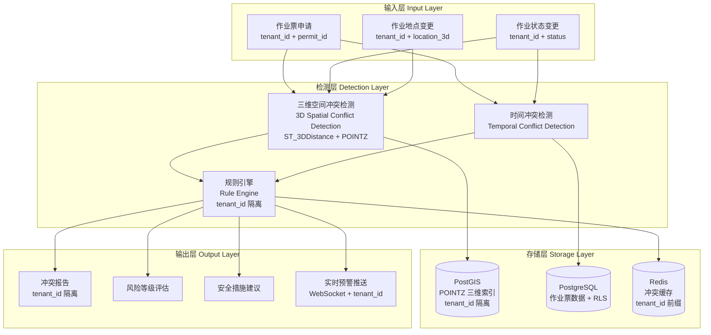

# SIMOPs冲突检测算法

**文档版本**：v2.0
**最后更新**：2026-03-10
**文档状态**：已发布
**作者**：产品架构团队

---

## 1. 背景与问题（为什么）

### 1.1 业务背景

危险化学品企业特殊作业许可（PTW）管理系统需要管理8大特殊作业类型的交叉作业场景。根据GB 30871-2022标准，**同一时间、同一区域内进行多种特殊作业时，必须进行交叉作业风险评估**，并采取额外的安全措施。

**典型交叉作业场景**：
- **受限空间内动火**：受限空间作业 + 动火作业（风险等级：极高）
- **高处动火**：高处作业 + 动火作业（风险等级：高）
- **罐区吊装**：吊装作业 + 动火作业 + 高处作业（风险等级：极高）
- **管道盲板抽堵 + 动火**：盲板抽堵作业 + 动火作业（风险等级：高）
- **临时用电 + 动火**：临时用电作业 + 动火作业（风险等级：中）

**核心监管要求**：
- GB 30871-2022明确要求"一票多办"：同一作业涉及多种特殊作业时，应同时办理各自审批手续
- 交叉作业必须进行专项风险评估（JSA）
- 监护人必须具备所有涉及作业类型的资质
- 安全措施必须满足所有作业类型的最高要求

### 1.2 技术挑战

**挑战1：空间冲突检测的复杂性**
- 作业点可能是点、线、面、体（如：动火点是点，管道是线，罐区是面，受限空间是体）
- 不同作业的影响范围不同（如：动火影响半径10米，吊装影响半径50米）
- **需要考虑三维空间**（如：高处作业在上方，动火作业在下方，垂直距离5米但水平距离3米）
- **多租户隔离**：不同租户的作业票不应相互冲突检测（数据隔离）

**挑战2：时间重叠判断的精确性**
- 作业时间可能跨天（如：夜间动火作业）
- 作业可能中断后恢复（如：午休时间暂停）
- 需要考虑作业准备时间和收尾时间

**挑战3：冲突规则的动态性**
- 不同作业类型组合的风险等级不同
- 企业可能有自定义的冲突规则
- 冲突规则可能随着安全标准更新而变化

**挑战4：性能要求**
- 单个企业可能同时进行100+张作业票
- 冲突检测需要在**500ms内**完成（P95）
- 需要支持实时监控（作业状态变化时立即重新检测）

### 1.3 设计目标

1. **精确检测**：准确识别三维空间重叠和时间重叠的交叉作业（符合 AQ 3064.3 三维定位标准）
2. **高性能**：冲突检测 < 500ms（P95），支持100+并发作业票
3. **可扩展**：支持企业自定义冲突规则和风险等级
4. **实时预警**：作业状态变化时自动触发冲突检测并推送预警
5. **多租户隔离**：租户间数据完全隔离，冲突检测仅在租户内部进行

---

## 2. 架构设计（是什么）

### 2.1 总体架构图



### 2.2 核心算法说明

#### 2.2.1 三维空间冲突检测算法

**核心思想**：使用 PostGIS 的三维空间索引（R-Tree）快速查询三维空间重叠的作业票，支持垂直距离计算。

**空间表示（升级为三维）**：
- **点（POINTZ）**：动火点、临时用电点（经度、纬度、海拔高度）
- **线（LINESTRINGZ）**：管道、电缆（三维路径）
- **面（POLYGONZ）**：罐区、受限空间、动土区域（带高度范围）
- **缓冲区（Buffer）**：作业影响范围（如：动火点周围水平10米 + 垂直5米）

**三维距离计算**：
- **水平距离**：使用 `ST_Distance(geography)` 计算地表距离
- **垂直距离**：直接计算 Z 坐标差值 `ABS(z1 - z2)`
- **三维欧氏距离**：使用 `ST_3DDistance(geometry)` 计算空间直线距离

**算法步骤**：
1. 将作业地点转换为 PostGIS 三维几何对象（GEOMETRY(POINTZ, 4326)）
2. 根据作业类型计算三维影响范围（水平 Buffer + 垂直范围）
3. 使用 PostGIS 的 `ST_3DIntersects` 函数查询三维空间重叠的作业票
4. 过滤出状态为"已批准"或"进行中"的作业票
5. **添加 tenant_id 过滤**：仅查询同一租户的作业票
6. 返回冲突作业票列表

**SQL示例（升级为三维 + 多租户）**：
```sql
-- 查询与新作业票三维空间重叠的作业票（多租户隔离）
SELECT
    permit_id,
    permit_type,
    work_location,
    ST_3DDistance(
        work_location_gis,
        ST_GeomFromEWKT('SRID=4326;POINTZ(120.123 30.456 15.5)')
    ) AS distance_3d,
    ST_Distance(
        work_location_gis::geography,
        ST_GeomFromEWKT('SRID=4326;POINTZ(120.123 30.456 15.5)')::geography
    ) AS distance_horizontal,
    ABS(ST_Z(work_location_gis) - 15.5) AS distance_vertical
FROM work_permit_main
WHERE
    tenant_id = 'tenant_abc123'  -- 多租户隔离
    AND status IN ('已批准', '进行中')
    AND ST_3DIntersects(
        ST_Buffer(work_location_gis::geography, 10)::geometry,  -- 水平10米
        ST_Buffer(ST_GeomFromEWKT('SRID=4326;POINTZ(120.123 30.456 15.5)')::geography, 10)::geometry
    )
    AND ABS(ST_Z(work_location_gis) - 15.5) <= 5  -- 垂直5米
    AND permit_id != '20260310-动火-001'  -- 排除自己
ORDER BY distance_3d;
```

**三维冲突场景示例**：
- **场景1：高处动火**
  - 高处作业：(120.123, 30.456, 20.0m)，水平影响10m，垂直影响±5m
  - 动火作业：(120.125, 30.457, 18.0m)，水平影响10m，垂直影响±5m
  - 水平距离：22m，垂直距离：2m，三维距离：22.09m
  - **判定**：冲突（垂直距离 < 5m）

- **场景2：罐区吊装**
  - 吊装作业：(120.130, 30.460, 25.0m)，水平影响50m，垂直影响±10m
  - 动火作业：(120.135, 30.462, 2.0m)，水平影响10m，垂直影响±5m
  - 水平距离：60m，垂直距离：23m，三维距离：64.3m
  - **判定**：冲突（水平距离 < 50m + 10m）

#### 2.2.2 时间冲突检测算法

**核心思想**：判断两个时间区间是否重叠。

**时间区间表示**：
- **开始时间**：`start_time`
- **结束时间**：`end_time`
- **时间区间**：`[start_time, end_time]`

**重叠判断公式**：
两个时间区间 `[A_start, A_end]` 和 `[B_start, B_end]` 重叠，当且仅当：
```
A_start < B_end AND B_start < A_end
```

**SQL示例**：
```sql
-- 查询与新作业票时间重叠的作业票（多租户隔离）
SELECT
    permit_id,
    permit_type,
    start_time,
    end_time
FROM work_permit_main
WHERE
    tenant_id = 'tenant_abc123'  -- 多租户隔离
    AND status IN ('已批准', '进行中')
    AND start_time < '2026-03-10 18:00:00'  -- 新作业票的结束时间
    AND end_time > '2026-03-10 08:00:00'    -- 新作业票的开始时间
    AND permit_id != '20260310-动火-001';
```

#### 2.2.3 综合冲突检测算法

**核心思想**：空间重叠 + 时间重叠 = 交叉作业冲突。

**算法步骤**：
1. 执行空间冲突检测，得到空间重叠的作业票列表 `S`
2. 执行时间冲突检测，得到时间重叠的作业票列表 `T`
3. 计算交集 `S ∩ T`，得到同时满足空间和时间重叠的作业票
4. 对每个冲突作业票，查询冲突规则矩阵，计算风险等级
5. 生成冲突报告和安全措施建议

**伪代码**：
```python
def detect_simops_conflict(new_permit):
    # 0. 获取租户上下文
    tenant_id = new_permit.tenant_id

    # 1. 三维空间冲突检测
    spatial_conflicts = detect_3d_spatial_conflict(
        tenant_id=tenant_id,  # 多租户隔离
        location=new_permit.work_location_gis,  # POINTZ(lon, lat, elevation)
        buffer_horizontal=get_buffer_distance(new_permit.permit_type),
        buffer_vertical=get_vertical_range(new_permit.permit_type)
    )

    # 2. 时间冲突检测
    temporal_conflicts = detect_temporal_conflict(
        tenant_id=tenant_id,  # 多租户隔离
        start_time=new_permit.start_time,
        end_time=new_permit.end_time
    )

    # 3. 计算交集
    conflicts = spatial_conflicts.intersection(temporal_conflicts)

    # 4. 查询冲突规则矩阵（租户级别）
    conflict_reports = []
    for conflict_permit in conflicts:
        risk_level = get_risk_level(
            tenant_id=tenant_id,  # 租户自定义规则
            type_a=new_permit.permit_type,
            type_b=conflict_permit.permit_type
        )
        safety_measures = get_safety_measures(
            tenant_id=tenant_id,
            type_a=new_permit.permit_type,
            type_b=conflict_permit.permit_type
        )
        conflict_reports.append({
            'conflict_permit_id': conflict_permit.permit_id,
            'conflict_type': conflict_permit.permit_type,
            'risk_level': risk_level,
            'distance_3d': conflict_permit.distance_3d,
            'distance_horizontal': conflict_permit.distance_horizontal,
            'distance_vertical': conflict_permit.distance_vertical,
            'safety_measures': safety_measures
        })

    return conflict_reports
```

### 2.3 冲突规则矩阵

**冲突规则矩阵**定义了不同作业类型组合的风险等级和安全措施。

**风险等级定义**：
- **极高（Critical）**：禁止同时进行，或需要企业负责人特批
- **高（High）**：需要专项风险评估（JSA）和额外安全措施
- **中（Medium）**：需要加强监护和协调
- **低（Low）**：正常审批流程

**冲突规则矩阵表**：

| 作业类型A \ 作业类型B | 动火 | 受限空间 | 盲板抽堵 | 高处 | 吊装 | 临时用电 | 动土 | 断路 |
|---------------------|------|---------|---------|------|------|---------|------|------|
| **动火**             | -    | 极高     | 高       | 高   | 高   | 中       | 低   | 中   |
| **受限空间**         | 极高  | -       | 高       | 中   | 中   | 高       | 低   | 中   |
| **盲板抽堵**         | 高    | 高      | -       | 中   | 中   | 中       | 低   | 高   |
| **高处**             | 高    | 中      | 中       | -    | 高   | 中       | 低   | 中   |
| **吊装**             | 高    | 中      | 中       | 高   | -    | 中       | 中   | 中   |
| **临时用电**         | 中    | 高      | 中       | 中   | 中   | -       | 低   | 高   |
| **动土**             | 低    | 低      | 低       | 低   | 中   | 低       | -    | 中   |
| **断路**             | 中    | 中      | 高       | 中   | 中   | 高       | 中   | -    |

**数据库存储**（PostgreSQL + 多租户隔离）：
```sql
CREATE TABLE simops_conflict_rules (
    rule_id VARCHAR(32) PRIMARY KEY COMMENT '规则ID',
    tenant_id VARCHAR(32) NOT NULL COMMENT '租户ID（多租户隔离）',
    permit_type_a ENUM('动火','受限空间','盲板抽堵','高处','吊装','临时用电','动土','断路') NOT NULL COMMENT '作业类型A',
    permit_type_b ENUM('动火','受限空间','盲板抽堵','高处','吊装','临时用电','动土','断路') NOT NULL COMMENT '作业类型B',
    risk_level ENUM('极高','高','中','低') NOT NULL COMMENT '风险等级',
    is_prohibited TINYINT(1) DEFAULT 0 COMMENT '是否禁止同时进行',
    safety_measures JSON COMMENT '安全措施清单（JSON数组）',
    created_at TIMESTAMPTZ NOT NULL DEFAULT CURRENT_TIMESTAMP,
    updated_at TIMESTAMPTZ NOT NULL DEFAULT CURRENT_TIMESTAMP,
    UNIQUE KEY uk_tenant_types (tenant_id, permit_type_a, permit_type_b)
) COMMENT='SIMOPs冲突规则矩阵（支持租户自定义）';

-- 启用行级安全策略（RLS）
ALTER TABLE simops_conflict_rules ENABLE ROW LEVEL SECURITY;

-- 创建租户隔离策略
CREATE POLICY tenant_isolation_policy ON simops_conflict_rules
    USING (tenant_id = current_setting('app.current_tenant')::VARCHAR);

-- 创建索引
CREATE INDEX idx_tenant_types ON simops_conflict_rules (tenant_id, permit_type_a, permit_type_b);
```

---

## 3. 实施方案（怎么做）

### 3.1 PostGIS 三维空间索引优化

#### 3.1.1 创建三维空间索引

**目的**：加速三维空间查询，将查询时间从 O(n) 降低到 O(log n)。

**SQL示例**：
```sql
-- 创建三维空间索引（GiST - Generalized Search Tree）
CREATE INDEX idx_work_location_gis_3d ON work_permit_main USING GIST (work_location_gis);

-- 创建租户 + 状态复合索引
CREATE INDEX idx_tenant_status ON work_permit_main (tenant_id, status) WHERE status IN ('已批准', '进行中');

-- 验证索引是否生效
EXPLAIN ANALYZE
SELECT permit_id
FROM work_permit_main
WHERE
    tenant_id = 'tenant_abc123'
    AND ST_3DIntersects(
        ST_Buffer(work_location_gis::geography, 10)::geometry,
        ST_Buffer(ST_GeomFromEWKT('SRID=4326;POINTZ(120.123 30.456 15.5)')::geography, 10)::geometry
    )
    AND ABS(ST_Z(work_location_gis) - 15.5) <= 5;
```

**性能优化**：
- 使用 `GIST` 索引（Generalized Search Tree）而非 `BTREE`
- 定期执行 `VACUUM ANALYZE` 更新统计信息
- 对于大数据量（>10万条），考虑分区表（按 tenant_id 分区）
- 使用 `GEOMETRY(POINTZ, 4326)` 而非 `GEOGRAPHY` 以提升三维计算性能

#### 3.1.2 三维空间查询优化技巧

**技巧1：使用 Bounding Box 预过滤**
```sql
-- 先用 Bounding Box 快速过滤，再用精确的 ST_3DIntersects
SELECT permit_id
FROM work_permit_main
WHERE
    tenant_id = 'tenant_abc123'  -- 租户隔离
    AND work_location_gis && ST_Expand(ST_GeomFromEWKT('SRID=4326;POINTZ(120.123 30.456 15.5)'), 10)  -- Bounding Box过滤
    AND ST_3DIntersects(
        ST_Buffer(work_location_gis::geography, 10)::geometry,
        ST_Buffer(ST_GeomFromEWKT('SRID=4326;POINTZ(120.123 30.456 15.5)')::geography, 10)::geometry
    );
```

**技巧2：缓存常用查询结果（多租户隔离）**
```python
import redis

def get_nearby_permits(tenant_id, location, buffer_distance):
    cache_key = f"simops:nearby:{tenant_id}:{location}:{buffer_distance}"
    cached_result = redis_client.get(cache_key)

    if cached_result:
        return json.loads(cached_result)

    # 执行 PostGIS 三维查询
    result = execute_3d_spatial_query(tenant_id, location, buffer_distance)

    # 缓存结果（TTL=5分钟）
    redis_client.setex(cache_key, 300, json.dumps(result))

    return result
```

### 3.2 冲突检测服务实现

#### 3.2.1 冲突检测API

**接口定义**：
```
POST /api/simops/detect
Content-Type: application/json
X-Tenant-ID: tenant_abc123

{
  "permit_id": "20260310-动火-001",
  "permit_type": "动火",
  "work_location": {
    "latitude": 30.456,
    "longitude": 120.123,
    "elevation": 15.5
  },
  "start_time": "2026-03-10 08:00:00",
  "end_time": "2026-03-10 18:00:00"
}
```

**响应示例**：
```json
{
  "status": "conflict_detected",
  "conflict_count": 2,
  "conflicts": [
    {
      "conflict_permit_id": "20260310-受限空间-002",
      "conflict_type": "受限空间",
      "risk_level": "极高",
      "distance_3d": 6.8,
      "distance_horizontal": 5.2,
      "distance_vertical": 4.3,
      "time_overlap": "2026-03-10 08:00:00 ~ 2026-03-10 12:00:00",
      "safety_measures": [
        "必须由企业负责人特批",
        "配备专职安全员全程监护",
        "连续气体监测（LEL、O2、H2S）",
        "配备正压式空气呼吸器"
      ]
    },
    {
      "conflict_permit_id": "20260310-高处-003",
      "conflict_type": "高处",
      "risk_level": "高",
      "distance_3d": 9.2,
      "distance_horizontal": 8.7,
      "distance_vertical": 3.0,
      "time_overlap": "2026-03-10 14:00:00 ~ 2026-03-10 18:00:00",
      "safety_measures": [
        "高处作业下方设置火星接料斗",
        "动火点上方禁止进行高处作业",
        "加强监护人协调"
      ]
    }
  ]
}
```

#### 3.2.2 Python实现示例

```python
from fastapi import FastAPI, HTTPException, Header
from pydantic import BaseModel
from typing import List, Optional
import psycopg2
from datetime import datetime

app = FastAPI()

class PermitLocation(BaseModel):
    latitude: float
    longitude: float
    elevation: float  # 新增：海拔高度（米）

class ConflictDetectionRequest(BaseModel):
    permit_id: str
    permit_type: str
    work_location: PermitLocation
    start_time: datetime
    end_time: datetime

class ConflictReport(BaseModel):
    conflict_permit_id: str
    conflict_type: str
    risk_level: str
    distance_3d: float  # 三维欧氏距离
    distance_horizontal: float  # 水平距离
    distance_vertical: float  # 垂直距离
    time_overlap: str
    safety_measures: List[str]

@app.post("/api/simops/detect")
async def detect_simops_conflict(
    request: ConflictDetectionRequest,
    x_tenant_id: str = Header(..., alias="X-Tenant-ID")  # 从请求头获取租户ID
):
    # 1. 连接 PostgreSQL + PostGIS 数据库
    conn = psycopg2.connect(
        host="localhost",
        database="ptw_system",
        user="postgres",
        password="password"
    )
    cursor = conn.cursor()

    # 2. 设置租户上下文（RLS）
    cursor.execute("SET app.current_tenant = %s", (x_tenant_id,))

    # 3. 三维空间冲突检测
    spatial_query = """
        SELECT
            permit_id,
            permit_type,
            ST_3DDistance(
                work_location_gis,
                ST_GeomFromEWKT(%s)
            ) AS distance_3d,
            ST_Distance(
                work_location_gis::geography,
                ST_GeomFromEWKT(%s)::geography
            ) AS distance_horizontal,
            ABS(ST_Z(work_location_gis) - %s) AS distance_vertical
        FROM work_permit_main
        WHERE
            tenant_id = %s
            AND status IN ('已批准', '进行中')
            AND permit_id != %s
            AND ST_3DIntersects(
                ST_Buffer(work_location_gis::geography, 10)::geometry,
                ST_Buffer(ST_GeomFromEWKT(%s)::geography, 10)::geometry
            )
            AND ABS(ST_Z(work_location_gis) - %s) <= 5
    """

    point_ewkt = f"SRID=4326;POINTZ({request.work_location.longitude} {request.work_location.latitude} {request.work_location.elevation})"
    cursor.execute(spatial_query, (
        point_ewkt, point_ewkt, request.work_location.elevation,
        x_tenant_id, request.permit_id, point_ewkt, request.work_location.elevation
    ))
    spatial_conflicts = cursor.fetchall()

    # 4. 时间冲突检测
    temporal_query = """
        SELECT permit_id, permit_type, start_time, end_time
        FROM work_permit_main
        WHERE
            tenant_id = %s
            AND status IN ('已批准', '进行中')
            AND permit_id != %s
            AND start_time < %s
            AND end_time > %s
    """

    cursor.execute(temporal_query, (x_tenant_id, request.permit_id, request.end_time, request.start_time))
    temporal_conflicts = cursor.fetchall()

    # 5. 计算交集
    spatial_ids = {row[0] for row in spatial_conflicts}
    temporal_ids = {row[0] for row in temporal_conflicts}
    conflict_ids = spatial_ids.intersection(temporal_ids)

    # 6. 查询冲突规则矩阵（租户级别）
    conflicts = []
    for conflict_id in conflict_ids:
        # 获取冲突作业票详情
        conflict_permit = next((row for row in spatial_conflicts if row[0] == conflict_id), None)
        if not conflict_permit:
            continue

        conflict_type = conflict_permit[1]
        distance_3d = conflict_permit[2]
        distance_horizontal = conflict_permit[3]
        distance_vertical = conflict_permit[4]

        # 查询风险等级和安全措施（租户自定义规则）
        rule_query = """
            SELECT risk_level, safety_measures
            FROM simops_conflict_rules
            WHERE
                tenant_id = %s
                AND (
                    (permit_type_a = %s AND permit_type_b = %s)
                    OR (permit_type_a = %s AND permit_type_b = %s)
                )
        """
        cursor.execute(rule_query, (x_tenant_id, request.permit_type, conflict_type, conflict_type, request.permit_type))
        rule = cursor.fetchone()

        if rule:
            risk_level = rule[0]
            safety_measures = rule[1]

            conflicts.append(ConflictReport(
                conflict_permit_id=conflict_id,
                conflict_type=conflict_type,
                risk_level=risk_level,
                distance_3d=distance_3d,
                distance_horizontal=distance_horizontal,
                distance_vertical=distance_vertical,
                time_overlap=f"{request.start_time} ~ {request.end_time}",
                safety_measures=safety_measures
            ))

    cursor.close()
    conn.close()

    # 7. 返回结果
    if conflicts:
        return {
            "status": "conflict_detected",
            "conflict_count": len(conflicts),
            "conflicts": conflicts
        }
    else:
        return {
            "status": "no_conflict",
            "conflict_count": 0,
            "conflicts": []
        }
```

### 3.3 实时冲突监控

#### 3.3.1 作业状态变更触发

**场景**：当作业票状态从"已批准"变为"进行中"时，自动触发冲突检测。

**实现方式**：使用 PostgreSQL 触发器 + 消息队列（Kafka）。

**PostgreSQL 触发器**：
```sql
CREATE OR REPLACE FUNCTION notify_permit_status_change()
RETURNS TRIGGER AS $$
BEGIN
    IF NEW.status IN ('已批准', '进行中') AND OLD.status != NEW.status THEN
        -- 发送消息到 Kafka（通过 pg_kafka 扩展或外部服务）
        PERFORM pg_notify(
            'permit_status_changed',
            json_build_object(
                'tenant_id', NEW.tenant_id,
                'permit_id', NEW.permit_id,
                'permit_type', NEW.permit_type,
                'work_location', ST_AsEWKT(NEW.work_location_gis),
                'start_time', NEW.start_time,
                'end_time', NEW.end_time,
                'old_status', OLD.status,
                'new_status', NEW.status
            )::text
        );
    END IF;
    RETURN NEW;
END;
$$ LANGUAGE plpgsql;

CREATE TRIGGER trg_permit_status_change
AFTER UPDATE ON work_permit_main
FOR EACH ROW
EXECUTE FUNCTION notify_permit_status_change();
```

**Kafka 消费者**：
```python
from kafka import KafkaConsumer
import json

consumer = KafkaConsumer(
    'permit-status-changed',
    bootstrap_servers=['localhost:9092'],
    value_deserializer=lambda m: json.loads(m.decode('utf-8'))
)

for message in consumer:
    permit_data = message.value
    tenant_id = permit_data['tenant_id']  # 提取租户ID

    # 触发冲突检测（传递租户ID）
    conflicts = detect_simops_conflict(tenant_id, permit_data)

    # 如果检测到冲突，推送预警（租户隔离）
    if conflicts:
        send_conflict_alert(tenant_id, permit_data['permit_id'], conflicts)
```

#### 3.3.2 实时预警推送

**推送方式**：
- **WebSocket**：实时监控大屏
- **移动端推送**：极光推送/Firebase
- **短信**：阿里云短信服务
- **企业微信/钉钉**：机器人消息

**WebSocket推送示例**：
```python
from fastapi import WebSocket

@app.websocket("/ws/simops/monitor/{tenant_id}")
async def websocket_monitor(websocket: WebSocket, tenant_id: str):
    await websocket.accept()

    # 订阅 Redis Pub/Sub（租户隔离）
    pubsub = redis_client.pubsub()
    pubsub.subscribe(f'simops_conflict_alert:{tenant_id}')

    for message in pubsub.listen():
        if message['type'] == 'message':
            alert_data = json.loads(message['data'])
            await websocket.send_json(alert_data)
```

### 3.4 性能优化策略

#### 3.4.1 缓存策略

**缓存内容**：
- 冲突规则矩阵（Redis Hash，按租户隔离）
- 作业票空间索引（Redis Geo，按租户隔离）
- 最近冲突检测结果（Redis String，TTL=5分钟，按租户隔离）

**Redis Geo 示例（多租户隔离）**：
```python
import redis

redis_client = redis.Redis(host='localhost', port=6379, db=0)

# 添加作业票位置到 Redis Geo（租户隔离）
def add_permit_location(tenant_id, permit_id, longitude, latitude, elevation):
    # 使用租户前缀隔离
    redis_client.geoadd(f'permits:locations:{tenant_id}', (longitude, latitude, permit_id))
    # 存储海拔高度（单独存储）
    redis_client.hset(f'permits:elevations:{tenant_id}', permit_id, elevation)

# 查询附近的作业票（租户隔离）
def get_nearby_permits(tenant_id, longitude, latitude, radius_meters):
    return redis_client.georadius(
        f'permits:locations:{tenant_id}',
        longitude,
        latitude,
        radius_meters,
        unit='m',
        withdist=True
    )
```

#### 3.4.2 数据库查询优化

**优化技巧**：
1. **使用覆盖索引**：避免回表查询
2. **分区表**：按租户分区（tenant_id）或按时间分区（按月分区）
3. **读写分离**：冲突检测使用只读从库
4. **连接池**：复用数据库连接

**覆盖索引示例**：
```sql
-- 创建覆盖索引（包含所有查询字段）
CREATE INDEX idx_permit_tenant_status_time_location ON work_permit_main (
    tenant_id,
    status,
    start_time,
    end_time,
    work_location_gis
) WHERE status IN ('已批准', '进行中');

-- 创建租户分区表（PostgreSQL 声明式分区）
CREATE TABLE work_permit_main_partitioned (
    permit_id VARCHAR(50) NOT NULL,
    tenant_id VARCHAR(32) NOT NULL,
    permit_type VARCHAR(20) NOT NULL,
    work_location_gis GEOMETRY(POINTZ, 4326),
    status VARCHAR(20),
    start_time TIMESTAMPTZ,
    end_time TIMESTAMPTZ,
    created_at TIMESTAMPTZ DEFAULT CURRENT_TIMESTAMP
) PARTITION BY LIST (tenant_id);

-- 为每个租户创建分区
CREATE TABLE work_permit_tenant_abc123 PARTITION OF work_permit_main_partitioned
    FOR VALUES IN ('tenant_abc123');

CREATE TABLE work_permit_tenant_xyz789 PARTITION OF work_permit_main_partitioned
    FOR VALUES IN ('tenant_xyz789');
```

---

## 4. 相关文档

### 4.1 上游文档
- [ADR-002: 产品范围从单一动火系统升级为完整PTW系统](../adr/20260309-upgrade-to-ptw-system.md)
- [四层解耦架构设计](./layered-architecture.md)
- [数据库架构设计](./database-design.md)
- [三维人员定位架构](./personnel-positioning.md)
- [多租户架构设计](./multi-tenant.md)

### 4.2 下游文档
- [IoT边缘接入架构](./iot-integration.md)
- [安全与合规性架构](./security-compliance.md)
- [部署架构设计](./deployment-architecture.md)

### 4.3 产品文档
- [PRD.md - 产品需求文档](../../产出/PRD.md)（待生成）
- [roadmap.md - 产品路线图](../../产出/roadmap.md)（待生成）

### 4.4 外部标准
- **GB 30871-2022**：《危险化学品企业特殊作业安全规范》
- **AQ 3064.3-2025**：《危险化学品企业工业互联网平台建设指南 第3部分：人员定位》（±3m 精度）

---

## 5. 附录

### 5.1 术语表

| 术语 | 英文 | 定义 |
|-----|------|------|
| SIMOPs | Simultaneous Operations | 交叉作业/同时作业 |
| PostGIS | PostgreSQL Geographic Information System | PostgreSQL 地理信息系统扩展 |
| POINTZ | 3D Point Geometry | 三维点几何类型（经度、纬度、海拔高度） |
| ST_3DDistance | 3D Distance Function | PostGIS 三维欧氏距离计算函数 |
| ST_3DIntersects | 3D Intersection Function | PostGIS 三维空间相交判断函数 |
| R-Tree | R-Tree Index | 空间索引数据结构 |
| GIST | Generalized Search Tree | 通用搜索树索引 |
| JSA | Job Safety Analysis | 工作安全分析 |
| Buffer | Buffer Zone | 缓冲区/影响范围 |
| RLS | Row-Level Security | PostgreSQL 行级安全策略（多租户隔离） |
| SRID | Spatial Reference System Identifier | 空间参考系统标识符（4326 = WGS 84） |
| EWKT | Extended Well-Known Text | 扩展 WKT 格式（支持 SRID 和 Z 坐标） |

### 5.2 版本历史

| 版本 | 日期 | 变更内容 | 作者 |
|-----|------|---------|------|
| v1.0 | 2026-03-10 | 初始版本，定义 SIMOPs 冲突检测算法 | 产品架构团队 |
| v2.0 | 2026-03-10 | **重大升级**：<br/>1. 升级为三维空间冲突检测（ST_3DDistance + POINTZ）<br/>2. 添加多租户隔离（tenant_id + RLS）<br/>3. 冲突规则矩阵支持租户自定义<br/>4. 数据库从 MySQL 迁移到 PostgreSQL<br/>5. 添加三维距离计算（水平/垂直/三维欧氏距离）<br/>6. 添加租户分区表优化<br/>7. 更新 API 接口支持海拔高度参数<br/>8. 更新术语表（新增 POINTZ、ST_3DDistance、RLS、EWKT） | 产品架构团队 |

---

**文档结束**
