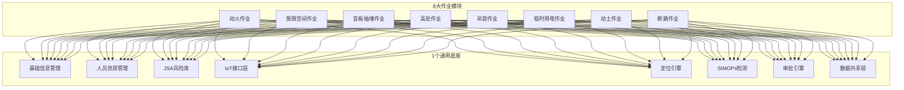
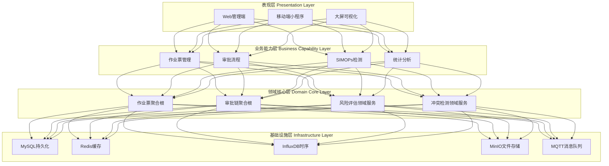
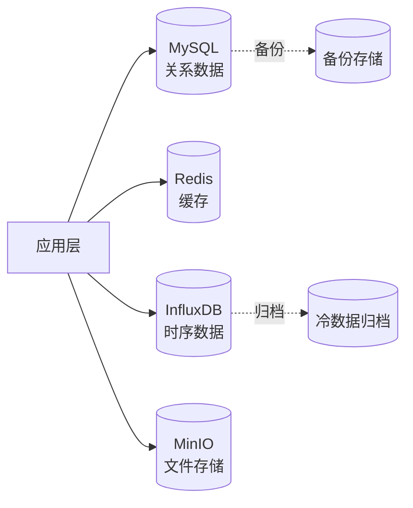
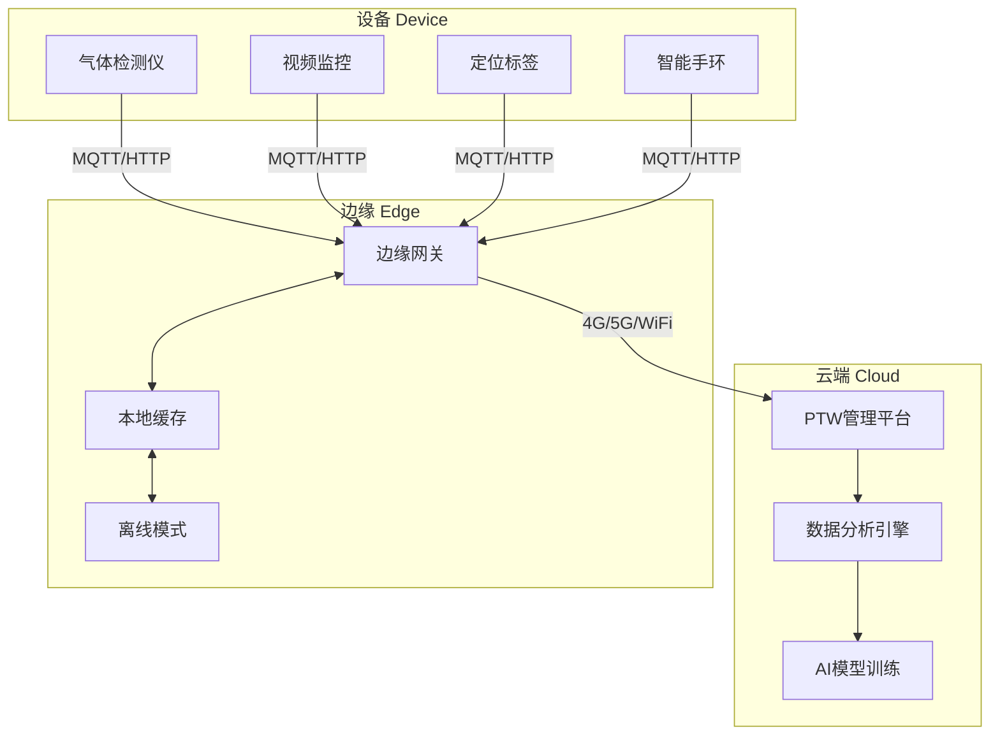
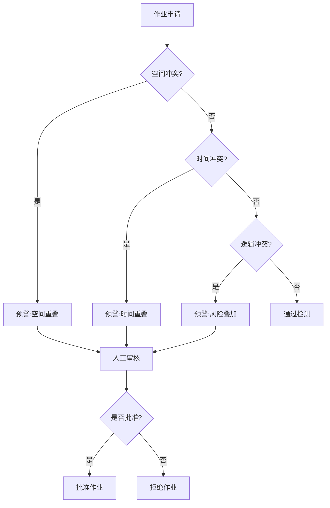
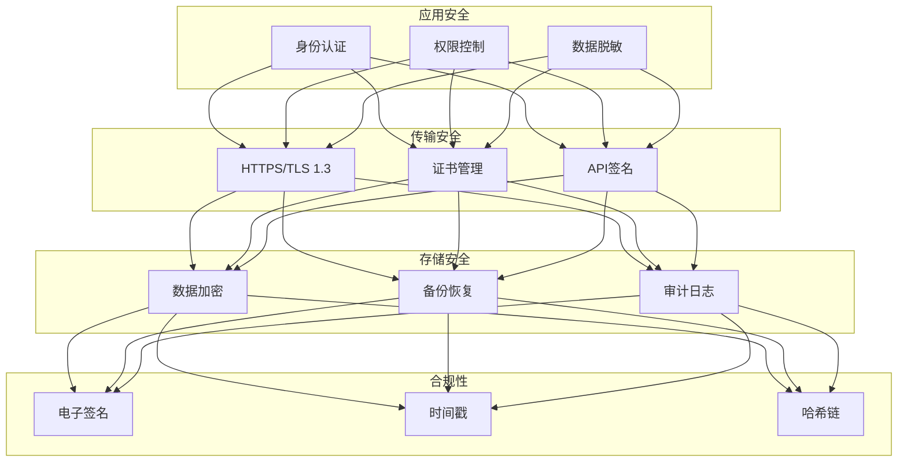
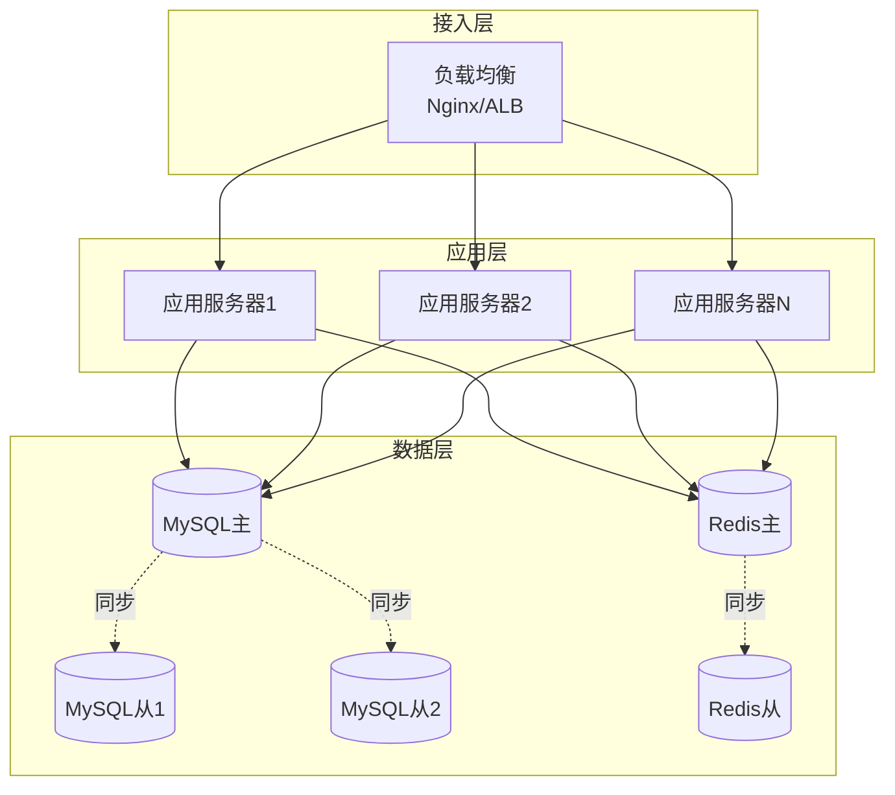

# 04 - 系统架构设计

## 4.1 "1+8"架构概览

### 4.1.1 架构理念

本系统采用"1+8"模块化架构，将通用能力与业务场景解耦，实现高内聚、低耦合的设计目标。

### 4.1.2 架构优势

| 优势 | 说明 | 价值 |
|------|------|------|
| **模块化** | 作业模块独立开发、部署、升级 | 降低开发成本，加快迭代速度 |
| **可扩展** | 新增作业类型无需改动底座 | 支持未来业务扩展 |
| **灵活部署** | 支持按需采购（MVP→全量） | 降低客户初期投入 |
| **能力复用** | 通用能力一次开发，多处使用 | 提高代码复用率 |

## 4.1+ 三层积木化架构（功能拆解视角）

"1+8"架构在功能实现层面进一步细化为三层积木化体系：32 个原子积木（最小可复用单元）→ 12 个组合积木（封装完整业务能力）→ 11 个业务场景（8 种作业票 + 3 个平台级场景）。8 种作业类型共享同一套代码，差异全部通过元数据表单引擎（G-01）、JSA 模板引擎（E-02）和审批流程引擎（C-01）三个配置引擎驱动，实现零代码分支的业务差异化。

详细的原子积木定义、组合积木组成、业务场景映射及开发优先级，见：[功能需求积木化拆解方案](../功能需求_积木化拆解方案.md)

## 4.2 四层解耦架构

详见：[docs/architecture/layered-architecture.md](../docs/architecture/layered-architecture.md)

### 4.2.1 架构分层

### 4.2.2 分层职责

**表现层（Presentation Layer）：**
- 用户交互界面（Web、移动端、大屏）
- 请求参数校验与转换
- 响应数据格式化

**业务能力层（Business Capability Layer）：**
- 业务流程编排
- 跨聚合根协调
- 事务边界控制

**领域核心层（Domain Core Layer）：**
- 业务规则封装
- 领域模型设计
- 领域事件发布

**基础设施层（Infrastructure Layer）：**
- 数据持久化
- 缓存管理
- 消息队列
- 文件存储

## 4.3 数据库架构

详见：[docs/architecture/database-design.md](../docs/architecture/database-design.md)

### 4.3.1 混合存储模型

### 4.3.2 存储选型

| 存储类型 | 技术选型 | 存储内容 | 保留期限 |
|---------|---------|---------|---------|
| **关系数据** | MySQL 8.0 | 作业票、审批记录、用户信息 | 永久 |
| **缓存** | Redis 7.0 | 会话、热点数据、分布式锁 | 临时 |
| **时序数据** | InfluxDB 2.0 | IoT传感器数据、监控指标 | 1年 |
| **文件存储** | MinIO | 图片、视频、PDF文档 | 永久 |

## 4.4 IoT边缘接入架构

详见：[docs/architecture/iot-integration.md](../docs/architecture/iot-integration.md)

### 4.4.1 云边协同模型

### 4.4.2 协议支持

- **MQTT**：轻量级消息队列，适用于低功耗设备
- **HTTP/HTTPS**：标准Web协议，适用于摄像头、网关
- **Modbus TCP**：工业协议，适用于PLC、DCS集成
- **OPC UA**：工业物联网标准，适用于智能制造场景

## 4.5 SIMOPs冲突检测算法

详见：[docs/architecture/simops-algorithm.md](../docs/architecture/simops-algorithm.md)

### 4.5.1 三维冲突检测

### 4.5.2 算法性能

- **空间索引**：R-Tree，查询复杂度O(log n)
- **检测延迟**：<100ms（1000个并发作业）
- **准确率**：≥95%
- **误报率**：≤5%

## 4.6 安全与合规架构

详见：[docs/architecture/security-compliance.md](../docs/architecture/security-compliance.md)

### 4.6.1 安全体系

### 4.6.2 电子签名方案

- **CA证书**：对接国家认证的CA机构
- **签名算法**：RSA-2048 / SM2国密算法
- **时间戳**：RFC 3161标准时间戳服务
- **哈希链**：SHA-256哈希链，防篡改

## 4.7 部署架构

详见：[docs/architecture/deployment-architecture.md](../docs/architecture/deployment-architecture.md)

### 4.7.1 高可用部署

### 4.7.2 容量规划

| 资源 | 配置 | 数量 | 支持规模 |
|------|------|------|---------|
| **应用服务器** | 8核16G | 3台 | 5000并发用户 |
| **MySQL主库** | 16核32G | 1台 | 10万作业票/天 |
| **MySQL从库** | 8核16G | 2台 | 读写分离 |
| **Redis** | 8核16G | 2台 | 主从热备 |
| **InfluxDB** | 8核16G | 1台 | 1000设备 |
| **MinIO** | 4核8G | 3台 | 10TB存储 |

## 4.8 技术选型

### 4.8.1 后端技术栈

| 技术 | 选型 | 版本 | 理由 |
|------|------|------|------|
| **开发语言** | Java | 17 LTS | 生态成熟，企业级应用首选 |
| **开发框架** | Spring Boot | 3.2 | 快速开发，社区活跃 |
| **ORM框架** | MyBatis-Plus | 3.5 | 灵活SQL，性能优秀 |
| **缓存** | Redis | 7.0 | 高性能，支持多种数据结构 |
| **消息队列** | RabbitMQ | 3.12 | 可靠性高，支持MQTT |
| **搜索引擎** | Elasticsearch | 8.0 | 全文检索，日志分析 |

### 4.8.2 前端技术栈

| 技术 | 选型 | 版本 | 理由 |
|------|------|------|------|
| **Web框架** | Vue.js | 3.4 | 渐进式框架，易上手 |
| **UI组件库** | Element Plus | 2.5 | 企业级组件，样式统一 |
| **移动端** | uni-app | 3.0 | 跨平台，一次开发多端运行 |
| **可视化** | ECharts | 5.4 | 图表丰富，性能优秀 |
| **地图** | 高德地图 | 2.0 | 国内覆盖好，API完善 |

### 4.8.3 DevOps工具链

| 工具 | 选型 | 用途 |
|------|------|------|
| **版本控制** | Git + GitLab | 代码管理 |
| **CI/CD** | Jenkins | 持续集成/部署 |
| **容器化** | Docker | 应用打包 |
| **编排** | Kubernetes | 容器编排 |
| **监控** | Prometheus + Grafana | 系统监控 |
| **日志** | ELK Stack | 日志收集分析 |
| **APM** | SkyWalking | 应用性能监控 |

## 4.9 相关文档

- [01-产品概述](./01-产品概述.md)
- [05-通用底座功能需求](./05-通用底座功能需求.md)
- [10-技术实现建议](./10-技术实现建议.md)
- [功能需求积木化拆解方案](../功能需求_积木化拆解方案.md)
- [ADR-002: "1+8"架构决策](../docs/adr/20260309-upgrade-to-ptw-system.md)
- [四层解耦架构](../docs/architecture/layered-architecture.md)
- [数据库设计](../docs/architecture/database-design.md)
- [IoT集成架构](../docs/architecture/iot-integration.md)
- [SIMOPs算法](../docs/architecture/simops-algorithm.md)
- [安全合规架构](../docs/architecture/security-compliance.md)
- [部署架构](../docs/architecture/deployment-architecture.md)

---

**文档版本**：v1.0
**最后更新**：2026-03-10
**维护人**：技术团队
