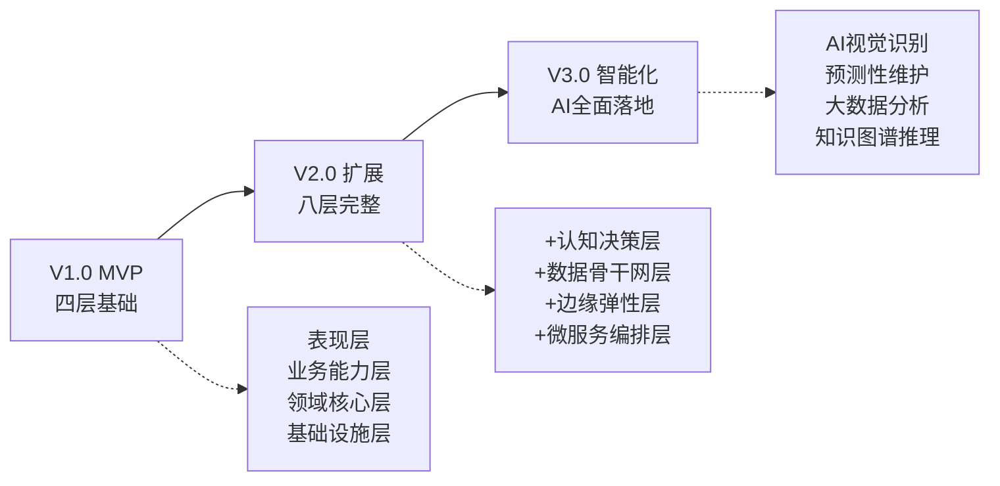
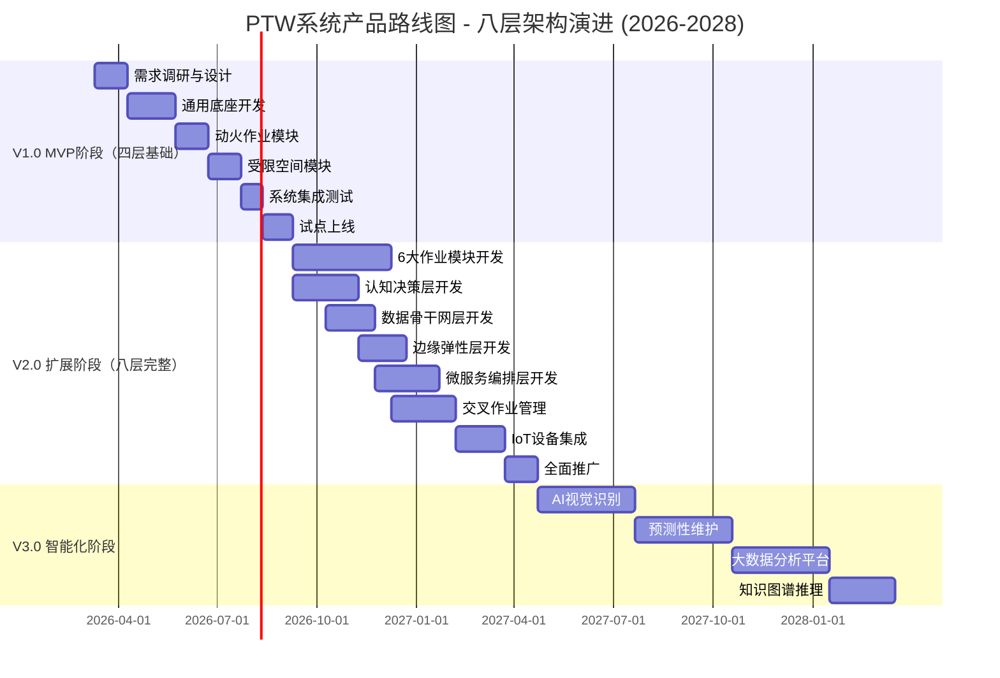
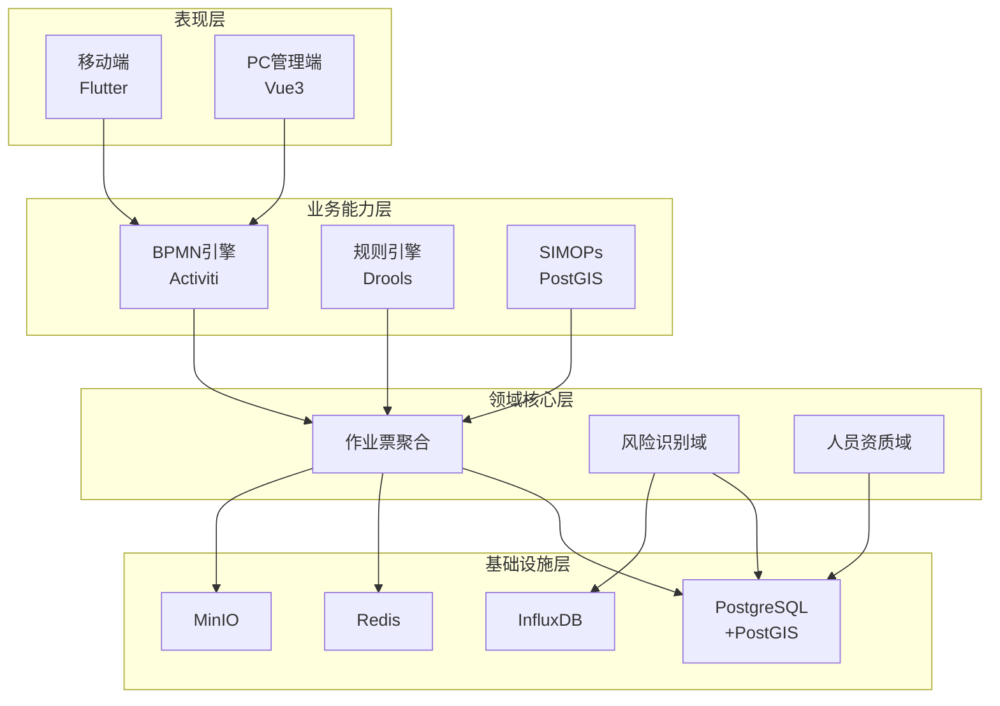

# 危险化学品企业特殊作业许可(PTW)管理系统 - 产品路线图 v2.0

**文档版本**: v2.0（基于八层架构）
**最后更新**: 2026-03-10
**文档状态**: 已发布
**维护人**: 产品团队

---

## 1. 产品愿景与战略定位

### 1.1 产品愿景

**愿景(3-5年)**:
成为危险化学品行业特殊作业安全管理的**数字化标准制定者**,通过AI智能体、边缘计算和工业互联网技术,构建覆盖全国1000+企业、50万+作业人员的安全管理生态,将特殊作业事故率降低80%以上。

**使命**:
用技术守护生命,让每一次特殊作业都在可控范围内安全完成。

### 1.2 市场定位

**目标市场**:
- **一级市场**: 危险化学品生产企业(石化、化工、煤化工)
- **二级市场**: 制药、新能源、精细化工企业
- **三级市场**: 工业园区安全监管平台

**竞争优势**:
1. **合规驱动**: 100%符合GB 30871-2022 + AQ 3064系列标准
2. **技术创新**: AI Agent智能体 + SIMOPs算法 + 边缘计算
3. **"1+8"架构**: 通用底座 + 8大作业模块,数据共享,一次录入多处调用
4. **工业互联网对齐**: 符合AQ 3064.1标准,无缝对接园区平台
5. **全生命周期管理**: 从风险识别到完工验收的闭环管理
6. **八层解耦架构**: 认知决策、数据骨干网、边缘弹性、微服务编排四大创新层级

### 1.3 技术战略

**核心技术栈（基于八层架构）**:

**MVP阶段（V1.0）- 四层基础**:
- **表现层**: 移动端(Flutter/React Native) + PC管理端(Vue3/React)
- **业务能力层**: BPMN 2.0流程引擎 + Drools规则引擎 + SIMOPs冲突矩阵
- **领域核心层**: 作业票聚合 + 风险识别域 + 人员资质域
- **基础设施层**: PostgreSQL 15 + PostGIS 3.3 + Redis 7.0 + MinIO + InfluxDB 2.7

**V2.0阶段 - 新增四层**:
- **认知决策层**: AI Agent引擎(RAG) + 知识图谱(Neo4j) + 多专家推理(RoE) + 可解释AI(XAI)
- **数据骨干网层**: Apache Flink流处理 + Kafka消息队列 + 实时异常检测
- **边缘弹性层**: KubeEdge边缘网关 + Small LLM离线推理 + Gaussian/Bayesian异常检测
- **微服务编排层**: Istio服务网格 + 22个核心微服务 + Cell-based多租户隔离

**技术演进路径**:

---

## 2. 版本规划总览

### 2.1 时间轴甘特图

### 2.2 版本里程碑

| 版本 | 时间周期 | 架构层级 | 核心目标 | 关键交付物 | 成功标准 |
|------|---------|---------|---------|-----------|---------|
| **V1.0 MVP** | 6个月 (2026.03-2026.09) | 四层基础 | 核心作业验证 | 动火+受限空间模块 移动端+Web管理端 基础SIMOPs BPMN流程引擎 | 10家试点企业 5000+作业票 客户满意度≥4.5 系统可用性≥99% |
| **V2.0 扩展** | 12个月 (2026.09-2027.04) | 八层完整 | 8大作业全覆盖 AI能力初步落地 | 6大作业模块 AI Agent引擎 知识图谱 边缘智能网关 22个微服务 | 50家企业 50000+作业票 冲突检测准确率≥95% AI推理延迟≤3s 边缘响应≤1s |
| **V3.0 智能化** | 18个月 (2027.04-2028.01) | 八层优化 | AI能力全面落地 大数据分析 | AI视觉识别 预测性维护 大数据分析平台 跨企业对标 | 200家企业 年营收≥5000万 NPS≥50 事故率降低≥80% |

### 2.3 八层架构演进策略

**阶段一：四层基础（V1.0）**
- ✅ 表现层：移动端 + PC管理端
- ✅ 业务能力层：BPMN流程引擎 + Drools规则引擎
- ✅ 领域核心层：作业票聚合 + 风险识别域 + 人员资质域
- ✅ 基础设施层：PostgreSQL + Redis + MinIO + InfluxDB

**阶段二：八层完整（V2.0）**
- ✅ 认知决策层：AI Agent引擎 + 知识图谱 + 多专家推理
- ✅ 数据骨干网层：Flink流处理 + Kafka消息队列
- ✅ 边缘弹性层：KubeEdge + Small LLM + 离线推理
- ✅ 微服务编排层：Istio服务网格 + 22个微服务

**阶段三：八层优化（V3.0）**
- 🚀 认知决策层增强：AI视觉识别 + 预测性维护
- 🚀 数据骨干网层增强：大数据分析平台 + 跨企业对标
- 🚀 边缘弹性层增强：更多Small LLM模型 + 更强离线能力
- 🚀 微服务编排层增强：更细粒度的服务拆分 + 更强的容错能力

---

## 3. MVP阶段(V1.0)详细规划

### 3.1 核心功能范围

**✅ 在范围内**:

**通用底座（四层基础架构）**:
- **表现层**:
  - 移动端(Flutter/React Native): 作业申请、审批签字、现场拍照、离线缓存
  - PC管理端(Vue3/React): 作业台账、审批管理、统计报表、系统配置

- **业务能力层**:
  - BPMN 2.0流程引擎: 动态审批流、条件分支、权限漂移
  - Drools规则引擎: 核心合规判定、作业等级判定
  - 基础SIMOPs: 空间冲突检测(PostGIS地理围栏) + 时间冲突检测

- **领域核心层**:
  - 作业票聚合根: 8大作业通用属性抽象、生命周期管理、状态机模式
  - 风险识别域: 标准风险库 + 企业自定义风险库 + JSA智能匹配
  - 人员资质域: 证书管理、培训记录、健康档案、生物识别绑定

- **基础设施层**:
  - PostgreSQL 15 + PostGIS 3.3: 主数据存储 + 地理围栏
  - Redis 7.0: 状态缓存、会话管理、分布式锁
  - MinIO: 现场照片/视频存储
  - InfluxDB 2.7: 气体浓度等时序数据

**动火作业模块**:
- 作业分级(特级/一级/二级)
- 风险辨识(JSA)
- 动态审批流(根据作业等级自动匹配)
- 气体分析记录(可燃气体/有毒气体)
- 现场监护(监护人定位验证)
- 完工验收(现场照片上传)

**受限空间作业模块**:
- 作业申请(空间描述/作业内容)
- 隔离能源(能源清单/隔离措施)
- 清洗置换(置换介质/置换次数)
- 气体检测(持续监测/报警阈值)
- 人员定位(UWB/蓝牙/惯导融合)
- 应急响应(应急预案/救援装备)

**❌ 不在范围内**:
- 其他6大作业模块(盲板抽堵/高处/吊装/临时用电/动土/断路)
- 认知决策层(AI Agent引擎/知识图谱/多专家推理)
- 数据骨干网层(Flink流处理/Kafka消息队列)
- 边缘弹性层(KubeEdge/Small LLM/离线推理)
- 微服务编排层(Istio服务网格/22个微服务)
- IoT设备深度集成(仅支持基础气体检测仪接入)
- AI视觉识别
- 高级数据分析
- 园区数据上报

---

### 3.2 技术架构(MVP)

**四层架构重点**:

**关键技术点**:
1. **离线支持**: SQLite本地缓存 + 自动同步机制
2. **动态审批流**: BPMN 2.0可配置流程
3. **地理围栏**: PostGIS空间索引 + 实时距离计算
4. **事件溯源**: 全程留痕审计 + 事件回放

**性能目标**:
- 接口响应时间(P95): ≤200ms
- 并发用户数: ≥1000
- 系统可用性: ≥99%
- 离线缓存容量: ≥100张作业票

### 3.3 商业目标(MVP)

| 指标类别 | 指标名称 | 目标值 | 验证方式 |
|---------|---------|--------|---------|
| **用户规模** | 试点企业数 | 10家 | 签约合同 |
| **用户规模** | 活跃用户数 | 500人 | 月活统计 |
| **业务量** | 作业票处理量 | 5000张 | 系统统计 |
| **用户满意** | 客户满意度 | ≥4.5/5 | 季度调研 |
| **用户满意** | NPS净推荐值 | ≥40 | 季度调研 |
| **续约** | 续约意向率 | ≥80% | 客户访谈 |
| **技术指标** | 系统可用性 | ≥99% | 监控平台 |
| **技术指标** | 接口响应时间 | ≤200ms | APM监控 |

### 3.4 MVP成功标准

**必须达成（Go/No-Go）**:
- ✅ 10家试点企业签约
- ✅ 动火+受限空间模块功能完整
- ✅ 移动端+PC端双端上线
- ✅ 系统可用性≥99%
- ✅ 客户满意度≥4.0

**期望达成（Nice-to-Have）**:
- 🎯 5000张作业票处理量
- 🎯 NPS≥40
- 🎯 续约意向率≥80%

---

## 4. 扩展阶段(V2.0)详细规划

### 4.1 核心功能扩展

**新增6大作业模块**:

1. **盲板抽堵作业**:
   - 盲板台账管理(位号/规格/材质)
   - 抽堵作业记录(抽堵时间/操作人员)
   - 防遗留检查(盲板清单核对)
   - 压力测试验证

2. **高处作业**:
   - 作业分级(I-IV级,2m/5m/15m/30m)
   - 安全带检查(型号/检验日期)
   - 天气预警(风速/降雨/雷电)
   - 坠落防护措施

3. **吊装作业**:
   - 吊装方案审批(吊装重量/吊装高度)
   - 机具检验(吊车/吊索具)
   - 试吊要求(试吊高度/稳定性)
   - 警戒区域设置

4. **临时用电作业**:
   - 电工资质验证(特种作业证)
   - 线路检查(绝缘/接地)
   - 漏电保护装置
   - 用电负荷计算

5. **动土作业**:
   - 地下管线探测(管线图/探测报告)
   - 安全距离验证(≥0.5m)
   - 支护方案(深度>1.5m)
   - 回填验收

6. **断路作业**:
   - 交通组织方案
   - 警示标识设置
   - 应急通道保障
   - 交通疏导人员配置

**八层架构完整落地**:

**第四层：认知决策层（新增）**:
- **AI Agent引擎**:
  - 规程合规审计智能体: RAG检索GB 30871/AQ 3064标准,自动审计作业票合规性
  - 时空一致性智能体: 实时验证监护人位置、作业区域、时间窗口
  - 数据交换智能体: AQ 3064.1格式封装、CGCS 2000坐标转换
  - 知识图谱推理智能体: 跨文档依赖发现、消除模型幻觉
  - 多专家协作智能体: 三角色模拟(注册安全工程师/工艺专家/合规审计员)

- **知识图谱引擎**:
  - Neo4j/ArangoDB SPO三元组存储
  - 示例: "白酒库-要求-12次/h换气"、"特级动火-强制要求-视频监控"
  - Cypher/AQL图遍历查询

- **可解释AI（XAI）**:
  - SHAP/LIME归因分析
  - 风险评分可视化
  - 透明推理路径展示

**第五层：数据骨干网层（新增）**:
- **Apache Flink流处理**:
  - 毫秒级窗口聚合(Tumbling/Sliding/Session)
  - 模式匹配(CEP复杂事件处理)
  - Exactly-once交付保证
  - 状态持久化(RocksDB)

- **Kafka消息队列**:
  - 高频IoT消息(万级传感器点位)
  - 按租户ID/设备ID分区
  - 事件驱动架构

- **实时异常检测**:
  - 人员聚集预警(半径15m持续1min超过6人 → 5s内触发)
  - LEL爆炸下限监测
  - 气体浓度异常检测

**第六层：边缘弹性层（新增）**:
- **KubeEdge边缘网关**:
  - 云边协同(云端K8s + 边缘Kubelet)
  - 协议适配(MQTT/Modbus/OPC-UA)
  - 边缘计算能力

- **边缘异常检测**:
  - Gaussian/Bayesian算法
  - 正常工况本地过滤
  - 异常时上传全量数据

- **Small LLM离线推理**:
  - Phi/Llama蒸馏版部署
  - 断网环境语音应急响应
  - 本地IoT执行器联动(LEL>10%自动切断酒泵电源)

**第七层：微服务编排层（新增）**:
- **Istio服务网格**:
  - 服务间通信(gRPC同步 + Kafka异步)
  - 流量管理与熔断
  - 分布式追踪

- **22个核心微服务**:
  - 基础设施与多租户域(5个): 租户管理、权限管理、配置中心、网关服务、监控服务
  - 特殊作业核心业务域(5个): 作业票服务、审批流服务、风险识别服务、人员资质服务、SIMOPs服务
  - 感知与时空计算域(5个): IoT接入服务、定位服务、地理围栏服务、视频分析服务、报警服务
  - AI Agent认知引擎域(4个): RAG服务、知识图谱服务、推理服务、XAI服务
  - 数据治理与监管域(3个): 数据交换服务、大屏服务、报表服务

- **多租户中间件**:
  - TenantContext透传
  - Cell-based隔离(大租户独立Cell)
  - PostgreSQL RLS行级安全(小租户共享资源)

### 4.2 技术架构演进(V2.0)

**新增技术能力**:

**第四层：认知决策层（新增）**:
- **AI Agent引擎**:
  - 规程合规审计智能体: RAG检索GB 30871/AQ 3064标准,自动审计作业票合规性
  - 时空一致性智能体: 实时验证监护人位置、作业区域、时间窗口
  - 数据交换智能体: AQ 3064.1格式封装、CGCS 2000坐标转换
  - 知识图谱推理智能体: 跨文档依赖发现、消除模型幻觉
  - 多专家协作智能体: 三角色模拟(注册安全工程师/工艺专家/合规审计员)

- **知识图谱引擎**:
  - Neo4j/ArangoDB SPO三元组存储
  - 示例: "白酒库-要求-12次/h换气"、"特级动火-强制要求-视频监控"
  - Cypher/AQL图遍历查询

- **可解释AI（XAI）**:
  - SHAP/LIME归因分析
  - 风险评分可视化
  - 透明推理路径展示

**第五层：数据骨干网层（新增）**:
- **Apache Flink流处理**:
  - 毫秒级窗口聚合(Tumbling/Sliding/Session)
  - 模式匹配(CEP复杂事件处理)
  - Exactly-once交付保证
  - 状态持久化(RocksDB)

- **Kafka消息队列**:
  - 高频IoT消息(万级传感器点位)
  - 按租户ID/设备ID分区
  - 事件驱动架构

- **实时异常检测**:
  - 人员聚集预警(半径15m持续1min超过6人 → 5s内触发)
  - LEL爆炸下限监测
  - 气体浓度异常检测

**第六层：边缘弹性层（新增）**:
- **KubeEdge边缘网关**:
  - 云边协同(云端K8s + 边缘Kubelet)
  - 协议适配(MQTT/Modbus/OPC-UA)
  - 边缘计算能力

- **边缘异常检测**:
  - Gaussian/Bayesian算法
  - 正常工况本地过滤
  - 异常时上传全量数据

- **Small LLM离线推理**:
  - Phi/Llama蒸馏版部署
  - 断网环境语音应急响应
  - 本地IoT执行器联动(LEL>10%自动切断酒泵电源)

**第七层：微服务编排层（新增）**:
- **Istio服务网格**:
  - 服务间通信(gRPC同步 + Kafka异步)
  - 流量管理与熔断
  - 分布式追踪

- **22个核心微服务**:
  - 基础设施与多租户域(5个): 租户管理、权限管理、配置中心、网关服务、监控服务
  - 特殊作业核心业务域(5个): 作业票服务、审批流服务、风险识别服务、人员资质服务、SIMOPs服务
  - 感知与时空计算域(5个): IoT接入服务、定位服务、地理围栏服务、视频分析服务、报警服务
  - AI Agent认知引擎域(4个): RAG服务、知识图谱服务、推理服务、XAI服务
  - 数据治理与监管域(3个): 数据交换服务、大屏服务、报表服务

- **多租户中间件**:
  - TenantContext透传
  - Cell-based隔离(大租户独立Cell)
  - PostgreSQL RLS行级安全(小租户共享资源)

**性能目标**:
- 接口响应时间(P95): ≤200ms
- 并发用户数: ≥5000
- 系统可用性: ≥99.5%
- IoT消息延迟: ≤5s
- AI推理延迟: ≤3s
- 边缘响应: ≤1s

### 4.3 商业目标(V2.0)

| 指标类别 | 指标名称 | 目标值 | 验证方式 |
|---------|---------|--------|------------|
| **用户规模** | 服务企业数 | 50家 | 签约合同 |
| **用户规模** | 活跃用户数 | 5000人 | 月活统计 |
| **业务量** | 作业票处理量 | 50000张 | 系统统计 |
| **营收** | 年营收 | ≥2000万元 | 财务报表 |
| **用户满意** | 客户满意度 | ≥4.5/5 | 季度调研 |
| **用户满意** | NPS净推荐值 | ≥50 | 季度调研 |
| **续约** | 续约率 | ≥80% | 合同统计 |
| **技术指标** | 系统可用性 | ≥99.5% | 监控平台 |
| **技术指标** | 冲突检测准确率 | ≥95% | 算法验证 |
| **技术指标** | AI推理延迟 | ≤3s | APM监控 |
| **技术指标** | 边缘响应延迟 | ≤1s | 边缘监控 |

### 4.4 V2.0成功标准

**必须达成（Go/No-Go）**:
- ✅ 50家企业签约
- ✅ 8大作业模块功能完整
- ✅ 八层架构全部落地
- ✅ AI Agent引擎初步可用
- ✅ 边缘智能网关部署成功
- ✅ 系统可用性≥99.5%
- ✅ 冲突检测准确率≥95%
- ✅ 客户满意度≥4.5

**期望达成（Nice-to-Have）**:
- 🎯 50000张作业票处理量
- 🎯 年营收≥2000万元
- 🎯 NPS≥50
- 🎯 AI推理延迟≤3s
- 🎯 边缘响应≤1s

---

## 5. 智能化阶段(V3.0)详细规划

### 5.1 AI能力全面落地

**智能化功能**:

**AI视觉识别**:
- **违章行为检测**:
  - 未佩戴安全帽/未穿防护服/吸烟
  - PPE佩戴检测(安全帽/安全带/防护眼镜/防毒面具)
  - 烟火识别(明火/烟雾)
  - 监护人脱岗告警
  - 边缘部署(YOLO模型优化)

**预测性维护**:
- 设备故障预测(基于历史数据)
- 风险预警(基于作业频率/违章记录)
- 异常检测(气体浓度/温度/压力)
- 时间序列预测模型(LSTM/Prophet)
- 预测准确率≥85%

**大数据分析平台**:
- **数据仓库**:
  - ETL流程(Extract-Transform-Load)
  - 数据湖(Hadoop/Spark)
  - 实时计算(Flink)
  - BI报表(Superset/Tableau)

- **多维分析**:
  - 作业类型/时间/区域/人员维度
  - 趋势预测(事故率/违章率)
  - 智能推荐(安全措施/监护人/作业时间)
  - 跨企业对标分析

**知识图谱增强**:
- 风险关联分析(多跳推理)
- 案例推荐(相似度匹配)
- 专家知识库(持续学习)
- 跨文档依赖发现
- 因果推理能力

### 5.2 技术架构演进(V3.0)

**新增技术能力**:

**认知决策层增强**:
- **AI视觉识别引擎**:
  - YOLO v8模型边缘部署
  - 实时视频流分析(≥10fps)
  - 多目标跟踪(MOT)
  - 行为识别(动作序列分析)

- **预测性维护引擎**:
  - LSTM/Prophet时间序列预测
  - 异常检测算法(Isolation Forest)
  - 故障模式识别(FMEA)
  - 预测准确率≥85%

**数据骨干网层增强**:
- **大数据分析平台**:
  - 数据湖(Hadoop HDFS + Spark)
  - 实时计算(Flink + Kafka Streams)
  - BI报表(Superset/Tableau)
  - 数据血缘追踪

- **跨企业对标分析**:
  - 多租户数据聚合
  - 匿名化处理
  - 行业基准对比
  - 最佳实践推荐

**边缘弹性层增强**:
- **更多Small LLM模型**:
  - Phi-3/Llama-3蒸馏版
  - 多语言支持(中英文)
  - 更强离线能力
  - 模型热更新

**微服务编排层增强**:
- **更细粒度的服务拆分**:
  - 从22个微服务扩展到30+个
  - 更强的容错能力(Circuit Breaker)
  - 服务降级策略
  - 灰度发布能力

**AI训练平台**:
- 模型训练(GPU集群)
- 数据标注平台
- 模型版本管理(MLflow)
- A/B测试框架

**性能目标**:
- 接口响应时间(P95): ≤200ms
- 并发用户数: ≥10000
- 系统可用性: ≥99.9%
- AI推理延迟: ≤3s
- 视频识别帧率: ≥10fps
- 预测准确率: ≥85%

### 5.3 商业目标(V3.0)

| 指标类别 | 指标名称 | 目标值 | 验证方式 |
|---------|---------|--------|------------|
| **用户规模** | 服务企业数 | 200家 | 签约合同 |
| **用户规模** | 活跃用户数 | 20000人 | 月活统计 |
| **业务量** | 作业票处理量 | 200000张 | 系统统计 |
| **营收** | 年营收 | ≥5000万元 | 财务报表 |
| **用户满意** | 客户满意度 | ≥4.5/5 | 季度调研 |
| **用户满意** | NPS净推荐值 | ≥60 | 季度调研 |
| **续约** | 续约率 | ≥85% | 合同统计 |
| **市场地位** | 市场占有率 | Top 3 | 行业报告 |
| **技术指标** | 系统可用性 | ≥99.9% | 监控平台 |
| **技术指标** | AI推理延迟 | ≤3s | APM监控 |
| **技术指标** | 视频识别帧率 | ≥10fps | 边缘监控 |
| **技术指标** | 预测准确率 | ≥85% | 算法验证 |
| **安全指标** | 事故率降低 | ≥80% | 对比分析 |

### 5.4 V3.0成功标准

**必须达成（Go/No-Go）**:
- ✅ 200家企业签约
- ✅ AI视觉识别功能完整
- ✅ 预测性维护功能可用
- ✅ 大数据分析平台上线
- ✅ 知识图谱推理能力增强
- ✅ 系统可用性≥99.9%
- ✅ 客户满意度≥4.5
- ✅ 事故率降低≥80%

**期望达成（Nice-to-Have）**:
- 🎯 年营收≥5000万元
- 🎯 NPS≥60
- 🎯 市场占有率Top 3
- 🎯 AI推理延迟≤3s
- 🎯 视频识别帧率≥10fps
- 🎯 预测准确率≥85%

---

## 6. 风险管理与应对策略

### 6.1 技术风险

| 风险类型 | 风险描述 | 影响等级 | 应对策略 | 责任人 |
|---------|---------|---------|---------|--------|
| **架构复杂度** | 八层架构实施难度大，团队学习曲线陡峭 | 高 | 1. 分阶段实施(V1.0四层→V2.0八层) 2. 技术培训与知识分享 3. 引入架构顾问 | 技术总监 |
| **AI模型幻觉** | RAG模型可能产生不准确的合规判断 | 高 | 1. 知识图谱跨文档验证 2. 多专家推理(RoE) 3. 人机协同审批 | AI团队负责人 |
| **边缘离线能力** | 弱网环境下边缘智能可靠性 | 中 | 1. Small LLM离线推理 2. 本地异常检测 3. Delta增量同步 | 边缘计算负责人 |
| **微服务治理** | 22个微服务协调复杂度高 | 中 | 1. Istio服务网格 2. 分布式追踪 3. 熔断降级策略 | 架构师 |
| **性能瓶颈** | 万级IoT并发可能导致性能问题 | 中 | 1. Flink流处理 2. Kafka分区并行 3. 边缘本地过滤 | 性能优化团队 |

### 6.2 业务风险

| 风险类型 | 风险描述 | 影响等级 | 应对策略 | 责任人 |
|---------|---------|---------|---------|--------|
| **市场接受度** | 客户对AI决策的信任度不足 | 高 | 1. 可解释AI(XAI) 2. 人机协同模式 3. 试点案例宣传 | 产品总监 |
| **合规风险** | GB 30871/AQ 3064标准更新 | 中 | 1. 规则引擎可配置 2. 知识库动态更新 3. 合规专家顾问 | 合规负责人 |
| **客户流失** | 竞品压力导致客户流失 | 中 | 1. 差异化竞争(AI+边缘) 2. 客户成功团队 3. 持续创新 | 销售总监 |
| **定价策略** | SaaS定价模式不被接受 | 低 | 1. 灵活定价(按企业规模) 2. 私有化部署选项 3. 免费试用期 | 商务总监 |

### 6.3 团队风险

| 风险类型 | 风险描述 | 影响等级 | 应对策略 | 责任人 |
|---------|---------|---------|---------|--------|
| **人才短缺** | AI/边缘计算人才难招 | 高 | 1. 校招+社招并行 2. 内部培养计划 3. 外部技术顾问 | HR总监 |
| **团队协作** | 跨职能团队协作效率低 | 中 | 1. 敏捷开发流程 2. 每日站会 3. 协作工具(Jira/Confluence) | 项目经理 |
| **知识流失** | 核心人员离职风险 | 中 | 1. 知识库文档化 2. 代码审查制度 3. 竞争力薪酬 | CTO |

### 6.4 外部风险

| 风险类型 | 风险描述 | 影响等级 | 应对策略 | 责任人 |
|---------|---------|---------|---------|--------|
| **政策变化** | 安全生产政策调整 | 中 | 1. 政策跟踪机制 2. 灵活架构设计 3. 政府关系维护 | CEO |
| **供应链风险** | 云服务/硬件供应商风险 | 低 | 1. 多云部署策略 2. 备用供应商 3. 私有化部署选项 | 运维总监 |
| **经济环境** | 经济下行影响客户预算 | 低 | 1. 成本优化 2. ROI量化展示 3. 分期付款方案 | CFO |

---

## 7. 附录

### 7.1 术语表

| 术语 | 英文 | 定义 |
|-----|------|------|
| PTW | Permit to Work | 特殊作业许可 |
| BPMN | Business Process Model and Notation | 业务流程建模与标注 |
| DDD | Domain-Driven Design | 领域驱动设计 |
| SIMOPs | Simultaneous Operations | 交叉作业/同时作业 |
| JSA | Job Safety Analysis | 工作安全分析 |
| RAG | Retrieval Augmented Generation | 检索增强生成 |
| KG | Knowledge Graph | 知识图谱 |
| RoE | Reasoning of Expert | 多专家推理 |
| XAI | Explainable AI | 可解释人工智能 |
| CEP | Complex Event Processing | 复杂事件处理 |
| LEL | Lower Explosive Limit | 爆炸下限 |
| Cell-based Architecture | - | 单元化架构(大租户独立Cell) |
| HITL | Human-in-the-Loop | 人在回路(人机协同决策) |
| Small LLM | - | 小型语言模型(边缘部署) |
| UWB | Ultra-Wideband | 超宽带定位技术 |
| CGCS 2000 | China Geodetic Coordinate System 2000 | 2000国家大地坐标系 |

### 7.2 版本历史

| 版本 | 日期 | 变更内容 | 作者 |
|-----|------|---------|------|
| v2.0 | 2026-03-10 | 基于八层架构重构产品路线图，新增认知决策层、数据骨干网层、边缘弹性层、微服务编排层的详细规划 | 产品团队 |
| v1.0 | 2026-03-10 | 初始版本，基于四层架构的产品路线图 | 产品团队 |

### 7.3 参考文献

**国家标准**:
- GB 30871-2022《危险化学品企业特殊作业安全规范》
- AQ 3064.1-2025《危险化学品企业工业互联网平台建设指南 第1部分：总则》
- AQ 3064.2-2025《危险化学品企业工业互联网平台建设指南 第2部分：特殊作业许可管理》
- AQ 3064.3-2025《危险化学品企业工业互联网平台建设指南 第3部分：人员定位管理》

**技术文档**:
- Apache Flink官方文档: https://flink.apache.org/
- Istio服务网格文档: https://istio.io/
- KubeEdge边缘计算框架: https://kubeedge.io/
- Neo4j知识图谱数据库: https://neo4j.com/

**行业报告**:
- 《2025年中国化工安全管理数字化转型白皮书》
- 《工业互联网平台应用实践案例集》

### 7.4 相关文档

**架构设计文档**:
- [八层解耦架构设计](../docs/architecture/layered-architecture.md)
- [AI Agent智能体引擎架构](../docs/architecture/ai-agent-engine.md)
- [微服务架构设计](../docs/architecture/microservices-architecture.md)
- [数据库架构设计](../docs/architecture/database-design.md)
- [IoT边缘接入架构](../docs/architecture/iot-integration.md)

**业务文档**:
- [产品需求文档 PRD](./PRD.md)
- [项目知识库 PROJECTWIKI](../PROJECTWIKI.md)
- [变更日志 CHANGELOG](../CHANGELOG.md)

**技术规范**:
- [SIMOPs冲突检测算法](../docs/architecture/simops-algorithm.md)
- [安全与合规性架构](../docs/architecture/security-compliance.md)
- [部署架构设计](../docs/architecture/deployment-architecture.md)
- [人员定位引擎](../docs/architecture/personnel-positioning.md)
- [标准化报警编码](../docs/architecture/alarm-coding.md)

**架构决策记录(ADR)**:
- [ADR-001: 选择PostgreSQL作为主数据库](../docs/adr/20260309-select-postgresql.md)
- [ADR-002: 产品范围从单一动火系统升级为完整PTW系统](../docs/adr/20260309-upgrade-to-ptw-system.md)
- [ADR-003: 采用八层解耦架构](../docs/adr/20260310-eight-layer-architecture.md)

---

**文档结束**

