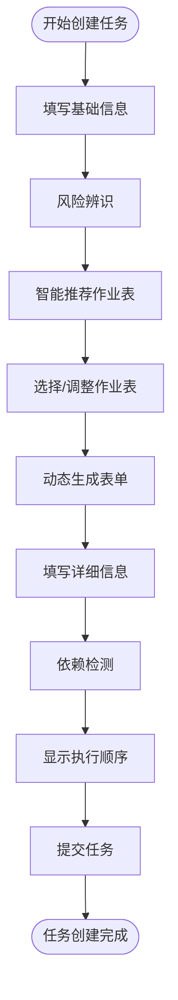
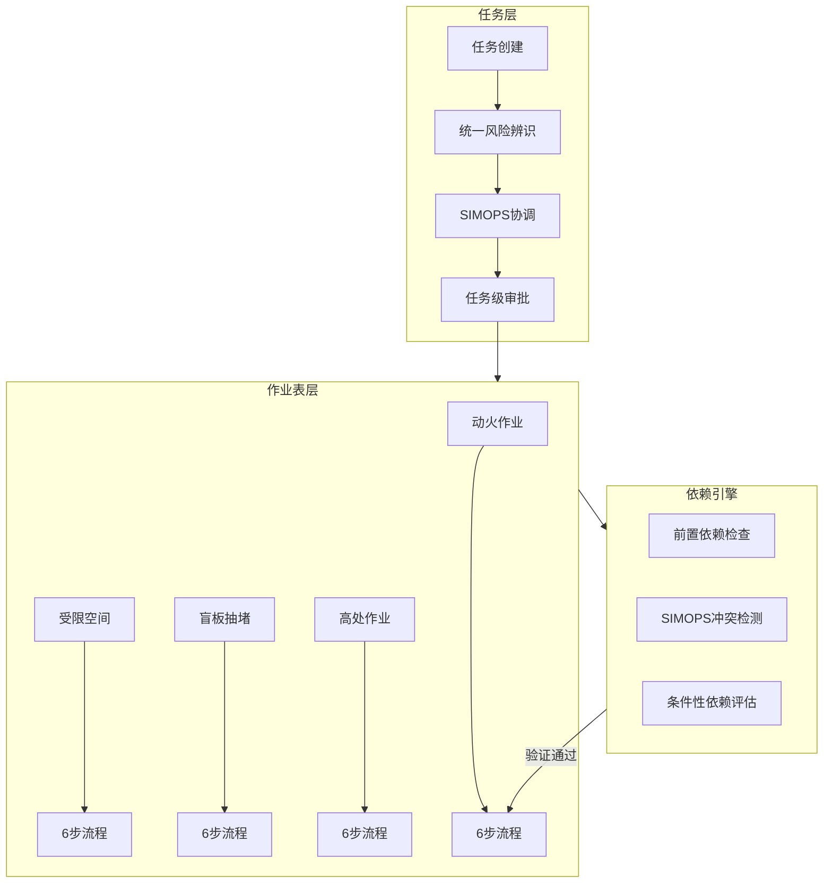

# 新建任务设计方案 - 总览

> **文档版本**: v1.0 | **创建日期**: 2026-03-12
> **适用系统**: 作业票管理系统 | **设计模式**: DOB NOW

---

## 📚 文档导航

本设计方案包含以下文档，建议按顺序阅读：

1. **[产品需求与用户流程](./01-产品需求与用户流程.md)** - 用户故事、完整流程、交互设计
2. **[智能推荐引擎设计](./02-智能推荐引擎设计.md)** - 风险→作业表推荐算法
3. **[动态表单架构设计](./03-动态表单架构设计.md)** - 元数据驱动表单生成
4. **[依赖检测与执行编排](./04-依赖检测与执行编排.md)** - DAG构建、SIMOPS冲突检测
5. **[数据模型与状态机](./05-数据模型与状态机.md)** - 完整数据结构、状态转换
6. **[API接口设计](./06-API接口设计.md)** - RESTful API规范
7. **[前端组件设计](./07-前端组件设计.md)** - Vue组件架构、组件清单
8. **[实施计划与验收标准](./08-实施计划与验收标准.md)** - 开发路线图、测试策略

---

## 🎯 核心设计理念

### DOB NOW 模式

借鉴纽约市建筑局 DOB NOW 系统的设计理念，实现：

- **渐进式填写**：基础信息 → 风险评估 → 作业表选择 → 详细填写
- **智能推荐**：系统根据风险辨识结果主动推荐必需的作业表类型
- **条件性显示**：根据用户选择动态展开相应的表单字段和步骤
- **动态展开**：选择作业表类型后，系统自动生成对应的六步流程表单

### 元数据驱动

采用三层分离架构：

- **Schema 层**：定义字段属性、数据类型、校验规则
- **Layout 层**：定义UI布局、响应式配置、可见性规则
- **Instance 层**：存储实际业务数据

### 依赖自动化

- **前置依赖**：DAG验证、拓扑排序、循环依赖检测
- **SIMOPS冲突**：垂直空间、水平距离、时间间隔自动检测
- **条件性依赖**：气体检测、方案编制、监护人配置自动触发

---

## ⚡ 快速参考

### 核心流程



### 关键数据结构

```typescript
// 任务实体
interface Task {
  taskId: string;
  taskName: string;
  taskType: 'maintenance' | 'construction' | 'emergency';
  location: GeoLocation;
  riskAssessment: RiskAssessment;
  permits: Permit[];
  status: TaskStatus;
}

// 作业表实体
interface Permit {
  permitId: string;
  taskId: string;
  permitType: PermitType;
  permitLevel?: PermitLevel;
  workflow: SixStepWorkflow;
  dependencies: PermitDependencies;
  status: PermitStatus;
}
```

### 核心API

| 端点 | 方法 | 说明 |
|------|------|------|
| `/api/tasks` | POST | 创建任务 |
| `/api/tasks/{id}/recommend-permits` | POST | 获取推荐作业表 |
| `/api/tasks/{id}/detect-dependencies` | POST | 检测依赖关系 |
| `/api/tasks/{id}/execution-order` | GET | 获取执行顺序 |

---

## 🛠️ 技术栈

### 前端技术栈

- **框架**: Vue 3 + TypeScript
- **UI组件库**: Element Plus
- **状态管理**: Pinia
- **路由**: Vue Router
- **表单渲染**: 自研动态表单引擎
- **图表**: Mermaid.js / D3.js
- **地图**: 高德地图 API / Leaflet.js

### 后端技术栈

- **语言**: Node.js / Spring Boot
- **数据库**: PostgreSQL (JSONB支持)
- **缓存**: Redis
- **消息队列**: RabbitMQ (可选)

### 核心算法

- **DAG拓扑排序**: Kahn算法
- **地理围栏**: Haversine公式 + Ray Casting
- **规则引擎**: 自研DSL + 表达式评估器
- **推荐算法**: 规则引擎(70%) + ML模型(30%)

---

## 📊 架构概览

### 任务-作业表双层架构



---

## 🔗 关联文档

本设计方案基于以下现有文档：

- **[作业表依赖引擎详细设计方案](../../分析内容/作业表依赖引擎详细设计方案.md)** - 依赖检测算法
- **[作业表依赖引擎详细设计方案-API与数据库](../../分析内容/作业表依赖引擎详细设计方案-API与数据库.md)** - API和数据库设计
- **[表单设计](../../分析内容/表单设计.md)** - 元数据驱动表单理念
- **[角色体系与权限矩阵](../../demo/PRD章节/02-角色体系与权限矩阵.md)** - 权限控制

---

## 📌 设计原则

1. **用户体验优先**: 渐进式填写，减少认知负担
2. **智能化**: 系统主动推荐，减少人工判断
3. **安全合规**: 强制依赖检查，防止违规操作
4. **可扩展性**: 元数据驱动，支持灵活配置
5. **可追溯性**: 完整记录决策过程和依赖关系

---

## 🎯 预期成果

完成本设计方案后，将实现：

- ✅ 智能推荐作业表，准确率 > 90%
- ✅ 自动检测依赖冲突，覆盖率 100%
- ✅ 动态表单生成，支持8大作业类型
- ✅ 执行顺序自动编排，避免循环依赖
- ✅ 响应式布局，支持桌面端和移动端

---

**下一步**: 请阅读 [产品需求与用户流程](./01-产品需求与用户流程.md) 了解详细的用户故事和交互设计。
