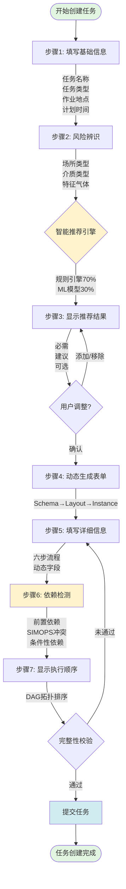
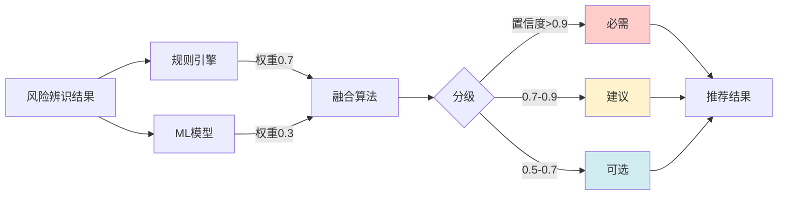

# 产品需求与用户流程

> **文档版本**: v1.0 | **创建日期**: 2026-03-12
> **适用系统**: 作业票管理系统 | **设计模式**: DOB NOW
> **关联文档**: [总览](./00-总览.md) | [智能推荐引擎](./02-智能推荐引擎设计.md)

---

## 📋 用户故事

### US-1: 作业负责人创建任务

**作为** 作业负责人
**我想要** 通过系统创建一个新的作业任务
**以便** 系统能够智能推荐所需的作业表类型，并自动检测依赖关系，确保作业安全合规

**验收标准**：
- ✅ 能够填写任务基础信息（任务名称、类型、地点、时间）
- ✅ 能够进行风险辨识（选择作业场所类型、介质类型、特征气体）
- ✅ 系统自动推荐必需的作业表类型（准确率 > 90%）
- ✅ 能够调整推荐结果（添加/移除作业表）
- ✅ 选择作业表后自动生成对应的六步流程表单
- ✅ 系统自动检测作业表之间的依赖关系和冲突
- ✅ 显示推荐的执行顺序
- ✅ 所有操作在 3 秒内响应（P95）

### US-2: 安全员审查任务

**作为** 安全员
**我想要** 审查作业负责人创建的任务
**以便** 确保所有必需的作业表都已包含，且依赖关系正确

**验收标准**：
- ✅ 能够查看任务的完整信息和风险评估结果
- ✅ 能够查看系统推荐的作业表及推荐理由
- ✅ 能够查看依赖关系图和执行顺序
- ✅ 能够要求补充缺失的作业表
- ✅ 能够批准或驳回任务

---

## 🔄 完整用户流程

### 主流程图



### 子流程：智能推荐



---

## 🎨 关键交互设计

### 1. 基础信息填写界面

**布局**：响应式表单（桌面端 2 列，移动端 1 列）

**字段清单**：

| 字段名称 | 类型 | 必填 | 校验规则 | 说明 |
|---------|------|------|---------|------|
| 任务名称 | 文本 | ✅ | 长度 5-100 字符 | 简明描述任务内容 |
| 任务类型 | 单选 | ✅ | maintenance/construction/emergency | 维护/施工/应急 |
| 作业地点 | 地图选点 | ✅ | 经纬度坐标 | 支持地图选点或手动输入 |
| 计划开始时间 | 日期时间 | ✅ | 不早于当前时间 | - |
| 计划结束时间 | 日期时间 | ✅ | 晚于开始时间 | - |
| 任务描述 | 多行文本 | ❌ | 最多 500 字符 | 详细说明 |

**交互要点**：
- 地图选点支持搜索地址和手动标记
- 时间选择器自动过滤过去时间
- 表单实时校验，错误提示在字段下方显示

### 2. 风险辨识界面

**布局**：卡片式分组

**风险因素分类**：

```typescript
interface RiskAssessment {
  // 场所类型（多选）
  locationTypes: Array<
    '密闭空间' | '有限空间' | '高处' | '地下' | '水上' | '受限区域'
  >;

  // 介质类型（多选）
  mediumTypes: Array<
    '可燃' | '有毒' | '窒息性' | '腐蚀性' | '高温' | '低温' | '高压'
  >;

  // 特征气体（条件性显示，当介质类型包含"可燃"或"有毒"时）
  characteristicGases?: Array<
    'H2' | 'CH4' | 'CO' | 'H2S' | 'NH3' | 'Cl2' | 'SO2'
  >;

  // 其他风险因素
  otherRisks?: string[];
}
```

**条件性显示规则**：
- 选择"密闭空间"或"有限空间" → 自动勾选"受限空间作业"推荐
- 选择"可燃"或"有毒"介质 → 显示"特征气体"选择器
- 选择"高处" → 自动勾选"高处作业"推荐

### 3. 推荐结果展示界面

**布局**：三列卡片（必需 | 建议 | 可选）

**卡片内容**：

```typescript
interface RecommendationCard {
  permitType: PermitType;
  permitName: string;
  category: 'mandatory' | 'recommended' | 'optional';
  confidence: number; // 0-1
  reasons: string[]; // 推荐理由
  icon: string;
  selected: boolean;
}
```

**交互要点**：
- 必需类型默认选中且不可取消
- 建议类型默认选中但可取消
- 可选类型默认不选中
- 点击卡片显示详细推荐理由
- 支持拖拽调整顺序（影响后续执行顺序）

**示例推荐理由**：
- "检测到作业场所为'密闭空间'，根据 GB 30871-2022 要求，必须办理受限空间作业票"
- "检测到介质类型为'可燃'，建议办理动火作业票"
- "检测到作业高度 > 2m，建议办理高处作业票"

### 4. 动态表单填写界面

**布局**：分步表单（六步流程）

**步骤导航**：


**动态字段示例（动火作业）**：

| 步骤 | 字段 | 类型 | 条件性显示 |
|-----|------|------|-----------|
| 1.申请 | 动火级别 | 单选 | - |
| 1.申请 | 动火方式 | 单选 | - |
| 2.措施 | 灭火器配置 | 复选框 | - |
| 2.措施 | 防火毯 | 复选框 | - |
| 3.分析 | 气体检测结果 | 数字输入 | 动火级别=特级或一级 |
| 3.分析 | 检测照片 | 图片上传 | 动火级别=特级或一级 |
| 4.检查 | 现场核查清单 | 复选框组 | - |
| 5.审批 | 审批人签名 | 电子签名 | - |
| 6.完工 | 完工照片 | 图片上传 | - |

**交互要点**：
- 步骤间自动保存草稿
- 未完成必填项时，下一步按钮置灰
- 支持跳转到任意已完成步骤修改
- 条件性字段根据前置字段值动态显示/隐藏

### 5. 依赖关系可视化界面

**布局**：图形化展示 + 列表详情

**依赖关系图**：

```mermaid
graph TD
    subgraph 任务：反应釜检修
        P1[盲板抽堵<br/>✅ 已完成]
        P2[受限空间<br/>⏳ 进行中]
        P3[临时用电<br/>⏸️ 待审批]
        P4[动火作业<br/>⏸️ 待审批]
    end

    P1 -->|前置依赖| P2
    P1 -->|前置依赖| P4
    P2 -->|前置依赖| P3
    P2 -.->|SIMOPS冲突<br/>距离15米| P4

    style P1 fill:#90EE90
    style P2 fill:#FFD700
    style P3 fill:#D3D3D3
    style P4 fill:#D3D3D3
```

**执行顺序列表**：

| 顺序 | 作业表类型 | 状态 | 依赖关系 | 预计开始时间 |
|-----|-----------|------|---------|------------|
| 1 | 盲板抽堵 | ✅ 已完成 | 无 | 2026-03-12 08:00 |
| 2 | 受限空间 | ⏳ 进行中 | 依赖：盲板抽堵 | 2026-03-12 10:00 |
| 3 | 临时用电 | ⏸️ 待审批 | 依赖：受限空间 | 2026-03-12 14:00 |
| 4 | 动火作业 | ⚠️ 冲突警告 | 依赖：盲板抽堵<br/>冲突：受限空间（15米） | 待定 |

**冲突警告提示**：
- 🔴 禁止性冲突：红色高亮，必须解决才能提交
- 🟡 警告性冲突：黄色提示，建议调整但可继续

---

## 📊 非功能需求

### 性能要求

| 指标 | 目标值 | 测量方式 |
|-----|--------|---------|
| 页面加载时间 | < 2s | P95 |
| 推荐引擎响应时间 | < 1s | P95 |
| 依赖检测响应时间 | < 1.5s | P95 |
| 表单提交响应时间 | < 3s | P95 |
| 并发用户数 | ≥ 100 | 压力测试 |

### 可用性要求

- **响应式设计**：支持桌面端（≥1280px）和移动端（≥375px）
- **浏览器兼容**：Chrome 90+, Safari 14+, Edge 90+
- **离线能力**：支持草稿本地缓存，网络恢复后自动同步
- **无障碍**：符合 WCAG 2.1 AA 级标准
- **多语言**：支持中文、英文（可扩展）

### 安全要求

- **权限控制**：基于角色的访问控制（RBAC）
- **数据加密**：传输层 TLS 1.3，敏感字段数据库加密
- **审计日志**：记录所有创建、修改、删除操作
- **输入校验**：前后端双重校验，防止 XSS 和 SQL 注入
- **会话管理**：30 分钟无操作自动登出

### 可维护性要求

- **代码覆盖率**：≥ 85%
- **文档完整性**：所有 API 和组件必须有文档
- **日志规范**：统一日志格式，支持链路追踪
- **监控告警**：关键指标实时监控，异常自动告警

---

## 🔗 相关文档

- **上一篇**：[总览](./00-总览.md)
- **下一篇**：[智能推荐引擎设计](./02-智能推荐引擎设计.md)
- **参考**：[作业表依赖引擎详细设计方案](../../分析内容/作业表依赖引擎详细设计方案.md)
