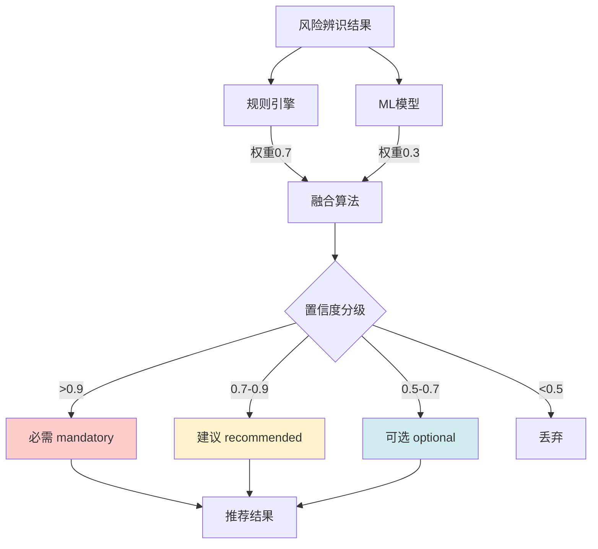
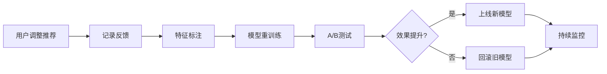

# 智能推荐引擎设计

> **文档版本**: v1.0 | **创建日期**: 2026-03-12
> **适用系统**: 作业票管理系统 | **设计模式**: DOB NOW
> **关联文档**: [总览](./00-总览.md) | [产品需求与用户流程](./01-产品需求与用户流程.md) | [动态表单架构设计](./03-动态表单架构设计.md)

---

## 📋 设计目标

智能推荐引擎的核心目标是：根据用户填写的**风险辨识结果**，自动推荐所需的**作业表类型**，并给出推荐理由和置信度评分。

**关键指标**：
- 推荐准确率 > 90%（必需类型不遗漏）
- 推荐响应时间 < 1s（P95）
- 误报率 < 15%（可选类型不过度推荐）

---

## 🏗️ 推荐算法架构

### 整体架构



### 双引擎设计理念

**规则引擎（权重 0.7）**：
- 基于 GB 30871-2022 等国家标准
- 确定性强，可解释性高
- 适合处理明确的强制性要求

**机器学习模型（权重 0.3）**：
- 基于历史数据学习隐含模式
- 适合处理复杂的边界情况
- 持续优化，适应业务变化

---

## 📐 规则引擎设计

### 规则定义 DSL

```typescript
// ========== 规则定义接口 ==========
interface RecommendationRule {
  ruleId: string;
  ruleName: string;
  permitType: PermitType;
  priority: number; // 1-10，数字越大优先级越高

  // 触发条件
  conditions: RuleCondition[];

  // 推荐结果
  recommendation: {
    category: 'mandatory' | 'recommended' | 'optional';
    confidence: number; // 0-1
    reason: string;
  };

  // 规则元数据
  metadata: {
    source: string; // 如："GB 30871-2022 第5.1条"
    version: string;
    lastUpdated: Date;
  };
}

// ========== 条件定义 ==========
interface RuleCondition {
  field: string; // 如："locationTypes", "mediumTypes"
  operator: 'contains' | 'equals' | 'in' | 'and' | 'or' | 'not';
  value: any;
  weight?: number; // 条件权重（可选）
}

// ========== 示例规则 ==========
const RULE_CONFINED_SPACE: RecommendationRule = {
  ruleId: 'R001',
  ruleName: '受限空间作业强制要求',
  permitType: PermitType.CONFINED_SPACE,
  priority: 10,

  conditions: [
    {
      field: 'locationTypes',
      operator: 'contains',
      value: ['密闭空间', '有限空间']
    }
  ],

  recommendation: {
    category: 'mandatory',
    confidence: 1.0,
    reason: '检测到作业场所为"密闭空间"或"有限空间"，根据 GB 30871-2022 要求，必须办理受限空间作业票'
  },

  metadata: {
    source: 'GB 30871-2022 第5.1条',
    version: '1.0',
    lastUpdated: new Date('2025-01-01')
  }
};

const RULE_HOT_WORK: RecommendationRule = {
  ruleId: 'R002',
  ruleName: '动火作业推荐',
  permitType: PermitType.HOT_WORK,
  priority: 8,

  conditions: [
    {
      field: 'mediumTypes',
      operator: 'contains',
      value: ['可燃']
    }
  ],

  recommendation: {
    category: 'recommended',
    confidence: 0.85,
    reason: '检测到介质类型为"可燃"，建议办理动火作业票'
  },

  metadata: {
    source: 'GB 30871-2022 第5.2条',
    version: '1.0',
    lastUpdated: new Date('2025-01-01')
  }
};
```

### 规则执行引擎

```typescript
class RuleEngine {
  private rules: Map<PermitType, RecommendationRule[]> = new Map();

  constructor() {
    this.loadRules();
  }

  /**
   * 加载所有规则
   */
  private loadRules(): void {
    // 按作业表类型分组存储规则
    const allRules = [
      RULE_CONFINED_SPACE,
      RULE_HOT_WORK,
      // ... 其他规则
    ];

    for (const rule of allRules) {
      if (!this.rules.has(rule.permitType)) {
        this.rules.set(rule.permitType, []);
      }
      this.rules.get(rule.permitType)!.push(rule);
    }

    // 按优先级排序
    for (const [_, ruleList] of this.rules) {
      ruleList.sort((a, b) => b.priority - a.priority);
    }
  }

  /**
   * 评估风险辨识结果，返回推荐列表
   */
  evaluate(riskAssessment: RiskAssessment): RuleEngineResult[] {
    const results: RuleEngineResult[] = [];

    for (const [permitType, ruleList] of this.rules) {
      for (const rule of ruleList) {
        if (this.matchConditions(rule.conditions, riskAssessment)) {
          results.push({
            permitType,
            category: rule.recommendation.category,
            confidence: rule.recommendation.confidence,
            reason: rule.recommendation.reason,
            source: 'rule_engine',
            ruleId: rule.ruleId
          });
          break; // 每种作业表类型只匹配最高优先级的规则
        }
      }
    }

    return results;
  }

  /**
   * 匹配条件
   */
  private matchConditions(
    conditions: RuleCondition[],
    riskAssessment: RiskAssessment
  ): boolean {
    for (const condition of conditions) {
      if (!this.matchCondition(condition, riskAssessment)) {
        return false;
      }
    }
    return true;
  }

  /**
   * 匹配单个条件
   */
  private matchCondition(
    condition: RuleCondition,
    riskAssessment: RiskAssessment
  ): boolean {
    const fieldValue = (riskAssessment as any)[condition.field];

    switch (condition.operator) {
      case 'contains':
        if (!Array.isArray(fieldValue)) return false;
        return condition.value.some((v: any) => fieldValue.includes(v));

      case 'equals':
        return fieldValue === condition.value;

      case 'in':
        return condition.value.includes(fieldValue);

      default:
        return false;
    }
  }
}

interface RuleEngineResult {
  permitType: PermitType;
  category: 'mandatory' | 'recommended' | 'optional';
  confidence: number;
  reason: string;
  source: 'rule_engine';
  ruleId: string;
}
```

---

## 🤖 机器学习模型设计

### 特征工程

```typescript
interface FeatureVector {
  // 场所类型特征（One-Hot编码）
  location_confined: number;      // 密闭空间
  location_limited: number;       // 有限空间
  location_height: number;        // 高处
  location_underground: number;   // 地下
  location_water: number;         // 水上
  location_restricted: number;    // 受限区域

  // 介质类型特征（One-Hot编码）
  medium_flammable: number;       // 可燃
  medium_toxic: number;           // 有毒
  medium_asphyxiant: number;      // 窒息性
  medium_corrosive: number;       // 腐蚀性
  medium_high_temp: number;       // 高温
  medium_low_temp: number;        // 低温
  medium_high_pressure: number;   // 高压

  // 特征气体特征（Multi-Hot编码）
  gas_h2: number;
  gas_ch4: number;
  gas_co: number;
  gas_h2s: number;
  gas_nh3: number;
  gas_cl2: number;
  gas_so2: number;

  // 任务类型特征
  task_type_maintenance: number;
  task_type_construction: number;
  task_type_emergency: number;

  // 组合特征（特征交叉）
  confined_and_flammable: number;
  height_and_lifting: number;
  underground_and_excavation: number;
}

class FeatureExtractor {
  /**
   * 从风险辨识结果提取特征向量
   */
  static extract(
    riskAssessment: RiskAssessment,
    taskType: string
  ): FeatureVector {
    const features: FeatureVector = {
      // 场所类型
      location_confined: riskAssessment.locationTypes?.includes('密闭空间') ? 1 : 0,
      location_limited: riskAssessment.locationTypes?.includes('有限空间') ? 1 : 0,
      location_height: riskAssessment.locationTypes?.includes('高处') ? 1 : 0,
      location_underground: riskAssessment.locationTypes?.includes('地下') ? 1 : 0,
      location_water: riskAssessment.locationTypes?.includes('水上') ? 1 : 0,
      location_restricted: riskAssessment.locationTypes?.includes('受限区域') ? 1 : 0,

      // 介质类型
      medium_flammable: riskAssessment.mediumTypes?.includes('可燃') ? 1 : 0,
      medium_toxic: riskAssessment.mediumTypes?.includes('有毒') ? 1 : 0,
      medium_asphyxiant: riskAssessment.mediumTypes?.includes('窒息性') ? 1 : 0,
      medium_corrosive: riskAssessment.mediumTypes?.includes('腐蚀性') ? 1 : 0,
      medium_high_temp: riskAssessment.mediumTypes?.includes('高温') ? 1 : 0,
      medium_low_temp: riskAssessment.mediumTypes?.includes('低温') ? 1 : 0,
      medium_high_pressure: riskAssessment.mediumTypes?.includes('高压') ? 1 : 0,

      // 特征气体
      gas_h2: riskAssessment.characteristicGases?.includes('H2') ? 1 : 0,
      gas_ch4: riskAssessment.characteristicGases?.includes('CH4') ? 1 : 0,
      gas_co: riskAssessment.characteristicGases?.includes('CO') ? 1 : 0,
      gas_h2s: riskAssessment.characteristicGases?.includes('H2S') ? 1 : 0,
      gas_nh3: riskAssessment.characteristicGases?.includes('NH3') ? 1 : 0,
      gas_cl2: riskAssessment.characteristicGases?.includes('Cl2') ? 1 : 0,
      gas_so2: riskAssessment.characteristicGases?.includes('SO2') ? 1 : 0,

      // 任务类型
      task_type_maintenance: taskType === 'maintenance' ? 1 : 0,
      task_type_construction: taskType === 'construction' ? 1 : 0,
      task_type_emergency: taskType === 'emergency' ? 1 : 0,

      // 组合特征
      confined_and_flammable: 0,
      height_and_lifting: 0,
      underground_and_excavation: 0
    };

    // 计算组合特征
    features.confined_and_flammable =
      features.location_confined * features.medium_flammable;
    features.height_and_lifting =
      features.location_height; // 需要结合其他信息判断是否需要吊装
    features.underground_and_excavation =
      features.location_underground;

    return features;
  }
}
```

### 模型架构

```typescript
/**
 * 多标签分类模型（Multi-Label Classification）
 * 输入：特征向量（30维）
 * 输出：8种作业表类型的概率分布
 */
interface MLModelConfig {
  inputDim: number;      // 30（特征维度）
  hiddenLayers: number[]; // [64, 32]（隐藏层神经元数量）
  outputDim: number;     // 8（作业表类型数量）
  activation: string;    // 'relu'
  outputActivation: string; // 'sigmoid'（多标签分类）
  learningRate: number;  // 0.001
  batchSize: number;     // 32
  epochs: number;        // 100
}

class MLRecommendationModel {
  private model: any; // TensorFlow.js 或 ONNX Runtime
  private config: MLModelConfig;

  constructor(config: MLModelConfig) {
    this.config = config;
    this.initializeModel();
  }

  /**
   * 初始化模型（伪代码，实际需要使用 TensorFlow.js）
   */
  private initializeModel(): void {
    // 模型结构：
    // Input(30) -> Dense(64, relu) -> Dropout(0.3)
    // -> Dense(32, relu) -> Dropout(0.2)
    // -> Dense(8, sigmoid)
  }

  /**
   * 预测作业表类型概率
   */
  async predict(features: FeatureVector): Promise<MLModelResult[]> {
    // 将特征向量转换为数组
    const inputArray = this.featureVectorToArray(features);

    // 模型推理（伪代码）
    const predictions = await this.model.predict(inputArray);

    // 将预测结果转换为推荐列表
    const results: MLModelResult[] = [];
    const permitTypes = Object.values(PermitType);

    for (let i = 0; i < predictions.length; i++) {
      if (predictions[i] > 0.5) { // 阈值过滤
        results.push({
          permitType: permitTypes[i],
          confidence: predictions[i],
          source: 'ml_model'
        });
      }
    }

    return results;
  }

  private featureVectorToArray(features: FeatureVector): number[] {
    return Object.values(features);
  }
}

interface MLModelResult {
  permitType: PermitType;
  confidence: number;
  source: 'ml_model';
}
```

---

## 🔀 融合算法

```typescript
class RecommendationFusion {
  private static readonly RULE_WEIGHT = 0.7;
  private static readonly ML_WEIGHT = 0.3;

  /**
   * 融合规则引擎和ML模型的推荐结果
   */
  static fuse(
    ruleResults: RuleEngineResult[],
    mlResults: MLModelResult[]
  ): FusedRecommendation[] {
    const fusedMap = new Map<PermitType, FusedRecommendation>();

    // 1. 处理规则引擎结果
    for (const result of ruleResults) {
      fusedMap.set(result.permitType, {
        permitType: result.permitType,
        category: result.category,
        confidence: result.confidence * this.RULE_WEIGHT,
        reasons: [result.reason],
        sources: ['rule_engine'],
        ruleId: result.ruleId
      });
    }

    // 2. 融合ML模型结果
    for (const result of mlResults) {
      if (fusedMap.has(result.permitType)) {
        // 已有规则引擎推荐，加权融合
        const existing = fusedMap.get(result.permitType)!;
        existing.confidence += result.confidence * this.ML_WEIGHT;
        existing.sources.push('ml_model');
      } else {
        // 仅ML模型推荐
        fusedMap.set(result.permitType, {
          permitType: result.permitType,
          category: this.classifyByConfidence(result.confidence * this.ML_WEIGHT),
          confidence: result.confidence * this.ML_WEIGHT,
          reasons: ['基于历史数据分析，建议办理此作业票'],
          sources: ['ml_model']
        });
      }
    }

    // 3. 重新分类（基于融合后的置信度）
    const results = Array.from(fusedMap.values());
    for (const result of results) {
      result.category = this.classifyByConfidence(result.confidence);
    }

    // 4. 按置信度排序
    results.sort((a, b) => b.confidence - a.confidence);

    return results;
  }

  /**
   * 根据置信度分类
   */
  private static classifyByConfidence(
    confidence: number
  ): 'mandatory' | 'recommended' | 'optional' {
    if (confidence > 0.9) return 'mandatory';
    if (confidence > 0.7) return 'recommended';
    return 'optional';
  }
}

interface FusedRecommendation {
  permitType: PermitType;
  category: 'mandatory' | 'recommended' | 'optional';
  confidence: number;
  reasons: string[];
  sources: Array<'rule_engine' | 'ml_model'>;
  ruleId?: string;
}
```

---

## 🎯 推荐结果分级标准

| 分级 | 置信度范围 | 说明 | 用户交互 |
|-----|-----------|------|---------|
| **必需（mandatory）** | > 0.9 | 强制性要求，不可取消 | 默认选中，不可取消勾选 |
| **建议（recommended）** | 0.7 - 0.9 | 强烈建议，可取消 | 默认选中，可取消勾选 |
| **可选（optional）** | 0.5 - 0.7 | 可选项，供参考 | 默认不选中，可手动勾选 |
| **丢弃** | < 0.5 | 不推荐 | 不显示 |

---

## 🔄 持续优化机制

### 反馈循环



### 关键指标

```typescript
interface RecommendationMetrics {
  // 准确率指标
  precision: number;        // 精确率（推荐的作业表中，实际需要的比例）
  recall: number;           // 召回率（实际需要的作业表中，被推荐的比例）
  f1Score: number;          // F1分数（精确率和召回率的调和平均）

  // 用户行为指标
  acceptanceRate: number;   // 接受率（用户接受推荐的比例）
  adjustmentRate: number;   // 调整率（用户调整推荐的比例）

  // 性能指标
  avgResponseTime: number;  // 平均响应时间（毫秒）
  p95ResponseTime: number;  // P95响应时间（毫秒）

  // 业务指标
  mandatoryMissRate: number; // 必需类型遗漏率（最关键指标）
  falsePositiveRate: number; // 误报率（可选类型过度推荐）
}
```

---

## 🔗 相关文档

- **上一篇**：[产品需求与用户流程](./01-产品需求与用户流程.md)
- **下一篇**：[动态表单架构设计](./03-动态表单架构设计.md)
- **参考**：[作业表依赖引擎详细设计方案](../../分析内容/作业表依赖引擎详细设计方案.md)
