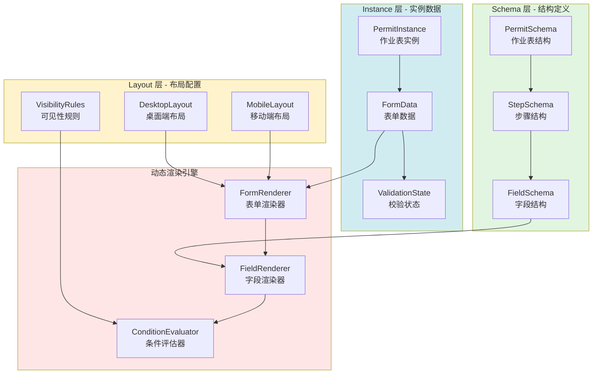

# 动态表单架构设计

> **文档版本**: v1.0 | **创建日期**: 2026-03-12
> **适用系统**: 作业票管理系统 | **设计模式**: 元数据驱动
> **关联文档**: [总览](./00-总览.md) | [智能推荐引擎设计](./02-智能推荐引擎设计.md) | [依赖检测与执行编排](./04-依赖检测与执行编排.md)

---

## 📋 设计目标

动态表单架构的核心目标是：基于**元数据驱动**的理念，实现**一套代码适配8种作业表类型**，支持**条件性显示**和**响应式布局**。

**关键特性**：
- 元数据与渲染逻辑分离
- 支持条件性字段显示/隐藏
- 桌面端和移动端自适应
- 自定义业务组件可插拔
- 表单状态统一管理

---

## 🏗️ 三层架构设计

### 架构总览



### 三层职责

| 层级 | 职责 | 存储位置 | 示例 |
|-----|------|---------|------|
| **Schema 层** | 定义字段属性、数据类型、校验规则 | 配置文件/数据库 | `hot_work_schema.json` |
| **Layout 层** | 定义UI布局、响应式配置、可见性规则 | 配置文件/数据库 | `hot_work_layout.json` |
| **Instance 层** | 存储实际业务数据 | 数据库 | `permit_instance` 表 |

---

## 📐 Schema 层设计

### PermitSchema（作业表结构）

```typescript
interface PermitSchema {
  permitType: PermitType;
  permitName: string;
  version: string;

  // 六步流程定义
  steps: StepSchema[];

  // 全局校验规则
  globalValidations?: ValidationRule[];

  // 元数据
  metadata: {
    createdAt: Date;
    updatedAt: Date;
    author: string;
    description: string;
  };
}

// ========== 示例：动火作业 Schema ==========
const HOT_WORK_SCHEMA: PermitSchema = {
  permitType: PermitType.HOT_WORK,
  permitName: '动火作业票',
  version: '1.0',

  steps: [
    {
      stepId: 'step1_application',
      stepName: '1. 申请',
      stepOrder: 1,
      fields: [
        {
          fieldId: 'hotWorkLevel',
          fieldName: '动火级别',
          fieldType: 'radio',
          required: true,
          options: [
            { label: '特级', value: 'special' },
            { label: '一级', value: 'level1' },
            { label: '二级', value: 'level2' }
          ]
        },
        {
          fieldId: 'hotWorkMethod',
          fieldName: '动火方式',
          fieldType: 'radio',
          required: true,
          options: [
            { label: '电焊', value: 'electric_welding' },
            { label: '气焊', value: 'gas_welding' },
            { label: '切割', value: 'cutting' }
          ]
        }
      ]
    },
    {
      stepId: 'step2_measures',
      stepName: '2. 措施',
      stepOrder: 2,
      fields: [
        {
          fieldId: 'fireExtinguisher',
          fieldName: '灭火器配置',
          fieldType: 'checkbox',
          required: true,
          options: [
            { label: '干粉灭火器', value: 'dry_powder' },
            { label: 'CO2灭火器', value: 'co2' }
          ]
        }
      ]
    },
    {
      stepId: 'step3_analysis',
      stepName: '3. 分析',
      stepOrder: 3,
      fields: [
        {
          fieldId: 'gasDetectionResult',
          fieldName: '气体检测结果',
          fieldType: 'gas_detection', // 自定义组件
          required: true,
          // 条件性显示：仅当动火级别为特级或一级时显示
          visibilityCondition: {
            field: 'hotWorkLevel',
            operator: 'in',
            value: ['special', 'level1']
          }
        }
      ]
    }
    // ... 其他步骤
  ],

  metadata: {
    createdAt: new Date('2025-01-01'),
    updatedAt: new Date('2025-01-01'),
    author: 'System',
    description: '动火作业票元数据定义'
  }
};
```

### StepSchema（步骤结构）

```typescript
interface StepSchema {
  stepId: string;
  stepName: string;
  stepOrder: number;
  description?: string;

  // 步骤内的字段列表
  fields: FieldSchema[];

  // 步骤级别的可见性条件
  visibilityCondition?: VisibilityCondition;

  // 步骤完成条件
  completionCondition?: CompletionCondition;
}
```

### FieldSchema（字段结构）

```typescript
interface FieldSchema {
  fieldId: string;
  fieldName: string;
  fieldType: FieldType;
  required: boolean;

  // 字段属性
  placeholder?: string;
  defaultValue?: any;
  helpText?: string;

  // 选项（用于 radio、checkbox、select）
  options?: Array<{
    label: string;
    value: any;
    disabled?: boolean;
  }>;

  // 校验规则
  validations?: ValidationRule[];

  // 可见性条件
  visibilityCondition?: VisibilityCondition;

  // 自定义组件配置
  componentConfig?: Record<string, any>;
}

// ========== 字段类型 ==========
type FieldType =
  | 'text'
  | 'textarea'
  | 'number'
  | 'date'
  | 'datetime'
  | 'radio'
  | 'checkbox'
  | 'select'
  | 'file'
  | 'signature'           // 电子签名
  | 'gas_detection'       // 气体检测
  | 'photo_upload'        // 照片上传
  | 'location_picker';    // 地点选择

// ========== 校验规则 ==========
interface ValidationRule {
  type: 'required' | 'min' | 'max' | 'pattern' | 'custom';
  value?: any;
  message: string;
  validator?: (value: any, formData: any) => boolean;
}

// ========== 可见性条件 ==========
interface VisibilityCondition {
  field: string;
  operator: 'equals' | 'in' | 'not_equals' | 'greater_than' | 'less_than';
  value: any;
}
```

---

## 🎨 Layout 层设计

### 桌面端布局配置

```typescript
interface DesktopLayout {
  permitType: PermitType;
  layoutType: 'desktop';

  // 全局布局配置
  global: {
    columns: number;        // 列数（默认2列）
    gap: string;            // 间距（如 '16px'）
    maxWidth: string;       // 最大宽度（如 '1200px'）
  };

  // 步骤布局配置
  steps: Array<{
    stepId: string;
    layout: 'grid' | 'flex' | 'custom';
    columns?: number;       // 覆盖全局列数
    fields: Array<{
      fieldId: string;
      span?: number;        // 跨列数（1-columns）
      order?: number;       // 显示顺序
    }>;
  }>;
}

// ========== 示例：动火作业桌面端布局 ==========
const HOT_WORK_DESKTOP_LAYOUT: DesktopLayout = {
  permitType: PermitType.HOT_WORK,
  layoutType: 'desktop',

  global: {
    columns: 2,
    gap: '16px',
    maxWidth: '1200px'
  },

  steps: [
    {
      stepId: 'step1_application',
      layout: 'grid',
      columns: 2,
      fields: [
        { fieldId: 'hotWorkLevel', span: 1, order: 1 },
        { fieldId: 'hotWorkMethod', span: 1, order: 2 }
      ]
    },
    {
      stepId: 'step3_analysis',
      layout: 'grid',
      columns: 1, // 气体检测组件占满整行
      fields: [
        { fieldId: 'gasDetectionResult', span: 1, order: 1 }
      ]
    }
  ]
};
```

### 移动端布局配置

```typescript
interface MobileLayout {
  permitType: PermitType;
  layoutType: 'mobile';

  // 全局布局配置
  global: {
    columns: number;        // 固定为1列
    gap: string;
    padding: string;
  };

  // 步骤布局配置
  steps: Array<{
    stepId: string;
    fields: Array<{
      fieldId: string;
      order?: number;
    }>;
  }>;
}
```

---

## ⚙️ 动态渲染引擎

### FormRenderer 组件

```vue
<template>
  <div class="form-renderer" :class="{ 'is-mobile': isMobile }">
    <!-- 步骤导航 -->
    <div class="step-navigation">
      <div
        v-for="step in schema.steps"
        :key="step.stepId"
        class="step-item"
        :class="{
          'is-active': currentStepId === step.stepId,
          'is-completed': isStepCompleted(step.stepId)
        }"
        @click="goToStep(step.stepId)"
      >
        {{ step.stepName }}
      </div>
    </div>

    <!-- 当前步骤表单 -->
    <div class="step-content">
      <h3>{{ currentStep.stepName }}</h3>
      <p v-if="currentStep.description" class="step-description">
        {{ currentStep.description }}
      </p>

      <!-- 动态字段渲染 -->
      <div
        class="form-grid"
        :style="getGridStyle()"
      >
        <FieldRenderer
          v-for="field in visibleFields"
          :key="field.fieldId"
          :field="field"
          :value="formData[field.fieldId]"
          :layout="getFieldLayout(field.fieldId)"
          @update:value="updateFieldValue(field.fieldId, $event)"
        />
      </div>

      <!-- 步骤操作按钮 -->
      <div class="step-actions">
        <button
          v-if="!isFirstStep"
          @click="previousStep"
          class="btn-secondary"
        >
          上一步
        </button>
        <button
          v-if="!isLastStep"
          @click="nextStep"
          :disabled="!isCurrentStepValid"
          class="btn-primary"
        >
          下一步
        </button>
        <button
          v-if="isLastStep"
          @click="submitForm"
          :disabled="!isFormValid"
          class="btn-primary"
        >
          提交
        </button>
      </div>
    </div>
  </div>
</template>

<script setup lang="ts">
import { ref, computed } from 'vue';
import { useFormRenderer } from './useFormRenderer';
import FieldRenderer from './FieldRenderer.vue';

const props = defineProps<{
  schema: PermitSchema;
  layout: DesktopLayout | MobileLayout;
  initialData?: Record<string, any>;
}>();

const emit = defineEmits<{
  submit: [data: Record<string, any>];
  stepChange: [stepId: string];
}>();

// 使用 Hook 管理表单状态
const {
  currentStepId,
  currentStep,
  formData,
  visibleFields,
  isCurrentStepValid,
  isFormValid,
  updateFieldValue,
  goToStep,
  nextStep,
  previousStep,
  isStepCompleted
} = useFormRenderer(props.schema, props.layout, props.initialData);

const isMobile = computed(() => props.layout.layoutType === 'mobile');
const isFirstStep = computed(() => currentStep.value.stepOrder === 1);
const isLastStep = computed(() =>
  currentStep.value.stepOrder === props.schema.steps.length
);

function getGridStyle() {
  const stepLayout = props.layout.steps.find(
    s => s.stepId === currentStepId.value
  );
  const columns = stepLayout?.columns || props.layout.global.columns;
  return {
    gridTemplateColumns: `repeat(${columns}, 1fr)`,
    gap: props.layout.global.gap
  };
}

function getFieldLayout(fieldId: string) {
  const stepLayout = props.layout.steps.find(
    s => s.stepId === currentStepId.value
  );
  return stepLayout?.fields.find(f => f.fieldId === fieldId);
}

function submitForm() {
  if (isFormValid.value) {
    emit('submit', formData.value);
  }
}
</script>
```

### useFormRenderer Hook

```typescript
import { ref, computed, watch } from 'vue';
import { ConditionEvaluator } from './ConditionEvaluator';

export function useFormRenderer(
  schema: PermitSchema,
  layout: DesktopLayout | MobileLayout,
  initialData?: Record<string, any>
) {
  // 当前步骤
  const currentStepId = ref(schema.steps[0].stepId);

  // 表单数据
  const formData = ref<Record<string, any>>(initialData || {});

  // 已完成的步骤
  const completedSteps = ref<Set<string>>(new Set());

  // 当前步骤对象
  const currentStep = computed(() =>
    schema.steps.find(s => s.stepId === currentStepId.value)!
  );

  // 当前步骤的可见字段
  const visibleFields = computed(() => {
    return currentStep.value.fields.filter(field => {
      if (!field.visibilityCondition) return true;
      return ConditionEvaluator.evaluate(
        field.visibilityCondition,
        formData.value
      );
    });
  });

  // 当前步骤是否有效
  const isCurrentStepValid = computed(() => {
    return visibleFields.value.every(field => {
      if (!field.required) return true;
      const value = formData.value[field.fieldId];
      return value !== undefined && value !== null && value !== '';
    });
  });

  // 整个表单是否有效
  const isFormValid = computed(() => {
    return schema.steps.every(step => {
      return step.fields.every(field => {
        if (!field.required) return true;
        if (field.visibilityCondition &&
            !ConditionEvaluator.evaluate(field.visibilityCondition, formData.value)) {
          return true; // 不可见字段不参与校验
        }
        const value = formData.value[field.fieldId];
        return value !== undefined && value !== null && value !== '';
      });
    });
  });

  // 更新字段值
  function updateFieldValue(fieldId: string, value: any) {
    formData.value[fieldId] = value;
  }

  // 跳转到指定步骤
  function goToStep(stepId: string) {
    currentStepId.value = stepId;
  }

  // 下一步
  function nextStep() {
    if (!isCurrentStepValid.value) return;

    completedSteps.value.add(currentStepId.value);

    const currentIndex = schema.steps.findIndex(
      s => s.stepId === currentStepId.value
    );
    if (currentIndex < schema.steps.length - 1) {
      currentStepId.value = schema.steps[currentIndex + 1].stepId;
    }
  }

  // 上一步
  function previousStep() {
    const currentIndex = schema.steps.findIndex(
      s => s.stepId === currentStepId.value
    );
    if (currentIndex > 0) {
      currentStepId.value = schema.steps[currentIndex - 1].stepId;
    }
  }

  // 判断步骤是否完成
  function isStepCompleted(stepId: string) {
    return completedSteps.value.has(stepId);
  }

  return {
    currentStepId,
    currentStep,
    formData,
    visibleFields,
    isCurrentStepValid,
    isFormValid,
    updateFieldValue,
    goToStep,
    nextStep,
    previousStep,
    isStepCompleted
  };
}
```

---

## 🔍 条件评估器

```typescript
export class ConditionEvaluator {
  /**
   * 评估可见性条件
   */
  static evaluate(
    condition: VisibilityCondition,
    formData: Record<string, any>
  ): boolean {
    const fieldValue = formData[condition.field];

    switch (condition.operator) {
      case 'equals':
        return fieldValue === condition.value;

      case 'not_equals':
        return fieldValue !== condition.value;

      case 'in':
        return Array.isArray(condition.value) &&
               condition.value.includes(fieldValue);

      case 'greater_than':
        return Number(fieldValue) > Number(condition.value);

      case 'less_than':
        return Number(fieldValue) < Number(condition.value);

      default:
        return true;
    }
  }

  /**
   * 评估复杂条件（AND/OR组合）
   */
  static evaluateComplex(
    conditions: Array<{
      condition: VisibilityCondition;
      logic: 'and' | 'or';
    }>,
    formData: Record<string, any>
  ): boolean {
    if (conditions.length === 0) return true;

    let result = this.evaluate(conditions[0].condition, formData);

    for (let i = 1; i < conditions.length; i++) {
      const { condition, logic } = conditions[i];
      const currentResult = this.evaluate(condition, formData);

      if (logic === 'and') {
        result = result && currentResult;
      } else {
        result = result || currentResult;
      }
    }

    return result;
  }
}
```

---

## 🧩 自定义字段组件

### GasDetectionField（气体检测组件）

```vue
<template>
  <div class="gas-detection-field">
    <label class="field-label">{{ field.fieldName }}</label>

    <div class="detection-list">
      <div
        v-for="gas in gasTypes"
        :key="gas.type"
        class="detection-item"
      >
        <span class="gas-name">{{ gas.name }}</span>
        <input
          type="number"
          v-model.number="detectionResults[gas.type]"
          :placeholder="gas.unit"
          class="detection-input"
        />
        <span class="gas-unit">{{ gas.unit }}</span>
        <span
          class="detection-status"
          :class="getStatusClass(gas.type)"
        >
          {{ getStatusText(gas.type) }}
        </span>
      </div>
    </div>

    <div class="detection-actions">
      <button @click="startDetection" class="btn-primary">
        开始检测
      </button>
      <button @click="clearResults" class="btn-secondary">
        清空结果
      </button>
    </div>
  </div>
</template>

<script setup lang="ts">
import { ref, computed } from 'vue';

const props = defineProps<{
  field: FieldSchema;
  value?: Record<string, number>;
}>();

const emit = defineEmits<{
  'update:value': [value: Record<string, number>];
}>();

const gasTypes = [
  { type: 'LEL', name: '可燃气体', unit: '%LEL', threshold: 10 },
  { type: 'O2', name: '氧气', unit: '%', threshold: { min: 19.5, max: 23.5 } },
  { type: 'H2S', name: '硫化氢', unit: 'ppm', threshold: 10 },
  { type: 'CO', name: '一氧化碳', unit: 'ppm', threshold: 24 }
];

const detectionResults = ref<Record<string, number>>(props.value || {});

function getStatusClass(gasType: string) {
  const value = detectionResults.value[gasType];
  if (value === undefined) return 'status-unknown';

  const gas = gasTypes.find(g => g.type === gasType);
  if (!gas) return 'status-unknown';

  if (typeof gas.threshold === 'number') {
    return value <= gas.threshold ? 'status-safe' : 'status-danger';
  } else {
    const { min, max } = gas.threshold;
    return value >= min && value <= max ? 'status-safe' : 'status-danger';
  }
}

function getStatusText(gasType: string) {
  const statusClass = getStatusClass(gasType);
  return statusClass === 'status-safe' ? '合格' :
         statusClass === 'status-danger' ? '不合格' : '未检测';
}

function startDetection() {
  // 模拟检测过程（实际应调用硬件接口）
  console.log('开始气体检测...');
}

function clearResults() {
  detectionResults.value = {};
  emit('update:value', {});
}

// 监听变化并向上传递
watch(detectionResults, (newValue) => {
  emit('update:value', newValue);
}, { deep: true });
</script>
```

### SignatureField（电子签名组件）

```vue
<template>
  <div class="signature-field">
    <label class="field-label">{{ field.fieldName }}</label>

    <div class="signature-canvas-wrapper">
      <canvas
        ref="canvasRef"
        class="signature-canvas"
        @mousedown="startDrawing"
        @mousemove="draw"
        @mouseup="stopDrawing"
        @mouseleave="stopDrawing"
      ></canvas>
    </div>

    <div class="signature-actions">
      <button @click="clearSignature" class="btn-secondary">
        清除签名
      </button>
      <button @click="saveSignature" class="btn-primary">
        确认签名
      </button>
    </div>

    <div v-if="signatureData" class="signature-preview">
      
    </div>
  </div>
</template>

<script setup lang="ts">
import { ref, onMounted } from 'vue';

const props = defineProps<{
  field: FieldSchema;
  value?: string;
}>();

const emit = defineEmits<{
  'update:value': [value: string];
}>();

const canvasRef = ref<HTMLCanvasElement | null>(null);
const isDrawing = ref(false);
const signatureData = ref<string>(props.value || '');

let ctx: CanvasRenderingContext2D | null = null;

onMounted(() => {
  if (canvasRef.value) {
    ctx = canvasRef.value.getContext('2d');
    if (ctx) {
      ctx.strokeStyle = '#000';
      ctx.lineWidth = 2;
      ctx.lineCap = 'round';
    }
  }
});

function startDrawing(e: MouseEvent) {
  isDrawing.value = true;
  if (ctx && canvasRef.value) {
    const rect = canvasRef.value.getBoundingClientRect();
    ctx.beginPath();
    ctx.moveTo(e.clientX - rect.left, e.clientY - rect.top);
  }
}

function draw(e: MouseEvent) {
  if (!isDrawing.value || !ctx || !canvasRef.value) return;

  const rect = canvasRef.value.getBoundingClientRect();
  ctx.lineTo(e.clientX - rect.left, e.clientY - rect.top);
  ctx.stroke();
}

function stopDrawing() {
  isDrawing.value = false;
}

function clearSignature() {
  if (ctx && canvasRef.value) {
    ctx.clearRect(0, 0, canvasRef.value.width, canvasRef.value.height);
  }
  signatureData.value = '';
  emit('update:value', '');
}

function saveSignature() {
  if (canvasRef.value) {
    signatureData.value = canvasRef.value.toDataURL('image/png');
    emit('update:value', signatureData.value);
  }
}
</script>
```

---

## 🔗 相关文档

- **上一篇**：[智能推荐引擎设计](./02-智能推荐引擎设计.md)
- **下一篇**：[依赖检测与执行编排](./04-依赖检测与执行编排.md)
- **参考**：[表单设计](../../分析内容/表单设计.md)
