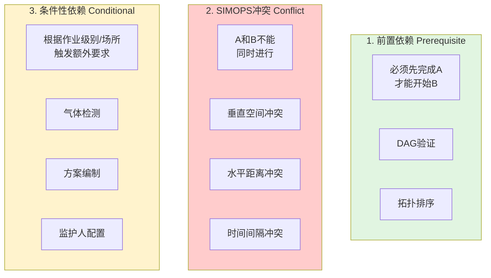

# 依赖检测与执行编排

> **文档版本**: v1.0 | **创建日期**: 2026-03-12
> **适用系统**: 作业票管理系统 | **设计模式**: DAG + SIMOPS
> **关联文档**: [总览](./00-总览.md) | [动态表单架构设计](./03-动态表单架构设计.md) | [数据模型与状态机](./05-数据模型与状态机.md)

---

## 📋 设计目标

依赖检测与执行编排的核心目标是：确保多个作业表之间的**安全协调**，防止违规操作和安全事故。

**关键指标**：
- 依赖检测准确率 = 100%（不允许遗漏）
- 依赖检测响应时间 < 1.5s（P95）
- 循环依赖检测覆盖率 = 100%
- SIMOPS冲突检测覆盖率 = 100%

---

## 🏗️ 三类依赖关系

### 依赖关系总览



### 依赖关系对比

| 依赖类型 | 触发时机 | 检测方式 | 违规后果 | 示例 |
|---------|---------|---------|---------|------|
| **前置依赖** | 作业表创建/审批时 | DAG验证 | 阻止审批 | 盲板抽堵 → 受限空间 |
| **SIMOPS冲突** | 作业表激活时 | 地理围栏 | 阻止激活 | 动火 ↔ 受限空间（15米） |
| **条件性依赖** | 作业表填写时 | 规则评估 | 提示补充 | 特级动火 → 气体检测 |

---

## 📐 前置依赖检查算法

### DAG验证与循环依赖检测

```typescript
class PrerequisiteDependencyChecker {
  /**
   * 检测循环依赖（使用DFS）
   * @returns 如果存在循环，返回循环路径；否则返回null
   */
  static detectCyclicDependency(permits: Permit[]): string[] | null {
    const graph = this.buildDependencyGraph(permits);
    const visited = new Set<string>();
    const recStack = new Set<string>();

    for (const permitId of graph.keys()) {
      const cycle = this.dfsDetectCycle(
        permitId,
        graph,
        visited,
        recStack,
        []
      );
      if (cycle) return cycle;
    }

    return null;
  }

  /**
   * DFS检测循环
   */
  private static dfsDetectCycle(
    node: string,
    graph: Map<string, string[]>,
    visited: Set<string>,
    recStack: Set<string>,
    path: string[]
  ): string[] | null {
    visited.add(node);
    recStack.add(node);
    path.push(node);

    for (const neighbor of graph.get(node) || []) {
      if (!visited.has(neighbor)) {
        const cycle = this.dfsDetectCycle(
          neighbor,
          graph,
          visited,
          recStack,
          path
        );
        if (cycle) return cycle;
      } else if (recStack.has(neighbor)) {
        // 找到循环
        const cycleStart = path.indexOf(neighbor);
        return path.slice(cycleStart).concat(neighbor);
      }
    }

    recStack.delete(node);
    path.pop();
    return null;
  }

  /**
   * 构建依赖图
   */
  private static buildDependencyGraph(
    permits: Permit[]
  ): Map<string, string[]> {
    const graph = new Map<string, string[]>();

    for (const permit of permits) {
      if (!graph.has(permit.permitId)) {
        graph.set(permit.permitId, []);
      }

      for (const prereq of permit.dependencies.prerequisites) {
        graph.get(permit.permitId)!.push(prereq.dependsOnPermitId);
      }
    }

    return graph;
  }
}
```

### 拓扑排序（Kahn算法）

```typescript
class PrerequisiteDependencyChecker {
  /**
   * 拓扑排序，返回作业表的推荐执行顺序
   * @returns 排序后的permitId数组，如果存在循环依赖则返回null
   */
  static topologicalSort(permits: Permit[]): string[] | null {
    const graph = this.buildDependencyGraph(permits);
    const inDegree = new Map<string, number>();
    const queue: string[] = [];
    const result: string[] = [];

    // 初始化入度
    for (const [permitId, deps] of graph.entries()) {
      if (!inDegree.has(permitId)) inDegree.set(permitId, 0);
      for (const dep of deps) {
        inDegree.set(dep, (inDegree.get(dep) || 0) + 1);
      }
    }

    // 找到所有入度为0的节点
    for (const [permitId, degree] of inDegree.entries()) {
      if (degree === 0) queue.push(permitId);
    }

    // Kahn算法
    while (queue.length > 0) {
      const current = queue.shift()!;
      result.push(current);

      for (const neighbor of graph.get(current) || []) {
        const newDegree = inDegree.get(neighbor)! - 1;
        inDegree.set(neighbor, newDegree);
        if (newDegree === 0) queue.push(neighbor);
      }
    }

    // 如果结果数量不等于节点数量，说明存在循环依赖
    return result.length === graph.size ? result : null;
  }
}
```

### 前置依赖满足性检查

```typescript
class PrerequisiteDependencyChecker {
  /**
   * 检查特定作业表的前置依赖是否满足
   */
  static checkPrerequisites(
    permit: Permit,
    allPermits: Map<string, Permit>
  ): {
    satisfied: boolean;
    missingDeps: Array<{
      permitId: string;
      permitType: PermitType;
      currentStatus: string;
      requiredStatus: string;
      reason: string;
    }>;
  } {
    const missingDeps = [];

    for (const prereq of permit.dependencies.prerequisites) {
      const depPermit = allPermits.get(prereq.dependsOnPermitId);

      if (!depPermit) {
        missingDeps.push({
          permitId: prereq.dependsOnPermitId,
          permitType: prereq.dependsOnPermitType,
          currentStatus: 'not_found',
          requiredStatus: prereq.requiredStatus,
          reason: prereq.reason
        });
        continue;
      }

      if (depPermit.status !== prereq.requiredStatus) {
        missingDeps.push({
          permitId: prereq.dependsOnPermitId,
          permitType: prereq.dependsOnPermitType,
          currentStatus: depPermit.status,
          requiredStatus: prereq.requiredStatus,
          reason: prereq.reason
        });
      }
    }

    return {
      satisfied: missingDeps.length === 0,
      missingDeps
    };
  }
}
```

---

## 🌍 SIMOPS冲突检测

### 地理围栏工具类

```typescript
class GeofencingUtils {
  /**
   * 计算两点之间的距离（米）- Haversine公式
   */
  static calculateDistance(
    p1: GeoLocation,
    p2: GeoLocation
  ): number {
    const R = 6371000; // 地球半径（米）
    const φ1 = (p1.latitude * Math.PI) / 180;
    const φ2 = (p2.latitude * Math.PI) / 180;
    const Δφ = ((p2.latitude - p1.latitude) * Math.PI) / 180;
    const Δλ = ((p2.longitude - p1.longitude) * Math.PI) / 180;

    const a =
      Math.sin(Δφ / 2) * Math.sin(Δφ / 2) +
      Math.cos(φ1) * Math.cos(φ2) * Math.sin(Δλ / 2) * Math.sin(Δλ / 2);

    const c = 2 * Math.atan2(Math.sqrt(a), Math.sqrt(1 - a));

    return R * c;
  }

  /**
   * 检查点是否在多边形内 - Ray Casting算法
   */
  static isPointInPolygon(
    point: GeoLocation,
    polygon: Polygon
  ): boolean {
    const { latitude: x, longitude: y } = point;
    const points = polygon.points;
    let inside = false;

    for (let i = 0, j = points.length - 1; i < points.length; j = i++) {
      const xi = points[i].latitude;
      const yi = points[i].longitude;
      const xj = points[j].latitude;
      const yj = points[j].longitude;

      const intersect =
        yi > y !== yj > y &&
        x < ((xj - xi) * (y - yi)) / (yj - yi) + xi;

      if (intersect) inside = !inside;
    }

    return inside;
  }

  /**
   * 检查垂直空间冲突
   */
  static checkVerticalConflict(
    upper: Permit,
    lower: Permit
  ): boolean {
    // 检查上方作业是否在下方作业的垂直投影范围内
    if (!upper.location.altitude || !lower.location.altitude) {
      return false;
    }

    if (upper.location.altitude <= lower.location.altitude) {
      return false;
    }

    // 检查水平位置是否重叠
    if (upper.workArea && lower.workArea) {
      return this.checkAreaOverlap(upper.workArea, lower.workArea);
    }

    // 简化检查：距离小于10米视为垂直投影重叠
    const distance = this.calculateDistance(
      upper.location,
      lower.location
    );
    return distance < 10;
  }

  /**
   * 检查两个作业区域是否重叠
   */
  static checkAreaOverlap(
    area1: Polygon,
    area2: Polygon
  ): boolean {
    // 简化实现：检查area1的任一顶点是否在area2内
    for (const point of area1.points) {
      if (this.isPointInPolygon(point, area2)) {
        return true;
      }
    }

    // 检查area2的任一顶点是否在area1内
    for (const point of area2.points) {
      if (this.isPointInPolygon(point, area1)) {
        return true;
      }
    }

    return false;
  }
}
```

### SIMOPS冲突检测器

```typescript
class SimopsConflictDetector {
  /**
   * 检查新作业表与现有活动作业表的SIMOPS冲突
   */
  static checkConflicts(
    newPermit: Permit,
    activePermits: Permit[]
  ): {
    hasConflict: boolean;
    conflicts: Array<{
      conflictPermitId: string;
      conflictType: 'vertical' | 'horizontal' | 'temporal';
      severity: 'prohibit' | 'warning';
      distance?: number;
      message: string;
    }>;
  } {
    const conflicts = [];

    for (const activePermit of activePermits) {
      // 1. 检查垂直空间冲突
      const verticalConflict = this.checkVerticalConflict(
        newPermit,
        activePermit
      );
      if (verticalConflict) conflicts.push(verticalConflict);

      // 2. 检查水平空间冲突
      const horizontalConflict = this.checkHorizontalConflict(
        newPermit,
        activePermit
      );
      if (horizontalConflict) conflicts.push(horizontalConflict);

      // 3. 检查时间冲突
      const temporalConflict = this.checkTemporalConflict(
        newPermit,
        activePermit
      );
      if (temporalConflict) conflicts.push(temporalConflict);
    }

    return {
      hasConflict: conflicts.length > 0,
      conflicts
    };
  }

  /**
   * 检查垂直空间冲突
   */
  private static checkVerticalConflict(
    permit1: Permit,
    permit2: Permit
  ): any | null {
    const upperPermit = this.getUpperPermit(permit1, permit2);
    const lowerPermit = upperPermit === permit1 ? permit2 : permit1;

    if (!upperPermit) return null;

    // 检查上方作业类型
    const prohibitedUpperTypes = [
      PermitType.LIFTING,
      PermitType.WORK_AT_HEIGHT
    ];

    if (!prohibitedUpperTypes.includes(upperPermit.permitType)) {
      return null;
    }

    // 检查下方作业是否在垂直投影范围内
    const isInProjection = GeofencingUtils.checkVerticalConflict(
      upperPermit,
      lowerPermit
    );

    if (isInProjection) {
      return {
        conflictPermitId: lowerPermit.permitId,
        conflictType: 'vertical',
        severity: 'prohibit',
        message: `${this.getPermitTypeName(upperPermit.permitType)}作业下方禁止进行${this.getPermitTypeName(lowerPermit.permitType)}作业`
      };
    }

    return null;
  }

  /**
   * 检查水平空间冲突
   */
  private static checkHorizontalConflict(
    permit1: Permit,
    permit2: Permit
  ): any | null {
    // 定义冲突规则矩阵
    const conflictRules = new Map<
      string,
      { minDistance: number; condition?: string }
    >([
      [`${PermitType.HOT_WORK}-${PermitType.CONFINED_SPACE}`, { minDistance: 15 }],
      [`${PermitType.CONFINED_SPACE}-${PermitType.HOT_WORK}`, { minDistance: 15 }],
      [`${PermitType.HOT_WORK}-${PermitType.EXCAVATION}`, { minDistance: 10, condition: '涉及燃气管线' }],
      [`${PermitType.ROAD_BREAKING}-${PermitType.HOT_WORK}`, { minDistance: 0 }]
    ]);

    const key = `${permit1.permitType}-${permit2.permitType}`;
    const rule = conflictRules.get(key);

    if (!rule) return null;

    const distance = GeofencingUtils.calculateDistance(
      permit1.location,
      permit2.location
    );

    if (distance < rule.minDistance) {
      return {
        conflictPermitId: permit2.permitId,
        conflictType: 'horizontal',
        severity: rule.minDistance === 0 ? 'prohibit' : 'warning',
        distance,
        message:
          rule.minDistance === 0
            ? `${this.getPermitTypeName(permit1.permitType)}与${this.getPermitTypeName(permit2.permitType)}不能在同一区域进行`
            : `${this.getPermitTypeName(permit1.permitType)}与${this.getPermitTypeName(permit2.permitType)}距离${distance.toFixed(1)}米，小于最小安全距离${rule.minDistance}米${rule.condition ? `（${rule.condition}）` : ''}`
      };
    }

    return null;
  }

  /**
   * 检查时间冲突
   */
  private static checkTemporalConflict(
    permit1: Permit,
    permit2: Permit
  ): any | null {
    // 示例：盲板抽堵完成后，需要等待30分钟才能进行动火作业
    if (
      permit1.permitType === PermitType.BLIND_PLATE &&
      permit2.permitType === PermitType.HOT_WORK &&
      permit1.status === 'completed'
    ) {
      const completionTime = permit1.workflow.step6_completion.completedAt;
      const startTime = permit2.validFrom;

      if (completionTime && startTime) {
        const timeGap = (startTime.getTime() - completionTime.getTime()) / 60000;

        if (timeGap < 30) {
          return {
            conflictPermitId: permit2.permitId,
            conflictType: 'temporal',
            severity: 'warning',
            message: `盲板抽堵完成后需等待30分钟才能进行动火作业，当前间隔${timeGap.toFixed(0)}分钟`
          };
        }
      }
    }

    return null;
  }

  private static getUpperPermit(p1: Permit, p2: Permit): Permit | null {
    if (!p1.location.altitude || !p2.location.altitude) return null;
    return p1.location.altitude > p2.location.altitude ? p1 : p2;
  }

  private static getPermitTypeName(type: PermitType): string {
    const names = {
      [PermitType.HOT_WORK]: '动火',
      [PermitType.CONFINED_SPACE]: '受限空间',
      [PermitType.BLIND_PLATE]: '盲板抽堵',
      [PermitType.WORK_AT_HEIGHT]: '高处',
      [PermitType.LIFTING]: '吊装',
      [PermitType.TEMP_ELECTRICITY]: '临时用电',
      [PermitType.EXCAVATION]: '动土',
      [PermitType.ROAD_BREAKING]: '断路'
    };
    return names[type] || type;
  }
}
```

---

## 🔗 相关文档

- **上一篇**：[动态表单架构设计](./03-动态表单架构设计.md)
- **下一篇**：[数据模型与状态机](./05-数据模型与状态机.md)
- **参考**：[作业表依赖引擎详细设计方案](../../分析内容/作业表依赖引擎详细设计方案.md)
