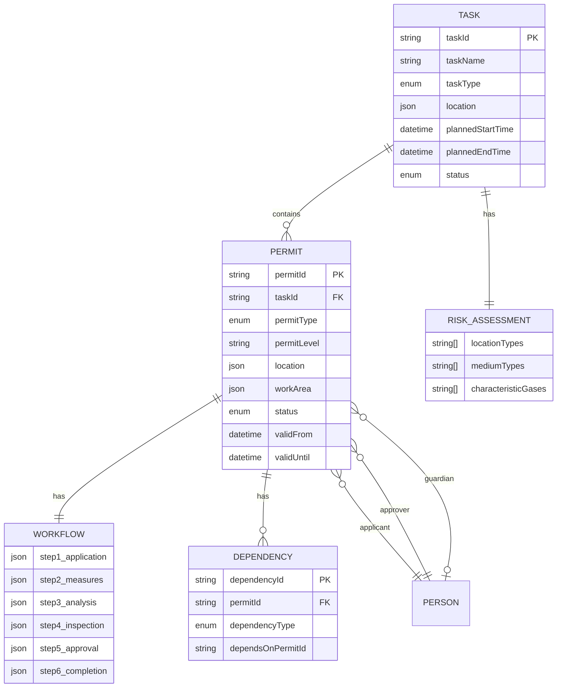
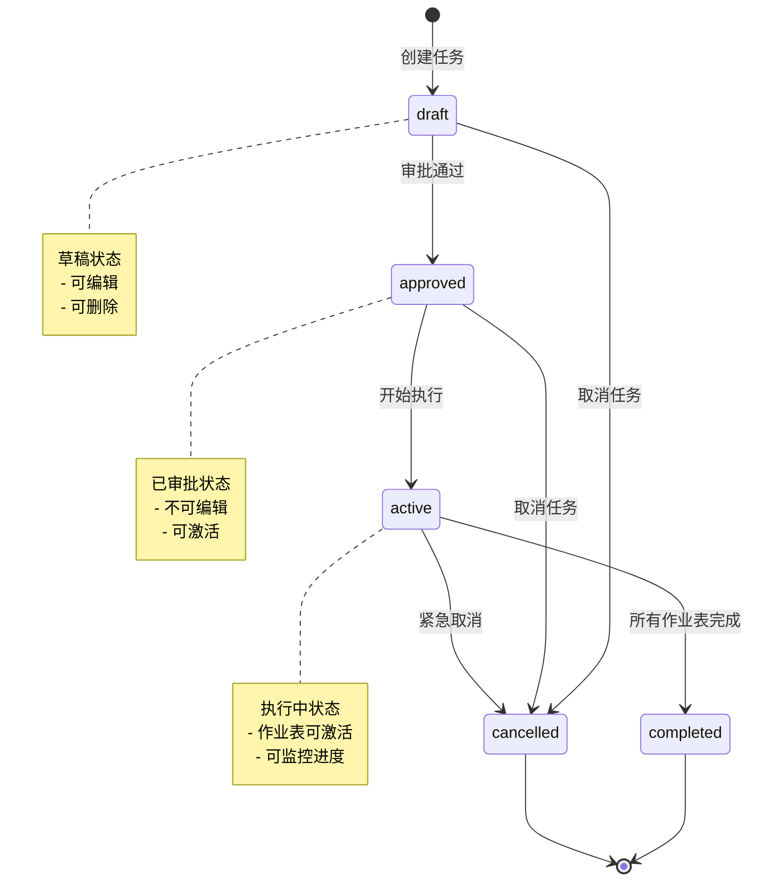
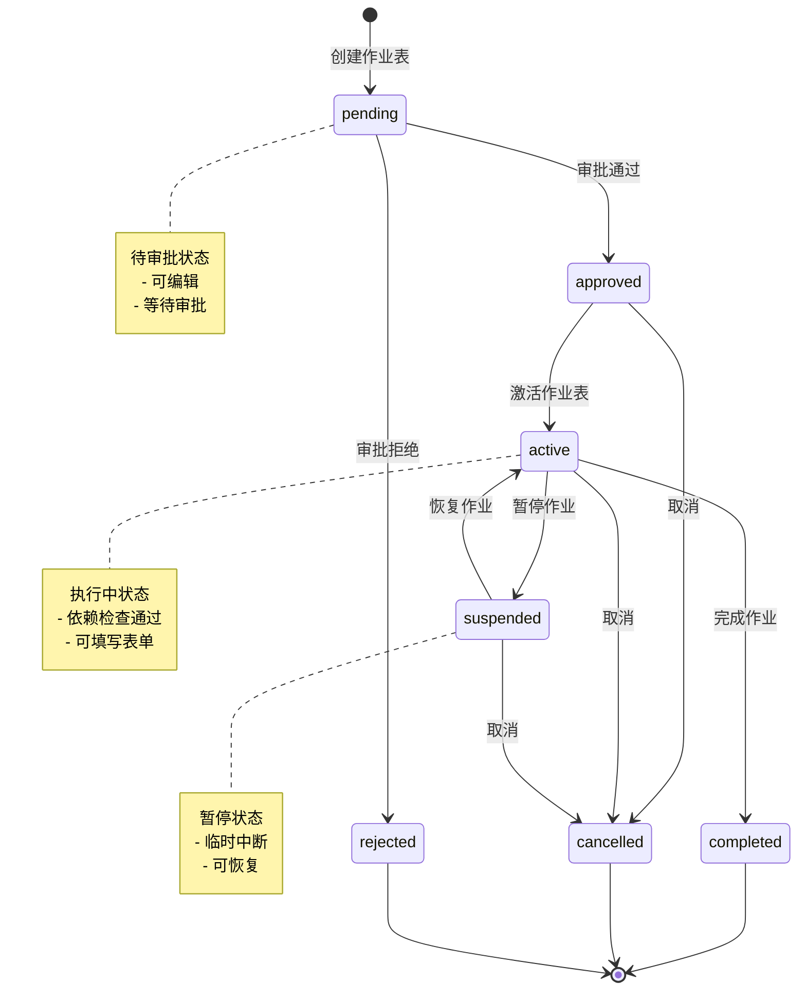

# 数据模型与状态机

> **文档版本**: v1.0 | **创建日期**: 2026-03-12
> **适用系统**: 作业票管理系统 | **设计模式**: 状态机驱动
> **关联文档**: [总览](./00-总览.md) | [依赖检测与执行编排](./04-依赖检测与执行编排.md) | [API接口设计](./06-API接口设计.md)

---

## 📋 核心实体模型

### 实体关系图



---

## 📐 TypeScript 接口定义

### Task（任务实体）

```typescript
interface Task {
  taskId: string;
  taskName: string;
  taskType: 'maintenance' | 'construction' | 'emergency';

  // 地理位置
  location: GeoLocation;

  // 时间规划
  plannedStartTime: Date;
  plannedEndTime: Date;
  actualStartTime?: Date;
  actualEndTime?: Date;

  // 风险辨识
  riskAssessment: RiskAssessment;

  // 关联的作业表
  permits: Permit[];

  // 任务状态
  status: TaskStatus;

  // 人员信息
  createdBy: string;
  createdAt: Date;
  updatedAt: Date;
}

type TaskStatus = 'draft' | 'approved' | 'active' | 'completed' | 'cancelled';

interface RiskAssessment {
  locationTypes: Array<'密闭空间' | '有限空间' | '高处' | '地下' | '水上' | '受限区域'>;
  mediumTypes: Array<'可燃' | '有毒' | '窒息性' | '腐蚀性' | '高温' | '低温' | '高压'>;
  characteristicGases?: Array<'H2' | 'CH4' | 'CO' | 'H2S' | 'NH3' | 'Cl2' | 'SO2'>;
  otherRisks?: string[];
}
```

### Permit（作业表实体）

```typescript
interface Permit {
  permitId: string;
  taskId: string;
  permitType: PermitType;
  permitLevel?: PermitLevel;
  permitName: string;

  // 地理位置
  location: GeoLocation;
  workArea?: Polygon;

  // 人员
  applicant: Person;
  approver?: Person;
  guardian?: Person;

  // 六步流程
  workflow: SixStepWorkflow;

  // 依赖关系
  dependencies: PermitDependencies;

  // 状态
  status: PermitStatus;
  validFrom?: Date;
  validUntil?: Date;

  // 元数据
  createdAt: Date;
  updatedAt: Date;
}

enum PermitType {
  HOT_WORK = 'hotWork',
  CONFINED_SPACE = 'confinedSpace',
  BLIND_PLATE = 'blindPlate',
  WORK_AT_HEIGHT = 'workAtHeight',
  LIFTING = 'lifting',
  TEMP_ELECTRICITY = 'tempElectricity',
  EXCAVATION = 'excavation',
  ROAD_BREAKING = 'roadBreaking'
}

type PermitStatus = 'pending' | 'approved' | 'active' | 'suspended' | 'completed';

interface SixStepWorkflow {
  step1_application: WorkflowStep;
  step2_measures: WorkflowStep;
  step3_analysis: WorkflowStep;
  step4_inspection: WorkflowStep;
  step5_approval: WorkflowStep;
  step6_completion: WorkflowStep;
}

interface WorkflowStep {
  stepId: string;
  stepName: string;
  status: 'pending' | 'in_progress' | 'completed';
  data: Record<string, any>;
  completedBy?: string;
  completedAt?: Date;
}
```

### GeoLocation（地理位置）

```typescript
interface GeoLocation {
  latitude: number;   // 纬度
  longitude: number;  // 经度
  altitude?: number;  // 海拔高度（用于垂直空间冲突检测）
  floor?: string;     // 楼层信息
}

interface Polygon {
  points: GeoLocation[];
  radius?: number; // 圆形作业区域的半径（米）
}
```

---

## 🔄 任务状态机

### 状态转换图



### 状态转换规则

```typescript
class TaskStateMachine {
  /**
   * 状态转换规则
   */
  private static transitions: Record<TaskStatus, TaskStatus[]> = {
    draft: ['approved', 'cancelled'],
    approved: ['active', 'cancelled'],
    active: ['completed', 'cancelled'],
    completed: [],
    cancelled: []
  };

  /**
   * 检查状态转换是否合法
   */
  static canTransition(from: TaskStatus, to: TaskStatus): boolean {
    return this.transitions[from]?.includes(to) || false;
  }

  /**
   * 执行状态转换
   */
  static transition(
    task: Task,
    newStatus: TaskStatus,
    context: TransitionContext
  ): TransitionResult {
    // 1. 检查转换是否合法
    if (!this.canTransition(task.status, newStatus)) {
      return {
        success: false,
        error: `不允许从 ${task.status} 转换到 ${newStatus}`
      };
    }

    // 2. 检查前置条件
    const preconditionCheck = this.checkPreconditions(task, newStatus, context);
    if (!preconditionCheck.passed) {
      return {
        success: false,
        error: preconditionCheck.reason
      };
    }

    // 3. 执行转换
    task.status = newStatus;
    task.updatedAt = new Date();

    // 4. 执行后置动作
    this.executePostActions(task, newStatus, context);

    return { success: true };
  }

  /**
   * 检查前置条件
   */
  private static checkPreconditions(
    task: Task,
    newStatus: TaskStatus,
    context: TransitionContext
  ): { passed: boolean; reason?: string } {
    switch (newStatus) {
      case 'approved':
        // 审批通过：必须有至少一个作业表
        if (task.permits.length === 0) {
          return { passed: false, reason: '任务必须包含至少一个作业表' };
        }
        return { passed: true };

      case 'active':
        // 激活：所有作业表必须已审批
        const allApproved = task.permits.every(p => p.status === 'approved');
        if (!allApproved) {
          return { passed: false, reason: '所有作业表必须先审批通过' };
        }
        return { passed: true };

      case 'completed':
        // 完成：所有作业表必须已完成
        const allCompleted = task.permits.every(p => p.status === 'completed');
        if (!allCompleted) {
          return { passed: false, reason: '所有作业表必须先完成' };
        }
        return { passed: true };

      default:
        return { passed: true };
    }
  }

  /**
   * 执行后置动作
   */
  private static executePostActions(
    task: Task,
    newStatus: TaskStatus,
    context: TransitionContext
  ): void {
    switch (newStatus) {
      case 'active':
        task.actualStartTime = new Date();
        break;

      case 'completed':
        task.actualEndTime = new Date();
        break;
    }
  }
}

interface TransitionContext {
  userId: string;
  reason?: string;
}

interface TransitionResult {
  success: boolean;
  error?: string;
}
```

---

## 🔄 作业表状态机

### 状态转换图



### 状态转换规则

```typescript
class PermitStateMachine {
  private static transitions: Record<PermitStatus, PermitStatus[]> = {
    pending: ['approved', 'rejected'],
    approved: ['active', 'cancelled'],
    active: ['suspended', 'completed', 'cancelled'],
    suspended: ['active', 'cancelled'],
    completed: [],
    rejected: []
  };

  static canTransition(from: PermitStatus, to: PermitStatus): boolean {
    return this.transitions[from]?.includes(to) || false;
  }

  static transition(
    permit: Permit,
    newStatus: PermitStatus,
    allPermits: Permit[],
    context: TransitionContext
  ): TransitionResult {
    if (!this.canTransition(permit.status, newStatus)) {
      return {
        success: false,
        error: `不允许从 ${permit.status} 转换到 ${newStatus}`
      };
    }

    // 检查前置条件
    const preconditionCheck = this.checkPreconditions(
      permit,
      newStatus,
      allPermits,
      context
    );
    if (!preconditionCheck.passed) {
      return {
        success: false,
        error: preconditionCheck.reason
      };
    }

    // 执行转换
    permit.status = newStatus;
    permit.updatedAt = new Date();

    // 执行后置动作
    this.executePostActions(permit, newStatus, context);

    return { success: true };
  }

  private static checkPreconditions(
    permit: Permit,
    newStatus: PermitStatus,
    allPermits: Permit[],
    context: TransitionContext
  ): { passed: boolean; reason?: string } {
    switch (newStatus) {
      case 'active':
        // 激活：检查前置依赖
        const permitMap = new Map(allPermits.map(p => [p.permitId, p]));
        const prereqCheck = PrerequisiteDependencyChecker.checkPrerequisites(
          permit,
          permitMap
        );
        if (!prereqCheck.satisfied) {
          return {
            passed: false,
            reason: `前置依赖未满足：${prereqCheck.missingDeps.map(d => d.reason).join(', ')}`
          };
        }

        // 激活：检查SIMOPS冲突
        const activePermits = allPermits.filter(p => p.status === 'active');
        const simopsCheck = SimopsConflictDetector.checkConflicts(
          permit,
          activePermits
        );
        if (simopsCheck.hasConflict) {
          const prohibitConflicts = simopsCheck.conflicts.filter(
            c => c.severity === 'prohibit'
          );
          if (prohibitConflicts.length > 0) {
            return {
              passed: false,
              reason: `SIMOPS冲突：${prohibitConflicts.map(c => c.message).join(', ')}`
            };
          }
        }

        return { passed: true };

      case 'completed':
        // 完成：六步流程必须全部完成
        const allStepsCompleted = Object.values(permit.workflow).every(
          step => step.status === 'completed'
        );
        if (!allStepsCompleted) {
          return { passed: false, reason: '六步流程必须全部完成' };
        }
        return { passed: true };

      default:
        return { passed: true };
    }
  }

  private static executePostActions(
    permit: Permit,
    newStatus: PermitStatus,
    context: TransitionContext
  ): void {
    switch (newStatus) {
      case 'active':
        permit.validFrom = new Date();
        break;

      case 'completed':
        permit.validUntil = new Date();
        break;
    }
  }
}
```

---

## 🔗 相关文档

- **上一篇**：[依赖检测与执行编排](./04-依赖检测与执行编排.md)
- **下一篇**：[API接口设计](./06-API接口设计.md)
- **参考**：[作业表依赖引擎详细设计方案](../../分析内容/作业表依赖引擎详细设计方案.md)
