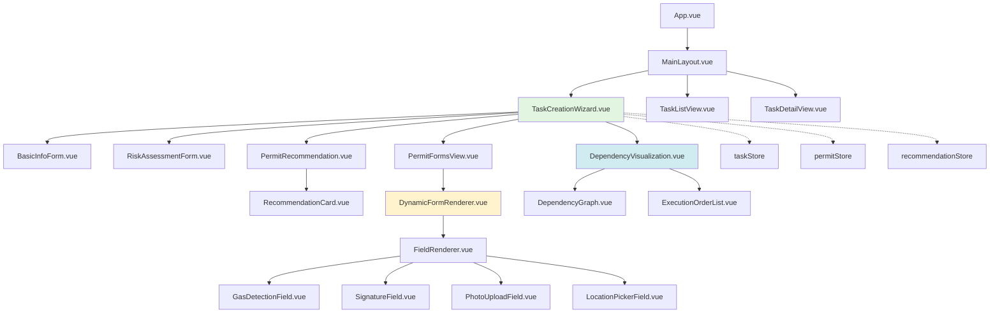

# 前端组件设计

> **文档版本**: v1.0 | **创建日期**: 2026-03-12
> **适用系统**: 作业票管理系统 | **技术栈**: Vue 3 + TypeScript + Pinia
> **关联文档**: [总览](./00-总览.md) | [动态表单架构设计](./03-动态表单架构设计.md) | [API接口设计](./06-API接口设计.md)

---

## 📋 组件架构总览

### 组件依赖关系图



### 组件分层

| 层级 | 组件类型 | 示例 | 职责 |
|------|---------|------|------|
| **视图层（Views）** | 页面级组件 | TaskCreationWizard | 路由入口，组合多个组件 |
| **容器层（Containers）** | 业务容器组件 | PermitRecommendation | 处理业务逻辑，调用API |
| **展示层（Components）** | 纯展示组件 | RecommendationCard | 接收props，触发事件 |
| **基础层（Base）** | 通用组件 | FieldRenderer | 可复用的基础组件 |

---

## 🎨 核心组件清单

### 1. TaskCreationWizard（任务创建向导）

**职责**：统筹整个任务创建流程，管理步骤切换和数据流转。

**Props**:

```typescript
interface TaskCreationWizardProps {
  initialData?: Partial<Task>;
  mode?: 'create' | 'edit';
}
```

**Events**:

```typescript
interface TaskCreationWizardEvents {
  submit: (task: Task) => void;
  cancel: () => void;
  stepChange: (step: number) => void;
}
```

**组件结构**:

```vue
<template>
  <div class="task-creation-wizard">
    <!-- 步骤指示器 -->
    <el-steps :active="currentStep" finish-status="success">
      <el-step title="基础信息" />
      <el-step title="风险辨识" />
      <el-step title="作业表推荐" />
      <el-step title="详细填写" />
      <el-step title="依赖检测" />
    </el-steps>

    <!-- 步骤内容 -->
    <div class="step-content">
      <BasicInfoForm
        v-if="currentStep === 0"
        v-model="taskData.basicInfo"
        @next="handleNext"
      />

      <RiskAssessmentForm
        v-if="currentStep === 1"
        v-model="taskData.riskAssessment"
        @next="handleNext"
        @prev="handlePrev"
      />

      <PermitRecommendation
        v-if="currentStep === 2"
        :risk-assessment="taskData.riskAssessment"
        :task-type="taskData.basicInfo.taskType"
        @confirm="handlePermitSelection"
        @prev="handlePrev"
      />

      <PermitFormsView
        v-if="currentStep === 3"
        :permits="selectedPermits"
        @next="handleNext"
        @prev="handlePrev"
      />

      <DependencyVisualization
        v-if="currentStep === 4"
        :task-id="taskData.taskId"
        :permits="selectedPermits"
        @submit="handleSubmit"
        @prev="handlePrev"
      />
    </div>
  </div>
</template>

<script setup lang="ts">
import { ref, reactive } from 'vue';
import { useTaskStore } from '@/stores/taskStore';

const props = defineProps<TaskCreationWizardProps>();
const emit = defineEmits<TaskCreationWizardEvents>();

const taskStore = useTaskStore();
const currentStep = ref(0);
const taskData = reactive({
  taskId: '',
  basicInfo: {},
  riskAssessment: {},
  selectedPermits: []
});

const handleNext = () => {
  if (currentStep.value < 4) {
    currentStep.value++;
    emit('stepChange', currentStep.value);
  }
};

const handlePrev = () => {
  if (currentStep.value > 0) {
    currentStep.value--;
    emit('stepChange', currentStep.value);
  }
};

const handlePermitSelection = (permits: Permit[]) => {
  taskData.selectedPermits = permits;
  handleNext();
};

const handleSubmit = async () => {
  try {
    const task = await taskStore.createTask(taskData);
    emit('submit', task);
  } catch (error) {
    console.error('创建任务失败:', error);
  }
};
</script>
```

---

### 2. RiskAssessmentForm（风险辨识表单）

**职责**：收集风险辨识信息，支持条件性显示。

**Props**:

```typescript
interface RiskAssessmentFormProps {
  modelValue: RiskAssessment;
}
```

**Events**:

```typescript
interface RiskAssessmentFormEvents {
  'update:modelValue': (value: RiskAssessment) => void;
  next: () => void;
  prev: () => void;
}
```

**组件结构**:

```vue
<template>
  <div class="risk-assessment-form">
    <el-form :model="formData" label-width="120px">
      <!-- 场所类型 -->
      <el-form-item label="作业场所类型">
        <el-checkbox-group v-model="formData.locationTypes">
          <el-checkbox label="密闭空间" />
          <el-checkbox label="有限空间" />
          <el-checkbox label="高处" />
          <el-checkbox label="地下" />
          <el-checkbox label="水上" />
          <el-checkbox label="受限区域" />
        </el-checkbox-group>
      </el-form-item>

      <!-- 介质类型 -->
      <el-form-item label="介质类型">
        <el-checkbox-group v-model="formData.mediumTypes">
          <el-checkbox label="可燃" />
          <el-checkbox label="有毒" />
          <el-checkbox label="窒息性" />
          <el-checkbox label="腐蚀性" />
          <el-checkbox label="高温" />
          <el-checkbox label="低温" />
          <el-checkbox label="高压" />
        </el-checkbox-group>
      </el-form-item>

      <!-- 特征气体（条件性显示） -->
      <el-form-item
        v-if="showCharacteristicGases"
        label="特征气体"
      >
        <el-checkbox-group v-model="formData.characteristicGases">
          <el-checkbox label="H2" />
          <el-checkbox label="CH4" />
          <el-checkbox label="CO" />
          <el-checkbox label="H2S" />
          <el-checkbox label="NH3" />
          <el-checkbox label="Cl2" />
          <el-checkbox label="SO2" />
        </el-checkbox-group>
      </el-form-item>

      <!-- 其他风险 -->
      <el-form-item label="其他风险">
        <el-input
          v-model="formData.otherRisks"
          type="textarea"
          :rows="3"
          placeholder="请描述其他风险因素"
        />
      </el-form-item>
    </el-form>

    <!-- 操作按钮 -->
    <div class="form-actions">
      <el-button @click="emit('prev')">上一步</el-button>
      <el-button type="primary" @click="handleNext">下一步</el-button>
    </div>
  </div>
</template>

<script setup lang="ts">
import { computed, watch } from 'vue';

const props = defineProps<RiskAssessmentFormProps>();
const emit = defineEmits<RiskAssessmentFormEvents>();

const formData = computed({
  get: () => props.modelValue,
  set: (value) => emit('update:modelValue', value)
});

// 条件性显示：当介质类型包含"可燃"或"有毒"时显示特征气体
const showCharacteristicGases = computed(() => {
  return formData.value.mediumTypes?.some(
    type => type === '可燃' || type === '有毒'
  );
});

const handleNext = () => {
  // 验证表单
  if (formData.value.locationTypes?.length === 0) {
    ElMessage.warning('请至少选择一个作业场所类型');
    return;
  }
  if (formData.value.mediumTypes?.length === 0) {
    ElMessage.warning('请至少选择一个介质类型');
    return;
  }
  emit('next');
};

// 监听介质类型变化，自动清空特征气体
watch(
  () => formData.value.mediumTypes,
  (newTypes) => {
    if (!newTypes?.some(type => type === '可燃' || type === '有毒')) {
      formData.value.characteristicGases = [];
    }
  }
);
</script>
```

---

### 3. PermitRecommendation（作业表推荐）

**职责**：展示推荐结果，支持用户调整。

**Props**:

```typescript
interface PermitRecommendationProps {
  riskAssessment: RiskAssessment;
  taskType: string;
}
```

**Events**:

```typescript
interface PermitRecommendationEvents {
  confirm: (permits: Permit[]) => void;
  prev: () => void;
}
```

**组件结构**:

```vue
<template>
  <div class="permit-recommendation">
    <el-alert
      v-if="loading"
      title="正在分析风险并生成推荐..."
      type="info"
      :closable="false"
    />

    <div v-else class="recommendation-grid">
      <!-- 必需类型 -->
      <div class="recommendation-section">
        <h3>必需作业表</h3>
        <div class="card-list">
          <RecommendationCard
            v-for="rec in mandatoryRecommendations"
            :key="rec.permitType"
            :recommendation="rec"
            :selected="true"
            :disabled="true"
            @toggle="handleToggle"
          />
        </div>
      </div>

      <!-- 建议类型 -->
      <div class="recommendation-section">
        <h3>建议作业表</h3>
        <div class="card-list">
          <RecommendationCard
            v-for="rec in recommendedRecommendations"
            :key="rec.permitType"
            :recommendation="rec"
            :selected="selectedPermits.has(rec.permitType)"
            @toggle="handleToggle"
          />
        </div>
      </div>

      <!-- 可选类型 -->
      <div class="recommendation-section">
        <h3>可选作业表</h3>
        <div class="card-list">
          <RecommendationCard
            v-for="rec in optionalRecommendations"
            :key="rec.permitType"
            :recommendation="rec"
            :selected="selectedPermits.has(rec.permitType)"
            @toggle="handleToggle"
          />
        </div>
      </div>
    </div>

    <!-- 操作按钮 -->
    <div class="form-actions">
      <el-button @click="emit('prev')">上一步</el-button>
      <el-button
        type="primary"
        :disabled="selectedPermits.size === 0"
        @click="handleConfirm"
      >
        确认选择（已选 {{ selectedPermits.size }} 个）
      </el-button>
    </div>
  </div>
</template>

<script setup lang="ts">
import { ref, computed, onMounted } from 'vue';
import { useRecommendationStore } from '@/stores/recommendationStore';

const props = defineProps<PermitRecommendationProps>();
const emit = defineEmits<PermitRecommendationEvents>();

const recommendationStore = useRecommendationStore();
const loading = ref(false);
const recommendations = ref<FusedRecommendation[]>([]);
const selectedPermits = ref(new Set<PermitType>());

const mandatoryRecommendations = computed(() =>
  recommendations.value.filter(r => r.category === 'mandatory')
);

const recommendedRecommendations = computed(() =>
  recommendations.value.filter(r => r.category === 'recommended')
);

const optionalRecommendations = computed(() =>
  recommendations.value.filter(r => r.category === 'optional')
);

onMounted(async () => {
  loading.value = true;
  try {
    recommendations.value = await recommendationStore.getRecommendations({
      riskAssessment: props.riskAssessment,
      taskType: props.taskType
    });

    // 自动选中必需和建议类型
    recommendations.value.forEach(rec => {
      if (rec.category === 'mandatory' || rec.category === 'recommended') {
        selectedPermits.value.add(rec.permitType);
      }
    });
  } finally {
    loading.value = false;
  }
});

const handleToggle = (permitType: PermitType, selected: boolean) => {
  if (selected) {
    selectedPermits.value.add(permitType);
  } else {
    selectedPermits.value.delete(permitType);
  }
};

const handleConfirm = () => {
  const permits = recommendations.value
    .filter(rec => selectedPermits.value.has(rec.permitType))
    .map(rec => ({
      permitType: rec.permitType,
      permitName: rec.permitName
    }));

  emit('confirm', permits);
};
</script>
```

---

### 4. DynamicFormRenderer（动态表单渲染器）

**职责**：根据Schema和Layout动态渲染表单。

详细设计参见 [动态表单架构设计](./03-动态表单架构设计.md)。

**核心接口**:

```typescript
interface DynamicFormRendererProps {
  schema: PermitSchema;
  layout: DesktopLayout | MobileLayout;
  initialData?: Record<string, any>;
}

interface DynamicFormRendererEvents {
  submit: (data: Record<string, any>) => void;
  stepChange: (stepId: string) => void;
}
```

---

### 5. DependencyVisualization（依赖关系可视化）

**职责**：展示依赖关系图和执行顺序。

**Props**:

```typescript
interface DependencyVisualizationProps {
  taskId: string;
  permits: Permit[];
}
```

**Events**:

```typescript
interface DependencyVisualizationEvents {
  submit: () => void;
  prev: () => void;
}
```

**组件结构**:

```vue
<template>
  <div class="dependency-visualization">
    <el-tabs v-model="activeTab">
      <!-- 依赖关系图 -->
      <el-tab-pane label="依赖关系图" name="graph">
        <DependencyGraph
          :dependencies="dependencies"
          :permits="permits"
        />
      </el-tab-pane>

      <!-- 执行顺序列表 -->
      <el-tab-pane label="执行顺序" name="order">
        <ExecutionOrderList
          :execution-order="executionOrder"
        />
      </el-tab-pane>
    </el-tabs>

    <!-- 冲突警告 -->
    <el-alert
      v-if="hasConflicts"
      title="检测到SIMOPS冲突"
      type="warning"
      :closable="false"
    >
      <ul>
        <li v-for="conflict in conflicts" :key="conflict.id">
          {{ conflict.message }}
        </li>
      </ul>
    </el-alert>

    <!-- 操作按钮 -->
    <div class="form-actions">
      <el-button @click="emit('prev')">上一步</el-button>
      <el-button
        type="primary"
        :disabled="hasProhibitConflicts"
        @click="emit('submit')"
      >
        提交任务
      </el-button>
    </div>
  </div>
</template>

<script setup lang="ts">
import { ref, computed, onMounted } from 'vue';
import { useDependencyStore } from '@/stores/dependencyStore';

const props = defineProps<DependencyVisualizationProps>();
const emit = defineEmits<DependencyVisualizationEvents>();

const dependencyStore = useDependencyStore();
const activeTab = ref('graph');
const dependencies = ref(null);
const executionOrder = ref([]);

const conflicts = computed(() =>
  dependencies.value?.simopsConflicts || []
);

const hasConflicts = computed(() => conflicts.value.length > 0);

const hasProhibitConflicts = computed(() =>
  conflicts.value.some(c => c.severity === 'prohibit')
);

onMounted(async () => {
  // 检测依赖关系
  dependencies.value = await dependencyStore.detectDependencies({
    taskId: props.taskId,
    permits: props.permits
  });

  // 获取执行顺序
  executionOrder.value = await dependencyStore.getExecutionOrder(
    props.taskId
  );
});
</script>
```

---

## 🗂️ 状态管理（Pinia Stores）

### taskStore

```typescript
import { defineStore } from 'pinia';
import { ref } from 'vue';
import type { Task } from '@/types';
import { taskApi } from '@/api/taskApi';

export const useTaskStore = defineStore('task', () => {
  const tasks = ref<Task[]>([]);
  const currentTask = ref<Task | null>(null);
  const loading = ref(false);

  const createTask = async (taskData: Partial<Task>): Promise<Task> => {
    loading.value = true;
    try {
      const task = await taskApi.create(taskData);
      tasks.value.push(task);
      currentTask.value = task;
      return task;
    } finally {
      loading.value = false;
    }
  };

  const fetchTask = async (taskId: string): Promise<Task> => {
    loading.value = true;
    try {
      const task = await taskApi.getById(taskId);
      currentTask.value = task;
      return task;
    } finally {
      loading.value = false;
    }
  };

  const updateTaskStatus = async (
    taskId: string,
    status: TaskStatus
  ): Promise<void> => {
    await taskApi.updateStatus(taskId, status);
    if (currentTask.value?.taskId === taskId) {
      currentTask.value.status = status;
    }
  };

  return {
    tasks,
    currentTask,
    loading,
    createTask,
    fetchTask,
    updateTaskStatus
  };
});
```

### permitStore

```typescript
import { defineStore } from 'pinia';
import { ref } from 'vue';
import type { Permit } from '@/types';
import { permitApi } from '@/api/permitApi';

export const usePermitStore = defineStore('permit', () => {
  const permits = ref<Permit[]>([]);
  const currentPermit = ref<Permit | null>(null);

  const createPermit = async (permitData: Partial<Permit>): Promise<Permit> => {
    const permit = await permitApi.create(permitData);
    permits.value.push(permit);
    return permit;
  };

  const activatePermit = async (permitId: string): Promise<void> => {
    await permitApi.activate(permitId);
    const permit = permits.value.find(p => p.permitId === permitId);
    if (permit) {
      permit.status = 'active';
      permit.validFrom = new Date();
    }
  };

  const completePermit = async (permitId: string): Promise<void> => {
    await permitApi.complete(permitId);
    const permit = permits.value.find(p => p.permitId === permitId);
    if (permit) {
      permit.status = 'completed';
      permit.validUntil = new Date();
    }
  };

  return {
    permits,
    currentPermit,
    createPermit,
    activatePermit,
    completePermit
  };
});
```

### recommendationStore

```typescript
import { defineStore } from 'pinia';
import { ref } from 'vue';
import type { FusedRecommendation } from '@/types';
import { recommendationApi } from '@/api/recommendationApi';

export const useRecommendationStore = defineStore('recommendation', () => {
  const recommendations = ref<FusedRecommendation[]>([]);
  const loading = ref(false);

  const getRecommendations = async (params: {
    riskAssessment: RiskAssessment;
    taskType: string;
  }): Promise<FusedRecommendation[]> => {
    loading.value = true;
    try {
      const result = await recommendationApi.recommend(params);
      recommendations.value = result;
      return result;
    } finally {
      loading.value = false;
    }
  };

  const submitFeedback = async (feedback: {
    taskId: string;
    accepted: string[];
    rejected: string[];
  }): Promise<void> => {
    await recommendationApi.submitFeedback(feedback);
  };

  return {
    recommendations,
    loading,
    getRecommendations,
    submitFeedback
  };
});
```

---

## 🛣️ 路由设计

```typescript
import { createRouter, createWebHistory } from 'vue-router';

const routes = [
  {
    path: '/',
    component: () => import('@/layouts/MainLayout.vue'),
    children: [
      {
        path: '',
        name: 'Home',
        component: () => import('@/views/HomeView.vue')
      },
      {
        path: 'tasks',
        name: 'TaskList',
        component: () => import('@/views/TaskListView.vue')
      },
      {
        path: 'tasks/create',
        name: 'TaskCreate',
        component: () => import('@/views/TaskCreationWizard.vue'),
        meta: { requiresAuth: true, permission: 'task:create' }
      },
      {
        path: 'tasks/:id',
        name: 'TaskDetail',
        component: () => import('@/views/TaskDetailView.vue'),
        props: true
      },
      {
        path: 'permits/:id',
        name: 'PermitDetail',
        component: () => import('@/views/PermitDetailView.vue'),
        props: true
      }
    ]
  },
  {
    path: '/login',
    name: 'Login',
    component: () => import('@/views/LoginView.vue')
  },
  {
    path: '/:pathMatch(.*)*',
    name: 'NotFound',
    component: () => import('@/views/NotFoundView.vue')
  }
];

const router = createRouter({
  history: createWebHistory(),
  routes
});

// 路由守卫
router.beforeEach((to, from, next) => {
  const token = localStorage.getItem('token');

  if (to.meta.requiresAuth && !token) {
    next({ name: 'Login', query: { redirect: to.fullPath } });
  } else {
    next();
  }
});

export default router;
```

---

## 🔗 相关文档

- **上一篇**：[API接口设计](./06-API接口设计.md)
- **下一篇**：[实施计划与验收标准](./08-实施计划与验收标准.md)
- **参考**：[动态表单架构设计](./03-动态表单架构设计.md)
