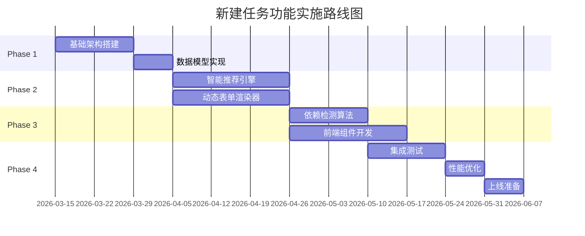
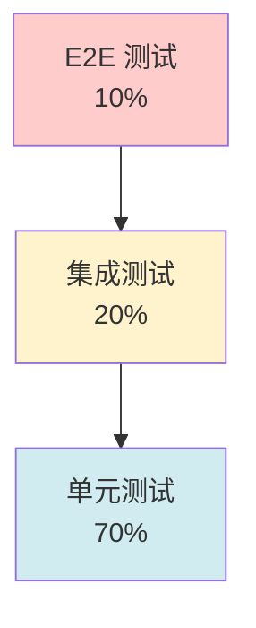

# 实施计划与验收标准

> **文档版本**: v1.0 | **创建日期**: 2026-03-12
> **适用系统**: 作业票管理系统 | **实施周期**: 约 12-16 周
> **关联文档**: [总览](./00-总览.md) | [前端组件设计](./07-前端组件设计.md) | [API接口设计](./06-API接口设计.md)

---

## 📋 实施路线图

### 四阶段实施计划



---

## 🚀 Phase 1: 基础架构搭建（3周）

### 目标

建立项目基础架构，完成数据模型和核心API。

### 任务清单

**Week 1-2: 基础架构**

- [ ] 初始化前端项目（Vue 3 + TypeScript + Vite）
- [ ] 配置 ESLint、Prettier、Husky
- [ ] 搭建后端项目（Node.js/Spring Boot）
- [ ] 配置数据库（PostgreSQL）
- [ ] 设置 Redis 缓存
- [ ] 配置 CI/CD 流水线
- [ ] 建立开发/测试/生产环境

**Week 3: 数据模型实现**

- [ ] 实现 Task 实体和状态机
- [ ] 实现 Permit 实体和状态机
- [ ] 实现 RiskAssessment 模型
- [ ] 实现 GeoLocation 和 Polygon 模型
- [ ] 编写数据库迁移脚本
- [ ] 实现基础 CRUD API
- [ ] 编写单元测试（覆盖率 ≥ 85%）

### 交付物

- ✅ 可运行的前后端项目骨架
- ✅ 数据库 Schema 和迁移脚本
- ✅ 基础 API 文档（Swagger/OpenAPI）
- ✅ 单元测试报告

### 验收标准

- 前后端项目可正常启动
- 数据库连接正常
- 基础 CRUD API 可正常调用
- 单元测试覆盖率 ≥ 85%

---

## 🧠 Phase 2: 核心功能开发（3周）

### 目标

实现智能推荐引擎和动态表单渲染器。

### 任务清单

**Week 4-6: 智能推荐引擎**

- [ ] 实现规则引擎（DSL 解析、规则匹配）
- [ ] 实现特征提取器
- [ ] 训练 ML 模型（可选，使用历史数据）
- [ ] 实现融合算法（规则 70% + ML 30%）
- [ ] 实现推荐结果分级
- [ ] 实现推荐反馈收集
- [ ] 编写推荐引擎单元测试
- [ ] 性能测试（响应时间 < 1s）

**Week 4-6: 动态表单渲染器**

- [ ] 实现 Schema 层（PermitSchema、StepSchema、FieldSchema）
- [ ] 实现 Layout 层（桌面端/移动端布局配置）
- [ ] 实现 FormRenderer 组件
- [ ] 实现 FieldRenderer 组件
- [ ] 实现 ConditionEvaluator（条件性显示）
- [ ] 实现自定义字段组件（气体检测、电子签名、照片上传）
- [ ] 编写组件单元测试
- [ ] 编写 E2E 测试（表单填写流程）

### 交付物

- ✅ 智能推荐引擎（规则引擎 + ML 模型）
- ✅ 动态表单渲染器（支持 8 种作业表类型）
- ✅ 推荐引擎性能测试报告
- ✅ 表单渲染器 E2E 测试报告

### 验收标准

- 推荐引擎准确率 > 90%
- 推荐引擎响应时间 < 1s（P95）
- 动态表单可正确渲染所有作业表类型
- 条件性显示逻辑正确
- 自定义字段组件功能完整

---

## 🔗 Phase 3: 依赖检测与前端集成（5周）

### 目标

实现依赖检测算法，完成前端组件开发和集成。

### 任务清单

**Week 7-8: 依赖检测算法**

- [ ] 实现 DAG 验证（循环依赖检测）
- [ ] 实现拓扑排序（Kahn 算法）
- [ ] 实现前置依赖检查
- [ ] 实现 SIMOPS 冲突检测（垂直、水平、时间）
- [ ] 实现地理围栏工具类（Haversine、Ray Casting）
- [ ] 实现条件性依赖评估
- [ ] 编写依赖检测单元测试
- [ ] 性能测试（响应时间 < 1.5s）

**Week 7-11: 前端组件开发**

- [ ] 实现 TaskCreationWizard（任务创建向导）
- [ ] 实现 BasicInfoForm（基础信息表单）
- [ ] 实现 RiskAssessmentForm（风险辨识表单）
- [ ] 实现 PermitRecommendation（作业表推荐）
- [ ] 实现 PermitFormsView（作业表表单视图）
- [ ] 实现 DependencyVisualization（依赖关系可视化）
- [ ] 实现 DependencyGraph（依赖关系图）
- [ ] 实现 ExecutionOrderList（执行顺序列表）
- [ ] 实现 Pinia Stores（taskStore、permitStore、recommendationStore）
- [ ] 配置路由和权限控制
- [ ] 编写组件单元测试
- [ ] 编写集成测试

### 交付物

- ✅ 依赖检测引擎（DAG + SIMOPS + 条件性依赖）
- ✅ 完整的前端组件库
- ✅ 依赖检测性能测试报告
- ✅ 前端集成测试报告

### 验收标准

- 依赖检测准确率 = 100%
- 依赖检测响应时间 < 1.5s（P95）
- 循环依赖检测覆盖率 = 100%
- SIMOPS 冲突检测覆盖率 = 100%
- 前端组件功能完整
- 用户流程可正常走通

---

## ✅ Phase 4: 测试与上线（4周）

### 目标

完成集成测试、性能优化和上线准备。

### 任务清单

**Week 12-13: 集成测试**

- [ ] 编写端到端测试（完整任务创建流程）
- [ ] 编写接口集成测试
- [ ] 编写性能测试（负载测试、压力测试）
- [ ] 编写安全测试（SQL 注入、XSS、CSRF）
- [ ] 编写兼容性测试（浏览器、设备）
- [ ] 修复测试发现的问题
- [ ] 回归测试

**Week 14: 性能优化**

- [ ] 前端性能优化（代码分割、懒加载、缓存）
- [ ] 后端性能优化（数据库索引、查询优化、缓存策略）
- [ ] 推荐引擎性能优化（规则缓存、模型预加载）
- [ ] 依赖检测性能优化（算法优化、并行计算）
- [ ] 性能测试验证

**Week 15-16: 上线准备**

- [ ] 编写用户手册
- [ ] 编写运维手册
- [ ] 编写 API 文档
- [ ] 准备培训材料
- [ ] 数据迁移（如有）
- [ ] 灰度发布
- [ ] 监控告警配置
- [ ] 正式上线

### 交付物

- ✅ 完整的测试报告（单元、集成、E2E、性能、安全）
- ✅ 性能优化报告
- ✅ 用户手册和运维手册
- ✅ API 文档
- ✅ 上线检查清单

### 验收标准

- 所有测试通过
- 性能指标达标（见下文"性能验收标准"）
- 安全漏洞修复完成
- 文档完整
- 监控告警正常

---

## 🛠️ 技术选型建议

### 前端技术栈

| 技术 | 版本 | 用途 | 理由 |
|------|------|------|------|
| Vue 3 | 3.4+ | 前端框架 | Composition API、TypeScript 支持好 |
| TypeScript | 5.0+ | 类型系统 | 类型安全、代码提示 |
| Vite | 5.0+ | 构建工具 | 快速开发、HMR |
| Element Plus | 2.5+ | UI 组件库 | 组件丰富、文档完善 |
| Pinia | 2.1+ | 状态管理 | 轻量、TypeScript 友好 |
| Vue Router | 4.2+ | 路由管理 | 官方路由库 |
| Axios | 1.6+ | HTTP 客户端 | 拦截器、请求取消 |
| Mermaid.js | 10.0+ | 图表渲染 | 支持流程图、状态图 |
| Leaflet.js | 1.9+ | 地图服务 | 开源、可定制 |

### 后端技术栈

| 技术 | 版本 | 用途 | 理由 |
|------|------|------|------|
| Node.js | 20 LTS | 运行时 | 异步 I/O、生态丰富 |
| Express | 4.18+ | Web 框架 | 轻量、中间件丰富 |
| TypeScript | 5.0+ | 类型系统 | 类型安全 |
| PostgreSQL | 15+ | 关系数据库 | JSONB 支持、GIS 扩展 |
| Redis | 7.0+ | 缓存 | 高性能、数据结构丰富 |
| JWT | - | 认证 | 无状态、跨域友好 |
| Jest | 29+ | 测试框架 | 功能完整、快照测试 |
| Swagger | 3.0 | API 文档 | 自动生成、交互式 |

### 可选技术

| 技术 | 用途 | 说明 |
|------|------|------|
| TensorFlow.js | ML 模型 | 浏览器端推理 |
| ONNX Runtime | ML 模型 | 跨平台推理 |
| D3.js | 数据可视化 | 复杂图表 |
| Socket.io | 实时通信 | WebSocket 封装 |

---

## 📊 测试策略

### 测试金字塔



### 单元测试（70%）

**目标覆盖率**: 85%

**测试范围**:
- 所有工具类函数（100% 覆盖）
- 所有业务逻辑函数（≥ 90% 覆盖）
- 所有 Vue 组件（≥ 80% 覆盖）
- 所有 Pinia Stores（≥ 90% 覆盖）

**测试框架**: Jest + Vue Test Utils

**示例**:

```typescript
// 测试 Haversine 距离计算
describe('GeofencingUtils.calculateDistance', () => {
  it('should calculate correct distance between two points', () => {
    const p1 = { latitude: 39.9042, longitude: 116.4074 }; // 北京
    const p2 = { latitude: 31.2304, longitude: 121.4737 }; // 上海
    const distance = GeofencingUtils.calculateDistance(p1, p2);
    expect(distance).toBeCloseTo(1067000, -3); // 约 1067 公里
  });
});
```

### 集成测试（20%）

**测试范围**:
- API 端点集成测试
- 数据库操作集成测试
- 推荐引擎集成测试
- 依赖检测引擎集成测试

**测试框架**: Jest + Supertest

**示例**:

```typescript
// 测试创建任务 API
describe('POST /api/v1/tasks', () => {
  it('should create task and return 201', async () => {
    const response = await request(app)
      .post('/api/v1/tasks')
      .set('Authorization', `Bearer ${token}`)
      .send({
        taskName: '反应釜检修',
        taskType: 'maintenance',
        location: { latitude: 39.9042, longitude: 116.4074 },
        plannedStartTime: '2026-03-15T08:00:00Z',
        plannedEndTime: '2026-03-15T18:00:00Z',
        riskAssessment: {
          locationTypes: ['密闭空间'],
          mediumTypes: ['可燃']
        }
      });

    expect(response.status).toBe(201);
    expect(response.body.success).toBe(true);
    expect(response.body.data.taskId).toBeDefined();
  });
});
```

### E2E 测试（10%）

**测试范围**:
- 完整任务创建流程
- 作业表激活流程
- 依赖冲突处理流程

**测试框架**: Playwright / Cypress

**示例**:

```typescript
// 测试完整任务创建流程
test('should create task with permits', async ({ page }) => {
  // 1. 登录
  await page.goto('/login');
  await page.fill('input[name="username"]', 'testuser');
  await page.fill('input[name="password"]', 'password');
  await page.click('button[type="submit"]');

  // 2. 进入任务创建页面
  await page.goto('/tasks/create');

  // 3. 填写基础信息
  await page.fill('input[name="taskName"]', '反应釜检修');
  await page.selectOption('select[name="taskType"]', 'maintenance');
  await page.click('button:has-text("下一步")');

  // 4. 风险辨识
  await page.check('input[value="密闭空间"]');
  await page.check('input[value="可燃"]');
  await page.click('button:has-text("下一步")');

  // 5. 确认推荐
  await page.waitForSelector('.recommendation-card');
  await page.click('button:has-text("确认选择")');

  // 6. 填写作业表
  await page.fill('input[name="hotWorkLevel"]', '特级');
  await page.click('button:has-text("下一步")');

  // 7. 提交任务
  await page.click('button:has-text("提交任务")');
  await expect(page.locator('.success-message')).toBeVisible();
});
```

---

## ✅ 验收标准

### 功能验收标准

| 功能模块 | 验收标准 | 优先级 |
|---------|---------|--------|
| **基础信息填写** | 所有必填字段校验正确；地图选点功能正常 | P0 |
| **风险辨识** | 条件性显示逻辑正确；多选功能正常 | P0 |
| **智能推荐** | 推荐准确率 > 90%；响应时间 < 1s | P0 |
| **动态表单** | 8 种作业表类型均可正确渲染；条件性字段显示正确 | P0 |
| **依赖检测** | 循环依赖检测准确率 = 100%；SIMOPS 冲突检测准确率 = 100% | P0 |
| **执行顺序** | 拓扑排序结果正确；执行顺序可视化清晰 | P0 |
| **状态管理** | 任务和作业表状态转换符合状态机规则 | P0 |
| **权限控制** | 不同角色权限隔离正确 | P1 |
| **离线缓存** | 草稿本地缓存；网络恢复后自动同步 | P2 |

### 性能验收标准

| 指标 | 目标值 | 测量方式 |
|------|--------|---------|
| **页面加载时间** | < 2s | P95，Chrome DevTools |
| **推荐引擎响应时间** | < 1s | P95，后端日志 |
| **依赖检测响应时间** | < 1.5s | P95，后端日志 |
| **表单提交响应时间** | < 3s | P95，后端日志 |
| **并发用户数** | ≥ 100 | JMeter 压力测试 |
| **接口性能（测试环境 P95）** | 实时 API ≤ 100ms<br/>用户交互 API ≤ 200ms<br/>后台服务 API ≤ 500ms | 后端日志 |
| **前端包大小** | 初始加载 < 500KB（gzip） | Webpack Bundle Analyzer |
| **内存占用** | < 100MB（桌面端）<br/>< 50MB（移动端） | Chrome DevTools |

### 安全验收标准

| 安全项 | 验收标准 | 检查方式 |
|--------|---------|---------|
| **SQL 注入** | 无 SQL 注入漏洞 | 自动化扫描 + 手工测试 |
| **XSS** | 无 XSS 漏洞 | 自动化扫描 + 手工测试 |
| **CSRF** | CSRF Token 验证正确 | 手工测试 |
| **敏感信息泄露** | 无明文密码、密钥 | 代码审查 |
| **权限绕过** | 无权限绕过漏洞 | 手工测试 |
| **数据加密** | 传输层 TLS 1.3；敏感字段加密 | 配置检查 |
| **会话管理** | 30 分钟无操作自动登出 | 手工测试 |

### 可用性验收标准

| 可用性项 | 验收标准 | 检查方式 |
|---------|---------|---------|
| **响应式设计** | 桌面端（≥1280px）和移动端（≥375px）均正常显示 | 手工测试 |
| **浏览器兼容** | Chrome 90+, Safari 14+, Edge 90+ 均正常 | 手工测试 |
| **无障碍** | 符合 WCAG 2.1 AA 级标准 | axe DevTools |
| **多语言** | 支持中文、英文 | 手工测试 |
| **错误提示** | 所有错误均有友好提示 | 手工测试 |

---

## ⚠️ 风险评估与缓解措施

### 技术风险

| 风险 | 影响 | 概率 | 缓解措施 |
|------|------|------|---------|
| **推荐引擎准确率不达标** | 高 | 中 | 1. 增加规则覆盖<br/>2. 收集更多历史数据训练 ML 模型<br/>3. 提供手动调整功能 |
| **依赖检测性能问题** | 中 | 中 | 1. 算法优化（缓存、并行计算）<br/>2. 限制作业表数量<br/>3. 异步处理 |
| **动态表单渲染性能问题** | 中 | 低 | 1. 虚拟滚动<br/>2. 懒加载<br/>3. 组件缓存 |
| **地理围栏计算精度问题** | 中 | 低 | 1. 使用成熟的地理计算库<br/>2. 增加测试用例<br/>3. 提供手动调整功能 |

### 进度风险

| 风险 | 影响 | 概率 | 缓解措施 |
|------|------|------|---------|
| **需求变更** | 高 | 高 | 1. 需求冻结机制<br/>2. 变更评审流程<br/>3. 预留缓冲时间 |
| **人员变动** | 高 | 中 | 1. 知识文档化<br/>2. 代码审查<br/>3. 结对编程 |
| **技术难点攻关时间超预期** | 中 | 中 | 1. 技术预研<br/>2. 备选方案<br/>3. 及时上报 |

### 质量风险

| 风险 | 影响 | 概率 | 缓解措施 |
|------|------|------|---------|
| **测试覆盖不足** | 高 | 中 | 1. 强制测试覆盖率要求<br/>2. 代码审查<br/>3. 自动化测试 |
| **性能不达标** | 中 | 中 | 1. 性能测试前置<br/>2. 性能监控<br/>3. 性能优化专项 |
| **安全漏洞** | 高 | 低 | 1. 安全编码规范<br/>2. 自动化安全扫描<br/>3. 渗透测试 |

---

## 📋 开发优先级排序

### P0（必须完成）

1. 基础架构搭建
2. 数据模型实现
3. 任务创建流程（基础信息 + 风险辨识）
4. 智能推荐引擎（规则引擎）
5. 动态表单渲染器（核心功能）
6. 依赖检测（前置依赖 + SIMOPS 冲突）
7. 状态管理（任务和作业表状态机）
8. 基础 API（CRUD + 推荐 + 依赖检测）

### P1（重要功能）

1. 推荐引擎 ML 模型
2. 自定义字段组件（气体检测、电子签名、照片上传）
3. 依赖关系可视化
4. 执行顺序展示
5. 权限控制
6. 性能优化

### P2（增强功能）

1. 离线缓存
2. 推荐反馈收集
3. 多语言支持
4. 高级数据可视化
5. 导出功能

---

## 🔗 相关文档

- **上一篇**：[前端组件设计](./07-前端组件设计.md)
- **返回总览**：[总览](./00-总览.md)
- **参考**：[作业表依赖引擎详细设计方案](../../分析内容/作业表依赖引擎详细设计方案.md)
