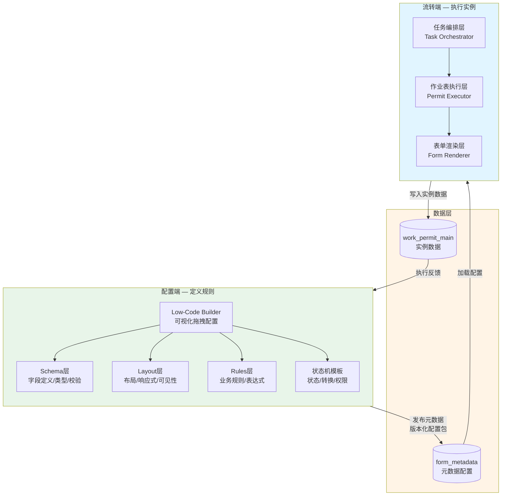
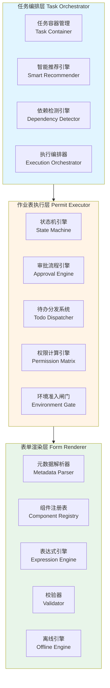
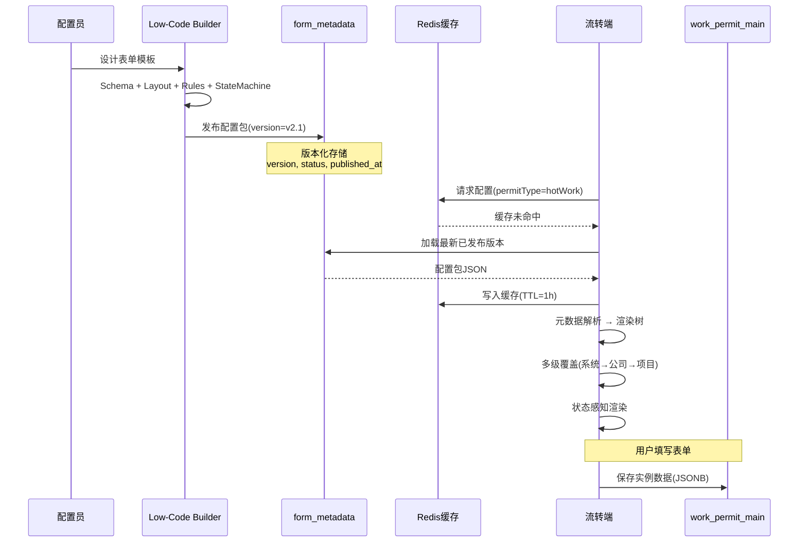

# 01 - 总体架构

> **本章导读**: 本章描述流转端在作业票系统中的定位、三层架构设计、与配置端的数据流转协议，以及元数据配置包的版本化消费机制。
> **对称章节**: [配置端 01-总体架构](../配置端设计方案/01-总体架构.md)

---

## 1.1 流转端定位

### 1.1.1 系统全景

作业票系统采用**配置端 + 流转端**双端架构。配置端负责"定义规则、生产元数据"，流转端负责"消费元数据、驱动任务全生命周期"。



### 1.1.2 职责边界

| 维度 | 配置端 | 流转端 |
|------|--------|--------|
| **核心动作** | 定义、配置、发布 | 创建、审批、执行、关闭 |
| **用户角色** | 系统管理员、配置员 | 作业负责人、安全员、审批人、监护人 |
| **数据方向** | 写入 form_metadata | 读取 form_metadata，写入 work_permit_main |
| **状态机** | 定义状态模板 | 实例化并驱动状态流转 |
| **表单** | 设计表单结构 | 渲染表单并采集数据 |
| **规则** | 配置约束规则 | 运行时执行约束校验 |

---

## 1.2 流转端三层架构



### 1.2.1 任务编排层（Task Orchestrator）

顶层协调者，负责任务的创建、作业表推荐、依赖检测和执行顺序编排。

| 组件 | 职责 | 输入 | 输出 |
|------|------|------|------|
| 任务容器管理 | 管理 Task 聚合根，挂载/卸载 Permit | 用户操作 | Task 实例 |
| 智能推荐引擎 | 基于风险辨识推荐作业表类型 | RiskAssessment | RecommendationList |
| 依赖检测引擎 | DAG 构建、SIMOPS 冲突检测 | Permit[] | DependencyGraph |
| 执行编排器 | 拓扑排序、生成执行计划 | DependencyGraph | ExecutionPlan |

### 1.2.2 作业表执行层（Permit Executor）

中间执行者，负责单个作业表的状态流转、审批、权限控制和环境准入。

| 组件 | 职责 | 触发方式 |
|------|------|---------|
| 状态机引擎 | 驱动 Permit 状态转换，事件驱动 | Event（节点完成/审批通过/超时等） |
| 审批流程引擎 | 多级审批链执行，会签/或签 | 状态转换触发 |
| 待办分发系统 | 生成待办、匹配人员、推送通知 | 状态转换触发 |
| 权限计算引擎 | 运行时计算 状态×角色×字段 权限 | 状态变更/角色切换 |
| 环境准入闸门 | 四步串行准入检查 | Permit 进入 Executing 状态时 |

### 1.2.3 表单渲染层（Form Renderer）

底层渲染者，负责将元数据配置动态渲染为可交互表单，采集并校验数据。

与配置端09章定义的渲染引擎共享核心组件（元数据解析器、组件注册表、表达式引擎），流转端额外增加：
- **状态感知渲染**：根据当前状态+角色动态控制字段权限
- **离线引擎**：现场离线填写，恢复后自动同步

---

## 1.3 数据流转机制

### 1.3.1 配置端→流转端数据流



### 1.3.2 版本化消费协议

流转端消费配置端元数据时，遵循以下版本化协议：

```typescript
interface MetadataConsumptionProtocol {
  // 版本选择策略
  versionStrategy: 'latest_published' | 'pinned';

  // 已创建的任务绑定创建时的配置版本，不随后续发布变化
  versionPinning: {
    rule: 'pin_on_create';
    description: '任务创建时锁定当前配置版本，后续配置更新不影响已创建任务';
  };

  // 新任务使用最新已发布版本
  newTaskVersion: {
    rule: 'use_latest_published';
    description: '新建任务时自动使用最新已发布的配置版本';
  };

  // 缓存策略
  caching: {
    l1: 'local_memory';    // 本地内存缓存，TTL=5min
    l2: 'redis';           // Redis缓存，TTL=1h
    invalidation: 'publish_event'; // 配置发布时主动失效
  };
}
```

**版本兼容性规则**：

| 场景 | 行为 | 说明 |
|------|------|------|
| 新建任务 | 使用最新已发布版本 | 自动获取 |
| 已创建任务 | 锁定创建时版本 | 不受后续发布影响 |
| 配置回滚 | 不影响已创建任务 | 已锁定版本独立 |
| 强制升级 | 管理员手动触发 | 需逐任务确认 |

---

## 1.4 核心接口定义

### 1.4.1 任务编排层接口

```typescript
interface TaskOrchestrator {
  // 创建任务
  createTask(input: CreateTaskInput): Promise<Task>;

  // 获取智能推荐
  getRecommendations(taskId: string): Promise<RecommendationResult>;

  // 检测依赖关系
  detectDependencies(taskId: string): Promise<DependencyGraph>;

  // 生成执行计划
  generateExecutionPlan(taskId: string): Promise<ExecutionPlan>;

  // 提交任务（进入审批）
  submitTask(taskId: string): Promise<void>;
}

interface CreateTaskInput {
  taskName: string;
  taskType: 'maintenance' | 'construction' | 'emergency';
  location: GeoLocation;
  plannedStartTime: Date;
  plannedEndTime: Date;
  riskAssessment: RiskAssessment;
}
```

### 1.4.2 作业表执行层接口

```typescript
interface PermitExecutor {
  // 触发状态转换
  transition(permitId: string, event: StateEvent): Promise<TransitionResult>;

  // 计算当前权限
  computePermissions(
    permitId: string,
    userId: string
  ): Promise<PermissionSet>;

  // 执行环境准入检查
  checkEnvironmentGate(permitId: string): Promise<GateCheckResult>;

  // 获取待办列表
  getTodoList(userId: string, filters?: TodoFilters): Promise<TodoItem[]>;
}

interface StateEvent {
  type: string;           // 事件类型：node_completed, approved, timeout...
  source: string;         // 事件来源
  payload: Record<string, any>;
  triggeredBy: string;    // 触发人
  triggeredAt: Date;
}
```

---

## 1.5 与配置端的关联

| 配置端章节 | 流转端对应 | 关系 |
|-----------|-----------|------|
| 01-总体架构 | 本章 | 配置端讲"如何生产元数据"，本章讲"如何消费元数据" |
| 02-核心概念 | 02-核心概念与领域模型 | 配置时概念 → 运行时实例化 |
| 07-状态机设计 | 03-统一状态机设计 | 配置端定义模板 → 流转端实例化驱动 |
| 09-表单渲染引擎 | 09-表单渲染与数据采集 | 共享渲染核心，流转端增加状态感知+离线 |
| 13-环境准入闸门 | 08-环境准入与现场执行 | 配置端定义组件 → 流转端运行时执行 |

---

**上一章**: [00 - 目录](./00-目录.md)

**下一章**: [02 - 核心概念与领域模型](./02-核心概念与领域模型.md)
