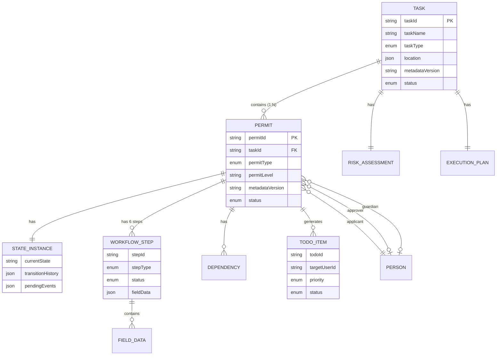
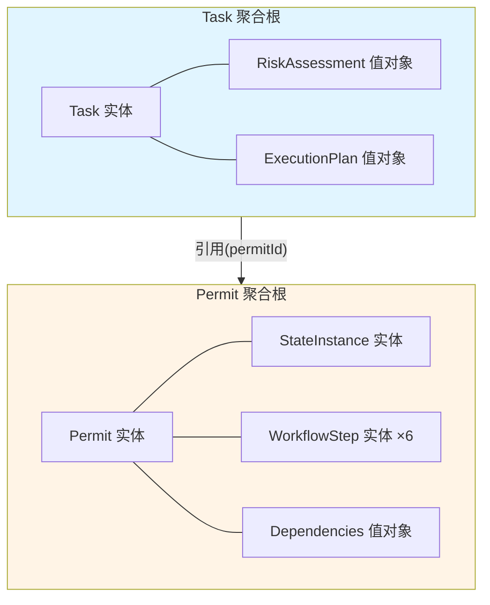
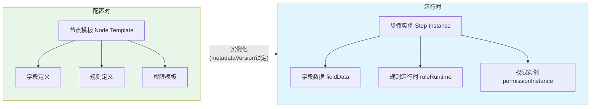

# 02 - 核心概念与领域模型

> **本章导读**: 本章定义流转端的核心领域概念，包括任务容器、Task-Permit双层模型、执行上下文和节点实例化机制。
> **对称章节**: [配置端 02-核心概念](../配置端设计方案/02-核心概念.md)

---

## 2.1 领域模型总览

### 2.1.1 实体关系图



### 2.1.2 聚合边界



---

## 2.2 任务容器（Task Container）

Task 是流转端的顶层聚合根，作为逻辑容器挂载多个作业表（Permit）。

### 2.2.1 Task 运行时模型

```typescript
interface Task {
  taskId: string;
  taskName: string;
  taskType: 'maintenance' | 'construction' | 'emergency';

  // 地理位置
  location: GeoLocation;

  // 时间规划
  plannedStartTime: Date;
  plannedEndTime: Date;
  actualStartTime?: Date;
  actualEndTime?: Date;

  // 风险辨识（创建时填写，后续只读）
  riskAssessment: RiskAssessment;

  // 挂载的作业表（主表+子表模式）
  permits: PermitReference[];

  // 执行计划（依赖检测后生成）
  executionPlan?: ExecutionPlan;

  // 元数据版本（创建时锁定）
  metadataVersion: string;

  // 任务状态
  status: TaskStatus;

  // 审计信息
  createdBy: string;
  createdAt: Date;
  updatedAt: Date;
}

// 主表+子表引用（用户要点A：任务粒度平衡）
interface PermitReference {
  permitId: string;
  permitType: PermitType;
  isLocked: boolean;       // 是否被权限锁定
  lockReason?: string;     // 锁定原因
  executionOrder: number;  // 执行顺序
}
```

### 2.2.2 主表+子表权限锁定

流转时可只针对部分作业表进行权限锁定，其余作业表保持可编辑状态。

| 场景 | 行为 | 示例 |
|------|------|------|
| 部分审批通过 | 已审批的 Permit 锁定，未审批的可编辑 | 动火票已批准（锁定），高处票待审批（可编辑） |
| 部分执行中 | 执行中的 Permit 仅允许填写当前步骤 | 受限空间票执行中（仅当前步骤可填） |
| 紧急暂停 | 指定 Permit 暂停，其余继续 | 动火票暂停（锁定），临时用电继续 |

---

## 2.3 作业表（Permit）运行时模型

### 2.3.1 Permit 完整定义

```typescript
interface Permit {
  permitId: string;
  taskId: string;
  permitType: PermitType;
  permitLevel?: PermitLevel;
  permitName: string;

  // 地理位置（继承自Task或独立指定）
  location: GeoLocation;
  workArea?: Polygon;

  // 人员
  applicant: Person;
  approver?: Person;
  guardian?: Person;

  // 六步流程（运行时实例）
  workflow: SixStepWorkflow;

  // 状态机实例
  stateInstance: StateInstance;

  // 依赖关系
  dependencies: PermitDependencies;

  // 有效期
  validFrom?: Date;
  validUntil?: Date;

  // 元数据版本（创建时从Task继承并锁定）
  metadataVersion: string;

  // 审计
  createdAt: Date;
  updatedAt: Date;
}

enum PermitType {
  HOT_WORK = 'hotWork',           // 动火作业
  CONFINED_SPACE = 'confinedSpace', // 受限空间
  BLIND_PLATE = 'blindPlate',     // 盲板抽堵
  WORK_AT_HEIGHT = 'workAtHeight', // 高处作业
  LIFTING = 'lifting',            // 吊装作业
  TEMP_ELECTRICITY = 'tempElectricity', // 临时用电
  EXCAVATION = 'excavation',      // 动土作业
  ROAD_BREAKING = 'roadBreaking'  // 断路作业
}
```

### 2.3.2 六步流程运行时实例

```typescript
interface SixStepWorkflow {
  step1_application: WorkflowStepInstance;  // 申请
  step2_measures: WorkflowStepInstance;     // 安全措施
  step3_analysis: WorkflowStepInstance;     // 分析检测
  step4_inspection: WorkflowStepInstance;   // 现场检查
  step5_approval: WorkflowStepInstance;     // 审批签字
  step6_completion: WorkflowStepInstance;   // 完工验收
}

interface WorkflowStepInstance {
  stepId: string;
  stepName: string;
  stepType: 'application' | 'measures' | 'analysis'
    | 'inspection' | 'approval' | 'completion';
  status: 'pending' | 'in_progress' | 'completed' | 'skipped';

  // 动态字段数据（由元数据驱动）
  fieldData: Record<string, any>;

  // 步骤级权限（从权限矩阵计算）
  permissions: StepPermissions;

  // 完成信息
  completedBy?: string;
  completedAt?: Date;

  // 签名信息
  signatures?: SignatureRecord[];
}
```

---

## 2.4 执行上下文（Execution Context）

执行上下文是贯穿任务生命周期的运行时状态容器，为表单渲染、权限计算、表达式求值提供统一的上下文数据。

```typescript
interface ExecutionContext {
  // 任务上下文
  task: {
    taskId: string;
    taskType: string;
    status: TaskStatus;
    location: GeoLocation;
    riskAssessment: RiskAssessment;
  };

  // 当前作业表上下文
  permit: {
    permitId: string;
    permitType: PermitType;
    status: PermitStatus;
    currentStep: string;
  };

  // 用户上下文
  user: {
    userId: string;
    userName: string;
    roles: string[];        // 当前用户角色列表
    activeRole: string;     // 当前激活角色
    orgId: string;
    permissions: PermissionSet;
  };

  // 环境上下文
  environment: {
    deviceType: 'pc' | 'mobile';
    isOnline: boolean;
    gpsLocation?: GeoLocation;
    timestamp: Date;
  };

  // 数据上下文（表单已填数据）
  data: Record<string, any>;
}
```

**执行上下文的消费者**：

| 消费者 | 使用场景 |
|--------|---------|
| 表单渲染引擎 | 根据 `permit.status` + `user.activeRole` 决定字段权限 |
| 表达式引擎 | 在表达式中引用 `context.data.fire_level` 等 |
| 权限计算引擎 | 根据 `user.roles` + `permit.status` 计算权限矩阵 |
| 状态机引擎 | 根据上下文判断状态转换前置条件 |
| 待办系统 | 根据 `user.roles` 匹配待办接收人 |

---

## 2.5 节点（Node）vs 步骤（Step）

配置端定义的是**节点模板（Node Template）**，流转端实例化为**步骤实例（Step Instance）**。



**实例化规则**：
- 节点模板中的字段定义 → 生成空的 fieldData 结构
- 节点模板中的规则定义 → 绑定到运行时表达式引擎
- 节点模板中的权限模板 → 结合当前状态+角色计算为权限实例

---

## 2.6 关键值对象

```typescript
// 地理位置
interface GeoLocation {
  latitude: number;
  longitude: number;
  altitude?: number;
  floor?: string;
}

// 作业区域多边形
interface Polygon {
  points: GeoLocation[];
  radius?: number;
}

// 风险评估
interface RiskAssessment {
  locationTypes: LocationType[];
  mediumTypes: MediumType[];
  characteristicGases?: GasType[];
  otherRisks?: string[];
}

// 依赖关系
interface PermitDependencies {
  prerequisites: PrerequisiteDep[];  // 前置依赖
  simops: SimopsDep[];               // SIMOPS约束
  conditional: ConditionalDep[];     // 条件性依赖
}

// 执行计划
interface ExecutionPlan {
  orderedPermits: string[];          // 拓扑排序后的执行顺序
  parallelGroups: string[][];        // 可并行执行的分组
  estimatedTimeline: TimelineEntry[];
  conflicts: ConflictWarning[];      // 冲突警告
}
```

---

**上一章**: [01 - 总体架构](./01-总体架构.md)

**下一章**: [03 - 统一状态机设计](./03-统一状态机设计.md)
